cola Report for GDS4176
==================

**Date**: 2019-12-25 21:13:44 CET, **cola version**: 1.3.2

----------------------------------------------------------------

<style type='text/css'>

body, td, th {
   font-family: Arial,Helvetica,sans-serif;
   background-color: white;
   font-size: 13px;
  max-width: 800px;
  margin: auto;
  margin-left:210px;
  padding: 0px 10px 0px 10px;
  border-left: 1px solid #EEEEEE;
  line-height: 150%;
}

tt, code, pre {
   font-family: 'DejaVu Sans Mono', 'Droid Sans Mono', 'Lucida Console', Consolas, Monaco, 

monospace;
}

h1 {
   font-size:2.2em;
}

h2 {
   font-size:1.8em;
}

h3 {
   font-size:1.4em;
}

h4 {
   font-size:1.0em;
}

h5 {
   font-size:0.9em;
}

h6 {
   font-size:0.8em;
}

a {
  text-decoration: none;
  color: #0366d6;
}

a:hover {
  text-decoration: underline;
}

a:visited {
   color: #0366d6;
}

pre, img {
  max-width: 100%;
}
pre {
  overflow-x: auto;
}
pre code {
   display: block; padding: 0.5em;
}

code {
  font-size: 92%;
  border: 1px solid #ccc;
}

code[class] {
  background-color: #F8F8F8;
}

table, td, th {
  border: 1px solid #ccc;
}

blockquote {
   color:#666666;
   margin:0;
   padding-left: 1em;
   border-left: 0.5em #EEE solid;
}

hr {
   height: 0px;
   border-bottom: none;
   border-top-width: thin;
   border-top-style: dotted;
   border-top-color: #999999;
}

@media print {
   * {
      background: transparent !important;
      color: black !important;
      filter:none !important;
      -ms-filter: none !important;
   }

   body {
      font-size:12pt;
      max-width:100%;
   }

   a, a:visited {
      text-decoration: underline;
   }

   hr {
      visibility: hidden;
      page-break-before: always;
   }

   pre, blockquote {
      padding-right: 1em;
      page-break-inside: avoid;
   }

   tr, img {
      page-break-inside: avoid;
   }

   img {
      max-width: 100% !important;
   }

   @page :left {
      margin: 15mm 20mm 15mm 10mm;
   }

   @page :right {
      margin: 15mm 10mm 15mm 20mm;
   }

   p, h2, h3 {
      orphans: 3; widows: 3;
   }

   h2, h3 {
      page-break-after: avoid;
   }
}
</style>


## Summary


All available functions which can be applied to this `res_list` object:


```r
res_list
```

```
#> A 'ConsensusPartitionList' object with 24 methods.
#>   On a matrix with 51941 rows and 62 columns.
#>   Top rows are extracted by 'SD, CV, MAD, ATC' methods.
#>   Subgroups are detected by 'hclust, kmeans, skmeans, pam, mclust, NMF' method.
#>   Number of partitions are tried for k = 2, 3, 4, 5, 6.
#>   Performed in total 30000 partitions by row resampling.
#> 
#> Following methods can be applied to this 'ConsensusPartitionList' object:
#>  [1] "cola_report"           "collect_classes"       "collect_plots"         "collect_stats"        
#>  [5] "colnames"              "functional_enrichment" "get_anno_col"          "get_anno"             
#>  [9] "get_classes"           "get_matrix"            "get_membership"        "get_stats"            
#> [13] "is_best_k"             "is_stable_k"           "ncol"                  "nrow"                 
#> [17] "rownames"              "show"                  "suggest_best_k"        "test_to_known_factors"
#> [21] "top_rows_heatmap"      "top_rows_overlap"     
#> 
#> You can get result for a single method by, e.g. object["SD", "hclust"] or object["SD:hclust"]
#> or a subset of methods by object[c("SD", "CV")], c("hclust", "kmeans")]
```

The call of `run_all_consensus_partition_methods()` was:


```
#> run_all_consensus_partition_methods(data = mat, mc.cores = 4, anno = anno)
```

Dimension of the input matrix:


```r
mat = get_matrix(res_list)
dim(mat)
```

```
#> [1] 51941    62
```

### Density distribution

The density distribution for each sample is visualized as in one column in the
following heatmap. The clustering is based on the distance which is the
Kolmogorov-Smirnov statistic between two distributions.


```r
library(ComplexHeatmap)
densityHeatmap(mat, top_annotation = HeatmapAnnotation(df = get_anno(res_list), 
    col = get_anno_col(res_list)), ylab = "value", cluster_columns = TRUE, show_column_names = FALSE,
    mc.cores = 4)
```

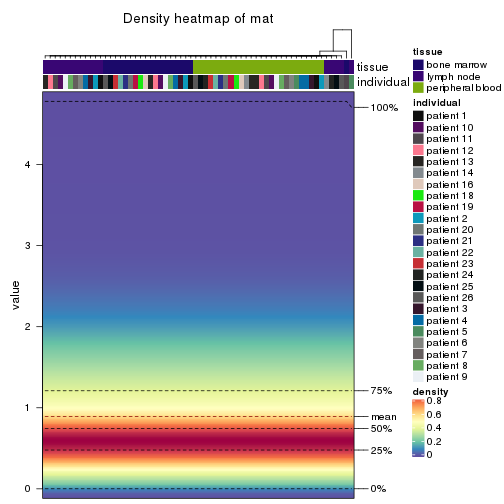


### Suggest the best k


Folowing table shows the best `k` (number of partitions) for each combination
of top-value methods and partition methods. Clicking on the method name in
the table goes to the section for a single combination of methods.

[The cola vignette](http://bioconductor.org/packages/devel/bioc/vignettes/cola/inst/doc/cola.html#toc_13)
explains the definition of the metrics used for determining the best
number of partitions.


```r
suggest_best_k(res_list)
```


|                            | The best k| 1-PAC| Mean silhouette| Concordance|   |Optional k |
|:---------------------------|----------:|-----:|---------------:|-----------:|:--|:----------|
|[ATC:kmeans](#ATC-kmeans)   |          2| 1.000|           1.000|       1.000|** |           |
|[ATC:NMF](#ATC-NMF)         |          2| 1.000|           0.969|       0.986|** |           |
|[SD:skmeans](#SD-skmeans)   |          3| 0.998|           0.951|       0.975|** |2          |
|[MAD:pam](#MAD-pam)         |          6| 0.992|           0.947|       0.974|** |           |
|[ATC:skmeans](#ATC-skmeans) |          4| 0.990|           0.938|       0.965|** |2,3        |
|[MAD:skmeans](#MAD-skmeans) |          3| 0.969|           0.912|       0.961|** |           |
|[SD:pam](#SD-pam)           |          6| 0.941|           0.948|       0.977|*  |           |
|[CV:mclust](#CV-mclust)     |          3| 0.937|           0.960|       0.969|*  |           |
|[SD:NMF](#SD-NMF)           |          2| 0.934|           0.944|       0.973|*  |           |
|[MAD:hclust](#MAD-hclust)   |          6| 0.928|           0.852|       0.908|*  |           |
|[ATC:pam](#ATC-pam)         |          4| 0.926|           0.912|       0.966|*  |2          |
|[CV:NMF](#CV-NMF)           |          2| 0.917|           0.938|       0.970|*  |           |
|[SD:mclust](#SD-mclust)     |          3| 0.897|           0.854|       0.945|   |           |
|[MAD:mclust](#MAD-mclust)   |          3| 0.873|           0.862|       0.943|   |           |
|[ATC:mclust](#ATC-mclust)   |          4| 0.831|           0.871|       0.899|   |           |
|[MAD:NMF](#MAD-NMF)         |          2| 0.810|           0.906|       0.955|   |           |
|[SD:hclust](#SD-hclust)     |          5| 0.772|           0.717|       0.834|   |           |
|[CV:pam](#CV-pam)           |          6| 0.730|           0.827|       0.883|   |           |
|[MAD:kmeans](#MAD-kmeans)   |          3| 0.690|           0.864|       0.866|   |           |
|[ATC:hclust](#ATC-hclust)   |          3| 0.675|           0.827|       0.906|   |           |
|[CV:kmeans](#CV-kmeans)     |          3| 0.630|           0.911|       0.889|   |           |
|[SD:kmeans](#SD-kmeans)     |          3| 0.586|           0.826|       0.841|   |           |
|[CV:skmeans](#CV-skmeans)   |          2| 0.413|           0.829|       0.895|   |           |
|[CV:hclust](#CV-hclust)     |          2| 0.158|           0.573|       0.788|   |           |

\*\*: 1-PAC > 0.95, \*: 1-PAC > 0.9


### CDF of consensus matrices

Cumulative distribution function curves of consensus matrix for all methods.


```r
collect_plots(res_list, fun = plot_ecdf)
```

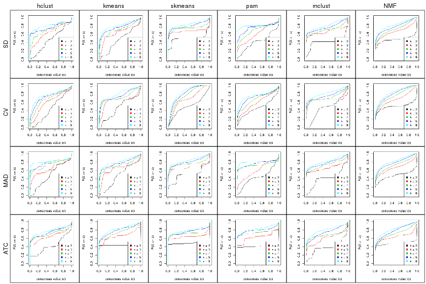


### Consensus heatmap

Consensus heatmaps for all methods. ([What is a consensus heatmap?](http://bioconductor.org/packages/devel/bioc/vignettes/cola/inst/doc/cola.html#toc_9))


<style type='text/css'>


.ui-helper-hidden {
	display: none;
}
.ui-helper-hidden-accessible {
	border: 0;
	clip: rect(0 0 0 0);
	height: 1px;
	margin: -1px;
	overflow: hidden;
	padding: 0;
	position: absolute;
	width: 1px;
}
.ui-helper-reset {
	margin: 0;
	padding: 0;
	border: 0;
	outline: 0;
	line-height: 1.3;
	text-decoration: none;
	font-size: 100%;
	list-style: none;
}
.ui-helper-clearfix:before,
.ui-helper-clearfix:after {
	content: "";
	display: table;
	border-collapse: collapse;
}
.ui-helper-clearfix:after {
	clear: both;
}
.ui-helper-zfix {
	width: 100%;
	height: 100%;
	top: 0;
	left: 0;
	position: absolute;
	opacity: 0;
	filter:Alpha(Opacity=0); 
}

.ui-front {
	z-index: 100;
}


.ui-state-disabled {
	cursor: default !important;
	pointer-events: none;
}


.ui-icon {
	display: inline-block;
	vertical-align: middle;
	margin-top: -.25em;
	position: relative;
	text-indent: -99999px;
	overflow: hidden;
	background-repeat: no-repeat;
}

.ui-widget-icon-block {
	left: 50%;
	margin-left: -8px;
	display: block;
}


.ui-widget-overlay {
	position: fixed;
	top: 0;
	left: 0;
	width: 100%;
	height: 100%;
}
.ui-accordion .ui-accordion-header {
	display: block;
	cursor: pointer;
	position: relative;
	margin: 2px 0 0 0;
	padding: .5em .5em .5em .7em;
	font-size: 100%;
}
.ui-accordion .ui-accordion-content {
	padding: 1em 2.2em;
	border-top: 0;
	overflow: auto;
}
.ui-autocomplete {
	position: absolute;
	top: 0;
	left: 0;
	cursor: default;
}
.ui-menu {
	list-style: none;
	padding: 0;
	margin: 0;
	display: block;
	outline: 0;
}
.ui-menu .ui-menu {
	position: absolute;
}
.ui-menu .ui-menu-item {
	margin: 0;
	cursor: pointer;
	
	list-style-image: url("data:image/gif;base64,R0lGODlhAQABAIAAAAAAAP///yH5BAEAAAAALAAAAAABAAEAAAIBRAA7");
}
.ui-menu .ui-menu-item-wrapper {
	position: relative;
	padding: 3px 1em 3px .4em;
}
.ui-menu .ui-menu-divider {
	margin: 5px 0;
	height: 0;
	font-size: 0;
	line-height: 0;
	border-width: 1px 0 0 0;
}
.ui-menu .ui-state-focus,
.ui-menu .ui-state-active {
	margin: -1px;
}


.ui-menu-icons {
	position: relative;
}
.ui-menu-icons .ui-menu-item-wrapper {
	padding-left: 2em;
}


.ui-menu .ui-icon {
	position: absolute;
	top: 0;
	bottom: 0;
	left: .2em;
	margin: auto 0;
}


.ui-menu .ui-menu-icon {
	left: auto;
	right: 0;
}
.ui-button {
	padding: .4em 1em;
	display: inline-block;
	position: relative;
	line-height: normal;
	margin-right: .1em;
	cursor: pointer;
	vertical-align: middle;
	text-align: center;
	-webkit-user-select: none;
	-moz-user-select: none;
	-ms-user-select: none;
	user-select: none;

	
	overflow: visible;
}

.ui-button,
.ui-button:link,
.ui-button:visited,
.ui-button:hover,
.ui-button:active {
	text-decoration: none;
}


.ui-button-icon-only {
	width: 2em;
	box-sizing: border-box;
	text-indent: -9999px;
	white-space: nowrap;
}


input.ui-button.ui-button-icon-only {
	text-indent: 0;
}


.ui-button-icon-only .ui-icon {
	position: absolute;
	top: 50%;
	left: 50%;
	margin-top: -8px;
	margin-left: -8px;
}

.ui-button.ui-icon-notext .ui-icon {
	padding: 0;
	width: 2.1em;
	height: 2.1em;
	text-indent: -9999px;
	white-space: nowrap;

}

input.ui-button.ui-icon-notext .ui-icon {
	width: auto;
	height: auto;
	text-indent: 0;
	white-space: normal;
	padding: .4em 1em;
}


input.ui-button::-moz-focus-inner,
button.ui-button::-moz-focus-inner {
	border: 0;
	padding: 0;
}
.ui-controlgroup {
	vertical-align: middle;
	display: inline-block;
}
.ui-controlgroup > .ui-controlgroup-item {
	float: left;
	margin-left: 0;
	margin-right: 0;
}
.ui-controlgroup > .ui-controlgroup-item:focus,
.ui-controlgroup > .ui-controlgroup-item.ui-visual-focus {
	z-index: 9999;
}
.ui-controlgroup-vertical > .ui-controlgroup-item {
	display: block;
	float: none;
	width: 100%;
	margin-top: 0;
	margin-bottom: 0;
	text-align: left;
}
.ui-controlgroup-vertical .ui-controlgroup-item {
	box-sizing: border-box;
}
.ui-controlgroup .ui-controlgroup-label {
	padding: .4em 1em;
}
.ui-controlgroup .ui-controlgroup-label span {
	font-size: 80%;
}
.ui-controlgroup-horizontal .ui-controlgroup-label + .ui-controlgroup-item {
	border-left: none;
}
.ui-controlgroup-vertical .ui-controlgroup-label + .ui-controlgroup-item {
	border-top: none;
}
.ui-controlgroup-horizontal .ui-controlgroup-label.ui-widget-content {
	border-right: none;
}
.ui-controlgroup-vertical .ui-controlgroup-label.ui-widget-content {
	border-bottom: none;
}


.ui-controlgroup-vertical .ui-spinner-input {

	
	width: 75%;
	width: calc( 100% - 2.4em );
}
.ui-controlgroup-vertical .ui-spinner .ui-spinner-up {
	border-top-style: solid;
}

.ui-checkboxradio-label .ui-icon-background {
	box-shadow: inset 1px 1px 1px #ccc;
	border-radius: .12em;
	border: none;
}
.ui-checkboxradio-radio-label .ui-icon-background {
	width: 16px;
	height: 16px;
	border-radius: 1em;
	overflow: visible;
	border: none;
}
.ui-checkboxradio-radio-label.ui-checkboxradio-checked .ui-icon,
.ui-checkboxradio-radio-label.ui-checkboxradio-checked:hover .ui-icon {
	background-image: none;
	width: 8px;
	height: 8px;
	border-width: 4px;
	border-style: solid;
}
.ui-checkboxradio-disabled {
	pointer-events: none;
}
.ui-datepicker {
	width: 17em;
	padding: .2em .2em 0;
	display: none;
}
.ui-datepicker .ui-datepicker-header {
	position: relative;
	padding: .2em 0;
}
.ui-datepicker .ui-datepicker-prev,
.ui-datepicker .ui-datepicker-next {
	position: absolute;
	top: 2px;
	width: 1.8em;
	height: 1.8em;
}
.ui-datepicker .ui-datepicker-prev-hover,
.ui-datepicker .ui-datepicker-next-hover {
	top: 1px;
}
.ui-datepicker .ui-datepicker-prev {
	left: 2px;
}
.ui-datepicker .ui-datepicker-next {
	right: 2px;
}
.ui-datepicker .ui-datepicker-prev-hover {
	left: 1px;
}
.ui-datepicker .ui-datepicker-next-hover {
	right: 1px;
}
.ui-datepicker .ui-datepicker-prev span,
.ui-datepicker .ui-datepicker-next span {
	display: block;
	position: absolute;
	left: 50%;
	margin-left: -8px;
	top: 50%;
	margin-top: -8px;
}
.ui-datepicker .ui-datepicker-title {
	margin: 0 2.3em;
	line-height: 1.8em;
	text-align: center;
}
.ui-datepicker .ui-datepicker-title select {
	font-size: 1em;
	margin: 1px 0;
}
.ui-datepicker select.ui-datepicker-month,
.ui-datepicker select.ui-datepicker-year {
	width: 45%;
}
.ui-datepicker table {
	width: 100%;
	font-size: .9em;
	border-collapse: collapse;
	margin: 0 0 .4em;
}
.ui-datepicker th {
	padding: .7em .3em;
	text-align: center;
	font-weight: bold;
	border: 0;
}
.ui-datepicker td {
	border: 0;
	padding: 1px;
}
.ui-datepicker td span,
.ui-datepicker td a {
	display: block;
	padding: .2em;
	text-align: right;
	text-decoration: none;
}
.ui-datepicker .ui-datepicker-buttonpane {
	background-image: none;
	margin: .7em 0 0 0;
	padding: 0 .2em;
	border-left: 0;
	border-right: 0;
	border-bottom: 0;
}
.ui-datepicker .ui-datepicker-buttonpane button {
	float: right;
	margin: .5em .2em .4em;
	cursor: pointer;
	padding: .2em .6em .3em .6em;
	width: auto;
	overflow: visible;
}
.ui-datepicker .ui-datepicker-buttonpane button.ui-datepicker-current {
	float: left;
}


.ui-datepicker.ui-datepicker-multi {
	width: auto;
}
.ui-datepicker-multi .ui-datepicker-group {
	float: left;
}
.ui-datepicker-multi .ui-datepicker-group table {
	width: 95%;
	margin: 0 auto .4em;
}
.ui-datepicker-multi-2 .ui-datepicker-group {
	width: 50%;
}
.ui-datepicker-multi-3 .ui-datepicker-group {
	width: 33.3%;
}
.ui-datepicker-multi-4 .ui-datepicker-group {
	width: 25%;
}
.ui-datepicker-multi .ui-datepicker-group-last .ui-datepicker-header,
.ui-datepicker-multi .ui-datepicker-group-middle .ui-datepicker-header {
	border-left-width: 0;
}
.ui-datepicker-multi .ui-datepicker-buttonpane {
	clear: left;
}
.ui-datepicker-row-break {
	clear: both;
	width: 100%;
	font-size: 0;
}


.ui-datepicker-rtl {
	direction: rtl;
}
.ui-datepicker-rtl .ui-datepicker-prev {
	right: 2px;
	left: auto;
}
.ui-datepicker-rtl .ui-datepicker-next {
	left: 2px;
	right: auto;
}
.ui-datepicker-rtl .ui-datepicker-prev:hover {
	right: 1px;
	left: auto;
}
.ui-datepicker-rtl .ui-datepicker-next:hover {
	left: 1px;
	right: auto;
}
.ui-datepicker-rtl .ui-datepicker-buttonpane {
	clear: right;
}
.ui-datepicker-rtl .ui-datepicker-buttonpane button {
	float: left;
}
.ui-datepicker-rtl .ui-datepicker-buttonpane button.ui-datepicker-current,
.ui-datepicker-rtl .ui-datepicker-group {
	float: right;
}
.ui-datepicker-rtl .ui-datepicker-group-last .ui-datepicker-header,
.ui-datepicker-rtl .ui-datepicker-group-middle .ui-datepicker-header {
	border-right-width: 0;
	border-left-width: 1px;
}


.ui-datepicker .ui-icon {
	display: block;
	text-indent: -99999px;
	overflow: hidden;
	background-repeat: no-repeat;
	left: .5em;
	top: .3em;
}
.ui-dialog {
	position: absolute;
	top: 0;
	left: 0;
	padding: .2em;
	outline: 0;
}
.ui-dialog .ui-dialog-titlebar {
	padding: .4em 1em;
	position: relative;
}
.ui-dialog .ui-dialog-title {
	float: left;
	margin: .1em 0;
	white-space: nowrap;
	width: 90%;
	overflow: hidden;
	text-overflow: ellipsis;
}
.ui-dialog .ui-dialog-titlebar-close {
	position: absolute;
	right: .3em;
	top: 50%;
	width: 20px;
	margin: -10px 0 0 0;
	padding: 1px;
	height: 20px;
}
.ui-dialog .ui-dialog-content {
	position: relative;
	border: 0;
	padding: .5em 1em;
	background: none;
	overflow: auto;
}
.ui-dialog .ui-dialog-buttonpane {
	text-align: left;
	border-width: 1px 0 0 0;
	background-image: none;
	margin-top: .5em;
	padding: .3em 1em .5em .4em;
}
.ui-dialog .ui-dialog-buttonpane .ui-dialog-buttonset {
	float: right;
}
.ui-dialog .ui-dialog-buttonpane button {
	margin: .5em .4em .5em 0;
	cursor: pointer;
}
.ui-dialog .ui-resizable-n {
	height: 2px;
	top: 0;
}
.ui-dialog .ui-resizable-e {
	width: 2px;
	right: 0;
}
.ui-dialog .ui-resizable-s {
	height: 2px;
	bottom: 0;
}
.ui-dialog .ui-resizable-w {
	width: 2px;
	left: 0;
}
.ui-dialog .ui-resizable-se,
.ui-dialog .ui-resizable-sw,
.ui-dialog .ui-resizable-ne,
.ui-dialog .ui-resizable-nw {
	width: 7px;
	height: 7px;
}
.ui-dialog .ui-resizable-se {
	right: 0;
	bottom: 0;
}
.ui-dialog .ui-resizable-sw {
	left: 0;
	bottom: 0;
}
.ui-dialog .ui-resizable-ne {
	right: 0;
	top: 0;
}
.ui-dialog .ui-resizable-nw {
	left: 0;
	top: 0;
}
.ui-draggable .ui-dialog-titlebar {
	cursor: move;
}
.ui-draggable-handle {
	-ms-touch-action: none;
	touch-action: none;
}
.ui-resizable {
	position: relative;
}
.ui-resizable-handle {
	position: absolute;
	font-size: 0.1px;
	display: block;
	-ms-touch-action: none;
	touch-action: none;
}
.ui-resizable-disabled .ui-resizable-handle,
.ui-resizable-autohide .ui-resizable-handle {
	display: none;
}
.ui-resizable-n {
	cursor: n-resize;
	height: 7px;
	width: 100%;
	top: -5px;
	left: 0;
}
.ui-resizable-s {
	cursor: s-resize;
	height: 7px;
	width: 100%;
	bottom: -5px;
	left: 0;
}
.ui-resizable-e {
	cursor: e-resize;
	width: 7px;
	right: -5px;
	top: 0;
	height: 100%;
}
.ui-resizable-w {
	cursor: w-resize;
	width: 7px;
	left: -5px;
	top: 0;
	height: 100%;
}
.ui-resizable-se {
	cursor: se-resize;
	width: 12px;
	height: 12px;
	right: 1px;
	bottom: 1px;
}
.ui-resizable-sw {
	cursor: sw-resize;
	width: 9px;
	height: 9px;
	left: -5px;
	bottom: -5px;
}
.ui-resizable-nw {
	cursor: nw-resize;
	width: 9px;
	height: 9px;
	left: -5px;
	top: -5px;
}
.ui-resizable-ne {
	cursor: ne-resize;
	width: 9px;
	height: 9px;
	right: -5px;
	top: -5px;
}
.ui-progressbar {
	height: 2em;
	text-align: left;
	overflow: hidden;
}
.ui-progressbar .ui-progressbar-value {
	margin: -1px;
	height: 100%;
}
.ui-progressbar .ui-progressbar-overlay {
	background: url("");
	height: 100%;
	filter: alpha(opacity=25); 
	opacity: 0.25;
}
.ui-progressbar-indeterminate .ui-progressbar-value {
	background-image: none;
}
.ui-selectable {
	-ms-touch-action: none;
	touch-action: none;
}
.ui-selectable-helper {
	position: absolute;
	z-index: 100;
	border: 1px dotted black;
}
.ui-selectmenu-menu {
	padding: 0;
	margin: 0;
	position: absolute;
	top: 0;
	left: 0;
	display: none;
}
.ui-selectmenu-menu .ui-menu {
	overflow: auto;
	overflow-x: hidden;
	padding-bottom: 1px;
}
.ui-selectmenu-menu .ui-menu .ui-selectmenu-optgroup {
	font-size: 1em;
	font-weight: bold;
	line-height: 1.5;
	padding: 2px 0.4em;
	margin: 0.5em 0 0 0;
	height: auto;
	border: 0;
}
.ui-selectmenu-open {
	display: block;
}
.ui-selectmenu-text {
	display: block;
	margin-right: 20px;
	overflow: hidden;
	text-overflow: ellipsis;
}
.ui-selectmenu-button.ui-button {
	text-align: left;
	white-space: nowrap;
	width: 14em;
}
.ui-selectmenu-icon.ui-icon {
	float: right;
	margin-top: 0;
}
.ui-slider {
	position: relative;
	text-align: left;
}
.ui-slider .ui-slider-handle {
	position: absolute;
	z-index: 2;
	width: 1.2em;
	height: 1.2em;
	cursor: default;
	-ms-touch-action: none;
	touch-action: none;
}
.ui-slider .ui-slider-range {
	position: absolute;
	z-index: 1;
	font-size: .7em;
	display: block;
	border: 0;
	background-position: 0 0;
}


.ui-slider.ui-state-disabled .ui-slider-handle,
.ui-slider.ui-state-disabled .ui-slider-range {
	filter: inherit;
}

.ui-slider-horizontal {
	height: .8em;
}
.ui-slider-horizontal .ui-slider-handle {
	top: -.3em;
	margin-left: -.6em;
}
.ui-slider-horizontal .ui-slider-range {
	top: 0;
	height: 100%;
}
.ui-slider-horizontal .ui-slider-range-min {
	left: 0;
}
.ui-slider-horizontal .ui-slider-range-max {
	right: 0;
}

.ui-slider-vertical {
	width: .8em;
	height: 100px;
}
.ui-slider-vertical .ui-slider-handle {
	left: -.3em;
	margin-left: 0;
	margin-bottom: -.6em;
}
.ui-slider-vertical .ui-slider-range {
	left: 0;
	width: 100%;
}
.ui-slider-vertical .ui-slider-range-min {
	bottom: 0;
}
.ui-slider-vertical .ui-slider-range-max {
	top: 0;
}
.ui-sortable-handle {
	-ms-touch-action: none;
	touch-action: none;
}
.ui-spinner {
	position: relative;
	display: inline-block;
	overflow: hidden;
	padding: 0;
	vertical-align: middle;
}
.ui-spinner-input {
	border: none;
	background: none;
	color: inherit;
	padding: .222em 0;
	margin: .2em 0;
	vertical-align: middle;
	margin-left: .4em;
	margin-right: 2em;
}
.ui-spinner-button {
	width: 1.6em;
	height: 50%;
	font-size: .5em;
	padding: 0;
	margin: 0;
	text-align: center;
	position: absolute;
	cursor: default;
	display: block;
	overflow: hidden;
	right: 0;
}

.ui-spinner a.ui-spinner-button {
	border-top-style: none;
	border-bottom-style: none;
	border-right-style: none;
}
.ui-spinner-up {
	top: 0;
}
.ui-spinner-down {
	bottom: 0;
}
.ui-tabs {
	position: relative;
	padding: .2em;
}
.ui-tabs .ui-tabs-nav {
	margin: 0;
	padding: .2em .2em 0;
}
.ui-tabs .ui-tabs-nav li {
	list-style: none;
	float: left;
	position: relative;
	top: 0;
	margin: 1px .2em 0 0;
	border-bottom-width: 0;
	padding: 0;
	white-space: nowrap;
}
.ui-tabs .ui-tabs-nav .ui-tabs-anchor {
	float: left;
	padding: .5em 1em;
	text-decoration: none;
}
.ui-tabs .ui-tabs-nav li.ui-tabs-active {
	margin-bottom: -1px;
	padding-bottom: 1px;
}
.ui-tabs .ui-tabs-nav li.ui-tabs-active .ui-tabs-anchor,
.ui-tabs .ui-tabs-nav li.ui-state-disabled .ui-tabs-anchor,
.ui-tabs .ui-tabs-nav li.ui-tabs-loading .ui-tabs-anchor {
	cursor: text;
}
.ui-tabs-collapsible .ui-tabs-nav li.ui-tabs-active .ui-tabs-anchor {
	cursor: pointer;
}
.ui-tabs .ui-tabs-panel {
	display: block;
	border-width: 0;
	padding: 1em 1.4em;
	background: none;
}
.ui-tooltip {
	padding: 8px;
	position: absolute;
	z-index: 9999;
	max-width: 300px;
}
body .ui-tooltip {
	border-width: 2px;
}

.ui-widget {
	font-family: Arial,Helvetica,sans-serif;
	font-size: 1em;
}
.ui-widget .ui-widget {
	font-size: 1em;
}
.ui-widget input,
.ui-widget select,
.ui-widget textarea,
.ui-widget button {
	font-family: Arial,Helvetica,sans-serif;
	font-size: 1em;
}
.ui-widget.ui-widget-content {
	border: 1px solid #c5c5c5;
}
.ui-widget-content {
	border: 1px solid #dddddd;
	background: #ffffff;
	color: #333333;
}
.ui-widget-content a {
	color: #333333;
}
.ui-widget-header {
	border: 1px solid #dddddd;
	background: #e9e9e9;
	color: #333333;
	font-weight: bold;
}
.ui-widget-header a {
	color: #333333;
}


.ui-state-default,
.ui-widget-content .ui-state-default,
.ui-widget-header .ui-state-default,
.ui-button,


html .ui-button.ui-state-disabled:hover,
html .ui-button.ui-state-disabled:active {
	border: 1px solid #c5c5c5;
	background: #f6f6f6;
	font-weight: normal;
	color: #454545;
}
.ui-state-default a,
.ui-state-default a:link,
.ui-state-default a:visited,
a.ui-button,
a:link.ui-button,
a:visited.ui-button,
.ui-button {
	color: #454545;
	text-decoration: none;
}
.ui-state-hover,
.ui-widget-content .ui-state-hover,
.ui-widget-header .ui-state-hover,
.ui-state-focus,
.ui-widget-content .ui-state-focus,
.ui-widget-header .ui-state-focus,
.ui-button:hover,
.ui-button:focus {
	border: 1px solid #cccccc;
	background: #ededed;
	font-weight: normal;
	color: #2b2b2b;
}
.ui-state-hover a,
.ui-state-hover a:hover,
.ui-state-hover a:link,
.ui-state-hover a:visited,
.ui-state-focus a,
.ui-state-focus a:hover,
.ui-state-focus a:link,
.ui-state-focus a:visited,
a.ui-button:hover,
a.ui-button:focus {
	color: #2b2b2b;
	text-decoration: none;
}

.ui-visual-focus {
	box-shadow: 0 0 3px 1px rgb(94, 158, 214);
}
.ui-state-active,
.ui-widget-content .ui-state-active,
.ui-widget-header .ui-state-active,
a.ui-button:active,
.ui-button:active,
.ui-button.ui-state-active:hover {
	border: 1px solid #003eff;
	background: #007fff;
	font-weight: normal;
	color: #ffffff;
}
.ui-icon-background,
.ui-state-active .ui-icon-background {
	border: #003eff;
	background-color: #ffffff;
}
.ui-state-active a,
.ui-state-active a:link,
.ui-state-active a:visited {
	color: #ffffff;
	text-decoration: none;
}


.ui-state-highlight,
.ui-widget-content .ui-state-highlight,
.ui-widget-header .ui-state-highlight {
	border: 1px solid #dad55e;
	background: #fffa90;
	color: #777620;
}
.ui-state-checked {
	border: 1px solid #dad55e;
	background: #fffa90;
}
.ui-state-highlight a,
.ui-widget-content .ui-state-highlight a,
.ui-widget-header .ui-state-highlight a {
	color: #777620;
}
.ui-state-error,
.ui-widget-content .ui-state-error,
.ui-widget-header .ui-state-error {
	border: 1px solid #f1a899;
	background: #fddfdf;
	color: #5f3f3f;
}
.ui-state-error a,
.ui-widget-content .ui-state-error a,
.ui-widget-header .ui-state-error a {
	color: #5f3f3f;
}
.ui-state-error-text,
.ui-widget-content .ui-state-error-text,
.ui-widget-header .ui-state-error-text {
	color: #5f3f3f;
}
.ui-priority-primary,
.ui-widget-content .ui-priority-primary,
.ui-widget-header .ui-priority-primary {
	font-weight: bold;
}
.ui-priority-secondary,
.ui-widget-content .ui-priority-secondary,
.ui-widget-header .ui-priority-secondary {
	opacity: .7;
	filter:Alpha(Opacity=70); 
	font-weight: normal;
}
.ui-state-disabled,
.ui-widget-content .ui-state-disabled,
.ui-widget-header .ui-state-disabled {
	opacity: .35;
	filter:Alpha(Opacity=35); 
	background-image: none;
}
.ui-state-disabled .ui-icon {
	filter:Alpha(Opacity=35); 
}


.ui-icon {
	width: 16px;
	height: 16px;
}
.ui-icon,
.ui-widget-content .ui-icon {
	background-image: url("images/ui-icons_444444_256x240.png");
}
.ui-widget-header .ui-icon {
	background-image: url("images/ui-icons_444444_256x240.png");
}
.ui-state-hover .ui-icon,
.ui-state-focus .ui-icon,
.ui-button:hover .ui-icon,
.ui-button:focus .ui-icon {
	background-image: url("images/ui-icons_555555_256x240.png");
}
.ui-state-active .ui-icon,
.ui-button:active .ui-icon {
	background-image: url("images/ui-icons_ffffff_256x240.png");
}
.ui-state-highlight .ui-icon,
.ui-button .ui-state-highlight.ui-icon {
	background-image: url("images/ui-icons_777620_256x240.png");
}
.ui-state-error .ui-icon,
.ui-state-error-text .ui-icon {
	background-image: url("images/ui-icons_cc0000_256x240.png");
}
.ui-button .ui-icon {
	background-image: url("images/ui-icons_777777_256x240.png");
}


.ui-icon-blank { background-position: 16px 16px; }
.ui-icon-caret-1-n { background-position: 0 0; }
.ui-icon-caret-1-ne { background-position: -16px 0; }
.ui-icon-caret-1-e { background-position: -32px 0; }
.ui-icon-caret-1-se { background-position: -48px 0; }
.ui-icon-caret-1-s { background-position: -65px 0; }
.ui-icon-caret-1-sw { background-position: -80px 0; }
.ui-icon-caret-1-w { background-position: -96px 0; }
.ui-icon-caret-1-nw { background-position: -112px 0; }
.ui-icon-caret-2-n-s { background-position: -128px 0; }
.ui-icon-caret-2-e-w { background-position: -144px 0; }
.ui-icon-triangle-1-n { background-position: 0 -16px; }
.ui-icon-triangle-1-ne { background-position: -16px -16px; }
.ui-icon-triangle-1-e { background-position: -32px -16px; }
.ui-icon-triangle-1-se { background-position: -48px -16px; }
.ui-icon-triangle-1-s { background-position: -65px -16px; }
.ui-icon-triangle-1-sw { background-position: -80px -16px; }
.ui-icon-triangle-1-w { background-position: -96px -16px; }
.ui-icon-triangle-1-nw { background-position: -112px -16px; }
.ui-icon-triangle-2-n-s { background-position: -128px -16px; }
.ui-icon-triangle-2-e-w { background-position: -144px -16px; }
.ui-icon-arrow-1-n { background-position: 0 -32px; }
.ui-icon-arrow-1-ne { background-position: -16px -32px; }
.ui-icon-arrow-1-e { background-position: -32px -32px; }
.ui-icon-arrow-1-se { background-position: -48px -32px; }
.ui-icon-arrow-1-s { background-position: -65px -32px; }
.ui-icon-arrow-1-sw { background-position: -80px -32px; }
.ui-icon-arrow-1-w { background-position: -96px -32px; }
.ui-icon-arrow-1-nw { background-position: -112px -32px; }
.ui-icon-arrow-2-n-s { background-position: -128px -32px; }
.ui-icon-arrow-2-ne-sw { background-position: -144px -32px; }
.ui-icon-arrow-2-e-w { background-position: -160px -32px; }
.ui-icon-arrow-2-se-nw { background-position: -176px -32px; }
.ui-icon-arrowstop-1-n { background-position: -192px -32px; }
.ui-icon-arrowstop-1-e { background-position: -208px -32px; }
.ui-icon-arrowstop-1-s { background-position: -224px -32px; }
.ui-icon-arrowstop-1-w { background-position: -240px -32px; }
.ui-icon-arrowthick-1-n { background-position: 1px -48px; }
.ui-icon-arrowthick-1-ne { background-position: -16px -48px; }
.ui-icon-arrowthick-1-e { background-position: -32px -48px; }
.ui-icon-arrowthick-1-se { background-position: -48px -48px; }
.ui-icon-arrowthick-1-s { background-position: -64px -48px; }
.ui-icon-arrowthick-1-sw { background-position: -80px -48px; }
.ui-icon-arrowthick-1-w { background-position: -96px -48px; }
.ui-icon-arrowthick-1-nw { background-position: -112px -48px; }
.ui-icon-arrowthick-2-n-s { background-position: -128px -48px; }
.ui-icon-arrowthick-2-ne-sw { background-position: -144px -48px; }
.ui-icon-arrowthick-2-e-w { background-position: -160px -48px; }
.ui-icon-arrowthick-2-se-nw { background-position: -176px -48px; }
.ui-icon-arrowthickstop-1-n { background-position: -192px -48px; }
.ui-icon-arrowthickstop-1-e { background-position: -208px -48px; }
.ui-icon-arrowthickstop-1-s { background-position: -224px -48px; }
.ui-icon-arrowthickstop-1-w { background-position: -240px -48px; }
.ui-icon-arrowreturnthick-1-w { background-position: 0 -64px; }
.ui-icon-arrowreturnthick-1-n { background-position: -16px -64px; }
.ui-icon-arrowreturnthick-1-e { background-position: -32px -64px; }
.ui-icon-arrowreturnthick-1-s { background-position: -48px -64px; }
.ui-icon-arrowreturn-1-w { background-position: -64px -64px; }
.ui-icon-arrowreturn-1-n { background-position: -80px -64px; }
.ui-icon-arrowreturn-1-e { background-position: -96px -64px; }
.ui-icon-arrowreturn-1-s { background-position: -112px -64px; }
.ui-icon-arrowrefresh-1-w { background-position: -128px -64px; }
.ui-icon-arrowrefresh-1-n { background-position: -144px -64px; }
.ui-icon-arrowrefresh-1-e { background-position: -160px -64px; }
.ui-icon-arrowrefresh-1-s { background-position: -176px -64px; }
.ui-icon-arrow-4 { background-position: 0 -80px; }
.ui-icon-arrow-4-diag { background-position: -16px -80px; }
.ui-icon-extlink { background-position: -32px -80px; }
.ui-icon-newwin { background-position: -48px -80px; }
.ui-icon-refresh { background-position: -64px -80px; }
.ui-icon-shuffle { background-position: -80px -80px; }
.ui-icon-transfer-e-w { background-position: -96px -80px; }
.ui-icon-transferthick-e-w { background-position: -112px -80px; }
.ui-icon-folder-collapsed { background-position: 0 -96px; }
.ui-icon-folder-open { background-position: -16px -96px; }
.ui-icon-document { background-position: -32px -96px; }
.ui-icon-document-b { background-position: -48px -96px; }
.ui-icon-note { background-position: -64px -96px; }
.ui-icon-mail-closed { background-position: -80px -96px; }
.ui-icon-mail-open { background-position: -96px -96px; }
.ui-icon-suitcase { background-position: -112px -96px; }
.ui-icon-comment { background-position: -128px -96px; }
.ui-icon-person { background-position: -144px -96px; }
.ui-icon-print { background-position: -160px -96px; }
.ui-icon-trash { background-position: -176px -96px; }
.ui-icon-locked { background-position: -192px -96px; }
.ui-icon-unlocked { background-position: -208px -96px; }
.ui-icon-bookmark { background-position: -224px -96px; }
.ui-icon-tag { background-position: -240px -96px; }
.ui-icon-home { background-position: 0 -112px; }
.ui-icon-flag { background-position: -16px -112px; }
.ui-icon-calendar { background-position: -32px -112px; }
.ui-icon-cart { background-position: -48px -112px; }
.ui-icon-pencil { background-position: -64px -112px; }
.ui-icon-clock { background-position: -80px -112px; }
.ui-icon-disk { background-position: -96px -112px; }
.ui-icon-calculator { background-position: -112px -112px; }
.ui-icon-zoomin { background-position: -128px -112px; }
.ui-icon-zoomout { background-position: -144px -112px; }
.ui-icon-search { background-position: -160px -112px; }
.ui-icon-wrench { background-position: -176px -112px; }
.ui-icon-gear { background-position: -192px -112px; }
.ui-icon-heart { background-position: -208px -112px; }
.ui-icon-star { background-position: -224px -112px; }
.ui-icon-link { background-position: -240px -112px; }
.ui-icon-cancel { background-position: 0 -128px; }
.ui-icon-plus { background-position: -16px -128px; }
.ui-icon-plusthick { background-position: -32px -128px; }
.ui-icon-minus { background-position: -48px -128px; }
.ui-icon-minusthick { background-position: -64px -128px; }
.ui-icon-close { background-position: -80px -128px; }
.ui-icon-closethick { background-position: -96px -128px; }
.ui-icon-key { background-position: -112px -128px; }
.ui-icon-lightbulb { background-position: -128px -128px; }
.ui-icon-scissors { background-position: -144px -128px; }
.ui-icon-clipboard { background-position: -160px -128px; }
.ui-icon-copy { background-position: -176px -128px; }
.ui-icon-contact { background-position: -192px -128px; }
.ui-icon-image { background-position: -208px -128px; }
.ui-icon-video { background-position: -224px -128px; }
.ui-icon-script { background-position: -240px -128px; }
.ui-icon-alert { background-position: 0 -144px; }
.ui-icon-info { background-position: -16px -144px; }
.ui-icon-notice { background-position: -32px -144px; }
.ui-icon-help { background-position: -48px -144px; }
.ui-icon-check { background-position: -64px -144px; }
.ui-icon-bullet { background-position: -80px -144px; }
.ui-icon-radio-on { background-position: -96px -144px; }
.ui-icon-radio-off { background-position: -112px -144px; }
.ui-icon-pin-w { background-position: -128px -144px; }
.ui-icon-pin-s { background-position: -144px -144px; }
.ui-icon-play { background-position: 0 -160px; }
.ui-icon-pause { background-position: -16px -160px; }
.ui-icon-seek-next { background-position: -32px -160px; }
.ui-icon-seek-prev { background-position: -48px -160px; }
.ui-icon-seek-end { background-position: -64px -160px; }
.ui-icon-seek-start { background-position: -80px -160px; }

.ui-icon-seek-first { background-position: -80px -160px; }
.ui-icon-stop { background-position: -96px -160px; }
.ui-icon-eject { background-position: -112px -160px; }
.ui-icon-volume-off { background-position: -128px -160px; }
.ui-icon-volume-on { background-position: -144px -160px; }
.ui-icon-power { background-position: 0 -176px; }
.ui-icon-signal-diag { background-position: -16px -176px; }
.ui-icon-signal { background-position: -32px -176px; }
.ui-icon-battery-0 { background-position: -48px -176px; }
.ui-icon-battery-1 { background-position: -64px -176px; }
.ui-icon-battery-2 { background-position: -80px -176px; }
.ui-icon-battery-3 { background-position: -96px -176px; }
.ui-icon-circle-plus { background-position: 0 -192px; }
.ui-icon-circle-minus { background-position: -16px -192px; }
.ui-icon-circle-close { background-position: -32px -192px; }
.ui-icon-circle-triangle-e { background-position: -48px -192px; }
.ui-icon-circle-triangle-s { background-position: -64px -192px; }
.ui-icon-circle-triangle-w { background-position: -80px -192px; }
.ui-icon-circle-triangle-n { background-position: -96px -192px; }
.ui-icon-circle-arrow-e { background-position: -112px -192px; }
.ui-icon-circle-arrow-s { background-position: -128px -192px; }
.ui-icon-circle-arrow-w { background-position: -144px -192px; }
.ui-icon-circle-arrow-n { background-position: -160px -192px; }
.ui-icon-circle-zoomin { background-position: -176px -192px; }
.ui-icon-circle-zoomout { background-position: -192px -192px; }
.ui-icon-circle-check { background-position: -208px -192px; }
.ui-icon-circlesmall-plus { background-position: 0 -208px; }
.ui-icon-circlesmall-minus { background-position: -16px -208px; }
.ui-icon-circlesmall-close { background-position: -32px -208px; }
.ui-icon-squaresmall-plus { background-position: -48px -208px; }
.ui-icon-squaresmall-minus { background-position: -64px -208px; }
.ui-icon-squaresmall-close { background-position: -80px -208px; }
.ui-icon-grip-dotted-vertical { background-position: 0 -224px; }
.ui-icon-grip-dotted-horizontal { background-position: -16px -224px; }
.ui-icon-grip-solid-vertical { background-position: -32px -224px; }
.ui-icon-grip-solid-horizontal { background-position: -48px -224px; }
.ui-icon-gripsmall-diagonal-se { background-position: -64px -224px; }
.ui-icon-grip-diagonal-se { background-position: -80px -224px; }


.ui-corner-all,
.ui-corner-top,
.ui-corner-left,
.ui-corner-tl {
	border-top-left-radius: 3px;
}
.ui-corner-all,
.ui-corner-top,
.ui-corner-right,
.ui-corner-tr {
	border-top-right-radius: 3px;
}
.ui-corner-all,
.ui-corner-bottom,
.ui-corner-left,
.ui-corner-bl {
	border-bottom-left-radius: 3px;
}
.ui-corner-all,
.ui-corner-bottom,
.ui-corner-right,
.ui-corner-br {
	border-bottom-right-radius: 3px;
}


.ui-widget-overlay {
	background: #aaaaaa;
	opacity: .3;
	filter: Alpha(Opacity=30); 
}
.ui-widget-shadow {
	-webkit-box-shadow: 0px 0px 5px #666666;
	box-shadow: 0px 0px 5px #666666;
} 
</style>
<script src='js/jquery-1.12.4.js'></script>
<script src='js/jquery-ui.js'></script>

<script>
$( function() {
	$( '#tabs-collect-consensus-heatmap' ).tabs();
} );
</script>
<div id='tabs-collect-consensus-heatmap'>
<ul>
<li><a href='#tab-collect-consensus-heatmap-1'>k = 2</a></li>
<li><a href='#tab-collect-consensus-heatmap-2'>k = 3</a></li>
<li><a href='#tab-collect-consensus-heatmap-3'>k = 4</a></li>
<li><a href='#tab-collect-consensus-heatmap-4'>k = 5</a></li>
<li><a href='#tab-collect-consensus-heatmap-5'>k = 6</a></li>
</ul>
<div id='tab-collect-consensus-heatmap-1'>
<pre><code class="r">collect_plots(res_list, k = 2, fun = consensus_heatmap, mc.cores = 4)
</code></pre>

<p>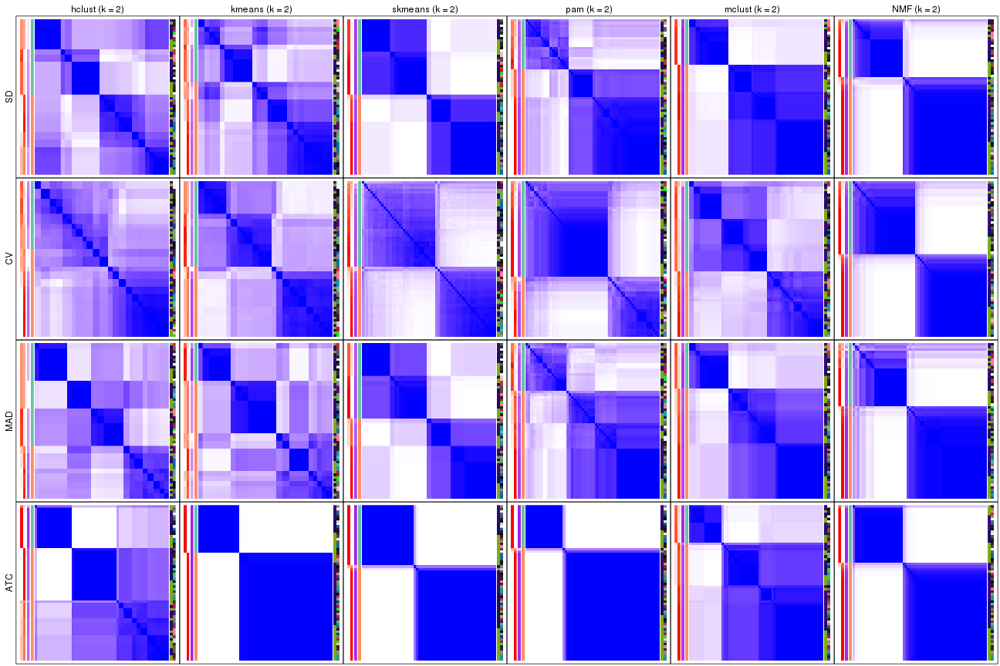</p>

</div>
<div id='tab-collect-consensus-heatmap-2'>
<pre><code class="r">collect_plots(res_list, k = 3, fun = consensus_heatmap, mc.cores = 4)
</code></pre>

<p>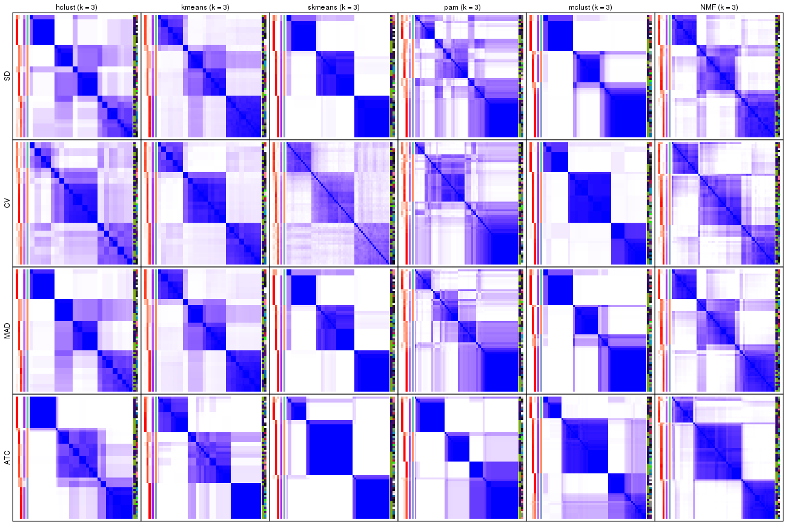</p>

</div>
<div id='tab-collect-consensus-heatmap-3'>
<pre><code class="r">collect_plots(res_list, k = 4, fun = consensus_heatmap, mc.cores = 4)
</code></pre>

<p>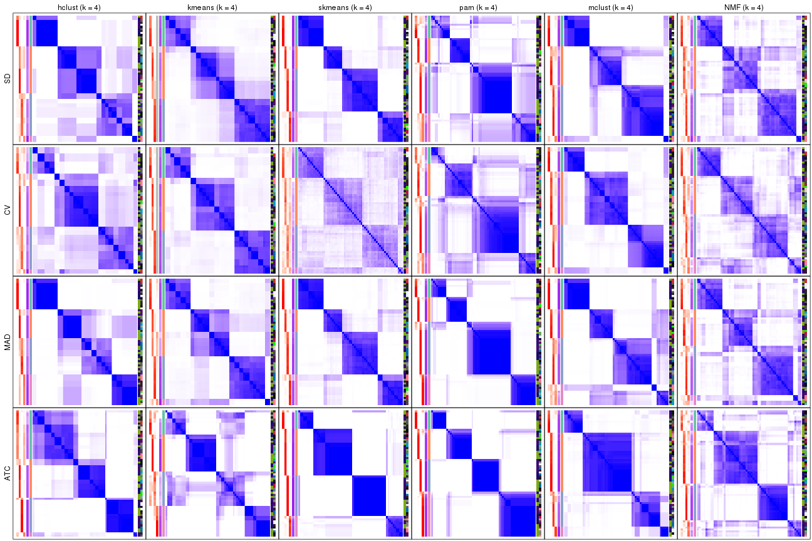</p>

</div>
<div id='tab-collect-consensus-heatmap-4'>
<pre><code class="r">collect_plots(res_list, k = 5, fun = consensus_heatmap, mc.cores = 4)
</code></pre>

<p>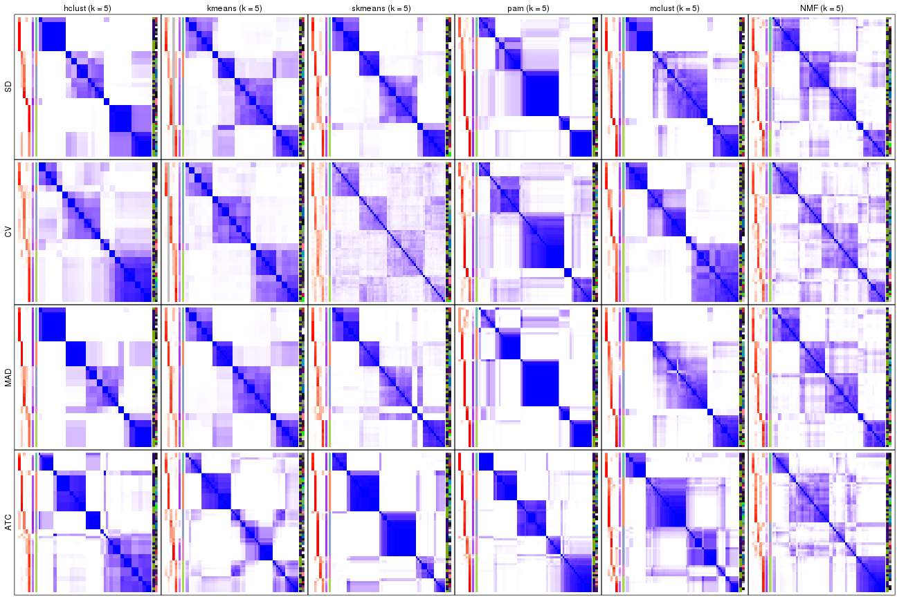</p>

</div>
<div id='tab-collect-consensus-heatmap-5'>
<pre><code class="r">collect_plots(res_list, k = 6, fun = consensus_heatmap, mc.cores = 4)
</code></pre>

<p>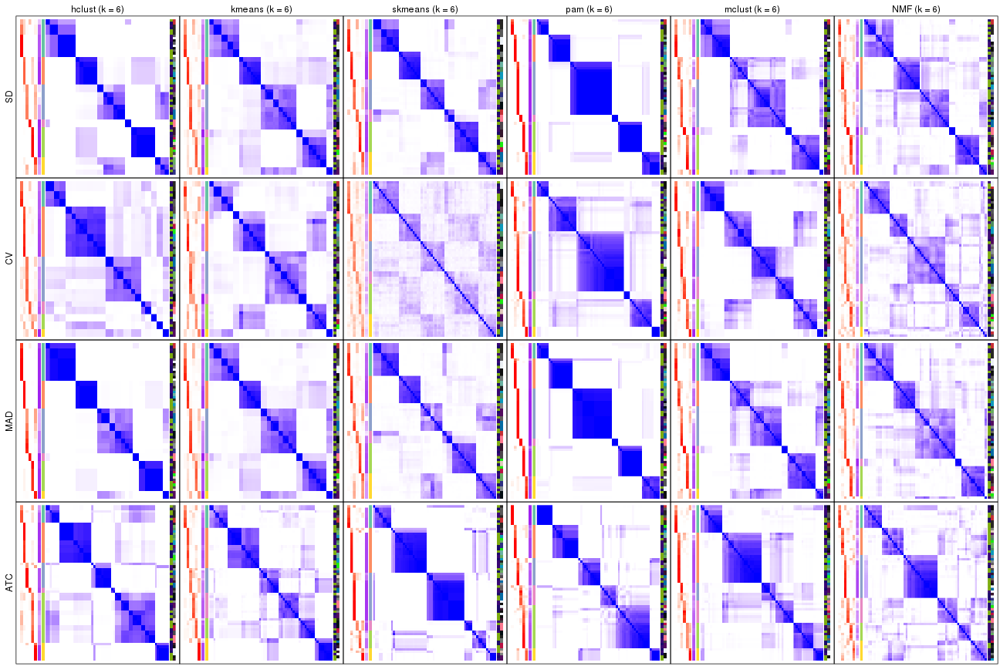</p>

</div>
</div>


### Membership heatmap

Membership heatmaps for all methods. ([What is a membership heatmap?](http://bioconductor.org/packages/devel/bioc/vignettes/cola/inst/doc/cola.html#toc_12))


<script>
$( function() {
	$( '#tabs-collect-membership-heatmap' ).tabs();
} );
</script>
<div id='tabs-collect-membership-heatmap'>
<ul>
<li><a href='#tab-collect-membership-heatmap-1'>k = 2</a></li>
<li><a href='#tab-collect-membership-heatmap-2'>k = 3</a></li>
<li><a href='#tab-collect-membership-heatmap-3'>k = 4</a></li>
<li><a href='#tab-collect-membership-heatmap-4'>k = 5</a></li>
<li><a href='#tab-collect-membership-heatmap-5'>k = 6</a></li>
</ul>
<div id='tab-collect-membership-heatmap-1'>
<pre><code class="r">collect_plots(res_list, k = 2, fun = membership_heatmap, mc.cores = 4)
</code></pre>

<p>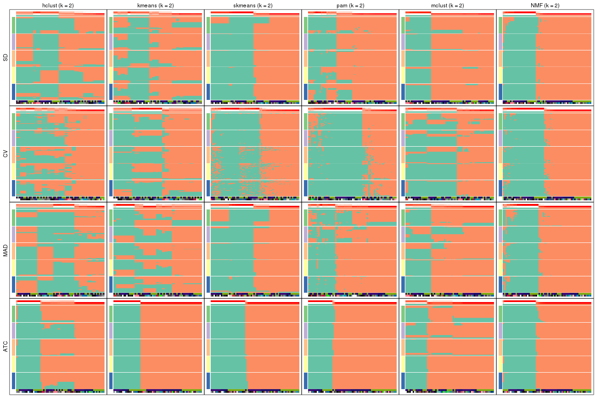</p>

</div>
<div id='tab-collect-membership-heatmap-2'>
<pre><code class="r">collect_plots(res_list, k = 3, fun = membership_heatmap, mc.cores = 4)
</code></pre>

<p>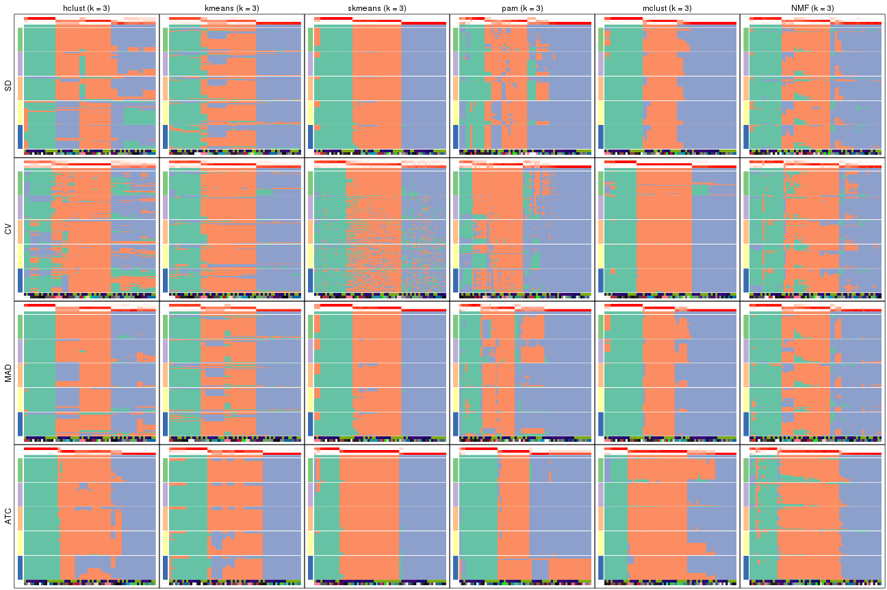</p>

</div>
<div id='tab-collect-membership-heatmap-3'>
<pre><code class="r">collect_plots(res_list, k = 4, fun = membership_heatmap, mc.cores = 4)
</code></pre>

<p>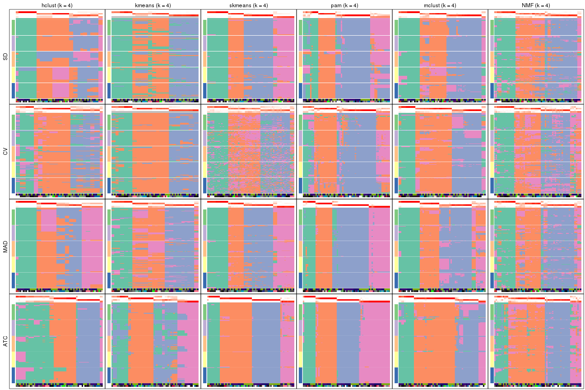</p>

</div>
<div id='tab-collect-membership-heatmap-4'>
<pre><code class="r">collect_plots(res_list, k = 5, fun = membership_heatmap, mc.cores = 4)
</code></pre>

<p>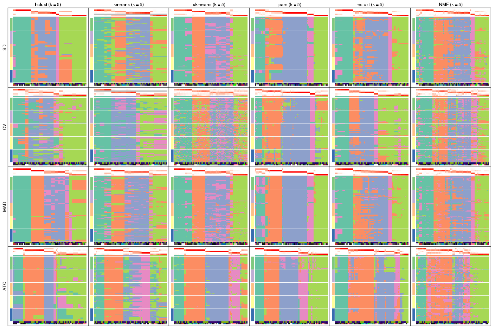</p>

</div>
<div id='tab-collect-membership-heatmap-5'>
<pre><code class="r">collect_plots(res_list, k = 6, fun = membership_heatmap, mc.cores = 4)
</code></pre>

<p>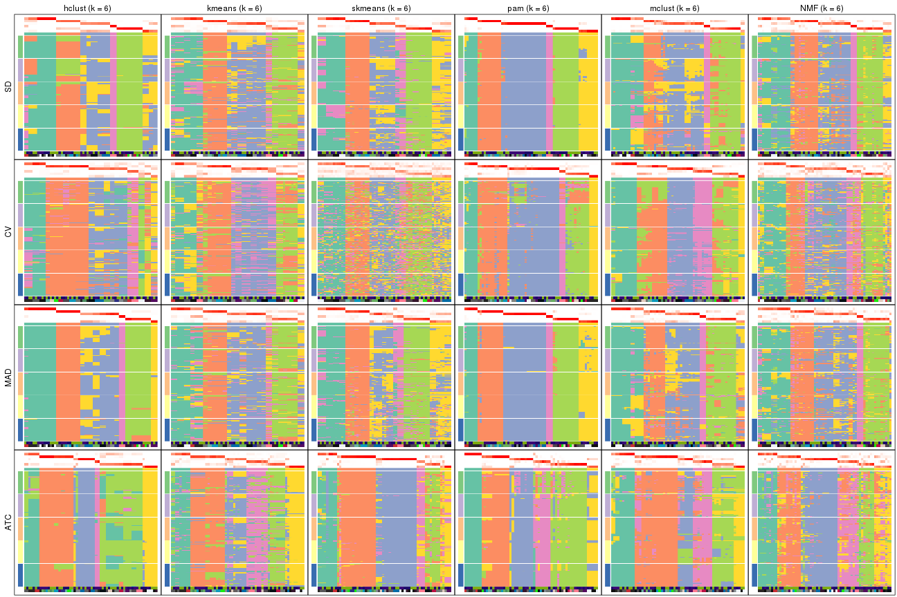</p>

</div>
</div>


### Signature heatmap

Signature heatmaps for all methods. ([What is a signature heatmap?](http://bioconductor.org/packages/devel/bioc/vignettes/cola/inst/doc/cola.html#toc_22))


Note in following heatmaps, rows are scaled.


<script>
$( function() {
	$( '#tabs-collect-get-signatures' ).tabs();
} );
</script>
<div id='tabs-collect-get-signatures'>
<ul>
<li><a href='#tab-collect-get-signatures-1'>k = 2</a></li>
<li><a href='#tab-collect-get-signatures-2'>k = 3</a></li>
<li><a href='#tab-collect-get-signatures-3'>k = 4</a></li>
<li><a href='#tab-collect-get-signatures-4'>k = 5</a></li>
<li><a href='#tab-collect-get-signatures-5'>k = 6</a></li>
</ul>
<div id='tab-collect-get-signatures-1'>
<pre><code class="r">collect_plots(res_list, k = 2, fun = get_signatures, mc.cores = 4)
</code></pre>

<p>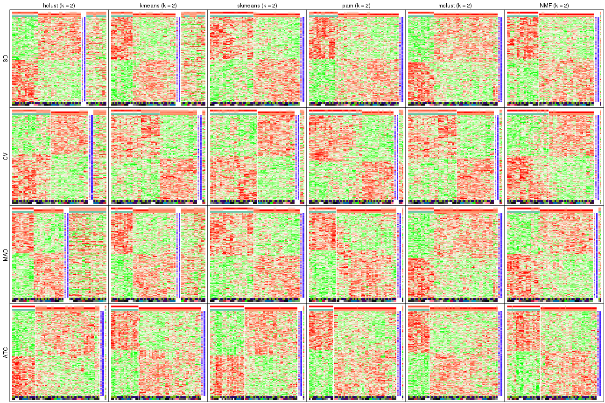</p>

</div>
<div id='tab-collect-get-signatures-2'>
<pre><code class="r">collect_plots(res_list, k = 3, fun = get_signatures, mc.cores = 4)
</code></pre>

<p>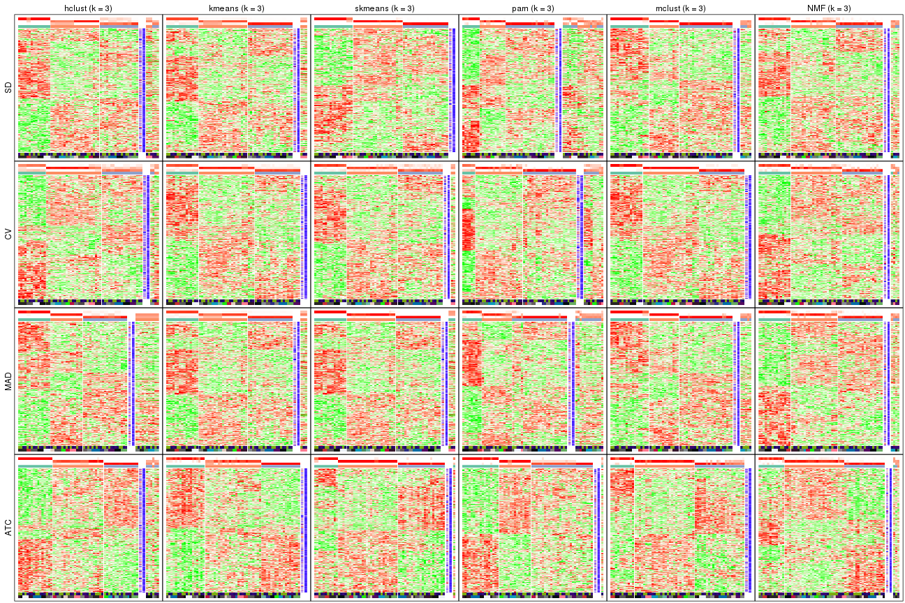</p>

</div>
<div id='tab-collect-get-signatures-3'>
<pre><code class="r">collect_plots(res_list, k = 4, fun = get_signatures, mc.cores = 4)
</code></pre>

<p>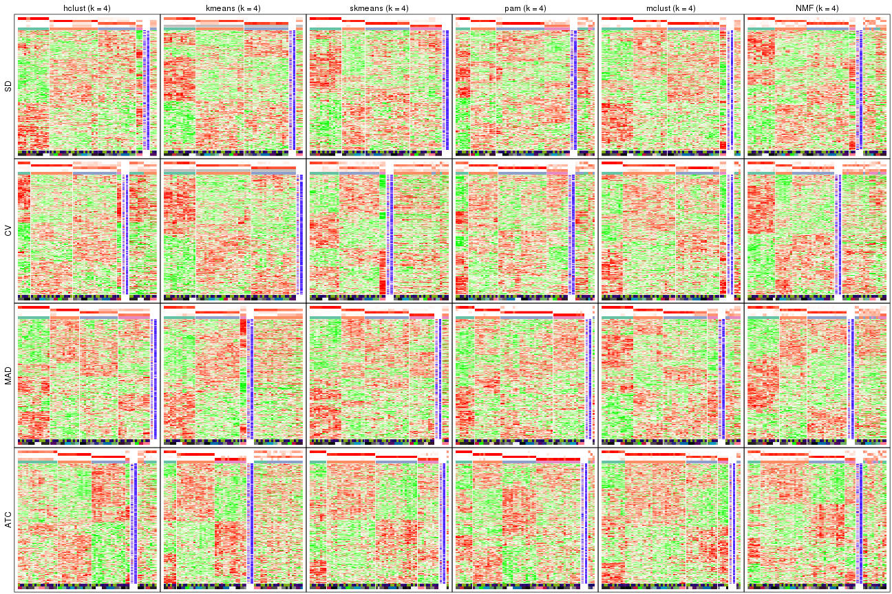</p>

</div>
<div id='tab-collect-get-signatures-4'>
<pre><code class="r">collect_plots(res_list, k = 5, fun = get_signatures, mc.cores = 4)
</code></pre>

<p>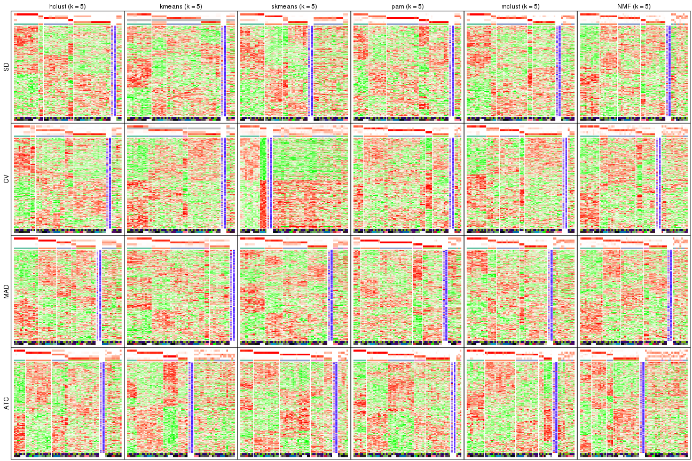</p>

</div>
<div id='tab-collect-get-signatures-5'>
<pre><code class="r">collect_plots(res_list, k = 6, fun = get_signatures, mc.cores = 4)
</code></pre>

<p>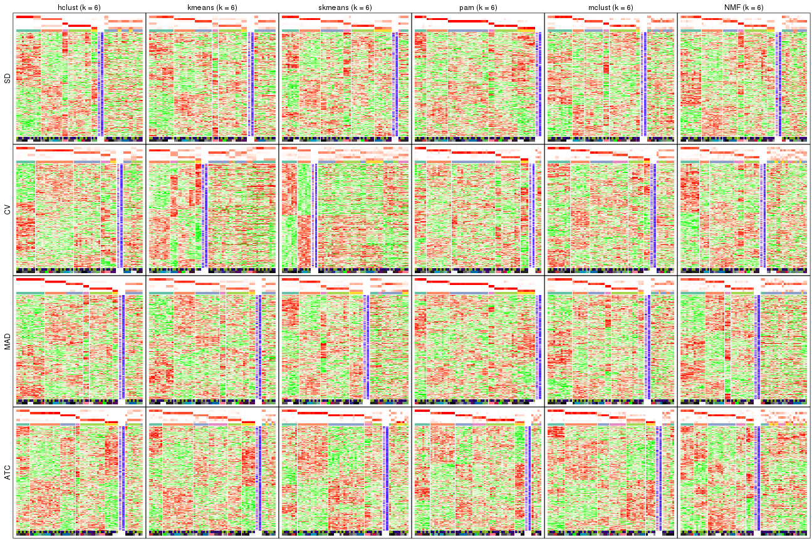</p>

</div>
</div>


### Statistics table

The statistics used for measuring the stability of consensus partitioning.
([How are they
defined?](http://bioconductor.org/packages/devel/bioc/vignettes/cola/inst/doc/cola.html#toc_13))


<script>
$( function() {
	$( '#tabs-get-stats-from-consensus-partition-list' ).tabs();
} );
</script>
<div id='tabs-get-stats-from-consensus-partition-list'>
<ul>
<li><a href='#tab-get-stats-from-consensus-partition-list-1'>k = 2</a></li>
<li><a href='#tab-get-stats-from-consensus-partition-list-2'>k = 3</a></li>
<li><a href='#tab-get-stats-from-consensus-partition-list-3'>k = 4</a></li>
<li><a href='#tab-get-stats-from-consensus-partition-list-4'>k = 5</a></li>
<li><a href='#tab-get-stats-from-consensus-partition-list-5'>k = 6</a></li>
</ul>
<div id='tab-get-stats-from-consensus-partition-list-1'>
<pre><code class="r">get_stats(res_list, k = 2)
</code></pre>

<pre><code>#&gt;             k 1-PAC mean_silhouette concordance area_increased  Rand Jaccard
#&gt; SD:NMF      2 0.934           0.944       0.973          0.471 0.526   0.526
#&gt; CV:NMF      2 0.917           0.938       0.970          0.504 0.494   0.494
#&gt; MAD:NMF     2 0.810           0.906       0.955          0.475 0.511   0.511
#&gt; ATC:NMF     2 1.000           0.969       0.986          0.477 0.526   0.526
#&gt; SD:skmeans  2 0.975           0.941       0.960          0.508 0.492   0.492
#&gt; CV:skmeans  2 0.413           0.829       0.895          0.506 0.497   0.497
#&gt; MAD:skmeans 2 0.528           0.866       0.913          0.507 0.492   0.492
#&gt; ATC:skmeans 2 1.000           0.980       0.992          0.486 0.518   0.518
#&gt; SD:mclust   2 0.716           0.958       0.953          0.412 0.581   0.581
#&gt; CV:mclust   2 0.238           0.823       0.848          0.468 0.505   0.505
#&gt; MAD:mclust  2 0.355           0.880       0.877          0.415 0.581   0.581
#&gt; ATC:mclust  2 0.501           0.915       0.910          0.376 0.627   0.627
#&gt; SD:kmeans   2 0.303           0.591       0.790          0.454 0.511   0.511
#&gt; CV:kmeans   2 0.450           0.728       0.806          0.465 0.497   0.497
#&gt; MAD:kmeans  2 0.285           0.563       0.707          0.470 0.627   0.627
#&gt; ATC:kmeans  2 1.000           1.000       1.000          0.433 0.568   0.568
#&gt; SD:pam      2 0.429           0.833       0.888          0.421 0.556   0.556
#&gt; CV:pam      2 0.535           0.822       0.912          0.467 0.518   0.518
#&gt; MAD:pam     2 0.440           0.832       0.882          0.438 0.568   0.568
#&gt; ATC:pam     2 1.000           0.975       0.990          0.414 0.595   0.595
#&gt; SD:hclust   2 0.226           0.504       0.739          0.463 0.492   0.492
#&gt; CV:hclust   2 0.158           0.573       0.788          0.436 0.500   0.500
#&gt; MAD:hclust  2 0.192           0.468       0.722          0.486 0.545   0.545
#&gt; ATC:hclust  2 0.492           0.834       0.887          0.425 0.595   0.595
</code></pre>

</div>
<div id='tab-get-stats-from-consensus-partition-list-2'>
<pre><code class="r">get_stats(res_list, k = 3)
</code></pre>

<pre><code>#&gt;             k 1-PAC mean_silhouette concordance area_increased  Rand Jaccard
#&gt; SD:NMF      3 0.679           0.785       0.892          0.409 0.683   0.461
#&gt; CV:NMF      3 0.511           0.729       0.854          0.320 0.737   0.519
#&gt; MAD:NMF     3 0.685           0.785       0.893          0.401 0.651   0.416
#&gt; ATC:NMF     3 0.806           0.855       0.921          0.344 0.799   0.629
#&gt; SD:skmeans  3 0.998           0.951       0.975          0.321 0.694   0.455
#&gt; CV:skmeans  3 0.227           0.787       0.806          0.326 0.806   0.623
#&gt; MAD:skmeans 3 0.969           0.912       0.961          0.319 0.694   0.455
#&gt; ATC:skmeans 3 0.943           0.947       0.977          0.314 0.818   0.656
#&gt; SD:mclust   3 0.897           0.854       0.945          0.588 0.763   0.592
#&gt; CV:mclust   3 0.937           0.960       0.969          0.406 0.833   0.670
#&gt; MAD:mclust  3 0.873           0.862       0.943          0.576 0.770   0.604
#&gt; ATC:mclust  3 0.718           0.855       0.907          0.604 0.655   0.483
#&gt; SD:kmeans   3 0.586           0.826       0.841          0.380 0.658   0.426
#&gt; CV:kmeans   3 0.630           0.911       0.889          0.370 0.814   0.636
#&gt; MAD:kmeans  3 0.690           0.864       0.866          0.355 0.711   0.540
#&gt; ATC:kmeans  3 0.614           0.887       0.907          0.515 0.739   0.551
#&gt; SD:pam      3 0.514           0.611       0.843          0.450 0.632   0.429
#&gt; CV:pam      3 0.478           0.670       0.837          0.261 0.898   0.804
#&gt; MAD:pam     3 0.529           0.661       0.841          0.367 0.811   0.679
#&gt; ATC:pam     3 0.707           0.888       0.910          0.526 0.738   0.566
#&gt; SD:hclust   3 0.451           0.704       0.784          0.368 0.672   0.433
#&gt; CV:hclust   3 0.298           0.704       0.727          0.375 0.748   0.544
#&gt; MAD:hclust  3 0.621           0.765       0.857          0.307 0.794   0.621
#&gt; ATC:hclust  3 0.675           0.827       0.906          0.527 0.712   0.527
</code></pre>

</div>
<div id='tab-get-stats-from-consensus-partition-list-3'>
<pre><code class="r">get_stats(res_list, k = 4)
</code></pre>

<pre><code>#&gt;             k 1-PAC mean_silhouette concordance area_increased  Rand Jaccard
#&gt; SD:NMF      4 0.578           0.670       0.802         0.0907 0.946   0.843
#&gt; CV:NMF      4 0.506           0.568       0.705         0.1214 0.881   0.669
#&gt; MAD:NMF     4 0.615           0.620       0.806         0.0931 0.952   0.858
#&gt; ATC:NMF     4 0.633           0.686       0.831         0.1206 0.861   0.647
#&gt; SD:skmeans  4 0.880           0.923       0.940         0.1170 0.887   0.673
#&gt; CV:skmeans  4 0.353           0.544       0.647         0.1215 0.964   0.892
#&gt; MAD:skmeans 4 0.857           0.886       0.918         0.1239 0.887   0.673
#&gt; ATC:skmeans 4 0.990           0.938       0.965         0.1223 0.881   0.684
#&gt; SD:mclust   4 0.794           0.833       0.875         0.0798 0.911   0.760
#&gt; CV:mclust   4 0.797           0.820       0.855         0.0829 0.981   0.944
#&gt; MAD:mclust  4 0.749           0.770       0.843         0.1117 0.882   0.676
#&gt; ATC:mclust  4 0.831           0.871       0.899         0.1252 0.929   0.811
#&gt; SD:kmeans   4 0.653           0.772       0.789         0.1277 1.000   1.000
#&gt; CV:kmeans   4 0.705           0.815       0.827         0.1202 1.000   1.000
#&gt; MAD:kmeans  4 0.656           0.723       0.801         0.1303 0.964   0.892
#&gt; ATC:kmeans  4 0.699           0.638       0.807         0.1325 0.866   0.624
#&gt; SD:pam      4 0.623           0.744       0.839         0.1357 0.829   0.577
#&gt; CV:pam      4 0.569           0.688       0.800         0.1368 0.822   0.603
#&gt; MAD:pam     4 0.898           0.894       0.953         0.2078 0.788   0.536
#&gt; ATC:pam     4 0.926           0.912       0.966         0.1675 0.878   0.668
#&gt; SD:hclust   4 0.683           0.706       0.754         0.1087 0.964   0.892
#&gt; CV:hclust   4 0.390           0.618       0.748         0.1275 0.973   0.922
#&gt; MAD:hclust  4 0.770           0.840       0.857         0.1587 0.867   0.626
#&gt; ATC:hclust  4 0.846           0.743       0.881         0.0973 0.959   0.879
</code></pre>

</div>
<div id='tab-get-stats-from-consensus-partition-list-4'>
<pre><code class="r">get_stats(res_list, k = 5)
</code></pre>

<pre><code>#&gt;             k 1-PAC mean_silhouette concordance area_increased  Rand Jaccard
#&gt; SD:NMF      5 0.656           0.637       0.803         0.0770 0.826   0.495
#&gt; CV:NMF      5 0.547           0.546       0.707         0.0666 0.909   0.683
#&gt; MAD:NMF     5 0.652           0.687       0.807         0.0788 0.870   0.593
#&gt; ATC:NMF     5 0.621           0.510       0.743         0.0889 0.897   0.671
#&gt; SD:skmeans  5 0.834           0.645       0.813         0.0641 0.971   0.886
#&gt; CV:skmeans  5 0.465           0.330       0.571         0.0664 0.913   0.724
#&gt; MAD:skmeans 5 0.784           0.707       0.795         0.0626 0.948   0.795
#&gt; ATC:skmeans 5 0.859           0.825       0.902         0.0617 0.925   0.743
#&gt; SD:mclust   5 0.724           0.735       0.846         0.0845 0.920   0.746
#&gt; CV:mclust   5 0.748           0.807       0.842         0.0671 0.945   0.828
#&gt; MAD:mclust  5 0.737           0.695       0.846         0.0695 0.913   0.692
#&gt; ATC:mclust  5 0.650           0.645       0.841         0.0915 0.876   0.638
#&gt; SD:kmeans   5 0.636           0.693       0.744         0.0810 0.911   0.738
#&gt; CV:kmeans   5 0.697           0.684       0.717         0.0601 0.964   0.892
#&gt; MAD:kmeans  5 0.684           0.822       0.788         0.0670 0.930   0.769
#&gt; ATC:kmeans  5 0.688           0.530       0.730         0.0665 0.856   0.506
#&gt; SD:pam      5 0.756           0.855       0.884         0.0819 0.929   0.748
#&gt; CV:pam      5 0.603           0.775       0.840         0.0784 0.941   0.812
#&gt; MAD:pam     5 0.855           0.802       0.880         0.0538 0.915   0.712
#&gt; ATC:pam     5 0.846           0.872       0.915         0.0764 0.928   0.733
#&gt; SD:hclust   5 0.772           0.717       0.834         0.0811 0.952   0.842
#&gt; CV:hclust   5 0.523           0.710       0.763         0.0798 0.944   0.831
#&gt; MAD:hclust  5 0.749           0.795       0.822         0.0536 0.983   0.927
#&gt; ATC:hclust  5 0.769           0.714       0.817         0.0522 0.922   0.768
</code></pre>

</div>
<div id='tab-get-stats-from-consensus-partition-list-5'>
<pre><code class="r">get_stats(res_list, k = 6)
</code></pre>

<pre><code>#&gt;             k 1-PAC mean_silhouette concordance area_increased  Rand Jaccard
#&gt; SD:NMF      6 0.675           0.639       0.779         0.0463 0.915   0.652
#&gt; CV:NMF      6 0.595           0.482       0.677         0.0402 0.944   0.760
#&gt; MAD:NMF     6 0.640           0.541       0.766         0.0422 0.947   0.785
#&gt; ATC:NMF     6 0.679           0.571       0.772         0.0488 0.880   0.540
#&gt; SD:skmeans  6 0.820           0.756       0.810         0.0446 0.907   0.612
#&gt; CV:skmeans  6 0.527           0.364       0.570         0.0412 0.875   0.529
#&gt; MAD:skmeans 6 0.763           0.632       0.766         0.0436 0.926   0.670
#&gt; ATC:skmeans 6 0.854           0.752       0.870         0.0371 0.949   0.792
#&gt; SD:mclust   6 0.732           0.609       0.768         0.0525 0.965   0.856
#&gt; CV:mclust   6 0.730           0.697       0.812         0.0727 0.901   0.630
#&gt; MAD:mclust  6 0.740           0.647       0.790         0.0432 0.949   0.780
#&gt; ATC:mclust  6 0.743           0.744       0.819         0.0770 0.907   0.643
#&gt; SD:kmeans   6 0.694           0.689       0.742         0.0524 0.935   0.749
#&gt; CV:kmeans   6 0.687           0.461       0.633         0.0546 0.856   0.552
#&gt; MAD:kmeans  6 0.714           0.695       0.772         0.0468 0.971   0.877
#&gt; ATC:kmeans  6 0.719           0.712       0.792         0.0417 0.924   0.650
#&gt; SD:pam      6 0.941           0.948       0.977         0.0577 0.983   0.921
#&gt; CV:pam      6 0.730           0.827       0.883         0.0543 0.971   0.892
#&gt; MAD:pam     6 0.992           0.947       0.974         0.0456 0.967   0.855
#&gt; ATC:pam     6 0.800           0.780       0.874         0.0416 0.971   0.859
#&gt; SD:hclust   6 0.793           0.706       0.786         0.0633 0.878   0.563
#&gt; CV:hclust   6 0.611           0.702       0.764         0.0523 0.935   0.768
#&gt; MAD:hclust  6 0.928           0.852       0.908         0.0495 0.981   0.914
#&gt; ATC:hclust  6 0.805           0.732       0.861         0.0476 0.871   0.587
</code></pre>

</div>
</div>

Following heatmap plots the partition for each combination of methods and the
lightness correspond to the silhouette scores for samples in each method. On
top the consensus subgroup is inferred from all methods by taking the mean
silhouette scores as weight.


<script>
$( function() {
	$( '#tabs-collect-stats-from-consensus-partition-list' ).tabs();
} );
</script>
<div id='tabs-collect-stats-from-consensus-partition-list'>
<ul>
<li><a href='#tab-collect-stats-from-consensus-partition-list-1'>k = 2</a></li>
<li><a href='#tab-collect-stats-from-consensus-partition-list-2'>k = 3</a></li>
<li><a href='#tab-collect-stats-from-consensus-partition-list-3'>k = 4</a></li>
<li><a href='#tab-collect-stats-from-consensus-partition-list-4'>k = 5</a></li>
<li><a href='#tab-collect-stats-from-consensus-partition-list-5'>k = 6</a></li>
</ul>
<div id='tab-collect-stats-from-consensus-partition-list-1'>
<pre><code class="r">collect_stats(res_list, k = 2)
</code></pre>

<p>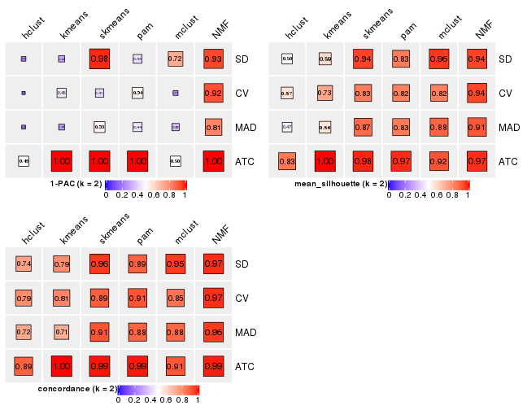</p>

</div>
<div id='tab-collect-stats-from-consensus-partition-list-2'>
<pre><code class="r">collect_stats(res_list, k = 3)
</code></pre>

<p>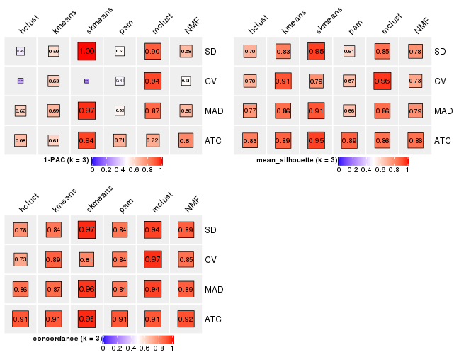</p>

</div>
<div id='tab-collect-stats-from-consensus-partition-list-3'>
<pre><code class="r">collect_stats(res_list, k = 4)
</code></pre>

<p>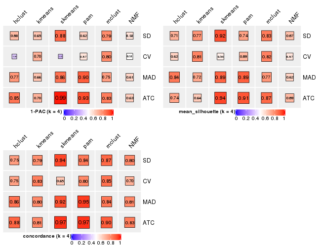</p>

</div>
<div id='tab-collect-stats-from-consensus-partition-list-4'>
<pre><code class="r">collect_stats(res_list, k = 5)
</code></pre>

<p>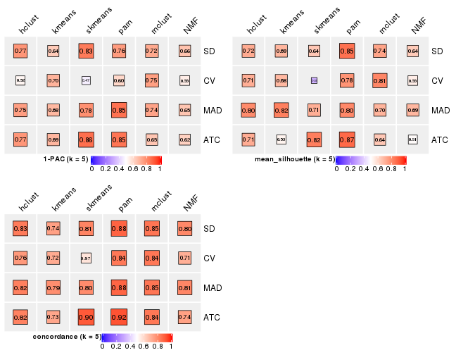</p>

</div>
<div id='tab-collect-stats-from-consensus-partition-list-5'>
<pre><code class="r">collect_stats(res_list, k = 6)
</code></pre>

<p>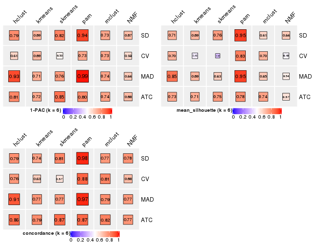</p>

</div>
</div>

### Partition from all methods


Collect partitions from all methods:


<script>
$( function() {
	$( '#tabs-collect-classes-from-consensus-partition-list' ).tabs();
} );
</script>
<div id='tabs-collect-classes-from-consensus-partition-list'>
<ul>
<li><a href='#tab-collect-classes-from-consensus-partition-list-1'>k = 2</a></li>
<li><a href='#tab-collect-classes-from-consensus-partition-list-2'>k = 3</a></li>
<li><a href='#tab-collect-classes-from-consensus-partition-list-3'>k = 4</a></li>
<li><a href='#tab-collect-classes-from-consensus-partition-list-4'>k = 5</a></li>
<li><a href='#tab-collect-classes-from-consensus-partition-list-5'>k = 6</a></li>
</ul>
<div id='tab-collect-classes-from-consensus-partition-list-1'>
<pre><code class="r">collect_classes(res_list, k = 2)
</code></pre>

<p>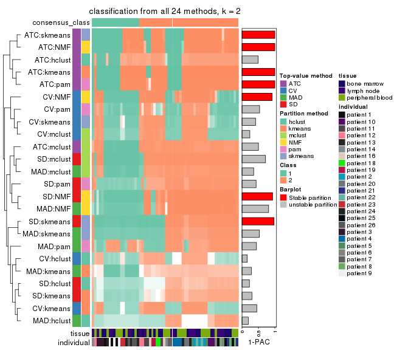</p>

</div>
<div id='tab-collect-classes-from-consensus-partition-list-2'>
<pre><code class="r">collect_classes(res_list, k = 3)
</code></pre>

<p>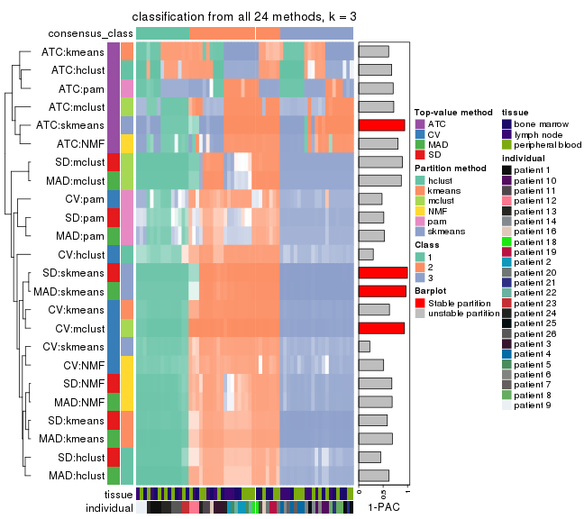</p>

</div>
<div id='tab-collect-classes-from-consensus-partition-list-3'>
<pre><code class="r">collect_classes(res_list, k = 4)
</code></pre>

<p>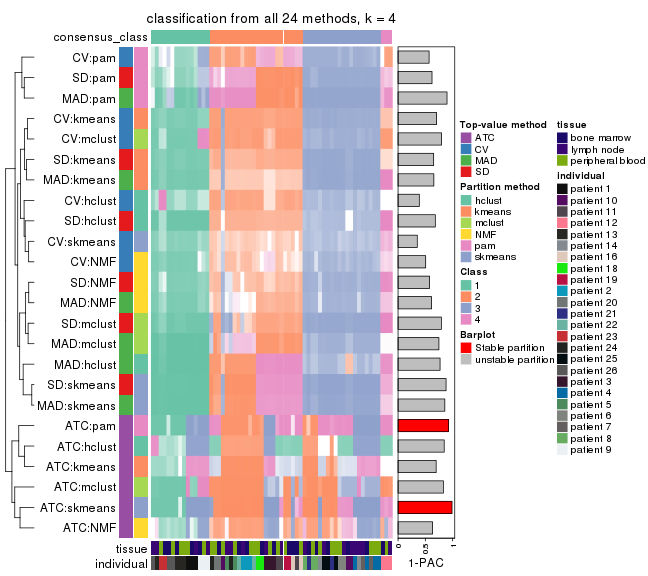</p>

</div>
<div id='tab-collect-classes-from-consensus-partition-list-4'>
<pre><code class="r">collect_classes(res_list, k = 5)
</code></pre>

<p>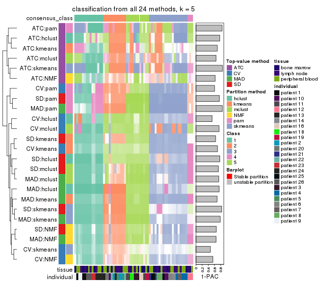</p>

</div>
<div id='tab-collect-classes-from-consensus-partition-list-5'>
<pre><code class="r">collect_classes(res_list, k = 6)
</code></pre>

<p>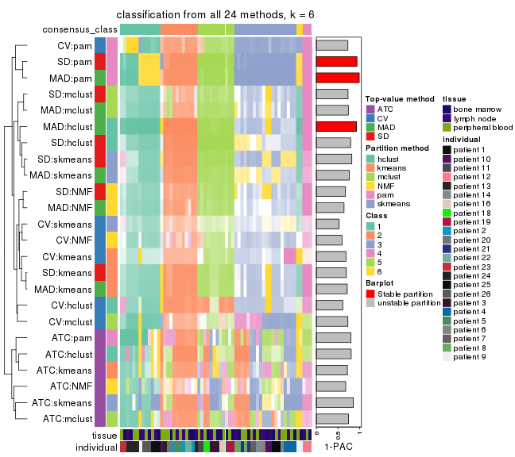</p>

</div>
</div>


### Top rows overlap


Overlap of top rows from different top-row methods:


<script>
$( function() {
	$( '#tabs-top-rows-overlap-by-euler' ).tabs();
} );
</script>
<div id='tabs-top-rows-overlap-by-euler'>
<ul>
<li><a href='#tab-top-rows-overlap-by-euler-1'>top_n = 1000</a></li>
<li><a href='#tab-top-rows-overlap-by-euler-2'>top_n = 2000</a></li>
<li><a href='#tab-top-rows-overlap-by-euler-3'>top_n = 3000</a></li>
<li><a href='#tab-top-rows-overlap-by-euler-4'>top_n = 4000</a></li>
<li><a href='#tab-top-rows-overlap-by-euler-5'>top_n = 5000</a></li>
</ul>
<div id='tab-top-rows-overlap-by-euler-1'>
<pre><code class="r">top_rows_overlap(res_list, top_n = 1000, method = &quot;euler&quot;)
</code></pre>

<p>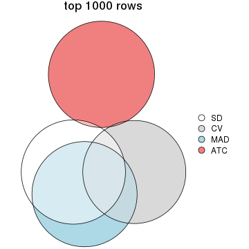</p>

</div>
<div id='tab-top-rows-overlap-by-euler-2'>
<pre><code class="r">top_rows_overlap(res_list, top_n = 2000, method = &quot;euler&quot;)
</code></pre>

<p>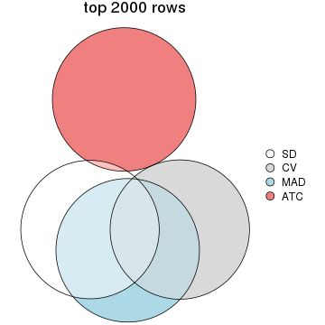</p>

</div>
<div id='tab-top-rows-overlap-by-euler-3'>
<pre><code class="r">top_rows_overlap(res_list, top_n = 3000, method = &quot;euler&quot;)
</code></pre>

<p>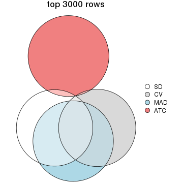</p>

</div>
<div id='tab-top-rows-overlap-by-euler-4'>
<pre><code class="r">top_rows_overlap(res_list, top_n = 4000, method = &quot;euler&quot;)
</code></pre>

<p>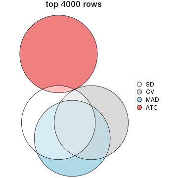</p>

</div>
<div id='tab-top-rows-overlap-by-euler-5'>
<pre><code class="r">top_rows_overlap(res_list, top_n = 5000, method = &quot;euler&quot;)
</code></pre>

<p>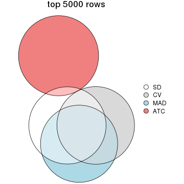</p>

</div>
</div>

Also visualize the correspondance of rankings between different top-row methods:


<script>
$( function() {
	$( '#tabs-top-rows-overlap-by-correspondance' ).tabs();
} );
</script>
<div id='tabs-top-rows-overlap-by-correspondance'>
<ul>
<li><a href='#tab-top-rows-overlap-by-correspondance-1'>top_n = 1000</a></li>
<li><a href='#tab-top-rows-overlap-by-correspondance-2'>top_n = 2000</a></li>
<li><a href='#tab-top-rows-overlap-by-correspondance-3'>top_n = 3000</a></li>
<li><a href='#tab-top-rows-overlap-by-correspondance-4'>top_n = 4000</a></li>
<li><a href='#tab-top-rows-overlap-by-correspondance-5'>top_n = 5000</a></li>
</ul>
<div id='tab-top-rows-overlap-by-correspondance-1'>
<pre><code class="r">top_rows_overlap(res_list, top_n = 1000, method = &quot;correspondance&quot;)
</code></pre>

<p>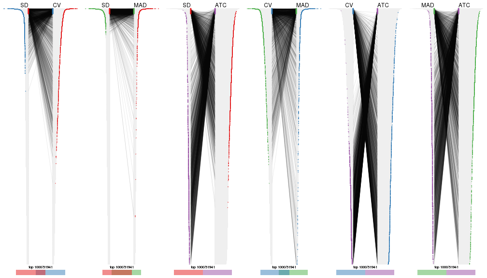</p>

</div>
<div id='tab-top-rows-overlap-by-correspondance-2'>
<pre><code class="r">top_rows_overlap(res_list, top_n = 2000, method = &quot;correspondance&quot;)
</code></pre>

<p>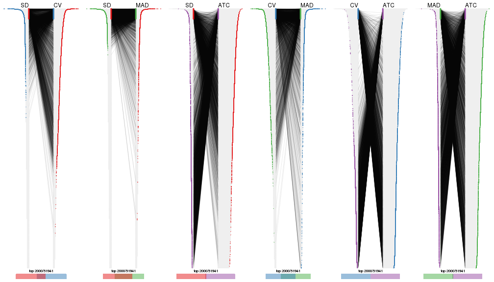</p>

</div>
<div id='tab-top-rows-overlap-by-correspondance-3'>
<pre><code class="r">top_rows_overlap(res_list, top_n = 3000, method = &quot;correspondance&quot;)
</code></pre>

<p>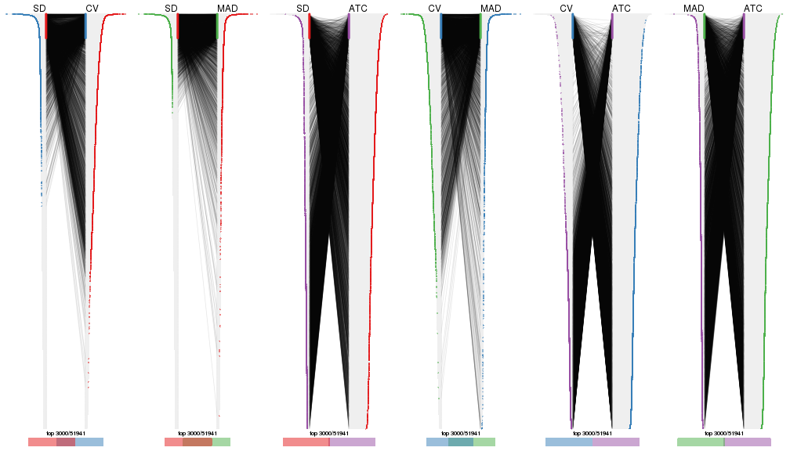</p>

</div>
<div id='tab-top-rows-overlap-by-correspondance-4'>
<pre><code class="r">top_rows_overlap(res_list, top_n = 4000, method = &quot;correspondance&quot;)
</code></pre>

<p>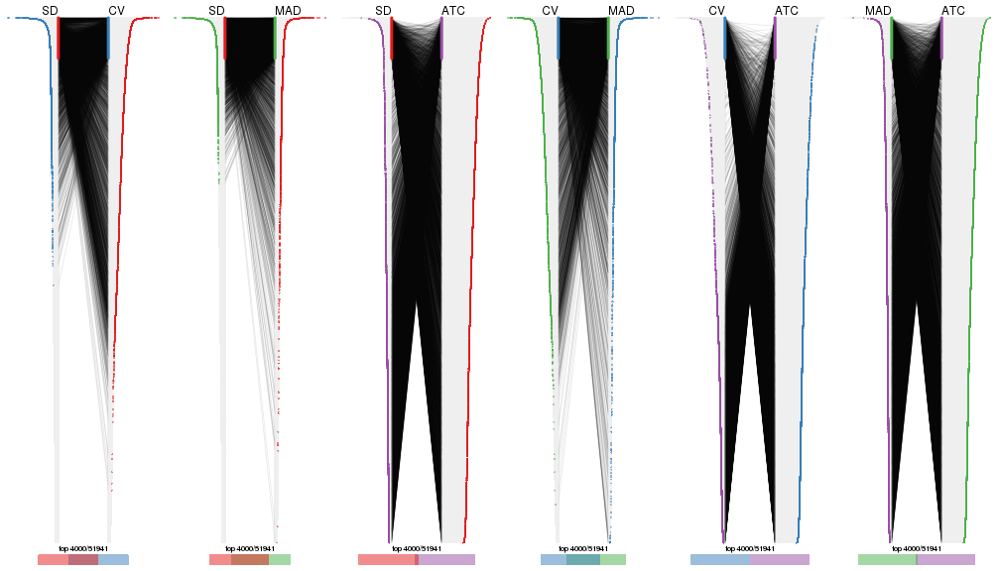</p>

</div>
<div id='tab-top-rows-overlap-by-correspondance-5'>
<pre><code class="r">top_rows_overlap(res_list, top_n = 5000, method = &quot;correspondance&quot;)
</code></pre>

<p>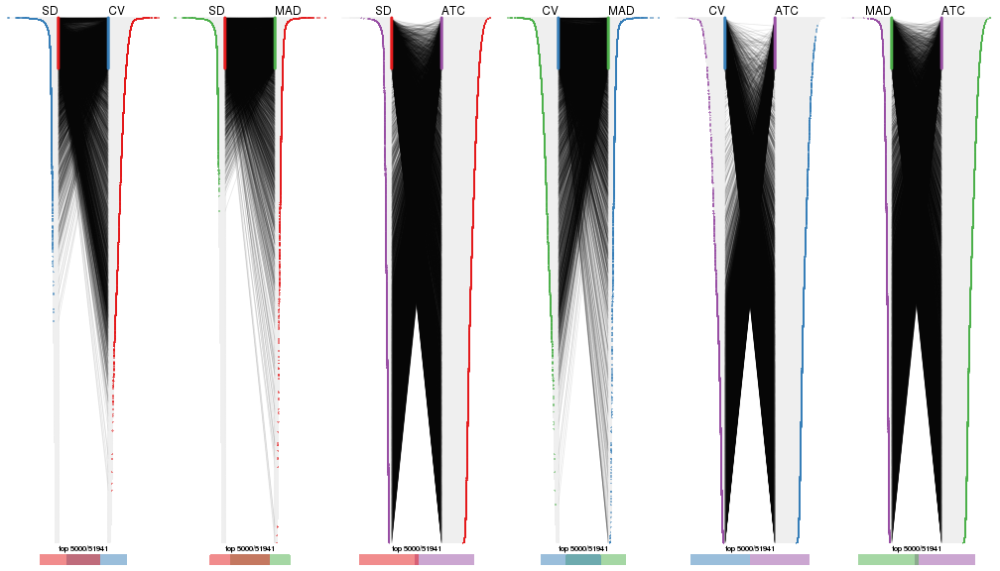</p>

</div>
</div>


Heatmaps of the top rows:


<script>
$( function() {
	$( '#tabs-top-rows-heatmap' ).tabs();
} );
</script>
<div id='tabs-top-rows-heatmap'>
<ul>
<li><a href='#tab-top-rows-heatmap-1'>top_n = 1000</a></li>
<li><a href='#tab-top-rows-heatmap-2'>top_n = 2000</a></li>
<li><a href='#tab-top-rows-heatmap-3'>top_n = 3000</a></li>
<li><a href='#tab-top-rows-heatmap-4'>top_n = 4000</a></li>
<li><a href='#tab-top-rows-heatmap-5'>top_n = 5000</a></li>
</ul>
<div id='tab-top-rows-heatmap-1'>
<pre><code class="r">top_rows_heatmap(res_list, top_n = 1000)
</code></pre>

<p>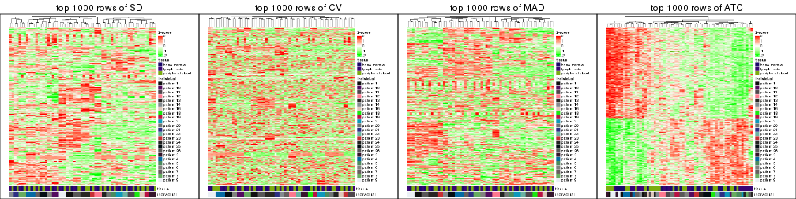</p>

</div>
<div id='tab-top-rows-heatmap-2'>
<pre><code class="r">top_rows_heatmap(res_list, top_n = 2000)
</code></pre>

<p>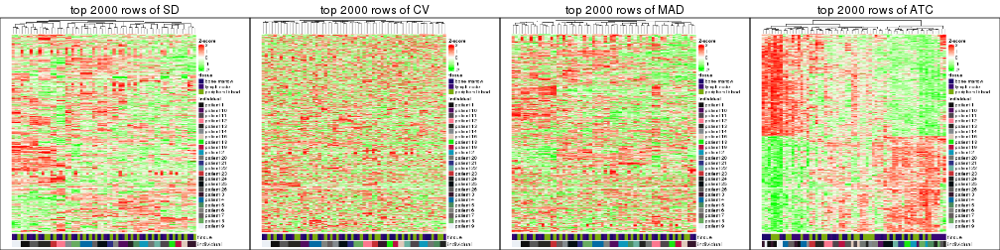</p>

</div>
<div id='tab-top-rows-heatmap-3'>
<pre><code class="r">top_rows_heatmap(res_list, top_n = 3000)
</code></pre>

<p>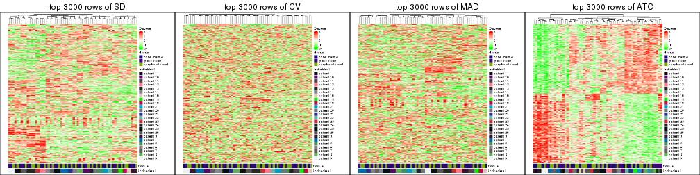</p>

</div>
<div id='tab-top-rows-heatmap-4'>
<pre><code class="r">top_rows_heatmap(res_list, top_n = 4000)
</code></pre>

<p>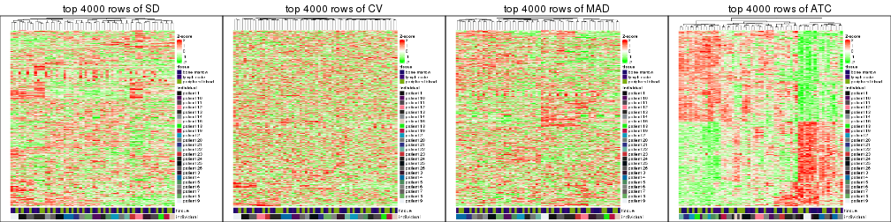</p>

</div>
<div id='tab-top-rows-heatmap-5'>
<pre><code class="r">top_rows_heatmap(res_list, top_n = 5000)
</code></pre>

<p>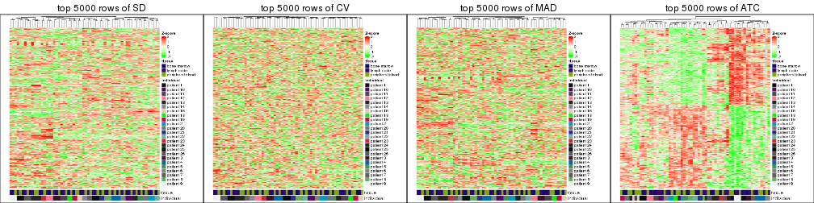</p>

</div>
</div>


### Test to known annotations


Test correlation between subgroups and known annotations. If the known
annotation is numeric, one-way ANOVA test is applied, and if the known
annotation is discrete, chi-squared contingency table test is applied.


<script>
$( function() {
	$( '#tabs-test-to-known-factors-from-consensus-partition-list' ).tabs();
} );
</script>
<div id='tabs-test-to-known-factors-from-consensus-partition-list'>
<ul>
<li><a href='#tab-test-to-known-factors-from-consensus-partition-list-1'>k = 2</a></li>
<li><a href='#tab-test-to-known-factors-from-consensus-partition-list-2'>k = 3</a></li>
<li><a href='#tab-test-to-known-factors-from-consensus-partition-list-3'>k = 4</a></li>
<li><a href='#tab-test-to-known-factors-from-consensus-partition-list-4'>k = 5</a></li>
<li><a href='#tab-test-to-known-factors-from-consensus-partition-list-5'>k = 6</a></li>
</ul>
<div id='tab-test-to-known-factors-from-consensus-partition-list-1'>
<pre><code class="r">test_to_known_factors(res_list, k = 2)
</code></pre>

<pre><code>#&gt;              n tissue(p) individual(p) k
#&gt; SD:NMF      61    0.7846      2.74e-05 2
#&gt; CV:NMF      61    0.5438      7.41e-05 2
#&gt; MAD:NMF     60    0.9155      3.82e-05 2
#&gt; ATC:NMF     62    0.3898      2.49e-03 2
#&gt; SD:skmeans  62    0.5788      1.95e-05 2
#&gt; CV:skmeans  59    0.6642      3.14e-05 2
#&gt; MAD:skmeans 62    0.5788      1.95e-05 2
#&gt; ATC:skmeans 61    0.3703      3.00e-03 2
#&gt; SD:mclust   62    0.9431      1.95e-05 2
#&gt; CV:mclust   60    0.6778      2.23e-05 2
#&gt; MAD:mclust  62    0.9431      1.95e-05 2
#&gt; ATC:mclust  62    0.9664      1.95e-05 2
#&gt; SD:kmeans   45    0.7618      1.39e-04 2
#&gt; CV:kmeans   60    0.6778      2.23e-05 2
#&gt; MAD:kmeans  45    0.8965      1.39e-04 2
#&gt; ATC:kmeans  62    0.8434      7.61e-04 2
#&gt; SD:pam      62    0.6183      1.46e-04 2
#&gt; CV:pam      59    0.7563      1.35e-04 2
#&gt; MAD:pam     61    0.0999      5.53e-04 2
#&gt; ATC:pam     61    0.6827      2.09e-04 2
#&gt; SD:hclust   48    0.7483      8.59e-05 2
#&gt; CV:hclust   53    0.6599      8.13e-05 2
#&gt; MAD:hclust  36    0.5148      5.93e-04 2
#&gt; ATC:hclust  61    0.5918      2.74e-05 2
</code></pre>

</div>
<div id='tab-test-to-known-factors-from-consensus-partition-list-2'>
<pre><code class="r">test_to_known_factors(res_list, k = 3)
</code></pre>

<pre><code>#&gt;              n tissue(p) individual(p) k
#&gt; SD:NMF      58     0.551      5.70e-08 3
#&gt; CV:NMF      58     0.889      5.70e-08 3
#&gt; MAD:NMF     58     0.629      5.70e-08 3
#&gt; ATC:NMF     59     0.275      5.79e-05 3
#&gt; SD:skmeans  62     0.896      4.37e-09 3
#&gt; CV:skmeans  60     0.887      1.60e-08 3
#&gt; MAD:skmeans 59     0.901      1.10e-08 3
#&gt; ATC:skmeans 61     0.691      2.47e-06 3
#&gt; SD:mclust   57     0.442      4.01e-08 3
#&gt; CV:mclust   62     0.916      4.37e-09 3
#&gt; MAD:mclust  57     0.442      4.01e-08 3
#&gt; ATC:mclust  62     0.760      2.05e-07 3
#&gt; SD:kmeans   59     0.901      1.10e-08 3
#&gt; CV:kmeans   62     0.916      4.37e-09 3
#&gt; MAD:kmeans  59     0.901      1.10e-08 3
#&gt; ATC:kmeans  62     0.973      3.04e-05 3
#&gt; SD:pam      43     0.386      5.65e-06 3
#&gt; CV:pam      53     0.839      1.24e-06 3
#&gt; MAD:pam     49     0.843      7.97e-07 3
#&gt; ATC:pam     61     0.931      1.86e-06 3
#&gt; SD:hclust   56     0.889      2.77e-08 3
#&gt; CV:hclust   58     0.960      7.44e-09 3
#&gt; MAD:hclust  51     0.852      3.15e-08 3
#&gt; ATC:hclust  56     0.681      6.34e-07 3
</code></pre>

</div>
<div id='tab-test-to-known-factors-from-consensus-partition-list-3'>
<pre><code class="r">test_to_known_factors(res_list, k = 4)
</code></pre>

<pre><code>#&gt;              n tissue(p) individual(p) k
#&gt; SD:NMF      51    0.6538      4.55e-10 4
#&gt; CV:NMF      41    0.9012      2.87e-06 4
#&gt; MAD:NMF     48    0.7725      4.03e-10 4
#&gt; ATC:NMF     51    0.0236      1.12e-04 4
#&gt; SD:skmeans  62    0.9621      1.10e-12 4
#&gt; CV:skmeans  37    0.9349      3.84e-08 4
#&gt; MAD:skmeans 59    0.9446      4.34e-12 4
#&gt; ATC:skmeans 61    0.9393      1.17e-09 4
#&gt; SD:mclust   59    0.6011      1.94e-11 4
#&gt; CV:mclust   59    0.9853      4.34e-12 4
#&gt; MAD:mclust  55    0.8878      4.48e-11 4
#&gt; ATC:mclust  60    0.9516      1.84e-08 4
#&gt; SD:kmeans   59    0.9007      1.10e-08 4
#&gt; CV:kmeans   62    0.9162      4.37e-09 4
#&gt; MAD:kmeans  39    0.9726      4.25e-07 4
#&gt; ATC:kmeans  39    0.9514      2.61e-05 4
#&gt; SD:pam      54    0.8320      4.86e-10 4
#&gt; CV:pam      53    0.6769      1.92e-09 4
#&gt; MAD:pam     61    0.9584      1.15e-11 4
#&gt; ATC:pam     59    0.9858      6.56e-10 4
#&gt; SD:hclust   59    0.9750      4.34e-12 4
#&gt; CV:hclust   49    0.9006      6.95e-10 4
#&gt; MAD:hclust  62    0.9597      1.10e-12 4
#&gt; ATC:hclust  53    0.4099      7.63e-07 4
</code></pre>

</div>
<div id='tab-test-to-known-factors-from-consensus-partition-list-4'>
<pre><code class="r">test_to_known_factors(res_list, k = 5)
</code></pre>

<pre><code>#&gt;              n tissue(p) individual(p) k
#&gt; SD:NMF      52    0.7527      1.03e-11 5
#&gt; CV:NMF      46    0.8785      3.61e-10 5
#&gt; MAD:NMF     53    0.9066      3.11e-12 5
#&gt; ATC:NMF     36    0.0348      8.37e-04 5
#&gt; SD:skmeans  41    0.9887      3.60e-09 5
#&gt; CV:skmeans  16    0.9445      6.84e-03 5
#&gt; MAD:skmeans 53    0.9267      6.76e-11 5
#&gt; ATC:skmeans 56    0.9644      7.60e-11 5
#&gt; SD:mclust   54    0.8389      1.40e-13 5
#&gt; CV:mclust   58    0.9774      6.46e-15 5
#&gt; MAD:mclust  49    0.9430      2.02e-13 5
#&gt; ATC:mclust  52    0.8677      3.33e-08 5
#&gt; SD:kmeans   57    0.9244      6.50e-12 5
#&gt; CV:kmeans   57    0.9703      6.50e-12 5
#&gt; MAD:kmeans  62    0.9866      2.93e-16 5
#&gt; ATC:kmeans  37    0.9967      2.43e-06 5
#&gt; SD:pam      58    0.9690      6.46e-15 5
#&gt; CV:pam      58    0.8578      1.12e-13 5
#&gt; MAD:pam     54    0.9674      6.22e-13 5
#&gt; ATC:pam     59    0.4567      8.12e-09 5
#&gt; SD:hclust   59    0.9929      1.81e-15 5
#&gt; CV:hclust   56    0.9904      1.11e-14 5
#&gt; MAD:hclust  50    0.9931      4.25e-13 5
#&gt; ATC:hclust  52    0.3695      4.44e-08 5
</code></pre>

</div>
<div id='tab-test-to-known-factors-from-consensus-partition-list-5'>
<pre><code class="r">test_to_known_factors(res_list, k = 6)
</code></pre>

<pre><code>#&gt;              n tissue(p) individual(p) k
#&gt; SD:NMF      49    0.4500      4.73e-12 6
#&gt; CV:NMF      41    0.8497      3.91e-09 6
#&gt; MAD:NMF     38    0.9458      1.44e-08 6
#&gt; ATC:NMF     39    0.0152      7.52e-05 6
#&gt; SD:skmeans  57    0.9959      1.82e-17 6
#&gt; CV:skmeans  15    0.7363      1.04e-02 6
#&gt; MAD:skmeans 42    0.9953      2.83e-11 6
#&gt; ATC:skmeans 52    0.9897      1.03e-10 6
#&gt; SD:mclust   48    0.9064      1.59e-14 6
#&gt; CV:mclust   53    0.9592      8.18e-16 6
#&gt; MAD:mclust  50    0.4114      6.67e-13 6
#&gt; ATC:mclust  56    0.9441      9.22e-11 6
#&gt; SD:kmeans   51    0.9984      1.42e-16 6
#&gt; CV:kmeans   27    0.9622      1.42e-06 6
#&gt; MAD:kmeans  55    0.9982      2.92e-18 6
#&gt; ATC:kmeans  55    0.9854      2.18e-11 6
#&gt; SD:pam      62    0.9922      8.01e-20 6
#&gt; CV:pam      59    0.9628      1.79e-17 6
#&gt; MAD:pam     62    0.9873      4.62e-19 6
#&gt; ATC:pam     57    0.5671      9.40e-11 6
#&gt; SD:hclust   42    0.9967      3.60e-12 6
#&gt; CV:hclust   52    0.9889      2.45e-13 6
#&gt; MAD:hclust  53    0.9987      7.21e-17 6
#&gt; ATC:hclust  53    0.3212      3.76e-08 6
</code></pre>

</div>
</div>


 
## Results for each method


---------------------------------------------------


### SD:hclust


The object with results only for a single top-value method and a single partition method 
can be extracted as:

```r
res = res_list["SD", "hclust"]
# you can also extract it by
# res = res_list["SD:hclust"]
```

A summary of `res` and all the functions that can be applied to it:

```r
res
```

```
#> A 'ConsensusPartition' object with k = 2, 3, 4, 5, 6.
#>   On a matrix with 51941 rows and 62 columns.
#>   Top rows (1000, 2000, 3000, 4000, 5000) are extracted by 'SD' method.
#>   Subgroups are detected by 'hclust' method.
#>   Performed in total 1250 partitions by row resampling.
#>   Best k for subgroups seems to be 5.
#> 
#> Following methods can be applied to this 'ConsensusPartition' object:
#>  [1] "cola_report"             "collect_classes"         "collect_plots"          
#>  [4] "collect_stats"           "colnames"                "compare_signatures"     
#>  [7] "consensus_heatmap"       "dimension_reduction"     "functional_enrichment"  
#> [10] "get_anno_col"            "get_anno"                "get_classes"            
#> [13] "get_consensus"           "get_matrix"              "get_membership"         
#> [16] "get_param"               "get_signatures"          "get_stats"              
#> [19] "is_best_k"               "is_stable_k"             "membership_heatmap"     
#> [22] "ncol"                    "nrow"                    "plot_ecdf"              
#> [25] "rownames"                "select_partition_number" "show"                   
#> [28] "suggest_best_k"          "test_to_known_factors"
```

`collect_plots()` function collects all the plots made from `res` for all `k` (number of partitions)
into one single page to provide an easy and fast comparison between different `k`.

```r
collect_plots(res)
```

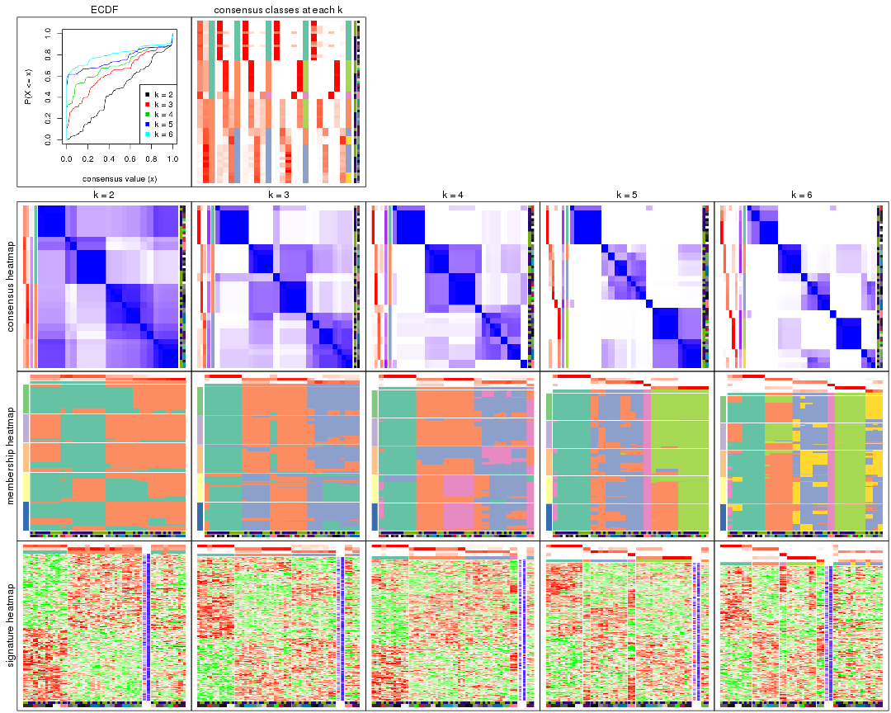

The plots are:

- The first row: a plot of the ECDF (empirical cumulative distribution
  function) curves of the consensus matrix for each `k` and the heatmap of
  predicted classes for each `k`.
- The second row: heatmaps of the consensus matrix for each `k`.
- The third row: heatmaps of the membership matrix for each `k`.
- The fouth row: heatmaps of the signatures for each `k`.

All the plots in panels can be made by individual functions and they are
plotted later in this section.

`select_partition_number()` produces several plots showing different
statistics for choosing "optimized" `k`. There are following statistics:

- ECDF curves of the consensus matrix for each `k`;
- 1-PAC. [The PAC
  score](https://en.wikipedia.org/wiki/Consensus_clustering#Over-interpretation_potential_of_consensus_clustering)
  measures the proportion of the ambiguous subgrouping.
- Mean silhouette score.
- Concordance. The mean probability of fiting the consensus class ids in all
  partitions.
- Area increased. Denote $A_k$ as the area under the ECDF curve for current
  `k`, the area increased is defined as $A_k - A_{k-1}$.
- Rand index. The percent of pairs of samples that are both in a same cluster
  or both are not in a same cluster in the partition of k and k-1.
- Jaccard index. The ratio of pairs of samples are both in a same cluster in
  the partition of k and k-1 and the pairs of samples are both in a same
  cluster in the partition k or k-1.

The detailed explanations of these statistics can be found in [the _cola_
vignette](http://bioconductor.org/packages/devel/bioc/vignettes/cola/inst/doc/cola.html#toc_13).

Generally speaking, lower PAC score, higher mean silhouette score or higher
concordance corresponds to better partition. Rand index and Jaccard index
measure how similar the current partition is compared to partition with `k-1`.
If they are too similar, we won't accept `k` is better than `k-1`.

```r
select_partition_number(res)
```

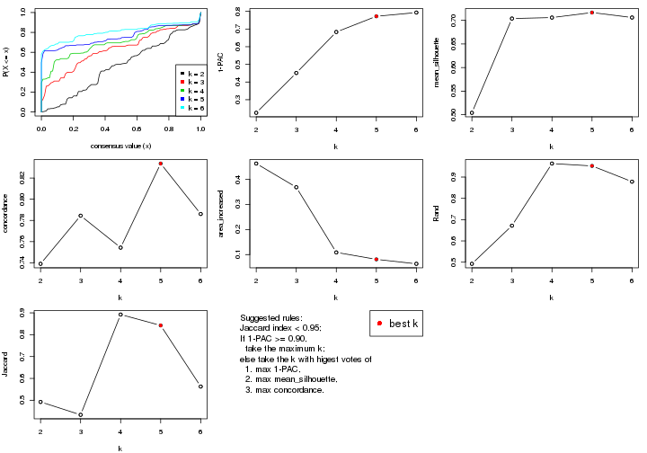

The numeric values for all these statistics can be obtained by `get_stats()`.

```r
get_stats(res)
```

```
#>   k 1-PAC mean_silhouette concordance area_increased  Rand Jaccard
#> 2 2 0.226           0.504       0.739         0.4628 0.492   0.492
#> 3 3 0.451           0.704       0.784         0.3684 0.672   0.433
#> 4 4 0.683           0.706       0.754         0.1087 0.964   0.892
#> 5 5 0.772           0.717       0.834         0.0811 0.952   0.842
#> 6 6 0.793           0.706       0.786         0.0633 0.878   0.563
```

`suggest_best_k()` suggests the best $k$ based on these statistics. The rules are as follows:

- All $k$ with Jaccard index larger than 0.95 are removed because increasing
  $k$ does not provide enough extra information. If all $k$ are removed, it is
  marked as no subgroup is detected.
- For all $k$ with 1-PAC score larger than 0.9, the maximal $k$ is taken as
  the best $k$, and other $k$ are marked as optional $k$.
- If it does not fit the second rule. The $k$ with the maximal vote of the
  highest 1-PAC score, highest mean silhouette, and highest concordance is
  taken as the best $k$.

```r
suggest_best_k(res)
```

```
#> [1] 5
```


Following shows the table of the partitions (You need to click the **show/hide
code output** link to see it). The membership matrix (columns with name `p*`)
is inferred by
[`clue::cl_consensus()`](https://www.rdocumentation.org/link/cl_consensus?package=clue)
function with the `SE` method. Basically the value in the membership matrix
represents the probability to belong to a certain group. The finall class
label for an item is determined with the group with highest probability it
belongs to.

In `get_classes()` function, the entropy is calculated from the membership
matrix and the silhouette score is calculated from the consensus matrix.


<script>
$( function() {
	$( '#tabs-SD-hclust-get-classes' ).tabs();
} );
</script>
<div id='tabs-SD-hclust-get-classes'>
<ul>
<li><a href='#tab-SD-hclust-get-classes-1'>k = 2</a></li>
<li><a href='#tab-SD-hclust-get-classes-2'>k = 3</a></li>
<li><a href='#tab-SD-hclust-get-classes-3'>k = 4</a></li>
<li><a href='#tab-SD-hclust-get-classes-4'>k = 5</a></li>
<li><a href='#tab-SD-hclust-get-classes-5'>k = 6</a></li>
</ul>

<div id='tab-SD-hclust-get-classes-1'>
<p><a id='tab-SD-hclust-get-classes-1-a' style='color:#0366d6' href='#'>show/hide code output</a></p>
<pre><code class="r">cbind(get_classes(res, k = 2), get_membership(res, k = 2))
</code></pre>

<pre><code>#&gt;           class entropy silhouette    p1    p2
#&gt; GSM525314     1  0.7602      0.578 0.780 0.220
#&gt; GSM525315     2  0.9491      0.539 0.368 0.632
#&gt; GSM525316     1  0.9850      0.112 0.572 0.428
#&gt; GSM525317     2  0.0376      0.701 0.004 0.996
#&gt; GSM525318     2  0.0376      0.701 0.004 0.996
#&gt; GSM525319     2  0.9491      0.539 0.368 0.632
#&gt; GSM525320     2  0.0672      0.700 0.008 0.992
#&gt; GSM525321     2  0.3879      0.650 0.076 0.924
#&gt; GSM525322     2  0.6623      0.688 0.172 0.828
#&gt; GSM525323     1  0.7602      0.578 0.780 0.220
#&gt; GSM525324     2  0.6973      0.665 0.188 0.812
#&gt; GSM525325     1  0.9866      0.104 0.568 0.432
#&gt; GSM525326     1  0.4298      0.510 0.912 0.088
#&gt; GSM525327     1  0.7602      0.578 0.780 0.220
#&gt; GSM525328     1  0.7602      0.578 0.780 0.220
#&gt; GSM525329     2  0.4431      0.631 0.092 0.908
#&gt; GSM525330     1  0.9866      0.104 0.568 0.432
#&gt; GSM525331     1  0.9866      0.104 0.568 0.432
#&gt; GSM525332     1  0.9866      0.104 0.568 0.432
#&gt; GSM525333     2  0.9775      0.443 0.412 0.588
#&gt; GSM525334     2  0.2236      0.684 0.036 0.964
#&gt; GSM525335     2  0.9580      0.517 0.380 0.620
#&gt; GSM525336     1  0.5408      0.537 0.876 0.124
#&gt; GSM525337     2  0.9491      0.539 0.368 0.632
#&gt; GSM525338     2  0.3584      0.657 0.068 0.932
#&gt; GSM525339     1  0.7602      0.578 0.780 0.220
#&gt; GSM525340     1  0.7602      0.578 0.780 0.220
#&gt; GSM525341     2  0.9491      0.539 0.368 0.632
#&gt; GSM525342     1  0.9850      0.112 0.572 0.428
#&gt; GSM525343     2  0.0376      0.701 0.004 0.996
#&gt; GSM525344     2  0.6623      0.688 0.172 0.828
#&gt; GSM525345     1  0.7602      0.578 0.780 0.220
#&gt; GSM525346     2  0.6973      0.665 0.188 0.812
#&gt; GSM525347     1  0.9866      0.104 0.568 0.432
#&gt; GSM525348     1  0.4298      0.510 0.912 0.088
#&gt; GSM525349     1  0.7602      0.578 0.780 0.220
#&gt; GSM525350     1  0.9866      0.104 0.568 0.432
#&gt; GSM525351     1  0.9866      0.104 0.568 0.432
#&gt; GSM525352     1  0.9866      0.104 0.568 0.432
#&gt; GSM525353     2  0.9775      0.443 0.412 0.588
#&gt; GSM525354     2  0.2236      0.684 0.036 0.964
#&gt; GSM525355     2  0.9580      0.517 0.380 0.620
#&gt; GSM525356     1  0.5408      0.537 0.876 0.124
#&gt; GSM525357     2  0.3584      0.657 0.068 0.932
#&gt; GSM525358     1  0.7602      0.578 0.780 0.220
#&gt; GSM525359     1  0.7602      0.578 0.780 0.220
#&gt; GSM525360     2  0.9491      0.539 0.368 0.632
#&gt; GSM525361     1  0.9850      0.112 0.572 0.428
#&gt; GSM525362     2  0.0376      0.701 0.004 0.996
#&gt; GSM525363     2  0.9491      0.539 0.368 0.632
#&gt; GSM525364     2  0.0672      0.700 0.008 0.992
#&gt; GSM525365     2  0.3879      0.650 0.076 0.924
#&gt; GSM525366     2  0.6623      0.688 0.172 0.828
#&gt; GSM525367     1  0.7602      0.578 0.780 0.220
#&gt; GSM525368     2  0.6973      0.665 0.188 0.812
#&gt; GSM525369     1  0.9866      0.104 0.568 0.432
#&gt; GSM525370     1  0.4298      0.510 0.912 0.088
#&gt; GSM525371     1  0.7602      0.578 0.780 0.220
#&gt; GSM525372     2  0.4431      0.631 0.092 0.908
#&gt; GSM525373     2  0.9491      0.539 0.368 0.632
#&gt; GSM525374     2  0.3584      0.657 0.068 0.932
#&gt; GSM525375     1  0.7602      0.578 0.780 0.220
</code></pre>

<script>
$('#tab-SD-hclust-get-classes-1-a').parent().next().next().hide();
$('#tab-SD-hclust-get-classes-1-a').click(function(){
  $('#tab-SD-hclust-get-classes-1-a').parent().next().next().toggle();
  return(false);
});
</script>
</div>

<div id='tab-SD-hclust-get-classes-2'>
<p><a id='tab-SD-hclust-get-classes-2-a' style='color:#0366d6' href='#'>show/hide code output</a></p>
<pre><code class="r">cbind(get_classes(res, k = 3), get_membership(res, k = 3))
</code></pre>

<pre><code>#&gt;           class entropy silhouette    p1    p2    p3
#&gt; GSM525314     1  0.0237      0.952 0.996 0.004 0.000
#&gt; GSM525315     2  0.6008      0.530 0.000 0.628 0.372
#&gt; GSM525316     2  0.0892      0.715 0.020 0.980 0.000
#&gt; GSM525317     3  0.8042      0.780 0.148 0.200 0.652
#&gt; GSM525318     3  0.8042      0.780 0.148 0.200 0.652
#&gt; GSM525319     2  0.6008      0.530 0.000 0.628 0.372
#&gt; GSM525320     3  0.7999      0.782 0.148 0.196 0.656
#&gt; GSM525321     3  0.7757      0.788 0.224 0.112 0.664
#&gt; GSM525322     3  0.3091      0.697 0.016 0.072 0.912
#&gt; GSM525323     1  0.0237      0.952 0.996 0.004 0.000
#&gt; GSM525324     3  0.5988      0.310 0.000 0.368 0.632
#&gt; GSM525325     2  0.1315      0.719 0.020 0.972 0.008
#&gt; GSM525326     2  0.7613      0.226 0.316 0.620 0.064
#&gt; GSM525327     1  0.0237      0.952 0.996 0.004 0.000
#&gt; GSM525328     1  0.0237      0.952 0.996 0.004 0.000
#&gt; GSM525329     3  0.6423      0.743 0.228 0.044 0.728
#&gt; GSM525330     2  0.1315      0.719 0.020 0.972 0.008
#&gt; GSM525331     2  0.1315      0.719 0.020 0.972 0.008
#&gt; GSM525332     2  0.1315      0.719 0.020 0.972 0.008
#&gt; GSM525333     2  0.5902      0.579 0.004 0.680 0.316
#&gt; GSM525334     3  0.6239      0.786 0.160 0.072 0.768
#&gt; GSM525335     2  0.5948      0.544 0.000 0.640 0.360
#&gt; GSM525336     1  0.6226      0.656 0.720 0.252 0.028
#&gt; GSM525337     2  0.6008      0.530 0.000 0.628 0.372
#&gt; GSM525338     3  0.7781      0.789 0.220 0.116 0.664
#&gt; GSM525339     1  0.0237      0.952 0.996 0.004 0.000
#&gt; GSM525340     1  0.0237      0.952 0.996 0.004 0.000
#&gt; GSM525341     2  0.6008      0.530 0.000 0.628 0.372
#&gt; GSM525342     2  0.0892      0.715 0.020 0.980 0.000
#&gt; GSM525343     3  0.8042      0.780 0.148 0.200 0.652
#&gt; GSM525344     3  0.3091      0.697 0.016 0.072 0.912
#&gt; GSM525345     1  0.0237      0.952 0.996 0.004 0.000
#&gt; GSM525346     3  0.5988      0.310 0.000 0.368 0.632
#&gt; GSM525347     2  0.1315      0.719 0.020 0.972 0.008
#&gt; GSM525348     2  0.7613      0.226 0.316 0.620 0.064
#&gt; GSM525349     1  0.0237      0.952 0.996 0.004 0.000
#&gt; GSM525350     2  0.1315      0.719 0.020 0.972 0.008
#&gt; GSM525351     2  0.1315      0.719 0.020 0.972 0.008
#&gt; GSM525352     2  0.1315      0.719 0.020 0.972 0.008
#&gt; GSM525353     2  0.5902      0.579 0.004 0.680 0.316
#&gt; GSM525354     3  0.6239      0.786 0.160 0.072 0.768
#&gt; GSM525355     2  0.5948      0.544 0.000 0.640 0.360
#&gt; GSM525356     1  0.6226      0.656 0.720 0.252 0.028
#&gt; GSM525357     3  0.7781      0.789 0.220 0.116 0.664
#&gt; GSM525358     1  0.0237      0.952 0.996 0.004 0.000
#&gt; GSM525359     1  0.0237      0.952 0.996 0.004 0.000
#&gt; GSM525360     2  0.6008      0.530 0.000 0.628 0.372
#&gt; GSM525361     2  0.0892      0.715 0.020 0.980 0.000
#&gt; GSM525362     3  0.8042      0.780 0.148 0.200 0.652
#&gt; GSM525363     2  0.6008      0.530 0.000 0.628 0.372
#&gt; GSM525364     3  0.7999      0.782 0.148 0.196 0.656
#&gt; GSM525365     3  0.7757      0.788 0.224 0.112 0.664
#&gt; GSM525366     3  0.3091      0.697 0.016 0.072 0.912
#&gt; GSM525367     1  0.0237      0.952 0.996 0.004 0.000
#&gt; GSM525368     3  0.5988      0.310 0.000 0.368 0.632
#&gt; GSM525369     2  0.1315      0.719 0.020 0.972 0.008
#&gt; GSM525370     2  0.7613      0.226 0.316 0.620 0.064
#&gt; GSM525371     1  0.0237      0.952 0.996 0.004 0.000
#&gt; GSM525372     3  0.6423      0.743 0.228 0.044 0.728
#&gt; GSM525373     2  0.6008      0.530 0.000 0.628 0.372
#&gt; GSM525374     3  0.7781      0.789 0.220 0.116 0.664
#&gt; GSM525375     1  0.0237      0.952 0.996 0.004 0.000
</code></pre>

<script>
$('#tab-SD-hclust-get-classes-2-a').parent().next().next().hide();
$('#tab-SD-hclust-get-classes-2-a').click(function(){
  $('#tab-SD-hclust-get-classes-2-a').parent().next().next().toggle();
  return(false);
});
</script>
</div>

<div id='tab-SD-hclust-get-classes-3'>
<p><a id='tab-SD-hclust-get-classes-3-a' style='color:#0366d6' href='#'>show/hide code output</a></p>
<pre><code class="r">cbind(get_classes(res, k = 4), get_membership(res, k = 4))
</code></pre>

<pre><code>#&gt;           class entropy silhouette    p1    p2    p3    p4
#&gt; GSM525314     1  0.0000    0.94893 1.000 0.000 0.000 0.000
#&gt; GSM525315     2  0.6640    0.68173 0.000 0.604 0.128 0.268
#&gt; GSM525316     2  0.0524    0.63366 0.000 0.988 0.004 0.008
#&gt; GSM525317     3  0.6089    0.70243 0.052 0.172 0.724 0.052
#&gt; GSM525318     3  0.6089    0.70243 0.052 0.172 0.724 0.052
#&gt; GSM525319     2  0.6640    0.68173 0.000 0.604 0.128 0.268
#&gt; GSM525320     3  0.5807    0.70732 0.052 0.168 0.740 0.040
#&gt; GSM525321     3  0.5404    0.69969 0.076 0.068 0.788 0.068
#&gt; GSM525322     3  0.4353    0.59324 0.000 0.012 0.756 0.232
#&gt; GSM525323     1  0.0000    0.94893 1.000 0.000 0.000 0.000
#&gt; GSM525324     3  0.7864   -0.00323 0.000 0.320 0.392 0.288
#&gt; GSM525325     2  0.0188    0.64633 0.000 0.996 0.004 0.000
#&gt; GSM525326     4  0.4866    1.00000 0.000 0.404 0.000 0.596
#&gt; GSM525327     1  0.0000    0.94893 1.000 0.000 0.000 0.000
#&gt; GSM525328     1  0.0000    0.94893 1.000 0.000 0.000 0.000
#&gt; GSM525329     3  0.4458    0.63717 0.076 0.000 0.808 0.116
#&gt; GSM525330     2  0.0188    0.64633 0.000 0.996 0.004 0.000
#&gt; GSM525331     2  0.0188    0.64633 0.000 0.996 0.004 0.000
#&gt; GSM525332     2  0.0188    0.64633 0.000 0.996 0.004 0.000
#&gt; GSM525333     2  0.6080    0.68720 0.000 0.664 0.100 0.236
#&gt; GSM525334     3  0.3924    0.69003 0.052 0.032 0.864 0.052
#&gt; GSM525335     2  0.6501    0.68482 0.000 0.616 0.116 0.268
#&gt; GSM525336     1  0.6149    0.52311 0.676 0.180 0.000 0.144
#&gt; GSM525337     2  0.6640    0.68173 0.000 0.604 0.128 0.268
#&gt; GSM525338     3  0.5403    0.70030 0.076 0.072 0.788 0.064
#&gt; GSM525339     1  0.0000    0.94893 1.000 0.000 0.000 0.000
#&gt; GSM525340     1  0.0000    0.94893 1.000 0.000 0.000 0.000
#&gt; GSM525341     2  0.6640    0.68173 0.000 0.604 0.128 0.268
#&gt; GSM525342     2  0.0524    0.63366 0.000 0.988 0.004 0.008
#&gt; GSM525343     3  0.6089    0.70243 0.052 0.172 0.724 0.052
#&gt; GSM525344     3  0.4353    0.59324 0.000 0.012 0.756 0.232
#&gt; GSM525345     1  0.0000    0.94893 1.000 0.000 0.000 0.000
#&gt; GSM525346     3  0.7864   -0.00323 0.000 0.320 0.392 0.288
#&gt; GSM525347     2  0.0188    0.64633 0.000 0.996 0.004 0.000
#&gt; GSM525348     4  0.4866    1.00000 0.000 0.404 0.000 0.596
#&gt; GSM525349     1  0.0000    0.94893 1.000 0.000 0.000 0.000
#&gt; GSM525350     2  0.0188    0.64633 0.000 0.996 0.004 0.000
#&gt; GSM525351     2  0.0188    0.64633 0.000 0.996 0.004 0.000
#&gt; GSM525352     2  0.0188    0.64633 0.000 0.996 0.004 0.000
#&gt; GSM525353     2  0.6080    0.68720 0.000 0.664 0.100 0.236
#&gt; GSM525354     3  0.3924    0.69003 0.052 0.032 0.864 0.052
#&gt; GSM525355     2  0.6501    0.68482 0.000 0.616 0.116 0.268
#&gt; GSM525356     1  0.6149    0.52311 0.676 0.180 0.000 0.144
#&gt; GSM525357     3  0.5403    0.70030 0.076 0.072 0.788 0.064
#&gt; GSM525358     1  0.0000    0.94893 1.000 0.000 0.000 0.000
#&gt; GSM525359     1  0.0000    0.94893 1.000 0.000 0.000 0.000
#&gt; GSM525360     2  0.6640    0.68173 0.000 0.604 0.128 0.268
#&gt; GSM525361     2  0.0524    0.63366 0.000 0.988 0.004 0.008
#&gt; GSM525362     3  0.6089    0.70243 0.052 0.172 0.724 0.052
#&gt; GSM525363     2  0.6640    0.68173 0.000 0.604 0.128 0.268
#&gt; GSM525364     3  0.5807    0.70732 0.052 0.168 0.740 0.040
#&gt; GSM525365     3  0.5404    0.69969 0.076 0.068 0.788 0.068
#&gt; GSM525366     3  0.4353    0.59324 0.000 0.012 0.756 0.232
#&gt; GSM525367     1  0.0000    0.94893 1.000 0.000 0.000 0.000
#&gt; GSM525368     3  0.7864   -0.00323 0.000 0.320 0.392 0.288
#&gt; GSM525369     2  0.0188    0.64633 0.000 0.996 0.004 0.000
#&gt; GSM525370     4  0.4866    1.00000 0.000 0.404 0.000 0.596
#&gt; GSM525371     1  0.0000    0.94893 1.000 0.000 0.000 0.000
#&gt; GSM525372     3  0.4458    0.63717 0.076 0.000 0.808 0.116
#&gt; GSM525373     2  0.6640    0.68173 0.000 0.604 0.128 0.268
#&gt; GSM525374     3  0.5403    0.70030 0.076 0.072 0.788 0.064
#&gt; GSM525375     1  0.0000    0.94893 1.000 0.000 0.000 0.000
</code></pre>

<script>
$('#tab-SD-hclust-get-classes-3-a').parent().next().next().hide();
$('#tab-SD-hclust-get-classes-3-a').click(function(){
  $('#tab-SD-hclust-get-classes-3-a').parent().next().next().toggle();
  return(false);
});
</script>
</div>

<div id='tab-SD-hclust-get-classes-4'>
<p><a id='tab-SD-hclust-get-classes-4-a' style='color:#0366d6' href='#'>show/hide code output</a></p>
<pre><code class="r">cbind(get_classes(res, k = 5), get_membership(res, k = 5))
</code></pre>

<pre><code>#&gt;           class entropy silhouette    p1    p2    p3    p4    p5
#&gt; GSM525314     1  0.0000      0.951 1.000 0.000 0.000 0.000 0.000
#&gt; GSM525315     5  0.4565      0.636 0.000 0.408 0.012 0.000 0.580
#&gt; GSM525316     5  0.0324      0.747 0.000 0.004 0.000 0.004 0.992
#&gt; GSM525317     3  0.3838      0.587 0.000 0.280 0.716 0.000 0.004
#&gt; GSM525318     3  0.3838      0.587 0.000 0.280 0.716 0.000 0.004
#&gt; GSM525319     5  0.4565      0.636 0.000 0.408 0.012 0.000 0.580
#&gt; GSM525320     3  0.3741      0.603 0.000 0.264 0.732 0.000 0.004
#&gt; GSM525321     3  0.1544      0.669 0.000 0.068 0.932 0.000 0.000
#&gt; GSM525322     2  0.4449      0.404 0.000 0.604 0.388 0.004 0.004
#&gt; GSM525323     1  0.0000      0.951 1.000 0.000 0.000 0.000 0.000
#&gt; GSM525324     2  0.3398      0.555 0.000 0.780 0.216 0.000 0.004
#&gt; GSM525325     5  0.0000      0.751 0.000 0.000 0.000 0.000 1.000
#&gt; GSM525326     4  0.0162      1.000 0.000 0.000 0.000 0.996 0.004
#&gt; GSM525327     1  0.0000      0.951 1.000 0.000 0.000 0.000 0.000
#&gt; GSM525328     1  0.0000      0.951 1.000 0.000 0.000 0.000 0.000
#&gt; GSM525329     3  0.3366      0.526 0.000 0.212 0.784 0.004 0.000
#&gt; GSM525330     5  0.0000      0.751 0.000 0.000 0.000 0.000 1.000
#&gt; GSM525331     5  0.0000      0.751 0.000 0.000 0.000 0.000 1.000
#&gt; GSM525332     5  0.0000      0.751 0.000 0.000 0.000 0.000 1.000
#&gt; GSM525333     5  0.4060      0.665 0.000 0.360 0.000 0.000 0.640
#&gt; GSM525334     3  0.4532      0.507 0.000 0.304 0.672 0.004 0.020
#&gt; GSM525335     5  0.4341      0.644 0.000 0.404 0.004 0.000 0.592
#&gt; GSM525336     1  0.3913      0.555 0.676 0.000 0.000 0.324 0.000
#&gt; GSM525337     5  0.4565      0.636 0.000 0.408 0.012 0.000 0.580
#&gt; GSM525338     3  0.0000      0.681 0.000 0.000 1.000 0.000 0.000
#&gt; GSM525339     1  0.0000      0.951 1.000 0.000 0.000 0.000 0.000
#&gt; GSM525340     1  0.0000      0.951 1.000 0.000 0.000 0.000 0.000
#&gt; GSM525341     5  0.4565      0.636 0.000 0.408 0.012 0.000 0.580
#&gt; GSM525342     5  0.0324      0.747 0.000 0.004 0.000 0.004 0.992
#&gt; GSM525343     3  0.3838      0.587 0.000 0.280 0.716 0.000 0.004
#&gt; GSM525344     2  0.4449      0.404 0.000 0.604 0.388 0.004 0.004
#&gt; GSM525345     1  0.0000      0.951 1.000 0.000 0.000 0.000 0.000
#&gt; GSM525346     2  0.3398      0.555 0.000 0.780 0.216 0.000 0.004
#&gt; GSM525347     5  0.0000      0.751 0.000 0.000 0.000 0.000 1.000
#&gt; GSM525348     4  0.0162      1.000 0.000 0.000 0.000 0.996 0.004
#&gt; GSM525349     1  0.0000      0.951 1.000 0.000 0.000 0.000 0.000
#&gt; GSM525350     5  0.0000      0.751 0.000 0.000 0.000 0.000 1.000
#&gt; GSM525351     5  0.0000      0.751 0.000 0.000 0.000 0.000 1.000
#&gt; GSM525352     5  0.0000      0.751 0.000 0.000 0.000 0.000 1.000
#&gt; GSM525353     5  0.4060      0.665 0.000 0.360 0.000 0.000 0.640
#&gt; GSM525354     3  0.4532      0.507 0.000 0.304 0.672 0.004 0.020
#&gt; GSM525355     5  0.4341      0.644 0.000 0.404 0.004 0.000 0.592
#&gt; GSM525356     1  0.3913      0.555 0.676 0.000 0.000 0.324 0.000
#&gt; GSM525357     3  0.0000      0.681 0.000 0.000 1.000 0.000 0.000
#&gt; GSM525358     1  0.0000      0.951 1.000 0.000 0.000 0.000 0.000
#&gt; GSM525359     1  0.0000      0.951 1.000 0.000 0.000 0.000 0.000
#&gt; GSM525360     5  0.4565      0.636 0.000 0.408 0.012 0.000 0.580
#&gt; GSM525361     5  0.0324      0.747 0.000 0.004 0.000 0.004 0.992
#&gt; GSM525362     3  0.3838      0.587 0.000 0.280 0.716 0.000 0.004
#&gt; GSM525363     5  0.4565      0.636 0.000 0.408 0.012 0.000 0.580
#&gt; GSM525364     3  0.3741      0.603 0.000 0.264 0.732 0.000 0.004
#&gt; GSM525365     3  0.1544      0.669 0.000 0.068 0.932 0.000 0.000
#&gt; GSM525366     2  0.4449      0.404 0.000 0.604 0.388 0.004 0.004
#&gt; GSM525367     1  0.0000      0.951 1.000 0.000 0.000 0.000 0.000
#&gt; GSM525368     2  0.3398      0.555 0.000 0.780 0.216 0.000 0.004
#&gt; GSM525369     5  0.0000      0.751 0.000 0.000 0.000 0.000 1.000
#&gt; GSM525370     4  0.0162      1.000 0.000 0.000 0.000 0.996 0.004
#&gt; GSM525371     1  0.0000      0.951 1.000 0.000 0.000 0.000 0.000
#&gt; GSM525372     3  0.3366      0.526 0.000 0.212 0.784 0.004 0.000
#&gt; GSM525373     5  0.4565      0.636 0.000 0.408 0.012 0.000 0.580
#&gt; GSM525374     3  0.0000      0.681 0.000 0.000 1.000 0.000 0.000
#&gt; GSM525375     1  0.0000      0.951 1.000 0.000 0.000 0.000 0.000
</code></pre>

<script>
$('#tab-SD-hclust-get-classes-4-a').parent().next().next().hide();
$('#tab-SD-hclust-get-classes-4-a').click(function(){
  $('#tab-SD-hclust-get-classes-4-a').parent().next().next().toggle();
  return(false);
});
</script>
</div>

<div id='tab-SD-hclust-get-classes-5'>
<p><a id='tab-SD-hclust-get-classes-5-a' style='color:#0366d6' href='#'>show/hide code output</a></p>
<pre><code class="r">cbind(get_classes(res, k = 6), get_membership(res, k = 6))
</code></pre>

<pre><code>#&gt;           class entropy silhouette    p1    p2    p3    p4    p5    p6
#&gt; GSM525314     1  0.0000     0.8315 1.000 0.000 0.000 0.000 0.000 0.000
#&gt; GSM525315     2  0.3370     0.9790 0.000 0.772 0.004 0.000 0.212 0.012
#&gt; GSM525316     5  0.0363     0.9872 0.000 0.012 0.000 0.000 0.988 0.000
#&gt; GSM525317     3  0.4150     0.4802 0.000 0.028 0.652 0.000 0.000 0.320
#&gt; GSM525318     3  0.4150     0.4802 0.000 0.028 0.652 0.000 0.000 0.320
#&gt; GSM525319     2  0.3370     0.9790 0.000 0.772 0.004 0.000 0.212 0.012
#&gt; GSM525320     3  0.3898     0.4701 0.000 0.012 0.652 0.000 0.000 0.336
#&gt; GSM525321     3  0.3817     0.0116 0.000 0.000 0.568 0.000 0.000 0.432
#&gt; GSM525322     6  0.1501     0.5223 0.000 0.076 0.000 0.000 0.000 0.924
#&gt; GSM525323     1  0.0000     0.8315 1.000 0.000 0.000 0.000 0.000 0.000
#&gt; GSM525324     3  0.5083     0.1635 0.000 0.100 0.580 0.000 0.000 0.320
#&gt; GSM525325     5  0.0000     0.9957 0.000 0.000 0.000 0.000 1.000 0.000
#&gt; GSM525326     4  0.0000     1.0000 0.000 0.000 0.000 1.000 0.000 0.000
#&gt; GSM525327     1  0.4890     0.7200 0.684 0.216 0.024 0.000 0.000 0.076
#&gt; GSM525328     1  0.4890     0.7200 0.684 0.216 0.024 0.000 0.000 0.076
#&gt; GSM525329     6  0.3747     0.4389 0.000 0.000 0.396 0.000 0.000 0.604
#&gt; GSM525330     5  0.0000     0.9957 0.000 0.000 0.000 0.000 1.000 0.000
#&gt; GSM525331     5  0.0000     0.9957 0.000 0.000 0.000 0.000 1.000 0.000
#&gt; GSM525332     5  0.0000     0.9957 0.000 0.000 0.000 0.000 1.000 0.000
#&gt; GSM525333     2  0.3288     0.9206 0.000 0.724 0.000 0.000 0.276 0.000
#&gt; GSM525334     6  0.4372     0.4495 0.000 0.036 0.308 0.000 0.004 0.652
#&gt; GSM525335     2  0.3109     0.9719 0.000 0.772 0.000 0.000 0.224 0.004
#&gt; GSM525336     1  0.6835     0.3104 0.420 0.212 0.016 0.324 0.000 0.028
#&gt; GSM525337     2  0.3370     0.9790 0.000 0.772 0.004 0.000 0.212 0.012
#&gt; GSM525338     3  0.3727     0.1691 0.000 0.000 0.612 0.000 0.000 0.388
#&gt; GSM525339     1  0.0000     0.8315 1.000 0.000 0.000 0.000 0.000 0.000
#&gt; GSM525340     1  0.0000     0.8315 1.000 0.000 0.000 0.000 0.000 0.000
#&gt; GSM525341     2  0.3370     0.9790 0.000 0.772 0.004 0.000 0.212 0.012
#&gt; GSM525342     5  0.0363     0.9872 0.000 0.012 0.000 0.000 0.988 0.000
#&gt; GSM525343     3  0.4150     0.4802 0.000 0.028 0.652 0.000 0.000 0.320
#&gt; GSM525344     6  0.1501     0.5223 0.000 0.076 0.000 0.000 0.000 0.924
#&gt; GSM525345     1  0.0000     0.8315 1.000 0.000 0.000 0.000 0.000 0.000
#&gt; GSM525346     3  0.5083     0.1635 0.000 0.100 0.580 0.000 0.000 0.320
#&gt; GSM525347     5  0.0000     0.9957 0.000 0.000 0.000 0.000 1.000 0.000
#&gt; GSM525348     4  0.0000     1.0000 0.000 0.000 0.000 1.000 0.000 0.000
#&gt; GSM525349     1  0.4890     0.7200 0.684 0.216 0.024 0.000 0.000 0.076
#&gt; GSM525350     5  0.0000     0.9957 0.000 0.000 0.000 0.000 1.000 0.000
#&gt; GSM525351     5  0.0000     0.9957 0.000 0.000 0.000 0.000 1.000 0.000
#&gt; GSM525352     5  0.0000     0.9957 0.000 0.000 0.000 0.000 1.000 0.000
#&gt; GSM525353     2  0.3288     0.9206 0.000 0.724 0.000 0.000 0.276 0.000
#&gt; GSM525354     6  0.4372     0.4495 0.000 0.036 0.308 0.000 0.004 0.652
#&gt; GSM525355     2  0.3109     0.9719 0.000 0.772 0.000 0.000 0.224 0.004
#&gt; GSM525356     1  0.6835     0.3104 0.420 0.212 0.016 0.324 0.000 0.028
#&gt; GSM525357     3  0.3727     0.1691 0.000 0.000 0.612 0.000 0.000 0.388
#&gt; GSM525358     1  0.0000     0.8315 1.000 0.000 0.000 0.000 0.000 0.000
#&gt; GSM525359     1  0.0000     0.8315 1.000 0.000 0.000 0.000 0.000 0.000
#&gt; GSM525360     2  0.3370     0.9790 0.000 0.772 0.004 0.000 0.212 0.012
#&gt; GSM525361     5  0.0363     0.9872 0.000 0.012 0.000 0.000 0.988 0.000
#&gt; GSM525362     3  0.4150     0.4802 0.000 0.028 0.652 0.000 0.000 0.320
#&gt; GSM525363     2  0.3370     0.9790 0.000 0.772 0.004 0.000 0.212 0.012
#&gt; GSM525364     3  0.3898     0.4701 0.000 0.012 0.652 0.000 0.000 0.336
#&gt; GSM525365     3  0.3817     0.0116 0.000 0.000 0.568 0.000 0.000 0.432
#&gt; GSM525366     6  0.1501     0.5223 0.000 0.076 0.000 0.000 0.000 0.924
#&gt; GSM525367     1  0.0000     0.8315 1.000 0.000 0.000 0.000 0.000 0.000
#&gt; GSM525368     3  0.5083     0.1635 0.000 0.100 0.580 0.000 0.000 0.320
#&gt; GSM525369     5  0.0000     0.9957 0.000 0.000 0.000 0.000 1.000 0.000
#&gt; GSM525370     4  0.0000     1.0000 0.000 0.000 0.000 1.000 0.000 0.000
#&gt; GSM525371     1  0.4890     0.7200 0.684 0.216 0.024 0.000 0.000 0.076
#&gt; GSM525372     6  0.3747     0.4389 0.000 0.000 0.396 0.000 0.000 0.604
#&gt; GSM525373     2  0.3370     0.9790 0.000 0.772 0.004 0.000 0.212 0.012
#&gt; GSM525374     3  0.3727     0.1691 0.000 0.000 0.612 0.000 0.000 0.388
#&gt; GSM525375     1  0.0000     0.8315 1.000 0.000 0.000 0.000 0.000 0.000
</code></pre>

<script>
$('#tab-SD-hclust-get-classes-5-a').parent().next().next().hide();
$('#tab-SD-hclust-get-classes-5-a').click(function(){
  $('#tab-SD-hclust-get-classes-5-a').parent().next().next().toggle();
  return(false);
});
</script>
</div>
</div>

Heatmaps for the consensus matrix. It visualizes the probability of two
samples to be in a same group.


<script>
$( function() {
	$( '#tabs-SD-hclust-consensus-heatmap' ).tabs();
} );
</script>
<div id='tabs-SD-hclust-consensus-heatmap'>
<ul>
<li><a href='#tab-SD-hclust-consensus-heatmap-1'>k = 2</a></li>
<li><a href='#tab-SD-hclust-consensus-heatmap-2'>k = 3</a></li>
<li><a href='#tab-SD-hclust-consensus-heatmap-3'>k = 4</a></li>
<li><a href='#tab-SD-hclust-consensus-heatmap-4'>k = 5</a></li>
<li><a href='#tab-SD-hclust-consensus-heatmap-5'>k = 6</a></li>
</ul>
<div id='tab-SD-hclust-consensus-heatmap-1'>
<pre><code class="r">consensus_heatmap(res, k = 2)
</code></pre>

<p>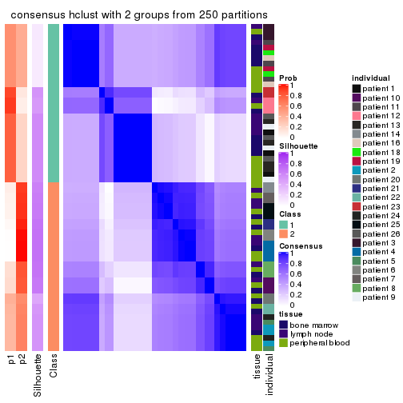</p>

</div>
<div id='tab-SD-hclust-consensus-heatmap-2'>
<pre><code class="r">consensus_heatmap(res, k = 3)
</code></pre>

<p>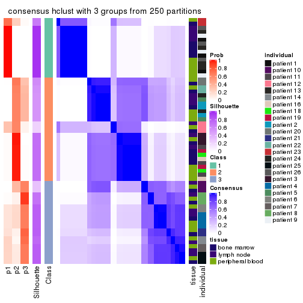</p>

</div>
<div id='tab-SD-hclust-consensus-heatmap-3'>
<pre><code class="r">consensus_heatmap(res, k = 4)
</code></pre>

<p>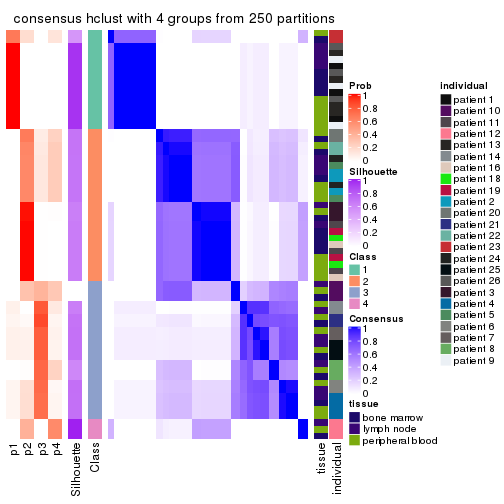</p>

</div>
<div id='tab-SD-hclust-consensus-heatmap-4'>
<pre><code class="r">consensus_heatmap(res, k = 5)
</code></pre>

<p>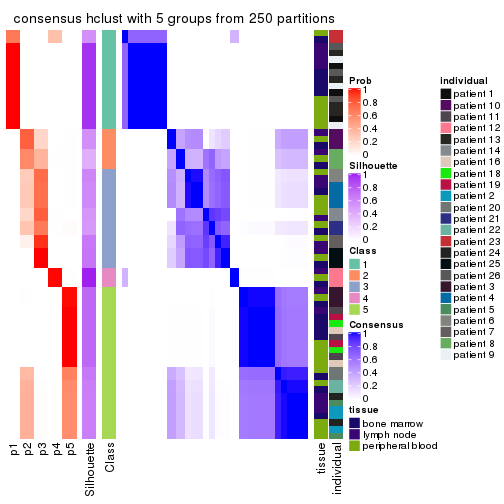</p>

</div>
<div id='tab-SD-hclust-consensus-heatmap-5'>
<pre><code class="r">consensus_heatmap(res, k = 6)
</code></pre>

<p>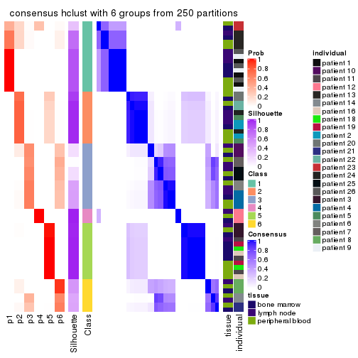</p>

</div>
</div>

Heatmaps for the membership of samples in all partitions to see how consistent they are:


<script>
$( function() {
	$( '#tabs-SD-hclust-membership-heatmap' ).tabs();
} );
</script>
<div id='tabs-SD-hclust-membership-heatmap'>
<ul>
<li><a href='#tab-SD-hclust-membership-heatmap-1'>k = 2</a></li>
<li><a href='#tab-SD-hclust-membership-heatmap-2'>k = 3</a></li>
<li><a href='#tab-SD-hclust-membership-heatmap-3'>k = 4</a></li>
<li><a href='#tab-SD-hclust-membership-heatmap-4'>k = 5</a></li>
<li><a href='#tab-SD-hclust-membership-heatmap-5'>k = 6</a></li>
</ul>
<div id='tab-SD-hclust-membership-heatmap-1'>
<pre><code class="r">membership_heatmap(res, k = 2)
</code></pre>

<p>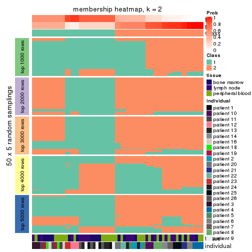</p>

</div>
<div id='tab-SD-hclust-membership-heatmap-2'>
<pre><code class="r">membership_heatmap(res, k = 3)
</code></pre>

<p>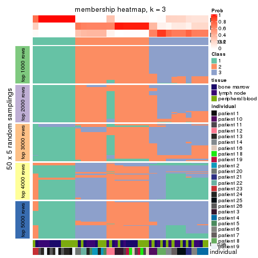</p>

</div>
<div id='tab-SD-hclust-membership-heatmap-3'>
<pre><code class="r">membership_heatmap(res, k = 4)
</code></pre>

<p>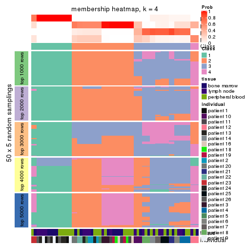</p>

</div>
<div id='tab-SD-hclust-membership-heatmap-4'>
<pre><code class="r">membership_heatmap(res, k = 5)
</code></pre>

<p>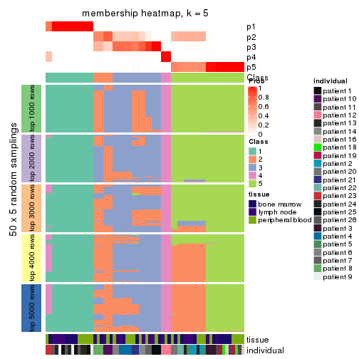</p>

</div>
<div id='tab-SD-hclust-membership-heatmap-5'>
<pre><code class="r">membership_heatmap(res, k = 6)
</code></pre>

<p>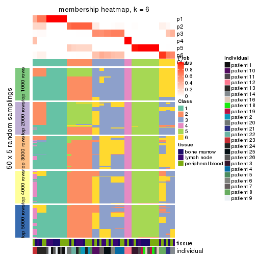</p>

</div>
</div>

As soon as we have had the classes for columns, we can look for signatures
which are significantly different between classes which can be candidate marks
for certain classes. Following are the heatmaps for signatures.


Signature heatmaps where rows are scaled:


<script>
$( function() {
	$( '#tabs-SD-hclust-get-signatures' ).tabs();
} );
</script>
<div id='tabs-SD-hclust-get-signatures'>
<ul>
<li><a href='#tab-SD-hclust-get-signatures-1'>k = 2</a></li>
<li><a href='#tab-SD-hclust-get-signatures-2'>k = 3</a></li>
<li><a href='#tab-SD-hclust-get-signatures-3'>k = 4</a></li>
<li><a href='#tab-SD-hclust-get-signatures-4'>k = 5</a></li>
<li><a href='#tab-SD-hclust-get-signatures-5'>k = 6</a></li>
</ul>
<div id='tab-SD-hclust-get-signatures-1'>
<pre><code class="r">get_signatures(res, k = 2)
</code></pre>

<p>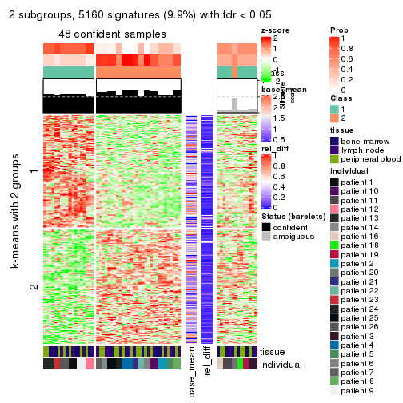</p>

</div>
<div id='tab-SD-hclust-get-signatures-2'>
<pre><code class="r">get_signatures(res, k = 3)
</code></pre>

<p>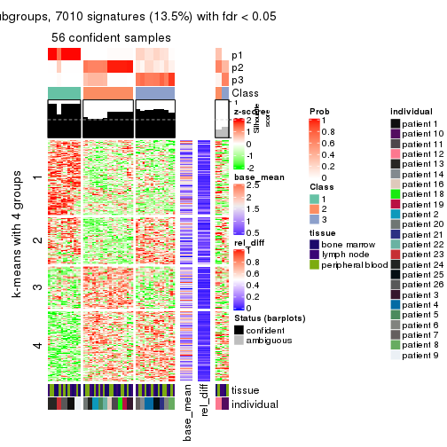</p>

</div>
<div id='tab-SD-hclust-get-signatures-3'>
<pre><code class="r">get_signatures(res, k = 4)
</code></pre>

<p>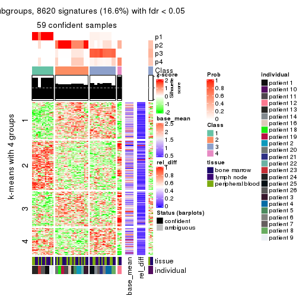</p>

</div>
<div id='tab-SD-hclust-get-signatures-4'>
<pre><code class="r">get_signatures(res, k = 5)
</code></pre>

<p>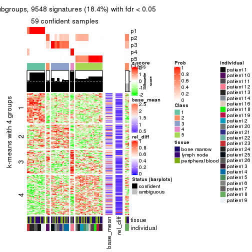</p>

</div>
<div id='tab-SD-hclust-get-signatures-5'>
<pre><code class="r">get_signatures(res, k = 6)
</code></pre>

<p>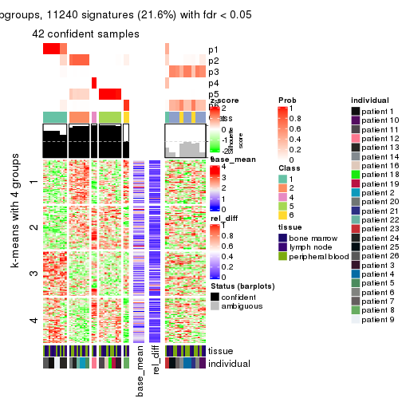</p>

</div>
</div>


Signature heatmaps where rows are not scaled:


<script>
$( function() {
	$( '#tabs-SD-hclust-get-signatures-no-scale' ).tabs();
} );
</script>
<div id='tabs-SD-hclust-get-signatures-no-scale'>
<ul>
<li><a href='#tab-SD-hclust-get-signatures-no-scale-1'>k = 2</a></li>
<li><a href='#tab-SD-hclust-get-signatures-no-scale-2'>k = 3</a></li>
<li><a href='#tab-SD-hclust-get-signatures-no-scale-3'>k = 4</a></li>
<li><a href='#tab-SD-hclust-get-signatures-no-scale-4'>k = 5</a></li>
<li><a href='#tab-SD-hclust-get-signatures-no-scale-5'>k = 6</a></li>
</ul>
<div id='tab-SD-hclust-get-signatures-no-scale-1'>
<pre><code class="r">get_signatures(res, k = 2, scale_rows = FALSE)
</code></pre>

<p>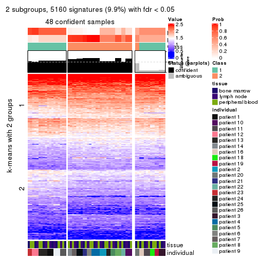</p>

</div>
<div id='tab-SD-hclust-get-signatures-no-scale-2'>
<pre><code class="r">get_signatures(res, k = 3, scale_rows = FALSE)
</code></pre>

<p>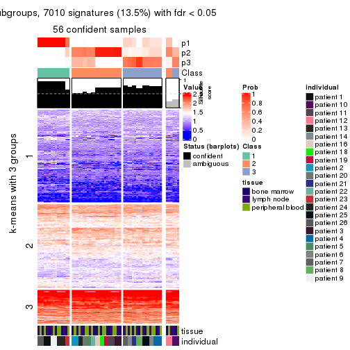</p>

</div>
<div id='tab-SD-hclust-get-signatures-no-scale-3'>
<pre><code class="r">get_signatures(res, k = 4, scale_rows = FALSE)
</code></pre>

<p>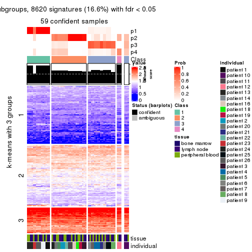</p>

</div>
<div id='tab-SD-hclust-get-signatures-no-scale-4'>
<pre><code class="r">get_signatures(res, k = 5, scale_rows = FALSE)
</code></pre>

<p>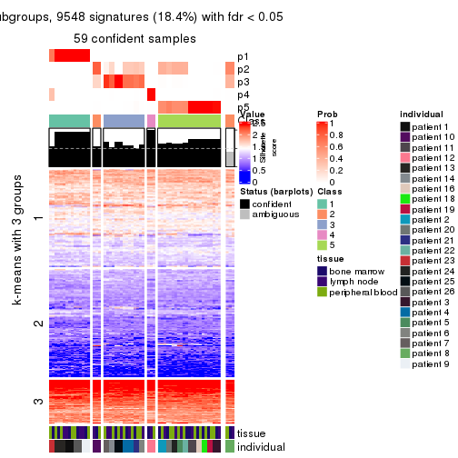</p>

</div>
<div id='tab-SD-hclust-get-signatures-no-scale-5'>
<pre><code class="r">get_signatures(res, k = 6, scale_rows = FALSE)
</code></pre>

<p>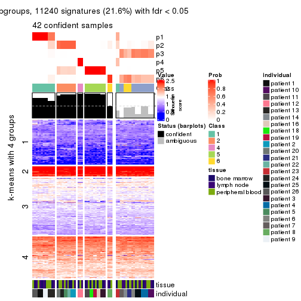</p>

</div>
</div>


Compare the overlap of signatures from different k:

```r
compare_signatures(res)
```

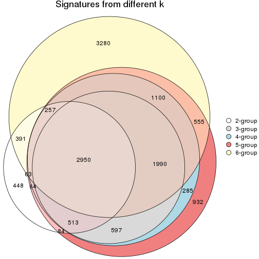

`get_signature()` returns a data frame invisibly. TO get the list of signatures, the function
call should be assigned to a variable explicitly. In following code, if `plot` argument is set
to `FALSE`, no heatmap is plotted while only the differential analysis is performed.

```r
# code only for demonstration
tb = get_signature(res, k = ..., plot = FALSE)
```

An example of the output of `tb` is:

```
#>   which_row         fdr    mean_1    mean_2 scaled_mean_1 scaled_mean_2 km
#> 1        38 0.042760348  8.373488  9.131774    -0.5533452     0.5164555  1
#> 2        40 0.018707592  7.106213  8.469186    -0.6173731     0.5762149  1
#> 3        55 0.019134737 10.221463 11.207825    -0.6159697     0.5749050  1
#> 4        59 0.006059896  5.921854  7.869574    -0.6899429     0.6439467  1
#> 5        60 0.018055526  8.928898 10.211722    -0.6204761     0.5791110  1
#> 6        98 0.009384629 15.714769 14.887706     0.6635654    -0.6193277  2
...
```

The columns in `tb` are:

1. `which_row`: row indices corresponding to the input matrix.
2. `fdr`: FDR for the differential test. 
3. `mean_x`: The mean value in group x.
4. `scaled_mean_x`: The mean value in group x after rows are scaled.
5. `km`: Row groups if k-means clustering is applied to rows.


UMAP plot which shows how samples are separated.


<script>
$( function() {
	$( '#tabs-SD-hclust-dimension-reduction' ).tabs();
} );
</script>
<div id='tabs-SD-hclust-dimension-reduction'>
<ul>
<li><a href='#tab-SD-hclust-dimension-reduction-1'>k = 2</a></li>
<li><a href='#tab-SD-hclust-dimension-reduction-2'>k = 3</a></li>
<li><a href='#tab-SD-hclust-dimension-reduction-3'>k = 4</a></li>
<li><a href='#tab-SD-hclust-dimension-reduction-4'>k = 5</a></li>
<li><a href='#tab-SD-hclust-dimension-reduction-5'>k = 6</a></li>
</ul>
<div id='tab-SD-hclust-dimension-reduction-1'>
<pre><code class="r">dimension_reduction(res, k = 2, method = &quot;UMAP&quot;)
</code></pre>

<p>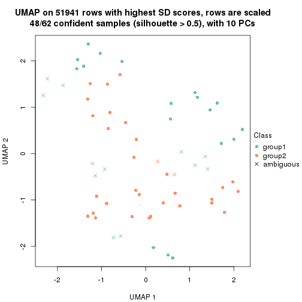</p>

</div>
<div id='tab-SD-hclust-dimension-reduction-2'>
<pre><code class="r">dimension_reduction(res, k = 3, method = &quot;UMAP&quot;)
</code></pre>

<p>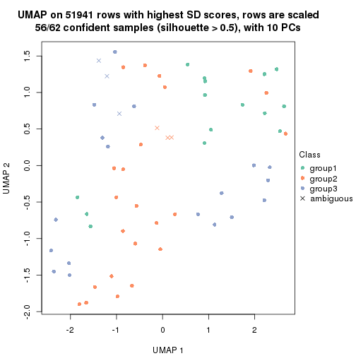</p>

</div>
<div id='tab-SD-hclust-dimension-reduction-3'>
<pre><code class="r">dimension_reduction(res, k = 4, method = &quot;UMAP&quot;)
</code></pre>

<p>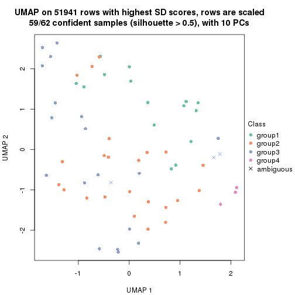</p>

</div>
<div id='tab-SD-hclust-dimension-reduction-4'>
<pre><code class="r">dimension_reduction(res, k = 5, method = &quot;UMAP&quot;)
</code></pre>

<p>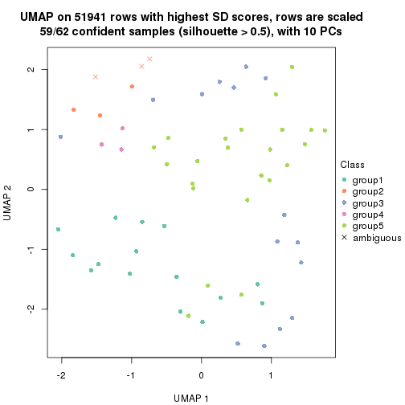</p>

</div>
<div id='tab-SD-hclust-dimension-reduction-5'>
<pre><code class="r">dimension_reduction(res, k = 6, method = &quot;UMAP&quot;)
</code></pre>

<p>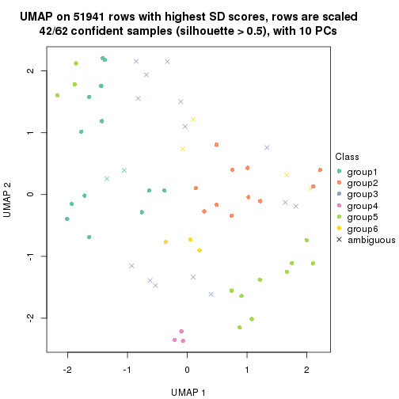</p>

</div>
</div>


Following heatmap shows how subgroups are split when increasing `k`:

```r
collect_classes(res)
```

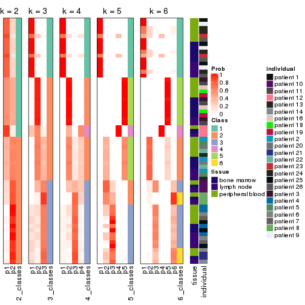


Test correlation between subgroups and known annotations. If the known
annotation is numeric, one-way ANOVA test is applied, and if the known
annotation is discrete, chi-squared contingency table test is applied.

```r
test_to_known_factors(res)
```

```
#>            n tissue(p) individual(p) k
#> SD:hclust 48     0.748      8.59e-05 2
#> SD:hclust 56     0.889      2.77e-08 3
#> SD:hclust 59     0.975      4.34e-12 4
#> SD:hclust 59     0.993      1.81e-15 5
#> SD:hclust 42     0.997      3.60e-12 6
```


If matrix rows can be associated to genes, consider to use `functional_enrichment(res,
...)` to perform function enrichment for the signature genes. See [this vignette](http://bioconductor.org/packages/devel/bioc/vignettes/cola/inst/doc/functional_enrichment.html) for more detailed explanations.


 

---------------------------------------------------


### SD:kmeans


The object with results only for a single top-value method and a single partition method 
can be extracted as:

```r
res = res_list["SD", "kmeans"]
# you can also extract it by
# res = res_list["SD:kmeans"]
```

A summary of `res` and all the functions that can be applied to it:

```r
res
```

```
#> A 'ConsensusPartition' object with k = 2, 3, 4, 5, 6.
#>   On a matrix with 51941 rows and 62 columns.
#>   Top rows (1000, 2000, 3000, 4000, 5000) are extracted by 'SD' method.
#>   Subgroups are detected by 'kmeans' method.
#>   Performed in total 1250 partitions by row resampling.
#>   Best k for subgroups seems to be 3.
#> 
#> Following methods can be applied to this 'ConsensusPartition' object:
#>  [1] "cola_report"             "collect_classes"         "collect_plots"          
#>  [4] "collect_stats"           "colnames"                "compare_signatures"     
#>  [7] "consensus_heatmap"       "dimension_reduction"     "functional_enrichment"  
#> [10] "get_anno_col"            "get_anno"                "get_classes"            
#> [13] "get_consensus"           "get_matrix"              "get_membership"         
#> [16] "get_param"               "get_signatures"          "get_stats"              
#> [19] "is_best_k"               "is_stable_k"             "membership_heatmap"     
#> [22] "ncol"                    "nrow"                    "plot_ecdf"              
#> [25] "rownames"                "select_partition_number" "show"                   
#> [28] "suggest_best_k"          "test_to_known_factors"
```

`collect_plots()` function collects all the plots made from `res` for all `k` (number of partitions)
into one single page to provide an easy and fast comparison between different `k`.

```r
collect_plots(res)
```

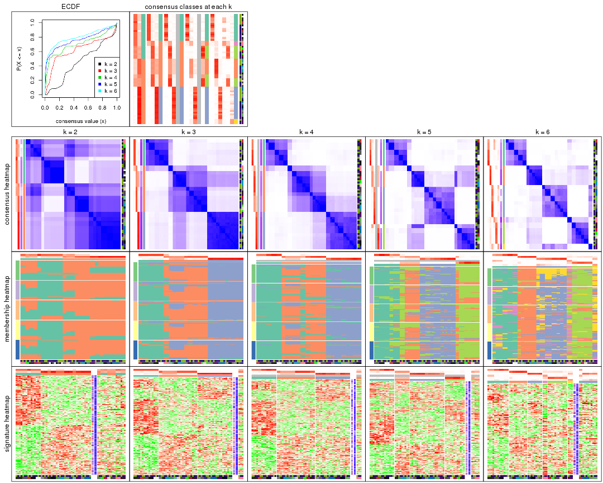

The plots are:

- The first row: a plot of the ECDF (empirical cumulative distribution
  function) curves of the consensus matrix for each `k` and the heatmap of
  predicted classes for each `k`.
- The second row: heatmaps of the consensus matrix for each `k`.
- The third row: heatmaps of the membership matrix for each `k`.
- The fouth row: heatmaps of the signatures for each `k`.

All the plots in panels can be made by individual functions and they are
plotted later in this section.

`select_partition_number()` produces several plots showing different
statistics for choosing "optimized" `k`. There are following statistics:

- ECDF curves of the consensus matrix for each `k`;
- 1-PAC. [The PAC
  score](https://en.wikipedia.org/wiki/Consensus_clustering#Over-interpretation_potential_of_consensus_clustering)
  measures the proportion of the ambiguous subgrouping.
- Mean silhouette score.
- Concordance. The mean probability of fiting the consensus class ids in all
  partitions.
- Area increased. Denote $A_k$ as the area under the ECDF curve for current
  `k`, the area increased is defined as $A_k - A_{k-1}$.
- Rand index. The percent of pairs of samples that are both in a same cluster
  or both are not in a same cluster in the partition of k and k-1.
- Jaccard index. The ratio of pairs of samples are both in a same cluster in
  the partition of k and k-1 and the pairs of samples are both in a same
  cluster in the partition k or k-1.

The detailed explanations of these statistics can be found in [the _cola_
vignette](http://bioconductor.org/packages/devel/bioc/vignettes/cola/inst/doc/cola.html#toc_13).

Generally speaking, lower PAC score, higher mean silhouette score or higher
concordance corresponds to better partition. Rand index and Jaccard index
measure how similar the current partition is compared to partition with `k-1`.
If they are too similar, we won't accept `k` is better than `k-1`.

```r
select_partition_number(res)
```

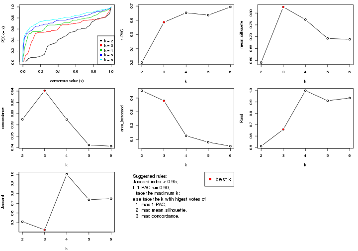

The numeric values for all these statistics can be obtained by `get_stats()`.

```r
get_stats(res)
```

```
#>   k 1-PAC mean_silhouette concordance area_increased  Rand Jaccard
#> 2 2 0.303           0.591       0.790         0.4537 0.511   0.511
#> 3 3 0.586           0.826       0.841         0.3804 0.658   0.426
#> 4 4 0.653           0.772       0.789         0.1277 1.000   1.000
#> 5 5 0.636           0.693       0.744         0.0810 0.911   0.738
#> 6 6 0.694           0.689       0.742         0.0524 0.935   0.749
```

`suggest_best_k()` suggests the best $k$ based on these statistics. The rules are as follows:

- All $k$ with Jaccard index larger than 0.95 are removed because increasing
  $k$ does not provide enough extra information. If all $k$ are removed, it is
  marked as no subgroup is detected.
- For all $k$ with 1-PAC score larger than 0.9, the maximal $k$ is taken as
  the best $k$, and other $k$ are marked as optional $k$.
- If it does not fit the second rule. The $k$ with the maximal vote of the
  highest 1-PAC score, highest mean silhouette, and highest concordance is
  taken as the best $k$.

```r
suggest_best_k(res)
```

```
#> [1] 3
```


Following shows the table of the partitions (You need to click the **show/hide
code output** link to see it). The membership matrix (columns with name `p*`)
is inferred by
[`clue::cl_consensus()`](https://www.rdocumentation.org/link/cl_consensus?package=clue)
function with the `SE` method. Basically the value in the membership matrix
represents the probability to belong to a certain group. The finall class
label for an item is determined with the group with highest probability it
belongs to.

In `get_classes()` function, the entropy is calculated from the membership
matrix and the silhouette score is calculated from the consensus matrix.


<script>
$( function() {
	$( '#tabs-SD-kmeans-get-classes' ).tabs();
} );
</script>
<div id='tabs-SD-kmeans-get-classes'>
<ul>
<li><a href='#tab-SD-kmeans-get-classes-1'>k = 2</a></li>
<li><a href='#tab-SD-kmeans-get-classes-2'>k = 3</a></li>
<li><a href='#tab-SD-kmeans-get-classes-3'>k = 4</a></li>
<li><a href='#tab-SD-kmeans-get-classes-4'>k = 5</a></li>
<li><a href='#tab-SD-kmeans-get-classes-5'>k = 6</a></li>
</ul>

<div id='tab-SD-kmeans-get-classes-1'>
<p><a id='tab-SD-kmeans-get-classes-1-a' style='color:#0366d6' href='#'>show/hide code output</a></p>
<pre><code class="r">cbind(get_classes(res, k = 2), get_membership(res, k = 2))
</code></pre>

<pre><code>#&gt;           class entropy silhouette    p1    p2
#&gt; GSM525314     1  0.8267     0.6799 0.740 0.260
#&gt; GSM525315     2  0.7528     0.6984 0.216 0.784
#&gt; GSM525316     1  0.9552     0.2034 0.624 0.376
#&gt; GSM525317     2  0.1414     0.7653 0.020 0.980
#&gt; GSM525318     2  0.1414     0.7653 0.020 0.980
#&gt; GSM525319     2  0.7528     0.6984 0.216 0.784
#&gt; GSM525320     2  0.1184     0.7662 0.016 0.984
#&gt; GSM525321     2  0.1184     0.7662 0.016 0.984
#&gt; GSM525322     2  0.0672     0.7701 0.008 0.992
#&gt; GSM525323     1  0.8267     0.6799 0.740 0.260
#&gt; GSM525324     2  0.2423     0.7658 0.040 0.960
#&gt; GSM525325     2  1.0000     0.2149 0.496 0.504
#&gt; GSM525326     1  0.8207     0.4399 0.744 0.256
#&gt; GSM525327     1  0.8081     0.6806 0.752 0.248
#&gt; GSM525328     1  0.8081     0.6806 0.752 0.248
#&gt; GSM525329     2  0.2778     0.7286 0.048 0.952
#&gt; GSM525330     2  0.9983     0.2764 0.476 0.524
#&gt; GSM525331     1  0.9922    -0.0517 0.552 0.448
#&gt; GSM525332     1  0.9686     0.1475 0.604 0.396
#&gt; GSM525333     2  0.9580     0.4934 0.380 0.620
#&gt; GSM525334     2  0.0938     0.7667 0.012 0.988
#&gt; GSM525335     2  0.7745     0.6877 0.228 0.772
#&gt; GSM525336     1  0.3733     0.6160 0.928 0.072
#&gt; GSM525337     2  0.7528     0.6984 0.216 0.784
#&gt; GSM525338     2  0.0938     0.7667 0.012 0.988
#&gt; GSM525339     1  0.8267     0.6799 0.740 0.260
#&gt; GSM525340     1  0.8267     0.6799 0.740 0.260
#&gt; GSM525341     2  0.7528     0.6984 0.216 0.784
#&gt; GSM525342     1  0.9552     0.2034 0.624 0.376
#&gt; GSM525343     2  0.1414     0.7653 0.020 0.980
#&gt; GSM525344     2  0.0672     0.7701 0.008 0.992
#&gt; GSM525345     1  0.8267     0.6799 0.740 0.260
#&gt; GSM525346     2  0.2236     0.7667 0.036 0.964
#&gt; GSM525347     2  1.0000     0.2149 0.496 0.504
#&gt; GSM525348     1  0.8207     0.4399 0.744 0.256
#&gt; GSM525349     1  0.8081     0.6806 0.752 0.248
#&gt; GSM525350     2  0.9983     0.2764 0.476 0.524
#&gt; GSM525351     1  0.9922    -0.0517 0.552 0.448
#&gt; GSM525352     1  0.9686     0.1475 0.604 0.396
#&gt; GSM525353     2  0.9580     0.4934 0.380 0.620
#&gt; GSM525354     2  0.0938     0.7667 0.012 0.988
#&gt; GSM525355     2  0.7745     0.6877 0.228 0.772
#&gt; GSM525356     1  0.3733     0.6160 0.928 0.072
#&gt; GSM525357     2  0.0938     0.7667 0.012 0.988
#&gt; GSM525358     1  0.8267     0.6799 0.740 0.260
#&gt; GSM525359     1  0.8267     0.6799 0.740 0.260
#&gt; GSM525360     2  0.7528     0.6984 0.216 0.784
#&gt; GSM525361     1  0.9635     0.1714 0.612 0.388
#&gt; GSM525362     2  0.1414     0.7653 0.020 0.980
#&gt; GSM525363     2  0.7528     0.6984 0.216 0.784
#&gt; GSM525364     2  0.1184     0.7662 0.016 0.984
#&gt; GSM525365     2  0.1184     0.7662 0.016 0.984
#&gt; GSM525366     2  0.0000     0.7693 0.000 1.000
#&gt; GSM525367     1  0.8267     0.6799 0.740 0.260
#&gt; GSM525368     2  0.2236     0.7667 0.036 0.964
#&gt; GSM525369     2  1.0000     0.2149 0.496 0.504
#&gt; GSM525370     1  0.8207     0.4399 0.744 0.256
#&gt; GSM525371     1  0.8081     0.6806 0.752 0.248
#&gt; GSM525372     2  0.2778     0.7286 0.048 0.952
#&gt; GSM525373     2  0.7528     0.6984 0.216 0.784
#&gt; GSM525374     2  0.0938     0.7667 0.012 0.988
#&gt; GSM525375     1  0.8267     0.6799 0.740 0.260
</code></pre>

<script>
$('#tab-SD-kmeans-get-classes-1-a').parent().next().next().hide();
$('#tab-SD-kmeans-get-classes-1-a').click(function(){
  $('#tab-SD-kmeans-get-classes-1-a').parent().next().next().toggle();
  return(false);
});
</script>
</div>

<div id='tab-SD-kmeans-get-classes-2'>
<p><a id='tab-SD-kmeans-get-classes-2-a' style='color:#0366d6' href='#'>show/hide code output</a></p>
<pre><code class="r">cbind(get_classes(res, k = 3), get_membership(res, k = 3))
</code></pre>

<pre><code>#&gt;           class entropy silhouette    p1    p2    p3
#&gt; GSM525314     1  0.4253      0.941 0.872 0.048 0.080
#&gt; GSM525315     2  0.6984      0.585 0.020 0.560 0.420
#&gt; GSM525316     2  0.4745      0.751 0.068 0.852 0.080
#&gt; GSM525317     3  0.1636      0.975 0.016 0.020 0.964
#&gt; GSM525318     3  0.1774      0.975 0.016 0.024 0.960
#&gt; GSM525319     2  0.6984      0.585 0.020 0.560 0.420
#&gt; GSM525320     3  0.1337      0.976 0.012 0.016 0.972
#&gt; GSM525321     3  0.0829      0.976 0.012 0.004 0.984
#&gt; GSM525322     3  0.1399      0.963 0.004 0.028 0.968
#&gt; GSM525323     1  0.4609      0.938 0.856 0.052 0.092
#&gt; GSM525324     3  0.2063      0.951 0.008 0.044 0.948
#&gt; GSM525325     2  0.5000      0.784 0.044 0.832 0.124
#&gt; GSM525326     2  0.6673      0.281 0.344 0.636 0.020
#&gt; GSM525327     1  0.4194      0.924 0.876 0.060 0.064
#&gt; GSM525328     1  0.4194      0.924 0.876 0.060 0.064
#&gt; GSM525329     3  0.1453      0.966 0.024 0.008 0.968
#&gt; GSM525330     2  0.5000      0.785 0.044 0.832 0.124
#&gt; GSM525331     2  0.5000      0.785 0.044 0.832 0.124
#&gt; GSM525332     2  0.4892      0.780 0.048 0.840 0.112
#&gt; GSM525333     2  0.5119      0.773 0.028 0.812 0.160
#&gt; GSM525334     3  0.1015      0.976 0.012 0.008 0.980
#&gt; GSM525335     2  0.6896      0.614 0.020 0.588 0.392
#&gt; GSM525336     1  0.3607      0.857 0.880 0.112 0.008
#&gt; GSM525337     2  0.6994      0.579 0.020 0.556 0.424
#&gt; GSM525338     3  0.1182      0.976 0.012 0.012 0.976
#&gt; GSM525339     1  0.4172      0.935 0.868 0.028 0.104
#&gt; GSM525340     1  0.4253      0.941 0.872 0.048 0.080
#&gt; GSM525341     2  0.6984      0.585 0.020 0.560 0.420
#&gt; GSM525342     2  0.4745      0.751 0.068 0.852 0.080
#&gt; GSM525343     3  0.1636      0.975 0.016 0.020 0.964
#&gt; GSM525344     3  0.1399      0.963 0.004 0.028 0.968
#&gt; GSM525345     1  0.4609      0.938 0.856 0.052 0.092
#&gt; GSM525346     3  0.1999      0.958 0.012 0.036 0.952
#&gt; GSM525347     2  0.4930      0.783 0.044 0.836 0.120
#&gt; GSM525348     2  0.6673      0.281 0.344 0.636 0.020
#&gt; GSM525349     1  0.4194      0.924 0.876 0.060 0.064
#&gt; GSM525350     2  0.5000      0.785 0.044 0.832 0.124
#&gt; GSM525351     2  0.5000      0.785 0.044 0.832 0.124
#&gt; GSM525352     2  0.4892      0.780 0.048 0.840 0.112
#&gt; GSM525353     2  0.5119      0.773 0.028 0.812 0.160
#&gt; GSM525354     3  0.1015      0.976 0.012 0.008 0.980
#&gt; GSM525355     2  0.6896      0.614 0.020 0.588 0.392
#&gt; GSM525356     1  0.3607      0.857 0.880 0.112 0.008
#&gt; GSM525357     3  0.1337      0.976 0.016 0.012 0.972
#&gt; GSM525358     1  0.4172      0.935 0.868 0.028 0.104
#&gt; GSM525359     1  0.4165      0.940 0.876 0.048 0.076
#&gt; GSM525360     2  0.6994      0.579 0.020 0.556 0.424
#&gt; GSM525361     2  0.4745      0.751 0.068 0.852 0.080
#&gt; GSM525362     3  0.1781      0.974 0.020 0.020 0.960
#&gt; GSM525363     2  0.7102      0.579 0.024 0.556 0.420
#&gt; GSM525364     3  0.1491      0.973 0.016 0.016 0.968
#&gt; GSM525365     3  0.0983      0.974 0.016 0.004 0.980
#&gt; GSM525366     3  0.1585      0.964 0.008 0.028 0.964
#&gt; GSM525367     1  0.4527      0.938 0.860 0.052 0.088
#&gt; GSM525368     3  0.1999      0.958 0.012 0.036 0.952
#&gt; GSM525369     2  0.4930      0.783 0.044 0.836 0.120
#&gt; GSM525370     2  0.6673      0.281 0.344 0.636 0.020
#&gt; GSM525371     1  0.4095      0.924 0.880 0.056 0.064
#&gt; GSM525372     3  0.1585      0.963 0.028 0.008 0.964
#&gt; GSM525373     2  0.7112      0.572 0.024 0.552 0.424
#&gt; GSM525374     3  0.1337      0.975 0.016 0.012 0.972
#&gt; GSM525375     1  0.4094      0.935 0.872 0.028 0.100
</code></pre>

<script>
$('#tab-SD-kmeans-get-classes-2-a').parent().next().next().hide();
$('#tab-SD-kmeans-get-classes-2-a').click(function(){
  $('#tab-SD-kmeans-get-classes-2-a').parent().next().next().toggle();
  return(false);
});
</script>
</div>

<div id='tab-SD-kmeans-get-classes-3'>
<p><a id='tab-SD-kmeans-get-classes-3-a' style='color:#0366d6' href='#'>show/hide code output</a></p>
<pre><code class="r">cbind(get_classes(res, k = 4), get_membership(res, k = 4))
</code></pre>

<pre><code>#&gt;           class entropy silhouette    p1    p2    p3 p4
#&gt; GSM525314     1   0.123      0.869 0.968 0.008 0.020 NA
#&gt; GSM525315     2   0.746      0.616 0.000 0.508 0.256 NA
#&gt; GSM525316     2   0.466      0.684 0.040 0.820 0.036 NA
#&gt; GSM525317     3   0.255      0.904 0.008 0.000 0.900 NA
#&gt; GSM525318     3   0.255      0.904 0.008 0.000 0.900 NA
#&gt; GSM525319     2   0.746      0.616 0.000 0.508 0.256 NA
#&gt; GSM525320     3   0.274      0.906 0.000 0.008 0.888 NA
#&gt; GSM525321     3   0.166      0.911 0.004 0.000 0.944 NA
#&gt; GSM525322     3   0.284      0.895 0.004 0.004 0.884 NA
#&gt; GSM525323     1   0.251      0.858 0.924 0.016 0.036 NA
#&gt; GSM525324     3   0.460      0.824 0.004 0.008 0.732 NA
#&gt; GSM525325     2   0.236      0.739 0.004 0.924 0.052 NA
#&gt; GSM525326     2   0.716      0.290 0.116 0.464 0.004 NA
#&gt; GSM525327     1   0.561      0.819 0.664 0.016 0.020 NA
#&gt; GSM525328     1   0.561      0.819 0.664 0.016 0.020 NA
#&gt; GSM525329     3   0.263      0.894 0.024 0.004 0.912 NA
#&gt; GSM525330     2   0.193      0.741 0.004 0.936 0.056 NA
#&gt; GSM525331     2   0.244      0.737 0.012 0.924 0.048 NA
#&gt; GSM525332     2   0.266      0.735 0.012 0.916 0.048 NA
#&gt; GSM525333     2   0.553      0.720 0.000 0.720 0.088 NA
#&gt; GSM525334     3   0.100      0.911 0.000 0.004 0.972 NA
#&gt; GSM525335     2   0.744      0.623 0.000 0.512 0.244 NA
#&gt; GSM525336     1   0.588      0.765 0.632 0.056 0.000 NA
#&gt; GSM525337     2   0.743      0.613 0.000 0.512 0.260 NA
#&gt; GSM525338     3   0.131      0.913 0.000 0.004 0.960 NA
#&gt; GSM525339     1   0.321      0.868 0.892 0.012 0.040 NA
#&gt; GSM525340     1   0.123      0.869 0.968 0.008 0.020 NA
#&gt; GSM525341     2   0.746      0.616 0.000 0.508 0.256 NA
#&gt; GSM525342     2   0.466      0.684 0.040 0.820 0.036 NA
#&gt; GSM525343     3   0.255      0.904 0.008 0.000 0.900 NA
#&gt; GSM525344     3   0.284      0.895 0.004 0.004 0.884 NA
#&gt; GSM525345     1   0.251      0.858 0.924 0.016 0.036 NA
#&gt; GSM525346     3   0.472      0.824 0.004 0.008 0.716 NA
#&gt; GSM525347     2   0.236      0.739 0.004 0.924 0.052 NA
#&gt; GSM525348     2   0.716      0.290 0.116 0.464 0.004 NA
#&gt; GSM525349     1   0.561      0.819 0.664 0.016 0.020 NA
#&gt; GSM525350     2   0.193      0.741 0.004 0.936 0.056 NA
#&gt; GSM525351     2   0.244      0.737 0.012 0.924 0.048 NA
#&gt; GSM525352     2   0.266      0.735 0.012 0.916 0.048 NA
#&gt; GSM525353     2   0.553      0.720 0.000 0.720 0.088 NA
#&gt; GSM525354     3   0.100      0.911 0.000 0.004 0.972 NA
#&gt; GSM525355     2   0.744      0.623 0.000 0.512 0.244 NA
#&gt; GSM525356     1   0.588      0.765 0.632 0.056 0.000 NA
#&gt; GSM525357     3   0.176      0.913 0.004 0.004 0.944 NA
#&gt; GSM525358     1   0.321      0.868 0.892 0.012 0.040 NA
#&gt; GSM525359     1   0.123      0.869 0.968 0.008 0.020 NA
#&gt; GSM525360     2   0.746      0.616 0.000 0.508 0.256 NA
#&gt; GSM525361     2   0.458      0.685 0.036 0.824 0.036 NA
#&gt; GSM525362     3   0.286      0.903 0.008 0.000 0.880 NA
#&gt; GSM525363     2   0.748      0.612 0.000 0.504 0.248 NA
#&gt; GSM525364     3   0.302      0.905 0.004 0.004 0.872 NA
#&gt; GSM525365     3   0.212      0.911 0.008 0.000 0.924 NA
#&gt; GSM525366     3   0.313      0.894 0.004 0.004 0.864 NA
#&gt; GSM525367     1   0.251      0.858 0.924 0.016 0.036 NA
#&gt; GSM525368     3   0.472      0.824 0.004 0.008 0.716 NA
#&gt; GSM525369     2   0.236      0.739 0.004 0.924 0.052 NA
#&gt; GSM525370     2   0.716      0.290 0.116 0.464 0.004 NA
#&gt; GSM525371     1   0.550      0.818 0.668 0.012 0.020 NA
#&gt; GSM525372     3   0.271      0.894 0.024 0.004 0.908 NA
#&gt; GSM525373     2   0.763      0.605 0.004 0.504 0.252 NA
#&gt; GSM525374     3   0.193      0.913 0.004 0.004 0.936 NA
#&gt; GSM525375     1   0.308      0.867 0.896 0.008 0.040 NA
</code></pre>

<script>
$('#tab-SD-kmeans-get-classes-3-a').parent().next().next().hide();
$('#tab-SD-kmeans-get-classes-3-a').click(function(){
  $('#tab-SD-kmeans-get-classes-3-a').parent().next().next().toggle();
  return(false);
});
</script>
</div>

<div id='tab-SD-kmeans-get-classes-4'>
<p><a id='tab-SD-kmeans-get-classes-4-a' style='color:#0366d6' href='#'>show/hide code output</a></p>
<pre><code class="r">cbind(get_classes(res, k = 5), get_membership(res, k = 5))
</code></pre>

<pre><code>#&gt;           class entropy silhouette    p1    p2    p3 p4    p5
#&gt; GSM525314     1  0.0579     0.8311 0.984 0.000 0.008 NA 0.008
#&gt; GSM525315     2  0.6038     0.6536 0.000 0.548 0.120 NA 0.328
#&gt; GSM525316     5  0.4051     0.6869 0.032 0.056 0.004 NA 0.828
#&gt; GSM525317     3  0.4002     0.8157 0.000 0.056 0.796 NA 0.004
#&gt; GSM525318     3  0.4002     0.8157 0.000 0.056 0.796 NA 0.004
#&gt; GSM525319     2  0.5772     0.6526 0.000 0.564 0.108 NA 0.328
#&gt; GSM525320     3  0.4394     0.8105 0.000 0.048 0.732 NA 0.000
#&gt; GSM525321     3  0.1809     0.8403 0.000 0.012 0.928 NA 0.000
#&gt; GSM525322     3  0.4337     0.7865 0.000 0.052 0.744 NA 0.000
#&gt; GSM525323     1  0.2368     0.8175 0.920 0.032 0.016 NA 0.008
#&gt; GSM525324     3  0.5630     0.7237 0.000 0.096 0.580 NA 0.000
#&gt; GSM525325     5  0.2434     0.7701 0.000 0.036 0.008 NA 0.908
#&gt; GSM525326     2  0.7897     0.0538 0.088 0.392 0.000 NA 0.312
#&gt; GSM525327     1  0.6335     0.7662 0.628 0.088 0.012 NA 0.036
#&gt; GSM525328     1  0.6335     0.7662 0.628 0.088 0.012 NA 0.036
#&gt; GSM525329     3  0.2569     0.8253 0.004 0.032 0.896 NA 0.000
#&gt; GSM525330     5  0.2264     0.7709 0.004 0.044 0.008 NA 0.920
#&gt; GSM525331     5  0.1121     0.7805 0.004 0.016 0.008 NA 0.968
#&gt; GSM525332     5  0.1121     0.7808 0.004 0.016 0.008 NA 0.968
#&gt; GSM525333     5  0.5302    -0.3907 0.000 0.472 0.032 NA 0.488
#&gt; GSM525334     3  0.0992     0.8447 0.000 0.008 0.968 NA 0.000
#&gt; GSM525335     2  0.6038     0.6124 0.000 0.560 0.080 NA 0.340
#&gt; GSM525336     1  0.7197     0.6560 0.540 0.200 0.000 NA 0.072
#&gt; GSM525337     2  0.6150     0.6505 0.000 0.544 0.120 NA 0.328
#&gt; GSM525338     3  0.1211     0.8430 0.000 0.016 0.960 NA 0.000
#&gt; GSM525339     1  0.3529     0.8255 0.860 0.028 0.032 NA 0.008
#&gt; GSM525340     1  0.0579     0.8311 0.984 0.000 0.008 NA 0.008
#&gt; GSM525341     2  0.6038     0.6536 0.000 0.548 0.120 NA 0.328
#&gt; GSM525342     5  0.4051     0.6869 0.032 0.056 0.004 NA 0.828
#&gt; GSM525343     3  0.4002     0.8157 0.000 0.056 0.796 NA 0.004
#&gt; GSM525344     3  0.4337     0.7865 0.000 0.052 0.744 NA 0.000
#&gt; GSM525345     1  0.2368     0.8175 0.920 0.032 0.016 NA 0.008
#&gt; GSM525346     3  0.5639     0.7191 0.000 0.092 0.568 NA 0.000
#&gt; GSM525347     5  0.2434     0.7701 0.000 0.036 0.008 NA 0.908
#&gt; GSM525348     2  0.7897     0.0538 0.088 0.392 0.000 NA 0.312
#&gt; GSM525349     1  0.6335     0.7662 0.628 0.088 0.012 NA 0.036
#&gt; GSM525350     5  0.2264     0.7709 0.004 0.044 0.008 NA 0.920
#&gt; GSM525351     5  0.1121     0.7805 0.004 0.016 0.008 NA 0.968
#&gt; GSM525352     5  0.1121     0.7808 0.004 0.016 0.008 NA 0.968
#&gt; GSM525353     5  0.5302    -0.3907 0.000 0.472 0.032 NA 0.488
#&gt; GSM525354     3  0.0992     0.8447 0.000 0.008 0.968 NA 0.000
#&gt; GSM525355     2  0.6038     0.6124 0.000 0.560 0.080 NA 0.340
#&gt; GSM525356     1  0.7197     0.6560 0.540 0.200 0.000 NA 0.072
#&gt; GSM525357     3  0.1106     0.8435 0.000 0.012 0.964 NA 0.000
#&gt; GSM525358     1  0.3529     0.8255 0.860 0.028 0.032 NA 0.008
#&gt; GSM525359     1  0.0579     0.8311 0.984 0.000 0.008 NA 0.008
#&gt; GSM525360     2  0.6038     0.6536 0.000 0.548 0.120 NA 0.328
#&gt; GSM525361     5  0.4051     0.6869 0.032 0.056 0.004 NA 0.828
#&gt; GSM525362     3  0.4100     0.8141 0.000 0.052 0.784 NA 0.004
#&gt; GSM525363     2  0.5813     0.6523 0.000 0.560 0.112 NA 0.328
#&gt; GSM525364     3  0.4441     0.8077 0.000 0.044 0.720 NA 0.000
#&gt; GSM525365     3  0.1956     0.8408 0.000 0.008 0.916 NA 0.000
#&gt; GSM525366     3  0.4394     0.7832 0.000 0.048 0.732 NA 0.000
#&gt; GSM525367     1  0.2368     0.8175 0.920 0.032 0.016 NA 0.008
#&gt; GSM525368     3  0.5639     0.7191 0.000 0.092 0.568 NA 0.000
#&gt; GSM525369     5  0.2434     0.7701 0.000 0.036 0.008 NA 0.908
#&gt; GSM525370     2  0.7897     0.0538 0.088 0.392 0.000 NA 0.312
#&gt; GSM525371     1  0.6335     0.7662 0.628 0.088 0.012 NA 0.036
#&gt; GSM525372     3  0.2813     0.8245 0.004 0.032 0.880 NA 0.000
#&gt; GSM525373     2  0.6211     0.6474 0.000 0.540 0.128 NA 0.324
#&gt; GSM525374     3  0.1444     0.8435 0.000 0.012 0.948 NA 0.000
#&gt; GSM525375     1  0.3529     0.8255 0.860 0.028 0.032 NA 0.008
</code></pre>

<script>
$('#tab-SD-kmeans-get-classes-4-a').parent().next().next().hide();
$('#tab-SD-kmeans-get-classes-4-a').click(function(){
  $('#tab-SD-kmeans-get-classes-4-a').parent().next().next().toggle();
  return(false);
});
</script>
</div>

<div id='tab-SD-kmeans-get-classes-5'>
<p><a id='tab-SD-kmeans-get-classes-5-a' style='color:#0366d6' href='#'>show/hide code output</a></p>
<pre><code class="r">cbind(get_classes(res, k = 6), get_membership(res, k = 6))
</code></pre>

<pre><code>#&gt;           class entropy silhouette    p1    p2    p3    p4    p5    p6
#&gt; GSM525314     1   0.134     0.7408 0.956 0.000 0.008 0.012 0.016 0.008
#&gt; GSM525315     2   0.128     0.9257 0.000 0.944 0.052 0.000 0.004 0.000
#&gt; GSM525316     5   0.531     0.6717 0.016 0.084 0.000 0.104 0.716 0.080
#&gt; GSM525317     3   0.494     0.4995 0.016 0.020 0.740 0.052 0.020 0.152
#&gt; GSM525318     3   0.494     0.4995 0.016 0.020 0.740 0.052 0.020 0.152
#&gt; GSM525319     2   0.122     0.9249 0.000 0.948 0.048 0.000 0.004 0.000
#&gt; GSM525320     3   0.487    -0.0515 0.004 0.008 0.588 0.012 0.020 0.368
#&gt; GSM525321     3   0.223     0.6253 0.000 0.020 0.916 0.020 0.012 0.032
#&gt; GSM525322     3   0.525     0.1136 0.000 0.068 0.636 0.020 0.008 0.268
#&gt; GSM525323     1   0.314     0.7063 0.860 0.000 0.008 0.036 0.020 0.076
#&gt; GSM525324     6   0.586     0.9372 0.000 0.096 0.372 0.032 0.000 0.500
#&gt; GSM525325     5   0.431     0.8263 0.000 0.176 0.000 0.040 0.748 0.036
#&gt; GSM525326     4   0.702     1.0000 0.052 0.152 0.000 0.508 0.248 0.040
#&gt; GSM525327     1   0.538     0.6395 0.580 0.012 0.000 0.340 0.028 0.040
#&gt; GSM525328     1   0.538     0.6395 0.580 0.012 0.000 0.340 0.028 0.040
#&gt; GSM525329     3   0.318     0.5795 0.008 0.016 0.864 0.032 0.008 0.072
#&gt; GSM525330     5   0.352     0.8261 0.000 0.192 0.000 0.012 0.780 0.016
#&gt; GSM525331     5   0.277     0.8384 0.000 0.164 0.000 0.004 0.828 0.004
#&gt; GSM525332     5   0.288     0.8362 0.000 0.152 0.000 0.008 0.832 0.008
#&gt; GSM525333     2   0.327     0.7376 0.000 0.816 0.012 0.008 0.156 0.008
#&gt; GSM525334     3   0.219     0.6275 0.000 0.028 0.916 0.008 0.012 0.036
#&gt; GSM525335     2   0.198     0.9061 0.000 0.924 0.044 0.008 0.008 0.016
#&gt; GSM525336     1   0.569     0.4600 0.496 0.016 0.000 0.412 0.056 0.020
#&gt; GSM525337     2   0.191     0.9143 0.000 0.920 0.056 0.016 0.008 0.000
#&gt; GSM525338     3   0.245     0.6036 0.000 0.028 0.884 0.000 0.004 0.084
#&gt; GSM525339     1   0.329     0.7200 0.836 0.004 0.020 0.024 0.000 0.116
#&gt; GSM525340     1   0.134     0.7408 0.956 0.000 0.008 0.012 0.016 0.008
#&gt; GSM525341     2   0.128     0.9257 0.000 0.944 0.052 0.000 0.004 0.000
#&gt; GSM525342     5   0.531     0.6717 0.016 0.084 0.000 0.104 0.716 0.080
#&gt; GSM525343     3   0.494     0.4995 0.016 0.020 0.740 0.052 0.020 0.152
#&gt; GSM525344     3   0.525     0.1136 0.000 0.068 0.636 0.020 0.008 0.268
#&gt; GSM525345     1   0.314     0.7063 0.860 0.000 0.008 0.036 0.020 0.076
#&gt; GSM525346     6   0.579     0.9691 0.000 0.092 0.356 0.032 0.000 0.520
#&gt; GSM525347     5   0.431     0.8263 0.000 0.176 0.000 0.040 0.748 0.036
#&gt; GSM525348     4   0.702     1.0000 0.052 0.152 0.000 0.508 0.248 0.040
#&gt; GSM525349     1   0.538     0.6395 0.580 0.012 0.000 0.340 0.028 0.040
#&gt; GSM525350     5   0.352     0.8261 0.000 0.192 0.000 0.012 0.780 0.016
#&gt; GSM525351     5   0.277     0.8384 0.000 0.164 0.000 0.004 0.828 0.004
#&gt; GSM525352     5   0.288     0.8362 0.000 0.152 0.000 0.008 0.832 0.008
#&gt; GSM525353     2   0.327     0.7376 0.000 0.816 0.012 0.008 0.156 0.008
#&gt; GSM525354     3   0.219     0.6275 0.000 0.028 0.916 0.008 0.012 0.036
#&gt; GSM525355     2   0.198     0.9061 0.000 0.924 0.044 0.008 0.008 0.016
#&gt; GSM525356     1   0.569     0.4600 0.496 0.016 0.000 0.412 0.056 0.020
#&gt; GSM525357     3   0.242     0.6030 0.000 0.024 0.884 0.000 0.004 0.088
#&gt; GSM525358     1   0.329     0.7200 0.836 0.004 0.020 0.024 0.000 0.116
#&gt; GSM525359     1   0.134     0.7408 0.956 0.000 0.008 0.012 0.016 0.008
#&gt; GSM525360     2   0.114     0.9247 0.000 0.948 0.052 0.000 0.000 0.000
#&gt; GSM525361     5   0.531     0.6717 0.016 0.084 0.000 0.104 0.716 0.080
#&gt; GSM525362     3   0.503     0.4878 0.016 0.016 0.724 0.052 0.020 0.172
#&gt; GSM525363     2   0.133     0.9216 0.000 0.944 0.048 0.000 0.000 0.008
#&gt; GSM525364     3   0.481    -0.0860 0.004 0.004 0.572 0.012 0.020 0.388
#&gt; GSM525365     3   0.240     0.6205 0.000 0.012 0.904 0.020 0.012 0.052
#&gt; GSM525366     3   0.529     0.0812 0.000 0.064 0.620 0.020 0.008 0.288
#&gt; GSM525367     1   0.314     0.7063 0.860 0.000 0.008 0.036 0.020 0.076
#&gt; GSM525368     6   0.579     0.9691 0.000 0.092 0.356 0.032 0.000 0.520
#&gt; GSM525369     5   0.431     0.8263 0.000 0.176 0.000 0.040 0.748 0.036
#&gt; GSM525370     4   0.702     1.0000 0.052 0.152 0.000 0.508 0.248 0.040
#&gt; GSM525371     1   0.538     0.6395 0.580 0.012 0.000 0.340 0.028 0.040
#&gt; GSM525372     3   0.339     0.5718 0.008 0.016 0.848 0.032 0.008 0.088
#&gt; GSM525373     2   0.217     0.9094 0.000 0.912 0.056 0.016 0.008 0.008
#&gt; GSM525374     3   0.262     0.5973 0.000 0.024 0.868 0.000 0.004 0.104
#&gt; GSM525375     1   0.329     0.7200 0.836 0.004 0.020 0.024 0.000 0.116
</code></pre>

<script>
$('#tab-SD-kmeans-get-classes-5-a').parent().next().next().hide();
$('#tab-SD-kmeans-get-classes-5-a').click(function(){
  $('#tab-SD-kmeans-get-classes-5-a').parent().next().next().toggle();
  return(false);
});
</script>
</div>
</div>

Heatmaps for the consensus matrix. It visualizes the probability of two
samples to be in a same group.


<script>
$( function() {
	$( '#tabs-SD-kmeans-consensus-heatmap' ).tabs();
} );
</script>
<div id='tabs-SD-kmeans-consensus-heatmap'>
<ul>
<li><a href='#tab-SD-kmeans-consensus-heatmap-1'>k = 2</a></li>
<li><a href='#tab-SD-kmeans-consensus-heatmap-2'>k = 3</a></li>
<li><a href='#tab-SD-kmeans-consensus-heatmap-3'>k = 4</a></li>
<li><a href='#tab-SD-kmeans-consensus-heatmap-4'>k = 5</a></li>
<li><a href='#tab-SD-kmeans-consensus-heatmap-5'>k = 6</a></li>
</ul>
<div id='tab-SD-kmeans-consensus-heatmap-1'>
<pre><code class="r">consensus_heatmap(res, k = 2)
</code></pre>

<p>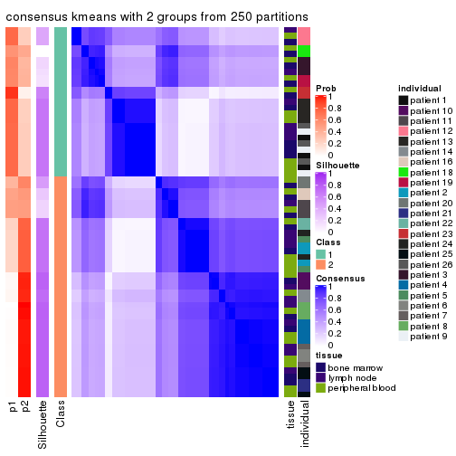</p>

</div>
<div id='tab-SD-kmeans-consensus-heatmap-2'>
<pre><code class="r">consensus_heatmap(res, k = 3)
</code></pre>

<p>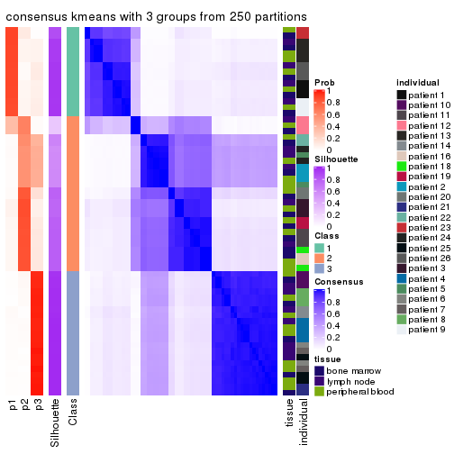</p>

</div>
<div id='tab-SD-kmeans-consensus-heatmap-3'>
<pre><code class="r">consensus_heatmap(res, k = 4)
</code></pre>

<p>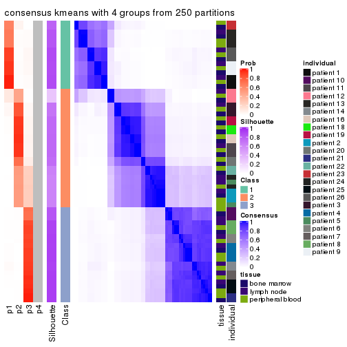</p>

</div>
<div id='tab-SD-kmeans-consensus-heatmap-4'>
<pre><code class="r">consensus_heatmap(res, k = 5)
</code></pre>

<p>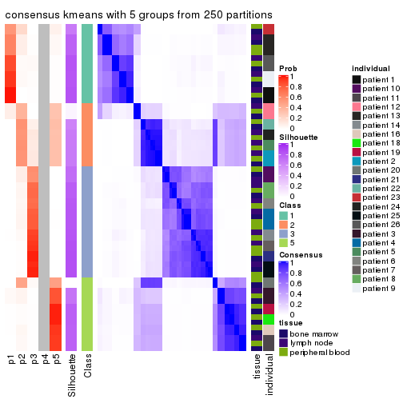</p>

</div>
<div id='tab-SD-kmeans-consensus-heatmap-5'>
<pre><code class="r">consensus_heatmap(res, k = 6)
</code></pre>

<p>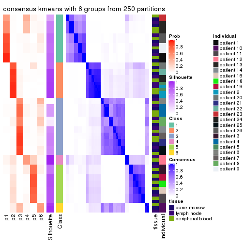</p>

</div>
</div>

Heatmaps for the membership of samples in all partitions to see how consistent they are:


<script>
$( function() {
	$( '#tabs-SD-kmeans-membership-heatmap' ).tabs();
} );
</script>
<div id='tabs-SD-kmeans-membership-heatmap'>
<ul>
<li><a href='#tab-SD-kmeans-membership-heatmap-1'>k = 2</a></li>
<li><a href='#tab-SD-kmeans-membership-heatmap-2'>k = 3</a></li>
<li><a href='#tab-SD-kmeans-membership-heatmap-3'>k = 4</a></li>
<li><a href='#tab-SD-kmeans-membership-heatmap-4'>k = 5</a></li>
<li><a href='#tab-SD-kmeans-membership-heatmap-5'>k = 6</a></li>
</ul>
<div id='tab-SD-kmeans-membership-heatmap-1'>
<pre><code class="r">membership_heatmap(res, k = 2)
</code></pre>

<p>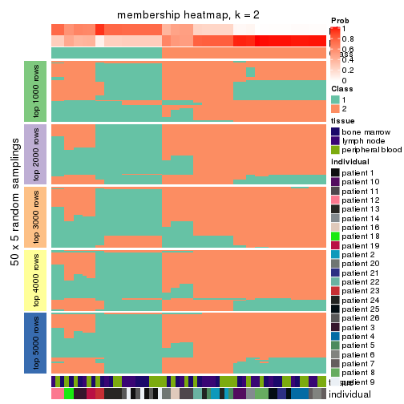</p>

</div>
<div id='tab-SD-kmeans-membership-heatmap-2'>
<pre><code class="r">membership_heatmap(res, k = 3)
</code></pre>

<p>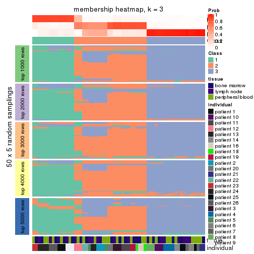</p>

</div>
<div id='tab-SD-kmeans-membership-heatmap-3'>
<pre><code class="r">membership_heatmap(res, k = 4)
</code></pre>

<p>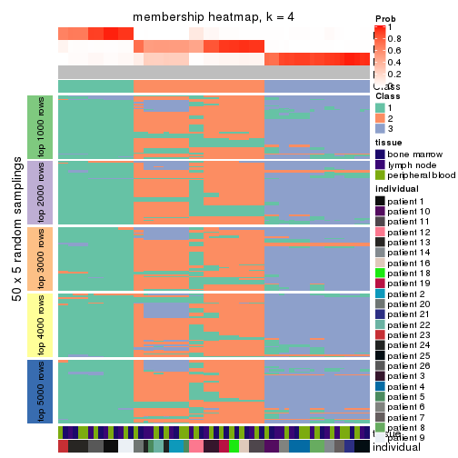</p>

</div>
<div id='tab-SD-kmeans-membership-heatmap-4'>
<pre><code class="r">membership_heatmap(res, k = 5)
</code></pre>

<p>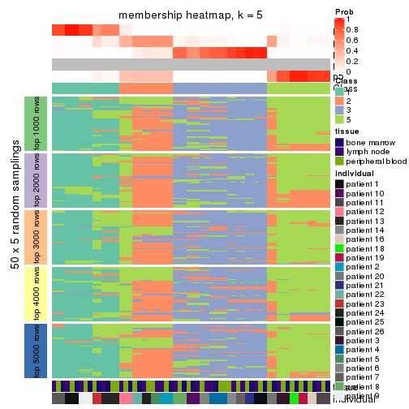</p>

</div>
<div id='tab-SD-kmeans-membership-heatmap-5'>
<pre><code class="r">membership_heatmap(res, k = 6)
</code></pre>

<p>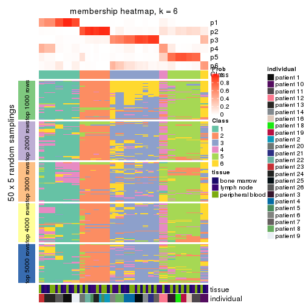</p>

</div>
</div>

As soon as we have had the classes for columns, we can look for signatures
which are significantly different between classes which can be candidate marks
for certain classes. Following are the heatmaps for signatures.


Signature heatmaps where rows are scaled:


<script>
$( function() {
	$( '#tabs-SD-kmeans-get-signatures' ).tabs();
} );
</script>
<div id='tabs-SD-kmeans-get-signatures'>
<ul>
<li><a href='#tab-SD-kmeans-get-signatures-1'>k = 2</a></li>
<li><a href='#tab-SD-kmeans-get-signatures-2'>k = 3</a></li>
<li><a href='#tab-SD-kmeans-get-signatures-3'>k = 4</a></li>
<li><a href='#tab-SD-kmeans-get-signatures-4'>k = 5</a></li>
<li><a href='#tab-SD-kmeans-get-signatures-5'>k = 6</a></li>
</ul>
<div id='tab-SD-kmeans-get-signatures-1'>
<pre><code class="r">get_signatures(res, k = 2)
</code></pre>

<p>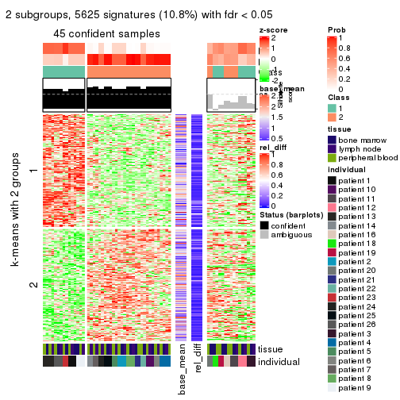</p>

</div>
<div id='tab-SD-kmeans-get-signatures-2'>
<pre><code class="r">get_signatures(res, k = 3)
</code></pre>

<p>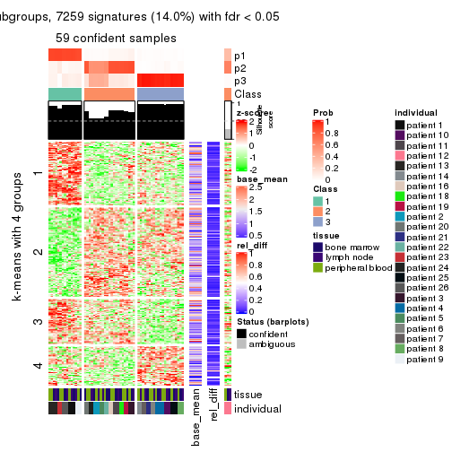</p>

</div>
<div id='tab-SD-kmeans-get-signatures-3'>
<pre><code class="r">get_signatures(res, k = 4)
</code></pre>

<p>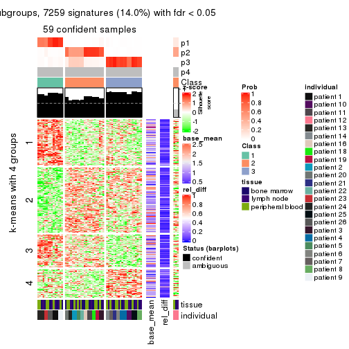</p>

</div>
<div id='tab-SD-kmeans-get-signatures-4'>
<pre><code class="r">get_signatures(res, k = 5)
</code></pre>

<p>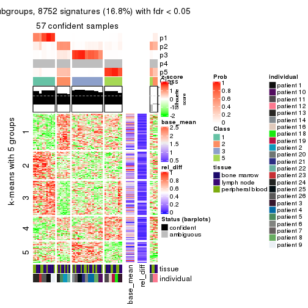</p>

</div>
<div id='tab-SD-kmeans-get-signatures-5'>
<pre><code class="r">get_signatures(res, k = 6)
</code></pre>

<p>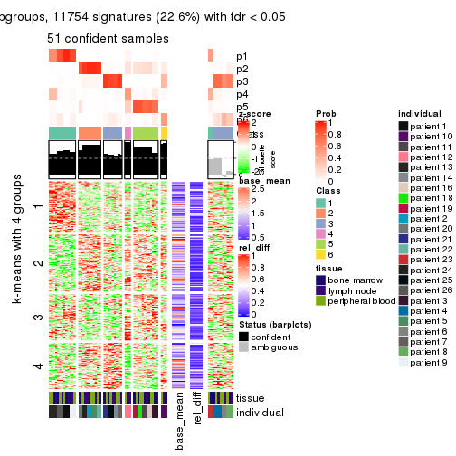</p>

</div>
</div>


Signature heatmaps where rows are not scaled:


<script>
$( function() {
	$( '#tabs-SD-kmeans-get-signatures-no-scale' ).tabs();
} );
</script>
<div id='tabs-SD-kmeans-get-signatures-no-scale'>
<ul>
<li><a href='#tab-SD-kmeans-get-signatures-no-scale-1'>k = 2</a></li>
<li><a href='#tab-SD-kmeans-get-signatures-no-scale-2'>k = 3</a></li>
<li><a href='#tab-SD-kmeans-get-signatures-no-scale-3'>k = 4</a></li>
<li><a href='#tab-SD-kmeans-get-signatures-no-scale-4'>k = 5</a></li>
<li><a href='#tab-SD-kmeans-get-signatures-no-scale-5'>k = 6</a></li>
</ul>
<div id='tab-SD-kmeans-get-signatures-no-scale-1'>
<pre><code class="r">get_signatures(res, k = 2, scale_rows = FALSE)
</code></pre>

<p>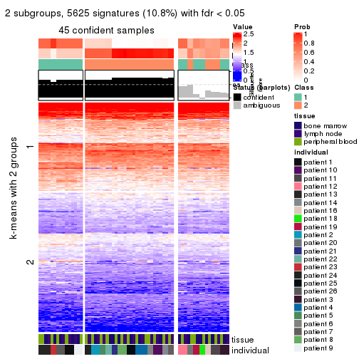</p>

</div>
<div id='tab-SD-kmeans-get-signatures-no-scale-2'>
<pre><code class="r">get_signatures(res, k = 3, scale_rows = FALSE)
</code></pre>

<p>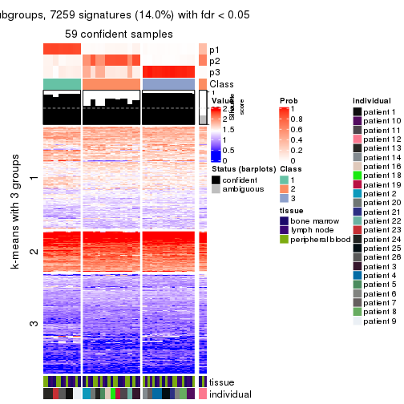</p>

</div>
<div id='tab-SD-kmeans-get-signatures-no-scale-3'>
<pre><code class="r">get_signatures(res, k = 4, scale_rows = FALSE)
</code></pre>

<p>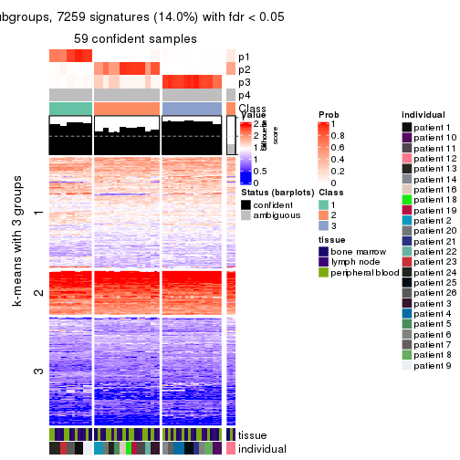</p>

</div>
<div id='tab-SD-kmeans-get-signatures-no-scale-4'>
<pre><code class="r">get_signatures(res, k = 5, scale_rows = FALSE)
</code></pre>

<p>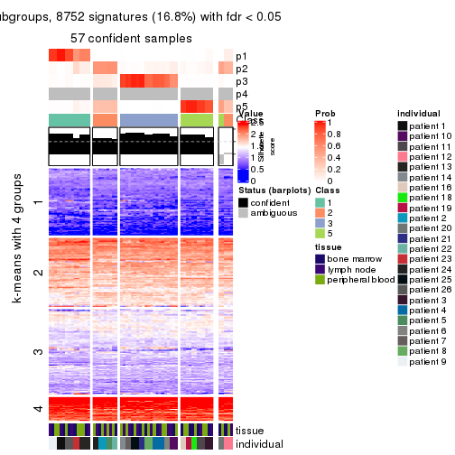</p>

</div>
<div id='tab-SD-kmeans-get-signatures-no-scale-5'>
<pre><code class="r">get_signatures(res, k = 6, scale_rows = FALSE)
</code></pre>

<p>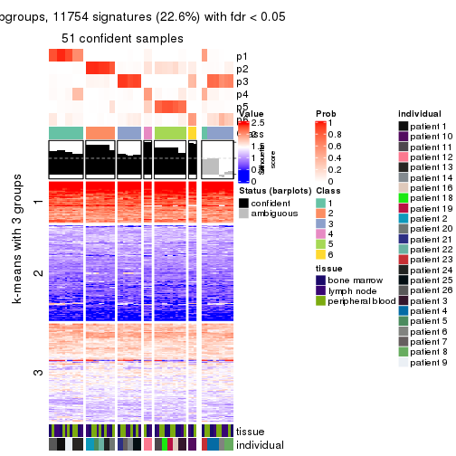</p>

</div>
</div>


Compare the overlap of signatures from different k:

```r
compare_signatures(res)
```

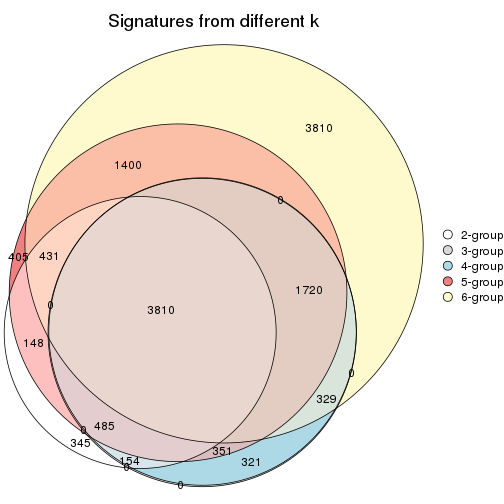

`get_signature()` returns a data frame invisibly. TO get the list of signatures, the function
call should be assigned to a variable explicitly. In following code, if `plot` argument is set
to `FALSE`, no heatmap is plotted while only the differential analysis is performed.

```r
# code only for demonstration
tb = get_signature(res, k = ..., plot = FALSE)
```

An example of the output of `tb` is:

```
#>   which_row         fdr    mean_1    mean_2 scaled_mean_1 scaled_mean_2 km
#> 1        38 0.042760348  8.373488  9.131774    -0.5533452     0.5164555  1
#> 2        40 0.018707592  7.106213  8.469186    -0.6173731     0.5762149  1
#> 3        55 0.019134737 10.221463 11.207825    -0.6159697     0.5749050  1
#> 4        59 0.006059896  5.921854  7.869574    -0.6899429     0.6439467  1
#> 5        60 0.018055526  8.928898 10.211722    -0.6204761     0.5791110  1
#> 6        98 0.009384629 15.714769 14.887706     0.6635654    -0.6193277  2
...
```

The columns in `tb` are:

1. `which_row`: row indices corresponding to the input matrix.
2. `fdr`: FDR for the differential test. 
3. `mean_x`: The mean value in group x.
4. `scaled_mean_x`: The mean value in group x after rows are scaled.
5. `km`: Row groups if k-means clustering is applied to rows.


UMAP plot which shows how samples are separated.


<script>
$( function() {
	$( '#tabs-SD-kmeans-dimension-reduction' ).tabs();
} );
</script>
<div id='tabs-SD-kmeans-dimension-reduction'>
<ul>
<li><a href='#tab-SD-kmeans-dimension-reduction-1'>k = 2</a></li>
<li><a href='#tab-SD-kmeans-dimension-reduction-2'>k = 3</a></li>
<li><a href='#tab-SD-kmeans-dimension-reduction-3'>k = 4</a></li>
<li><a href='#tab-SD-kmeans-dimension-reduction-4'>k = 5</a></li>
<li><a href='#tab-SD-kmeans-dimension-reduction-5'>k = 6</a></li>
</ul>
<div id='tab-SD-kmeans-dimension-reduction-1'>
<pre><code class="r">dimension_reduction(res, k = 2, method = &quot;UMAP&quot;)
</code></pre>

<p>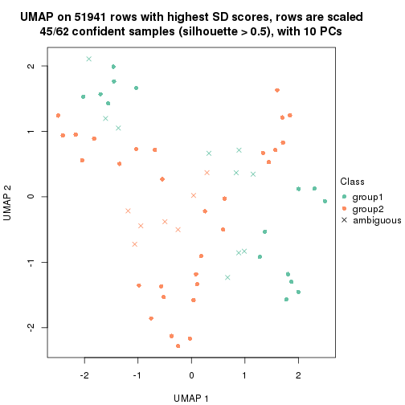</p>

</div>
<div id='tab-SD-kmeans-dimension-reduction-2'>
<pre><code class="r">dimension_reduction(res, k = 3, method = &quot;UMAP&quot;)
</code></pre>

<p>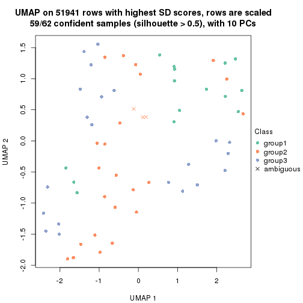</p>

</div>
<div id='tab-SD-kmeans-dimension-reduction-3'>
<pre><code class="r">dimension_reduction(res, k = 4, method = &quot;UMAP&quot;)
</code></pre>

<p>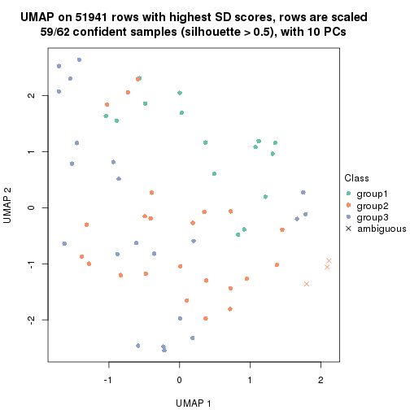</p>

</div>
<div id='tab-SD-kmeans-dimension-reduction-4'>
<pre><code class="r">dimension_reduction(res, k = 5, method = &quot;UMAP&quot;)
</code></pre>

<p>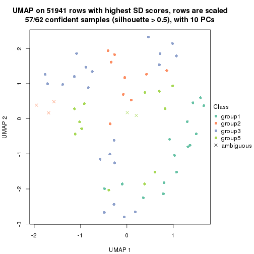</p>

</div>
<div id='tab-SD-kmeans-dimension-reduction-5'>
<pre><code class="r">dimension_reduction(res, k = 6, method = &quot;UMAP&quot;)
</code></pre>

<p>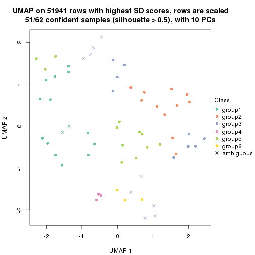</p>

</div>
</div>


Following heatmap shows how subgroups are split when increasing `k`:

```r
collect_classes(res)
```

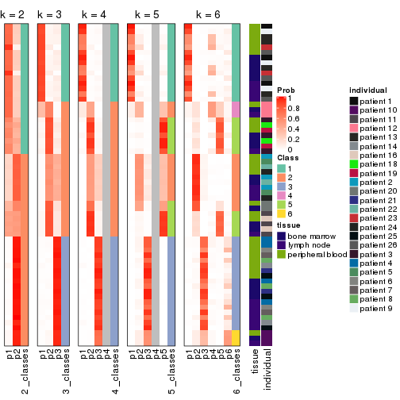


Test correlation between subgroups and known annotations. If the known
annotation is numeric, one-way ANOVA test is applied, and if the known
annotation is discrete, chi-squared contingency table test is applied.

```r
test_to_known_factors(res)
```

```
#>            n tissue(p) individual(p) k
#> SD:kmeans 45     0.762      1.39e-04 2
#> SD:kmeans 59     0.901      1.10e-08 3
#> SD:kmeans 59     0.901      1.10e-08 4
#> SD:kmeans 57     0.924      6.50e-12 5
#> SD:kmeans 51     0.998      1.42e-16 6
```


If matrix rows can be associated to genes, consider to use `functional_enrichment(res,
...)` to perform function enrichment for the signature genes. See [this vignette](http://bioconductor.org/packages/devel/bioc/vignettes/cola/inst/doc/functional_enrichment.html) for more detailed explanations.


 

---------------------------------------------------


### SD:skmeans**


The object with results only for a single top-value method and a single partition method 
can be extracted as:

```r
res = res_list["SD", "skmeans"]
# you can also extract it by
# res = res_list["SD:skmeans"]
```

A summary of `res` and all the functions that can be applied to it:

```r
res
```

```
#> A 'ConsensusPartition' object with k = 2, 3, 4, 5, 6.
#>   On a matrix with 51941 rows and 62 columns.
#>   Top rows (1000, 2000, 3000, 4000, 5000) are extracted by 'SD' method.
#>   Subgroups are detected by 'skmeans' method.
#>   Performed in total 1250 partitions by row resampling.
#>   Best k for subgroups seems to be 3.
#> 
#> Following methods can be applied to this 'ConsensusPartition' object:
#>  [1] "cola_report"             "collect_classes"         "collect_plots"          
#>  [4] "collect_stats"           "colnames"                "compare_signatures"     
#>  [7] "consensus_heatmap"       "dimension_reduction"     "functional_enrichment"  
#> [10] "get_anno_col"            "get_anno"                "get_classes"            
#> [13] "get_consensus"           "get_matrix"              "get_membership"         
#> [16] "get_param"               "get_signatures"          "get_stats"              
#> [19] "is_best_k"               "is_stable_k"             "membership_heatmap"     
#> [22] "ncol"                    "nrow"                    "plot_ecdf"              
#> [25] "rownames"                "select_partition_number" "show"                   
#> [28] "suggest_best_k"          "test_to_known_factors"
```

`collect_plots()` function collects all the plots made from `res` for all `k` (number of partitions)
into one single page to provide an easy and fast comparison between different `k`.

```r
collect_plots(res)
```

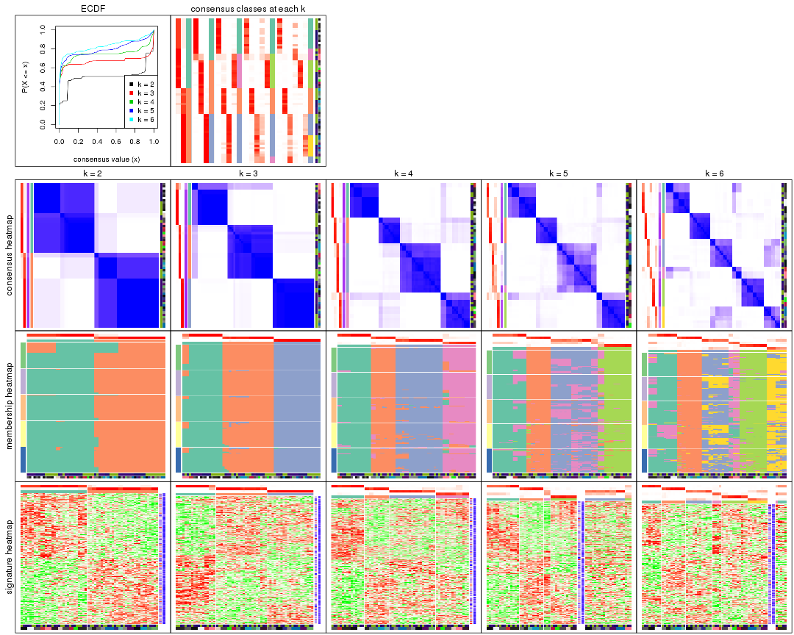

The plots are:

- The first row: a plot of the ECDF (empirical cumulative distribution
  function) curves of the consensus matrix for each `k` and the heatmap of
  predicted classes for each `k`.
- The second row: heatmaps of the consensus matrix for each `k`.
- The third row: heatmaps of the membership matrix for each `k`.
- The fouth row: heatmaps of the signatures for each `k`.

All the plots in panels can be made by individual functions and they are
plotted later in this section.

`select_partition_number()` produces several plots showing different
statistics for choosing "optimized" `k`. There are following statistics:

- ECDF curves of the consensus matrix for each `k`;
- 1-PAC. [The PAC
  score](https://en.wikipedia.org/wiki/Consensus_clustering#Over-interpretation_potential_of_consensus_clustering)
  measures the proportion of the ambiguous subgrouping.
- Mean silhouette score.
- Concordance. The mean probability of fiting the consensus class ids in all
  partitions.
- Area increased. Denote $A_k$ as the area under the ECDF curve for current
  `k`, the area increased is defined as $A_k - A_{k-1}$.
- Rand index. The percent of pairs of samples that are both in a same cluster
  or both are not in a same cluster in the partition of k and k-1.
- Jaccard index. The ratio of pairs of samples are both in a same cluster in
  the partition of k and k-1 and the pairs of samples are both in a same
  cluster in the partition k or k-1.

The detailed explanations of these statistics can be found in [the _cola_
vignette](http://bioconductor.org/packages/devel/bioc/vignettes/cola/inst/doc/cola.html#toc_13).

Generally speaking, lower PAC score, higher mean silhouette score or higher
concordance corresponds to better partition. Rand index and Jaccard index
measure how similar the current partition is compared to partition with `k-1`.
If they are too similar, we won't accept `k` is better than `k-1`.

```r
select_partition_number(res)
```

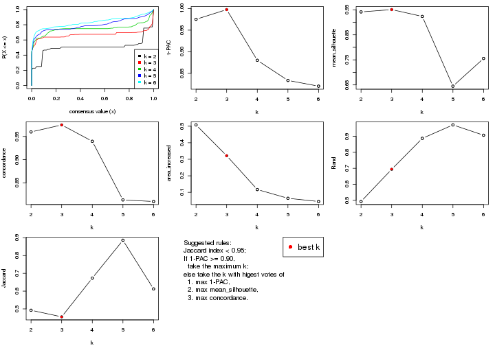

The numeric values for all these statistics can be obtained by `get_stats()`.

```r
get_stats(res)
```

```
#>   k 1-PAC mean_silhouette concordance area_increased  Rand Jaccard
#> 2 2 0.975           0.941       0.960         0.5076 0.492   0.492
#> 3 3 0.998           0.951       0.975         0.3215 0.694   0.455
#> 4 4 0.880           0.923       0.940         0.1170 0.887   0.673
#> 5 5 0.834           0.645       0.813         0.0641 0.971   0.886
#> 6 6 0.820           0.756       0.810         0.0446 0.907   0.612
```

`suggest_best_k()` suggests the best $k$ based on these statistics. The rules are as follows:

- All $k$ with Jaccard index larger than 0.95 are removed because increasing
  $k$ does not provide enough extra information. If all $k$ are removed, it is
  marked as no subgroup is detected.
- For all $k$ with 1-PAC score larger than 0.9, the maximal $k$ is taken as
  the best $k$, and other $k$ are marked as optional $k$.
- If it does not fit the second rule. The $k$ with the maximal vote of the
  highest 1-PAC score, highest mean silhouette, and highest concordance is
  taken as the best $k$.

```r
suggest_best_k(res)
```

```
#> [1] 3
#> attr(,"optional")
#> [1] 2
```

There is also optional best $k$ = 2 that is worth to check.

Following shows the table of the partitions (You need to click the **show/hide
code output** link to see it). The membership matrix (columns with name `p*`)
is inferred by
[`clue::cl_consensus()`](https://www.rdocumentation.org/link/cl_consensus?package=clue)
function with the `SE` method. Basically the value in the membership matrix
represents the probability to belong to a certain group. The finall class
label for an item is determined with the group with highest probability it
belongs to.

In `get_classes()` function, the entropy is calculated from the membership
matrix and the silhouette score is calculated from the consensus matrix.


<script>
$( function() {
	$( '#tabs-SD-skmeans-get-classes' ).tabs();
} );
</script>
<div id='tabs-SD-skmeans-get-classes'>
<ul>
<li><a href='#tab-SD-skmeans-get-classes-1'>k = 2</a></li>
<li><a href='#tab-SD-skmeans-get-classes-2'>k = 3</a></li>
<li><a href='#tab-SD-skmeans-get-classes-3'>k = 4</a></li>
<li><a href='#tab-SD-skmeans-get-classes-4'>k = 5</a></li>
<li><a href='#tab-SD-skmeans-get-classes-5'>k = 6</a></li>
</ul>

<div id='tab-SD-skmeans-get-classes-1'>
<p><a id='tab-SD-skmeans-get-classes-1-a' style='color:#0366d6' href='#'>show/hide code output</a></p>
<pre><code class="r">cbind(get_classes(res, k = 2), get_membership(res, k = 2))
</code></pre>

<pre><code>#&gt;           class entropy silhouette    p1    p2
#&gt; GSM525314     1  0.4298      0.942 0.912 0.088
#&gt; GSM525315     2  0.4298      0.922 0.088 0.912
#&gt; GSM525316     1  0.0000      0.953 1.000 0.000
#&gt; GSM525317     2  0.0000      0.958 0.000 1.000
#&gt; GSM525318     2  0.0000      0.958 0.000 1.000
#&gt; GSM525319     2  0.4298      0.922 0.088 0.912
#&gt; GSM525320     2  0.0000      0.958 0.000 1.000
#&gt; GSM525321     2  0.0000      0.958 0.000 1.000
#&gt; GSM525322     2  0.0000      0.958 0.000 1.000
#&gt; GSM525323     1  0.4298      0.942 0.912 0.088
#&gt; GSM525324     2  0.0000      0.958 0.000 1.000
#&gt; GSM525325     1  0.0376      0.952 0.996 0.004
#&gt; GSM525326     1  0.0000      0.953 1.000 0.000
#&gt; GSM525327     1  0.4298      0.942 0.912 0.088
#&gt; GSM525328     1  0.4298      0.942 0.912 0.088
#&gt; GSM525329     2  0.0000      0.958 0.000 1.000
#&gt; GSM525330     1  0.2236      0.934 0.964 0.036
#&gt; GSM525331     1  0.0000      0.953 1.000 0.000
#&gt; GSM525332     1  0.0000      0.953 1.000 0.000
#&gt; GSM525333     2  0.7883      0.769 0.236 0.764
#&gt; GSM525334     2  0.0000      0.958 0.000 1.000
#&gt; GSM525335     2  0.4298      0.922 0.088 0.912
#&gt; GSM525336     1  0.0000      0.953 1.000 0.000
#&gt; GSM525337     2  0.4298      0.922 0.088 0.912
#&gt; GSM525338     2  0.0000      0.958 0.000 1.000
#&gt; GSM525339     1  0.4298      0.942 0.912 0.088
#&gt; GSM525340     1  0.4298      0.942 0.912 0.088
#&gt; GSM525341     2  0.4298      0.922 0.088 0.912
#&gt; GSM525342     1  0.0000      0.953 1.000 0.000
#&gt; GSM525343     2  0.0000      0.958 0.000 1.000
#&gt; GSM525344     2  0.0000      0.958 0.000 1.000
#&gt; GSM525345     1  0.4298      0.942 0.912 0.088
#&gt; GSM525346     2  0.0000      0.958 0.000 1.000
#&gt; GSM525347     1  0.0000      0.953 1.000 0.000
#&gt; GSM525348     1  0.0000      0.953 1.000 0.000
#&gt; GSM525349     1  0.4298      0.942 0.912 0.088
#&gt; GSM525350     1  0.2236      0.934 0.964 0.036
#&gt; GSM525351     1  0.0000      0.953 1.000 0.000
#&gt; GSM525352     1  0.0000      0.953 1.000 0.000
#&gt; GSM525353     2  0.7950      0.764 0.240 0.760
#&gt; GSM525354     2  0.0000      0.958 0.000 1.000
#&gt; GSM525355     2  0.4298      0.922 0.088 0.912
#&gt; GSM525356     1  0.0000      0.953 1.000 0.000
#&gt; GSM525357     2  0.0000      0.958 0.000 1.000
#&gt; GSM525358     1  0.4298      0.942 0.912 0.088
#&gt; GSM525359     1  0.4298      0.942 0.912 0.088
#&gt; GSM525360     2  0.4298      0.922 0.088 0.912
#&gt; GSM525361     1  0.0000      0.953 1.000 0.000
#&gt; GSM525362     2  0.0000      0.958 0.000 1.000
#&gt; GSM525363     2  0.4298      0.922 0.088 0.912
#&gt; GSM525364     2  0.0000      0.958 0.000 1.000
#&gt; GSM525365     2  0.0000      0.958 0.000 1.000
#&gt; GSM525366     2  0.0000      0.958 0.000 1.000
#&gt; GSM525367     1  0.4298      0.942 0.912 0.088
#&gt; GSM525368     2  0.0000      0.958 0.000 1.000
#&gt; GSM525369     1  0.0672      0.950 0.992 0.008
#&gt; GSM525370     1  0.0000      0.953 1.000 0.000
#&gt; GSM525371     1  0.4298      0.942 0.912 0.088
#&gt; GSM525372     2  0.0000      0.958 0.000 1.000
#&gt; GSM525373     2  0.4298      0.922 0.088 0.912
#&gt; GSM525374     2  0.0000      0.958 0.000 1.000
#&gt; GSM525375     1  0.4298      0.942 0.912 0.088
</code></pre>

<script>
$('#tab-SD-skmeans-get-classes-1-a').parent().next().next().hide();
$('#tab-SD-skmeans-get-classes-1-a').click(function(){
  $('#tab-SD-skmeans-get-classes-1-a').parent().next().next().toggle();
  return(false);
});
</script>
</div>

<div id='tab-SD-skmeans-get-classes-2'>
<p><a id='tab-SD-skmeans-get-classes-2-a' style='color:#0366d6' href='#'>show/hide code output</a></p>
<pre><code class="r">cbind(get_classes(res, k = 3), get_membership(res, k = 3))
</code></pre>

<pre><code>#&gt;           class entropy silhouette    p1    p2    p3
#&gt; GSM525314     1  0.0000      0.943 1.000 0.000 0.000
#&gt; GSM525315     2  0.1411      0.964 0.000 0.964 0.036
#&gt; GSM525316     2  0.2878      0.890 0.096 0.904 0.000
#&gt; GSM525317     3  0.0000      0.997 0.000 0.000 1.000
#&gt; GSM525318     3  0.0237      0.995 0.004 0.000 0.996
#&gt; GSM525319     2  0.1411      0.964 0.000 0.964 0.036
#&gt; GSM525320     3  0.0000      0.997 0.000 0.000 1.000
#&gt; GSM525321     3  0.0000      0.997 0.000 0.000 1.000
#&gt; GSM525322     3  0.0000      0.997 0.000 0.000 1.000
#&gt; GSM525323     1  0.0000      0.943 1.000 0.000 0.000
#&gt; GSM525324     3  0.0000      0.997 0.000 0.000 1.000
#&gt; GSM525325     2  0.0000      0.972 0.000 1.000 0.000
#&gt; GSM525326     1  0.5650      0.603 0.688 0.312 0.000
#&gt; GSM525327     1  0.0000      0.943 1.000 0.000 0.000
#&gt; GSM525328     1  0.0000      0.943 1.000 0.000 0.000
#&gt; GSM525329     3  0.0747      0.984 0.016 0.000 0.984
#&gt; GSM525330     2  0.0000      0.972 0.000 1.000 0.000
#&gt; GSM525331     2  0.0000      0.972 0.000 1.000 0.000
#&gt; GSM525332     2  0.0237      0.971 0.004 0.996 0.000
#&gt; GSM525333     2  0.0000      0.972 0.000 1.000 0.000
#&gt; GSM525334     3  0.0000      0.997 0.000 0.000 1.000
#&gt; GSM525335     2  0.1031      0.968 0.000 0.976 0.024
#&gt; GSM525336     1  0.0237      0.940 0.996 0.004 0.000
#&gt; GSM525337     2  0.1529      0.961 0.000 0.960 0.040
#&gt; GSM525338     3  0.0237      0.995 0.004 0.000 0.996
#&gt; GSM525339     1  0.0000      0.943 1.000 0.000 0.000
#&gt; GSM525340     1  0.0000      0.943 1.000 0.000 0.000
#&gt; GSM525341     2  0.1411      0.964 0.000 0.964 0.036
#&gt; GSM525342     2  0.2066      0.930 0.060 0.940 0.000
#&gt; GSM525343     3  0.0000      0.997 0.000 0.000 1.000
#&gt; GSM525344     3  0.0000      0.997 0.000 0.000 1.000
#&gt; GSM525345     1  0.0000      0.943 1.000 0.000 0.000
#&gt; GSM525346     3  0.0000      0.997 0.000 0.000 1.000
#&gt; GSM525347     2  0.0000      0.972 0.000 1.000 0.000
#&gt; GSM525348     1  0.5650      0.603 0.688 0.312 0.000
#&gt; GSM525349     1  0.0000      0.943 1.000 0.000 0.000
#&gt; GSM525350     2  0.0000      0.972 0.000 1.000 0.000
#&gt; GSM525351     2  0.0000      0.972 0.000 1.000 0.000
#&gt; GSM525352     2  0.0237      0.971 0.004 0.996 0.000
#&gt; GSM525353     2  0.0000      0.972 0.000 1.000 0.000
#&gt; GSM525354     3  0.0000      0.997 0.000 0.000 1.000
#&gt; GSM525355     2  0.1031      0.968 0.000 0.976 0.024
#&gt; GSM525356     1  0.0237      0.940 0.996 0.004 0.000
#&gt; GSM525357     3  0.0237      0.995 0.004 0.000 0.996
#&gt; GSM525358     1  0.0000      0.943 1.000 0.000 0.000
#&gt; GSM525359     1  0.0000      0.943 1.000 0.000 0.000
#&gt; GSM525360     2  0.1411      0.964 0.000 0.964 0.036
#&gt; GSM525361     2  0.1529      0.947 0.040 0.960 0.000
#&gt; GSM525362     3  0.0000      0.997 0.000 0.000 1.000
#&gt; GSM525363     2  0.1643      0.958 0.000 0.956 0.044
#&gt; GSM525364     3  0.0000      0.997 0.000 0.000 1.000
#&gt; GSM525365     3  0.0237      0.995 0.004 0.000 0.996
#&gt; GSM525366     3  0.0000      0.997 0.000 0.000 1.000
#&gt; GSM525367     1  0.0000      0.943 1.000 0.000 0.000
#&gt; GSM525368     3  0.0000      0.997 0.000 0.000 1.000
#&gt; GSM525369     2  0.0000      0.972 0.000 1.000 0.000
#&gt; GSM525370     1  0.5650      0.603 0.688 0.312 0.000
#&gt; GSM525371     1  0.0000      0.943 1.000 0.000 0.000
#&gt; GSM525372     3  0.0747      0.984 0.016 0.000 0.984
#&gt; GSM525373     2  0.2625      0.919 0.000 0.916 0.084
#&gt; GSM525374     3  0.0000      0.997 0.000 0.000 1.000
#&gt; GSM525375     1  0.0000      0.943 1.000 0.000 0.000
</code></pre>

<script>
$('#tab-SD-skmeans-get-classes-2-a').parent().next().next().hide();
$('#tab-SD-skmeans-get-classes-2-a').click(function(){
  $('#tab-SD-skmeans-get-classes-2-a').parent().next().next().toggle();
  return(false);
});
</script>
</div>

<div id='tab-SD-skmeans-get-classes-3'>
<p><a id='tab-SD-skmeans-get-classes-3-a' style='color:#0366d6' href='#'>show/hide code output</a></p>
<pre><code class="r">cbind(get_classes(res, k = 4), get_membership(res, k = 4))
</code></pre>

<pre><code>#&gt;           class entropy silhouette    p1    p2    p3    p4
#&gt; GSM525314     1  0.0000      0.983 1.000 0.000 0.000 0.000
#&gt; GSM525315     2  0.0895      0.957 0.000 0.976 0.004 0.020
#&gt; GSM525316     4  0.1297      0.896 0.020 0.016 0.000 0.964
#&gt; GSM525317     3  0.1042      0.946 0.000 0.020 0.972 0.008
#&gt; GSM525318     3  0.1042      0.946 0.000 0.020 0.972 0.008
#&gt; GSM525319     2  0.0927      0.955 0.000 0.976 0.008 0.016
#&gt; GSM525320     3  0.0895      0.947 0.000 0.020 0.976 0.004
#&gt; GSM525321     3  0.1082      0.948 0.004 0.020 0.972 0.004
#&gt; GSM525322     3  0.2921      0.889 0.000 0.140 0.860 0.000
#&gt; GSM525323     1  0.0000      0.983 1.000 0.000 0.000 0.000
#&gt; GSM525324     3  0.3969      0.844 0.000 0.180 0.804 0.016
#&gt; GSM525325     4  0.1716      0.905 0.000 0.064 0.000 0.936
#&gt; GSM525326     4  0.5624      0.691 0.148 0.128 0.000 0.724
#&gt; GSM525327     1  0.1256      0.975 0.964 0.008 0.000 0.028
#&gt; GSM525328     1  0.1256      0.975 0.964 0.008 0.000 0.028
#&gt; GSM525329     3  0.1124      0.945 0.012 0.012 0.972 0.004
#&gt; GSM525330     4  0.2216      0.894 0.000 0.092 0.000 0.908
#&gt; GSM525331     4  0.2408      0.886 0.000 0.104 0.000 0.896
#&gt; GSM525332     4  0.1637      0.905 0.000 0.060 0.000 0.940
#&gt; GSM525333     2  0.3123      0.827 0.000 0.844 0.000 0.156
#&gt; GSM525334     3  0.1109      0.947 0.000 0.028 0.968 0.004
#&gt; GSM525335     2  0.1256      0.954 0.000 0.964 0.008 0.028
#&gt; GSM525336     1  0.1970      0.955 0.932 0.008 0.000 0.060
#&gt; GSM525337     2  0.1284      0.954 0.000 0.964 0.012 0.024
#&gt; GSM525338     3  0.0921      0.948 0.000 0.028 0.972 0.000
#&gt; GSM525339     1  0.0000      0.983 1.000 0.000 0.000 0.000
#&gt; GSM525340     1  0.0000      0.983 1.000 0.000 0.000 0.000
#&gt; GSM525341     2  0.0895      0.957 0.000 0.976 0.004 0.020
#&gt; GSM525342     4  0.1297      0.896 0.020 0.016 0.000 0.964
#&gt; GSM525343     3  0.1042      0.946 0.000 0.020 0.972 0.008
#&gt; GSM525344     3  0.2973      0.886 0.000 0.144 0.856 0.000
#&gt; GSM525345     1  0.0000      0.983 1.000 0.000 0.000 0.000
#&gt; GSM525346     3  0.3390      0.886 0.000 0.132 0.852 0.016
#&gt; GSM525347     4  0.1637      0.905 0.000 0.060 0.000 0.940
#&gt; GSM525348     4  0.5624      0.691 0.148 0.128 0.000 0.724
#&gt; GSM525349     1  0.1256      0.975 0.964 0.008 0.000 0.028
#&gt; GSM525350     4  0.1940      0.902 0.000 0.076 0.000 0.924
#&gt; GSM525351     4  0.2281      0.892 0.000 0.096 0.000 0.904
#&gt; GSM525352     4  0.1557      0.905 0.000 0.056 0.000 0.944
#&gt; GSM525353     2  0.3172      0.821 0.000 0.840 0.000 0.160
#&gt; GSM525354     3  0.0895      0.948 0.000 0.020 0.976 0.004
#&gt; GSM525355     2  0.1256      0.954 0.000 0.964 0.008 0.028
#&gt; GSM525356     1  0.1970      0.955 0.932 0.008 0.000 0.060
#&gt; GSM525357     3  0.0707      0.948 0.000 0.020 0.980 0.000
#&gt; GSM525358     1  0.0000      0.983 1.000 0.000 0.000 0.000
#&gt; GSM525359     1  0.0000      0.983 1.000 0.000 0.000 0.000
#&gt; GSM525360     2  0.0895      0.957 0.000 0.976 0.004 0.020
#&gt; GSM525361     4  0.1297      0.896 0.020 0.016 0.000 0.964
#&gt; GSM525362     3  0.0804      0.946 0.000 0.012 0.980 0.008
#&gt; GSM525363     2  0.1182      0.953 0.000 0.968 0.016 0.016
#&gt; GSM525364     3  0.0657      0.946 0.000 0.012 0.984 0.004
#&gt; GSM525365     3  0.0712      0.947 0.004 0.008 0.984 0.004
#&gt; GSM525366     3  0.2760      0.896 0.000 0.128 0.872 0.000
#&gt; GSM525367     1  0.0000      0.983 1.000 0.000 0.000 0.000
#&gt; GSM525368     3  0.3390      0.886 0.000 0.132 0.852 0.016
#&gt; GSM525369     4  0.1637      0.905 0.000 0.060 0.000 0.940
#&gt; GSM525370     4  0.5624      0.691 0.148 0.128 0.000 0.724
#&gt; GSM525371     1  0.1256      0.975 0.964 0.008 0.000 0.028
#&gt; GSM525372     3  0.1124      0.945 0.012 0.012 0.972 0.004
#&gt; GSM525373     2  0.1510      0.944 0.000 0.956 0.028 0.016
#&gt; GSM525374     3  0.0592      0.948 0.000 0.016 0.984 0.000
#&gt; GSM525375     1  0.0000      0.983 1.000 0.000 0.000 0.000
</code></pre>

<script>
$('#tab-SD-skmeans-get-classes-3-a').parent().next().next().hide();
$('#tab-SD-skmeans-get-classes-3-a').click(function(){
  $('#tab-SD-skmeans-get-classes-3-a').parent().next().next().toggle();
  return(false);
});
</script>
</div>

<div id='tab-SD-skmeans-get-classes-4'>
<p><a id='tab-SD-skmeans-get-classes-4-a' style='color:#0366d6' href='#'>show/hide code output</a></p>
<pre><code class="r">cbind(get_classes(res, k = 5), get_membership(res, k = 5))
</code></pre>

<pre><code>#&gt;           class entropy silhouette    p1    p2    p3    p4    p5
#&gt; GSM525314     1  0.3508     0.8839 0.748 0.000 0.000 0.252 0.000
#&gt; GSM525315     2  0.0290     0.9567 0.000 0.992 0.000 0.000 0.008
#&gt; GSM525316     5  0.1187     0.8557 0.004 0.004 0.004 0.024 0.964
#&gt; GSM525317     3  0.0912     0.3581 0.000 0.016 0.972 0.012 0.000
#&gt; GSM525318     3  0.0912     0.3582 0.000 0.012 0.972 0.016 0.000
#&gt; GSM525319     2  0.0290     0.9567 0.000 0.992 0.000 0.000 0.008
#&gt; GSM525320     3  0.3562     0.1151 0.000 0.016 0.788 0.196 0.000
#&gt; GSM525321     3  0.3988     0.2305 0.000 0.016 0.732 0.252 0.000
#&gt; GSM525322     4  0.5635     0.9300 0.000 0.076 0.428 0.496 0.000
#&gt; GSM525323     1  0.3561     0.8819 0.740 0.000 0.000 0.260 0.000
#&gt; GSM525324     3  0.5747    -0.0809 0.000 0.092 0.576 0.328 0.004
#&gt; GSM525325     5  0.0579     0.8595 0.000 0.008 0.000 0.008 0.984
#&gt; GSM525326     5  0.8014     0.3638 0.308 0.088 0.004 0.204 0.396
#&gt; GSM525327     1  0.0451     0.8262 0.988 0.004 0.000 0.000 0.008
#&gt; GSM525328     1  0.0451     0.8262 0.988 0.004 0.000 0.000 0.008
#&gt; GSM525329     3  0.4365     0.1683 0.004 0.012 0.676 0.308 0.000
#&gt; GSM525330     5  0.1251     0.8536 0.000 0.036 0.000 0.008 0.956
#&gt; GSM525331     5  0.1251     0.8515 0.000 0.036 0.000 0.008 0.956
#&gt; GSM525332     5  0.0912     0.8584 0.000 0.016 0.000 0.012 0.972
#&gt; GSM525333     2  0.2653     0.8872 0.000 0.880 0.000 0.024 0.096
#&gt; GSM525334     3  0.4465     0.1508 0.000 0.024 0.672 0.304 0.000
#&gt; GSM525335     2  0.1393     0.9469 0.000 0.956 0.012 0.024 0.008
#&gt; GSM525336     1  0.2886     0.7464 0.864 0.004 0.000 0.116 0.016
#&gt; GSM525337     2  0.1885     0.9394 0.000 0.936 0.020 0.032 0.012
#&gt; GSM525338     3  0.4366     0.0887 0.000 0.016 0.664 0.320 0.000
#&gt; GSM525339     1  0.3395     0.8847 0.764 0.000 0.000 0.236 0.000
#&gt; GSM525340     1  0.3480     0.8848 0.752 0.000 0.000 0.248 0.000
#&gt; GSM525341     2  0.0290     0.9567 0.000 0.992 0.000 0.000 0.008
#&gt; GSM525342     5  0.1116     0.8559 0.000 0.004 0.004 0.028 0.964
#&gt; GSM525343     3  0.1012     0.3597 0.000 0.012 0.968 0.020 0.000
#&gt; GSM525344     4  0.5591     0.9382 0.000 0.072 0.432 0.496 0.000
#&gt; GSM525345     1  0.3561     0.8819 0.740 0.000 0.000 0.260 0.000
#&gt; GSM525346     3  0.5219    -0.0752 0.000 0.052 0.616 0.328 0.004
#&gt; GSM525347     5  0.0404     0.8581 0.000 0.000 0.000 0.012 0.988
#&gt; GSM525348     5  0.8014     0.3638 0.308 0.088 0.004 0.204 0.396
#&gt; GSM525349     1  0.0451     0.8262 0.988 0.004 0.000 0.000 0.008
#&gt; GSM525350     5  0.1251     0.8529 0.000 0.036 0.000 0.008 0.956
#&gt; GSM525351     5  0.1331     0.8489 0.000 0.040 0.000 0.008 0.952
#&gt; GSM525352     5  0.0807     0.8591 0.000 0.012 0.000 0.012 0.976
#&gt; GSM525353     2  0.2953     0.8788 0.004 0.868 0.000 0.028 0.100
#&gt; GSM525354     3  0.4088     0.1740 0.000 0.008 0.688 0.304 0.000
#&gt; GSM525355     2  0.1393     0.9472 0.000 0.956 0.012 0.024 0.008
#&gt; GSM525356     1  0.2886     0.7464 0.864 0.004 0.000 0.116 0.016
#&gt; GSM525357     3  0.4147     0.1006 0.000 0.008 0.676 0.316 0.000
#&gt; GSM525358     1  0.3395     0.8847 0.764 0.000 0.000 0.236 0.000
#&gt; GSM525359     1  0.3480     0.8848 0.752 0.000 0.000 0.248 0.000
#&gt; GSM525360     2  0.0486     0.9551 0.000 0.988 0.004 0.004 0.004
#&gt; GSM525361     5  0.1116     0.8559 0.000 0.004 0.004 0.028 0.964
#&gt; GSM525362     3  0.0771     0.3496 0.000 0.004 0.976 0.020 0.000
#&gt; GSM525363     2  0.0740     0.9532 0.000 0.980 0.008 0.008 0.004
#&gt; GSM525364     3  0.3421     0.1015 0.000 0.008 0.788 0.204 0.000
#&gt; GSM525365     3  0.3689     0.2249 0.000 0.004 0.740 0.256 0.000
#&gt; GSM525366     4  0.5227     0.8896 0.000 0.044 0.448 0.508 0.000
#&gt; GSM525367     1  0.3534     0.8831 0.744 0.000 0.000 0.256 0.000
#&gt; GSM525368     3  0.5219    -0.0752 0.000 0.052 0.616 0.328 0.004
#&gt; GSM525369     5  0.0566     0.8586 0.000 0.004 0.000 0.012 0.984
#&gt; GSM525370     5  0.8014     0.3638 0.308 0.088 0.004 0.204 0.396
#&gt; GSM525371     1  0.0451     0.8262 0.988 0.004 0.000 0.000 0.008
#&gt; GSM525372     3  0.4162     0.1731 0.004 0.004 0.680 0.312 0.000
#&gt; GSM525373     2  0.1893     0.9384 0.000 0.936 0.024 0.028 0.012
#&gt; GSM525374     3  0.4066     0.0778 0.000 0.004 0.672 0.324 0.000
#&gt; GSM525375     1  0.3395     0.8847 0.764 0.000 0.000 0.236 0.000
</code></pre>

<script>
$('#tab-SD-skmeans-get-classes-4-a').parent().next().next().hide();
$('#tab-SD-skmeans-get-classes-4-a').click(function(){
  $('#tab-SD-skmeans-get-classes-4-a').parent().next().next().toggle();
  return(false);
});
</script>
</div>

<div id='tab-SD-skmeans-get-classes-5'>
<p><a id='tab-SD-skmeans-get-classes-5-a' style='color:#0366d6' href='#'>show/hide code output</a></p>
<pre><code class="r">cbind(get_classes(res, k = 6), get_membership(res, k = 6))
</code></pre>

<pre><code>#&gt;           class entropy silhouette    p1    p2    p3    p4    p5    p6
#&gt; GSM525314     1  0.0260      0.780 0.992 0.000 0.000 0.008 0.000 0.000
#&gt; GSM525315     2  0.0146      0.959 0.000 0.996 0.004 0.000 0.000 0.000
#&gt; GSM525316     5  0.2182      0.920 0.008 0.000 0.000 0.068 0.904 0.020
#&gt; GSM525317     6  0.3172      0.622 0.012 0.016 0.152 0.000 0.000 0.820
#&gt; GSM525318     6  0.3155      0.613 0.012 0.012 0.160 0.000 0.000 0.816
#&gt; GSM525319     2  0.0146      0.958 0.000 0.996 0.000 0.004 0.000 0.000
#&gt; GSM525320     6  0.4710      0.629 0.000 0.004 0.368 0.036 0.004 0.588
#&gt; GSM525321     3  0.4457      0.697 0.008 0.012 0.636 0.012 0.000 0.332
#&gt; GSM525322     3  0.2688      0.511 0.000 0.024 0.884 0.048 0.000 0.044
#&gt; GSM525323     1  0.1088      0.770 0.960 0.000 0.000 0.024 0.000 0.016
#&gt; GSM525324     6  0.5837      0.576 0.000 0.048 0.368 0.072 0.000 0.512
#&gt; GSM525325     5  0.2563      0.916 0.000 0.004 0.000 0.076 0.880 0.040
#&gt; GSM525326     4  0.4227      0.776 0.020 0.040 0.000 0.800 0.076 0.064
#&gt; GSM525327     1  0.4654      0.346 0.544 0.000 0.000 0.412 0.000 0.044
#&gt; GSM525328     1  0.4654      0.346 0.544 0.000 0.000 0.412 0.000 0.044
#&gt; GSM525329     3  0.4129      0.759 0.020 0.000 0.716 0.020 0.000 0.244
#&gt; GSM525330     5  0.1167      0.937 0.000 0.008 0.000 0.012 0.960 0.020
#&gt; GSM525331     5  0.0405      0.937 0.000 0.008 0.000 0.004 0.988 0.000
#&gt; GSM525332     5  0.0260      0.938 0.000 0.008 0.000 0.000 0.992 0.000
#&gt; GSM525333     2  0.2716      0.895 0.000 0.880 0.004 0.044 0.064 0.008
#&gt; GSM525334     3  0.3934      0.747 0.000 0.008 0.716 0.020 0.000 0.256
#&gt; GSM525335     2  0.0622      0.954 0.000 0.980 0.000 0.012 0.000 0.008
#&gt; GSM525336     4  0.3405      0.512 0.272 0.000 0.000 0.724 0.004 0.000
#&gt; GSM525337     2  0.1528      0.942 0.000 0.944 0.012 0.016 0.028 0.000
#&gt; GSM525338     3  0.3716      0.765 0.000 0.008 0.732 0.012 0.000 0.248
#&gt; GSM525339     1  0.1391      0.776 0.944 0.000 0.000 0.040 0.000 0.016
#&gt; GSM525340     1  0.0260      0.780 0.992 0.000 0.000 0.008 0.000 0.000
#&gt; GSM525341     2  0.0146      0.959 0.000 0.996 0.004 0.000 0.000 0.000
#&gt; GSM525342     5  0.2206      0.921 0.008 0.000 0.000 0.064 0.904 0.024
#&gt; GSM525343     6  0.3275      0.620 0.012 0.016 0.148 0.004 0.000 0.820
#&gt; GSM525344     3  0.2606      0.510 0.000 0.020 0.888 0.048 0.000 0.044
#&gt; GSM525345     1  0.1088      0.770 0.960 0.000 0.000 0.024 0.000 0.016
#&gt; GSM525346     6  0.5503      0.582 0.000 0.020 0.400 0.076 0.000 0.504
#&gt; GSM525347     5  0.2800      0.902 0.000 0.004 0.000 0.100 0.860 0.036
#&gt; GSM525348     4  0.4227      0.776 0.020 0.040 0.000 0.800 0.076 0.064
#&gt; GSM525349     1  0.4654      0.346 0.544 0.000 0.000 0.412 0.000 0.044
#&gt; GSM525350     5  0.1167      0.937 0.000 0.008 0.000 0.012 0.960 0.020
#&gt; GSM525351     5  0.0820      0.934 0.000 0.016 0.000 0.012 0.972 0.000
#&gt; GSM525352     5  0.0260      0.938 0.000 0.008 0.000 0.000 0.992 0.000
#&gt; GSM525353     2  0.3141      0.863 0.000 0.848 0.004 0.072 0.072 0.004
#&gt; GSM525354     3  0.3584      0.760 0.000 0.004 0.740 0.012 0.000 0.244
#&gt; GSM525355     2  0.0820      0.952 0.000 0.972 0.000 0.016 0.000 0.012
#&gt; GSM525356     4  0.3508      0.494 0.292 0.000 0.000 0.704 0.004 0.000
#&gt; GSM525357     3  0.3483      0.765 0.000 0.000 0.748 0.016 0.000 0.236
#&gt; GSM525358     1  0.1391      0.776 0.944 0.000 0.000 0.040 0.000 0.016
#&gt; GSM525359     1  0.0458      0.781 0.984 0.000 0.000 0.016 0.000 0.000
#&gt; GSM525360     2  0.0405      0.957 0.000 0.988 0.008 0.004 0.000 0.000
#&gt; GSM525361     5  0.2063      0.924 0.008 0.000 0.000 0.060 0.912 0.020
#&gt; GSM525362     6  0.2920      0.617 0.008 0.004 0.168 0.000 0.000 0.820
#&gt; GSM525363     2  0.0551      0.958 0.000 0.984 0.004 0.008 0.000 0.004
#&gt; GSM525364     6  0.4283      0.628 0.000 0.000 0.384 0.024 0.000 0.592
#&gt; GSM525365     3  0.4076      0.690 0.004 0.000 0.636 0.012 0.000 0.348
#&gt; GSM525366     3  0.2583      0.505 0.000 0.016 0.888 0.044 0.000 0.052
#&gt; GSM525367     1  0.1003      0.771 0.964 0.000 0.000 0.020 0.000 0.016
#&gt; GSM525368     6  0.5530      0.586 0.000 0.024 0.400 0.072 0.000 0.504
#&gt; GSM525369     5  0.2870      0.904 0.000 0.004 0.000 0.100 0.856 0.040
#&gt; GSM525370     4  0.4227      0.776 0.020 0.040 0.000 0.800 0.076 0.064
#&gt; GSM525371     1  0.4654      0.346 0.544 0.000 0.000 0.412 0.000 0.044
#&gt; GSM525372     3  0.4047      0.758 0.020 0.000 0.720 0.016 0.000 0.244
#&gt; GSM525373     2  0.1390      0.941 0.000 0.948 0.032 0.016 0.004 0.000
#&gt; GSM525374     3  0.3483      0.762 0.000 0.000 0.748 0.016 0.000 0.236
#&gt; GSM525375     1  0.1461      0.775 0.940 0.000 0.000 0.044 0.000 0.016
</code></pre>

<script>
$('#tab-SD-skmeans-get-classes-5-a').parent().next().next().hide();
$('#tab-SD-skmeans-get-classes-5-a').click(function(){
  $('#tab-SD-skmeans-get-classes-5-a').parent().next().next().toggle();
  return(false);
});
</script>
</div>
</div>

Heatmaps for the consensus matrix. It visualizes the probability of two
samples to be in a same group.


<script>
$( function() {
	$( '#tabs-SD-skmeans-consensus-heatmap' ).tabs();
} );
</script>
<div id='tabs-SD-skmeans-consensus-heatmap'>
<ul>
<li><a href='#tab-SD-skmeans-consensus-heatmap-1'>k = 2</a></li>
<li><a href='#tab-SD-skmeans-consensus-heatmap-2'>k = 3</a></li>
<li><a href='#tab-SD-skmeans-consensus-heatmap-3'>k = 4</a></li>
<li><a href='#tab-SD-skmeans-consensus-heatmap-4'>k = 5</a></li>
<li><a href='#tab-SD-skmeans-consensus-heatmap-5'>k = 6</a></li>
</ul>
<div id='tab-SD-skmeans-consensus-heatmap-1'>
<pre><code class="r">consensus_heatmap(res, k = 2)
</code></pre>

<p>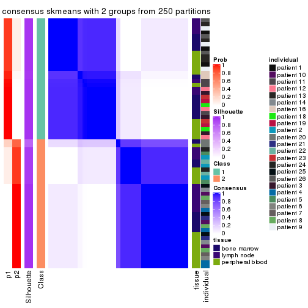</p>

</div>
<div id='tab-SD-skmeans-consensus-heatmap-2'>
<pre><code class="r">consensus_heatmap(res, k = 3)
</code></pre>

<p>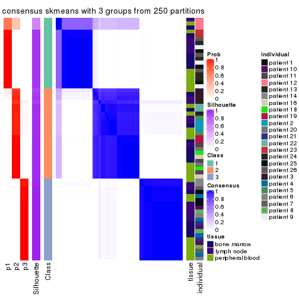</p>

</div>
<div id='tab-SD-skmeans-consensus-heatmap-3'>
<pre><code class="r">consensus_heatmap(res, k = 4)
</code></pre>

<p>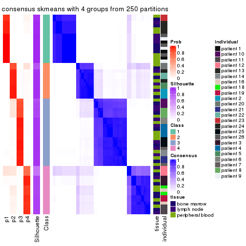</p>

</div>
<div id='tab-SD-skmeans-consensus-heatmap-4'>
<pre><code class="r">consensus_heatmap(res, k = 5)
</code></pre>

<p>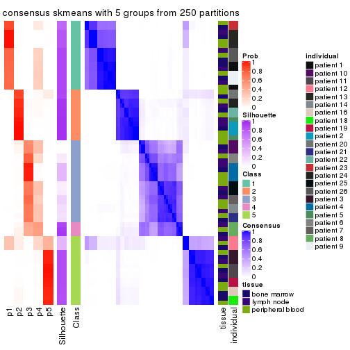</p>

</div>
<div id='tab-SD-skmeans-consensus-heatmap-5'>
<pre><code class="r">consensus_heatmap(res, k = 6)
</code></pre>

<p>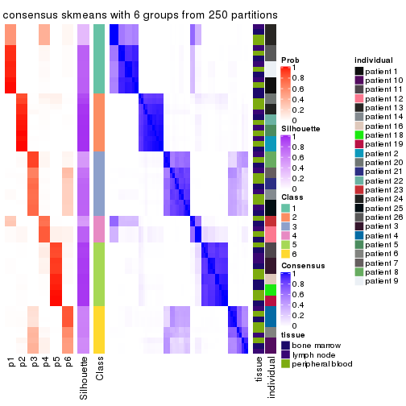</p>

</div>
</div>

Heatmaps for the membership of samples in all partitions to see how consistent they are:


<script>
$( function() {
	$( '#tabs-SD-skmeans-membership-heatmap' ).tabs();
} );
</script>
<div id='tabs-SD-skmeans-membership-heatmap'>
<ul>
<li><a href='#tab-SD-skmeans-membership-heatmap-1'>k = 2</a></li>
<li><a href='#tab-SD-skmeans-membership-heatmap-2'>k = 3</a></li>
<li><a href='#tab-SD-skmeans-membership-heatmap-3'>k = 4</a></li>
<li><a href='#tab-SD-skmeans-membership-heatmap-4'>k = 5</a></li>
<li><a href='#tab-SD-skmeans-membership-heatmap-5'>k = 6</a></li>
</ul>
<div id='tab-SD-skmeans-membership-heatmap-1'>
<pre><code class="r">membership_heatmap(res, k = 2)
</code></pre>

<p>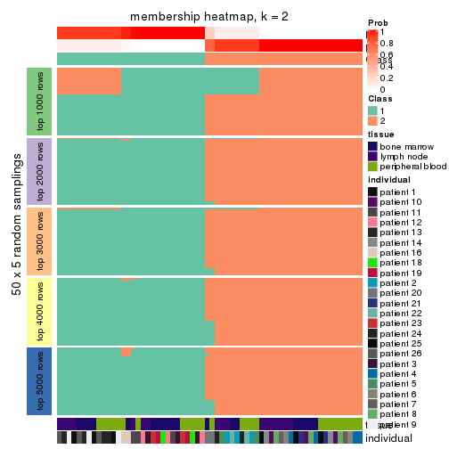</p>

</div>
<div id='tab-SD-skmeans-membership-heatmap-2'>
<pre><code class="r">membership_heatmap(res, k = 3)
</code></pre>

<p>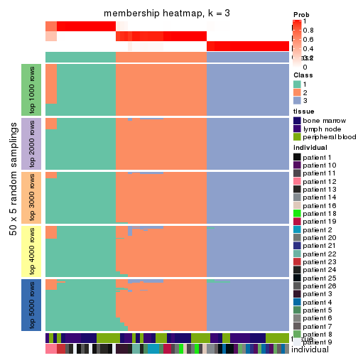</p>

</div>
<div id='tab-SD-skmeans-membership-heatmap-3'>
<pre><code class="r">membership_heatmap(res, k = 4)
</code></pre>

<p>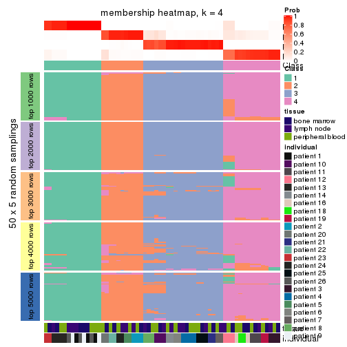</p>

</div>
<div id='tab-SD-skmeans-membership-heatmap-4'>
<pre><code class="r">membership_heatmap(res, k = 5)
</code></pre>

<p>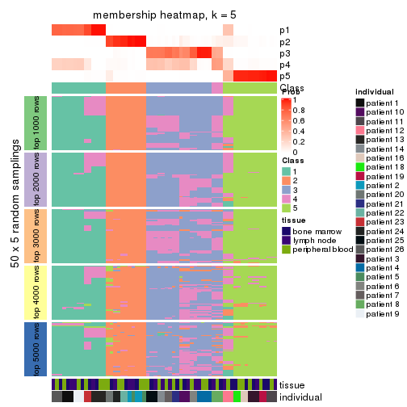</p>

</div>
<div id='tab-SD-skmeans-membership-heatmap-5'>
<pre><code class="r">membership_heatmap(res, k = 6)
</code></pre>

<p>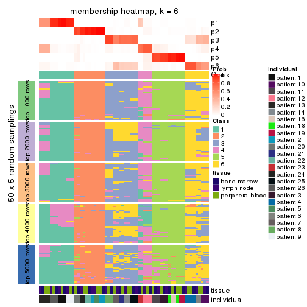</p>

</div>
</div>

As soon as we have had the classes for columns, we can look for signatures
which are significantly different between classes which can be candidate marks
for certain classes. Following are the heatmaps for signatures.


Signature heatmaps where rows are scaled:


<script>
$( function() {
	$( '#tabs-SD-skmeans-get-signatures' ).tabs();
} );
</script>
<div id='tabs-SD-skmeans-get-signatures'>
<ul>
<li><a href='#tab-SD-skmeans-get-signatures-1'>k = 2</a></li>
<li><a href='#tab-SD-skmeans-get-signatures-2'>k = 3</a></li>
<li><a href='#tab-SD-skmeans-get-signatures-3'>k = 4</a></li>
<li><a href='#tab-SD-skmeans-get-signatures-4'>k = 5</a></li>
<li><a href='#tab-SD-skmeans-get-signatures-5'>k = 6</a></li>
</ul>
<div id='tab-SD-skmeans-get-signatures-1'>
<pre><code class="r">get_signatures(res, k = 2)
</code></pre>

<p>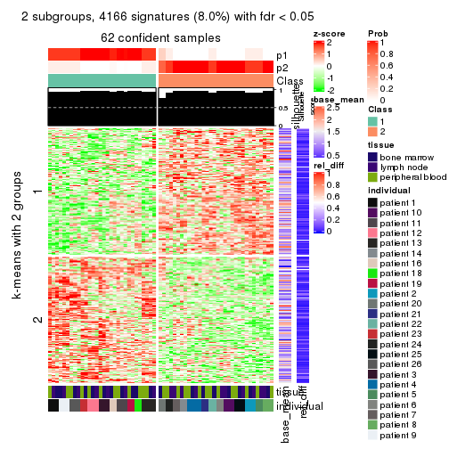</p>

</div>
<div id='tab-SD-skmeans-get-signatures-2'>
<pre><code class="r">get_signatures(res, k = 3)
</code></pre>

<p>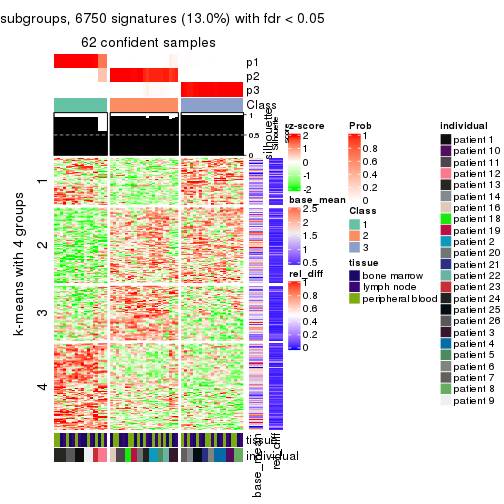</p>

</div>
<div id='tab-SD-skmeans-get-signatures-3'>
<pre><code class="r">get_signatures(res, k = 4)
</code></pre>

<p>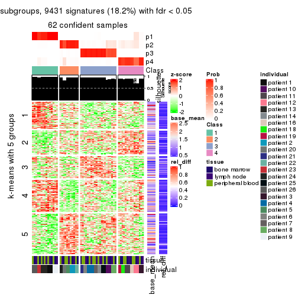</p>

</div>
<div id='tab-SD-skmeans-get-signatures-4'>
<pre><code class="r">get_signatures(res, k = 5)
</code></pre>

<p>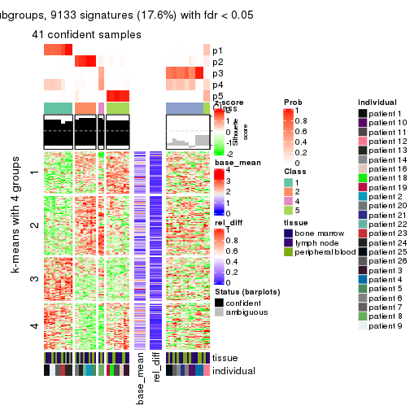</p>

</div>
<div id='tab-SD-skmeans-get-signatures-5'>
<pre><code class="r">get_signatures(res, k = 6)
</code></pre>

<p>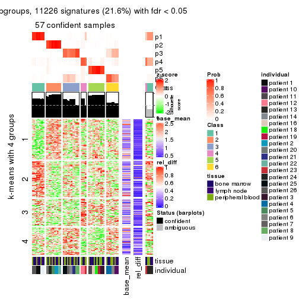</p>

</div>
</div>


Signature heatmaps where rows are not scaled:


<script>
$( function() {
	$( '#tabs-SD-skmeans-get-signatures-no-scale' ).tabs();
} );
</script>
<div id='tabs-SD-skmeans-get-signatures-no-scale'>
<ul>
<li><a href='#tab-SD-skmeans-get-signatures-no-scale-1'>k = 2</a></li>
<li><a href='#tab-SD-skmeans-get-signatures-no-scale-2'>k = 3</a></li>
<li><a href='#tab-SD-skmeans-get-signatures-no-scale-3'>k = 4</a></li>
<li><a href='#tab-SD-skmeans-get-signatures-no-scale-4'>k = 5</a></li>
<li><a href='#tab-SD-skmeans-get-signatures-no-scale-5'>k = 6</a></li>
</ul>
<div id='tab-SD-skmeans-get-signatures-no-scale-1'>
<pre><code class="r">get_signatures(res, k = 2, scale_rows = FALSE)
</code></pre>

<p>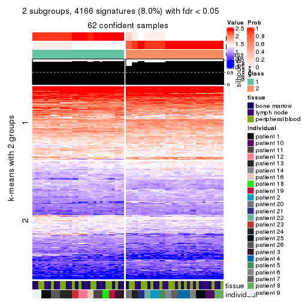</p>

</div>
<div id='tab-SD-skmeans-get-signatures-no-scale-2'>
<pre><code class="r">get_signatures(res, k = 3, scale_rows = FALSE)
</code></pre>

<p>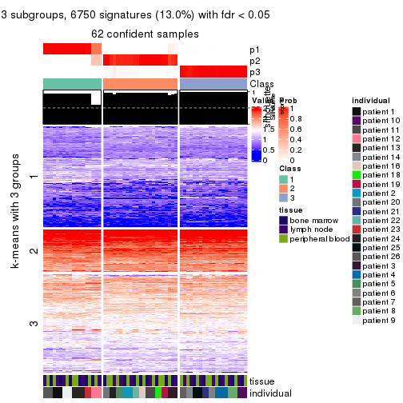</p>

</div>
<div id='tab-SD-skmeans-get-signatures-no-scale-3'>
<pre><code class="r">get_signatures(res, k = 4, scale_rows = FALSE)
</code></pre>

<p>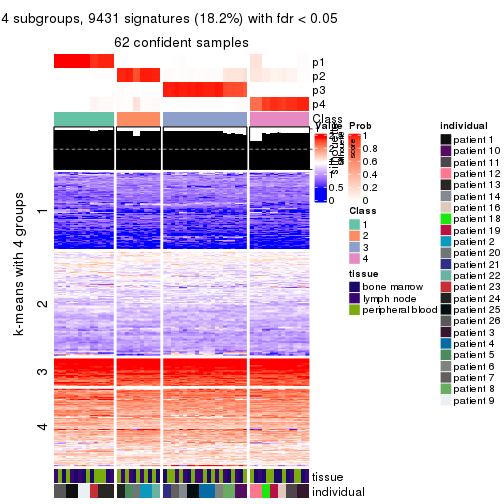</p>

</div>
<div id='tab-SD-skmeans-get-signatures-no-scale-4'>
<pre><code class="r">get_signatures(res, k = 5, scale_rows = FALSE)
</code></pre>

<p>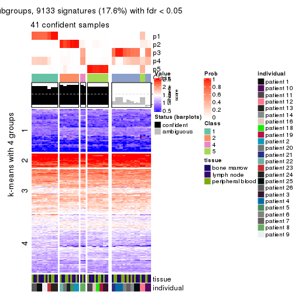</p>

</div>
<div id='tab-SD-skmeans-get-signatures-no-scale-5'>
<pre><code class="r">get_signatures(res, k = 6, scale_rows = FALSE)
</code></pre>

<p>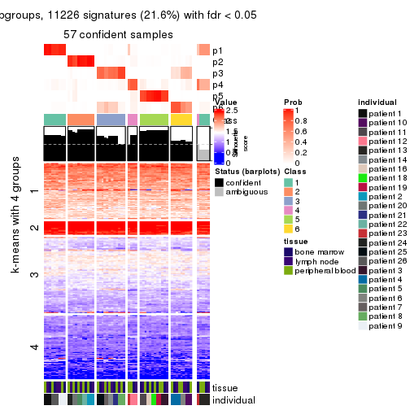</p>

</div>
</div>


Compare the overlap of signatures from different k:

```r
compare_signatures(res)
```

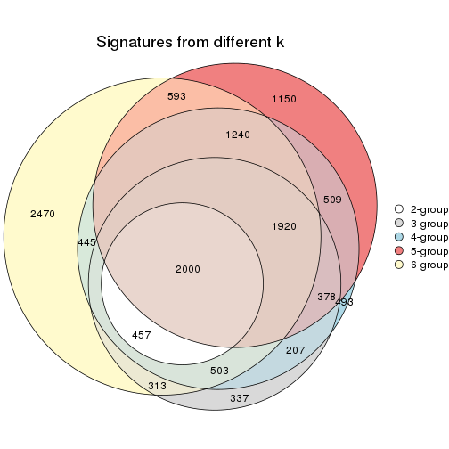

`get_signature()` returns a data frame invisibly. TO get the list of signatures, the function
call should be assigned to a variable explicitly. In following code, if `plot` argument is set
to `FALSE`, no heatmap is plotted while only the differential analysis is performed.

```r
# code only for demonstration
tb = get_signature(res, k = ..., plot = FALSE)
```

An example of the output of `tb` is:

```
#>   which_row         fdr    mean_1    mean_2 scaled_mean_1 scaled_mean_2 km
#> 1        38 0.042760348  8.373488  9.131774    -0.5533452     0.5164555  1
#> 2        40 0.018707592  7.106213  8.469186    -0.6173731     0.5762149  1
#> 3        55 0.019134737 10.221463 11.207825    -0.6159697     0.5749050  1
#> 4        59 0.006059896  5.921854  7.869574    -0.6899429     0.6439467  1
#> 5        60 0.018055526  8.928898 10.211722    -0.6204761     0.5791110  1
#> 6        98 0.009384629 15.714769 14.887706     0.6635654    -0.6193277  2
...
```

The columns in `tb` are:

1. `which_row`: row indices corresponding to the input matrix.
2. `fdr`: FDR for the differential test. 
3. `mean_x`: The mean value in group x.
4. `scaled_mean_x`: The mean value in group x after rows are scaled.
5. `km`: Row groups if k-means clustering is applied to rows.


UMAP plot which shows how samples are separated.


<script>
$( function() {
	$( '#tabs-SD-skmeans-dimension-reduction' ).tabs();
} );
</script>
<div id='tabs-SD-skmeans-dimension-reduction'>
<ul>
<li><a href='#tab-SD-skmeans-dimension-reduction-1'>k = 2</a></li>
<li><a href='#tab-SD-skmeans-dimension-reduction-2'>k = 3</a></li>
<li><a href='#tab-SD-skmeans-dimension-reduction-3'>k = 4</a></li>
<li><a href='#tab-SD-skmeans-dimension-reduction-4'>k = 5</a></li>
<li><a href='#tab-SD-skmeans-dimension-reduction-5'>k = 6</a></li>
</ul>
<div id='tab-SD-skmeans-dimension-reduction-1'>
<pre><code class="r">dimension_reduction(res, k = 2, method = &quot;UMAP&quot;)
</code></pre>

<p>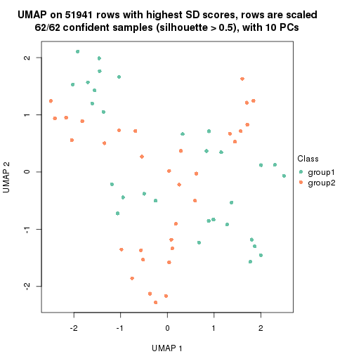</p>

</div>
<div id='tab-SD-skmeans-dimension-reduction-2'>
<pre><code class="r">dimension_reduction(res, k = 3, method = &quot;UMAP&quot;)
</code></pre>

<p>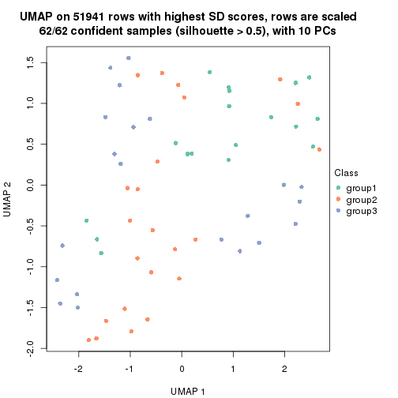</p>

</div>
<div id='tab-SD-skmeans-dimension-reduction-3'>
<pre><code class="r">dimension_reduction(res, k = 4, method = &quot;UMAP&quot;)
</code></pre>

<p>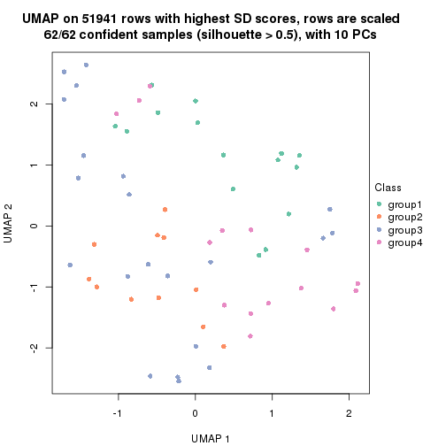</p>

</div>
<div id='tab-SD-skmeans-dimension-reduction-4'>
<pre><code class="r">dimension_reduction(res, k = 5, method = &quot;UMAP&quot;)
</code></pre>

<p>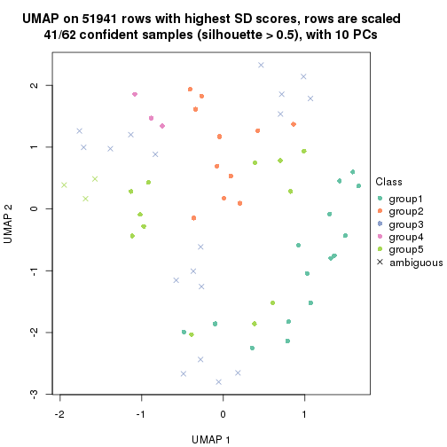</p>

</div>
<div id='tab-SD-skmeans-dimension-reduction-5'>
<pre><code class="r">dimension_reduction(res, k = 6, method = &quot;UMAP&quot;)
</code></pre>

<p>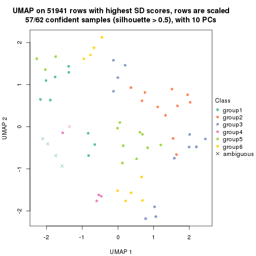</p>

</div>
</div>


Following heatmap shows how subgroups are split when increasing `k`:

```r
collect_classes(res)
```

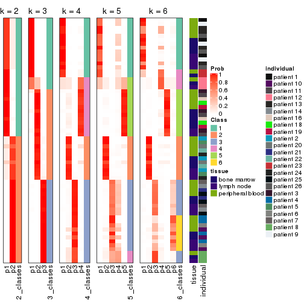


Test correlation between subgroups and known annotations. If the known
annotation is numeric, one-way ANOVA test is applied, and if the known
annotation is discrete, chi-squared contingency table test is applied.

```r
test_to_known_factors(res)
```

```
#>             n tissue(p) individual(p) k
#> SD:skmeans 62     0.579      1.95e-05 2
#> SD:skmeans 62     0.896      4.37e-09 3
#> SD:skmeans 62     0.962      1.10e-12 4
#> SD:skmeans 41     0.989      3.60e-09 5
#> SD:skmeans 57     0.996      1.82e-17 6
```


If matrix rows can be associated to genes, consider to use `functional_enrichment(res,
...)` to perform function enrichment for the signature genes. See [this vignette](http://bioconductor.org/packages/devel/bioc/vignettes/cola/inst/doc/functional_enrichment.html) for more detailed explanations.


 

---------------------------------------------------


### SD:pam*


The object with results only for a single top-value method and a single partition method 
can be extracted as:

```r
res = res_list["SD", "pam"]
# you can also extract it by
# res = res_list["SD:pam"]
```

A summary of `res` and all the functions that can be applied to it:

```r
res
```

```
#> A 'ConsensusPartition' object with k = 2, 3, 4, 5, 6.
#>   On a matrix with 51941 rows and 62 columns.
#>   Top rows (1000, 2000, 3000, 4000, 5000) are extracted by 'SD' method.
#>   Subgroups are detected by 'pam' method.
#>   Performed in total 1250 partitions by row resampling.
#>   Best k for subgroups seems to be 6.
#> 
#> Following methods can be applied to this 'ConsensusPartition' object:
#>  [1] "cola_report"             "collect_classes"         "collect_plots"          
#>  [4] "collect_stats"           "colnames"                "compare_signatures"     
#>  [7] "consensus_heatmap"       "dimension_reduction"     "functional_enrichment"  
#> [10] "get_anno_col"            "get_anno"                "get_classes"            
#> [13] "get_consensus"           "get_matrix"              "get_membership"         
#> [16] "get_param"               "get_signatures"          "get_stats"              
#> [19] "is_best_k"               "is_stable_k"             "membership_heatmap"     
#> [22] "ncol"                    "nrow"                    "plot_ecdf"              
#> [25] "rownames"                "select_partition_number" "show"                   
#> [28] "suggest_best_k"          "test_to_known_factors"
```

`collect_plots()` function collects all the plots made from `res` for all `k` (number of partitions)
into one single page to provide an easy and fast comparison between different `k`.

```r
collect_plots(res)
```

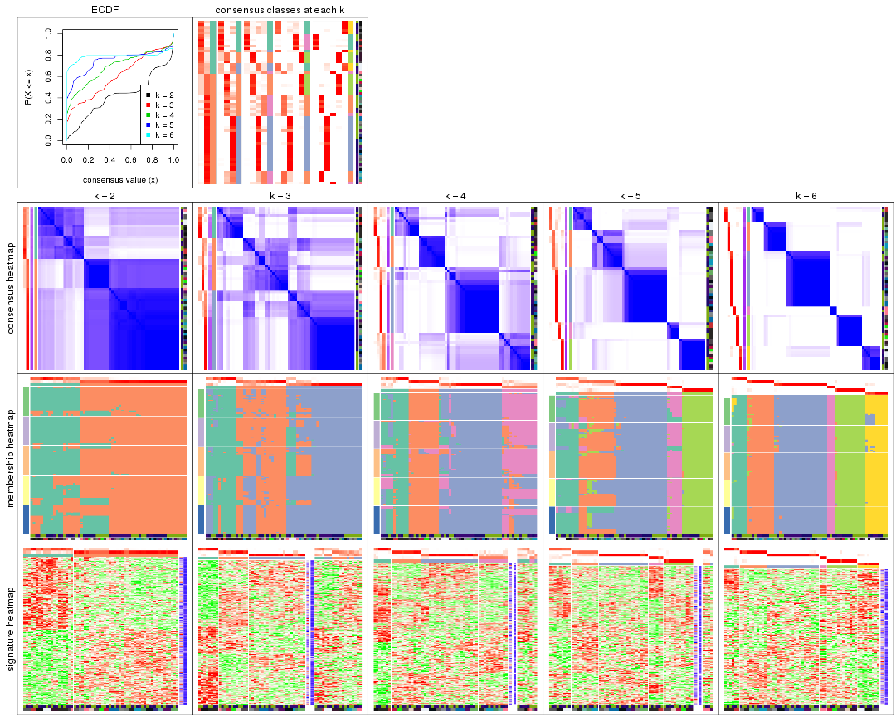

The plots are:

- The first row: a plot of the ECDF (empirical cumulative distribution
  function) curves of the consensus matrix for each `k` and the heatmap of
  predicted classes for each `k`.
- The second row: heatmaps of the consensus matrix for each `k`.
- The third row: heatmaps of the membership matrix for each `k`.
- The fouth row: heatmaps of the signatures for each `k`.

All the plots in panels can be made by individual functions and they are
plotted later in this section.

`select_partition_number()` produces several plots showing different
statistics for choosing "optimized" `k`. There are following statistics:

- ECDF curves of the consensus matrix for each `k`;
- 1-PAC. [The PAC
  score](https://en.wikipedia.org/wiki/Consensus_clustering#Over-interpretation_potential_of_consensus_clustering)
  measures the proportion of the ambiguous subgrouping.
- Mean silhouette score.
- Concordance. The mean probability of fiting the consensus class ids in all
  partitions.
- Area increased. Denote $A_k$ as the area under the ECDF curve for current
  `k`, the area increased is defined as $A_k - A_{k-1}$.
- Rand index. The percent of pairs of samples that are both in a same cluster
  or both are not in a same cluster in the partition of k and k-1.
- Jaccard index. The ratio of pairs of samples are both in a same cluster in
  the partition of k and k-1 and the pairs of samples are both in a same
  cluster in the partition k or k-1.

The detailed explanations of these statistics can be found in [the _cola_
vignette](http://bioconductor.org/packages/devel/bioc/vignettes/cola/inst/doc/cola.html#toc_13).

Generally speaking, lower PAC score, higher mean silhouette score or higher
concordance corresponds to better partition. Rand index and Jaccard index
measure how similar the current partition is compared to partition with `k-1`.
If they are too similar, we won't accept `k` is better than `k-1`.

```r
select_partition_number(res)
```

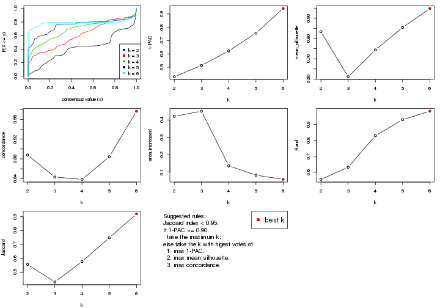

The numeric values for all these statistics can be obtained by `get_stats()`.

```r
get_stats(res)
```

```
#>   k 1-PAC mean_silhouette concordance area_increased  Rand Jaccard
#> 2 2 0.429           0.833       0.888         0.4207 0.556   0.556
#> 3 3 0.514           0.611       0.843         0.4502 0.632   0.429
#> 4 4 0.623           0.744       0.839         0.1357 0.829   0.577
#> 5 5 0.756           0.855       0.884         0.0819 0.929   0.748
#> 6 6 0.941           0.948       0.977         0.0577 0.983   0.921
```

`suggest_best_k()` suggests the best $k$ based on these statistics. The rules are as follows:

- All $k$ with Jaccard index larger than 0.95 are removed because increasing
  $k$ does not provide enough extra information. If all $k$ are removed, it is
  marked as no subgroup is detected.
- For all $k$ with 1-PAC score larger than 0.9, the maximal $k$ is taken as
  the best $k$, and other $k$ are marked as optional $k$.
- If it does not fit the second rule. The $k$ with the maximal vote of the
  highest 1-PAC score, highest mean silhouette, and highest concordance is
  taken as the best $k$.

```r
suggest_best_k(res)
```

```
#> [1] 6
```


Following shows the table of the partitions (You need to click the **show/hide
code output** link to see it). The membership matrix (columns with name `p*`)
is inferred by
[`clue::cl_consensus()`](https://www.rdocumentation.org/link/cl_consensus?package=clue)
function with the `SE` method. Basically the value in the membership matrix
represents the probability to belong to a certain group. The finall class
label for an item is determined with the group with highest probability it
belongs to.

In `get_classes()` function, the entropy is calculated from the membership
matrix and the silhouette score is calculated from the consensus matrix.


<script>
$( function() {
	$( '#tabs-SD-pam-get-classes' ).tabs();
} );
</script>
<div id='tabs-SD-pam-get-classes'>
<ul>
<li><a href='#tab-SD-pam-get-classes-1'>k = 2</a></li>
<li><a href='#tab-SD-pam-get-classes-2'>k = 3</a></li>
<li><a href='#tab-SD-pam-get-classes-3'>k = 4</a></li>
<li><a href='#tab-SD-pam-get-classes-4'>k = 5</a></li>
<li><a href='#tab-SD-pam-get-classes-5'>k = 6</a></li>
</ul>

<div id='tab-SD-pam-get-classes-1'>
<p><a id='tab-SD-pam-get-classes-1-a' style='color:#0366d6' href='#'>show/hide code output</a></p>
<pre><code class="r">cbind(get_classes(res, k = 2), get_membership(res, k = 2))
</code></pre>

<pre><code>#&gt;           class entropy silhouette    p1    p2
#&gt; GSM525314     1  0.7950      0.800 0.760 0.240
#&gt; GSM525315     2  0.1184      0.906 0.016 0.984
#&gt; GSM525316     1  0.4815      0.780 0.896 0.104
#&gt; GSM525317     2  0.0000      0.909 0.000 1.000
#&gt; GSM525318     2  0.0000      0.909 0.000 1.000
#&gt; GSM525319     2  0.0672      0.908 0.008 0.992
#&gt; GSM525320     2  0.0000      0.909 0.000 1.000
#&gt; GSM525321     2  0.0000      0.909 0.000 1.000
#&gt; GSM525322     2  0.0376      0.909 0.004 0.996
#&gt; GSM525323     1  0.9393      0.760 0.644 0.356
#&gt; GSM525324     2  0.0000      0.909 0.000 1.000
#&gt; GSM525325     2  0.7883      0.744 0.236 0.764
#&gt; GSM525326     2  0.6801      0.789 0.180 0.820
#&gt; GSM525327     1  0.6531      0.811 0.832 0.168
#&gt; GSM525328     1  0.4562      0.806 0.904 0.096
#&gt; GSM525329     2  0.0000      0.909 0.000 1.000
#&gt; GSM525330     2  0.7883      0.744 0.236 0.764
#&gt; GSM525331     2  0.7883      0.744 0.236 0.764
#&gt; GSM525332     2  0.7883      0.744 0.236 0.764
#&gt; GSM525333     2  0.7883      0.744 0.236 0.764
#&gt; GSM525334     2  0.0000      0.909 0.000 1.000
#&gt; GSM525335     2  0.1414      0.904 0.020 0.980
#&gt; GSM525336     1  0.0000      0.763 1.000 0.000
#&gt; GSM525337     2  0.1414      0.904 0.020 0.980
#&gt; GSM525338     2  0.0000      0.909 0.000 1.000
#&gt; GSM525339     1  0.9909      0.610 0.556 0.444
#&gt; GSM525340     1  0.2423      0.785 0.960 0.040
#&gt; GSM525341     2  0.0672      0.908 0.008 0.992
#&gt; GSM525342     1  0.5294      0.776 0.880 0.120
#&gt; GSM525343     2  0.0000      0.909 0.000 1.000
#&gt; GSM525344     2  0.0000      0.909 0.000 1.000
#&gt; GSM525345     1  0.9580      0.731 0.620 0.380
#&gt; GSM525346     2  0.0000      0.909 0.000 1.000
#&gt; GSM525347     2  0.7883      0.744 0.236 0.764
#&gt; GSM525348     2  0.3584      0.877 0.068 0.932
#&gt; GSM525349     1  0.2948      0.792 0.948 0.052
#&gt; GSM525350     2  0.7883      0.744 0.236 0.764
#&gt; GSM525351     2  0.7883      0.744 0.236 0.764
#&gt; GSM525352     2  0.7883      0.744 0.236 0.764
#&gt; GSM525353     2  0.7376      0.764 0.208 0.792
#&gt; GSM525354     2  0.0000      0.909 0.000 1.000
#&gt; GSM525355     2  0.0376      0.909 0.004 0.996
#&gt; GSM525356     1  0.1184      0.773 0.984 0.016
#&gt; GSM525357     2  0.0000      0.909 0.000 1.000
#&gt; GSM525358     1  0.9286      0.766 0.656 0.344
#&gt; GSM525359     1  0.7950      0.796 0.760 0.240
#&gt; GSM525360     2  0.0000      0.909 0.000 1.000
#&gt; GSM525361     1  0.5294      0.776 0.880 0.120
#&gt; GSM525362     2  0.0672      0.905 0.008 0.992
#&gt; GSM525363     2  0.0938      0.903 0.012 0.988
#&gt; GSM525364     2  0.1414      0.896 0.020 0.980
#&gt; GSM525365     2  0.1843      0.888 0.028 0.972
#&gt; GSM525366     2  0.0376      0.907 0.004 0.996
#&gt; GSM525367     1  0.9393      0.760 0.644 0.356
#&gt; GSM525368     2  0.2778      0.866 0.048 0.952
#&gt; GSM525369     1  0.6801      0.731 0.820 0.180
#&gt; GSM525370     1  0.9000      0.780 0.684 0.316
#&gt; GSM525371     1  0.7883      0.795 0.764 0.236
#&gt; GSM525372     2  0.0376      0.907 0.004 0.996
#&gt; GSM525373     2  0.1414      0.904 0.020 0.980
#&gt; GSM525374     2  0.0000      0.909 0.000 1.000
#&gt; GSM525375     1  0.9248      0.771 0.660 0.340
</code></pre>

<script>
$('#tab-SD-pam-get-classes-1-a').parent().next().next().hide();
$('#tab-SD-pam-get-classes-1-a').click(function(){
  $('#tab-SD-pam-get-classes-1-a').parent().next().next().toggle();
  return(false);
});
</script>
</div>

<div id='tab-SD-pam-get-classes-2'>
<p><a id='tab-SD-pam-get-classes-2-a' style='color:#0366d6' href='#'>show/hide code output</a></p>
<pre><code class="r">cbind(get_classes(res, k = 3), get_membership(res, k = 3))
</code></pre>

<pre><code>#&gt;           class entropy silhouette    p1    p2    p3
#&gt; GSM525314     1  0.3116    0.72495 0.892 0.000 0.108
#&gt; GSM525315     2  0.6045    0.31462 0.000 0.620 0.380
#&gt; GSM525316     2  0.6303    0.43800 0.248 0.720 0.032
#&gt; GSM525317     3  0.0000    0.84090 0.000 0.000 1.000
#&gt; GSM525318     3  0.0000    0.84090 0.000 0.000 1.000
#&gt; GSM525319     2  0.6302    0.00452 0.000 0.520 0.480
#&gt; GSM525320     3  0.0000    0.84090 0.000 0.000 1.000
#&gt; GSM525321     3  0.0000    0.84090 0.000 0.000 1.000
#&gt; GSM525322     3  0.1753    0.80071 0.000 0.048 0.952
#&gt; GSM525323     3  0.6416    0.29951 0.376 0.008 0.616
#&gt; GSM525324     3  0.5178    0.60612 0.000 0.256 0.744
#&gt; GSM525325     2  0.0000    0.68492 0.000 1.000 0.000
#&gt; GSM525326     2  0.5178    0.57702 0.000 0.744 0.256
#&gt; GSM525327     1  0.0000    0.75791 1.000 0.000 0.000
#&gt; GSM525328     1  0.0000    0.75791 1.000 0.000 0.000
#&gt; GSM525329     3  0.0000    0.84090 0.000 0.000 1.000
#&gt; GSM525330     2  0.0000    0.68492 0.000 1.000 0.000
#&gt; GSM525331     2  0.1289    0.68959 0.000 0.968 0.032
#&gt; GSM525332     2  0.5016    0.57548 0.000 0.760 0.240
#&gt; GSM525333     2  0.0424    0.68735 0.000 0.992 0.008
#&gt; GSM525334     3  0.0000    0.84090 0.000 0.000 1.000
#&gt; GSM525335     2  0.6295    0.03595 0.000 0.528 0.472
#&gt; GSM525336     1  0.1529    0.74102 0.960 0.040 0.000
#&gt; GSM525337     2  0.5905    0.37488 0.000 0.648 0.352
#&gt; GSM525338     3  0.0000    0.84090 0.000 0.000 1.000
#&gt; GSM525339     1  0.7585   -0.00778 0.484 0.040 0.476
#&gt; GSM525340     1  0.0592    0.75772 0.988 0.000 0.012
#&gt; GSM525341     3  0.6026    0.39470 0.000 0.376 0.624
#&gt; GSM525342     2  0.6303    0.43800 0.248 0.720 0.032
#&gt; GSM525343     3  0.0000    0.84090 0.000 0.000 1.000
#&gt; GSM525344     3  0.0000    0.84090 0.000 0.000 1.000
#&gt; GSM525345     3  0.5926    0.35884 0.356 0.000 0.644
#&gt; GSM525346     3  0.0000    0.84090 0.000 0.000 1.000
#&gt; GSM525347     2  0.2537    0.69046 0.000 0.920 0.080
#&gt; GSM525348     3  0.6359    0.31097 0.004 0.404 0.592
#&gt; GSM525349     1  0.0000    0.75791 1.000 0.000 0.000
#&gt; GSM525350     2  0.0000    0.68492 0.000 1.000 0.000
#&gt; GSM525351     2  0.2356    0.68360 0.000 0.928 0.072
#&gt; GSM525352     2  0.5881    0.54654 0.016 0.728 0.256
#&gt; GSM525353     2  0.4291    0.64203 0.000 0.820 0.180
#&gt; GSM525354     3  0.0000    0.84090 0.000 0.000 1.000
#&gt; GSM525355     3  0.5835    0.47651 0.000 0.340 0.660
#&gt; GSM525356     1  0.5431    0.49081 0.716 0.284 0.000
#&gt; GSM525357     3  0.0000    0.84090 0.000 0.000 1.000
#&gt; GSM525358     1  0.6888    0.17578 0.552 0.016 0.432
#&gt; GSM525359     1  0.4235    0.67530 0.824 0.000 0.176
#&gt; GSM525360     3  0.5431    0.57201 0.000 0.284 0.716
#&gt; GSM525361     2  0.6341    0.43278 0.252 0.716 0.032
#&gt; GSM525362     3  0.0000    0.84090 0.000 0.000 1.000
#&gt; GSM525363     3  0.5529    0.55732 0.000 0.296 0.704
#&gt; GSM525364     3  0.0000    0.84090 0.000 0.000 1.000
#&gt; GSM525365     3  0.0892    0.83073 0.020 0.000 0.980
#&gt; GSM525366     3  0.0000    0.84090 0.000 0.000 1.000
#&gt; GSM525367     3  0.6008    0.32204 0.372 0.000 0.628
#&gt; GSM525368     3  0.1163    0.82593 0.028 0.000 0.972
#&gt; GSM525369     2  0.1163    0.67750 0.028 0.972 0.000
#&gt; GSM525370     3  0.9203    0.17889 0.340 0.164 0.496
#&gt; GSM525371     1  0.0000    0.75791 1.000 0.000 0.000
#&gt; GSM525372     3  0.0000    0.84090 0.000 0.000 1.000
#&gt; GSM525373     2  0.6154    0.24149 0.000 0.592 0.408
#&gt; GSM525374     3  0.0000    0.84090 0.000 0.000 1.000
#&gt; GSM525375     1  0.5926    0.38906 0.644 0.000 0.356
</code></pre>

<script>
$('#tab-SD-pam-get-classes-2-a').parent().next().next().hide();
$('#tab-SD-pam-get-classes-2-a').click(function(){
  $('#tab-SD-pam-get-classes-2-a').parent().next().next().toggle();
  return(false);
});
</script>
</div>

<div id='tab-SD-pam-get-classes-3'>
<p><a id='tab-SD-pam-get-classes-3-a' style='color:#0366d6' href='#'>show/hide code output</a></p>
<pre><code class="r">cbind(get_classes(res, k = 4), get_membership(res, k = 4))
</code></pre>

<pre><code>#&gt;           class entropy silhouette    p1    p2    p3    p4
#&gt; GSM525314     1  0.7096      0.648 0.648 0.036 0.164 0.152
#&gt; GSM525315     4  0.6164      0.772 0.000 0.104 0.240 0.656
#&gt; GSM525316     2  0.0188      0.948 0.004 0.996 0.000 0.000
#&gt; GSM525317     3  0.0000      0.886 0.000 0.000 1.000 0.000
#&gt; GSM525318     3  0.0000      0.886 0.000 0.000 1.000 0.000
#&gt; GSM525319     4  0.5475      0.769 0.000 0.036 0.308 0.656
#&gt; GSM525320     3  0.0000      0.886 0.000 0.000 1.000 0.000
#&gt; GSM525321     3  0.0000      0.886 0.000 0.000 1.000 0.000
#&gt; GSM525322     3  0.3144      0.761 0.000 0.044 0.884 0.072
#&gt; GSM525323     3  0.6158      0.585 0.088 0.036 0.724 0.152
#&gt; GSM525324     3  0.4877     -0.232 0.000 0.000 0.592 0.408
#&gt; GSM525325     2  0.1211      0.961 0.000 0.960 0.000 0.040
#&gt; GSM525326     4  0.6298      0.455 0.000 0.268 0.100 0.632
#&gt; GSM525327     1  0.0000      0.741 1.000 0.000 0.000 0.000
#&gt; GSM525328     1  0.0000      0.741 1.000 0.000 0.000 0.000
#&gt; GSM525329     3  0.0000      0.886 0.000 0.000 1.000 0.000
#&gt; GSM525330     2  0.1211      0.961 0.000 0.960 0.000 0.040
#&gt; GSM525331     2  0.1356      0.962 0.000 0.960 0.008 0.032
#&gt; GSM525332     2  0.1211      0.943 0.000 0.960 0.040 0.000
#&gt; GSM525333     4  0.5070      0.372 0.000 0.372 0.008 0.620
#&gt; GSM525334     3  0.0000      0.886 0.000 0.000 1.000 0.000
#&gt; GSM525335     4  0.5193      0.761 0.000 0.020 0.324 0.656
#&gt; GSM525336     1  0.1867      0.705 0.928 0.072 0.000 0.000
#&gt; GSM525337     4  0.6220      0.774 0.000 0.104 0.248 0.648
#&gt; GSM525338     3  0.0000      0.886 0.000 0.000 1.000 0.000
#&gt; GSM525339     3  0.8899     -0.156 0.324 0.092 0.432 0.152
#&gt; GSM525340     1  0.4599      0.707 0.800 0.036 0.012 0.152
#&gt; GSM525341     4  0.4643      0.746 0.000 0.000 0.344 0.656
#&gt; GSM525342     2  0.0188      0.948 0.004 0.996 0.000 0.000
#&gt; GSM525343     3  0.0000      0.886 0.000 0.000 1.000 0.000
#&gt; GSM525344     3  0.2216      0.782 0.000 0.000 0.908 0.092
#&gt; GSM525345     3  0.6097      0.590 0.084 0.036 0.728 0.152
#&gt; GSM525346     3  0.0000      0.886 0.000 0.000 1.000 0.000
#&gt; GSM525347     2  0.3013      0.892 0.000 0.888 0.032 0.080
#&gt; GSM525348     4  0.6570      0.593 0.000 0.164 0.204 0.632
#&gt; GSM525349     1  0.0000      0.741 1.000 0.000 0.000 0.000
#&gt; GSM525350     2  0.1211      0.961 0.000 0.960 0.000 0.040
#&gt; GSM525351     2  0.1406      0.960 0.000 0.960 0.016 0.024
#&gt; GSM525352     2  0.1211      0.943 0.000 0.960 0.040 0.000
#&gt; GSM525353     4  0.5835      0.542 0.000 0.280 0.064 0.656
#&gt; GSM525354     3  0.0000      0.886 0.000 0.000 1.000 0.000
#&gt; GSM525355     4  0.4800      0.750 0.000 0.004 0.340 0.656
#&gt; GSM525356     1  0.4837      0.403 0.648 0.348 0.000 0.004
#&gt; GSM525357     3  0.0000      0.886 0.000 0.000 1.000 0.000
#&gt; GSM525358     1  0.8577      0.208 0.396 0.060 0.392 0.152
#&gt; GSM525359     1  0.7991      0.494 0.516 0.036 0.296 0.152
#&gt; GSM525360     4  0.4643      0.746 0.000 0.000 0.344 0.656
#&gt; GSM525361     2  0.0469      0.942 0.012 0.988 0.000 0.000
#&gt; GSM525362     3  0.0000      0.886 0.000 0.000 1.000 0.000
#&gt; GSM525363     4  0.4643      0.746 0.000 0.000 0.344 0.656
#&gt; GSM525364     3  0.0000      0.886 0.000 0.000 1.000 0.000
#&gt; GSM525365     3  0.0469      0.878 0.012 0.000 0.988 0.000
#&gt; GSM525366     3  0.0000      0.886 0.000 0.000 1.000 0.000
#&gt; GSM525367     3  0.6218      0.578 0.092 0.036 0.720 0.152
#&gt; GSM525368     3  0.0524      0.878 0.008 0.004 0.988 0.000
#&gt; GSM525369     2  0.1211      0.961 0.000 0.960 0.000 0.040
#&gt; GSM525370     4  0.7904      0.520 0.076 0.180 0.148 0.596
#&gt; GSM525371     1  0.0000      0.741 1.000 0.000 0.000 0.000
#&gt; GSM525372     3  0.0000      0.886 0.000 0.000 1.000 0.000
#&gt; GSM525373     4  0.5916      0.776 0.000 0.072 0.272 0.656
#&gt; GSM525374     3  0.0000      0.886 0.000 0.000 1.000 0.000
#&gt; GSM525375     1  0.8036      0.429 0.504 0.036 0.308 0.152
</code></pre>

<script>
$('#tab-SD-pam-get-classes-3-a').parent().next().next().hide();
$('#tab-SD-pam-get-classes-3-a').click(function(){
  $('#tab-SD-pam-get-classes-3-a').parent().next().next().toggle();
  return(false);
});
</script>
</div>

<div id='tab-SD-pam-get-classes-4'>
<p><a id='tab-SD-pam-get-classes-4-a' style='color:#0366d6' href='#'>show/hide code output</a></p>
<pre><code class="r">cbind(get_classes(res, k = 5), get_membership(res, k = 5))
</code></pre>

<pre><code>#&gt;           class entropy silhouette    p1    p2    p3    p4    p5
#&gt; GSM525314     1  0.3806      0.809 0.812 0.000 0.084 0.104 0.000
#&gt; GSM525315     2  0.4466      0.791 0.000 0.748 0.176 0.000 0.076
#&gt; GSM525316     5  0.0000      0.989 0.000 0.000 0.000 0.000 1.000
#&gt; GSM525317     3  0.0000      0.961 0.000 0.000 1.000 0.000 0.000
#&gt; GSM525318     3  0.0000      0.961 0.000 0.000 1.000 0.000 0.000
#&gt; GSM525319     2  0.3942      0.803 0.000 0.748 0.232 0.000 0.020
#&gt; GSM525320     3  0.0000      0.961 0.000 0.000 1.000 0.000 0.000
#&gt; GSM525321     3  0.0162      0.958 0.000 0.004 0.996 0.000 0.000
#&gt; GSM525322     3  0.1893      0.883 0.000 0.048 0.928 0.000 0.024
#&gt; GSM525323     1  0.3561      0.780 0.740 0.000 0.260 0.000 0.000
#&gt; GSM525324     3  0.4256     -0.159 0.000 0.436 0.564 0.000 0.000
#&gt; GSM525325     5  0.0000      0.989 0.000 0.000 0.000 0.000 1.000
#&gt; GSM525326     2  0.5386      0.466 0.188 0.704 0.012 0.008 0.088
#&gt; GSM525327     4  0.0290      0.939 0.008 0.000 0.000 0.992 0.000
#&gt; GSM525328     4  0.0290      0.939 0.008 0.000 0.000 0.992 0.000
#&gt; GSM525329     3  0.0000      0.961 0.000 0.000 1.000 0.000 0.000
#&gt; GSM525330     5  0.0000      0.989 0.000 0.000 0.000 0.000 1.000
#&gt; GSM525331     5  0.0000      0.989 0.000 0.000 0.000 0.000 1.000
#&gt; GSM525332     5  0.0000      0.989 0.000 0.000 0.000 0.000 1.000
#&gt; GSM525333     2  0.4025      0.567 0.000 0.700 0.008 0.000 0.292
#&gt; GSM525334     3  0.0000      0.961 0.000 0.000 1.000 0.000 0.000
#&gt; GSM525335     2  0.3807      0.800 0.000 0.748 0.240 0.000 0.012
#&gt; GSM525336     4  0.1579      0.912 0.032 0.000 0.000 0.944 0.024
#&gt; GSM525337     2  0.4901      0.784 0.000 0.712 0.184 0.000 0.104
#&gt; GSM525338     3  0.0000      0.961 0.000 0.000 1.000 0.000 0.000
#&gt; GSM525339     1  0.4264      0.793 0.812 0.000 0.056 0.080 0.052
#&gt; GSM525340     1  0.3003      0.718 0.812 0.000 0.000 0.188 0.000
#&gt; GSM525341     2  0.3508      0.793 0.000 0.748 0.252 0.000 0.000
#&gt; GSM525342     5  0.0000      0.989 0.000 0.000 0.000 0.000 1.000
#&gt; GSM525343     3  0.0000      0.961 0.000 0.000 1.000 0.000 0.000
#&gt; GSM525344     3  0.1608      0.878 0.000 0.072 0.928 0.000 0.000
#&gt; GSM525345     1  0.3480      0.793 0.752 0.000 0.248 0.000 0.000
#&gt; GSM525346     3  0.0000      0.961 0.000 0.000 1.000 0.000 0.000
#&gt; GSM525347     5  0.2426      0.876 0.000 0.064 0.036 0.000 0.900
#&gt; GSM525348     2  0.5584      0.484 0.188 0.704 0.044 0.008 0.056
#&gt; GSM525349     4  0.0290      0.939 0.008 0.000 0.000 0.992 0.000
#&gt; GSM525350     5  0.0000      0.989 0.000 0.000 0.000 0.000 1.000
#&gt; GSM525351     5  0.0000      0.989 0.000 0.000 0.000 0.000 1.000
#&gt; GSM525352     5  0.0000      0.989 0.000 0.000 0.000 0.000 1.000
#&gt; GSM525353     2  0.4305      0.678 0.000 0.748 0.052 0.000 0.200
#&gt; GSM525354     3  0.0000      0.961 0.000 0.000 1.000 0.000 0.000
#&gt; GSM525355     2  0.3508      0.793 0.000 0.748 0.252 0.000 0.000
#&gt; GSM525356     4  0.4482      0.733 0.088 0.000 0.000 0.752 0.160
#&gt; GSM525357     3  0.0000      0.961 0.000 0.000 1.000 0.000 0.000
#&gt; GSM525358     1  0.3714      0.800 0.812 0.000 0.056 0.132 0.000
#&gt; GSM525359     1  0.4234      0.807 0.760 0.000 0.184 0.056 0.000
#&gt; GSM525360     2  0.3508      0.793 0.000 0.748 0.252 0.000 0.000
#&gt; GSM525361     5  0.0000      0.989 0.000 0.000 0.000 0.000 1.000
#&gt; GSM525362     3  0.0000      0.961 0.000 0.000 1.000 0.000 0.000
#&gt; GSM525363     2  0.3508      0.793 0.000 0.748 0.252 0.000 0.000
#&gt; GSM525364     3  0.0000      0.961 0.000 0.000 1.000 0.000 0.000
#&gt; GSM525365     3  0.0162      0.957 0.004 0.000 0.996 0.000 0.000
#&gt; GSM525366     3  0.0000      0.961 0.000 0.000 1.000 0.000 0.000
#&gt; GSM525367     1  0.3452      0.796 0.756 0.000 0.244 0.000 0.000
#&gt; GSM525368     3  0.0000      0.961 0.000 0.000 1.000 0.000 0.000
#&gt; GSM525369     5  0.0000      0.989 0.000 0.000 0.000 0.000 1.000
#&gt; GSM525370     2  0.5519      0.482 0.196 0.704 0.044 0.008 0.048
#&gt; GSM525371     4  0.0290      0.939 0.008 0.000 0.000 0.992 0.000
#&gt; GSM525372     3  0.0000      0.961 0.000 0.000 1.000 0.000 0.000
#&gt; GSM525373     2  0.4233      0.802 0.000 0.748 0.208 0.000 0.044
#&gt; GSM525374     3  0.0000      0.961 0.000 0.000 1.000 0.000 0.000
#&gt; GSM525375     1  0.3714      0.800 0.812 0.000 0.056 0.132 0.000
</code></pre>

<script>
$('#tab-SD-pam-get-classes-4-a').parent().next().next().hide();
$('#tab-SD-pam-get-classes-4-a').click(function(){
  $('#tab-SD-pam-get-classes-4-a').parent().next().next().toggle();
  return(false);
});
</script>
</div>

<div id='tab-SD-pam-get-classes-5'>
<p><a id='tab-SD-pam-get-classes-5-a' style='color:#0366d6' href='#'>show/hide code output</a></p>
<pre><code class="r">cbind(get_classes(res, k = 6), get_membership(res, k = 6))
</code></pre>

<pre><code>#&gt;           class entropy silhouette    p1    p2    p3    p4    p5    p6
#&gt; GSM525314     6  0.0000      0.909 0.000 0.000 0.000 0.000 0.000 1.000
#&gt; GSM525315     2  0.0000      0.968 0.000 1.000 0.000 0.000 0.000 0.000
#&gt; GSM525316     5  0.0000      0.984 0.000 0.000 0.000 0.000 1.000 0.000
#&gt; GSM525317     3  0.0000      0.986 0.000 0.000 1.000 0.000 0.000 0.000
#&gt; GSM525318     3  0.0000      0.986 0.000 0.000 1.000 0.000 0.000 0.000
#&gt; GSM525319     2  0.0000      0.968 0.000 1.000 0.000 0.000 0.000 0.000
#&gt; GSM525320     3  0.0000      0.986 0.000 0.000 1.000 0.000 0.000 0.000
#&gt; GSM525321     3  0.0146      0.982 0.000 0.004 0.996 0.000 0.000 0.000
#&gt; GSM525322     3  0.2119      0.894 0.000 0.060 0.904 0.000 0.036 0.000
#&gt; GSM525323     6  0.2562      0.788 0.000 0.000 0.172 0.000 0.000 0.828
#&gt; GSM525324     3  0.1152      0.941 0.000 0.044 0.952 0.000 0.004 0.000
#&gt; GSM525325     5  0.0000      0.984 0.000 0.000 0.000 0.000 1.000 0.000
#&gt; GSM525326     4  0.0000      1.000 0.000 0.000 0.000 1.000 0.000 0.000
#&gt; GSM525327     1  0.0000      0.931 1.000 0.000 0.000 0.000 0.000 0.000
#&gt; GSM525328     1  0.0000      0.931 1.000 0.000 0.000 0.000 0.000 0.000
#&gt; GSM525329     3  0.0000      0.986 0.000 0.000 1.000 0.000 0.000 0.000
#&gt; GSM525330     5  0.0000      0.984 0.000 0.000 0.000 0.000 1.000 0.000
#&gt; GSM525331     5  0.0000      0.984 0.000 0.000 0.000 0.000 1.000 0.000
#&gt; GSM525332     5  0.0000      0.984 0.000 0.000 0.000 0.000 1.000 0.000
#&gt; GSM525333     2  0.2178      0.833 0.000 0.868 0.000 0.000 0.132 0.000
#&gt; GSM525334     3  0.0000      0.986 0.000 0.000 1.000 0.000 0.000 0.000
#&gt; GSM525335     2  0.0146      0.964 0.000 0.996 0.004 0.000 0.000 0.000
#&gt; GSM525336     1  0.1616      0.895 0.932 0.000 0.000 0.000 0.020 0.048
#&gt; GSM525337     2  0.2480      0.850 0.000 0.872 0.024 0.000 0.104 0.000
#&gt; GSM525338     3  0.0000      0.986 0.000 0.000 1.000 0.000 0.000 0.000
#&gt; GSM525339     6  0.0000      0.909 0.000 0.000 0.000 0.000 0.000 1.000
#&gt; GSM525340     6  0.0000      0.909 0.000 0.000 0.000 0.000 0.000 1.000
#&gt; GSM525341     2  0.0000      0.968 0.000 1.000 0.000 0.000 0.000 0.000
#&gt; GSM525342     5  0.0000      0.984 0.000 0.000 0.000 0.000 1.000 0.000
#&gt; GSM525343     3  0.0000      0.986 0.000 0.000 1.000 0.000 0.000 0.000
#&gt; GSM525344     3  0.1910      0.872 0.000 0.108 0.892 0.000 0.000 0.000
#&gt; GSM525345     6  0.2003      0.863 0.000 0.000 0.116 0.000 0.000 0.884
#&gt; GSM525346     3  0.0000      0.986 0.000 0.000 1.000 0.000 0.000 0.000
#&gt; GSM525347     5  0.2572      0.810 0.000 0.136 0.012 0.000 0.852 0.000
#&gt; GSM525348     4  0.0000      1.000 0.000 0.000 0.000 1.000 0.000 0.000
#&gt; GSM525349     1  0.0000      0.931 1.000 0.000 0.000 0.000 0.000 0.000
#&gt; GSM525350     5  0.0000      0.984 0.000 0.000 0.000 0.000 1.000 0.000
#&gt; GSM525351     5  0.0000      0.984 0.000 0.000 0.000 0.000 1.000 0.000
#&gt; GSM525352     5  0.0000      0.984 0.000 0.000 0.000 0.000 1.000 0.000
#&gt; GSM525353     2  0.0000      0.968 0.000 1.000 0.000 0.000 0.000 0.000
#&gt; GSM525354     3  0.0000      0.986 0.000 0.000 1.000 0.000 0.000 0.000
#&gt; GSM525355     2  0.0000      0.968 0.000 1.000 0.000 0.000 0.000 0.000
#&gt; GSM525356     1  0.4460      0.720 0.752 0.000 0.000 0.028 0.120 0.100
#&gt; GSM525357     3  0.0000      0.986 0.000 0.000 1.000 0.000 0.000 0.000
#&gt; GSM525358     6  0.0000      0.909 0.000 0.000 0.000 0.000 0.000 1.000
#&gt; GSM525359     6  0.1501      0.891 0.000 0.000 0.076 0.000 0.000 0.924
#&gt; GSM525360     2  0.0000      0.968 0.000 1.000 0.000 0.000 0.000 0.000
#&gt; GSM525361     5  0.0000      0.984 0.000 0.000 0.000 0.000 1.000 0.000
#&gt; GSM525362     3  0.0000      0.986 0.000 0.000 1.000 0.000 0.000 0.000
#&gt; GSM525363     2  0.0000      0.968 0.000 1.000 0.000 0.000 0.000 0.000
#&gt; GSM525364     3  0.0000      0.986 0.000 0.000 1.000 0.000 0.000 0.000
#&gt; GSM525365     3  0.0000      0.986 0.000 0.000 1.000 0.000 0.000 0.000
#&gt; GSM525366     3  0.0000      0.986 0.000 0.000 1.000 0.000 0.000 0.000
#&gt; GSM525367     6  0.1814      0.878 0.000 0.000 0.100 0.000 0.000 0.900
#&gt; GSM525368     3  0.0000      0.986 0.000 0.000 1.000 0.000 0.000 0.000
#&gt; GSM525369     5  0.0000      0.984 0.000 0.000 0.000 0.000 1.000 0.000
#&gt; GSM525370     4  0.0000      1.000 0.000 0.000 0.000 1.000 0.000 0.000
#&gt; GSM525371     1  0.0000      0.931 1.000 0.000 0.000 0.000 0.000 0.000
#&gt; GSM525372     3  0.0000      0.986 0.000 0.000 1.000 0.000 0.000 0.000
#&gt; GSM525373     2  0.0146      0.965 0.000 0.996 0.000 0.000 0.004 0.000
#&gt; GSM525374     3  0.0000      0.986 0.000 0.000 1.000 0.000 0.000 0.000
#&gt; GSM525375     6  0.0000      0.909 0.000 0.000 0.000 0.000 0.000 1.000
</code></pre>

<script>
$('#tab-SD-pam-get-classes-5-a').parent().next().next().hide();
$('#tab-SD-pam-get-classes-5-a').click(function(){
  $('#tab-SD-pam-get-classes-5-a').parent().next().next().toggle();
  return(false);
});
</script>
</div>
</div>

Heatmaps for the consensus matrix. It visualizes the probability of two
samples to be in a same group.


<script>
$( function() {
	$( '#tabs-SD-pam-consensus-heatmap' ).tabs();
} );
</script>
<div id='tabs-SD-pam-consensus-heatmap'>
<ul>
<li><a href='#tab-SD-pam-consensus-heatmap-1'>k = 2</a></li>
<li><a href='#tab-SD-pam-consensus-heatmap-2'>k = 3</a></li>
<li><a href='#tab-SD-pam-consensus-heatmap-3'>k = 4</a></li>
<li><a href='#tab-SD-pam-consensus-heatmap-4'>k = 5</a></li>
<li><a href='#tab-SD-pam-consensus-heatmap-5'>k = 6</a></li>
</ul>
<div id='tab-SD-pam-consensus-heatmap-1'>
<pre><code class="r">consensus_heatmap(res, k = 2)
</code></pre>

<p>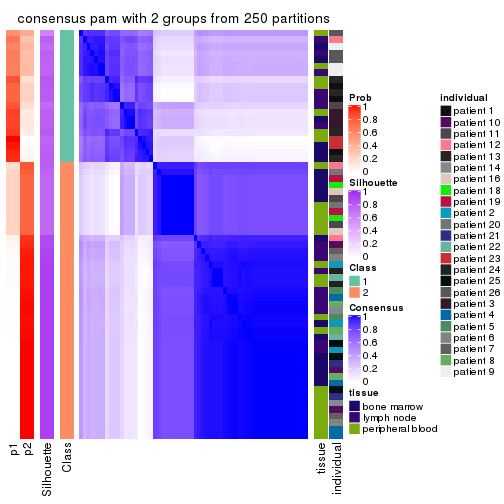</p>

</div>
<div id='tab-SD-pam-consensus-heatmap-2'>
<pre><code class="r">consensus_heatmap(res, k = 3)
</code></pre>

<p>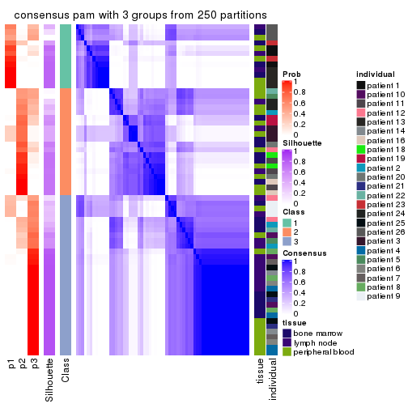</p>

</div>
<div id='tab-SD-pam-consensus-heatmap-3'>
<pre><code class="r">consensus_heatmap(res, k = 4)
</code></pre>

<p>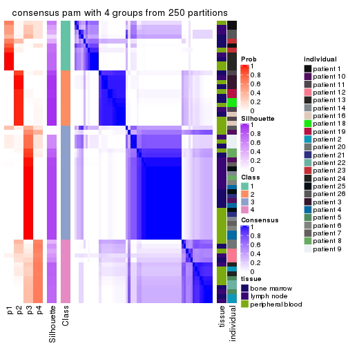</p>

</div>
<div id='tab-SD-pam-consensus-heatmap-4'>
<pre><code class="r">consensus_heatmap(res, k = 5)
</code></pre>

<p>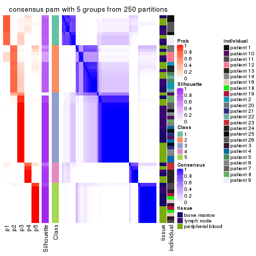</p>

</div>
<div id='tab-SD-pam-consensus-heatmap-5'>
<pre><code class="r">consensus_heatmap(res, k = 6)
</code></pre>

<p>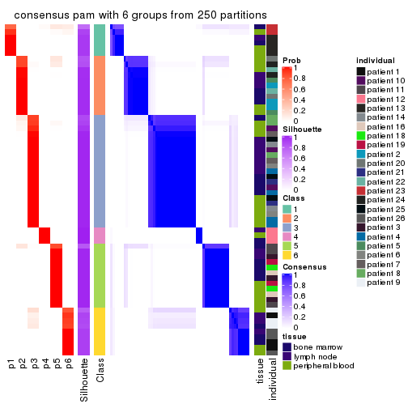</p>

</div>
</div>

Heatmaps for the membership of samples in all partitions to see how consistent they are:


<script>
$( function() {
	$( '#tabs-SD-pam-membership-heatmap' ).tabs();
} );
</script>
<div id='tabs-SD-pam-membership-heatmap'>
<ul>
<li><a href='#tab-SD-pam-membership-heatmap-1'>k = 2</a></li>
<li><a href='#tab-SD-pam-membership-heatmap-2'>k = 3</a></li>
<li><a href='#tab-SD-pam-membership-heatmap-3'>k = 4</a></li>
<li><a href='#tab-SD-pam-membership-heatmap-4'>k = 5</a></li>
<li><a href='#tab-SD-pam-membership-heatmap-5'>k = 6</a></li>
</ul>
<div id='tab-SD-pam-membership-heatmap-1'>
<pre><code class="r">membership_heatmap(res, k = 2)
</code></pre>

<p>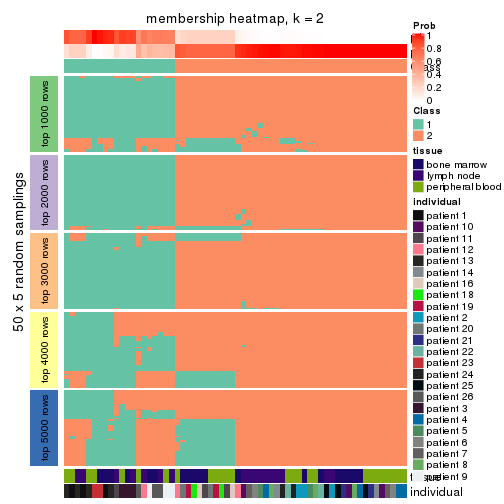</p>

</div>
<div id='tab-SD-pam-membership-heatmap-2'>
<pre><code class="r">membership_heatmap(res, k = 3)
</code></pre>

<p>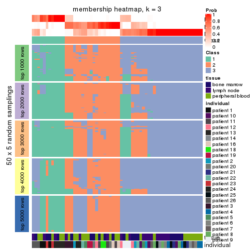</p>

</div>
<div id='tab-SD-pam-membership-heatmap-3'>
<pre><code class="r">membership_heatmap(res, k = 4)
</code></pre>

<p>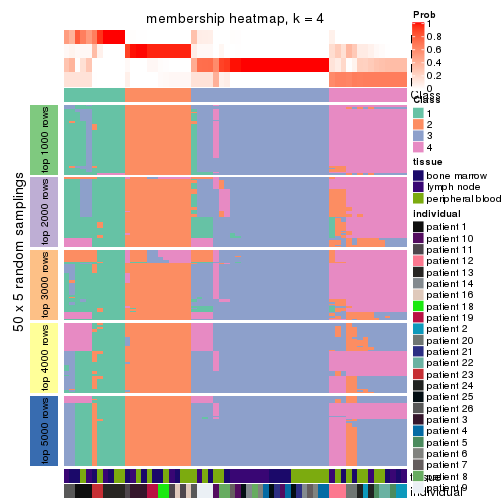</p>

</div>
<div id='tab-SD-pam-membership-heatmap-4'>
<pre><code class="r">membership_heatmap(res, k = 5)
</code></pre>

<p>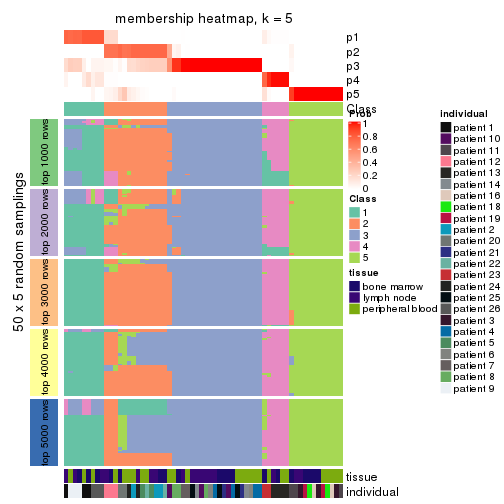</p>

</div>
<div id='tab-SD-pam-membership-heatmap-5'>
<pre><code class="r">membership_heatmap(res, k = 6)
</code></pre>

<p>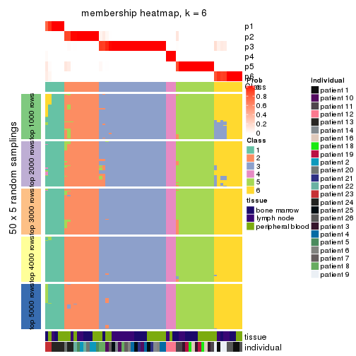</p>

</div>
</div>

As soon as we have had the classes for columns, we can look for signatures
which are significantly different between classes which can be candidate marks
for certain classes. Following are the heatmaps for signatures.


Signature heatmaps where rows are scaled:


<script>
$( function() {
	$( '#tabs-SD-pam-get-signatures' ).tabs();
} );
</script>
<div id='tabs-SD-pam-get-signatures'>
<ul>
<li><a href='#tab-SD-pam-get-signatures-1'>k = 2</a></li>
<li><a href='#tab-SD-pam-get-signatures-2'>k = 3</a></li>
<li><a href='#tab-SD-pam-get-signatures-3'>k = 4</a></li>
<li><a href='#tab-SD-pam-get-signatures-4'>k = 5</a></li>
<li><a href='#tab-SD-pam-get-signatures-5'>k = 6</a></li>
</ul>
<div id='tab-SD-pam-get-signatures-1'>
<pre><code class="r">get_signatures(res, k = 2)
</code></pre>

<p>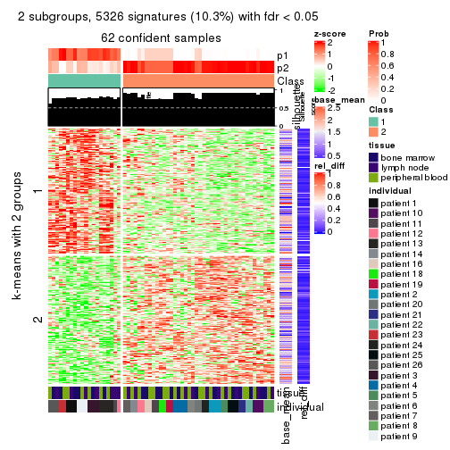</p>

</div>
<div id='tab-SD-pam-get-signatures-2'>
<pre><code class="r">get_signatures(res, k = 3)
</code></pre>

<p>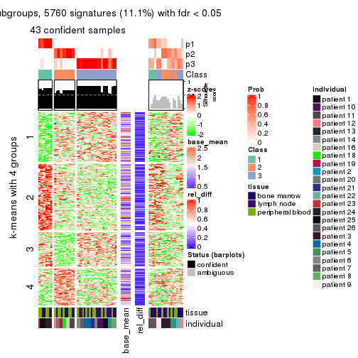</p>

</div>
<div id='tab-SD-pam-get-signatures-3'>
<pre><code class="r">get_signatures(res, k = 4)
</code></pre>

<p>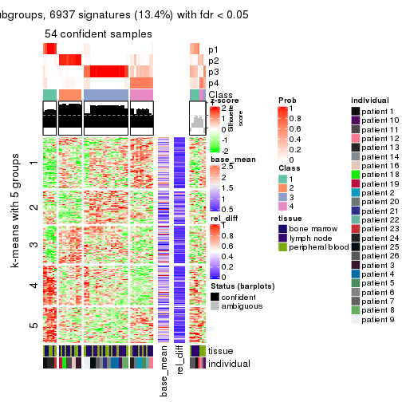</p>

</div>
<div id='tab-SD-pam-get-signatures-4'>
<pre><code class="r">get_signatures(res, k = 5)
</code></pre>

<p>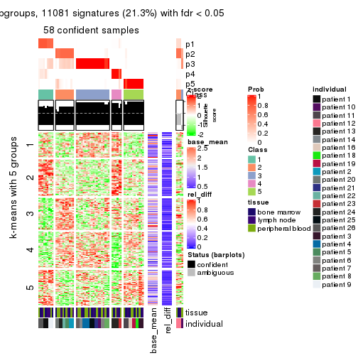</p>

</div>
<div id='tab-SD-pam-get-signatures-5'>
<pre><code class="r">get_signatures(res, k = 6)
</code></pre>

<p>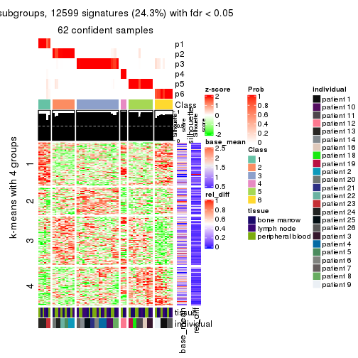</p>

</div>
</div>


Signature heatmaps where rows are not scaled:


<script>
$( function() {
	$( '#tabs-SD-pam-get-signatures-no-scale' ).tabs();
} );
</script>
<div id='tabs-SD-pam-get-signatures-no-scale'>
<ul>
<li><a href='#tab-SD-pam-get-signatures-no-scale-1'>k = 2</a></li>
<li><a href='#tab-SD-pam-get-signatures-no-scale-2'>k = 3</a></li>
<li><a href='#tab-SD-pam-get-signatures-no-scale-3'>k = 4</a></li>
<li><a href='#tab-SD-pam-get-signatures-no-scale-4'>k = 5</a></li>
<li><a href='#tab-SD-pam-get-signatures-no-scale-5'>k = 6</a></li>
</ul>
<div id='tab-SD-pam-get-signatures-no-scale-1'>
<pre><code class="r">get_signatures(res, k = 2, scale_rows = FALSE)
</code></pre>

<p>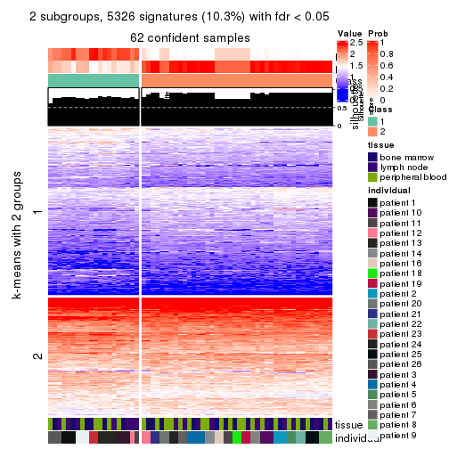</p>

</div>
<div id='tab-SD-pam-get-signatures-no-scale-2'>
<pre><code class="r">get_signatures(res, k = 3, scale_rows = FALSE)
</code></pre>

<p>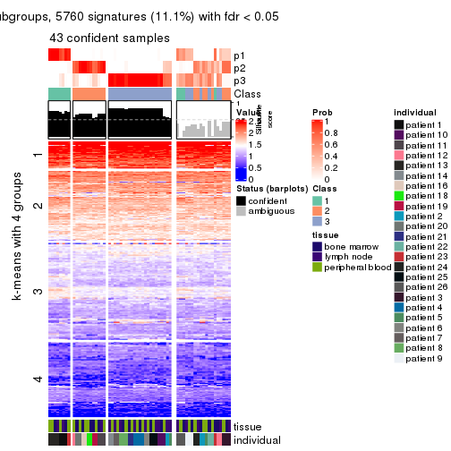</p>

</div>
<div id='tab-SD-pam-get-signatures-no-scale-3'>
<pre><code class="r">get_signatures(res, k = 4, scale_rows = FALSE)
</code></pre>

<p>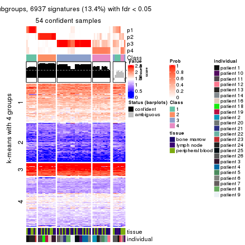</p>

</div>
<div id='tab-SD-pam-get-signatures-no-scale-4'>
<pre><code class="r">get_signatures(res, k = 5, scale_rows = FALSE)
</code></pre>

<p>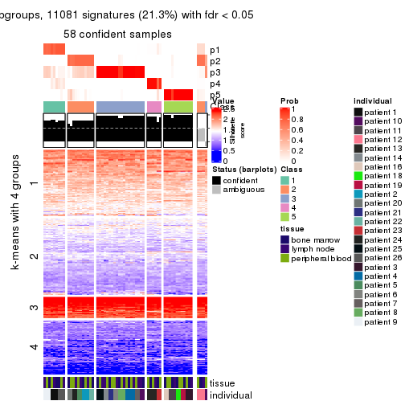</p>

</div>
<div id='tab-SD-pam-get-signatures-no-scale-5'>
<pre><code class="r">get_signatures(res, k = 6, scale_rows = FALSE)
</code></pre>

<p>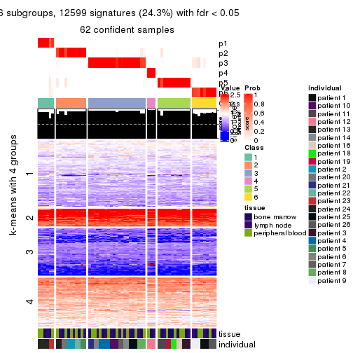</p>

</div>
</div>


Compare the overlap of signatures from different k:

```r
compare_signatures(res)
```

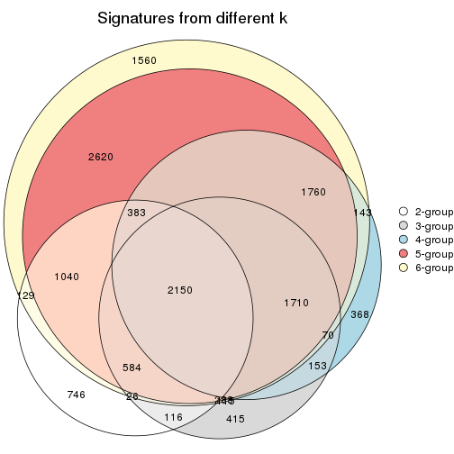

`get_signature()` returns a data frame invisibly. TO get the list of signatures, the function
call should be assigned to a variable explicitly. In following code, if `plot` argument is set
to `FALSE`, no heatmap is plotted while only the differential analysis is performed.

```r
# code only for demonstration
tb = get_signature(res, k = ..., plot = FALSE)
```

An example of the output of `tb` is:

```
#>   which_row         fdr    mean_1    mean_2 scaled_mean_1 scaled_mean_2 km
#> 1        38 0.042760348  8.373488  9.131774    -0.5533452     0.5164555  1
#> 2        40 0.018707592  7.106213  8.469186    -0.6173731     0.5762149  1
#> 3        55 0.019134737 10.221463 11.207825    -0.6159697     0.5749050  1
#> 4        59 0.006059896  5.921854  7.869574    -0.6899429     0.6439467  1
#> 5        60 0.018055526  8.928898 10.211722    -0.6204761     0.5791110  1
#> 6        98 0.009384629 15.714769 14.887706     0.6635654    -0.6193277  2
...
```

The columns in `tb` are:

1. `which_row`: row indices corresponding to the input matrix.
2. `fdr`: FDR for the differential test. 
3. `mean_x`: The mean value in group x.
4. `scaled_mean_x`: The mean value in group x after rows are scaled.
5. `km`: Row groups if k-means clustering is applied to rows.


UMAP plot which shows how samples are separated.


<script>
$( function() {
	$( '#tabs-SD-pam-dimension-reduction' ).tabs();
} );
</script>
<div id='tabs-SD-pam-dimension-reduction'>
<ul>
<li><a href='#tab-SD-pam-dimension-reduction-1'>k = 2</a></li>
<li><a href='#tab-SD-pam-dimension-reduction-2'>k = 3</a></li>
<li><a href='#tab-SD-pam-dimension-reduction-3'>k = 4</a></li>
<li><a href='#tab-SD-pam-dimension-reduction-4'>k = 5</a></li>
<li><a href='#tab-SD-pam-dimension-reduction-5'>k = 6</a></li>
</ul>
<div id='tab-SD-pam-dimension-reduction-1'>
<pre><code class="r">dimension_reduction(res, k = 2, method = &quot;UMAP&quot;)
</code></pre>

<p>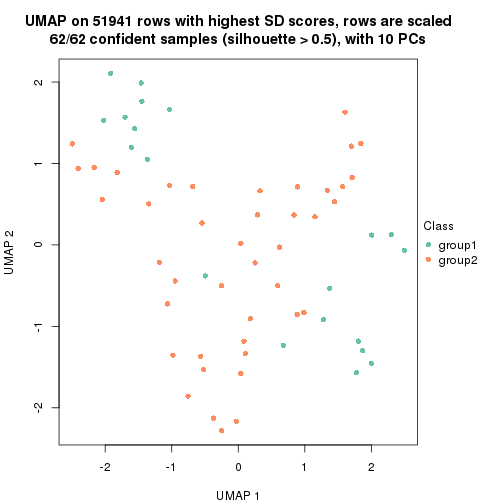</p>

</div>
<div id='tab-SD-pam-dimension-reduction-2'>
<pre><code class="r">dimension_reduction(res, k = 3, method = &quot;UMAP&quot;)
</code></pre>

<p>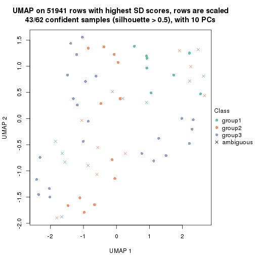</p>

</div>
<div id='tab-SD-pam-dimension-reduction-3'>
<pre><code class="r">dimension_reduction(res, k = 4, method = &quot;UMAP&quot;)
</code></pre>

<p>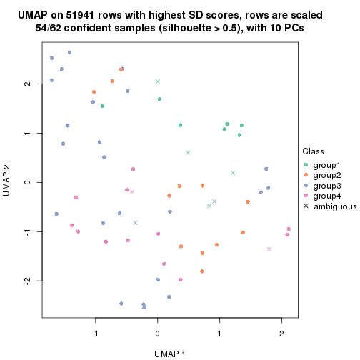</p>

</div>
<div id='tab-SD-pam-dimension-reduction-4'>
<pre><code class="r">dimension_reduction(res, k = 5, method = &quot;UMAP&quot;)
</code></pre>

<p>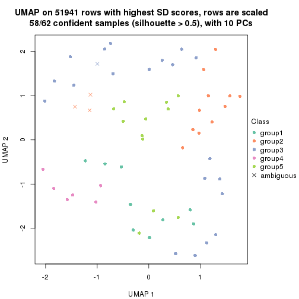</p>

</div>
<div id='tab-SD-pam-dimension-reduction-5'>
<pre><code class="r">dimension_reduction(res, k = 6, method = &quot;UMAP&quot;)
</code></pre>

<p>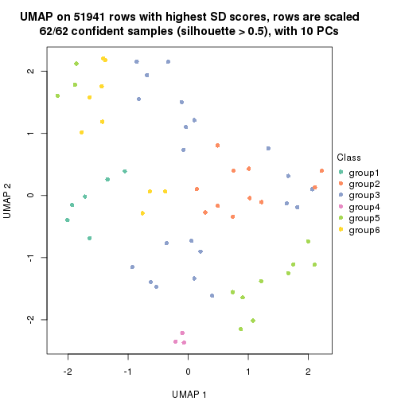</p>

</div>
</div>


Following heatmap shows how subgroups are split when increasing `k`:

```r
collect_classes(res)
```

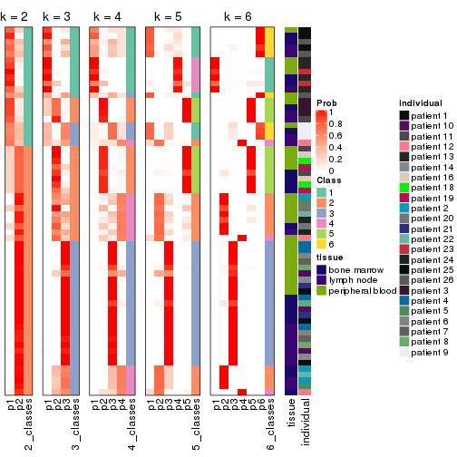


Test correlation between subgroups and known annotations. If the known
annotation is numeric, one-way ANOVA test is applied, and if the known
annotation is discrete, chi-squared contingency table test is applied.

```r
test_to_known_factors(res)
```

```
#>         n tissue(p) individual(p) k
#> SD:pam 62     0.618      1.46e-04 2
#> SD:pam 43     0.386      5.65e-06 3
#> SD:pam 54     0.832      4.86e-10 4
#> SD:pam 58     0.969      6.46e-15 5
#> SD:pam 62     0.992      8.01e-20 6
```


If matrix rows can be associated to genes, consider to use `functional_enrichment(res,
...)` to perform function enrichment for the signature genes. See [this vignette](http://bioconductor.org/packages/devel/bioc/vignettes/cola/inst/doc/functional_enrichment.html) for more detailed explanations.


 

---------------------------------------------------


### SD:mclust


The object with results only for a single top-value method and a single partition method 
can be extracted as:

```r
res = res_list["SD", "mclust"]
# you can also extract it by
# res = res_list["SD:mclust"]
```

A summary of `res` and all the functions that can be applied to it:

```r
res
```

```
#> A 'ConsensusPartition' object with k = 2, 3, 4, 5, 6.
#>   On a matrix with 51941 rows and 62 columns.
#>   Top rows (1000, 2000, 3000, 4000, 5000) are extracted by 'SD' method.
#>   Subgroups are detected by 'mclust' method.
#>   Performed in total 1250 partitions by row resampling.
#>   Best k for subgroups seems to be 3.
#> 
#> Following methods can be applied to this 'ConsensusPartition' object:
#>  [1] "cola_report"             "collect_classes"         "collect_plots"          
#>  [4] "collect_stats"           "colnames"                "compare_signatures"     
#>  [7] "consensus_heatmap"       "dimension_reduction"     "functional_enrichment"  
#> [10] "get_anno_col"            "get_anno"                "get_classes"            
#> [13] "get_consensus"           "get_matrix"              "get_membership"         
#> [16] "get_param"               "get_signatures"          "get_stats"              
#> [19] "is_best_k"               "is_stable_k"             "membership_heatmap"     
#> [22] "ncol"                    "nrow"                    "plot_ecdf"              
#> [25] "rownames"                "select_partition_number" "show"                   
#> [28] "suggest_best_k"          "test_to_known_factors"
```

`collect_plots()` function collects all the plots made from `res` for all `k` (number of partitions)
into one single page to provide an easy and fast comparison between different `k`.

```r
collect_plots(res)
```

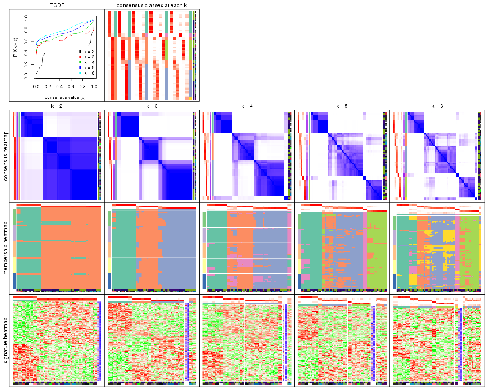

The plots are:

- The first row: a plot of the ECDF (empirical cumulative distribution
  function) curves of the consensus matrix for each `k` and the heatmap of
  predicted classes for each `k`.
- The second row: heatmaps of the consensus matrix for each `k`.
- The third row: heatmaps of the membership matrix for each `k`.
- The fouth row: heatmaps of the signatures for each `k`.

All the plots in panels can be made by individual functions and they are
plotted later in this section.

`select_partition_number()` produces several plots showing different
statistics for choosing "optimized" `k`. There are following statistics:

- ECDF curves of the consensus matrix for each `k`;
- 1-PAC. [The PAC
  score](https://en.wikipedia.org/wiki/Consensus_clustering#Over-interpretation_potential_of_consensus_clustering)
  measures the proportion of the ambiguous subgrouping.
- Mean silhouette score.
- Concordance. The mean probability of fiting the consensus class ids in all
  partitions.
- Area increased. Denote $A_k$ as the area under the ECDF curve for current
  `k`, the area increased is defined as $A_k - A_{k-1}$.
- Rand index. The percent of pairs of samples that are both in a same cluster
  or both are not in a same cluster in the partition of k and k-1.
- Jaccard index. The ratio of pairs of samples are both in a same cluster in
  the partition of k and k-1 and the pairs of samples are both in a same
  cluster in the partition k or k-1.

The detailed explanations of these statistics can be found in [the _cola_
vignette](http://bioconductor.org/packages/devel/bioc/vignettes/cola/inst/doc/cola.html#toc_13).

Generally speaking, lower PAC score, higher mean silhouette score or higher
concordance corresponds to better partition. Rand index and Jaccard index
measure how similar the current partition is compared to partition with `k-1`.
If they are too similar, we won't accept `k` is better than `k-1`.

```r
select_partition_number(res)
```

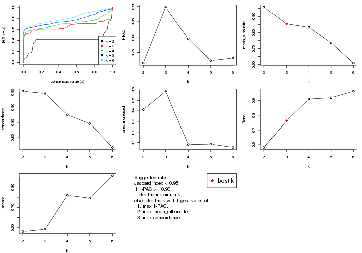

The numeric values for all these statistics can be obtained by `get_stats()`.

```r
get_stats(res)
```

```
#>   k 1-PAC mean_silhouette concordance area_increased  Rand Jaccard
#> 2 2 0.716           0.958       0.953         0.4123 0.581   0.581
#> 3 3 0.897           0.854       0.945         0.5881 0.763   0.592
#> 4 4 0.794           0.833       0.875         0.0798 0.911   0.760
#> 5 5 0.724           0.735       0.846         0.0845 0.920   0.746
#> 6 6 0.732           0.609       0.768         0.0525 0.965   0.856
```

`suggest_best_k()` suggests the best $k$ based on these statistics. The rules are as follows:

- All $k$ with Jaccard index larger than 0.95 are removed because increasing
  $k$ does not provide enough extra information. If all $k$ are removed, it is
  marked as no subgroup is detected.
- For all $k$ with 1-PAC score larger than 0.9, the maximal $k$ is taken as
  the best $k$, and other $k$ are marked as optional $k$.
- If it does not fit the second rule. The $k$ with the maximal vote of the
  highest 1-PAC score, highest mean silhouette, and highest concordance is
  taken as the best $k$.

```r
suggest_best_k(res)
```

```
#> [1] 3
```


Following shows the table of the partitions (You need to click the **show/hide
code output** link to see it). The membership matrix (columns with name `p*`)
is inferred by
[`clue::cl_consensus()`](https://www.rdocumentation.org/link/cl_consensus?package=clue)
function with the `SE` method. Basically the value in the membership matrix
represents the probability to belong to a certain group. The finall class
label for an item is determined with the group with highest probability it
belongs to.

In `get_classes()` function, the entropy is calculated from the membership
matrix and the silhouette score is calculated from the consensus matrix.


<script>
$( function() {
	$( '#tabs-SD-mclust-get-classes' ).tabs();
} );
</script>
<div id='tabs-SD-mclust-get-classes'>
<ul>
<li><a href='#tab-SD-mclust-get-classes-1'>k = 2</a></li>
<li><a href='#tab-SD-mclust-get-classes-2'>k = 3</a></li>
<li><a href='#tab-SD-mclust-get-classes-3'>k = 4</a></li>
<li><a href='#tab-SD-mclust-get-classes-4'>k = 5</a></li>
<li><a href='#tab-SD-mclust-get-classes-5'>k = 6</a></li>
</ul>

<div id='tab-SD-mclust-get-classes-1'>
<p><a id='tab-SD-mclust-get-classes-1-a' style='color:#0366d6' href='#'>show/hide code output</a></p>
<pre><code class="r">cbind(get_classes(res, k = 2), get_membership(res, k = 2))
</code></pre>

<pre><code>#&gt;           class entropy silhouette    p1    p2
#&gt; GSM525314     1  0.2778      0.981 0.952 0.048
#&gt; GSM525315     2  0.0000      0.957 0.000 1.000
#&gt; GSM525316     2  0.1843      0.946 0.028 0.972
#&gt; GSM525317     2  0.3114      0.959 0.056 0.944
#&gt; GSM525318     2  0.3114      0.959 0.056 0.944
#&gt; GSM525319     2  0.0000      0.957 0.000 1.000
#&gt; GSM525320     2  0.3114      0.959 0.056 0.944
#&gt; GSM525321     2  0.3114      0.959 0.056 0.944
#&gt; GSM525322     2  0.3114      0.959 0.056 0.944
#&gt; GSM525323     1  0.2778      0.981 0.952 0.048
#&gt; GSM525324     2  0.3114      0.959 0.056 0.944
#&gt; GSM525325     2  0.2778      0.934 0.048 0.952
#&gt; GSM525326     1  0.5946      0.921 0.856 0.144
#&gt; GSM525327     1  0.2778      0.981 0.952 0.048
#&gt; GSM525328     1  0.2778      0.981 0.952 0.048
#&gt; GSM525329     2  0.3114      0.959 0.056 0.944
#&gt; GSM525330     2  0.2778      0.934 0.048 0.952
#&gt; GSM525331     2  0.2778      0.934 0.048 0.952
#&gt; GSM525332     2  0.2778      0.934 0.048 0.952
#&gt; GSM525333     2  0.2778      0.934 0.048 0.952
#&gt; GSM525334     2  0.3114      0.959 0.056 0.944
#&gt; GSM525335     2  0.0000      0.957 0.000 1.000
#&gt; GSM525336     1  0.3584      0.975 0.932 0.068
#&gt; GSM525337     2  0.0000      0.957 0.000 1.000
#&gt; GSM525338     2  0.3114      0.959 0.056 0.944
#&gt; GSM525339     1  0.2778      0.981 0.952 0.048
#&gt; GSM525340     1  0.2778      0.981 0.952 0.048
#&gt; GSM525341     2  0.0000      0.957 0.000 1.000
#&gt; GSM525342     2  0.2043      0.943 0.032 0.968
#&gt; GSM525343     2  0.3114      0.959 0.056 0.944
#&gt; GSM525344     2  0.3114      0.959 0.056 0.944
#&gt; GSM525345     1  0.2778      0.981 0.952 0.048
#&gt; GSM525346     2  0.3114      0.959 0.056 0.944
#&gt; GSM525347     2  0.0000      0.957 0.000 1.000
#&gt; GSM525348     1  0.5946      0.921 0.856 0.144
#&gt; GSM525349     1  0.2778      0.981 0.952 0.048
#&gt; GSM525350     2  0.2778      0.934 0.048 0.952
#&gt; GSM525351     2  0.2778      0.934 0.048 0.952
#&gt; GSM525352     2  0.2778      0.934 0.048 0.952
#&gt; GSM525353     2  0.2236      0.941 0.036 0.964
#&gt; GSM525354     2  0.3114      0.959 0.056 0.944
#&gt; GSM525355     2  0.0000      0.957 0.000 1.000
#&gt; GSM525356     1  0.3584      0.975 0.932 0.068
#&gt; GSM525357     2  0.3114      0.959 0.056 0.944
#&gt; GSM525358     1  0.2778      0.981 0.952 0.048
#&gt; GSM525359     1  0.3114      0.979 0.944 0.056
#&gt; GSM525360     2  0.0000      0.957 0.000 1.000
#&gt; GSM525361     2  0.0672      0.954 0.008 0.992
#&gt; GSM525362     2  0.3114      0.959 0.056 0.944
#&gt; GSM525363     2  0.0938      0.958 0.012 0.988
#&gt; GSM525364     2  0.3114      0.959 0.056 0.944
#&gt; GSM525365     2  0.3114      0.959 0.056 0.944
#&gt; GSM525366     2  0.3114      0.959 0.056 0.944
#&gt; GSM525367     1  0.2948      0.980 0.948 0.052
#&gt; GSM525368     2  0.3114      0.959 0.056 0.944
#&gt; GSM525369     2  0.0000      0.957 0.000 1.000
#&gt; GSM525370     1  0.5946      0.921 0.856 0.144
#&gt; GSM525371     1  0.3114      0.979 0.944 0.056
#&gt; GSM525372     2  0.3114      0.959 0.056 0.944
#&gt; GSM525373     2  0.2603      0.959 0.044 0.956
#&gt; GSM525374     2  0.3114      0.959 0.056 0.944
#&gt; GSM525375     1  0.3114      0.979 0.944 0.056
</code></pre>

<script>
$('#tab-SD-mclust-get-classes-1-a').parent().next().next().hide();
$('#tab-SD-mclust-get-classes-1-a').click(function(){
  $('#tab-SD-mclust-get-classes-1-a').parent().next().next().toggle();
  return(false);
});
</script>
</div>

<div id='tab-SD-mclust-get-classes-2'>
<p><a id='tab-SD-mclust-get-classes-2-a' style='color:#0366d6' href='#'>show/hide code output</a></p>
<pre><code class="r">cbind(get_classes(res, k = 3), get_membership(res, k = 3))
</code></pre>

<pre><code>#&gt;           class entropy silhouette    p1    p2    p3
#&gt; GSM525314     1  0.0000     0.9702 1.000 0.000 0.000
#&gt; GSM525315     3  0.6309    -0.0166 0.000 0.496 0.504
#&gt; GSM525316     2  0.0237     0.9157 0.000 0.996 0.004
#&gt; GSM525317     3  0.0000     0.9245 0.000 0.000 1.000
#&gt; GSM525318     3  0.0000     0.9245 0.000 0.000 1.000
#&gt; GSM525319     3  0.6305     0.0316 0.000 0.484 0.516
#&gt; GSM525320     3  0.0000     0.9245 0.000 0.000 1.000
#&gt; GSM525321     3  0.0000     0.9245 0.000 0.000 1.000
#&gt; GSM525322     3  0.0000     0.9245 0.000 0.000 1.000
#&gt; GSM525323     1  0.0000     0.9702 1.000 0.000 0.000
#&gt; GSM525324     3  0.0000     0.9245 0.000 0.000 1.000
#&gt; GSM525325     2  0.0424     0.9147 0.000 0.992 0.008
#&gt; GSM525326     1  0.4811     0.8271 0.828 0.148 0.024
#&gt; GSM525327     1  0.0000     0.9702 1.000 0.000 0.000
#&gt; GSM525328     1  0.0000     0.9702 1.000 0.000 0.000
#&gt; GSM525329     3  0.0237     0.9216 0.004 0.000 0.996
#&gt; GSM525330     2  0.0000     0.9136 0.000 1.000 0.000
#&gt; GSM525331     2  0.0237     0.9157 0.000 0.996 0.004
#&gt; GSM525332     2  0.0237     0.9157 0.000 0.996 0.004
#&gt; GSM525333     2  0.0237     0.9140 0.000 0.996 0.004
#&gt; GSM525334     3  0.0000     0.9245 0.000 0.000 1.000
#&gt; GSM525335     2  0.6126     0.2959 0.000 0.600 0.400
#&gt; GSM525336     1  0.0000     0.9702 1.000 0.000 0.000
#&gt; GSM525337     3  0.2878     0.8448 0.000 0.096 0.904
#&gt; GSM525338     3  0.0000     0.9245 0.000 0.000 1.000
#&gt; GSM525339     1  0.0000     0.9702 1.000 0.000 0.000
#&gt; GSM525340     1  0.0000     0.9702 1.000 0.000 0.000
#&gt; GSM525341     3  0.6302     0.0467 0.000 0.480 0.520
#&gt; GSM525342     2  0.0237     0.9157 0.000 0.996 0.004
#&gt; GSM525343     3  0.0000     0.9245 0.000 0.000 1.000
#&gt; GSM525344     3  0.0000     0.9245 0.000 0.000 1.000
#&gt; GSM525345     1  0.0000     0.9702 1.000 0.000 0.000
#&gt; GSM525346     3  0.0000     0.9245 0.000 0.000 1.000
#&gt; GSM525347     2  0.2711     0.8581 0.000 0.912 0.088
#&gt; GSM525348     1  0.4811     0.8271 0.828 0.148 0.024
#&gt; GSM525349     1  0.0000     0.9702 1.000 0.000 0.000
#&gt; GSM525350     2  0.0000     0.9136 0.000 1.000 0.000
#&gt; GSM525351     2  0.0237     0.9157 0.000 0.996 0.004
#&gt; GSM525352     2  0.0237     0.9157 0.000 0.996 0.004
#&gt; GSM525353     2  0.0592     0.9111 0.000 0.988 0.012
#&gt; GSM525354     3  0.0000     0.9245 0.000 0.000 1.000
#&gt; GSM525355     2  0.6286     0.0844 0.000 0.536 0.464
#&gt; GSM525356     1  0.0000     0.9702 1.000 0.000 0.000
#&gt; GSM525357     3  0.0000     0.9245 0.000 0.000 1.000
#&gt; GSM525358     1  0.0000     0.9702 1.000 0.000 0.000
#&gt; GSM525359     1  0.0000     0.9702 1.000 0.000 0.000
#&gt; GSM525360     3  0.4002     0.7700 0.000 0.160 0.840
#&gt; GSM525361     2  0.0237     0.9157 0.000 0.996 0.004
#&gt; GSM525362     3  0.0000     0.9245 0.000 0.000 1.000
#&gt; GSM525363     3  0.2261     0.8700 0.000 0.068 0.932
#&gt; GSM525364     3  0.0000     0.9245 0.000 0.000 1.000
#&gt; GSM525365     3  0.0000     0.9245 0.000 0.000 1.000
#&gt; GSM525366     3  0.0000     0.9245 0.000 0.000 1.000
#&gt; GSM525367     1  0.0000     0.9702 1.000 0.000 0.000
#&gt; GSM525368     3  0.0000     0.9245 0.000 0.000 1.000
#&gt; GSM525369     2  0.2711     0.8581 0.000 0.912 0.088
#&gt; GSM525370     1  0.4811     0.8271 0.828 0.148 0.024
#&gt; GSM525371     1  0.0000     0.9702 1.000 0.000 0.000
#&gt; GSM525372     3  0.0237     0.9216 0.004 0.000 0.996
#&gt; GSM525373     3  0.0747     0.9146 0.000 0.016 0.984
#&gt; GSM525374     3  0.0000     0.9245 0.000 0.000 1.000
#&gt; GSM525375     1  0.0000     0.9702 1.000 0.000 0.000
</code></pre>

<script>
$('#tab-SD-mclust-get-classes-2-a').parent().next().next().hide();
$('#tab-SD-mclust-get-classes-2-a').click(function(){
  $('#tab-SD-mclust-get-classes-2-a').parent().next().next().toggle();
  return(false);
});
</script>
</div>

<div id='tab-SD-mclust-get-classes-3'>
<p><a id='tab-SD-mclust-get-classes-3-a' style='color:#0366d6' href='#'>show/hide code output</a></p>
<pre><code class="r">cbind(get_classes(res, k = 4), get_membership(res, k = 4))
</code></pre>

<pre><code>#&gt;           class entropy silhouette    p1    p2    p3    p4
#&gt; GSM525314     1  0.0000      0.928 1.000 0.000 0.000 0.000
#&gt; GSM525315     2  0.7786      0.367 0.000 0.416 0.328 0.256
#&gt; GSM525316     2  0.0817      0.787 0.000 0.976 0.000 0.024
#&gt; GSM525317     3  0.0672      0.919 0.000 0.008 0.984 0.008
#&gt; GSM525318     3  0.0672      0.919 0.000 0.008 0.984 0.008
#&gt; GSM525319     2  0.7803      0.409 0.000 0.416 0.268 0.316
#&gt; GSM525320     3  0.1256      0.918 0.000 0.008 0.964 0.028
#&gt; GSM525321     3  0.0672      0.919 0.000 0.008 0.984 0.008
#&gt; GSM525322     3  0.2081      0.900 0.000 0.000 0.916 0.084
#&gt; GSM525323     1  0.0000      0.928 1.000 0.000 0.000 0.000
#&gt; GSM525324     3  0.2973      0.877 0.000 0.000 0.856 0.144
#&gt; GSM525325     2  0.1978      0.786 0.000 0.928 0.004 0.068
#&gt; GSM525326     4  0.5599      1.000 0.276 0.052 0.000 0.672
#&gt; GSM525327     1  0.2011      0.891 0.920 0.000 0.000 0.080
#&gt; GSM525328     1  0.2011      0.891 0.920 0.000 0.000 0.080
#&gt; GSM525329     3  0.0672      0.919 0.000 0.008 0.984 0.008
#&gt; GSM525330     2  0.0895      0.794 0.000 0.976 0.004 0.020
#&gt; GSM525331     2  0.0657      0.790 0.000 0.984 0.004 0.012
#&gt; GSM525332     2  0.0469      0.789 0.000 0.988 0.000 0.012
#&gt; GSM525333     2  0.0376      0.794 0.000 0.992 0.004 0.004
#&gt; GSM525334     3  0.0336      0.920 0.000 0.008 0.992 0.000
#&gt; GSM525335     2  0.6567      0.610 0.000 0.588 0.104 0.308
#&gt; GSM525336     1  0.3569      0.727 0.804 0.000 0.000 0.196
#&gt; GSM525337     3  0.3606      0.792 0.000 0.140 0.840 0.020
#&gt; GSM525338     3  0.0672      0.919 0.000 0.008 0.984 0.008
#&gt; GSM525339     1  0.0000      0.928 1.000 0.000 0.000 0.000
#&gt; GSM525340     1  0.0000      0.928 1.000 0.000 0.000 0.000
#&gt; GSM525341     2  0.7811      0.340 0.000 0.404 0.336 0.260
#&gt; GSM525342     2  0.0817      0.787 0.000 0.976 0.000 0.024
#&gt; GSM525343     3  0.0672      0.919 0.000 0.008 0.984 0.008
#&gt; GSM525344     3  0.2868      0.881 0.000 0.000 0.864 0.136
#&gt; GSM525345     1  0.0000      0.928 1.000 0.000 0.000 0.000
#&gt; GSM525346     3  0.3024      0.877 0.000 0.000 0.852 0.148
#&gt; GSM525347     2  0.4399      0.729 0.000 0.760 0.016 0.224
#&gt; GSM525348     4  0.5599      1.000 0.276 0.052 0.000 0.672
#&gt; GSM525349     1  0.2011      0.891 0.920 0.000 0.000 0.080
#&gt; GSM525350     2  0.0188      0.793 0.000 0.996 0.004 0.000
#&gt; GSM525351     2  0.1489      0.793 0.000 0.952 0.004 0.044
#&gt; GSM525352     2  0.0469      0.789 0.000 0.988 0.000 0.012
#&gt; GSM525353     2  0.2413      0.787 0.000 0.916 0.020 0.064
#&gt; GSM525354     3  0.0336      0.920 0.000 0.008 0.992 0.000
#&gt; GSM525355     2  0.7007      0.575 0.000 0.548 0.144 0.308
#&gt; GSM525356     1  0.3569      0.727 0.804 0.000 0.000 0.196
#&gt; GSM525357     3  0.0779      0.920 0.000 0.004 0.980 0.016
#&gt; GSM525358     1  0.0000      0.928 1.000 0.000 0.000 0.000
#&gt; GSM525359     1  0.0000      0.928 1.000 0.000 0.000 0.000
#&gt; GSM525360     3  0.6883      0.515 0.000 0.192 0.596 0.212
#&gt; GSM525361     2  0.1902      0.790 0.000 0.932 0.004 0.064
#&gt; GSM525362     3  0.0927      0.920 0.000 0.008 0.976 0.016
#&gt; GSM525363     3  0.5560      0.747 0.000 0.116 0.728 0.156
#&gt; GSM525364     3  0.1545      0.915 0.000 0.008 0.952 0.040
#&gt; GSM525365     3  0.0804      0.918 0.000 0.008 0.980 0.012
#&gt; GSM525366     3  0.2973      0.878 0.000 0.000 0.856 0.144
#&gt; GSM525367     1  0.0000      0.928 1.000 0.000 0.000 0.000
#&gt; GSM525368     3  0.3024      0.877 0.000 0.000 0.852 0.148
#&gt; GSM525369     2  0.4472      0.727 0.000 0.760 0.020 0.220
#&gt; GSM525370     4  0.5599      1.000 0.276 0.052 0.000 0.672
#&gt; GSM525371     1  0.2011      0.891 0.920 0.000 0.000 0.080
#&gt; GSM525372     3  0.0672      0.919 0.000 0.008 0.984 0.008
#&gt; GSM525373     3  0.2722      0.896 0.000 0.032 0.904 0.064
#&gt; GSM525374     3  0.1978      0.910 0.000 0.004 0.928 0.068
#&gt; GSM525375     1  0.0000      0.928 1.000 0.000 0.000 0.000
</code></pre>

<script>
$('#tab-SD-mclust-get-classes-3-a').parent().next().next().hide();
$('#tab-SD-mclust-get-classes-3-a').click(function(){
  $('#tab-SD-mclust-get-classes-3-a').parent().next().next().toggle();
  return(false);
});
</script>
</div>

<div id='tab-SD-mclust-get-classes-4'>
<p><a id='tab-SD-mclust-get-classes-4-a' style='color:#0366d6' href='#'>show/hide code output</a></p>
<pre><code class="r">cbind(get_classes(res, k = 5), get_membership(res, k = 5))
</code></pre>

<pre><code>#&gt;           class entropy silhouette    p1    p2    p3    p4    p5
#&gt; GSM525314     1  0.0000      0.893 1.000 0.000 0.000 0.000 0.000
#&gt; GSM525315     2  0.5354      0.596 0.000 0.664 0.208 0.000 0.128
#&gt; GSM525316     5  0.0451      0.901 0.000 0.004 0.000 0.008 0.988
#&gt; GSM525317     3  0.1043      0.765 0.000 0.040 0.960 0.000 0.000
#&gt; GSM525318     3  0.1043      0.777 0.000 0.040 0.960 0.000 0.000
#&gt; GSM525319     2  0.3791      0.597 0.000 0.812 0.076 0.000 0.112
#&gt; GSM525320     3  0.3333      0.722 0.004 0.208 0.788 0.000 0.000
#&gt; GSM525321     3  0.0963      0.765 0.000 0.036 0.964 0.000 0.000
#&gt; GSM525322     3  0.3395      0.689 0.000 0.236 0.764 0.000 0.000
#&gt; GSM525323     1  0.0000      0.893 1.000 0.000 0.000 0.000 0.000
#&gt; GSM525324     2  0.4300     -0.321 0.000 0.524 0.476 0.000 0.000
#&gt; GSM525325     5  0.1121      0.897 0.000 0.044 0.000 0.000 0.956
#&gt; GSM525326     4  0.0162      1.000 0.000 0.000 0.000 0.996 0.004
#&gt; GSM525327     1  0.3053      0.829 0.828 0.008 0.000 0.164 0.000
#&gt; GSM525328     1  0.3053      0.829 0.828 0.008 0.000 0.164 0.000
#&gt; GSM525329     3  0.2052      0.779 0.004 0.080 0.912 0.004 0.000
#&gt; GSM525330     5  0.0404      0.902 0.000 0.012 0.000 0.000 0.988
#&gt; GSM525331     5  0.0000      0.902 0.000 0.000 0.000 0.000 1.000
#&gt; GSM525332     5  0.0162      0.902 0.000 0.000 0.000 0.004 0.996
#&gt; GSM525333     5  0.1671      0.877 0.000 0.076 0.000 0.000 0.924
#&gt; GSM525334     3  0.2389      0.776 0.004 0.116 0.880 0.000 0.000
#&gt; GSM525335     2  0.4473      0.300 0.000 0.656 0.020 0.000 0.324
#&gt; GSM525336     1  0.4449      0.595 0.636 0.008 0.000 0.352 0.004
#&gt; GSM525337     3  0.4506      0.408 0.000 0.296 0.676 0.000 0.028
#&gt; GSM525338     3  0.0794      0.767 0.000 0.028 0.972 0.000 0.000
#&gt; GSM525339     1  0.0000      0.893 1.000 0.000 0.000 0.000 0.000
#&gt; GSM525340     1  0.0000      0.893 1.000 0.000 0.000 0.000 0.000
#&gt; GSM525341     2  0.4883      0.602 0.000 0.708 0.200 0.000 0.092
#&gt; GSM525342     5  0.0451      0.901 0.000 0.004 0.000 0.008 0.988
#&gt; GSM525343     3  0.1043      0.765 0.000 0.040 0.960 0.000 0.000
#&gt; GSM525344     3  0.4030      0.582 0.000 0.352 0.648 0.000 0.000
#&gt; GSM525345     1  0.0000      0.893 1.000 0.000 0.000 0.000 0.000
#&gt; GSM525346     3  0.4262      0.493 0.000 0.440 0.560 0.000 0.000
#&gt; GSM525347     5  0.3715      0.748 0.000 0.260 0.000 0.004 0.736
#&gt; GSM525348     4  0.0162      1.000 0.000 0.000 0.000 0.996 0.004
#&gt; GSM525349     1  0.3053      0.829 0.828 0.008 0.000 0.164 0.000
#&gt; GSM525350     5  0.0609      0.901 0.000 0.020 0.000 0.000 0.980
#&gt; GSM525351     5  0.1341      0.892 0.000 0.056 0.000 0.000 0.944
#&gt; GSM525352     5  0.0162      0.902 0.000 0.000 0.000 0.004 0.996
#&gt; GSM525353     5  0.3534      0.742 0.000 0.256 0.000 0.000 0.744
#&gt; GSM525354     3  0.2124      0.771 0.004 0.096 0.900 0.000 0.000
#&gt; GSM525355     2  0.4400      0.340 0.000 0.672 0.020 0.000 0.308
#&gt; GSM525356     1  0.4298      0.600 0.640 0.008 0.000 0.352 0.000
#&gt; GSM525357     3  0.1792      0.779 0.000 0.084 0.916 0.000 0.000
#&gt; GSM525358     1  0.0000      0.893 1.000 0.000 0.000 0.000 0.000
#&gt; GSM525359     1  0.0000      0.893 1.000 0.000 0.000 0.000 0.000
#&gt; GSM525360     2  0.4836      0.366 0.000 0.628 0.336 0.000 0.036
#&gt; GSM525361     5  0.3093      0.822 0.000 0.168 0.000 0.008 0.824
#&gt; GSM525362     3  0.2424      0.774 0.000 0.132 0.868 0.000 0.000
#&gt; GSM525363     2  0.4602      0.271 0.000 0.656 0.316 0.000 0.028
#&gt; GSM525364     3  0.3814      0.706 0.004 0.276 0.720 0.000 0.000
#&gt; GSM525365     3  0.1732      0.782 0.000 0.080 0.920 0.000 0.000
#&gt; GSM525366     3  0.4114      0.565 0.000 0.376 0.624 0.000 0.000
#&gt; GSM525367     1  0.0000      0.893 1.000 0.000 0.000 0.000 0.000
#&gt; GSM525368     3  0.4268      0.485 0.000 0.444 0.556 0.000 0.000
#&gt; GSM525369     5  0.3741      0.745 0.000 0.264 0.000 0.004 0.732
#&gt; GSM525370     4  0.0162      1.000 0.000 0.000 0.000 0.996 0.004
#&gt; GSM525371     1  0.3013      0.831 0.832 0.008 0.000 0.160 0.000
#&gt; GSM525372     3  0.2921      0.779 0.004 0.148 0.844 0.004 0.000
#&gt; GSM525373     3  0.4040      0.604 0.000 0.260 0.724 0.000 0.016
#&gt; GSM525374     3  0.3274      0.711 0.000 0.220 0.780 0.000 0.000
#&gt; GSM525375     1  0.0000      0.893 1.000 0.000 0.000 0.000 0.000
</code></pre>

<script>
$('#tab-SD-mclust-get-classes-4-a').parent().next().next().hide();
$('#tab-SD-mclust-get-classes-4-a').click(function(){
  $('#tab-SD-mclust-get-classes-4-a').parent().next().next().toggle();
  return(false);
});
</script>
</div>

<div id='tab-SD-mclust-get-classes-5'>
<p><a id='tab-SD-mclust-get-classes-5-a' style='color:#0366d6' href='#'>show/hide code output</a></p>
<pre><code class="r">cbind(get_classes(res, k = 6), get_membership(res, k = 6))
</code></pre>

<pre><code>#&gt;           class entropy silhouette    p1    p2    p3    p4    p5    p6
#&gt; GSM525314     1  0.0458     0.7923 0.984 0.000 0.000 0.000 0.000 0.016
#&gt; GSM525315     2  0.3246     0.6746 0.000 0.848 0.048 0.000 0.076 0.028
#&gt; GSM525316     5  0.0363     0.8263 0.000 0.000 0.000 0.012 0.988 0.000
#&gt; GSM525317     3  0.2631     0.6066 0.000 0.008 0.840 0.000 0.000 0.152
#&gt; GSM525318     3  0.2553     0.6111 0.000 0.008 0.848 0.000 0.000 0.144
#&gt; GSM525319     2  0.1515     0.6973 0.000 0.944 0.020 0.000 0.028 0.008
#&gt; GSM525320     3  0.3848     0.4365 0.000 0.040 0.736 0.000 0.000 0.224
#&gt; GSM525321     3  0.2669     0.6035 0.000 0.008 0.836 0.000 0.000 0.156
#&gt; GSM525322     3  0.3513     0.3739 0.000 0.144 0.796 0.000 0.000 0.060
#&gt; GSM525323     1  0.0363     0.7909 0.988 0.000 0.000 0.000 0.000 0.012
#&gt; GSM525324     2  0.5635    -0.2403 0.000 0.432 0.420 0.000 0.000 0.148
#&gt; GSM525325     5  0.2149     0.8213 0.000 0.104 0.000 0.004 0.888 0.004
#&gt; GSM525326     4  0.0146     0.9973 0.000 0.000 0.000 0.996 0.004 0.000
#&gt; GSM525327     1  0.5257     0.6428 0.584 0.000 0.000 0.136 0.000 0.280
#&gt; GSM525328     1  0.5273     0.6404 0.580 0.000 0.000 0.136 0.000 0.284
#&gt; GSM525329     3  0.1802     0.5784 0.000 0.012 0.916 0.000 0.000 0.072
#&gt; GSM525330     5  0.3052     0.7391 0.000 0.216 0.000 0.000 0.780 0.004
#&gt; GSM525331     5  0.0692     0.8299 0.000 0.020 0.000 0.000 0.976 0.004
#&gt; GSM525332     5  0.0000     0.8292 0.000 0.000 0.000 0.000 1.000 0.000
#&gt; GSM525333     5  0.3240     0.6976 0.000 0.244 0.000 0.000 0.752 0.004
#&gt; GSM525334     3  0.3053     0.5916 0.000 0.020 0.812 0.000 0.000 0.168
#&gt; GSM525335     2  0.2704     0.6924 0.000 0.876 0.036 0.000 0.076 0.012
#&gt; GSM525336     1  0.5955     0.4808 0.444 0.000 0.000 0.240 0.000 0.316
#&gt; GSM525337     2  0.4640     0.3213 0.000 0.524 0.444 0.000 0.016 0.016
#&gt; GSM525338     3  0.2783     0.6100 0.000 0.016 0.836 0.000 0.000 0.148
#&gt; GSM525339     1  0.0000     0.7925 1.000 0.000 0.000 0.000 0.000 0.000
#&gt; GSM525340     1  0.0458     0.7923 0.984 0.000 0.000 0.000 0.000 0.016
#&gt; GSM525341     2  0.1991     0.6966 0.000 0.920 0.044 0.000 0.024 0.012
#&gt; GSM525342     5  0.0260     0.8259 0.000 0.000 0.000 0.008 0.992 0.000
#&gt; GSM525343     3  0.2669     0.6041 0.000 0.008 0.836 0.000 0.000 0.156
#&gt; GSM525344     3  0.5172    -0.3869 0.000 0.132 0.600 0.000 0.000 0.268
#&gt; GSM525345     1  0.0363     0.7909 0.988 0.000 0.000 0.000 0.000 0.012
#&gt; GSM525346     6  0.5595     1.0000 0.000 0.144 0.392 0.000 0.000 0.464
#&gt; GSM525347     5  0.4401     0.6655 0.000 0.300 0.000 0.004 0.656 0.040
#&gt; GSM525348     4  0.0146     0.9973 0.000 0.000 0.000 0.996 0.004 0.000
#&gt; GSM525349     1  0.5240     0.6449 0.588 0.000 0.000 0.136 0.000 0.276
#&gt; GSM525350     5  0.2871     0.7477 0.000 0.192 0.000 0.000 0.804 0.004
#&gt; GSM525351     5  0.1257     0.8272 0.000 0.028 0.000 0.000 0.952 0.020
#&gt; GSM525352     5  0.0000     0.8292 0.000 0.000 0.000 0.000 1.000 0.000
#&gt; GSM525353     5  0.4269     0.6464 0.000 0.316 0.000 0.000 0.648 0.036
#&gt; GSM525354     3  0.3017     0.6032 0.000 0.020 0.816 0.000 0.000 0.164
#&gt; GSM525355     2  0.2742     0.6948 0.000 0.876 0.036 0.000 0.072 0.016
#&gt; GSM525356     1  0.5939     0.4917 0.452 0.000 0.000 0.240 0.000 0.308
#&gt; GSM525357     3  0.2383     0.5277 0.000 0.024 0.880 0.000 0.000 0.096
#&gt; GSM525358     1  0.0000     0.7925 1.000 0.000 0.000 0.000 0.000 0.000
#&gt; GSM525359     1  0.1010     0.7915 0.960 0.000 0.000 0.004 0.000 0.036
#&gt; GSM525360     2  0.3933     0.5765 0.000 0.740 0.220 0.000 0.008 0.032
#&gt; GSM525361     5  0.3849     0.7325 0.000 0.208 0.000 0.008 0.752 0.032
#&gt; GSM525362     3  0.3202     0.4322 0.000 0.024 0.800 0.000 0.000 0.176
#&gt; GSM525363     2  0.5361     0.4097 0.000 0.608 0.244 0.000 0.008 0.140
#&gt; GSM525364     3  0.4363    -0.0445 0.000 0.040 0.636 0.000 0.000 0.324
#&gt; GSM525365     3  0.2581     0.5095 0.000 0.016 0.856 0.000 0.000 0.128
#&gt; GSM525366     3  0.5411    -0.6702 0.000 0.124 0.512 0.000 0.000 0.364
#&gt; GSM525367     1  0.0777     0.7926 0.972 0.000 0.000 0.004 0.000 0.024
#&gt; GSM525368     6  0.5595     1.0000 0.000 0.144 0.392 0.000 0.000 0.464
#&gt; GSM525369     5  0.4528     0.6530 0.000 0.316 0.000 0.004 0.636 0.044
#&gt; GSM525370     4  0.0000     0.9947 0.000 0.000 0.000 1.000 0.000 0.000
#&gt; GSM525371     1  0.4990     0.6702 0.636 0.000 0.000 0.132 0.000 0.232
#&gt; GSM525372     3  0.3014     0.4791 0.000 0.012 0.804 0.000 0.000 0.184
#&gt; GSM525373     3  0.4063     0.2477 0.000 0.252 0.712 0.000 0.008 0.028
#&gt; GSM525374     3  0.4328     0.1949 0.000 0.100 0.720 0.000 0.000 0.180
#&gt; GSM525375     1  0.1411     0.7866 0.936 0.000 0.000 0.004 0.000 0.060
</code></pre>

<script>
$('#tab-SD-mclust-get-classes-5-a').parent().next().next().hide();
$('#tab-SD-mclust-get-classes-5-a').click(function(){
  $('#tab-SD-mclust-get-classes-5-a').parent().next().next().toggle();
  return(false);
});
</script>
</div>
</div>

Heatmaps for the consensus matrix. It visualizes the probability of two
samples to be in a same group.


<script>
$( function() {
	$( '#tabs-SD-mclust-consensus-heatmap' ).tabs();
} );
</script>
<div id='tabs-SD-mclust-consensus-heatmap'>
<ul>
<li><a href='#tab-SD-mclust-consensus-heatmap-1'>k = 2</a></li>
<li><a href='#tab-SD-mclust-consensus-heatmap-2'>k = 3</a></li>
<li><a href='#tab-SD-mclust-consensus-heatmap-3'>k = 4</a></li>
<li><a href='#tab-SD-mclust-consensus-heatmap-4'>k = 5</a></li>
<li><a href='#tab-SD-mclust-consensus-heatmap-5'>k = 6</a></li>
</ul>
<div id='tab-SD-mclust-consensus-heatmap-1'>
<pre><code class="r">consensus_heatmap(res, k = 2)
</code></pre>

<p>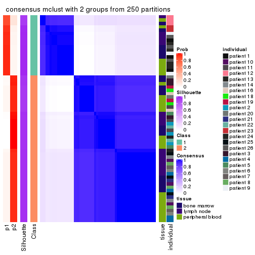</p>

</div>
<div id='tab-SD-mclust-consensus-heatmap-2'>
<pre><code class="r">consensus_heatmap(res, k = 3)
</code></pre>

<p>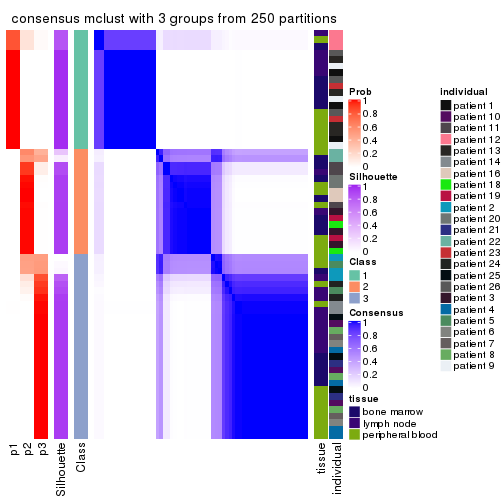</p>

</div>
<div id='tab-SD-mclust-consensus-heatmap-3'>
<pre><code class="r">consensus_heatmap(res, k = 4)
</code></pre>

<p>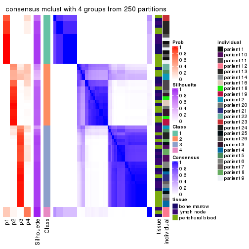</p>

</div>
<div id='tab-SD-mclust-consensus-heatmap-4'>
<pre><code class="r">consensus_heatmap(res, k = 5)
</code></pre>

<p>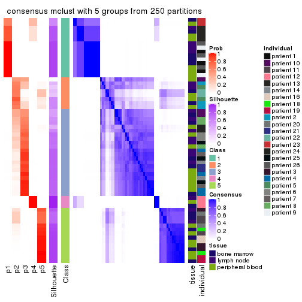</p>

</div>
<div id='tab-SD-mclust-consensus-heatmap-5'>
<pre><code class="r">consensus_heatmap(res, k = 6)
</code></pre>

<p>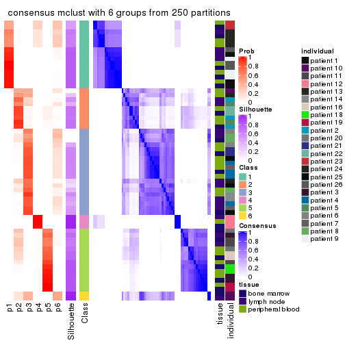</p>

</div>
</div>

Heatmaps for the membership of samples in all partitions to see how consistent they are:


<script>
$( function() {
	$( '#tabs-SD-mclust-membership-heatmap' ).tabs();
} );
</script>
<div id='tabs-SD-mclust-membership-heatmap'>
<ul>
<li><a href='#tab-SD-mclust-membership-heatmap-1'>k = 2</a></li>
<li><a href='#tab-SD-mclust-membership-heatmap-2'>k = 3</a></li>
<li><a href='#tab-SD-mclust-membership-heatmap-3'>k = 4</a></li>
<li><a href='#tab-SD-mclust-membership-heatmap-4'>k = 5</a></li>
<li><a href='#tab-SD-mclust-membership-heatmap-5'>k = 6</a></li>
</ul>
<div id='tab-SD-mclust-membership-heatmap-1'>
<pre><code class="r">membership_heatmap(res, k = 2)
</code></pre>

<p>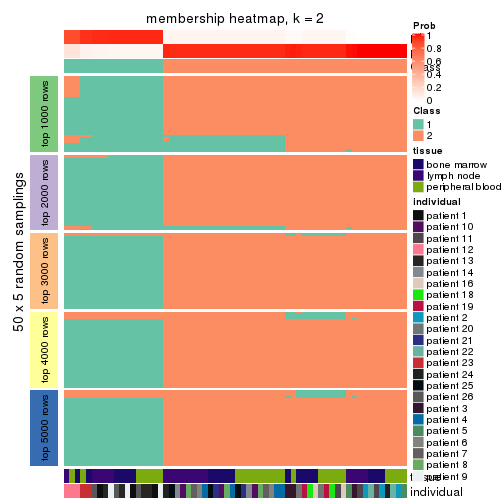</p>

</div>
<div id='tab-SD-mclust-membership-heatmap-2'>
<pre><code class="r">membership_heatmap(res, k = 3)
</code></pre>

<p>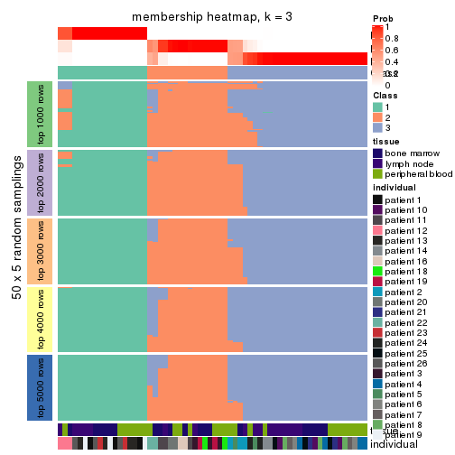</p>

</div>
<div id='tab-SD-mclust-membership-heatmap-3'>
<pre><code class="r">membership_heatmap(res, k = 4)
</code></pre>

<p>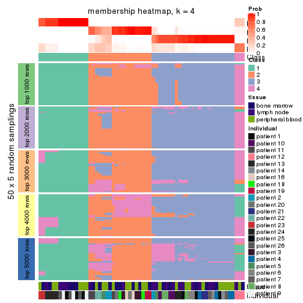</p>

</div>
<div id='tab-SD-mclust-membership-heatmap-4'>
<pre><code class="r">membership_heatmap(res, k = 5)
</code></pre>

<p>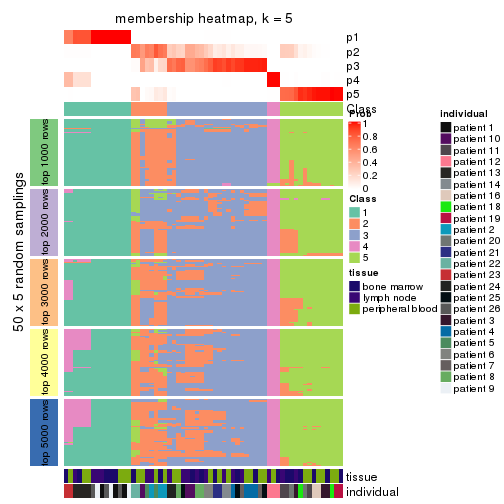</p>

</div>
<div id='tab-SD-mclust-membership-heatmap-5'>
<pre><code class="r">membership_heatmap(res, k = 6)
</code></pre>

<p>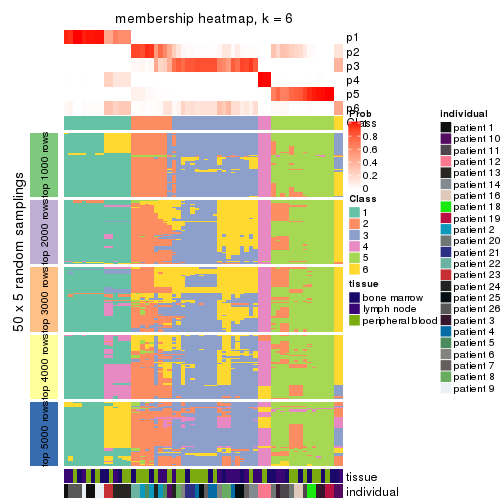</p>

</div>
</div>

As soon as we have had the classes for columns, we can look for signatures
which are significantly different between classes which can be candidate marks
for certain classes. Following are the heatmaps for signatures.


Signature heatmaps where rows are scaled:


<script>
$( function() {
	$( '#tabs-SD-mclust-get-signatures' ).tabs();
} );
</script>
<div id='tabs-SD-mclust-get-signatures'>
<ul>
<li><a href='#tab-SD-mclust-get-signatures-1'>k = 2</a></li>
<li><a href='#tab-SD-mclust-get-signatures-2'>k = 3</a></li>
<li><a href='#tab-SD-mclust-get-signatures-3'>k = 4</a></li>
<li><a href='#tab-SD-mclust-get-signatures-4'>k = 5</a></li>
<li><a href='#tab-SD-mclust-get-signatures-5'>k = 6</a></li>
</ul>
<div id='tab-SD-mclust-get-signatures-1'>
<pre><code class="r">get_signatures(res, k = 2)
</code></pre>

<p>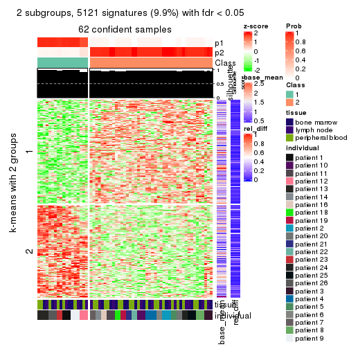</p>

</div>
<div id='tab-SD-mclust-get-signatures-2'>
<pre><code class="r">get_signatures(res, k = 3)
</code></pre>

<p>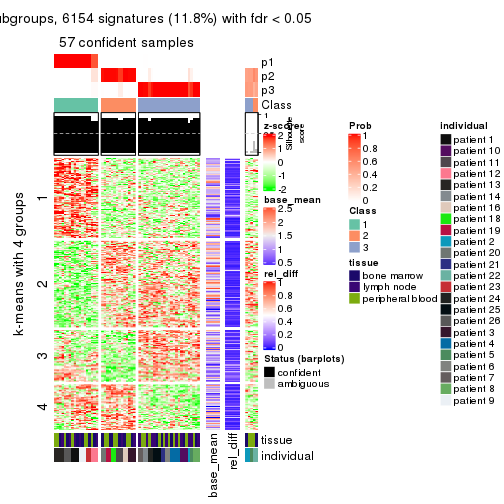</p>

</div>
<div id='tab-SD-mclust-get-signatures-3'>
<pre><code class="r">get_signatures(res, k = 4)
</code></pre>

<p>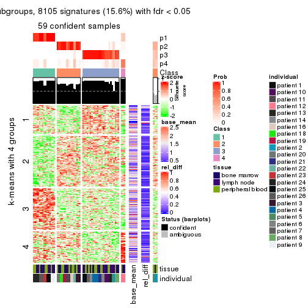</p>

</div>
<div id='tab-SD-mclust-get-signatures-4'>
<pre><code class="r">get_signatures(res, k = 5)
</code></pre>

<p>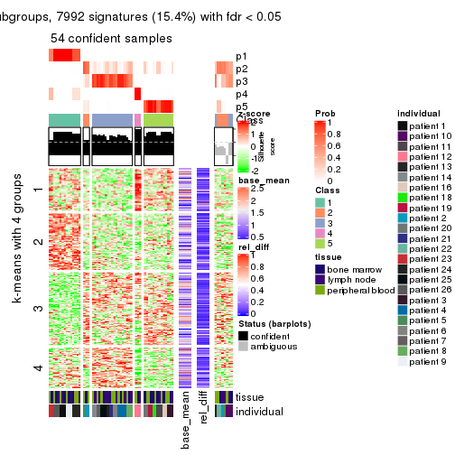</p>

</div>
<div id='tab-SD-mclust-get-signatures-5'>
<pre><code class="r">get_signatures(res, k = 6)
</code></pre>

<p>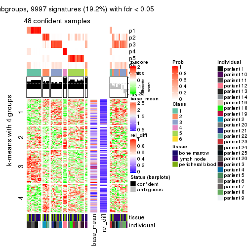</p>

</div>
</div>


Signature heatmaps where rows are not scaled:


<script>
$( function() {
	$( '#tabs-SD-mclust-get-signatures-no-scale' ).tabs();
} );
</script>
<div id='tabs-SD-mclust-get-signatures-no-scale'>
<ul>
<li><a href='#tab-SD-mclust-get-signatures-no-scale-1'>k = 2</a></li>
<li><a href='#tab-SD-mclust-get-signatures-no-scale-2'>k = 3</a></li>
<li><a href='#tab-SD-mclust-get-signatures-no-scale-3'>k = 4</a></li>
<li><a href='#tab-SD-mclust-get-signatures-no-scale-4'>k = 5</a></li>
<li><a href='#tab-SD-mclust-get-signatures-no-scale-5'>k = 6</a></li>
</ul>
<div id='tab-SD-mclust-get-signatures-no-scale-1'>
<pre><code class="r">get_signatures(res, k = 2, scale_rows = FALSE)
</code></pre>

<p>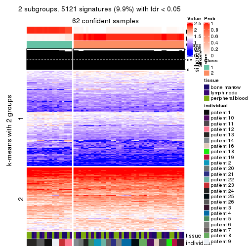</p>

</div>
<div id='tab-SD-mclust-get-signatures-no-scale-2'>
<pre><code class="r">get_signatures(res, k = 3, scale_rows = FALSE)
</code></pre>

<p>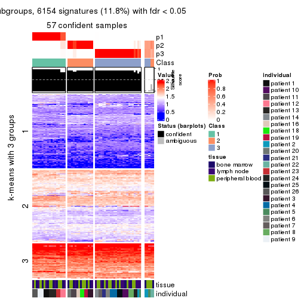</p>

</div>
<div id='tab-SD-mclust-get-signatures-no-scale-3'>
<pre><code class="r">get_signatures(res, k = 4, scale_rows = FALSE)
</code></pre>

<p>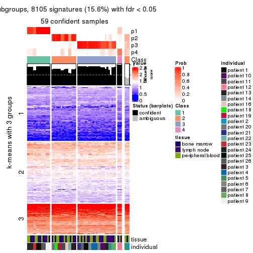</p>

</div>
<div id='tab-SD-mclust-get-signatures-no-scale-4'>
<pre><code class="r">get_signatures(res, k = 5, scale_rows = FALSE)
</code></pre>

<p>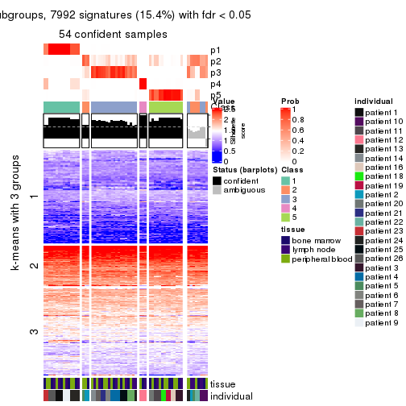</p>

</div>
<div id='tab-SD-mclust-get-signatures-no-scale-5'>
<pre><code class="r">get_signatures(res, k = 6, scale_rows = FALSE)
</code></pre>

<p>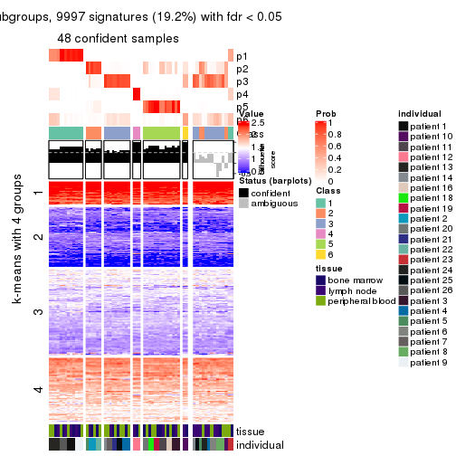</p>

</div>
</div>


Compare the overlap of signatures from different k:

```r
compare_signatures(res)
```

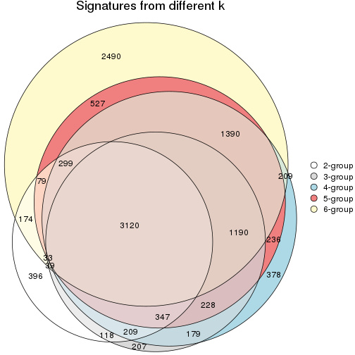

`get_signature()` returns a data frame invisibly. TO get the list of signatures, the function
call should be assigned to a variable explicitly. In following code, if `plot` argument is set
to `FALSE`, no heatmap is plotted while only the differential analysis is performed.

```r
# code only for demonstration
tb = get_signature(res, k = ..., plot = FALSE)
```

An example of the output of `tb` is:

```
#>   which_row         fdr    mean_1    mean_2 scaled_mean_1 scaled_mean_2 km
#> 1        38 0.042760348  8.373488  9.131774    -0.5533452     0.5164555  1
#> 2        40 0.018707592  7.106213  8.469186    -0.6173731     0.5762149  1
#> 3        55 0.019134737 10.221463 11.207825    -0.6159697     0.5749050  1
#> 4        59 0.006059896  5.921854  7.869574    -0.6899429     0.6439467  1
#> 5        60 0.018055526  8.928898 10.211722    -0.6204761     0.5791110  1
#> 6        98 0.009384629 15.714769 14.887706     0.6635654    -0.6193277  2
...
```

The columns in `tb` are:

1. `which_row`: row indices corresponding to the input matrix.
2. `fdr`: FDR for the differential test. 
3. `mean_x`: The mean value in group x.
4. `scaled_mean_x`: The mean value in group x after rows are scaled.
5. `km`: Row groups if k-means clustering is applied to rows.


UMAP plot which shows how samples are separated.


<script>
$( function() {
	$( '#tabs-SD-mclust-dimension-reduction' ).tabs();
} );
</script>
<div id='tabs-SD-mclust-dimension-reduction'>
<ul>
<li><a href='#tab-SD-mclust-dimension-reduction-1'>k = 2</a></li>
<li><a href='#tab-SD-mclust-dimension-reduction-2'>k = 3</a></li>
<li><a href='#tab-SD-mclust-dimension-reduction-3'>k = 4</a></li>
<li><a href='#tab-SD-mclust-dimension-reduction-4'>k = 5</a></li>
<li><a href='#tab-SD-mclust-dimension-reduction-5'>k = 6</a></li>
</ul>
<div id='tab-SD-mclust-dimension-reduction-1'>
<pre><code class="r">dimension_reduction(res, k = 2, method = &quot;UMAP&quot;)
</code></pre>

<p>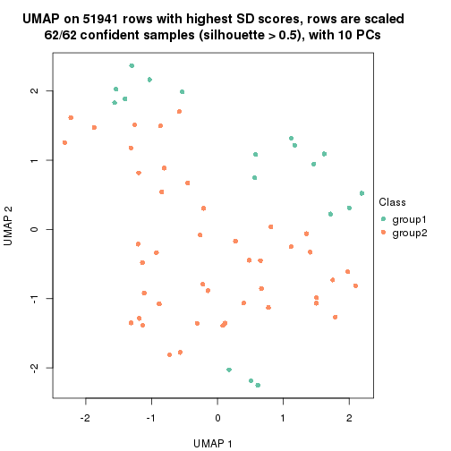</p>

</div>
<div id='tab-SD-mclust-dimension-reduction-2'>
<pre><code class="r">dimension_reduction(res, k = 3, method = &quot;UMAP&quot;)
</code></pre>

<p>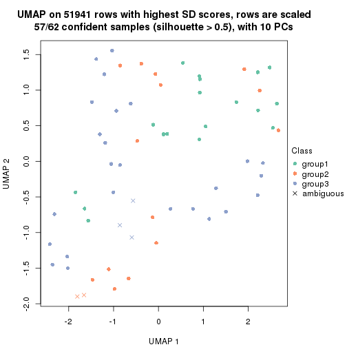</p>

</div>
<div id='tab-SD-mclust-dimension-reduction-3'>
<pre><code class="r">dimension_reduction(res, k = 4, method = &quot;UMAP&quot;)
</code></pre>

<p>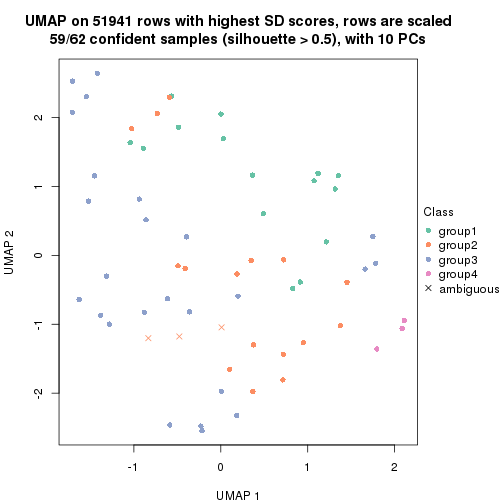</p>

</div>
<div id='tab-SD-mclust-dimension-reduction-4'>
<pre><code class="r">dimension_reduction(res, k = 5, method = &quot;UMAP&quot;)
</code></pre>

<p>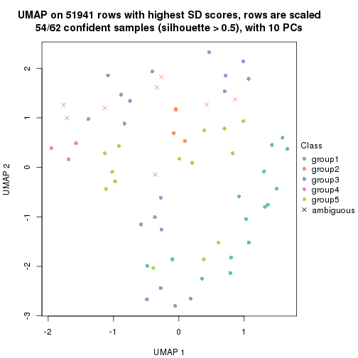</p>

</div>
<div id='tab-SD-mclust-dimension-reduction-5'>
<pre><code class="r">dimension_reduction(res, k = 6, method = &quot;UMAP&quot;)
</code></pre>

<p>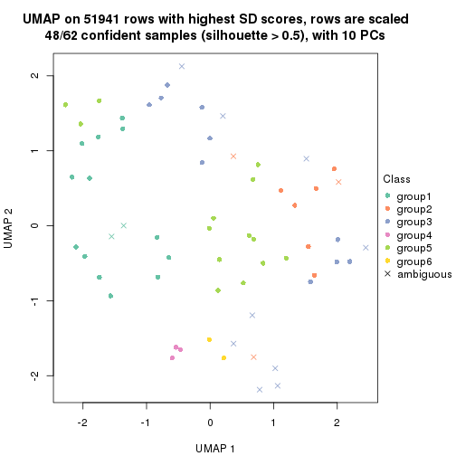</p>

</div>
</div>


Following heatmap shows how subgroups are split when increasing `k`:

```r
collect_classes(res)
```

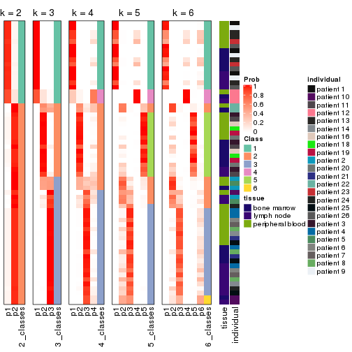


Test correlation between subgroups and known annotations. If the known
annotation is numeric, one-way ANOVA test is applied, and if the known
annotation is discrete, chi-squared contingency table test is applied.

```r
test_to_known_factors(res)
```

```
#>            n tissue(p) individual(p) k
#> SD:mclust 62     0.943      1.95e-05 2
#> SD:mclust 57     0.442      4.01e-08 3
#> SD:mclust 59     0.601      1.94e-11 4
#> SD:mclust 54     0.839      1.40e-13 5
#> SD:mclust 48     0.906      1.59e-14 6
```


If matrix rows can be associated to genes, consider to use `functional_enrichment(res,
...)` to perform function enrichment for the signature genes. See [this vignette](http://bioconductor.org/packages/devel/bioc/vignettes/cola/inst/doc/functional_enrichment.html) for more detailed explanations.


 

---------------------------------------------------


### SD:NMF*


The object with results only for a single top-value method and a single partition method 
can be extracted as:

```r
res = res_list["SD", "NMF"]
# you can also extract it by
# res = res_list["SD:NMF"]
```

A summary of `res` and all the functions that can be applied to it:

```r
res
```

```
#> A 'ConsensusPartition' object with k = 2, 3, 4, 5, 6.
#>   On a matrix with 51941 rows and 62 columns.
#>   Top rows (1000, 2000, 3000, 4000, 5000) are extracted by 'SD' method.
#>   Subgroups are detected by 'NMF' method.
#>   Performed in total 1250 partitions by row resampling.
#>   Best k for subgroups seems to be 2.
#> 
#> Following methods can be applied to this 'ConsensusPartition' object:
#>  [1] "cola_report"             "collect_classes"         "collect_plots"          
#>  [4] "collect_stats"           "colnames"                "compare_signatures"     
#>  [7] "consensus_heatmap"       "dimension_reduction"     "functional_enrichment"  
#> [10] "get_anno_col"            "get_anno"                "get_classes"            
#> [13] "get_consensus"           "get_matrix"              "get_membership"         
#> [16] "get_param"               "get_signatures"          "get_stats"              
#> [19] "is_best_k"               "is_stable_k"             "membership_heatmap"     
#> [22] "ncol"                    "nrow"                    "plot_ecdf"              
#> [25] "rownames"                "select_partition_number" "show"                   
#> [28] "suggest_best_k"          "test_to_known_factors"
```

`collect_plots()` function collects all the plots made from `res` for all `k` (number of partitions)
into one single page to provide an easy and fast comparison between different `k`.

```r
collect_plots(res)
```

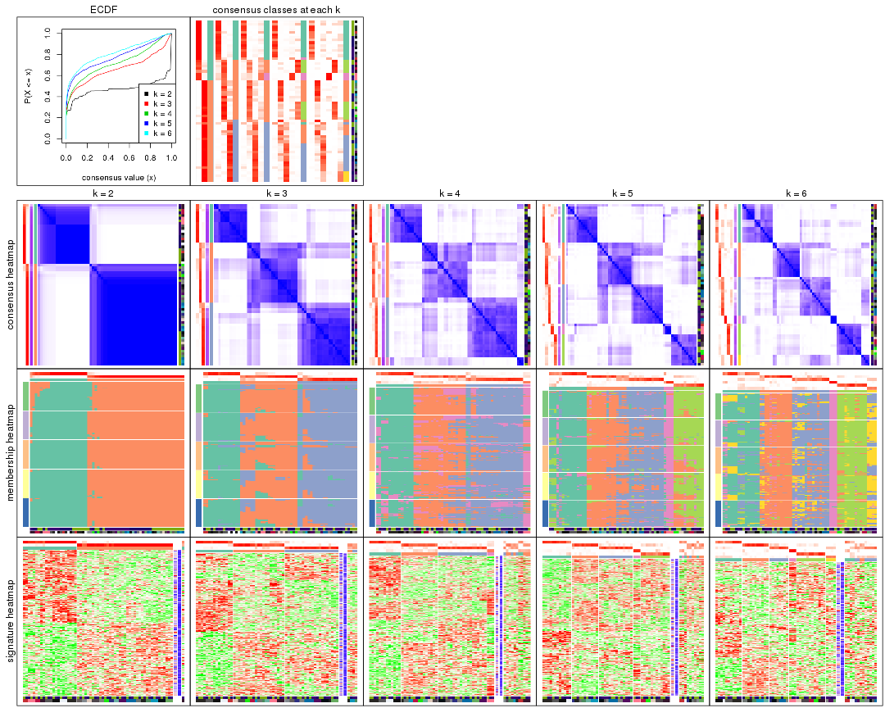

The plots are:

- The first row: a plot of the ECDF (empirical cumulative distribution
  function) curves of the consensus matrix for each `k` and the heatmap of
  predicted classes for each `k`.
- The second row: heatmaps of the consensus matrix for each `k`.
- The third row: heatmaps of the membership matrix for each `k`.
- The fouth row: heatmaps of the signatures for each `k`.

All the plots in panels can be made by individual functions and they are
plotted later in this section.

`select_partition_number()` produces several plots showing different
statistics for choosing "optimized" `k`. There are following statistics:

- ECDF curves of the consensus matrix for each `k`;
- 1-PAC. [The PAC
  score](https://en.wikipedia.org/wiki/Consensus_clustering#Over-interpretation_potential_of_consensus_clustering)
  measures the proportion of the ambiguous subgrouping.
- Mean silhouette score.
- Concordance. The mean probability of fiting the consensus class ids in all
  partitions.
- Area increased. Denote $A_k$ as the area under the ECDF curve for current
  `k`, the area increased is defined as $A_k - A_{k-1}$.
- Rand index. The percent of pairs of samples that are both in a same cluster
  or both are not in a same cluster in the partition of k and k-1.
- Jaccard index. The ratio of pairs of samples are both in a same cluster in
  the partition of k and k-1 and the pairs of samples are both in a same
  cluster in the partition k or k-1.

The detailed explanations of these statistics can be found in [the _cola_
vignette](http://bioconductor.org/packages/devel/bioc/vignettes/cola/inst/doc/cola.html#toc_13).

Generally speaking, lower PAC score, higher mean silhouette score or higher
concordance corresponds to better partition. Rand index and Jaccard index
measure how similar the current partition is compared to partition with `k-1`.
If they are too similar, we won't accept `k` is better than `k-1`.

```r
select_partition_number(res)
```

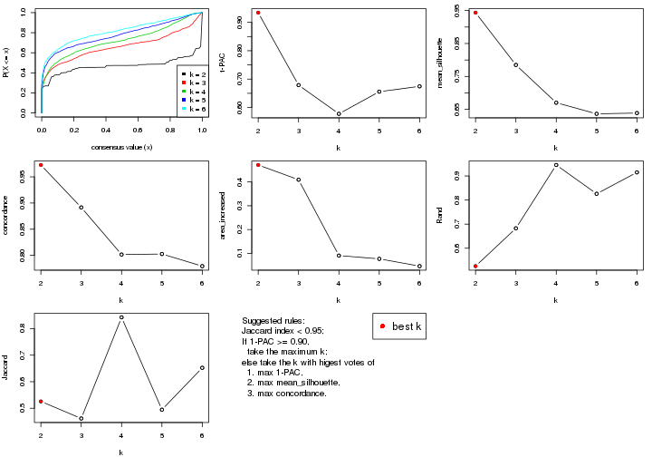

The numeric values for all these statistics can be obtained by `get_stats()`.

```r
get_stats(res)
```

```
#>   k 1-PAC mean_silhouette concordance area_increased  Rand Jaccard
#> 2 2 0.934           0.944       0.973         0.4713 0.526   0.526
#> 3 3 0.679           0.785       0.892         0.4094 0.683   0.461
#> 4 4 0.578           0.670       0.802         0.0907 0.946   0.843
#> 5 5 0.656           0.637       0.803         0.0770 0.826   0.495
#> 6 6 0.675           0.639       0.779         0.0463 0.915   0.652
```

`suggest_best_k()` suggests the best $k$ based on these statistics. The rules are as follows:

- All $k$ with Jaccard index larger than 0.95 are removed because increasing
  $k$ does not provide enough extra information. If all $k$ are removed, it is
  marked as no subgroup is detected.
- For all $k$ with 1-PAC score larger than 0.9, the maximal $k$ is taken as
  the best $k$, and other $k$ are marked as optional $k$.
- If it does not fit the second rule. The $k$ with the maximal vote of the
  highest 1-PAC score, highest mean silhouette, and highest concordance is
  taken as the best $k$.

```r
suggest_best_k(res)
```

```
#> [1] 2
```


Following shows the table of the partitions (You need to click the **show/hide
code output** link to see it). The membership matrix (columns with name `p*`)
is inferred by
[`clue::cl_consensus()`](https://www.rdocumentation.org/link/cl_consensus?package=clue)
function with the `SE` method. Basically the value in the membership matrix
represents the probability to belong to a certain group. The finall class
label for an item is determined with the group with highest probability it
belongs to.

In `get_classes()` function, the entropy is calculated from the membership
matrix and the silhouette score is calculated from the consensus matrix.


<script>
$( function() {
	$( '#tabs-SD-NMF-get-classes' ).tabs();
} );
</script>
<div id='tabs-SD-NMF-get-classes'>
<ul>
<li><a href='#tab-SD-NMF-get-classes-1'>k = 2</a></li>
<li><a href='#tab-SD-NMF-get-classes-2'>k = 3</a></li>
<li><a href='#tab-SD-NMF-get-classes-3'>k = 4</a></li>
<li><a href='#tab-SD-NMF-get-classes-4'>k = 5</a></li>
<li><a href='#tab-SD-NMF-get-classes-5'>k = 6</a></li>
</ul>

<div id='tab-SD-NMF-get-classes-1'>
<p><a id='tab-SD-NMF-get-classes-1-a' style='color:#0366d6' href='#'>show/hide code output</a></p>
<pre><code class="r">cbind(get_classes(res, k = 2), get_membership(res, k = 2))
</code></pre>

<pre><code>#&gt;           class entropy silhouette    p1    p2
#&gt; GSM525314     1  0.0000      0.954 1.000 0.000
#&gt; GSM525315     2  0.0000      0.981 0.000 1.000
#&gt; GSM525316     1  0.3274      0.927 0.940 0.060
#&gt; GSM525317     2  0.0000      0.981 0.000 1.000
#&gt; GSM525318     2  0.0000      0.981 0.000 1.000
#&gt; GSM525319     2  0.0000      0.981 0.000 1.000
#&gt; GSM525320     2  0.0376      0.978 0.004 0.996
#&gt; GSM525321     2  0.0000      0.981 0.000 1.000
#&gt; GSM525322     2  0.0000      0.981 0.000 1.000
#&gt; GSM525323     1  0.0000      0.954 1.000 0.000
#&gt; GSM525324     2  0.0000      0.981 0.000 1.000
#&gt; GSM525325     2  0.0000      0.981 0.000 1.000
#&gt; GSM525326     1  0.2778      0.935 0.952 0.048
#&gt; GSM525327     1  0.0000      0.954 1.000 0.000
#&gt; GSM525328     1  0.0000      0.954 1.000 0.000
#&gt; GSM525329     2  0.7745      0.719 0.228 0.772
#&gt; GSM525330     2  0.0000      0.981 0.000 1.000
#&gt; GSM525331     2  0.2603      0.941 0.044 0.956
#&gt; GSM525332     1  0.5178      0.878 0.884 0.116
#&gt; GSM525333     2  0.0000      0.981 0.000 1.000
#&gt; GSM525334     2  0.2948      0.936 0.052 0.948
#&gt; GSM525335     2  0.0000      0.981 0.000 1.000
#&gt; GSM525336     1  0.0000      0.954 1.000 0.000
#&gt; GSM525337     2  0.0000      0.981 0.000 1.000
#&gt; GSM525338     2  0.0000      0.981 0.000 1.000
#&gt; GSM525339     1  0.0000      0.954 1.000 0.000
#&gt; GSM525340     1  0.0000      0.954 1.000 0.000
#&gt; GSM525341     2  0.0000      0.981 0.000 1.000
#&gt; GSM525342     1  0.6973      0.792 0.812 0.188
#&gt; GSM525343     2  0.0000      0.981 0.000 1.000
#&gt; GSM525344     2  0.0000      0.981 0.000 1.000
#&gt; GSM525345     1  0.0000      0.954 1.000 0.000
#&gt; GSM525346     2  0.0000      0.981 0.000 1.000
#&gt; GSM525347     2  0.0938      0.971 0.012 0.988
#&gt; GSM525348     1  0.2948      0.933 0.948 0.052
#&gt; GSM525349     1  0.0000      0.954 1.000 0.000
#&gt; GSM525350     2  0.0000      0.981 0.000 1.000
#&gt; GSM525351     2  0.6148      0.812 0.152 0.848
#&gt; GSM525352     1  0.4022      0.912 0.920 0.080
#&gt; GSM525353     2  0.0000      0.981 0.000 1.000
#&gt; GSM525354     2  0.0000      0.981 0.000 1.000
#&gt; GSM525355     2  0.0000      0.981 0.000 1.000
#&gt; GSM525356     1  0.0000      0.954 1.000 0.000
#&gt; GSM525357     2  0.0000      0.981 0.000 1.000
#&gt; GSM525358     1  0.0000      0.954 1.000 0.000
#&gt; GSM525359     1  0.0000      0.954 1.000 0.000
#&gt; GSM525360     2  0.0000      0.981 0.000 1.000
#&gt; GSM525361     1  0.9710      0.388 0.600 0.400
#&gt; GSM525362     2  0.0000      0.981 0.000 1.000
#&gt; GSM525363     2  0.0000      0.981 0.000 1.000
#&gt; GSM525364     2  0.0376      0.978 0.004 0.996
#&gt; GSM525365     2  0.0000      0.981 0.000 1.000
#&gt; GSM525366     2  0.0000      0.981 0.000 1.000
#&gt; GSM525367     1  0.0000      0.954 1.000 0.000
#&gt; GSM525368     2  0.0000      0.981 0.000 1.000
#&gt; GSM525369     2  0.0000      0.981 0.000 1.000
#&gt; GSM525370     1  0.2778      0.935 0.952 0.048
#&gt; GSM525371     1  0.0000      0.954 1.000 0.000
#&gt; GSM525372     2  0.7376      0.750 0.208 0.792
#&gt; GSM525373     2  0.0000      0.981 0.000 1.000
#&gt; GSM525374     2  0.0000      0.981 0.000 1.000
#&gt; GSM525375     1  0.0000      0.954 1.000 0.000
</code></pre>

<script>
$('#tab-SD-NMF-get-classes-1-a').parent().next().next().hide();
$('#tab-SD-NMF-get-classes-1-a').click(function(){
  $('#tab-SD-NMF-get-classes-1-a').parent().next().next().toggle();
  return(false);
});
</script>
</div>

<div id='tab-SD-NMF-get-classes-2'>
<p><a id='tab-SD-NMF-get-classes-2-a' style='color:#0366d6' href='#'>show/hide code output</a></p>
<pre><code class="r">cbind(get_classes(res, k = 3), get_membership(res, k = 3))
</code></pre>

<pre><code>#&gt;           class entropy silhouette    p1    p2    p3
#&gt; GSM525314     1  0.1315     0.9403 0.972 0.008 0.020
#&gt; GSM525315     2  0.5621     0.5513 0.000 0.692 0.308
#&gt; GSM525316     2  0.4974     0.6588 0.236 0.764 0.000
#&gt; GSM525317     3  0.1860     0.8700 0.000 0.052 0.948
#&gt; GSM525318     3  0.1170     0.8817 0.016 0.008 0.976
#&gt; GSM525319     2  0.5363     0.6050 0.000 0.724 0.276
#&gt; GSM525320     3  0.1315     0.8824 0.008 0.020 0.972
#&gt; GSM525321     3  0.0848     0.8826 0.008 0.008 0.984
#&gt; GSM525322     3  0.1643     0.8730 0.000 0.044 0.956
#&gt; GSM525323     1  0.1267     0.9399 0.972 0.004 0.024
#&gt; GSM525324     3  0.4235     0.7558 0.000 0.176 0.824
#&gt; GSM525325     2  0.0592     0.8230 0.000 0.988 0.012
#&gt; GSM525326     2  0.4654     0.6944 0.208 0.792 0.000
#&gt; GSM525327     1  0.0829     0.9361 0.984 0.012 0.004
#&gt; GSM525328     1  0.0747     0.9328 0.984 0.016 0.000
#&gt; GSM525329     3  0.4750     0.6839 0.216 0.000 0.784
#&gt; GSM525330     2  0.1753     0.8192 0.000 0.952 0.048
#&gt; GSM525331     2  0.0424     0.8210 0.008 0.992 0.000
#&gt; GSM525332     2  0.2537     0.7970 0.080 0.920 0.000
#&gt; GSM525333     2  0.1643     0.8206 0.000 0.956 0.044
#&gt; GSM525334     3  0.1620     0.8808 0.024 0.012 0.964
#&gt; GSM525335     2  0.4399     0.7135 0.000 0.812 0.188
#&gt; GSM525336     1  0.4504     0.7507 0.804 0.196 0.000
#&gt; GSM525337     2  0.6154     0.3154 0.000 0.592 0.408
#&gt; GSM525338     3  0.0424     0.8816 0.000 0.008 0.992
#&gt; GSM525339     1  0.1643     0.9325 0.956 0.000 0.044
#&gt; GSM525340     1  0.1031     0.9285 0.976 0.024 0.000
#&gt; GSM525341     2  0.6008     0.4145 0.000 0.628 0.372
#&gt; GSM525342     2  0.4062     0.7383 0.164 0.836 0.000
#&gt; GSM525343     3  0.1529     0.8752 0.000 0.040 0.960
#&gt; GSM525344     3  0.1643     0.8730 0.000 0.044 0.956
#&gt; GSM525345     1  0.1636     0.9397 0.964 0.016 0.020
#&gt; GSM525346     3  0.2261     0.8586 0.000 0.068 0.932
#&gt; GSM525347     2  0.0592     0.8202 0.012 0.988 0.000
#&gt; GSM525348     2  0.4702     0.6897 0.212 0.788 0.000
#&gt; GSM525349     1  0.0747     0.9328 0.984 0.016 0.000
#&gt; GSM525350     2  0.1753     0.8193 0.000 0.952 0.048
#&gt; GSM525351     2  0.0424     0.8209 0.008 0.992 0.000
#&gt; GSM525352     2  0.2796     0.7908 0.092 0.908 0.000
#&gt; GSM525353     2  0.0892     0.8234 0.000 0.980 0.020
#&gt; GSM525354     3  0.1015     0.8825 0.012 0.008 0.980
#&gt; GSM525355     2  0.5016     0.6553 0.000 0.760 0.240
#&gt; GSM525356     1  0.4178     0.7828 0.828 0.172 0.000
#&gt; GSM525357     3  0.0747     0.8795 0.016 0.000 0.984
#&gt; GSM525358     1  0.1753     0.9302 0.952 0.000 0.048
#&gt; GSM525359     1  0.1289     0.9375 0.968 0.000 0.032
#&gt; GSM525360     3  0.6274     0.1297 0.000 0.456 0.544
#&gt; GSM525361     2  0.2625     0.7954 0.084 0.916 0.000
#&gt; GSM525362     3  0.1585     0.8778 0.028 0.008 0.964
#&gt; GSM525363     3  0.6305     0.0208 0.000 0.484 0.516
#&gt; GSM525364     3  0.2625     0.8400 0.084 0.000 0.916
#&gt; GSM525365     3  0.2537     0.8429 0.080 0.000 0.920
#&gt; GSM525366     3  0.0747     0.8795 0.016 0.000 0.984
#&gt; GSM525367     1  0.1163     0.9386 0.972 0.000 0.028
#&gt; GSM525368     3  0.1289     0.8772 0.000 0.032 0.968
#&gt; GSM525369     2  0.1529     0.8216 0.000 0.960 0.040
#&gt; GSM525370     2  0.5291     0.6084 0.268 0.732 0.000
#&gt; GSM525371     1  0.1964     0.9246 0.944 0.000 0.056
#&gt; GSM525372     3  0.4702     0.6878 0.212 0.000 0.788
#&gt; GSM525373     3  0.5098     0.6495 0.000 0.248 0.752
#&gt; GSM525374     3  0.1289     0.8730 0.032 0.000 0.968
#&gt; GSM525375     1  0.3340     0.8600 0.880 0.000 0.120
</code></pre>

<script>
$('#tab-SD-NMF-get-classes-2-a').parent().next().next().hide();
$('#tab-SD-NMF-get-classes-2-a').click(function(){
  $('#tab-SD-NMF-get-classes-2-a').parent().next().next().toggle();
  return(false);
});
</script>
</div>

<div id='tab-SD-NMF-get-classes-3'>
<p><a id='tab-SD-NMF-get-classes-3-a' style='color:#0366d6' href='#'>show/hide code output</a></p>
<pre><code class="r">cbind(get_classes(res, k = 4), get_membership(res, k = 4))
</code></pre>

<pre><code>#&gt;           class entropy silhouette    p1    p2    p3    p4
#&gt; GSM525314     1  0.2917     0.8113 0.904 0.020 0.016 0.060
#&gt; GSM525315     2  0.4011     0.5488 0.000 0.784 0.208 0.008
#&gt; GSM525316     2  0.6875     0.3246 0.112 0.520 0.000 0.368
#&gt; GSM525317     3  0.2748     0.8352 0.004 0.072 0.904 0.020
#&gt; GSM525318     3  0.2928     0.8219 0.028 0.012 0.904 0.056
#&gt; GSM525319     2  0.5309     0.4750 0.000 0.700 0.256 0.044
#&gt; GSM525320     3  0.2189     0.8433 0.004 0.044 0.932 0.020
#&gt; GSM525321     3  0.3795     0.8202 0.016 0.112 0.852 0.020
#&gt; GSM525322     3  0.3808     0.7856 0.004 0.160 0.824 0.012
#&gt; GSM525323     1  0.5878     0.6942 0.740 0.056 0.044 0.160
#&gt; GSM525324     3  0.4552     0.7694 0.000 0.172 0.784 0.044
#&gt; GSM525325     2  0.3668     0.6228 0.000 0.808 0.004 0.188
#&gt; GSM525326     4  0.6227     0.9505 0.112 0.212 0.004 0.672
#&gt; GSM525327     1  0.1661     0.8192 0.944 0.000 0.004 0.052
#&gt; GSM525328     1  0.1792     0.8137 0.932 0.000 0.000 0.068
#&gt; GSM525329     3  0.6033     0.4740 0.324 0.024 0.628 0.024
#&gt; GSM525330     2  0.3708     0.6349 0.000 0.832 0.020 0.148
#&gt; GSM525331     2  0.4192     0.6167 0.008 0.780 0.004 0.208
#&gt; GSM525332     2  0.4922     0.5841 0.036 0.736 0.000 0.228
#&gt; GSM525333     2  0.1854     0.6033 0.000 0.940 0.048 0.012
#&gt; GSM525334     3  0.4314     0.7879 0.024 0.152 0.812 0.012
#&gt; GSM525335     2  0.4139     0.5493 0.000 0.800 0.176 0.024
#&gt; GSM525336     1  0.5284     0.3517 0.616 0.016 0.000 0.368
#&gt; GSM525337     2  0.4228     0.5357 0.000 0.760 0.232 0.008
#&gt; GSM525338     3  0.3126     0.8297 0.008 0.092 0.884 0.016
#&gt; GSM525339     1  0.0657     0.8291 0.984 0.000 0.012 0.004
#&gt; GSM525340     1  0.2124     0.8184 0.932 0.028 0.000 0.040
#&gt; GSM525341     2  0.4328     0.5219 0.000 0.748 0.244 0.008
#&gt; GSM525342     2  0.6139     0.3779 0.052 0.544 0.000 0.404
#&gt; GSM525343     3  0.3240     0.8342 0.020 0.060 0.892 0.028
#&gt; GSM525344     3  0.3573     0.8049 0.004 0.132 0.848 0.016
#&gt; GSM525345     1  0.5596     0.7102 0.756 0.048 0.040 0.156
#&gt; GSM525346     3  0.3176     0.8250 0.000 0.036 0.880 0.084
#&gt; GSM525347     2  0.5074     0.4615 0.004 0.656 0.008 0.332
#&gt; GSM525348     4  0.6261     0.9595 0.120 0.204 0.004 0.672
#&gt; GSM525349     1  0.1867     0.8119 0.928 0.000 0.000 0.072
#&gt; GSM525350     2  0.3852     0.6315 0.000 0.808 0.012 0.180
#&gt; GSM525351     2  0.4074     0.6173 0.008 0.792 0.004 0.196
#&gt; GSM525352     2  0.5083     0.5670 0.036 0.716 0.000 0.248
#&gt; GSM525353     2  0.2722     0.5975 0.000 0.904 0.032 0.064
#&gt; GSM525354     3  0.2876     0.8284 0.008 0.092 0.892 0.008
#&gt; GSM525355     2  0.4939     0.5110 0.000 0.740 0.220 0.040
#&gt; GSM525356     1  0.5372     0.1379 0.544 0.012 0.000 0.444
#&gt; GSM525357     3  0.1362     0.8395 0.020 0.012 0.964 0.004
#&gt; GSM525358     1  0.0592     0.8284 0.984 0.000 0.016 0.000
#&gt; GSM525359     1  0.1833     0.8266 0.944 0.000 0.032 0.024
#&gt; GSM525360     2  0.5250     0.0134 0.000 0.552 0.440 0.008
#&gt; GSM525361     2  0.5881     0.3653 0.020 0.524 0.008 0.448
#&gt; GSM525362     3  0.2631     0.8225 0.016 0.008 0.912 0.064
#&gt; GSM525363     3  0.5838     0.2574 0.000 0.444 0.524 0.032
#&gt; GSM525364     3  0.3354     0.8006 0.044 0.000 0.872 0.084
#&gt; GSM525365     3  0.3088     0.8040 0.052 0.000 0.888 0.060
#&gt; GSM525366     3  0.2529     0.8375 0.008 0.024 0.920 0.048
#&gt; GSM525367     1  0.4989     0.7356 0.792 0.020 0.056 0.132
#&gt; GSM525368     3  0.2521     0.8323 0.000 0.024 0.912 0.064
#&gt; GSM525369     2  0.5321     0.5431 0.000 0.672 0.032 0.296
#&gt; GSM525370     4  0.6292     0.9292 0.148 0.172 0.004 0.676
#&gt; GSM525371     1  0.2623     0.8117 0.908 0.000 0.028 0.064
#&gt; GSM525372     3  0.4595     0.6852 0.184 0.000 0.776 0.040
#&gt; GSM525373     3  0.5483     0.2477 0.000 0.448 0.536 0.016
#&gt; GSM525374     3  0.2036     0.8274 0.032 0.000 0.936 0.032
#&gt; GSM525375     1  0.2450     0.7993 0.912 0.000 0.072 0.016
</code></pre>

<script>
$('#tab-SD-NMF-get-classes-3-a').parent().next().next().hide();
$('#tab-SD-NMF-get-classes-3-a').click(function(){
  $('#tab-SD-NMF-get-classes-3-a').parent().next().next().toggle();
  return(false);
});
</script>
</div>

<div id='tab-SD-NMF-get-classes-4'>
<p><a id='tab-SD-NMF-get-classes-4-a' style='color:#0366d6' href='#'>show/hide code output</a></p>
<pre><code class="r">cbind(get_classes(res, k = 5), get_membership(res, k = 5))
</code></pre>

<pre><code>#&gt;           class entropy silhouette    p1    p2    p3    p4    p5
#&gt; GSM525314     1  0.3084    0.74214 0.880 0.004 0.016 0.036 0.064
#&gt; GSM525315     2  0.1502    0.69534 0.000 0.940 0.004 0.000 0.056
#&gt; GSM525316     5  0.0981    0.71953 0.008 0.012 0.000 0.008 0.972
#&gt; GSM525317     3  0.4440    0.77779 0.016 0.156 0.784 0.024 0.020
#&gt; GSM525318     3  0.4608    0.79100 0.036 0.080 0.808 0.032 0.044
#&gt; GSM525319     2  0.1780    0.70728 0.000 0.940 0.008 0.028 0.024
#&gt; GSM525320     3  0.3023    0.82317 0.012 0.104 0.868 0.012 0.004
#&gt; GSM525321     2  0.5348   -0.09720 0.020 0.492 0.468 0.020 0.000
#&gt; GSM525322     2  0.4520    0.37263 0.008 0.644 0.340 0.000 0.008
#&gt; GSM525323     1  0.6069    0.46516 0.564 0.008 0.032 0.044 0.352
#&gt; GSM525324     3  0.4139    0.79268 0.000 0.132 0.784 0.084 0.000
#&gt; GSM525325     5  0.4042    0.78867 0.000 0.212 0.000 0.032 0.756
#&gt; GSM525326     4  0.1764    0.79410 0.012 0.012 0.000 0.940 0.036
#&gt; GSM525327     1  0.1517    0.76054 0.952 0.012 0.004 0.028 0.004
#&gt; GSM525328     1  0.1766    0.75656 0.940 0.012 0.004 0.040 0.004
#&gt; GSM525329     1  0.6735    0.04084 0.488 0.084 0.384 0.036 0.008
#&gt; GSM525330     5  0.4482    0.70339 0.000 0.348 0.000 0.016 0.636
#&gt; GSM525331     5  0.4193    0.74546 0.000 0.304 0.000 0.012 0.684
#&gt; GSM525332     5  0.3353    0.79705 0.000 0.196 0.000 0.008 0.796
#&gt; GSM525333     2  0.3236    0.53794 0.000 0.828 0.000 0.020 0.152
#&gt; GSM525334     2  0.5153    0.51073 0.060 0.688 0.240 0.008 0.004
#&gt; GSM525335     2  0.2387    0.68494 0.000 0.908 0.004 0.040 0.048
#&gt; GSM525336     1  0.4403    0.12773 0.608 0.008 0.000 0.384 0.000
#&gt; GSM525337     2  0.1704    0.68832 0.000 0.928 0.004 0.000 0.068
#&gt; GSM525338     3  0.5084    0.00385 0.020 0.484 0.488 0.008 0.000
#&gt; GSM525339     1  0.0902    0.76991 0.976 0.004 0.008 0.004 0.008
#&gt; GSM525340     1  0.2156    0.76498 0.924 0.004 0.004 0.036 0.032
#&gt; GSM525341     2  0.1205    0.70445 0.000 0.956 0.004 0.000 0.040
#&gt; GSM525342     5  0.1497    0.71455 0.008 0.012 0.012 0.012 0.956
#&gt; GSM525343     3  0.5151    0.71371 0.024 0.208 0.720 0.032 0.016
#&gt; GSM525344     2  0.4549   -0.00885 0.000 0.528 0.464 0.000 0.008
#&gt; GSM525345     1  0.5963    0.54057 0.620 0.008 0.040 0.044 0.288
#&gt; GSM525346     3  0.3038    0.78239 0.000 0.024 0.872 0.088 0.016
#&gt; GSM525347     5  0.6201    0.56026 0.000 0.148 0.004 0.304 0.544
#&gt; GSM525348     4  0.1764    0.79410 0.012 0.012 0.000 0.940 0.036
#&gt; GSM525349     1  0.2130    0.74618 0.920 0.012 0.004 0.060 0.004
#&gt; GSM525350     5  0.4090    0.78090 0.000 0.268 0.000 0.016 0.716
#&gt; GSM525351     5  0.4671    0.71658 0.000 0.332 0.000 0.028 0.640
#&gt; GSM525352     5  0.3001    0.79034 0.004 0.144 0.000 0.008 0.844
#&gt; GSM525353     2  0.4889    0.44425 0.000 0.720 0.000 0.144 0.136
#&gt; GSM525354     2  0.5001   -0.11089 0.016 0.496 0.480 0.008 0.000
#&gt; GSM525355     2  0.2674    0.68986 0.000 0.896 0.012 0.060 0.032
#&gt; GSM525356     4  0.4591    0.03893 0.476 0.004 0.000 0.516 0.004
#&gt; GSM525357     3  0.3947    0.72412 0.008 0.236 0.748 0.008 0.000
#&gt; GSM525358     1  0.0775    0.77005 0.980 0.004 0.004 0.004 0.008
#&gt; GSM525359     1  0.2730    0.76565 0.904 0.012 0.016 0.040 0.028
#&gt; GSM525360     2  0.1443    0.71772 0.000 0.948 0.044 0.004 0.004
#&gt; GSM525361     5  0.2270    0.69331 0.000 0.012 0.052 0.020 0.916
#&gt; GSM525362     3  0.0992    0.82515 0.000 0.024 0.968 0.008 0.000
#&gt; GSM525363     2  0.3276    0.67392 0.000 0.836 0.132 0.032 0.000
#&gt; GSM525364     3  0.1483    0.80581 0.000 0.012 0.952 0.008 0.028
#&gt; GSM525365     3  0.1644    0.82998 0.004 0.048 0.940 0.008 0.000
#&gt; GSM525366     3  0.2894    0.82020 0.000 0.124 0.860 0.008 0.008
#&gt; GSM525367     1  0.5670    0.60513 0.684 0.008 0.048 0.044 0.216
#&gt; GSM525368     3  0.1997    0.80971 0.000 0.024 0.932 0.028 0.016
#&gt; GSM525369     5  0.4967    0.67871 0.000 0.064 0.020 0.188 0.728
#&gt; GSM525370     4  0.1739    0.79377 0.024 0.004 0.000 0.940 0.032
#&gt; GSM525371     1  0.2387    0.73998 0.908 0.012 0.004 0.068 0.008
#&gt; GSM525372     3  0.4127    0.75352 0.144 0.044 0.796 0.016 0.000
#&gt; GSM525373     2  0.2249    0.70499 0.000 0.896 0.096 0.008 0.000
#&gt; GSM525374     3  0.2780    0.82594 0.004 0.112 0.872 0.008 0.004
#&gt; GSM525375     1  0.1834    0.76886 0.940 0.004 0.016 0.032 0.008
</code></pre>

<script>
$('#tab-SD-NMF-get-classes-4-a').parent().next().next().hide();
$('#tab-SD-NMF-get-classes-4-a').click(function(){
  $('#tab-SD-NMF-get-classes-4-a').parent().next().next().toggle();
  return(false);
});
</script>
</div>

<div id='tab-SD-NMF-get-classes-5'>
<p><a id='tab-SD-NMF-get-classes-5-a' style='color:#0366d6' href='#'>show/hide code output</a></p>
<pre><code class="r">cbind(get_classes(res, k = 6), get_membership(res, k = 6))
</code></pre>

<pre><code>#&gt;           class entropy silhouette    p1    p2    p3    p4    p5    p6
#&gt; GSM525314     1  0.5586     0.6875 0.612 0.000 0.172 0.000 0.020 0.196
#&gt; GSM525315     2  0.0547     0.7998 0.000 0.980 0.000 0.000 0.020 0.000
#&gt; GSM525316     5  0.0713     0.8397 0.000 0.000 0.000 0.000 0.972 0.028
#&gt; GSM525317     3  0.2398     0.6051 0.000 0.104 0.876 0.000 0.000 0.020
#&gt; GSM525318     3  0.1700     0.5561 0.000 0.028 0.936 0.000 0.012 0.024
#&gt; GSM525319     2  0.0909     0.7999 0.000 0.968 0.012 0.020 0.000 0.000
#&gt; GSM525320     3  0.3768     0.5318 0.004 0.056 0.812 0.008 0.008 0.112
#&gt; GSM525321     3  0.4002     0.5377 0.008 0.284 0.692 0.000 0.000 0.016
#&gt; GSM525322     2  0.5983    -0.0579 0.004 0.484 0.324 0.000 0.004 0.184
#&gt; GSM525323     1  0.7656     0.4642 0.312 0.000 0.268 0.000 0.208 0.212
#&gt; GSM525324     3  0.6746    -0.0962 0.000 0.088 0.488 0.160 0.000 0.264
#&gt; GSM525325     5  0.2048     0.8605 0.000 0.120 0.000 0.000 0.880 0.000
#&gt; GSM525326     4  0.0291     0.9929 0.004 0.000 0.000 0.992 0.004 0.000
#&gt; GSM525327     1  0.1121     0.6528 0.964 0.004 0.008 0.008 0.000 0.016
#&gt; GSM525328     1  0.1419     0.6470 0.952 0.004 0.012 0.016 0.000 0.016
#&gt; GSM525329     3  0.5765     0.3418 0.136 0.060 0.632 0.000 0.000 0.172
#&gt; GSM525330     5  0.2809     0.8457 0.000 0.168 0.004 0.000 0.824 0.004
#&gt; GSM525331     5  0.2913     0.8385 0.000 0.180 0.004 0.000 0.812 0.004
#&gt; GSM525332     5  0.1701     0.8687 0.000 0.072 0.000 0.000 0.920 0.008
#&gt; GSM525333     2  0.2019     0.7511 0.000 0.900 0.000 0.012 0.088 0.000
#&gt; GSM525334     3  0.5591     0.4138 0.024 0.380 0.528 0.000 0.008 0.060
#&gt; GSM525335     2  0.3118     0.7696 0.000 0.860 0.048 0.068 0.020 0.004
#&gt; GSM525336     1  0.3508     0.4311 0.704 0.000 0.000 0.292 0.000 0.004
#&gt; GSM525337     2  0.0858     0.7997 0.000 0.968 0.004 0.000 0.028 0.000
#&gt; GSM525338     3  0.3791     0.5455 0.004 0.300 0.688 0.000 0.000 0.008
#&gt; GSM525339     1  0.4573     0.7148 0.688 0.000 0.104 0.000 0.000 0.208
#&gt; GSM525340     1  0.5162     0.7104 0.668 0.000 0.112 0.004 0.016 0.200
#&gt; GSM525341     2  0.0547     0.7998 0.000 0.980 0.000 0.000 0.020 0.000
#&gt; GSM525342     5  0.0790     0.8388 0.000 0.000 0.000 0.000 0.968 0.032
#&gt; GSM525343     3  0.1951     0.5955 0.000 0.076 0.908 0.000 0.000 0.016
#&gt; GSM525344     2  0.6182    -0.2703 0.004 0.380 0.356 0.000 0.000 0.260
#&gt; GSM525345     1  0.7560     0.4705 0.320 0.000 0.296 0.000 0.164 0.220
#&gt; GSM525346     6  0.4544     0.8700 0.000 0.000 0.320 0.044 0.004 0.632
#&gt; GSM525347     5  0.4612     0.7916 0.004 0.132 0.004 0.092 0.748 0.020
#&gt; GSM525348     4  0.0146     0.9943 0.004 0.000 0.000 0.996 0.000 0.000
#&gt; GSM525349     1  0.1414     0.6458 0.952 0.004 0.012 0.020 0.000 0.012
#&gt; GSM525350     5  0.2196     0.8675 0.000 0.108 0.004 0.000 0.884 0.004
#&gt; GSM525351     5  0.3163     0.8107 0.000 0.212 0.004 0.000 0.780 0.004
#&gt; GSM525352     5  0.1524     0.8659 0.000 0.060 0.000 0.000 0.932 0.008
#&gt; GSM525353     2  0.4145     0.5589 0.000 0.700 0.000 0.252 0.048 0.000
#&gt; GSM525354     3  0.4239     0.5680 0.016 0.264 0.696 0.000 0.000 0.024
#&gt; GSM525355     2  0.3550     0.7262 0.000 0.804 0.044 0.144 0.004 0.004
#&gt; GSM525356     1  0.3804     0.2291 0.576 0.000 0.000 0.424 0.000 0.000
#&gt; GSM525357     3  0.3610     0.5925 0.004 0.152 0.792 0.000 0.000 0.052
#&gt; GSM525358     1  0.4573     0.7148 0.688 0.000 0.104 0.000 0.000 0.208
#&gt; GSM525359     1  0.3801     0.7148 0.784 0.000 0.060 0.000 0.008 0.148
#&gt; GSM525360     2  0.0717     0.7972 0.000 0.976 0.016 0.000 0.000 0.008
#&gt; GSM525361     5  0.2003     0.8018 0.000 0.000 0.000 0.000 0.884 0.116
#&gt; GSM525362     3  0.3273     0.3905 0.000 0.008 0.776 0.004 0.000 0.212
#&gt; GSM525363     2  0.2402     0.7652 0.000 0.896 0.032 0.012 0.000 0.060
#&gt; GSM525364     6  0.4025     0.8725 0.000 0.000 0.312 0.004 0.016 0.668
#&gt; GSM525365     3  0.4098     0.2495 0.000 0.032 0.676 0.000 0.000 0.292
#&gt; GSM525366     6  0.4272     0.8253 0.000 0.044 0.288 0.000 0.000 0.668
#&gt; GSM525367     1  0.7135     0.5765 0.432 0.000 0.256 0.000 0.112 0.200
#&gt; GSM525368     6  0.3955     0.8884 0.000 0.000 0.316 0.012 0.004 0.668
#&gt; GSM525369     5  0.4074     0.6641 0.004 0.020 0.000 0.004 0.696 0.276
#&gt; GSM525370     4  0.0000     0.9927 0.000 0.000 0.000 1.000 0.000 0.000
#&gt; GSM525371     1  0.2256     0.6231 0.908 0.004 0.008 0.032 0.000 0.048
#&gt; GSM525372     3  0.4568     0.2146 0.028 0.020 0.652 0.000 0.000 0.300
#&gt; GSM525373     2  0.1984     0.7689 0.000 0.912 0.032 0.000 0.000 0.056
#&gt; GSM525374     3  0.4517     0.2249 0.000 0.060 0.648 0.000 0.000 0.292
#&gt; GSM525375     1  0.3948     0.7170 0.748 0.000 0.064 0.000 0.000 0.188
</code></pre>

<script>
$('#tab-SD-NMF-get-classes-5-a').parent().next().next().hide();
$('#tab-SD-NMF-get-classes-5-a').click(function(){
  $('#tab-SD-NMF-get-classes-5-a').parent().next().next().toggle();
  return(false);
});
</script>
</div>
</div>

Heatmaps for the consensus matrix. It visualizes the probability of two
samples to be in a same group.


<script>
$( function() {
	$( '#tabs-SD-NMF-consensus-heatmap' ).tabs();
} );
</script>
<div id='tabs-SD-NMF-consensus-heatmap'>
<ul>
<li><a href='#tab-SD-NMF-consensus-heatmap-1'>k = 2</a></li>
<li><a href='#tab-SD-NMF-consensus-heatmap-2'>k = 3</a></li>
<li><a href='#tab-SD-NMF-consensus-heatmap-3'>k = 4</a></li>
<li><a href='#tab-SD-NMF-consensus-heatmap-4'>k = 5</a></li>
<li><a href='#tab-SD-NMF-consensus-heatmap-5'>k = 6</a></li>
</ul>
<div id='tab-SD-NMF-consensus-heatmap-1'>
<pre><code class="r">consensus_heatmap(res, k = 2)
</code></pre>

<p>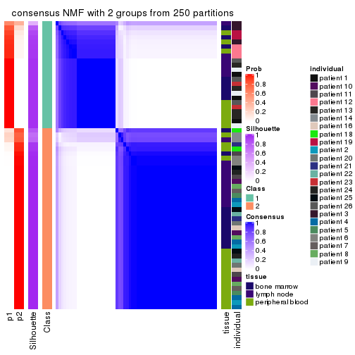</p>

</div>
<div id='tab-SD-NMF-consensus-heatmap-2'>
<pre><code class="r">consensus_heatmap(res, k = 3)
</code></pre>

<p>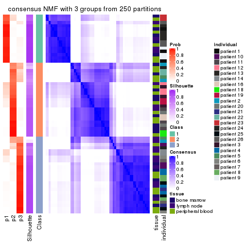</p>

</div>
<div id='tab-SD-NMF-consensus-heatmap-3'>
<pre><code class="r">consensus_heatmap(res, k = 4)
</code></pre>

<p></p>

</div>
<div id='tab-SD-NMF-consensus-heatmap-4'>
<pre><code class="r">consensus_heatmap(res, k = 5)
</code></pre>

<p>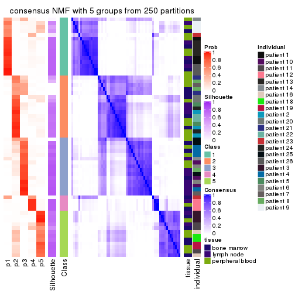</p>

</div>
<div id='tab-SD-NMF-consensus-heatmap-5'>
<pre><code class="r">consensus_heatmap(res, k = 6)
</code></pre>

<p>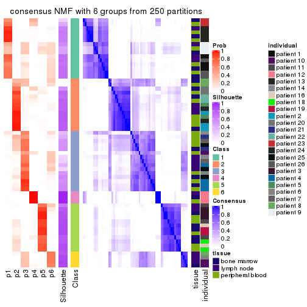</p>

</div>
</div>

Heatmaps for the membership of samples in all partitions to see how consistent they are:


<script>
$( function() {
	$( '#tabs-SD-NMF-membership-heatmap' ).tabs();
} );
</script>
<div id='tabs-SD-NMF-membership-heatmap'>
<ul>
<li><a href='#tab-SD-NMF-membership-heatmap-1'>k = 2</a></li>
<li><a href='#tab-SD-NMF-membership-heatmap-2'>k = 3</a></li>
<li><a href='#tab-SD-NMF-membership-heatmap-3'>k = 4</a></li>
<li><a href='#tab-SD-NMF-membership-heatmap-4'>k = 5</a></li>
<li><a href='#tab-SD-NMF-membership-heatmap-5'>k = 6</a></li>
</ul>
<div id='tab-SD-NMF-membership-heatmap-1'>
<pre><code class="r">membership_heatmap(res, k = 2)
</code></pre>

<p>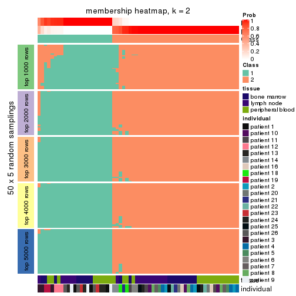</p>

</div>
<div id='tab-SD-NMF-membership-heatmap-2'>
<pre><code class="r">membership_heatmap(res, k = 3)
</code></pre>

<p>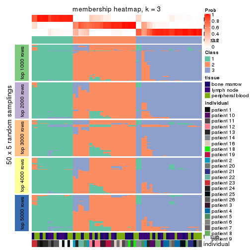</p>

</div>
<div id='tab-SD-NMF-membership-heatmap-3'>
<pre><code class="r">membership_heatmap(res, k = 4)
</code></pre>

<p>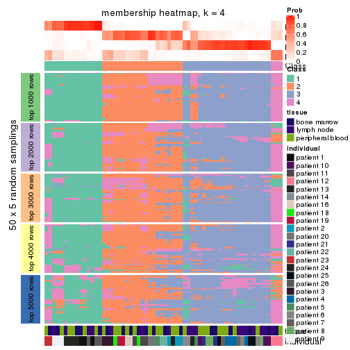</p>

</div>
<div id='tab-SD-NMF-membership-heatmap-4'>
<pre><code class="r">membership_heatmap(res, k = 5)
</code></pre>

<p>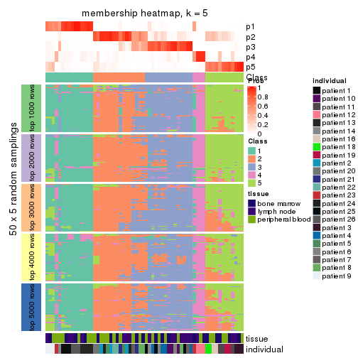</p>

</div>
<div id='tab-SD-NMF-membership-heatmap-5'>
<pre><code class="r">membership_heatmap(res, k = 6)
</code></pre>

<p>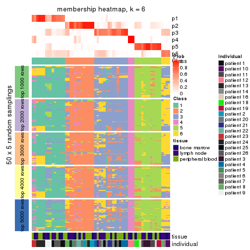</p>

</div>
</div>

As soon as we have had the classes for columns, we can look for signatures
which are significantly different between classes which can be candidate marks
for certain classes. Following are the heatmaps for signatures.


Signature heatmaps where rows are scaled:


<script>
$( function() {
	$( '#tabs-SD-NMF-get-signatures' ).tabs();
} );
</script>
<div id='tabs-SD-NMF-get-signatures'>
<ul>
<li><a href='#tab-SD-NMF-get-signatures-1'>k = 2</a></li>
<li><a href='#tab-SD-NMF-get-signatures-2'>k = 3</a></li>
<li><a href='#tab-SD-NMF-get-signatures-3'>k = 4</a></li>
<li><a href='#tab-SD-NMF-get-signatures-4'>k = 5</a></li>
<li><a href='#tab-SD-NMF-get-signatures-5'>k = 6</a></li>
</ul>
<div id='tab-SD-NMF-get-signatures-1'>
<pre><code class="r">get_signatures(res, k = 2)
</code></pre>

<p>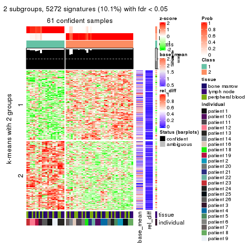</p>

</div>
<div id='tab-SD-NMF-get-signatures-2'>
<pre><code class="r">get_signatures(res, k = 3)
</code></pre>

<p>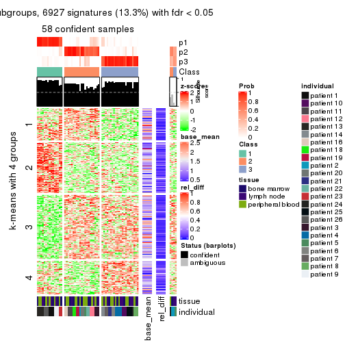</p>

</div>
<div id='tab-SD-NMF-get-signatures-3'>
<pre><code class="r">get_signatures(res, k = 4)
</code></pre>

<p>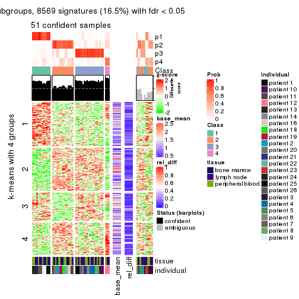</p>

</div>
<div id='tab-SD-NMF-get-signatures-4'>
<pre><code class="r">get_signatures(res, k = 5)
</code></pre>

<p>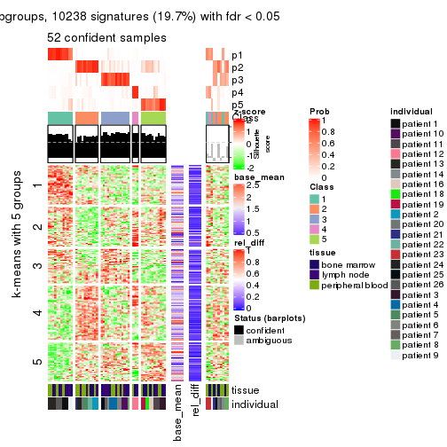</p>

</div>
<div id='tab-SD-NMF-get-signatures-5'>
<pre><code class="r">get_signatures(res, k = 6)
</code></pre>

<p>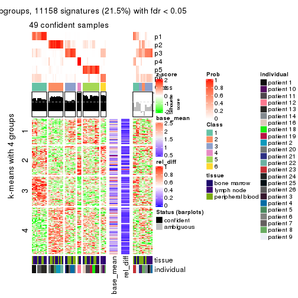</p>

</div>
</div>


Signature heatmaps where rows are not scaled:


<script>
$( function() {
	$( '#tabs-SD-NMF-get-signatures-no-scale' ).tabs();
} );
</script>
<div id='tabs-SD-NMF-get-signatures-no-scale'>
<ul>
<li><a href='#tab-SD-NMF-get-signatures-no-scale-1'>k = 2</a></li>
<li><a href='#tab-SD-NMF-get-signatures-no-scale-2'>k = 3</a></li>
<li><a href='#tab-SD-NMF-get-signatures-no-scale-3'>k = 4</a></li>
<li><a href='#tab-SD-NMF-get-signatures-no-scale-4'>k = 5</a></li>
<li><a href='#tab-SD-NMF-get-signatures-no-scale-5'>k = 6</a></li>
</ul>
<div id='tab-SD-NMF-get-signatures-no-scale-1'>
<pre><code class="r">get_signatures(res, k = 2, scale_rows = FALSE)
</code></pre>

<p>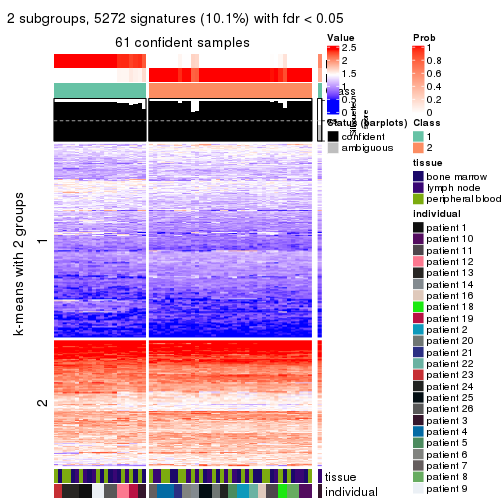</p>

</div>
<div id='tab-SD-NMF-get-signatures-no-scale-2'>
<pre><code class="r">get_signatures(res, k = 3, scale_rows = FALSE)
</code></pre>

<p>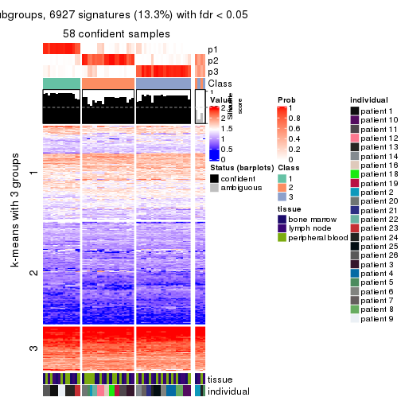</p>

</div>
<div id='tab-SD-NMF-get-signatures-no-scale-3'>
<pre><code class="r">get_signatures(res, k = 4, scale_rows = FALSE)
</code></pre>

<p>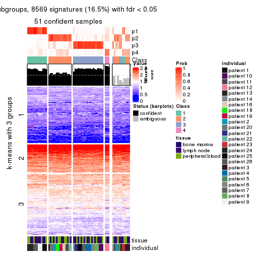</p>

</div>
<div id='tab-SD-NMF-get-signatures-no-scale-4'>
<pre><code class="r">get_signatures(res, k = 5, scale_rows = FALSE)
</code></pre>

<p>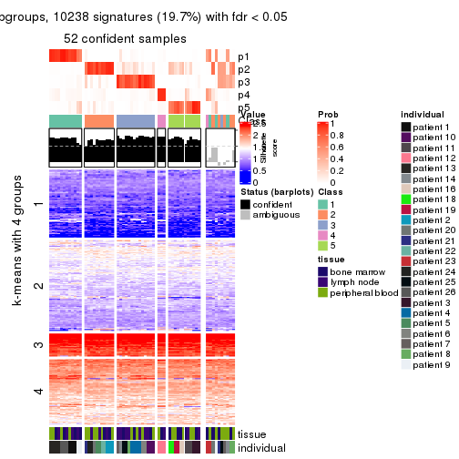</p>

</div>
<div id='tab-SD-NMF-get-signatures-no-scale-5'>
<pre><code class="r">get_signatures(res, k = 6, scale_rows = FALSE)
</code></pre>

<p>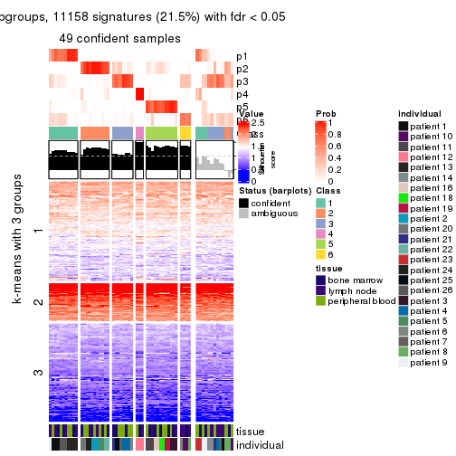</p>

</div>
</div>


Compare the overlap of signatures from different k:

```r
compare_signatures(res)
```

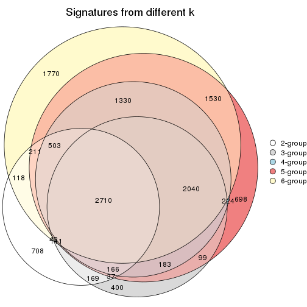

`get_signature()` returns a data frame invisibly. TO get the list of signatures, the function
call should be assigned to a variable explicitly. In following code, if `plot` argument is set
to `FALSE`, no heatmap is plotted while only the differential analysis is performed.

```r
# code only for demonstration
tb = get_signature(res, k = ..., plot = FALSE)
```

An example of the output of `tb` is:

```
#>   which_row         fdr    mean_1    mean_2 scaled_mean_1 scaled_mean_2 km
#> 1        38 0.042760348  8.373488  9.131774    -0.5533452     0.5164555  1
#> 2        40 0.018707592  7.106213  8.469186    -0.6173731     0.5762149  1
#> 3        55 0.019134737 10.221463 11.207825    -0.6159697     0.5749050  1
#> 4        59 0.006059896  5.921854  7.869574    -0.6899429     0.6439467  1
#> 5        60 0.018055526  8.928898 10.211722    -0.6204761     0.5791110  1
#> 6        98 0.009384629 15.714769 14.887706     0.6635654    -0.6193277  2
...
```

The columns in `tb` are:

1. `which_row`: row indices corresponding to the input matrix.
2. `fdr`: FDR for the differential test. 
3. `mean_x`: The mean value in group x.
4. `scaled_mean_x`: The mean value in group x after rows are scaled.
5. `km`: Row groups if k-means clustering is applied to rows.


UMAP plot which shows how samples are separated.


<script>
$( function() {
	$( '#tabs-SD-NMF-dimension-reduction' ).tabs();
} );
</script>
<div id='tabs-SD-NMF-dimension-reduction'>
<ul>
<li><a href='#tab-SD-NMF-dimension-reduction-1'>k = 2</a></li>
<li><a href='#tab-SD-NMF-dimension-reduction-2'>k = 3</a></li>
<li><a href='#tab-SD-NMF-dimension-reduction-3'>k = 4</a></li>
<li><a href='#tab-SD-NMF-dimension-reduction-4'>k = 5</a></li>
<li><a href='#tab-SD-NMF-dimension-reduction-5'>k = 6</a></li>
</ul>
<div id='tab-SD-NMF-dimension-reduction-1'>
<pre><code class="r">dimension_reduction(res, k = 2, method = &quot;UMAP&quot;)
</code></pre>

<p>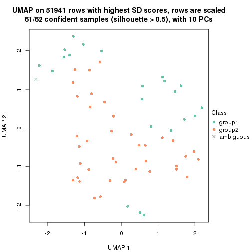</p>

</div>
<div id='tab-SD-NMF-dimension-reduction-2'>
<pre><code class="r">dimension_reduction(res, k = 3, method = &quot;UMAP&quot;)
</code></pre>

<p>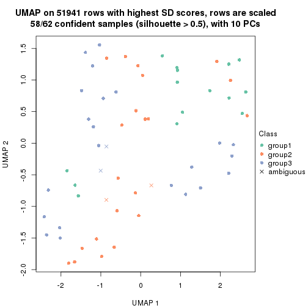</p>

</div>
<div id='tab-SD-NMF-dimension-reduction-3'>
<pre><code class="r">dimension_reduction(res, k = 4, method = &quot;UMAP&quot;)
</code></pre>

<p>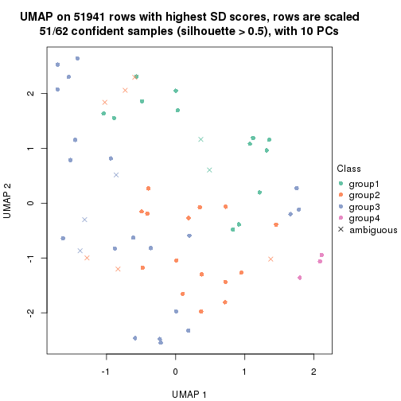</p>

</div>
<div id='tab-SD-NMF-dimension-reduction-4'>
<pre><code class="r">dimension_reduction(res, k = 5, method = &quot;UMAP&quot;)
</code></pre>

<p>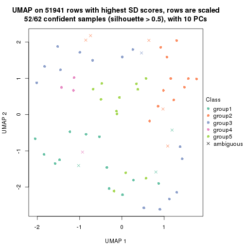</p>

</div>
<div id='tab-SD-NMF-dimension-reduction-5'>
<pre><code class="r">dimension_reduction(res, k = 6, method = &quot;UMAP&quot;)
</code></pre>

<p>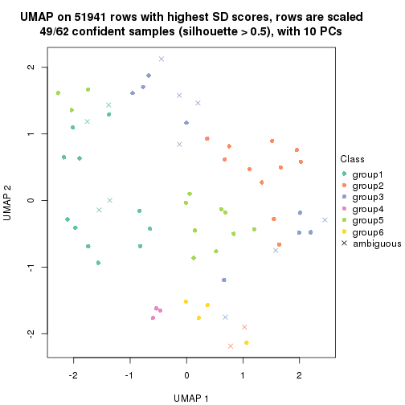</p>

</div>
</div>


Following heatmap shows how subgroups are split when increasing `k`:

```r
collect_classes(res)
```

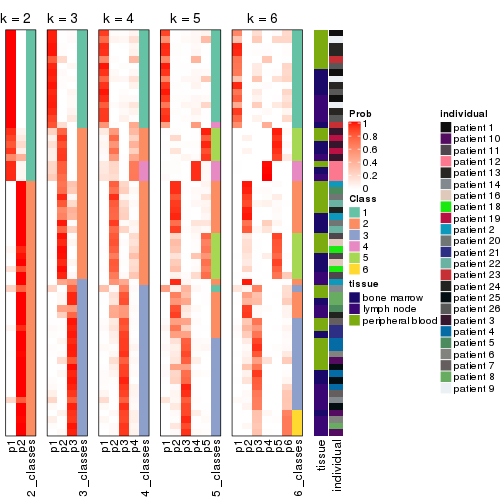


Test correlation between subgroups and known annotations. If the known
annotation is numeric, one-way ANOVA test is applied, and if the known
annotation is discrete, chi-squared contingency table test is applied.

```r
test_to_known_factors(res)
```

```
#>         n tissue(p) individual(p) k
#> SD:NMF 61     0.785      2.74e-05 2
#> SD:NMF 58     0.551      5.70e-08 3
#> SD:NMF 51     0.654      4.55e-10 4
#> SD:NMF 52     0.753      1.03e-11 5
#> SD:NMF 49     0.450      4.73e-12 6
```


If matrix rows can be associated to genes, consider to use `functional_enrichment(res,
...)` to perform function enrichment for the signature genes. See [this vignette](http://bioconductor.org/packages/devel/bioc/vignettes/cola/inst/doc/functional_enrichment.html) for more detailed explanations.


 

---------------------------------------------------


### CV:hclust


The object with results only for a single top-value method and a single partition method 
can be extracted as:

```r
res = res_list["CV", "hclust"]
# you can also extract it by
# res = res_list["CV:hclust"]
```

A summary of `res` and all the functions that can be applied to it:

```r
res
```

```
#> A 'ConsensusPartition' object with k = 2, 3, 4, 5, 6.
#>   On a matrix with 51941 rows and 62 columns.
#>   Top rows (1000, 2000, 3000, 4000, 5000) are extracted by 'CV' method.
#>   Subgroups are detected by 'hclust' method.
#>   Performed in total 1250 partitions by row resampling.
#>   Best k for subgroups seems to be 2.
#> 
#> Following methods can be applied to this 'ConsensusPartition' object:
#>  [1] "cola_report"             "collect_classes"         "collect_plots"          
#>  [4] "collect_stats"           "colnames"                "compare_signatures"     
#>  [7] "consensus_heatmap"       "dimension_reduction"     "functional_enrichment"  
#> [10] "get_anno_col"            "get_anno"                "get_classes"            
#> [13] "get_consensus"           "get_matrix"              "get_membership"         
#> [16] "get_param"               "get_signatures"          "get_stats"              
#> [19] "is_best_k"               "is_stable_k"             "membership_heatmap"     
#> [22] "ncol"                    "nrow"                    "plot_ecdf"              
#> [25] "rownames"                "select_partition_number" "show"                   
#> [28] "suggest_best_k"          "test_to_known_factors"
```

`collect_plots()` function collects all the plots made from `res` for all `k` (number of partitions)
into one single page to provide an easy and fast comparison between different `k`.

```r
collect_plots(res)
```

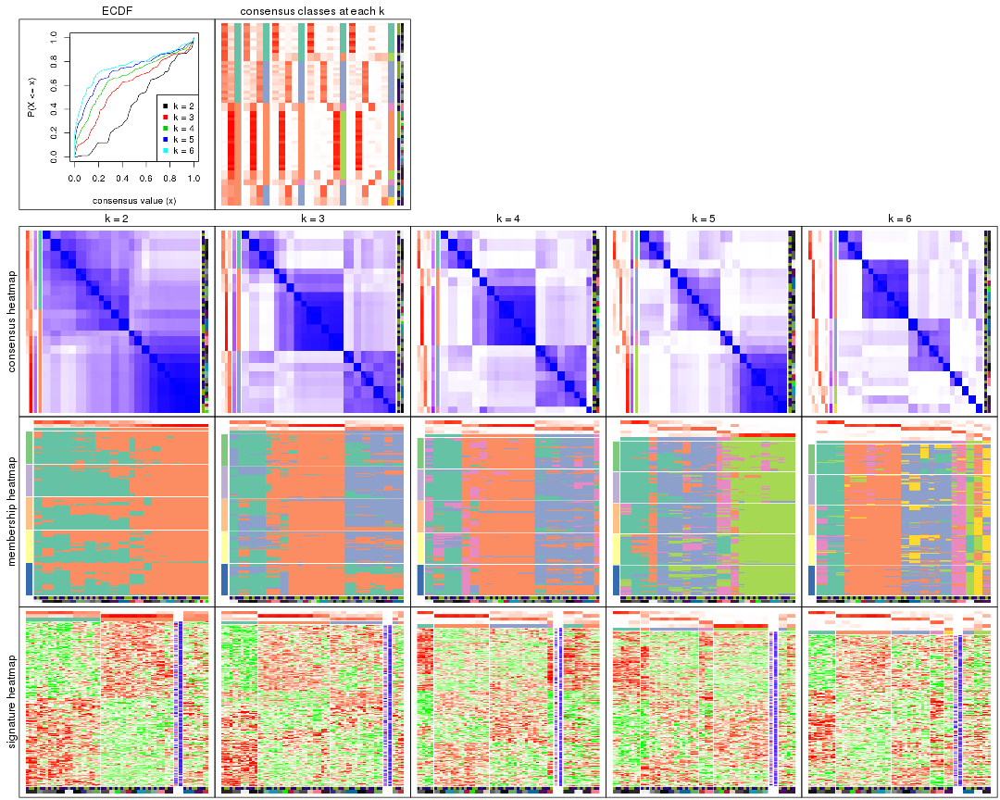

The plots are:

- The first row: a plot of the ECDF (empirical cumulative distribution
  function) curves of the consensus matrix for each `k` and the heatmap of
  predicted classes for each `k`.
- The second row: heatmaps of the consensus matrix for each `k`.
- The third row: heatmaps of the membership matrix for each `k`.
- The fouth row: heatmaps of the signatures for each `k`.

All the plots in panels can be made by individual functions and they are
plotted later in this section.

`select_partition_number()` produces several plots showing different
statistics for choosing "optimized" `k`. There are following statistics:

- ECDF curves of the consensus matrix for each `k`;
- 1-PAC. [The PAC
  score](https://en.wikipedia.org/wiki/Consensus_clustering#Over-interpretation_potential_of_consensus_clustering)
  measures the proportion of the ambiguous subgrouping.
- Mean silhouette score.
- Concordance. The mean probability of fiting the consensus class ids in all
  partitions.
- Area increased. Denote $A_k$ as the area under the ECDF curve for current
  `k`, the area increased is defined as $A_k - A_{k-1}$.
- Rand index. The percent of pairs of samples that are both in a same cluster
  or both are not in a same cluster in the partition of k and k-1.
- Jaccard index. The ratio of pairs of samples are both in a same cluster in
  the partition of k and k-1 and the pairs of samples are both in a same
  cluster in the partition k or k-1.

The detailed explanations of these statistics can be found in [the _cola_
vignette](http://bioconductor.org/packages/devel/bioc/vignettes/cola/inst/doc/cola.html#toc_13).

Generally speaking, lower PAC score, higher mean silhouette score or higher
concordance corresponds to better partition. Rand index and Jaccard index
measure how similar the current partition is compared to partition with `k-1`.
If they are too similar, we won't accept `k` is better than `k-1`.

```r
select_partition_number(res)
```

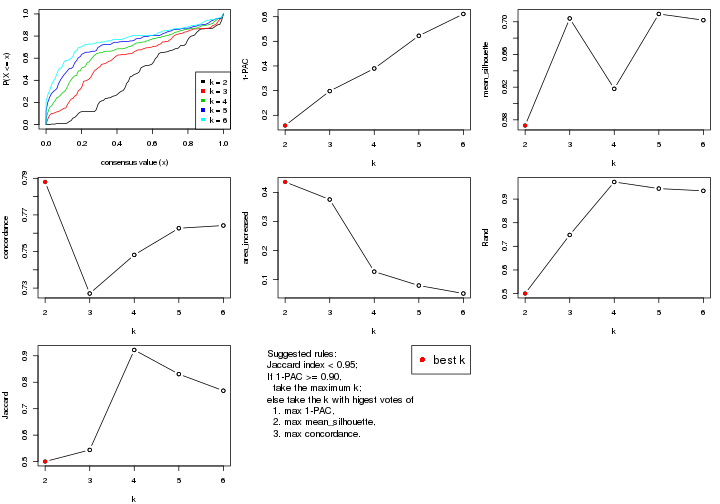

The numeric values for all these statistics can be obtained by `get_stats()`.

```r
get_stats(res)
```

```
#>   k 1-PAC mean_silhouette concordance area_increased  Rand Jaccard
#> 2 2 0.158           0.573       0.788         0.4357 0.500   0.500
#> 3 3 0.298           0.704       0.727         0.3754 0.748   0.544
#> 4 4 0.390           0.618       0.748         0.1275 0.973   0.922
#> 5 5 0.523           0.710       0.763         0.0798 0.944   0.831
#> 6 6 0.611           0.702       0.764         0.0523 0.935   0.768
```

`suggest_best_k()` suggests the best $k$ based on these statistics. The rules are as follows:

- All $k$ with Jaccard index larger than 0.95 are removed because increasing
  $k$ does not provide enough extra information. If all $k$ are removed, it is
  marked as no subgroup is detected.
- For all $k$ with 1-PAC score larger than 0.9, the maximal $k$ is taken as
  the best $k$, and other $k$ are marked as optional $k$.
- If it does not fit the second rule. The $k$ with the maximal vote of the
  highest 1-PAC score, highest mean silhouette, and highest concordance is
  taken as the best $k$.

```r
suggest_best_k(res)
```

```
#> [1] 2
```


Following shows the table of the partitions (You need to click the **show/hide
code output** link to see it). The membership matrix (columns with name `p*`)
is inferred by
[`clue::cl_consensus()`](https://www.rdocumentation.org/link/cl_consensus?package=clue)
function with the `SE` method. Basically the value in the membership matrix
represents the probability to belong to a certain group. The finall class
label for an item is determined with the group with highest probability it
belongs to.

In `get_classes()` function, the entropy is calculated from the membership
matrix and the silhouette score is calculated from the consensus matrix.


<script>
$( function() {
	$( '#tabs-CV-hclust-get-classes' ).tabs();
} );
</script>
<div id='tabs-CV-hclust-get-classes'>
<ul>
<li><a href='#tab-CV-hclust-get-classes-1'>k = 2</a></li>
<li><a href='#tab-CV-hclust-get-classes-2'>k = 3</a></li>
<li><a href='#tab-CV-hclust-get-classes-3'>k = 4</a></li>
<li><a href='#tab-CV-hclust-get-classes-4'>k = 5</a></li>
<li><a href='#tab-CV-hclust-get-classes-5'>k = 6</a></li>
</ul>

<div id='tab-CV-hclust-get-classes-1'>
<p><a id='tab-CV-hclust-get-classes-1-a' style='color:#0366d6' href='#'>show/hide code output</a></p>
<pre><code class="r">cbind(get_classes(res, k = 2), get_membership(res, k = 2))
</code></pre>

<pre><code>#&gt;           class entropy silhouette    p1    p2
#&gt; GSM525314     1  0.5294     0.6942 0.880 0.120
#&gt; GSM525315     2  0.0938     0.7703 0.012 0.988
#&gt; GSM525316     2  0.6048     0.6643 0.148 0.852
#&gt; GSM525317     2  0.9977    -0.3177 0.472 0.528
#&gt; GSM525318     2  0.9977    -0.3177 0.472 0.528
#&gt; GSM525319     2  0.0000     0.7725 0.000 1.000
#&gt; GSM525320     1  0.9963     0.5046 0.536 0.464
#&gt; GSM525321     1  0.8713     0.7106 0.708 0.292
#&gt; GSM525322     1  0.9970     0.5277 0.532 0.468
#&gt; GSM525323     1  0.6623     0.6009 0.828 0.172
#&gt; GSM525324     2  0.9491     0.0644 0.368 0.632
#&gt; GSM525325     2  0.2603     0.7538 0.044 0.956
#&gt; GSM525326     2  0.7219     0.5968 0.200 0.800
#&gt; GSM525327     1  0.8555     0.6701 0.720 0.280
#&gt; GSM525328     1  0.8555     0.6701 0.720 0.280
#&gt; GSM525329     1  0.8555     0.7122 0.720 0.280
#&gt; GSM525330     2  0.0376     0.7734 0.004 0.996
#&gt; GSM525331     2  0.0376     0.7734 0.004 0.996
#&gt; GSM525332     2  0.0376     0.7734 0.004 0.996
#&gt; GSM525333     2  0.0376     0.7726 0.004 0.996
#&gt; GSM525334     1  0.9754     0.6175 0.592 0.408
#&gt; GSM525335     2  0.0938     0.7709 0.012 0.988
#&gt; GSM525336     2  0.9608     0.2269 0.384 0.616
#&gt; GSM525337     2  0.0000     0.7725 0.000 1.000
#&gt; GSM525338     1  0.9922     0.5393 0.552 0.448
#&gt; GSM525339     1  0.5946     0.7030 0.856 0.144
#&gt; GSM525340     1  0.5294     0.6942 0.880 0.120
#&gt; GSM525341     2  0.0938     0.7703 0.012 0.988
#&gt; GSM525342     2  0.6048     0.6643 0.148 0.852
#&gt; GSM525343     2  0.9977    -0.3177 0.472 0.528
#&gt; GSM525344     1  0.9970     0.5277 0.532 0.468
#&gt; GSM525345     1  0.6623     0.6009 0.828 0.172
#&gt; GSM525346     2  0.9491     0.0644 0.368 0.632
#&gt; GSM525347     2  0.2778     0.7510 0.048 0.952
#&gt; GSM525348     2  0.7219     0.5968 0.200 0.800
#&gt; GSM525349     1  0.8555     0.6701 0.720 0.280
#&gt; GSM525350     2  0.0376     0.7734 0.004 0.996
#&gt; GSM525351     2  0.0376     0.7734 0.004 0.996
#&gt; GSM525352     2  0.0376     0.7734 0.004 0.996
#&gt; GSM525353     2  0.0376     0.7726 0.004 0.996
#&gt; GSM525354     1  0.9686     0.6320 0.604 0.396
#&gt; GSM525355     2  0.0938     0.7709 0.012 0.988
#&gt; GSM525356     2  0.9608     0.2269 0.384 0.616
#&gt; GSM525357     1  0.9922     0.5393 0.552 0.448
#&gt; GSM525358     1  0.5946     0.7030 0.856 0.144
#&gt; GSM525359     1  0.5294     0.6942 0.880 0.120
#&gt; GSM525360     2  0.0938     0.7703 0.012 0.988
#&gt; GSM525361     2  0.6048     0.6643 0.148 0.852
#&gt; GSM525362     2  0.9977    -0.3177 0.472 0.528
#&gt; GSM525363     2  0.0000     0.7725 0.000 1.000
#&gt; GSM525364     1  0.9963     0.5046 0.536 0.464
#&gt; GSM525365     1  0.8713     0.7106 0.708 0.292
#&gt; GSM525366     1  0.9970     0.5277 0.532 0.468
#&gt; GSM525367     1  0.6623     0.6009 0.828 0.172
#&gt; GSM525368     2  0.9491     0.0644 0.368 0.632
#&gt; GSM525369     2  0.2423     0.7564 0.040 0.960
#&gt; GSM525370     2  0.7219     0.5968 0.200 0.800
#&gt; GSM525371     1  0.8555     0.6701 0.720 0.280
#&gt; GSM525372     1  0.8555     0.7122 0.720 0.280
#&gt; GSM525373     2  0.0000     0.7725 0.000 1.000
#&gt; GSM525374     1  0.9922     0.5393 0.552 0.448
#&gt; GSM525375     1  0.5946     0.7030 0.856 0.144
</code></pre>

<script>
$('#tab-CV-hclust-get-classes-1-a').parent().next().next().hide();
$('#tab-CV-hclust-get-classes-1-a').click(function(){
  $('#tab-CV-hclust-get-classes-1-a').parent().next().next().toggle();
  return(false);
});
</script>
</div>

<div id='tab-CV-hclust-get-classes-2'>
<p><a id='tab-CV-hclust-get-classes-2-a' style='color:#0366d6' href='#'>show/hide code output</a></p>
<pre><code class="r">cbind(get_classes(res, k = 3), get_membership(res, k = 3))
</code></pre>

<pre><code>#&gt;           class entropy silhouette    p1    p2    p3
#&gt; GSM525314     1  0.5728      0.744 0.720 0.008 0.272
#&gt; GSM525315     2  0.1015      0.848 0.012 0.980 0.008
#&gt; GSM525316     2  0.8172      0.578 0.176 0.644 0.180
#&gt; GSM525317     3  0.5480      0.730 0.004 0.264 0.732
#&gt; GSM525318     3  0.5480      0.730 0.004 0.264 0.732
#&gt; GSM525319     2  0.0424      0.850 0.000 0.992 0.008
#&gt; GSM525320     3  0.6850      0.742 0.072 0.208 0.720
#&gt; GSM525321     3  0.8255      0.522 0.252 0.128 0.620
#&gt; GSM525322     3  0.8455      0.700 0.120 0.296 0.584
#&gt; GSM525323     1  0.5982      0.533 0.668 0.004 0.328
#&gt; GSM525324     3  0.7207      0.621 0.032 0.384 0.584
#&gt; GSM525325     2  0.2096      0.833 0.052 0.944 0.004
#&gt; GSM525326     2  0.6715      0.645 0.228 0.716 0.056
#&gt; GSM525327     1  0.8727      0.657 0.588 0.176 0.236
#&gt; GSM525328     1  0.8727      0.657 0.588 0.176 0.236
#&gt; GSM525329     3  0.7949      0.496 0.252 0.108 0.640
#&gt; GSM525330     2  0.0829      0.851 0.012 0.984 0.004
#&gt; GSM525331     2  0.0829      0.851 0.012 0.984 0.004
#&gt; GSM525332     2  0.1015      0.851 0.012 0.980 0.008
#&gt; GSM525333     2  0.0661      0.851 0.004 0.988 0.008
#&gt; GSM525334     3  0.8685      0.674 0.156 0.260 0.584
#&gt; GSM525335     2  0.1399      0.839 0.004 0.968 0.028
#&gt; GSM525336     2  0.7905      0.222 0.444 0.500 0.056
#&gt; GSM525337     2  0.0424      0.850 0.000 0.992 0.008
#&gt; GSM525338     3  0.6875      0.734 0.080 0.196 0.724
#&gt; GSM525339     1  0.6193      0.736 0.692 0.016 0.292
#&gt; GSM525340     1  0.5728      0.744 0.720 0.008 0.272
#&gt; GSM525341     2  0.1015      0.848 0.012 0.980 0.008
#&gt; GSM525342     2  0.8172      0.578 0.176 0.644 0.180
#&gt; GSM525343     3  0.5480      0.730 0.004 0.264 0.732
#&gt; GSM525344     3  0.8455      0.700 0.120 0.296 0.584
#&gt; GSM525345     1  0.5982      0.533 0.668 0.004 0.328
#&gt; GSM525346     3  0.7207      0.621 0.032 0.384 0.584
#&gt; GSM525347     2  0.2200      0.830 0.056 0.940 0.004
#&gt; GSM525348     2  0.6715      0.645 0.228 0.716 0.056
#&gt; GSM525349     1  0.8727      0.657 0.588 0.176 0.236
#&gt; GSM525350     2  0.0829      0.851 0.012 0.984 0.004
#&gt; GSM525351     2  0.0829      0.851 0.012 0.984 0.004
#&gt; GSM525352     2  0.1015      0.851 0.012 0.980 0.008
#&gt; GSM525353     2  0.0661      0.851 0.004 0.988 0.008
#&gt; GSM525354     3  0.8609      0.672 0.160 0.244 0.596
#&gt; GSM525355     2  0.1399      0.839 0.004 0.968 0.028
#&gt; GSM525356     2  0.7905      0.222 0.444 0.500 0.056
#&gt; GSM525357     3  0.6875      0.734 0.080 0.196 0.724
#&gt; GSM525358     1  0.6193      0.736 0.692 0.016 0.292
#&gt; GSM525359     1  0.5728      0.744 0.720 0.008 0.272
#&gt; GSM525360     2  0.1015      0.848 0.012 0.980 0.008
#&gt; GSM525361     2  0.8172      0.578 0.176 0.644 0.180
#&gt; GSM525362     3  0.5480      0.730 0.004 0.264 0.732
#&gt; GSM525363     2  0.0424      0.850 0.000 0.992 0.008
#&gt; GSM525364     3  0.6850      0.742 0.072 0.208 0.720
#&gt; GSM525365     3  0.8255      0.522 0.252 0.128 0.620
#&gt; GSM525366     3  0.8455      0.700 0.120 0.296 0.584
#&gt; GSM525367     1  0.5982      0.533 0.668 0.004 0.328
#&gt; GSM525368     3  0.7207      0.621 0.032 0.384 0.584
#&gt; GSM525369     2  0.1989      0.835 0.048 0.948 0.004
#&gt; GSM525370     2  0.6715      0.645 0.228 0.716 0.056
#&gt; GSM525371     1  0.8727      0.657 0.588 0.176 0.236
#&gt; GSM525372     3  0.7949      0.496 0.252 0.108 0.640
#&gt; GSM525373     2  0.0424      0.850 0.000 0.992 0.008
#&gt; GSM525374     3  0.6875      0.734 0.080 0.196 0.724
#&gt; GSM525375     1  0.6193      0.736 0.692 0.016 0.292
</code></pre>

<script>
$('#tab-CV-hclust-get-classes-2-a').parent().next().next().hide();
$('#tab-CV-hclust-get-classes-2-a').click(function(){
  $('#tab-CV-hclust-get-classes-2-a').parent().next().next().toggle();
  return(false);
});
</script>
</div>

<div id='tab-CV-hclust-get-classes-3'>
<p><a id='tab-CV-hclust-get-classes-3-a' style='color:#0366d6' href='#'>show/hide code output</a></p>
<pre><code class="r">cbind(get_classes(res, k = 4), get_membership(res, k = 4))
</code></pre>

<pre><code>#&gt;           class entropy silhouette    p1    p2    p3    p4
#&gt; GSM525314     1  0.2840      0.688 0.900 0.000 0.056 0.044
#&gt; GSM525315     2  0.1262      0.785 0.008 0.968 0.016 0.008
#&gt; GSM525316     2  0.6688      0.248 0.004 0.572 0.092 0.332
#&gt; GSM525317     3  0.4505      0.744 0.004 0.184 0.784 0.028
#&gt; GSM525318     3  0.4505      0.744 0.004 0.184 0.784 0.028
#&gt; GSM525319     2  0.0592      0.789 0.000 0.984 0.016 0.000
#&gt; GSM525320     3  0.5923      0.759 0.104 0.144 0.732 0.020
#&gt; GSM525321     3  0.6740      0.605 0.324 0.080 0.584 0.012
#&gt; GSM525322     3  0.7550      0.721 0.156 0.236 0.580 0.028
#&gt; GSM525323     1  0.7566      0.367 0.488 0.004 0.184 0.324
#&gt; GSM525324     3  0.7256      0.595 0.024 0.264 0.592 0.120
#&gt; GSM525325     2  0.3043      0.704 0.008 0.876 0.004 0.112
#&gt; GSM525326     2  0.7294     -0.476 0.076 0.492 0.028 0.404
#&gt; GSM525327     1  0.6583      0.461 0.696 0.112 0.040 0.152
#&gt; GSM525328     1  0.6583      0.461 0.696 0.112 0.040 0.152
#&gt; GSM525329     3  0.6297      0.587 0.336 0.064 0.596 0.004
#&gt; GSM525330     2  0.0895      0.786 0.000 0.976 0.004 0.020
#&gt; GSM525331     2  0.1004      0.785 0.000 0.972 0.004 0.024
#&gt; GSM525332     2  0.1151      0.786 0.000 0.968 0.008 0.024
#&gt; GSM525333     2  0.0927      0.789 0.000 0.976 0.016 0.008
#&gt; GSM525334     3  0.7367      0.700 0.208 0.220 0.564 0.008
#&gt; GSM525335     2  0.2002      0.762 0.000 0.936 0.044 0.020
#&gt; GSM525336     4  0.7429      1.000 0.188 0.280 0.004 0.528
#&gt; GSM525337     2  0.0592      0.789 0.000 0.984 0.016 0.000
#&gt; GSM525338     3  0.5702      0.751 0.128 0.128 0.736 0.008
#&gt; GSM525339     1  0.1824      0.689 0.936 0.004 0.060 0.000
#&gt; GSM525340     1  0.2840      0.688 0.900 0.000 0.056 0.044
#&gt; GSM525341     2  0.1262      0.785 0.008 0.968 0.016 0.008
#&gt; GSM525342     2  0.6688      0.248 0.004 0.572 0.092 0.332
#&gt; GSM525343     3  0.4505      0.744 0.004 0.184 0.784 0.028
#&gt; GSM525344     3  0.7550      0.721 0.156 0.236 0.580 0.028
#&gt; GSM525345     1  0.7566      0.367 0.488 0.004 0.184 0.324
#&gt; GSM525346     3  0.7256      0.595 0.024 0.264 0.592 0.120
#&gt; GSM525347     2  0.3172      0.699 0.012 0.872 0.004 0.112
#&gt; GSM525348     2  0.7294     -0.476 0.076 0.492 0.028 0.404
#&gt; GSM525349     1  0.6583      0.461 0.696 0.112 0.040 0.152
#&gt; GSM525350     2  0.0895      0.786 0.000 0.976 0.004 0.020
#&gt; GSM525351     2  0.1004      0.785 0.000 0.972 0.004 0.024
#&gt; GSM525352     2  0.1151      0.786 0.000 0.968 0.008 0.024
#&gt; GSM525353     2  0.0927      0.789 0.000 0.976 0.016 0.008
#&gt; GSM525354     3  0.7178      0.703 0.216 0.204 0.576 0.004
#&gt; GSM525355     2  0.2002      0.762 0.000 0.936 0.044 0.020
#&gt; GSM525356     4  0.7429      1.000 0.188 0.280 0.004 0.528
#&gt; GSM525357     3  0.5702      0.751 0.128 0.128 0.736 0.008
#&gt; GSM525358     1  0.1824      0.689 0.936 0.004 0.060 0.000
#&gt; GSM525359     1  0.2840      0.688 0.900 0.000 0.056 0.044
#&gt; GSM525360     2  0.1262      0.785 0.008 0.968 0.016 0.008
#&gt; GSM525361     2  0.6688      0.248 0.004 0.572 0.092 0.332
#&gt; GSM525362     3  0.4505      0.744 0.004 0.184 0.784 0.028
#&gt; GSM525363     2  0.0592      0.789 0.000 0.984 0.016 0.000
#&gt; GSM525364     3  0.5923      0.759 0.104 0.144 0.732 0.020
#&gt; GSM525365     3  0.6740      0.605 0.324 0.080 0.584 0.012
#&gt; GSM525366     3  0.7550      0.721 0.156 0.236 0.580 0.028
#&gt; GSM525367     1  0.7566      0.367 0.488 0.004 0.184 0.324
#&gt; GSM525368     3  0.7256      0.595 0.024 0.264 0.592 0.120
#&gt; GSM525369     2  0.2922      0.712 0.008 0.884 0.004 0.104
#&gt; GSM525370     2  0.7294     -0.476 0.076 0.492 0.028 0.404
#&gt; GSM525371     1  0.6583      0.461 0.696 0.112 0.040 0.152
#&gt; GSM525372     3  0.6297      0.587 0.336 0.064 0.596 0.004
#&gt; GSM525373     2  0.0592      0.789 0.000 0.984 0.016 0.000
#&gt; GSM525374     3  0.5702      0.751 0.128 0.128 0.736 0.008
#&gt; GSM525375     1  0.1824      0.689 0.936 0.004 0.060 0.000
</code></pre>

<script>
$('#tab-CV-hclust-get-classes-3-a').parent().next().next().hide();
$('#tab-CV-hclust-get-classes-3-a').click(function(){
  $('#tab-CV-hclust-get-classes-3-a').parent().next().next().toggle();
  return(false);
});
</script>
</div>

<div id='tab-CV-hclust-get-classes-4'>
<p><a id='tab-CV-hclust-get-classes-4-a' style='color:#0366d6' href='#'>show/hide code output</a></p>
<pre><code class="r">cbind(get_classes(res, k = 5), get_membership(res, k = 5))
</code></pre>

<pre><code>#&gt;           class entropy silhouette    p1    p2    p3    p4    p5
#&gt; GSM525314     1  0.2171      0.704 0.924 0.032 0.016 0.028 0.000
#&gt; GSM525315     5  0.1383      0.843 0.008 0.012 0.012 0.008 0.960
#&gt; GSM525316     5  0.5168      0.241 0.000 0.452 0.000 0.040 0.508
#&gt; GSM525317     3  0.4507      0.646 0.000 0.096 0.780 0.016 0.108
#&gt; GSM525318     3  0.4507      0.646 0.000 0.096 0.780 0.016 0.108
#&gt; GSM525319     5  0.0609      0.849 0.000 0.000 0.020 0.000 0.980
#&gt; GSM525320     3  0.4934      0.696 0.088 0.028 0.780 0.020 0.084
#&gt; GSM525321     3  0.5369      0.573 0.296 0.020 0.648 0.016 0.020
#&gt; GSM525322     3  0.6846      0.664 0.156 0.048 0.604 0.012 0.180
#&gt; GSM525323     2  0.7883      1.000 0.320 0.408 0.112 0.160 0.000
#&gt; GSM525324     3  0.7984      0.383 0.004 0.268 0.444 0.116 0.168
#&gt; GSM525325     5  0.3001      0.735 0.004 0.008 0.000 0.144 0.844
#&gt; GSM525326     4  0.4492      0.840 0.020 0.000 0.004 0.680 0.296
#&gt; GSM525327     1  0.5240      0.682 0.696 0.004 0.012 0.220 0.068
#&gt; GSM525328     1  0.5240      0.682 0.696 0.004 0.012 0.220 0.068
#&gt; GSM525329     3  0.4980      0.560 0.312 0.012 0.652 0.012 0.012
#&gt; GSM525330     5  0.0955      0.845 0.000 0.028 0.004 0.000 0.968
#&gt; GSM525331     5  0.1243      0.843 0.000 0.028 0.004 0.008 0.960
#&gt; GSM525332     5  0.1329      0.843 0.000 0.032 0.004 0.008 0.956
#&gt; GSM525333     5  0.1216      0.845 0.000 0.000 0.020 0.020 0.960
#&gt; GSM525334     3  0.6344      0.643 0.208 0.008 0.596 0.008 0.180
#&gt; GSM525335     5  0.2747      0.801 0.000 0.020 0.048 0.036 0.896
#&gt; GSM525336     4  0.6347      0.712 0.096 0.088 0.004 0.660 0.152
#&gt; GSM525337     5  0.0609      0.849 0.000 0.000 0.020 0.000 0.980
#&gt; GSM525338     3  0.5025      0.695 0.108 0.036 0.772 0.016 0.068
#&gt; GSM525339     1  0.1018      0.747 0.968 0.000 0.016 0.016 0.000
#&gt; GSM525340     1  0.2171      0.704 0.924 0.032 0.016 0.028 0.000
#&gt; GSM525341     5  0.1383      0.843 0.008 0.012 0.012 0.008 0.960
#&gt; GSM525342     5  0.5168      0.241 0.000 0.452 0.000 0.040 0.508
#&gt; GSM525343     3  0.4507      0.646 0.000 0.096 0.780 0.016 0.108
#&gt; GSM525344     3  0.6846      0.664 0.156 0.048 0.604 0.012 0.180
#&gt; GSM525345     2  0.7883      1.000 0.320 0.408 0.112 0.160 0.000
#&gt; GSM525346     3  0.7984      0.383 0.004 0.268 0.444 0.116 0.168
#&gt; GSM525347     5  0.3044      0.731 0.004 0.008 0.000 0.148 0.840
#&gt; GSM525348     4  0.4492      0.840 0.020 0.000 0.004 0.680 0.296
#&gt; GSM525349     1  0.5240      0.682 0.696 0.004 0.012 0.220 0.068
#&gt; GSM525350     5  0.0955      0.845 0.000 0.028 0.004 0.000 0.968
#&gt; GSM525351     5  0.1243      0.843 0.000 0.028 0.004 0.008 0.960
#&gt; GSM525352     5  0.1329      0.843 0.000 0.032 0.004 0.008 0.956
#&gt; GSM525353     5  0.1216      0.845 0.000 0.000 0.020 0.020 0.960
#&gt; GSM525354     3  0.6156      0.647 0.216 0.008 0.608 0.004 0.164
#&gt; GSM525355     5  0.2747      0.801 0.000 0.020 0.048 0.036 0.896
#&gt; GSM525356     4  0.6347      0.712 0.096 0.088 0.004 0.660 0.152
#&gt; GSM525357     3  0.5025      0.695 0.108 0.036 0.772 0.016 0.068
#&gt; GSM525358     1  0.1018      0.747 0.968 0.000 0.016 0.016 0.000
#&gt; GSM525359     1  0.2171      0.704 0.924 0.032 0.016 0.028 0.000
#&gt; GSM525360     5  0.1383      0.843 0.008 0.012 0.012 0.008 0.960
#&gt; GSM525361     5  0.5168      0.241 0.000 0.452 0.000 0.040 0.508
#&gt; GSM525362     3  0.4507      0.646 0.000 0.096 0.780 0.016 0.108
#&gt; GSM525363     5  0.0609      0.849 0.000 0.000 0.020 0.000 0.980
#&gt; GSM525364     3  0.4934      0.696 0.088 0.028 0.780 0.020 0.084
#&gt; GSM525365     3  0.5369      0.573 0.296 0.020 0.648 0.016 0.020
#&gt; GSM525366     3  0.6846      0.664 0.156 0.048 0.604 0.012 0.180
#&gt; GSM525367     2  0.7883      1.000 0.320 0.408 0.112 0.160 0.000
#&gt; GSM525368     3  0.7984      0.383 0.004 0.268 0.444 0.116 0.168
#&gt; GSM525369     5  0.2911      0.744 0.004 0.008 0.000 0.136 0.852
#&gt; GSM525370     4  0.4492      0.840 0.020 0.000 0.004 0.680 0.296
#&gt; GSM525371     1  0.5240      0.682 0.696 0.004 0.012 0.220 0.068
#&gt; GSM525372     3  0.4980      0.560 0.312 0.012 0.652 0.012 0.012
#&gt; GSM525373     5  0.0609      0.849 0.000 0.000 0.020 0.000 0.980
#&gt; GSM525374     3  0.5025      0.695 0.108 0.036 0.772 0.016 0.068
#&gt; GSM525375     1  0.1018      0.747 0.968 0.000 0.016 0.016 0.000
</code></pre>

<script>
$('#tab-CV-hclust-get-classes-4-a').parent().next().next().hide();
$('#tab-CV-hclust-get-classes-4-a').click(function(){
  $('#tab-CV-hclust-get-classes-4-a').parent().next().next().toggle();
  return(false);
});
</script>
</div>

<div id='tab-CV-hclust-get-classes-5'>
<p><a id='tab-CV-hclust-get-classes-5-a' style='color:#0366d6' href='#'>show/hide code output</a></p>
<pre><code class="r">cbind(get_classes(res, k = 6), get_membership(res, k = 6))
</code></pre>

<pre><code>#&gt;           class entropy silhouette    p1    p2    p3    p4    p5    p6
#&gt; GSM525314     1  0.2333      0.792 0.912 0.000 0.016 0.028 0.024 0.020
#&gt; GSM525315     2  0.1121      0.904 0.004 0.964 0.008 0.008 0.016 0.000
#&gt; GSM525316     5  0.4004      0.344 0.000 0.368 0.000 0.012 0.620 0.000
#&gt; GSM525317     3  0.4719      0.294 0.000 0.072 0.680 0.000 0.012 0.236
#&gt; GSM525318     3  0.4719      0.294 0.000 0.072 0.680 0.000 0.012 0.236
#&gt; GSM525319     2  0.0363      0.909 0.000 0.988 0.012 0.000 0.000 0.000
#&gt; GSM525320     3  0.4417      0.572 0.032 0.064 0.784 0.000 0.024 0.096
#&gt; GSM525321     3  0.4458      0.600 0.168 0.008 0.752 0.004 0.020 0.048
#&gt; GSM525322     3  0.5648      0.562 0.092 0.168 0.652 0.000 0.000 0.088
#&gt; GSM525323     5  0.7821      0.330 0.160 0.000 0.032 0.132 0.368 0.308
#&gt; GSM525324     6  0.5189      1.000 0.000 0.104 0.240 0.016 0.000 0.640
#&gt; GSM525325     2  0.3184      0.803 0.000 0.832 0.004 0.128 0.032 0.004
#&gt; GSM525326     4  0.3534      0.837 0.000 0.160 0.000 0.796 0.036 0.008
#&gt; GSM525327     1  0.4086      0.693 0.708 0.028 0.008 0.256 0.000 0.000
#&gt; GSM525328     1  0.4086      0.693 0.708 0.028 0.008 0.256 0.000 0.000
#&gt; GSM525329     3  0.4307      0.600 0.188 0.008 0.744 0.000 0.012 0.048
#&gt; GSM525330     2  0.1471      0.892 0.000 0.932 0.004 0.000 0.064 0.000
#&gt; GSM525331     2  0.1956      0.885 0.000 0.908 0.004 0.008 0.080 0.000
#&gt; GSM525332     2  0.2122      0.885 0.000 0.900 0.008 0.008 0.084 0.000
#&gt; GSM525333     2  0.1167      0.904 0.000 0.960 0.012 0.020 0.008 0.000
#&gt; GSM525334     3  0.5190      0.592 0.128 0.168 0.680 0.000 0.008 0.016
#&gt; GSM525335     2  0.3028      0.837 0.000 0.876 0.044 0.024 0.032 0.024
#&gt; GSM525336     4  0.4694      0.748 0.056 0.068 0.000 0.764 0.096 0.016
#&gt; GSM525337     2  0.0363      0.909 0.000 0.988 0.012 0.000 0.000 0.000
#&gt; GSM525338     3  0.4480      0.581 0.044 0.052 0.764 0.000 0.008 0.132
#&gt; GSM525339     1  0.0806      0.810 0.972 0.000 0.020 0.000 0.000 0.008
#&gt; GSM525340     1  0.2333      0.792 0.912 0.000 0.016 0.028 0.024 0.020
#&gt; GSM525341     2  0.1121      0.904 0.004 0.964 0.008 0.008 0.016 0.000
#&gt; GSM525342     5  0.4004      0.344 0.000 0.368 0.000 0.012 0.620 0.000
#&gt; GSM525343     3  0.4719      0.294 0.000 0.072 0.680 0.000 0.012 0.236
#&gt; GSM525344     3  0.5648      0.562 0.092 0.168 0.652 0.000 0.000 0.088
#&gt; GSM525345     5  0.7821      0.330 0.160 0.000 0.032 0.132 0.368 0.308
#&gt; GSM525346     6  0.5189      1.000 0.000 0.104 0.240 0.016 0.000 0.640
#&gt; GSM525347     2  0.3255      0.799 0.000 0.828 0.004 0.128 0.036 0.004
#&gt; GSM525348     4  0.3534      0.837 0.000 0.160 0.000 0.796 0.036 0.008
#&gt; GSM525349     1  0.4086      0.693 0.708 0.028 0.008 0.256 0.000 0.000
#&gt; GSM525350     2  0.1471      0.892 0.000 0.932 0.004 0.000 0.064 0.000
#&gt; GSM525351     2  0.1956      0.885 0.000 0.908 0.004 0.008 0.080 0.000
#&gt; GSM525352     2  0.2122      0.885 0.000 0.900 0.008 0.008 0.084 0.000
#&gt; GSM525353     2  0.1167      0.904 0.000 0.960 0.012 0.020 0.008 0.000
#&gt; GSM525354     3  0.4948      0.604 0.132 0.156 0.696 0.000 0.008 0.008
#&gt; GSM525355     2  0.3028      0.837 0.000 0.876 0.044 0.024 0.032 0.024
#&gt; GSM525356     4  0.4694      0.748 0.056 0.068 0.000 0.764 0.096 0.016
#&gt; GSM525357     3  0.4480      0.581 0.044 0.052 0.764 0.000 0.008 0.132
#&gt; GSM525358     1  0.0806      0.810 0.972 0.000 0.020 0.000 0.000 0.008
#&gt; GSM525359     1  0.2333      0.792 0.912 0.000 0.016 0.028 0.024 0.020
#&gt; GSM525360     2  0.1121      0.904 0.004 0.964 0.008 0.008 0.016 0.000
#&gt; GSM525361     5  0.4004      0.344 0.000 0.368 0.000 0.012 0.620 0.000
#&gt; GSM525362     3  0.4719      0.294 0.000 0.072 0.680 0.000 0.012 0.236
#&gt; GSM525363     2  0.0363      0.909 0.000 0.988 0.012 0.000 0.000 0.000
#&gt; GSM525364     3  0.4417      0.572 0.032 0.064 0.784 0.000 0.024 0.096
#&gt; GSM525365     3  0.4458      0.600 0.168 0.008 0.752 0.004 0.020 0.048
#&gt; GSM525366     3  0.5648      0.562 0.092 0.168 0.652 0.000 0.000 0.088
#&gt; GSM525367     5  0.7821      0.330 0.160 0.000 0.032 0.132 0.368 0.308
#&gt; GSM525368     6  0.5189      1.000 0.000 0.104 0.240 0.016 0.000 0.640
#&gt; GSM525369     2  0.3067      0.811 0.000 0.840 0.004 0.124 0.028 0.004
#&gt; GSM525370     4  0.3534      0.837 0.000 0.160 0.000 0.796 0.036 0.008
#&gt; GSM525371     1  0.4086      0.693 0.708 0.028 0.008 0.256 0.000 0.000
#&gt; GSM525372     3  0.4307      0.600 0.188 0.008 0.744 0.000 0.012 0.048
#&gt; GSM525373     2  0.0363      0.909 0.000 0.988 0.012 0.000 0.000 0.000
#&gt; GSM525374     3  0.4480      0.581 0.044 0.052 0.764 0.000 0.008 0.132
#&gt; GSM525375     1  0.0806      0.810 0.972 0.000 0.020 0.000 0.000 0.008
</code></pre>

<script>
$('#tab-CV-hclust-get-classes-5-a').parent().next().next().hide();
$('#tab-CV-hclust-get-classes-5-a').click(function(){
  $('#tab-CV-hclust-get-classes-5-a').parent().next().next().toggle();
  return(false);
});
</script>
</div>
</div>

Heatmaps for the consensus matrix. It visualizes the probability of two
samples to be in a same group.


<script>
$( function() {
	$( '#tabs-CV-hclust-consensus-heatmap' ).tabs();
} );
</script>
<div id='tabs-CV-hclust-consensus-heatmap'>
<ul>
<li><a href='#tab-CV-hclust-consensus-heatmap-1'>k = 2</a></li>
<li><a href='#tab-CV-hclust-consensus-heatmap-2'>k = 3</a></li>
<li><a href='#tab-CV-hclust-consensus-heatmap-3'>k = 4</a></li>
<li><a href='#tab-CV-hclust-consensus-heatmap-4'>k = 5</a></li>
<li><a href='#tab-CV-hclust-consensus-heatmap-5'>k = 6</a></li>
</ul>
<div id='tab-CV-hclust-consensus-heatmap-1'>
<pre><code class="r">consensus_heatmap(res, k = 2)
</code></pre>

<p>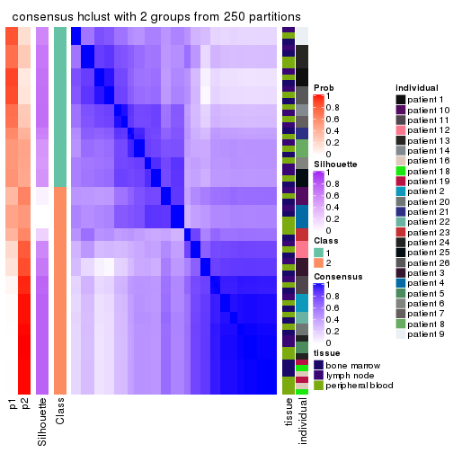</p>

</div>
<div id='tab-CV-hclust-consensus-heatmap-2'>
<pre><code class="r">consensus_heatmap(res, k = 3)
</code></pre>

<p>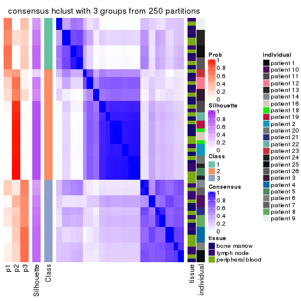</p>

</div>
<div id='tab-CV-hclust-consensus-heatmap-3'>
<pre><code class="r">consensus_heatmap(res, k = 4)
</code></pre>

<p>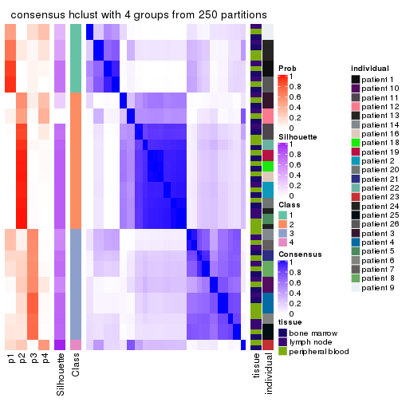</p>

</div>
<div id='tab-CV-hclust-consensus-heatmap-4'>
<pre><code class="r">consensus_heatmap(res, k = 5)
</code></pre>

<p></p>

</div>
<div id='tab-CV-hclust-consensus-heatmap-5'>
<pre><code class="r">consensus_heatmap(res, k = 6)
</code></pre>

<p>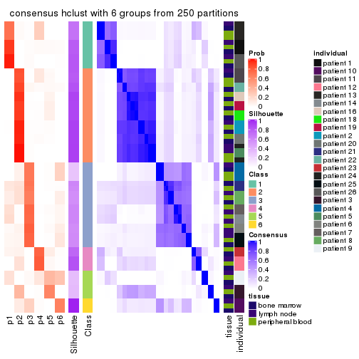</p>

</div>
</div>

Heatmaps for the membership of samples in all partitions to see how consistent they are:


<script>
$( function() {
	$( '#tabs-CV-hclust-membership-heatmap' ).tabs();
} );
</script>
<div id='tabs-CV-hclust-membership-heatmap'>
<ul>
<li><a href='#tab-CV-hclust-membership-heatmap-1'>k = 2</a></li>
<li><a href='#tab-CV-hclust-membership-heatmap-2'>k = 3</a></li>
<li><a href='#tab-CV-hclust-membership-heatmap-3'>k = 4</a></li>
<li><a href='#tab-CV-hclust-membership-heatmap-4'>k = 5</a></li>
<li><a href='#tab-CV-hclust-membership-heatmap-5'>k = 6</a></li>
</ul>
<div id='tab-CV-hclust-membership-heatmap-1'>
<pre><code class="r">membership_heatmap(res, k = 2)
</code></pre>

<p>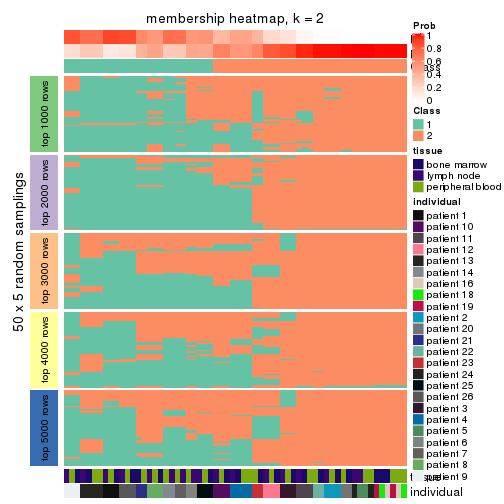</p>

</div>
<div id='tab-CV-hclust-membership-heatmap-2'>
<pre><code class="r">membership_heatmap(res, k = 3)
</code></pre>

<p>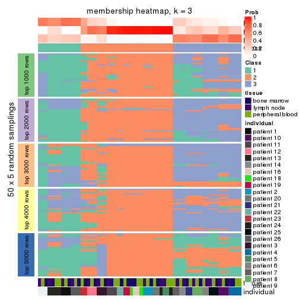</p>

</div>
<div id='tab-CV-hclust-membership-heatmap-3'>
<pre><code class="r">membership_heatmap(res, k = 4)
</code></pre>

<p>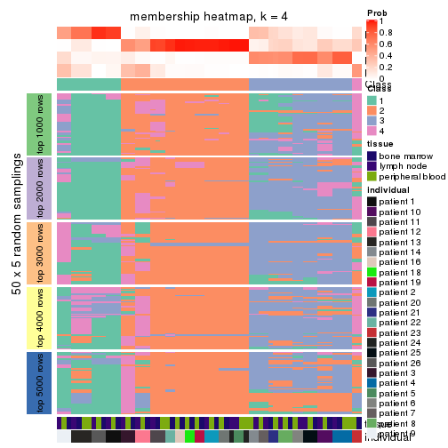</p>

</div>
<div id='tab-CV-hclust-membership-heatmap-4'>
<pre><code class="r">membership_heatmap(res, k = 5)
</code></pre>

<p>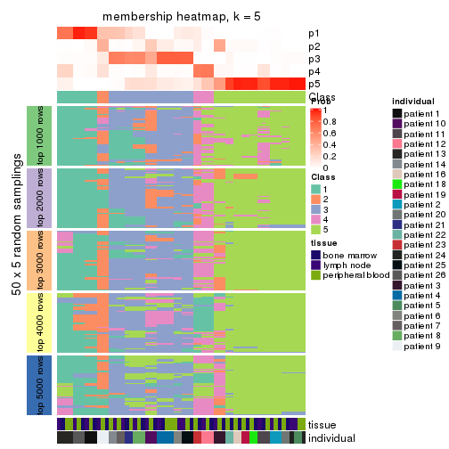</p>

</div>
<div id='tab-CV-hclust-membership-heatmap-5'>
<pre><code class="r">membership_heatmap(res, k = 6)
</code></pre>

<p>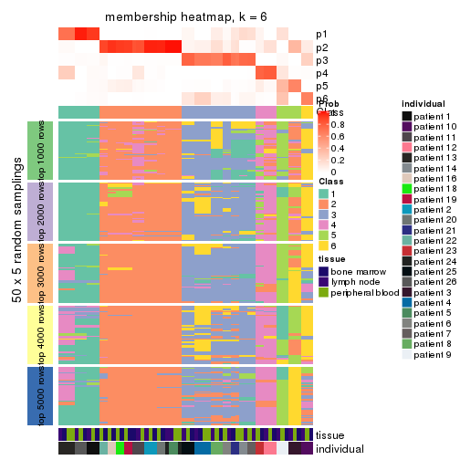</p>

</div>
</div>

As soon as we have had the classes for columns, we can look for signatures
which are significantly different between classes which can be candidate marks
for certain classes. Following are the heatmaps for signatures.


Signature heatmaps where rows are scaled:


<script>
$( function() {
	$( '#tabs-CV-hclust-get-signatures' ).tabs();
} );
</script>
<div id='tabs-CV-hclust-get-signatures'>
<ul>
<li><a href='#tab-CV-hclust-get-signatures-1'>k = 2</a></li>
<li><a href='#tab-CV-hclust-get-signatures-2'>k = 3</a></li>
<li><a href='#tab-CV-hclust-get-signatures-3'>k = 4</a></li>
<li><a href='#tab-CV-hclust-get-signatures-4'>k = 5</a></li>
<li><a href='#tab-CV-hclust-get-signatures-5'>k = 6</a></li>
</ul>
<div id='tab-CV-hclust-get-signatures-1'>
<pre><code class="r">get_signatures(res, k = 2)
</code></pre>

<p>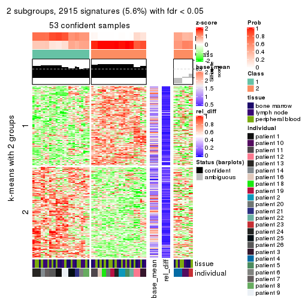</p>

</div>
<div id='tab-CV-hclust-get-signatures-2'>
<pre><code class="r">get_signatures(res, k = 3)
</code></pre>

<p>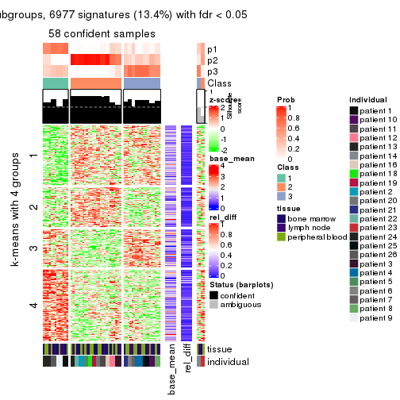</p>

</div>
<div id='tab-CV-hclust-get-signatures-3'>
<pre><code class="r">get_signatures(res, k = 4)
</code></pre>

<p>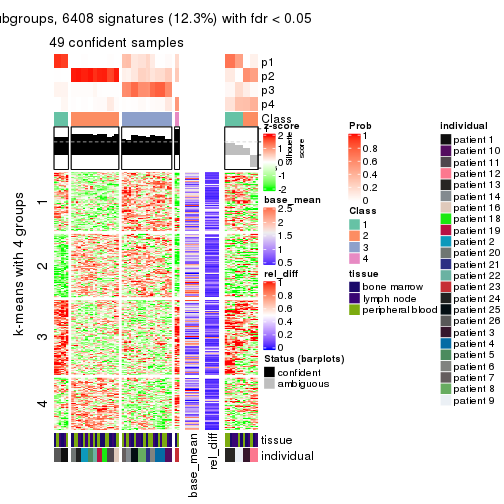</p>

</div>
<div id='tab-CV-hclust-get-signatures-4'>
<pre><code class="r">get_signatures(res, k = 5)
</code></pre>

<p>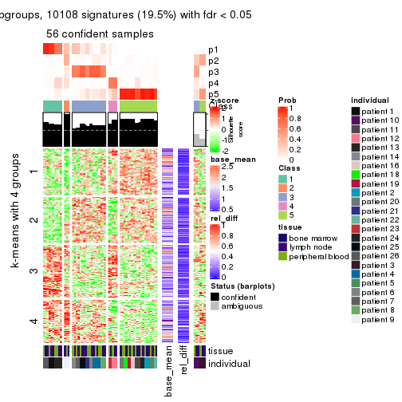</p>

</div>
<div id='tab-CV-hclust-get-signatures-5'>
<pre><code class="r">get_signatures(res, k = 6)
</code></pre>

<p>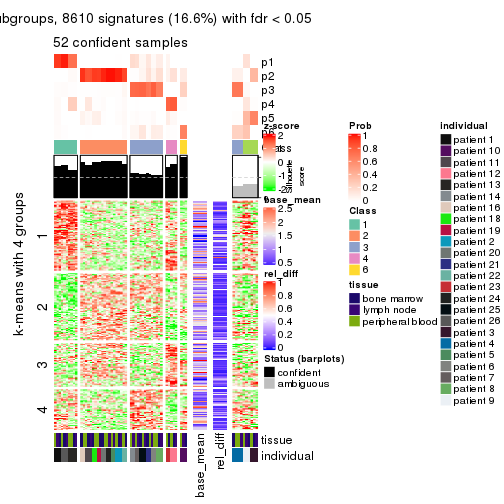</p>

</div>
</div>


Signature heatmaps where rows are not scaled:


<script>
$( function() {
	$( '#tabs-CV-hclust-get-signatures-no-scale' ).tabs();
} );
</script>
<div id='tabs-CV-hclust-get-signatures-no-scale'>
<ul>
<li><a href='#tab-CV-hclust-get-signatures-no-scale-1'>k = 2</a></li>
<li><a href='#tab-CV-hclust-get-signatures-no-scale-2'>k = 3</a></li>
<li><a href='#tab-CV-hclust-get-signatures-no-scale-3'>k = 4</a></li>
<li><a href='#tab-CV-hclust-get-signatures-no-scale-4'>k = 5</a></li>
<li><a href='#tab-CV-hclust-get-signatures-no-scale-5'>k = 6</a></li>
</ul>
<div id='tab-CV-hclust-get-signatures-no-scale-1'>
<pre><code class="r">get_signatures(res, k = 2, scale_rows = FALSE)
</code></pre>

<p>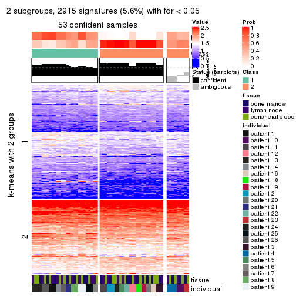</p>

</div>
<div id='tab-CV-hclust-get-signatures-no-scale-2'>
<pre><code class="r">get_signatures(res, k = 3, scale_rows = FALSE)
</code></pre>

<p>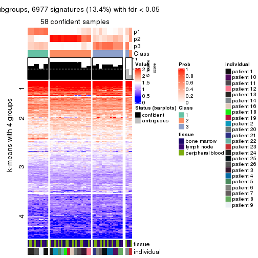</p>

</div>
<div id='tab-CV-hclust-get-signatures-no-scale-3'>
<pre><code class="r">get_signatures(res, k = 4, scale_rows = FALSE)
</code></pre>

<p>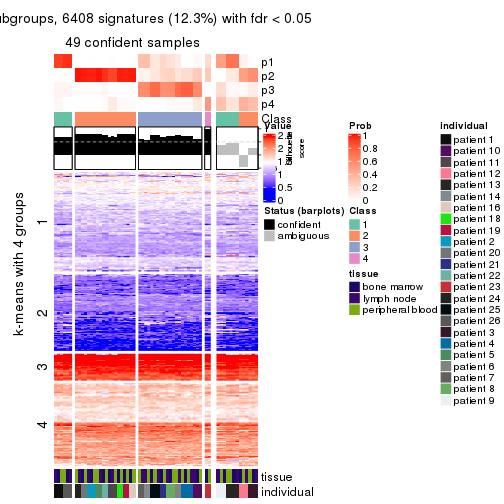</p>

</div>
<div id='tab-CV-hclust-get-signatures-no-scale-4'>
<pre><code class="r">get_signatures(res, k = 5, scale_rows = FALSE)
</code></pre>

<p>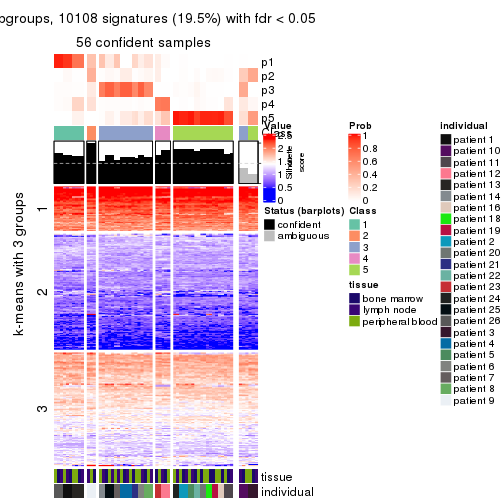</p>

</div>
<div id='tab-CV-hclust-get-signatures-no-scale-5'>
<pre><code class="r">get_signatures(res, k = 6, scale_rows = FALSE)
</code></pre>

<p>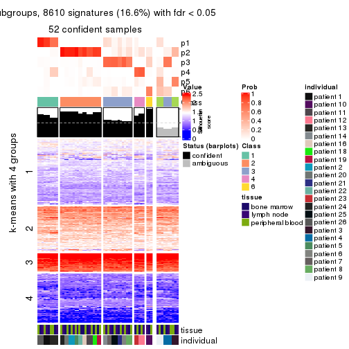</p>

</div>
</div>


Compare the overlap of signatures from different k:

```r
compare_signatures(res)
```

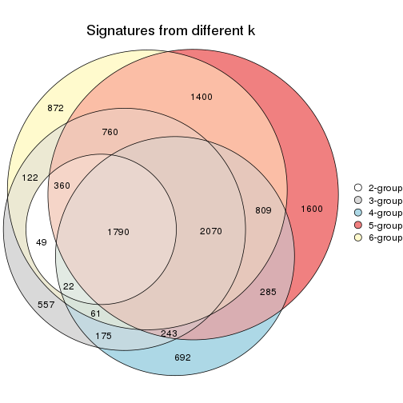

`get_signature()` returns a data frame invisibly. TO get the list of signatures, the function
call should be assigned to a variable explicitly. In following code, if `plot` argument is set
to `FALSE`, no heatmap is plotted while only the differential analysis is performed.

```r
# code only for demonstration
tb = get_signature(res, k = ..., plot = FALSE)
```

An example of the output of `tb` is:

```
#>   which_row         fdr    mean_1    mean_2 scaled_mean_1 scaled_mean_2 km
#> 1        38 0.042760348  8.373488  9.131774    -0.5533452     0.5164555  1
#> 2        40 0.018707592  7.106213  8.469186    -0.6173731     0.5762149  1
#> 3        55 0.019134737 10.221463 11.207825    -0.6159697     0.5749050  1
#> 4        59 0.006059896  5.921854  7.869574    -0.6899429     0.6439467  1
#> 5        60 0.018055526  8.928898 10.211722    -0.6204761     0.5791110  1
#> 6        98 0.009384629 15.714769 14.887706     0.6635654    -0.6193277  2
...
```

The columns in `tb` are:

1. `which_row`: row indices corresponding to the input matrix.
2. `fdr`: FDR for the differential test. 
3. `mean_x`: The mean value in group x.
4. `scaled_mean_x`: The mean value in group x after rows are scaled.
5. `km`: Row groups if k-means clustering is applied to rows.


UMAP plot which shows how samples are separated.


<script>
$( function() {
	$( '#tabs-CV-hclust-dimension-reduction' ).tabs();
} );
</script>
<div id='tabs-CV-hclust-dimension-reduction'>
<ul>
<li><a href='#tab-CV-hclust-dimension-reduction-1'>k = 2</a></li>
<li><a href='#tab-CV-hclust-dimension-reduction-2'>k = 3</a></li>
<li><a href='#tab-CV-hclust-dimension-reduction-3'>k = 4</a></li>
<li><a href='#tab-CV-hclust-dimension-reduction-4'>k = 5</a></li>
<li><a href='#tab-CV-hclust-dimension-reduction-5'>k = 6</a></li>
</ul>
<div id='tab-CV-hclust-dimension-reduction-1'>
<pre><code class="r">dimension_reduction(res, k = 2, method = &quot;UMAP&quot;)
</code></pre>

<p>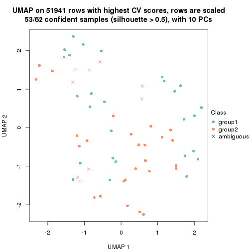</p>

</div>
<div id='tab-CV-hclust-dimension-reduction-2'>
<pre><code class="r">dimension_reduction(res, k = 3, method = &quot;UMAP&quot;)
</code></pre>

<p>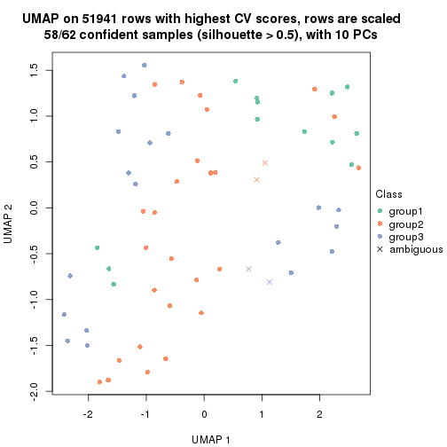</p>

</div>
<div id='tab-CV-hclust-dimension-reduction-3'>
<pre><code class="r">dimension_reduction(res, k = 4, method = &quot;UMAP&quot;)
</code></pre>

<p>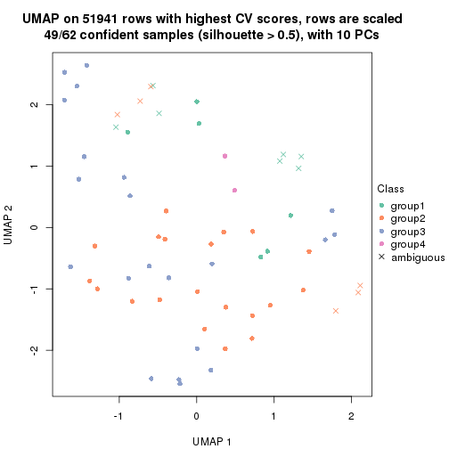</p>

</div>
<div id='tab-CV-hclust-dimension-reduction-4'>
<pre><code class="r">dimension_reduction(res, k = 5, method = &quot;UMAP&quot;)
</code></pre>

<p>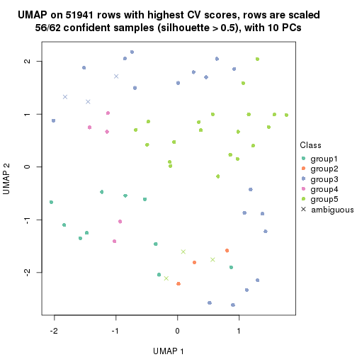</p>

</div>
<div id='tab-CV-hclust-dimension-reduction-5'>
<pre><code class="r">dimension_reduction(res, k = 6, method = &quot;UMAP&quot;)
</code></pre>

<p>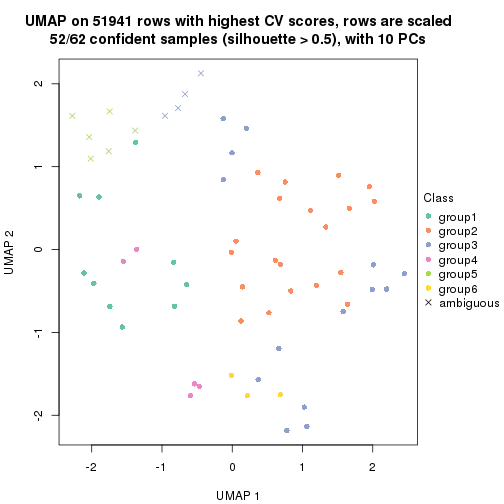</p>

</div>
</div>


Following heatmap shows how subgroups are split when increasing `k`:

```r
collect_classes(res)
```

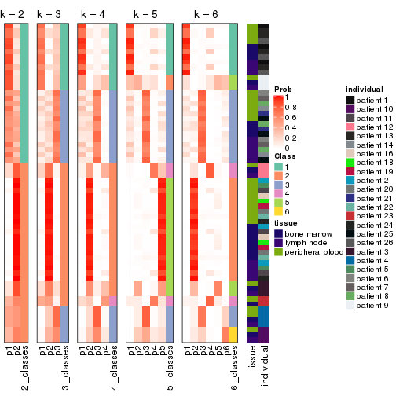


Test correlation between subgroups and known annotations. If the known
annotation is numeric, one-way ANOVA test is applied, and if the known
annotation is discrete, chi-squared contingency table test is applied.

```r
test_to_known_factors(res)
```

```
#>            n tissue(p) individual(p) k
#> CV:hclust 53     0.660      8.13e-05 2
#> CV:hclust 58     0.960      7.44e-09 3
#> CV:hclust 49     0.901      6.95e-10 4
#> CV:hclust 56     0.990      1.11e-14 5
#> CV:hclust 52     0.989      2.45e-13 6
```


If matrix rows can be associated to genes, consider to use `functional_enrichment(res,
...)` to perform function enrichment for the signature genes. See [this vignette](http://bioconductor.org/packages/devel/bioc/vignettes/cola/inst/doc/functional_enrichment.html) for more detailed explanations.


 

---------------------------------------------------


### CV:kmeans


The object with results only for a single top-value method and a single partition method 
can be extracted as:

```r
res = res_list["CV", "kmeans"]
# you can also extract it by
# res = res_list["CV:kmeans"]
```

A summary of `res` and all the functions that can be applied to it:

```r
res
```

```
#> A 'ConsensusPartition' object with k = 2, 3, 4, 5, 6.
#>   On a matrix with 51941 rows and 62 columns.
#>   Top rows (1000, 2000, 3000, 4000, 5000) are extracted by 'CV' method.
#>   Subgroups are detected by 'kmeans' method.
#>   Performed in total 1250 partitions by row resampling.
#>   Best k for subgroups seems to be 3.
#> 
#> Following methods can be applied to this 'ConsensusPartition' object:
#>  [1] "cola_report"             "collect_classes"         "collect_plots"          
#>  [4] "collect_stats"           "colnames"                "compare_signatures"     
#>  [7] "consensus_heatmap"       "dimension_reduction"     "functional_enrichment"  
#> [10] "get_anno_col"            "get_anno"                "get_classes"            
#> [13] "get_consensus"           "get_matrix"              "get_membership"         
#> [16] "get_param"               "get_signatures"          "get_stats"              
#> [19] "is_best_k"               "is_stable_k"             "membership_heatmap"     
#> [22] "ncol"                    "nrow"                    "plot_ecdf"              
#> [25] "rownames"                "select_partition_number" "show"                   
#> [28] "suggest_best_k"          "test_to_known_factors"
```

`collect_plots()` function collects all the plots made from `res` for all `k` (number of partitions)
into one single page to provide an easy and fast comparison between different `k`.

```r
collect_plots(res)
```

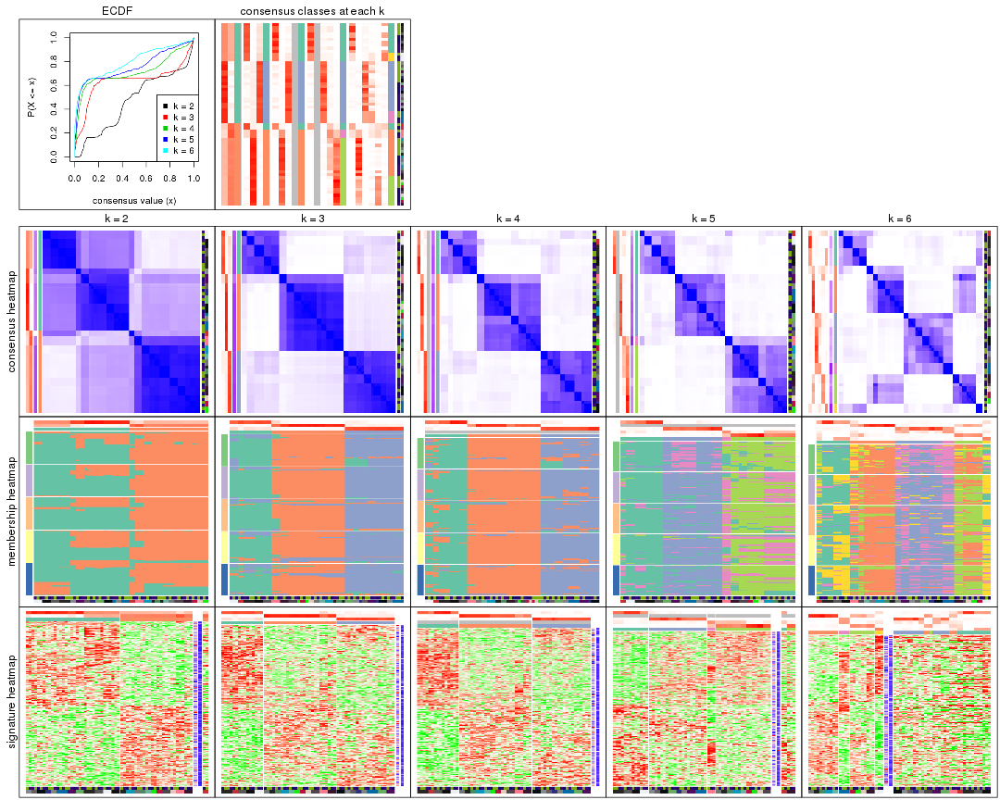

The plots are:

- The first row: a plot of the ECDF (empirical cumulative distribution
  function) curves of the consensus matrix for each `k` and the heatmap of
  predicted classes for each `k`.
- The second row: heatmaps of the consensus matrix for each `k`.
- The third row: heatmaps of the membership matrix for each `k`.
- The fouth row: heatmaps of the signatures for each `k`.

All the plots in panels can be made by individual functions and they are
plotted later in this section.

`select_partition_number()` produces several plots showing different
statistics for choosing "optimized" `k`. There are following statistics:

- ECDF curves of the consensus matrix for each `k`;
- 1-PAC. [The PAC
  score](https://en.wikipedia.org/wiki/Consensus_clustering#Over-interpretation_potential_of_consensus_clustering)
  measures the proportion of the ambiguous subgrouping.
- Mean silhouette score.
- Concordance. The mean probability of fiting the consensus class ids in all
  partitions.
- Area increased. Denote $A_k$ as the area under the ECDF curve for current
  `k`, the area increased is defined as $A_k - A_{k-1}$.
- Rand index. The percent of pairs of samples that are both in a same cluster
  or both are not in a same cluster in the partition of k and k-1.
- Jaccard index. The ratio of pairs of samples are both in a same cluster in
  the partition of k and k-1 and the pairs of samples are both in a same
  cluster in the partition k or k-1.

The detailed explanations of these statistics can be found in [the _cola_
vignette](http://bioconductor.org/packages/devel/bioc/vignettes/cola/inst/doc/cola.html#toc_13).

Generally speaking, lower PAC score, higher mean silhouette score or higher
concordance corresponds to better partition. Rand index and Jaccard index
measure how similar the current partition is compared to partition with `k-1`.
If they are too similar, we won't accept `k` is better than `k-1`.

```r
select_partition_number(res)
```

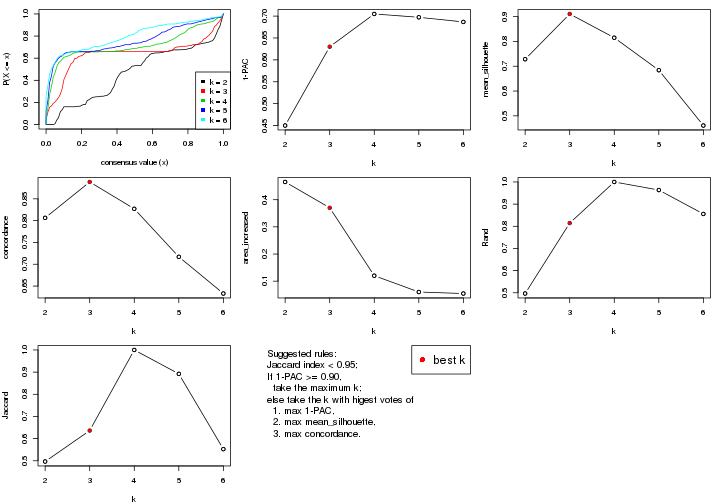

The numeric values for all these statistics can be obtained by `get_stats()`.

```r
get_stats(res)
```

```
#>   k 1-PAC mean_silhouette concordance area_increased  Rand Jaccard
#> 2 2 0.450           0.728       0.806         0.4652 0.497   0.497
#> 3 3 0.630           0.911       0.889         0.3702 0.814   0.636
#> 4 4 0.705           0.815       0.827         0.1202 1.000   1.000
#> 5 5 0.697           0.684       0.717         0.0601 0.964   0.892
#> 6 6 0.687           0.461       0.633         0.0546 0.856   0.552
```

`suggest_best_k()` suggests the best $k$ based on these statistics. The rules are as follows:

- All $k$ with Jaccard index larger than 0.95 are removed because increasing
  $k$ does not provide enough extra information. If all $k$ are removed, it is
  marked as no subgroup is detected.
- For all $k$ with 1-PAC score larger than 0.9, the maximal $k$ is taken as
  the best $k$, and other $k$ are marked as optional $k$.
- If it does not fit the second rule. The $k$ with the maximal vote of the
  highest 1-PAC score, highest mean silhouette, and highest concordance is
  taken as the best $k$.

```r
suggest_best_k(res)
```

```
#> [1] 3
```


Following shows the table of the partitions (You need to click the **show/hide
code output** link to see it). The membership matrix (columns with name `p*`)
is inferred by
[`clue::cl_consensus()`](https://www.rdocumentation.org/link/cl_consensus?package=clue)
function with the `SE` method. Basically the value in the membership matrix
represents the probability to belong to a certain group. The finall class
label for an item is determined with the group with highest probability it
belongs to.

In `get_classes()` function, the entropy is calculated from the membership
matrix and the silhouette score is calculated from the consensus matrix.


<script>
$( function() {
	$( '#tabs-CV-kmeans-get-classes' ).tabs();
} );
</script>
<div id='tabs-CV-kmeans-get-classes'>
<ul>
<li><a href='#tab-CV-kmeans-get-classes-1'>k = 2</a></li>
<li><a href='#tab-CV-kmeans-get-classes-2'>k = 3</a></li>
<li><a href='#tab-CV-kmeans-get-classes-3'>k = 4</a></li>
<li><a href='#tab-CV-kmeans-get-classes-4'>k = 5</a></li>
<li><a href='#tab-CV-kmeans-get-classes-5'>k = 6</a></li>
</ul>

<div id='tab-CV-kmeans-get-classes-1'>
<p><a id='tab-CV-kmeans-get-classes-1-a' style='color:#0366d6' href='#'>show/hide code output</a></p>
<pre><code class="r">cbind(get_classes(res, k = 2), get_membership(res, k = 2))
</code></pre>

<pre><code>#&gt;           class entropy silhouette    p1    p2
#&gt; GSM525314     1  0.9775     0.6562 0.588 0.412
#&gt; GSM525315     2  0.9661     0.8797 0.392 0.608
#&gt; GSM525316     2  0.9248     0.8898 0.340 0.660
#&gt; GSM525317     1  0.2778     0.6846 0.952 0.048
#&gt; GSM525318     1  0.2778     0.6846 0.952 0.048
#&gt; GSM525319     2  0.9552     0.8834 0.376 0.624
#&gt; GSM525320     1  0.2948     0.6804 0.948 0.052
#&gt; GSM525321     1  0.1184     0.7030 0.984 0.016
#&gt; GSM525322     1  0.1184     0.6997 0.984 0.016
#&gt; GSM525323     1  0.9850     0.6561 0.572 0.428
#&gt; GSM525324     1  0.5519     0.5512 0.872 0.128
#&gt; GSM525325     2  0.9427     0.8875 0.360 0.640
#&gt; GSM525326     2  0.6887     0.7183 0.184 0.816
#&gt; GSM525327     1  0.9754     0.6604 0.592 0.408
#&gt; GSM525328     1  0.9754     0.6604 0.592 0.408
#&gt; GSM525329     1  0.5178     0.7028 0.884 0.116
#&gt; GSM525330     2  0.9323     0.8935 0.348 0.652
#&gt; GSM525331     2  0.9286     0.8927 0.344 0.656
#&gt; GSM525332     2  0.9323     0.8927 0.348 0.652
#&gt; GSM525333     2  0.9460     0.8899 0.364 0.636
#&gt; GSM525334     1  0.0938     0.7016 0.988 0.012
#&gt; GSM525335     2  0.9460     0.8866 0.364 0.636
#&gt; GSM525336     2  0.8207    -0.0864 0.256 0.744
#&gt; GSM525337     2  0.9552     0.8834 0.376 0.624
#&gt; GSM525338     1  0.2603     0.6869 0.956 0.044
#&gt; GSM525339     1  0.9732     0.6602 0.596 0.404
#&gt; GSM525340     1  0.9775     0.6562 0.588 0.412
#&gt; GSM525341     2  0.9661     0.8797 0.392 0.608
#&gt; GSM525342     2  0.9248     0.8898 0.340 0.660
#&gt; GSM525343     1  0.2778     0.6846 0.952 0.048
#&gt; GSM525344     1  0.1184     0.6997 0.984 0.016
#&gt; GSM525345     1  0.9850     0.6561 0.572 0.428
#&gt; GSM525346     1  0.5178     0.5771 0.884 0.116
#&gt; GSM525347     2  0.9427     0.8875 0.360 0.640
#&gt; GSM525348     2  0.6887     0.7183 0.184 0.816
#&gt; GSM525349     1  0.9754     0.6604 0.592 0.408
#&gt; GSM525350     2  0.9323     0.8935 0.348 0.652
#&gt; GSM525351     2  0.9286     0.8927 0.344 0.656
#&gt; GSM525352     2  0.9323     0.8927 0.348 0.652
#&gt; GSM525353     2  0.9460     0.8899 0.364 0.636
#&gt; GSM525354     1  0.0672     0.7029 0.992 0.008
#&gt; GSM525355     2  0.9460     0.8866 0.364 0.636
#&gt; GSM525356     2  0.8207    -0.0864 0.256 0.744
#&gt; GSM525357     1  0.2603     0.6869 0.956 0.044
#&gt; GSM525358     1  0.9732     0.6602 0.596 0.404
#&gt; GSM525359     1  0.9775     0.6562 0.588 0.412
#&gt; GSM525360     2  0.9661     0.8797 0.392 0.608
#&gt; GSM525361     2  0.9248     0.8898 0.340 0.660
#&gt; GSM525362     1  0.2603     0.6883 0.956 0.044
#&gt; GSM525363     2  0.9552     0.8834 0.376 0.624
#&gt; GSM525364     1  0.2603     0.6883 0.956 0.044
#&gt; GSM525365     1  0.1184     0.7065 0.984 0.016
#&gt; GSM525366     1  0.1184     0.6997 0.984 0.016
#&gt; GSM525367     1  0.9850     0.6561 0.572 0.428
#&gt; GSM525368     1  0.5178     0.5771 0.884 0.116
#&gt; GSM525369     2  0.9427     0.8875 0.360 0.640
#&gt; GSM525370     2  0.6887     0.7183 0.184 0.816
#&gt; GSM525371     1  0.9754     0.6604 0.592 0.408
#&gt; GSM525372     1  0.5178     0.7028 0.884 0.116
#&gt; GSM525373     2  0.9552     0.8834 0.376 0.624
#&gt; GSM525374     1  0.2603     0.6869 0.956 0.044
#&gt; GSM525375     1  0.9732     0.6602 0.596 0.404
</code></pre>

<script>
$('#tab-CV-kmeans-get-classes-1-a').parent().next().next().hide();
$('#tab-CV-kmeans-get-classes-1-a').click(function(){
  $('#tab-CV-kmeans-get-classes-1-a').parent().next().next().toggle();
  return(false);
});
</script>
</div>

<div id='tab-CV-kmeans-get-classes-2'>
<p><a id='tab-CV-kmeans-get-classes-2-a' style='color:#0366d6' href='#'>show/hide code output</a></p>
<pre><code class="r">cbind(get_classes(res, k = 3), get_membership(res, k = 3))
</code></pre>

<pre><code>#&gt;           class entropy silhouette    p1    p2    p3
#&gt; GSM525314     1  0.3715      0.913 0.868 0.004 0.128
#&gt; GSM525315     2  0.2173      0.935 0.008 0.944 0.048
#&gt; GSM525316     2  0.3237      0.910 0.056 0.912 0.032
#&gt; GSM525317     3  0.3850      0.937 0.028 0.088 0.884
#&gt; GSM525318     3  0.3765      0.935 0.028 0.084 0.888
#&gt; GSM525319     2  0.1765      0.936 0.004 0.956 0.040
#&gt; GSM525320     3  0.3207      0.943 0.012 0.084 0.904
#&gt; GSM525321     3  0.4745      0.929 0.068 0.080 0.852
#&gt; GSM525322     3  0.5346      0.919 0.088 0.088 0.824
#&gt; GSM525323     1  0.5202      0.858 0.772 0.008 0.220
#&gt; GSM525324     3  0.4063      0.919 0.020 0.112 0.868
#&gt; GSM525325     2  0.1337      0.942 0.016 0.972 0.012
#&gt; GSM525326     2  0.6496      0.714 0.208 0.736 0.056
#&gt; GSM525327     1  0.4840      0.901 0.816 0.016 0.168
#&gt; GSM525328     1  0.4840      0.901 0.816 0.016 0.168
#&gt; GSM525329     3  0.4689      0.900 0.096 0.052 0.852
#&gt; GSM525330     2  0.1170      0.942 0.016 0.976 0.008
#&gt; GSM525331     2  0.1315      0.941 0.020 0.972 0.008
#&gt; GSM525332     2  0.1453      0.942 0.024 0.968 0.008
#&gt; GSM525333     2  0.0747      0.942 0.000 0.984 0.016
#&gt; GSM525334     3  0.4925      0.927 0.076 0.080 0.844
#&gt; GSM525335     2  0.1267      0.940 0.004 0.972 0.024
#&gt; GSM525336     1  0.4357      0.828 0.868 0.080 0.052
#&gt; GSM525337     2  0.1765      0.936 0.004 0.956 0.040
#&gt; GSM525338     3  0.3670      0.945 0.020 0.092 0.888
#&gt; GSM525339     1  0.3879      0.911 0.848 0.000 0.152
#&gt; GSM525340     1  0.3644      0.912 0.872 0.004 0.124
#&gt; GSM525341     2  0.2173      0.935 0.008 0.944 0.048
#&gt; GSM525342     2  0.3237      0.910 0.056 0.912 0.032
#&gt; GSM525343     3  0.3850      0.937 0.028 0.088 0.884
#&gt; GSM525344     3  0.5346      0.919 0.088 0.088 0.824
#&gt; GSM525345     1  0.5202      0.858 0.772 0.008 0.220
#&gt; GSM525346     3  0.3910      0.921 0.020 0.104 0.876
#&gt; GSM525347     2  0.1170      0.941 0.016 0.976 0.008
#&gt; GSM525348     2  0.6496      0.714 0.208 0.736 0.056
#&gt; GSM525349     1  0.4840      0.901 0.816 0.016 0.168
#&gt; GSM525350     2  0.1170      0.942 0.016 0.976 0.008
#&gt; GSM525351     2  0.1129      0.940 0.020 0.976 0.004
#&gt; GSM525352     2  0.1453      0.942 0.024 0.968 0.008
#&gt; GSM525353     2  0.0892      0.942 0.000 0.980 0.020
#&gt; GSM525354     3  0.3415      0.944 0.020 0.080 0.900
#&gt; GSM525355     2  0.1267      0.940 0.004 0.972 0.024
#&gt; GSM525356     1  0.4357      0.828 0.868 0.080 0.052
#&gt; GSM525357     3  0.3670      0.945 0.020 0.092 0.888
#&gt; GSM525358     1  0.3879      0.911 0.848 0.000 0.152
#&gt; GSM525359     1  0.3715      0.913 0.868 0.004 0.128
#&gt; GSM525360     2  0.2173      0.935 0.008 0.944 0.048
#&gt; GSM525361     2  0.3237      0.910 0.056 0.912 0.032
#&gt; GSM525362     3  0.3678      0.936 0.028 0.080 0.892
#&gt; GSM525363     2  0.1765      0.936 0.004 0.956 0.040
#&gt; GSM525364     3  0.3120      0.942 0.012 0.080 0.908
#&gt; GSM525365     3  0.4569      0.924 0.072 0.068 0.860
#&gt; GSM525366     3  0.5346      0.919 0.088 0.088 0.824
#&gt; GSM525367     1  0.5202      0.858 0.772 0.008 0.220
#&gt; GSM525368     3  0.3910      0.921 0.020 0.104 0.876
#&gt; GSM525369     2  0.1337      0.942 0.016 0.972 0.012
#&gt; GSM525370     2  0.6496      0.714 0.208 0.736 0.056
#&gt; GSM525371     1  0.4840      0.901 0.816 0.016 0.168
#&gt; GSM525372     3  0.4689      0.900 0.096 0.052 0.852
#&gt; GSM525373     2  0.1765      0.936 0.004 0.956 0.040
#&gt; GSM525374     3  0.3670      0.945 0.020 0.092 0.888
#&gt; GSM525375     1  0.3879      0.911 0.848 0.000 0.152
</code></pre>

<script>
$('#tab-CV-kmeans-get-classes-2-a').parent().next().next().hide();
$('#tab-CV-kmeans-get-classes-2-a').click(function(){
  $('#tab-CV-kmeans-get-classes-2-a').parent().next().next().toggle();
  return(false);
});
</script>
</div>

<div id='tab-CV-kmeans-get-classes-3'>
<p><a id='tab-CV-kmeans-get-classes-3-a' style='color:#0366d6' href='#'>show/hide code output</a></p>
<pre><code class="r">cbind(get_classes(res, k = 4), get_membership(res, k = 4))
</code></pre>

<pre><code>#&gt;           class entropy silhouette    p1    p2    p3 p4
#&gt; GSM525314     1  0.0804      0.852 0.980 0.000 0.008 NA
#&gt; GSM525315     2  0.2467      0.830 0.004 0.920 0.052 NA
#&gt; GSM525316     2  0.5290      0.758 0.008 0.656 0.012 NA
#&gt; GSM525317     3  0.4178      0.850 0.016 0.020 0.824 NA
#&gt; GSM525318     3  0.4178      0.850 0.016 0.020 0.824 NA
#&gt; GSM525319     2  0.2385      0.830 0.000 0.920 0.052 NA
#&gt; GSM525320     3  0.4037      0.853 0.008 0.024 0.828 NA
#&gt; GSM525321     3  0.4241      0.868 0.088 0.016 0.840 NA
#&gt; GSM525322     3  0.4090      0.860 0.076 0.008 0.844 NA
#&gt; GSM525323     1  0.6311      0.724 0.672 0.008 0.108 NA
#&gt; GSM525324     3  0.3725      0.863 0.004 0.028 0.848 NA
#&gt; GSM525325     2  0.3863      0.830 0.004 0.812 0.008 NA
#&gt; GSM525326     2  0.6837      0.508 0.044 0.540 0.032 NA
#&gt; GSM525327     1  0.4788      0.821 0.792 0.008 0.056 NA
#&gt; GSM525328     1  0.4788      0.821 0.792 0.008 0.056 NA
#&gt; GSM525329     3  0.4469      0.842 0.128 0.012 0.816 NA
#&gt; GSM525330     2  0.3937      0.828 0.000 0.800 0.012 NA
#&gt; GSM525331     2  0.4175      0.822 0.000 0.776 0.012 NA
#&gt; GSM525332     2  0.4137      0.824 0.000 0.780 0.012 NA
#&gt; GSM525333     2  0.1452      0.838 0.000 0.956 0.036 NA
#&gt; GSM525334     3  0.3682      0.864 0.084 0.008 0.864 NA
#&gt; GSM525335     2  0.2500      0.832 0.000 0.916 0.044 NA
#&gt; GSM525336     1  0.6187      0.730 0.624 0.056 0.008 NA
#&gt; GSM525337     2  0.2300      0.836 0.000 0.924 0.048 NA
#&gt; GSM525338     3  0.2089      0.886 0.020 0.012 0.940 NA
#&gt; GSM525339     1  0.1510      0.851 0.956 0.000 0.028 NA
#&gt; GSM525340     1  0.0804      0.852 0.980 0.000 0.008 NA
#&gt; GSM525341     2  0.2467      0.830 0.004 0.920 0.052 NA
#&gt; GSM525342     2  0.5290      0.758 0.008 0.656 0.012 NA
#&gt; GSM525343     3  0.4178      0.850 0.016 0.020 0.824 NA
#&gt; GSM525344     3  0.4090      0.860 0.076 0.008 0.844 NA
#&gt; GSM525345     1  0.6311      0.724 0.672 0.008 0.108 NA
#&gt; GSM525346     3  0.3725      0.863 0.004 0.028 0.848 NA
#&gt; GSM525347     2  0.3710      0.827 0.004 0.804 0.000 NA
#&gt; GSM525348     2  0.6837      0.508 0.044 0.540 0.032 NA
#&gt; GSM525349     1  0.4788      0.821 0.792 0.008 0.056 NA
#&gt; GSM525350     2  0.3937      0.828 0.000 0.800 0.012 NA
#&gt; GSM525351     2  0.4018      0.817 0.000 0.772 0.004 NA
#&gt; GSM525352     2  0.4175      0.823 0.000 0.776 0.012 NA
#&gt; GSM525353     2  0.1452      0.838 0.000 0.956 0.036 NA
#&gt; GSM525354     3  0.2089      0.886 0.020 0.012 0.940 NA
#&gt; GSM525355     2  0.2500      0.832 0.000 0.916 0.044 NA
#&gt; GSM525356     1  0.6187      0.730 0.624 0.056 0.008 NA
#&gt; GSM525357     3  0.2089      0.886 0.020 0.012 0.940 NA
#&gt; GSM525358     1  0.1510      0.851 0.956 0.000 0.028 NA
#&gt; GSM525359     1  0.0804      0.852 0.980 0.000 0.008 NA
#&gt; GSM525360     2  0.2467      0.830 0.004 0.920 0.052 NA
#&gt; GSM525361     2  0.5290      0.758 0.008 0.656 0.012 NA
#&gt; GSM525362     3  0.4126      0.851 0.016 0.020 0.828 NA
#&gt; GSM525363     2  0.2282      0.830 0.000 0.924 0.052 NA
#&gt; GSM525364     3  0.4037      0.853 0.008 0.024 0.828 NA
#&gt; GSM525365     3  0.4305      0.868 0.092 0.016 0.836 NA
#&gt; GSM525366     3  0.4016      0.859 0.080 0.004 0.844 NA
#&gt; GSM525367     1  0.6278      0.726 0.676 0.008 0.108 NA
#&gt; GSM525368     3  0.3668      0.865 0.004 0.028 0.852 NA
#&gt; GSM525369     2  0.3863      0.830 0.004 0.812 0.008 NA
#&gt; GSM525370     2  0.6837      0.508 0.044 0.540 0.032 NA
#&gt; GSM525371     1  0.4788      0.821 0.792 0.008 0.056 NA
#&gt; GSM525372     3  0.4469      0.842 0.128 0.012 0.816 NA
#&gt; GSM525373     2  0.2385      0.834 0.000 0.920 0.052 NA
#&gt; GSM525374     3  0.2089      0.886 0.020 0.012 0.940 NA
#&gt; GSM525375     1  0.1510      0.851 0.956 0.000 0.028 NA
</code></pre>

<script>
$('#tab-CV-kmeans-get-classes-3-a').parent().next().next().hide();
$('#tab-CV-kmeans-get-classes-3-a').click(function(){
  $('#tab-CV-kmeans-get-classes-3-a').parent().next().next().toggle();
  return(false);
});
</script>
</div>

<div id='tab-CV-kmeans-get-classes-4'>
<p><a id='tab-CV-kmeans-get-classes-4-a' style='color:#0366d6' href='#'>show/hide code output</a></p>
<pre><code class="r">cbind(get_classes(res, k = 5), get_membership(res, k = 5))
</code></pre>

<pre><code>#&gt;           class entropy silhouette    p1 p2    p3    p4    p5
#&gt; GSM525314     1   0.203      0.749 0.928 NA 0.012 0.016 0.000
#&gt; GSM525315     5   0.575      0.550 0.000 NA 0.028 0.356 0.572
#&gt; GSM525316     5   0.439      0.384 0.008 NA 0.000 0.076 0.776
#&gt; GSM525317     3   0.478      0.780 0.008 NA 0.700 0.020 0.012
#&gt; GSM525318     3   0.478      0.780 0.008 NA 0.700 0.020 0.012
#&gt; GSM525319     5   0.467      0.582 0.000 NA 0.024 0.352 0.624
#&gt; GSM525320     3   0.426      0.808 0.000 NA 0.752 0.024 0.012
#&gt; GSM525321     3   0.425      0.809 0.040 NA 0.824 0.052 0.012
#&gt; GSM525322     3   0.512      0.785 0.056 NA 0.760 0.044 0.012
#&gt; GSM525323     1   0.628      0.590 0.564 NA 0.060 0.052 0.000
#&gt; GSM525324     3   0.536      0.765 0.004 NA 0.684 0.064 0.016
#&gt; GSM525325     5   0.324      0.599 0.000 NA 0.000 0.116 0.844
#&gt; GSM525326     4   0.649      1.000 0.024 NA 0.008 0.568 0.296
#&gt; GSM525327     1   0.575      0.685 0.712 NA 0.048 0.112 0.008
#&gt; GSM525328     1   0.575      0.685 0.712 NA 0.048 0.112 0.008
#&gt; GSM525329     3   0.445      0.779 0.088 NA 0.804 0.040 0.004
#&gt; GSM525330     5   0.000      0.612 0.000 NA 0.000 0.000 1.000
#&gt; GSM525331     5   0.101      0.594 0.000 NA 0.000 0.020 0.968
#&gt; GSM525332     5   0.136      0.591 0.000 NA 0.000 0.036 0.952
#&gt; GSM525333     5   0.427      0.595 0.000 NA 0.012 0.320 0.668
#&gt; GSM525334     3   0.321      0.811 0.048 NA 0.880 0.028 0.008
#&gt; GSM525335     5   0.491      0.581 0.000 NA 0.024 0.320 0.644
#&gt; GSM525336     1   0.782      0.413 0.464 NA 0.020 0.292 0.060
#&gt; GSM525337     5   0.474      0.594 0.000 NA 0.024 0.332 0.640
#&gt; GSM525338     3   0.211      0.829 0.004 NA 0.928 0.016 0.012
#&gt; GSM525339     1   0.198      0.749 0.932 NA 0.024 0.012 0.000
#&gt; GSM525340     1   0.203      0.749 0.928 NA 0.012 0.016 0.000
#&gt; GSM525341     5   0.575      0.550 0.000 NA 0.028 0.356 0.572
#&gt; GSM525342     5   0.435      0.392 0.008 NA 0.000 0.076 0.780
#&gt; GSM525343     3   0.478      0.780 0.008 NA 0.700 0.020 0.012
#&gt; GSM525344     3   0.520      0.781 0.056 NA 0.752 0.044 0.012
#&gt; GSM525345     1   0.628      0.590 0.564 NA 0.060 0.052 0.000
#&gt; GSM525346     3   0.536      0.765 0.004 NA 0.684 0.064 0.016
#&gt; GSM525347     5   0.353      0.585 0.000 NA 0.000 0.128 0.824
#&gt; GSM525348     4   0.649      1.000 0.024 NA 0.008 0.568 0.296
#&gt; GSM525349     1   0.575      0.685 0.712 NA 0.048 0.112 0.008
#&gt; GSM525350     5   0.000      0.612 0.000 NA 0.000 0.000 1.000
#&gt; GSM525351     5   0.111      0.591 0.000 NA 0.000 0.024 0.964
#&gt; GSM525352     5   0.155      0.587 0.000 NA 0.000 0.040 0.944
#&gt; GSM525353     5   0.427      0.595 0.000 NA 0.012 0.320 0.668
#&gt; GSM525354     3   0.136      0.829 0.004 NA 0.960 0.016 0.008
#&gt; GSM525355     5   0.491      0.581 0.000 NA 0.024 0.320 0.644
#&gt; GSM525356     1   0.782      0.413 0.464 NA 0.020 0.292 0.060
#&gt; GSM525357     3   0.211      0.829 0.004 NA 0.928 0.016 0.012
#&gt; GSM525358     1   0.198      0.749 0.932 NA 0.024 0.012 0.000
#&gt; GSM525359     1   0.203      0.749 0.928 NA 0.012 0.016 0.000
#&gt; GSM525360     5   0.575      0.550 0.000 NA 0.028 0.356 0.572
#&gt; GSM525361     5   0.435      0.392 0.008 NA 0.000 0.076 0.780
#&gt; GSM525362     3   0.476      0.781 0.008 NA 0.704 0.020 0.012
#&gt; GSM525363     5   0.467      0.582 0.000 NA 0.024 0.352 0.624
#&gt; GSM525364     3   0.426      0.808 0.000 NA 0.752 0.024 0.012
#&gt; GSM525365     3   0.445      0.811 0.044 NA 0.812 0.052 0.012
#&gt; GSM525366     3   0.516      0.785 0.056 NA 0.756 0.044 0.012
#&gt; GSM525367     1   0.628      0.590 0.564 NA 0.060 0.052 0.000
#&gt; GSM525368     3   0.533      0.766 0.004 NA 0.684 0.060 0.016
#&gt; GSM525369     5   0.324      0.599 0.000 NA 0.000 0.116 0.844
#&gt; GSM525370     4   0.649      1.000 0.024 NA 0.008 0.568 0.296
#&gt; GSM525371     1   0.575      0.685 0.712 NA 0.048 0.112 0.008
#&gt; GSM525372     3   0.445      0.779 0.088 NA 0.804 0.040 0.004
#&gt; GSM525373     5   0.474      0.594 0.000 NA 0.024 0.332 0.640
#&gt; GSM525374     3   0.219      0.829 0.004 NA 0.924 0.016 0.012
#&gt; GSM525375     1   0.198      0.749 0.932 NA 0.024 0.012 0.000
</code></pre>

<script>
$('#tab-CV-kmeans-get-classes-4-a').parent().next().next().hide();
$('#tab-CV-kmeans-get-classes-4-a').click(function(){
  $('#tab-CV-kmeans-get-classes-4-a').parent().next().next().toggle();
  return(false);
});
</script>
</div>

<div id='tab-CV-kmeans-get-classes-5'>
<p><a id='tab-CV-kmeans-get-classes-5-a' style='color:#0366d6' href='#'>show/hide code output</a></p>
<pre><code class="r">cbind(get_classes(res, k = 6), get_membership(res, k = 6))
</code></pre>

<pre><code>#&gt;           class entropy silhouette    p1    p2    p3    p4    p5    p6
#&gt; GSM525314     1  0.4775      0.292 0.516 0.000 0.016 0.004 0.016 0.448
#&gt; GSM525315     2  0.2164      0.627 0.000 0.916 0.020 0.012 0.044 0.008
#&gt; GSM525316     5  0.5737      0.610 0.000 0.240 0.000 0.080 0.612 0.068
#&gt; GSM525317     4  0.4336      1.000 0.000 0.000 0.476 0.504 0.000 0.020
#&gt; GSM525318     4  0.4336      1.000 0.000 0.000 0.476 0.504 0.000 0.020
#&gt; GSM525319     2  0.0363      0.640 0.000 0.988 0.012 0.000 0.000 0.000
#&gt; GSM525320     3  0.5349     -0.465 0.004 0.000 0.580 0.336 0.028 0.052
#&gt; GSM525321     3  0.3908      0.362 0.028 0.004 0.816 0.100 0.012 0.040
#&gt; GSM525322     3  0.4952      0.465 0.044 0.024 0.732 0.168 0.016 0.016
#&gt; GSM525323     6  0.5735      1.000 0.184 0.000 0.032 0.132 0.012 0.640
#&gt; GSM525324     3  0.6751      0.156 0.016 0.060 0.440 0.408 0.044 0.032
#&gt; GSM525325     2  0.4779     -0.498 0.008 0.532 0.000 0.012 0.432 0.016
#&gt; GSM525326     2  0.8730      0.171 0.164 0.364 0.020 0.128 0.232 0.092
#&gt; GSM525327     1  0.1411      0.482 0.936 0.000 0.060 0.004 0.000 0.000
#&gt; GSM525328     1  0.1411      0.482 0.936 0.000 0.060 0.004 0.000 0.000
#&gt; GSM525329     3  0.3559      0.415 0.052 0.000 0.840 0.044 0.008 0.056
#&gt; GSM525330     5  0.3998      0.669 0.004 0.492 0.000 0.000 0.504 0.000
#&gt; GSM525331     5  0.4412      0.724 0.004 0.428 0.000 0.008 0.552 0.008
#&gt; GSM525332     5  0.4462      0.727 0.004 0.404 0.000 0.008 0.572 0.012
#&gt; GSM525333     2  0.1155      0.622 0.000 0.956 0.004 0.004 0.036 0.000
#&gt; GSM525334     3  0.2257      0.471 0.032 0.008 0.916 0.028 0.004 0.012
#&gt; GSM525335     2  0.2664      0.604 0.000 0.888 0.004 0.032 0.056 0.020
#&gt; GSM525336     1  0.7689      0.157 0.432 0.020 0.012 0.092 0.192 0.252
#&gt; GSM525337     2  0.1053      0.629 0.000 0.964 0.012 0.000 0.020 0.004
#&gt; GSM525338     3  0.3236      0.395 0.012 0.012 0.836 0.128 0.004 0.008
#&gt; GSM525339     1  0.5335      0.317 0.492 0.000 0.040 0.020 0.008 0.440
#&gt; GSM525340     1  0.4697      0.290 0.516 0.000 0.012 0.004 0.016 0.452
#&gt; GSM525341     2  0.2164      0.627 0.000 0.916 0.020 0.012 0.044 0.008
#&gt; GSM525342     5  0.5651      0.620 0.000 0.252 0.000 0.076 0.612 0.060
#&gt; GSM525343     4  0.4336      1.000 0.000 0.000 0.476 0.504 0.000 0.020
#&gt; GSM525344     3  0.5302      0.456 0.044 0.024 0.712 0.172 0.028 0.020
#&gt; GSM525345     6  0.5735      1.000 0.184 0.000 0.032 0.132 0.012 0.640
#&gt; GSM525346     3  0.6803      0.137 0.016 0.060 0.428 0.416 0.048 0.032
#&gt; GSM525347     5  0.5028      0.494 0.008 0.468 0.000 0.016 0.484 0.024
#&gt; GSM525348     2  0.8753      0.168 0.164 0.360 0.020 0.132 0.232 0.092
#&gt; GSM525349     1  0.1411      0.482 0.936 0.000 0.060 0.004 0.000 0.000
#&gt; GSM525350     5  0.3998      0.669 0.004 0.492 0.000 0.000 0.504 0.000
#&gt; GSM525351     5  0.4627      0.731 0.004 0.400 0.000 0.012 0.568 0.016
#&gt; GSM525352     5  0.4641      0.719 0.004 0.372 0.000 0.012 0.592 0.020
#&gt; GSM525353     2  0.1268      0.624 0.000 0.952 0.004 0.008 0.036 0.000
#&gt; GSM525354     3  0.1604      0.472 0.016 0.008 0.944 0.024 0.000 0.008
#&gt; GSM525355     2  0.2664      0.604 0.000 0.888 0.004 0.032 0.056 0.020
#&gt; GSM525356     1  0.7689      0.157 0.432 0.020 0.012 0.092 0.192 0.252
#&gt; GSM525357     3  0.3236      0.395 0.012 0.012 0.836 0.128 0.004 0.008
#&gt; GSM525358     1  0.5335      0.317 0.492 0.000 0.040 0.020 0.008 0.440
#&gt; GSM525359     1  0.4775      0.292 0.516 0.000 0.016 0.004 0.016 0.448
#&gt; GSM525360     2  0.2164      0.627 0.000 0.916 0.020 0.012 0.044 0.008
#&gt; GSM525361     5  0.5708      0.615 0.000 0.244 0.000 0.080 0.612 0.064
#&gt; GSM525362     4  0.4336      1.000 0.000 0.000 0.476 0.504 0.000 0.020
#&gt; GSM525363     2  0.0363      0.640 0.000 0.988 0.012 0.000 0.000 0.000
#&gt; GSM525364     3  0.5349     -0.465 0.004 0.000 0.580 0.336 0.028 0.052
#&gt; GSM525365     3  0.4000      0.348 0.028 0.004 0.808 0.108 0.012 0.040
#&gt; GSM525366     3  0.4952      0.465 0.044 0.024 0.732 0.168 0.016 0.016
#&gt; GSM525367     6  0.5735      1.000 0.184 0.000 0.032 0.132 0.012 0.640
#&gt; GSM525368     3  0.6693      0.139 0.016 0.060 0.436 0.416 0.044 0.028
#&gt; GSM525369     2  0.4779     -0.498 0.008 0.532 0.000 0.012 0.432 0.016
#&gt; GSM525370     2  0.8730      0.171 0.164 0.364 0.020 0.128 0.232 0.092
#&gt; GSM525371     1  0.1411      0.482 0.936 0.000 0.060 0.004 0.000 0.000
#&gt; GSM525372     3  0.3559      0.415 0.052 0.000 0.840 0.044 0.008 0.056
#&gt; GSM525373     2  0.1053      0.629 0.000 0.964 0.012 0.000 0.020 0.004
#&gt; GSM525374     3  0.3318      0.389 0.012 0.012 0.828 0.136 0.004 0.008
#&gt; GSM525375     1  0.5335      0.317 0.492 0.000 0.040 0.020 0.008 0.440
</code></pre>

<script>
$('#tab-CV-kmeans-get-classes-5-a').parent().next().next().hide();
$('#tab-CV-kmeans-get-classes-5-a').click(function(){
  $('#tab-CV-kmeans-get-classes-5-a').parent().next().next().toggle();
  return(false);
});
</script>
</div>
</div>

Heatmaps for the consensus matrix. It visualizes the probability of two
samples to be in a same group.


<script>
$( function() {
	$( '#tabs-CV-kmeans-consensus-heatmap' ).tabs();
} );
</script>
<div id='tabs-CV-kmeans-consensus-heatmap'>
<ul>
<li><a href='#tab-CV-kmeans-consensus-heatmap-1'>k = 2</a></li>
<li><a href='#tab-CV-kmeans-consensus-heatmap-2'>k = 3</a></li>
<li><a href='#tab-CV-kmeans-consensus-heatmap-3'>k = 4</a></li>
<li><a href='#tab-CV-kmeans-consensus-heatmap-4'>k = 5</a></li>
<li><a href='#tab-CV-kmeans-consensus-heatmap-5'>k = 6</a></li>
</ul>
<div id='tab-CV-kmeans-consensus-heatmap-1'>
<pre><code class="r">consensus_heatmap(res, k = 2)
</code></pre>

<p>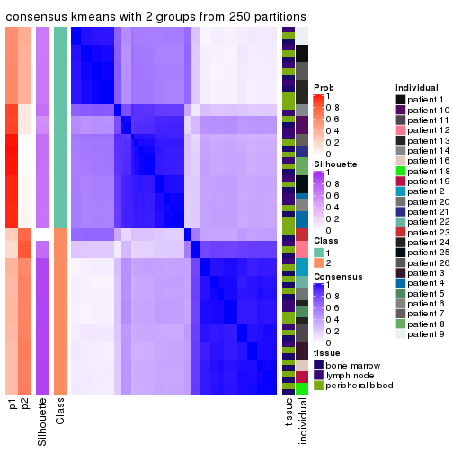</p>

</div>
<div id='tab-CV-kmeans-consensus-heatmap-2'>
<pre><code class="r">consensus_heatmap(res, k = 3)
</code></pre>

<p>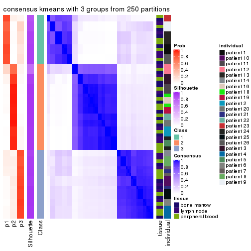</p>

</div>
<div id='tab-CV-kmeans-consensus-heatmap-3'>
<pre><code class="r">consensus_heatmap(res, k = 4)
</code></pre>

<p>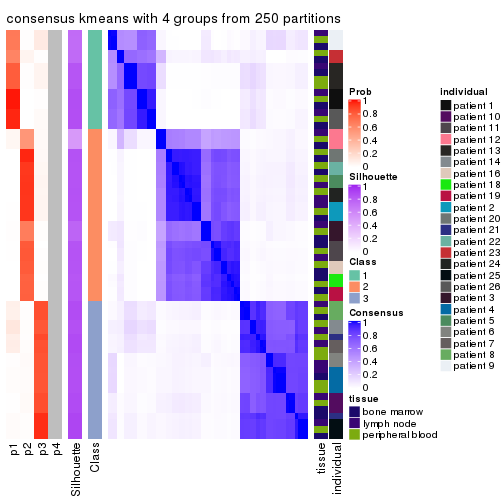</p>

</div>
<div id='tab-CV-kmeans-consensus-heatmap-4'>
<pre><code class="r">consensus_heatmap(res, k = 5)
</code></pre>

<p>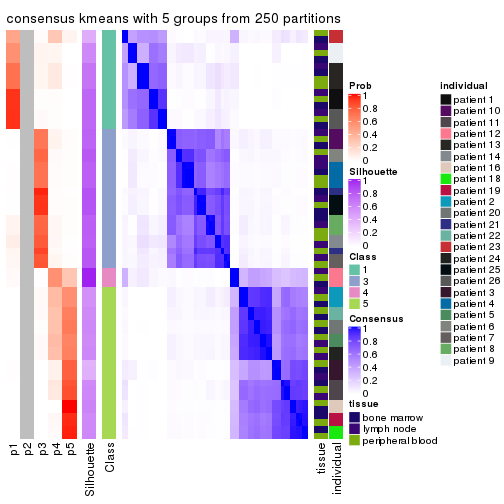</p>

</div>
<div id='tab-CV-kmeans-consensus-heatmap-5'>
<pre><code class="r">consensus_heatmap(res, k = 6)
</code></pre>

<p>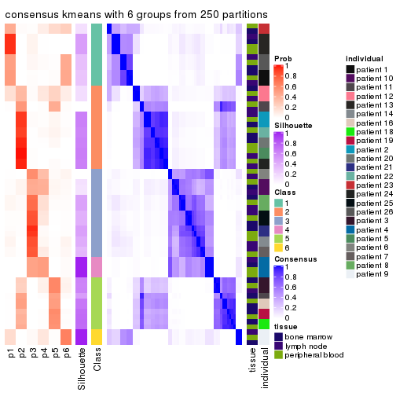</p>

</div>
</div>

Heatmaps for the membership of samples in all partitions to see how consistent they are:


<script>
$( function() {
	$( '#tabs-CV-kmeans-membership-heatmap' ).tabs();
} );
</script>
<div id='tabs-CV-kmeans-membership-heatmap'>
<ul>
<li><a href='#tab-CV-kmeans-membership-heatmap-1'>k = 2</a></li>
<li><a href='#tab-CV-kmeans-membership-heatmap-2'>k = 3</a></li>
<li><a href='#tab-CV-kmeans-membership-heatmap-3'>k = 4</a></li>
<li><a href='#tab-CV-kmeans-membership-heatmap-4'>k = 5</a></li>
<li><a href='#tab-CV-kmeans-membership-heatmap-5'>k = 6</a></li>
</ul>
<div id='tab-CV-kmeans-membership-heatmap-1'>
<pre><code class="r">membership_heatmap(res, k = 2)
</code></pre>

<p>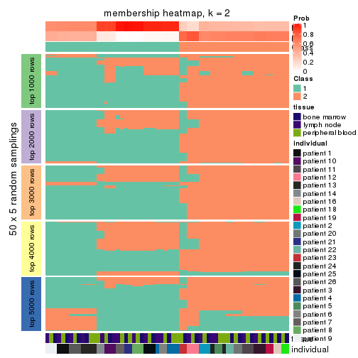</p>

</div>
<div id='tab-CV-kmeans-membership-heatmap-2'>
<pre><code class="r">membership_heatmap(res, k = 3)
</code></pre>

<p>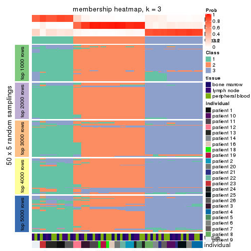</p>

</div>
<div id='tab-CV-kmeans-membership-heatmap-3'>
<pre><code class="r">membership_heatmap(res, k = 4)
</code></pre>

<p>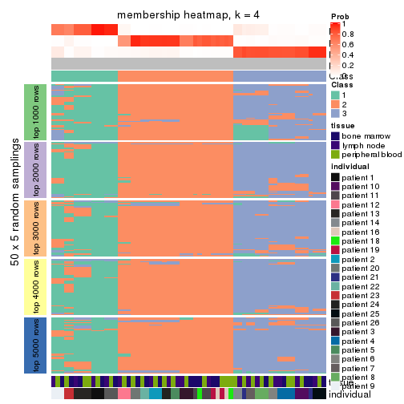</p>

</div>
<div id='tab-CV-kmeans-membership-heatmap-4'>
<pre><code class="r">membership_heatmap(res, k = 5)
</code></pre>

<p>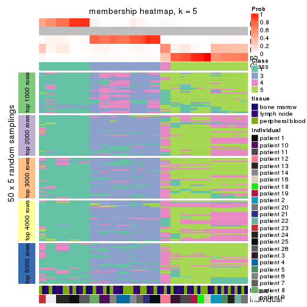</p>

</div>
<div id='tab-CV-kmeans-membership-heatmap-5'>
<pre><code class="r">membership_heatmap(res, k = 6)
</code></pre>

<p>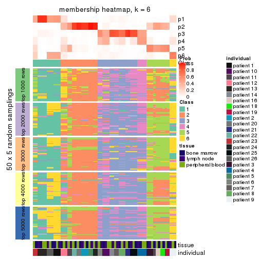</p>

</div>
</div>

As soon as we have had the classes for columns, we can look for signatures
which are significantly different between classes which can be candidate marks
for certain classes. Following are the heatmaps for signatures.


Signature heatmaps where rows are scaled:


<script>
$( function() {
	$( '#tabs-CV-kmeans-get-signatures' ).tabs();
} );
</script>
<div id='tabs-CV-kmeans-get-signatures'>
<ul>
<li><a href='#tab-CV-kmeans-get-signatures-1'>k = 2</a></li>
<li><a href='#tab-CV-kmeans-get-signatures-2'>k = 3</a></li>
<li><a href='#tab-CV-kmeans-get-signatures-3'>k = 4</a></li>
<li><a href='#tab-CV-kmeans-get-signatures-4'>k = 5</a></li>
<li><a href='#tab-CV-kmeans-get-signatures-5'>k = 6</a></li>
</ul>
<div id='tab-CV-kmeans-get-signatures-1'>
<pre><code class="r">get_signatures(res, k = 2)
</code></pre>

<p>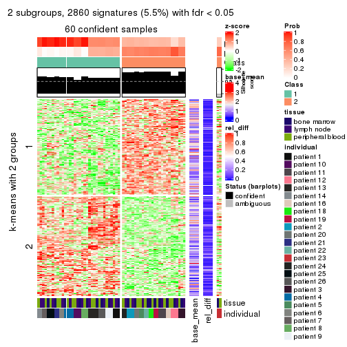</p>

</div>
<div id='tab-CV-kmeans-get-signatures-2'>
<pre><code class="r">get_signatures(res, k = 3)
</code></pre>

<p>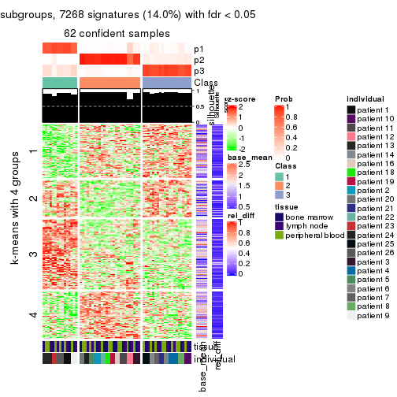</p>

</div>
<div id='tab-CV-kmeans-get-signatures-3'>
<pre><code class="r">get_signatures(res, k = 4)
</code></pre>

<p>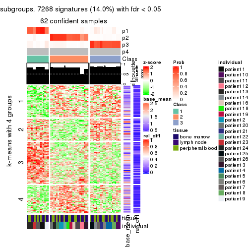</p>

</div>
<div id='tab-CV-kmeans-get-signatures-4'>
<pre><code class="r">get_signatures(res, k = 5)
</code></pre>

<p>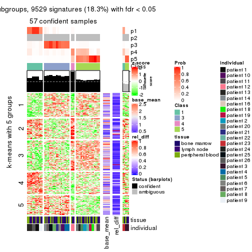</p>

</div>
<div id='tab-CV-kmeans-get-signatures-5'>
<pre><code class="r">get_signatures(res, k = 6)
</code></pre>

<p>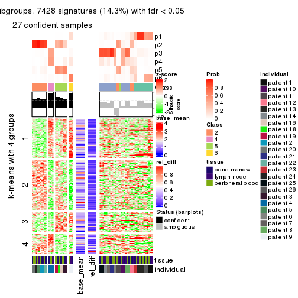</p>

</div>
</div>


Signature heatmaps where rows are not scaled:


<script>
$( function() {
	$( '#tabs-CV-kmeans-get-signatures-no-scale' ).tabs();
} );
</script>
<div id='tabs-CV-kmeans-get-signatures-no-scale'>
<ul>
<li><a href='#tab-CV-kmeans-get-signatures-no-scale-1'>k = 2</a></li>
<li><a href='#tab-CV-kmeans-get-signatures-no-scale-2'>k = 3</a></li>
<li><a href='#tab-CV-kmeans-get-signatures-no-scale-3'>k = 4</a></li>
<li><a href='#tab-CV-kmeans-get-signatures-no-scale-4'>k = 5</a></li>
<li><a href='#tab-CV-kmeans-get-signatures-no-scale-5'>k = 6</a></li>
</ul>
<div id='tab-CV-kmeans-get-signatures-no-scale-1'>
<pre><code class="r">get_signatures(res, k = 2, scale_rows = FALSE)
</code></pre>

<p>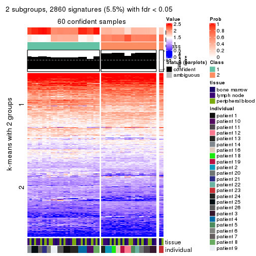</p>

</div>
<div id='tab-CV-kmeans-get-signatures-no-scale-2'>
<pre><code class="r">get_signatures(res, k = 3, scale_rows = FALSE)
</code></pre>

<p>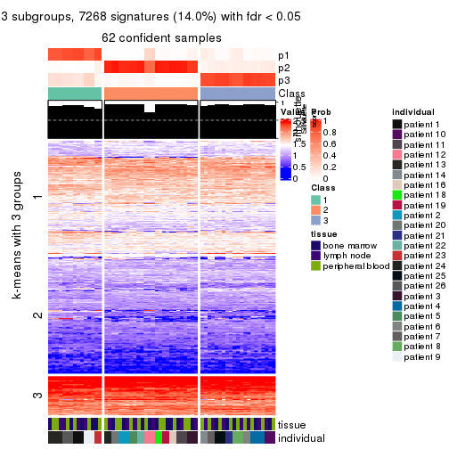</p>

</div>
<div id='tab-CV-kmeans-get-signatures-no-scale-3'>
<pre><code class="r">get_signatures(res, k = 4, scale_rows = FALSE)
</code></pre>

<p>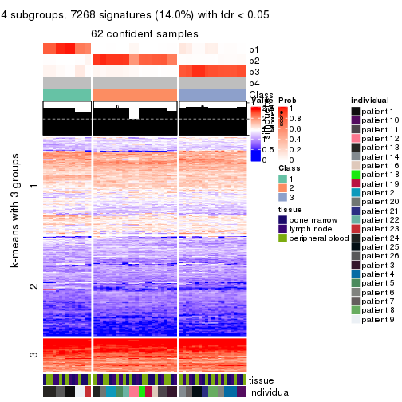</p>

</div>
<div id='tab-CV-kmeans-get-signatures-no-scale-4'>
<pre><code class="r">get_signatures(res, k = 5, scale_rows = FALSE)
</code></pre>

<p>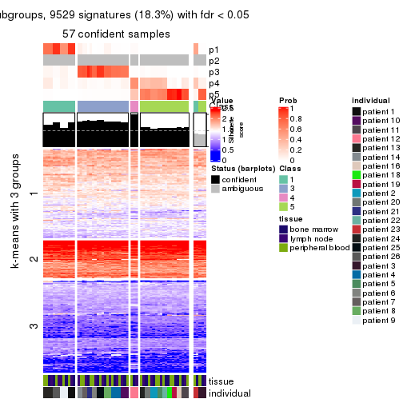</p>

</div>
<div id='tab-CV-kmeans-get-signatures-no-scale-5'>
<pre><code class="r">get_signatures(res, k = 6, scale_rows = FALSE)
</code></pre>

<p>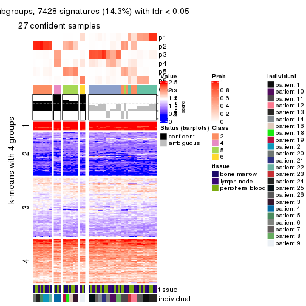</p>

</div>
</div>


Compare the overlap of signatures from different k:

```r
compare_signatures(res)
```

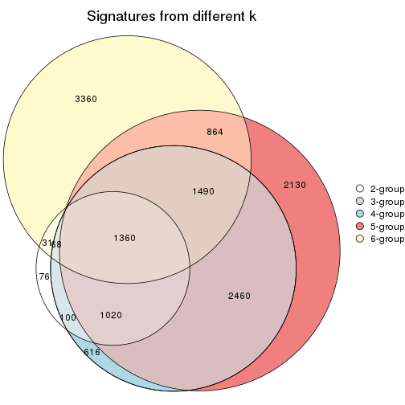

`get_signature()` returns a data frame invisibly. TO get the list of signatures, the function
call should be assigned to a variable explicitly. In following code, if `plot` argument is set
to `FALSE`, no heatmap is plotted while only the differential analysis is performed.

```r
# code only for demonstration
tb = get_signature(res, k = ..., plot = FALSE)
```

An example of the output of `tb` is:

```
#>   which_row         fdr    mean_1    mean_2 scaled_mean_1 scaled_mean_2 km
#> 1        38 0.042760348  8.373488  9.131774    -0.5533452     0.5164555  1
#> 2        40 0.018707592  7.106213  8.469186    -0.6173731     0.5762149  1
#> 3        55 0.019134737 10.221463 11.207825    -0.6159697     0.5749050  1
#> 4        59 0.006059896  5.921854  7.869574    -0.6899429     0.6439467  1
#> 5        60 0.018055526  8.928898 10.211722    -0.6204761     0.5791110  1
#> 6        98 0.009384629 15.714769 14.887706     0.6635654    -0.6193277  2
...
```

The columns in `tb` are:

1. `which_row`: row indices corresponding to the input matrix.
2. `fdr`: FDR for the differential test. 
3. `mean_x`: The mean value in group x.
4. `scaled_mean_x`: The mean value in group x after rows are scaled.
5. `km`: Row groups if k-means clustering is applied to rows.


UMAP plot which shows how samples are separated.


<script>
$( function() {
	$( '#tabs-CV-kmeans-dimension-reduction' ).tabs();
} );
</script>
<div id='tabs-CV-kmeans-dimension-reduction'>
<ul>
<li><a href='#tab-CV-kmeans-dimension-reduction-1'>k = 2</a></li>
<li><a href='#tab-CV-kmeans-dimension-reduction-2'>k = 3</a></li>
<li><a href='#tab-CV-kmeans-dimension-reduction-3'>k = 4</a></li>
<li><a href='#tab-CV-kmeans-dimension-reduction-4'>k = 5</a></li>
<li><a href='#tab-CV-kmeans-dimension-reduction-5'>k = 6</a></li>
</ul>
<div id='tab-CV-kmeans-dimension-reduction-1'>
<pre><code class="r">dimension_reduction(res, k = 2, method = &quot;UMAP&quot;)
</code></pre>

<p>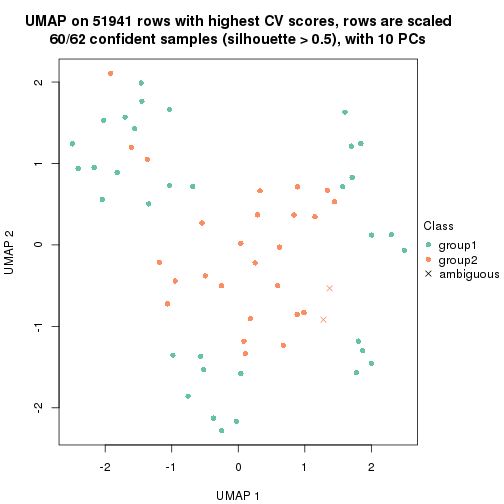</p>

</div>
<div id='tab-CV-kmeans-dimension-reduction-2'>
<pre><code class="r">dimension_reduction(res, k = 3, method = &quot;UMAP&quot;)
</code></pre>

<p>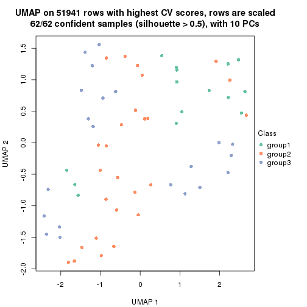</p>

</div>
<div id='tab-CV-kmeans-dimension-reduction-3'>
<pre><code class="r">dimension_reduction(res, k = 4, method = &quot;UMAP&quot;)
</code></pre>

<p>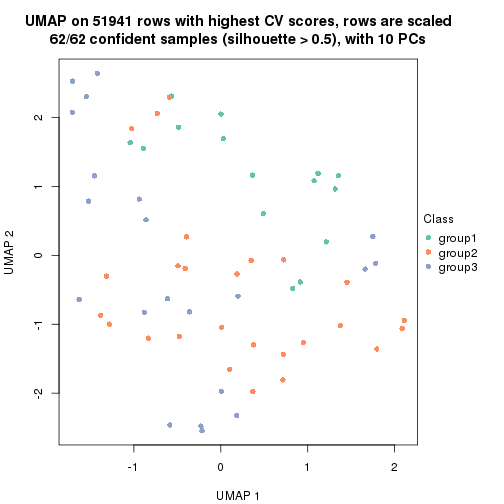</p>

</div>
<div id='tab-CV-kmeans-dimension-reduction-4'>
<pre><code class="r">dimension_reduction(res, k = 5, method = &quot;UMAP&quot;)
</code></pre>

<p>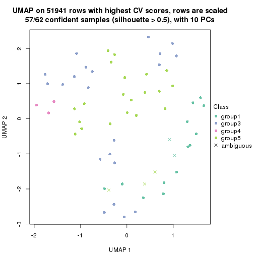</p>

</div>
<div id='tab-CV-kmeans-dimension-reduction-5'>
<pre><code class="r">dimension_reduction(res, k = 6, method = &quot;UMAP&quot;)
</code></pre>

<p>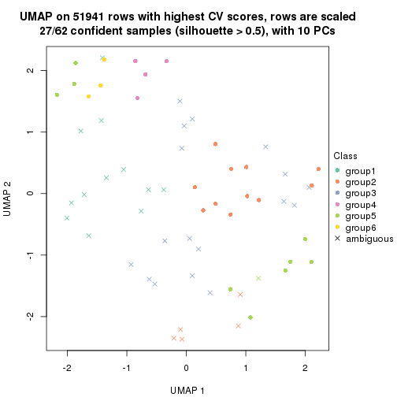</p>

</div>
</div>


Following heatmap shows how subgroups are split when increasing `k`:

```r
collect_classes(res)
```

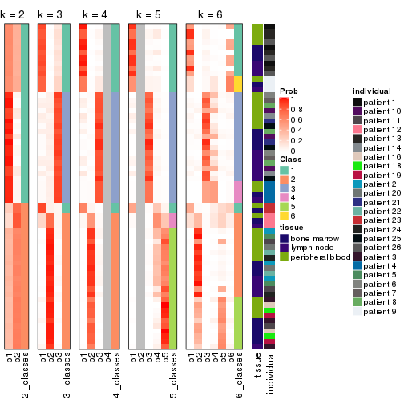


Test correlation between subgroups and known annotations. If the known
annotation is numeric, one-way ANOVA test is applied, and if the known
annotation is discrete, chi-squared contingency table test is applied.

```r
test_to_known_factors(res)
```

```
#>            n tissue(p) individual(p) k
#> CV:kmeans 60     0.678      2.23e-05 2
#> CV:kmeans 62     0.916      4.37e-09 3
#> CV:kmeans 62     0.916      4.37e-09 4
#> CV:kmeans 57     0.970      6.50e-12 5
#> CV:kmeans 27     0.962      1.42e-06 6
```


If matrix rows can be associated to genes, consider to use `functional_enrichment(res,
...)` to perform function enrichment for the signature genes. See [this vignette](http://bioconductor.org/packages/devel/bioc/vignettes/cola/inst/doc/functional_enrichment.html) for more detailed explanations.


 

---------------------------------------------------


### CV:skmeans


The object with results only for a single top-value method and a single partition method 
can be extracted as:

```r
res = res_list["CV", "skmeans"]
# you can also extract it by
# res = res_list["CV:skmeans"]
```

A summary of `res` and all the functions that can be applied to it:

```r
res
```

```
#> A 'ConsensusPartition' object with k = 2, 3, 4, 5, 6.
#>   On a matrix with 51941 rows and 62 columns.
#>   Top rows (1000, 2000, 3000, 4000, 5000) are extracted by 'CV' method.
#>   Subgroups are detected by 'skmeans' method.
#>   Performed in total 1250 partitions by row resampling.
#>   Best k for subgroups seems to be 2.
#> 
#> Following methods can be applied to this 'ConsensusPartition' object:
#>  [1] "cola_report"             "collect_classes"         "collect_plots"          
#>  [4] "collect_stats"           "colnames"                "compare_signatures"     
#>  [7] "consensus_heatmap"       "dimension_reduction"     "functional_enrichment"  
#> [10] "get_anno_col"            "get_anno"                "get_classes"            
#> [13] "get_consensus"           "get_matrix"              "get_membership"         
#> [16] "get_param"               "get_signatures"          "get_stats"              
#> [19] "is_best_k"               "is_stable_k"             "membership_heatmap"     
#> [22] "ncol"                    "nrow"                    "plot_ecdf"              
#> [25] "rownames"                "select_partition_number" "show"                   
#> [28] "suggest_best_k"          "test_to_known_factors"
```

`collect_plots()` function collects all the plots made from `res` for all `k` (number of partitions)
into one single page to provide an easy and fast comparison between different `k`.

```r
collect_plots(res)
```

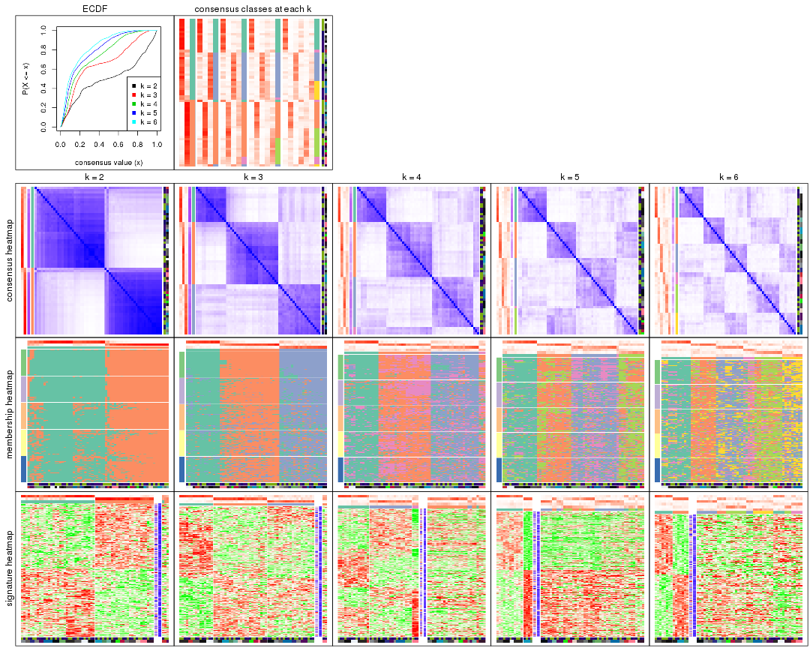

The plots are:

- The first row: a plot of the ECDF (empirical cumulative distribution
  function) curves of the consensus matrix for each `k` and the heatmap of
  predicted classes for each `k`.
- The second row: heatmaps of the consensus matrix for each `k`.
- The third row: heatmaps of the membership matrix for each `k`.
- The fouth row: heatmaps of the signatures for each `k`.

All the plots in panels can be made by individual functions and they are
plotted later in this section.

`select_partition_number()` produces several plots showing different
statistics for choosing "optimized" `k`. There are following statistics:

- ECDF curves of the consensus matrix for each `k`;
- 1-PAC. [The PAC
  score](https://en.wikipedia.org/wiki/Consensus_clustering#Over-interpretation_potential_of_consensus_clustering)
  measures the proportion of the ambiguous subgrouping.
- Mean silhouette score.
- Concordance. The mean probability of fiting the consensus class ids in all
  partitions.
- Area increased. Denote $A_k$ as the area under the ECDF curve for current
  `k`, the area increased is defined as $A_k - A_{k-1}$.
- Rand index. The percent of pairs of samples that are both in a same cluster
  or both are not in a same cluster in the partition of k and k-1.
- Jaccard index. The ratio of pairs of samples are both in a same cluster in
  the partition of k and k-1 and the pairs of samples are both in a same
  cluster in the partition k or k-1.

The detailed explanations of these statistics can be found in [the _cola_
vignette](http://bioconductor.org/packages/devel/bioc/vignettes/cola/inst/doc/cola.html#toc_13).

Generally speaking, lower PAC score, higher mean silhouette score or higher
concordance corresponds to better partition. Rand index and Jaccard index
measure how similar the current partition is compared to partition with `k-1`.
If they are too similar, we won't accept `k` is better than `k-1`.

```r
select_partition_number(res)
```

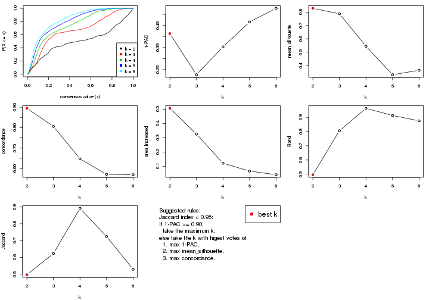

The numeric values for all these statistics can be obtained by `get_stats()`.

```r
get_stats(res)
```

```
#>   k 1-PAC mean_silhouette concordance area_increased  Rand Jaccard
#> 2 2 0.413           0.829       0.895         0.5062 0.497   0.497
#> 3 3 0.227           0.787       0.806         0.3257 0.806   0.623
#> 4 4 0.353           0.544       0.647         0.1215 0.964   0.892
#> 5 5 0.465           0.330       0.571         0.0664 0.913   0.724
#> 6 6 0.527           0.364       0.570         0.0412 0.875   0.529
```

`suggest_best_k()` suggests the best $k$ based on these statistics. The rules are as follows:

- All $k$ with Jaccard index larger than 0.95 are removed because increasing
  $k$ does not provide enough extra information. If all $k$ are removed, it is
  marked as no subgroup is detected.
- For all $k$ with 1-PAC score larger than 0.9, the maximal $k$ is taken as
  the best $k$, and other $k$ are marked as optional $k$.
- If it does not fit the second rule. The $k$ with the maximal vote of the
  highest 1-PAC score, highest mean silhouette, and highest concordance is
  taken as the best $k$.

```r
suggest_best_k(res)
```

```
#> [1] 2
```


Following shows the table of the partitions (You need to click the **show/hide
code output** link to see it). The membership matrix (columns with name `p*`)
is inferred by
[`clue::cl_consensus()`](https://www.rdocumentation.org/link/cl_consensus?package=clue)
function with the `SE` method. Basically the value in the membership matrix
represents the probability to belong to a certain group. The finall class
label for an item is determined with the group with highest probability it
belongs to.

In `get_classes()` function, the entropy is calculated from the membership
matrix and the silhouette score is calculated from the consensus matrix.


<script>
$( function() {
	$( '#tabs-CV-skmeans-get-classes' ).tabs();
} );
</script>
<div id='tabs-CV-skmeans-get-classes'>
<ul>
<li><a href='#tab-CV-skmeans-get-classes-1'>k = 2</a></li>
<li><a href='#tab-CV-skmeans-get-classes-2'>k = 3</a></li>
<li><a href='#tab-CV-skmeans-get-classes-3'>k = 4</a></li>
<li><a href='#tab-CV-skmeans-get-classes-4'>k = 5</a></li>
<li><a href='#tab-CV-skmeans-get-classes-5'>k = 6</a></li>
</ul>

<div id='tab-CV-skmeans-get-classes-1'>
<p><a id='tab-CV-skmeans-get-classes-1-a' style='color:#0366d6' href='#'>show/hide code output</a></p>
<pre><code class="r">cbind(get_classes(res, k = 2), get_membership(res, k = 2))
</code></pre>

<pre><code>#&gt;           class entropy silhouette    p1    p2
#&gt; GSM525314     1  0.1414     0.8714 0.980 0.020
#&gt; GSM525315     2  0.0672     0.9194 0.008 0.992
#&gt; GSM525316     2  0.6623     0.8249 0.172 0.828
#&gt; GSM525317     1  0.7376     0.8165 0.792 0.208
#&gt; GSM525318     1  0.7453     0.8103 0.788 0.212
#&gt; GSM525319     2  0.0938     0.9201 0.012 0.988
#&gt; GSM525320     1  0.8386     0.7405 0.732 0.268
#&gt; GSM525321     1  0.7745     0.8029 0.772 0.228
#&gt; GSM525322     1  0.9087     0.6805 0.676 0.324
#&gt; GSM525323     1  0.1843     0.8723 0.972 0.028
#&gt; GSM525324     2  0.9427     0.3428 0.360 0.640
#&gt; GSM525325     2  0.1633     0.9204 0.024 0.976
#&gt; GSM525326     2  0.4815     0.8846 0.104 0.896
#&gt; GSM525327     1  0.1843     0.8720 0.972 0.028
#&gt; GSM525328     1  0.2778     0.8728 0.952 0.048
#&gt; GSM525329     1  0.2043     0.8735 0.968 0.032
#&gt; GSM525330     2  0.0938     0.9205 0.012 0.988
#&gt; GSM525331     2  0.1843     0.9207 0.028 0.972
#&gt; GSM525332     2  0.2948     0.9162 0.052 0.948
#&gt; GSM525333     2  0.0376     0.9187 0.004 0.996
#&gt; GSM525334     1  0.6048     0.8557 0.852 0.148
#&gt; GSM525335     2  0.0376     0.9187 0.004 0.996
#&gt; GSM525336     2  0.9896     0.2855 0.440 0.560
#&gt; GSM525337     2  0.1184     0.9197 0.016 0.984
#&gt; GSM525338     1  0.6531     0.8489 0.832 0.168
#&gt; GSM525339     1  0.0376     0.8670 0.996 0.004
#&gt; GSM525340     1  0.3879     0.8599 0.924 0.076
#&gt; GSM525341     2  0.0672     0.9194 0.008 0.992
#&gt; GSM525342     2  0.4298     0.8990 0.088 0.912
#&gt; GSM525343     1  0.7376     0.8158 0.792 0.208
#&gt; GSM525344     1  0.7745     0.7967 0.772 0.228
#&gt; GSM525345     1  0.1414     0.8718 0.980 0.020
#&gt; GSM525346     1  0.9323     0.5704 0.652 0.348
#&gt; GSM525347     2  0.4690     0.8899 0.100 0.900
#&gt; GSM525348     2  0.6438     0.8316 0.164 0.836
#&gt; GSM525349     1  0.2948     0.8702 0.948 0.052
#&gt; GSM525350     2  0.0938     0.9203 0.012 0.988
#&gt; GSM525351     2  0.3114     0.9134 0.056 0.944
#&gt; GSM525352     2  0.2043     0.9204 0.032 0.968
#&gt; GSM525353     2  0.0672     0.9207 0.008 0.992
#&gt; GSM525354     1  0.4815     0.8719 0.896 0.104
#&gt; GSM525355     2  0.0376     0.9187 0.004 0.996
#&gt; GSM525356     1  0.9993    -0.0697 0.516 0.484
#&gt; GSM525357     1  0.4939     0.8698 0.892 0.108
#&gt; GSM525358     1  0.0672     0.8685 0.992 0.008
#&gt; GSM525359     1  0.1184     0.8711 0.984 0.016
#&gt; GSM525360     2  0.1184     0.9183 0.016 0.984
#&gt; GSM525361     2  0.4161     0.8976 0.084 0.916
#&gt; GSM525362     1  0.4562     0.8725 0.904 0.096
#&gt; GSM525363     2  0.0938     0.9213 0.012 0.988
#&gt; GSM525364     1  0.4298     0.8746 0.912 0.088
#&gt; GSM525365     1  0.3584     0.8769 0.932 0.068
#&gt; GSM525366     1  0.7299     0.8198 0.796 0.204
#&gt; GSM525367     1  0.0938     0.8694 0.988 0.012
#&gt; GSM525368     1  0.9710     0.5088 0.600 0.400
#&gt; GSM525369     2  0.3431     0.9106 0.064 0.936
#&gt; GSM525370     2  0.7299     0.7843 0.204 0.796
#&gt; GSM525371     1  0.1184     0.8714 0.984 0.016
#&gt; GSM525372     1  0.1843     0.8732 0.972 0.028
#&gt; GSM525373     2  0.1843     0.9172 0.028 0.972
#&gt; GSM525374     1  0.5737     0.8606 0.864 0.136
#&gt; GSM525375     1  0.0672     0.8685 0.992 0.008
</code></pre>

<script>
$('#tab-CV-skmeans-get-classes-1-a').parent().next().next().hide();
$('#tab-CV-skmeans-get-classes-1-a').click(function(){
  $('#tab-CV-skmeans-get-classes-1-a').parent().next().next().toggle();
  return(false);
});
</script>
</div>

<div id='tab-CV-skmeans-get-classes-2'>
<p><a id='tab-CV-skmeans-get-classes-2-a' style='color:#0366d6' href='#'>show/hide code output</a></p>
<pre><code class="r">cbind(get_classes(res, k = 3), get_membership(res, k = 3))
</code></pre>

<pre><code>#&gt;           class entropy silhouette    p1    p2    p3
#&gt; GSM525314     1   0.303      0.894 0.912 0.012 0.076
#&gt; GSM525315     2   0.435      0.815 0.020 0.852 0.128
#&gt; GSM525316     2   0.782      0.651 0.260 0.644 0.096
#&gt; GSM525317     3   0.604      0.801 0.108 0.104 0.788
#&gt; GSM525318     3   0.588      0.806 0.136 0.072 0.792
#&gt; GSM525319     2   0.448      0.815 0.020 0.844 0.136
#&gt; GSM525320     3   0.797      0.718 0.156 0.184 0.660
#&gt; GSM525321     3   0.780      0.751 0.216 0.120 0.664
#&gt; GSM525322     3   0.672      0.778 0.096 0.160 0.744
#&gt; GSM525323     1   0.454      0.848 0.836 0.016 0.148
#&gt; GSM525324     3   0.731      0.674 0.080 0.236 0.684
#&gt; GSM525325     2   0.334      0.830 0.032 0.908 0.060
#&gt; GSM525326     2   0.762      0.653 0.272 0.648 0.080
#&gt; GSM525327     1   0.195      0.895 0.952 0.008 0.040
#&gt; GSM525328     1   0.200      0.895 0.952 0.012 0.036
#&gt; GSM525329     3   0.686      0.610 0.356 0.024 0.620
#&gt; GSM525330     2   0.134      0.820 0.012 0.972 0.016
#&gt; GSM525331     2   0.493      0.813 0.044 0.836 0.120
#&gt; GSM525332     2   0.570      0.802 0.120 0.804 0.076
#&gt; GSM525333     2   0.294      0.824 0.012 0.916 0.072
#&gt; GSM525334     3   0.733      0.742 0.256 0.072 0.672
#&gt; GSM525335     2   0.313      0.828 0.008 0.904 0.088
#&gt; GSM525336     1   0.456      0.817 0.852 0.112 0.036
#&gt; GSM525337     2   0.445      0.831 0.032 0.856 0.112
#&gt; GSM525338     3   0.566      0.813 0.128 0.068 0.804
#&gt; GSM525339     1   0.270      0.895 0.928 0.016 0.056
#&gt; GSM525340     1   0.203      0.891 0.952 0.016 0.032
#&gt; GSM525341     2   0.421      0.822 0.020 0.860 0.120
#&gt; GSM525342     2   0.542      0.811 0.096 0.820 0.084
#&gt; GSM525343     3   0.466      0.810 0.072 0.072 0.856
#&gt; GSM525344     3   0.771      0.731 0.196 0.128 0.676
#&gt; GSM525345     1   0.601      0.773 0.768 0.048 0.184
#&gt; GSM525346     3   0.747      0.743 0.176 0.128 0.696
#&gt; GSM525347     2   0.767      0.721 0.192 0.680 0.128
#&gt; GSM525348     2   0.818      0.416 0.392 0.532 0.076
#&gt; GSM525349     1   0.260      0.890 0.932 0.016 0.052
#&gt; GSM525350     2   0.162      0.823 0.012 0.964 0.024
#&gt; GSM525351     2   0.621      0.786 0.152 0.772 0.076
#&gt; GSM525352     2   0.623      0.793 0.128 0.776 0.096
#&gt; GSM525353     2   0.494      0.829 0.056 0.840 0.104
#&gt; GSM525354     3   0.599      0.803 0.168 0.056 0.776
#&gt; GSM525355     2   0.541      0.816 0.052 0.812 0.136
#&gt; GSM525356     1   0.437      0.836 0.868 0.076 0.056
#&gt; GSM525357     3   0.417      0.808 0.092 0.036 0.872
#&gt; GSM525358     1   0.296      0.893 0.912 0.008 0.080
#&gt; GSM525359     1   0.417      0.885 0.876 0.048 0.076
#&gt; GSM525360     2   0.493      0.810 0.024 0.820 0.156
#&gt; GSM525361     2   0.596      0.791 0.096 0.792 0.112
#&gt; GSM525362     3   0.478      0.811 0.124 0.036 0.840
#&gt; GSM525363     2   0.472      0.808 0.016 0.824 0.160
#&gt; GSM525364     3   0.551      0.784 0.188 0.028 0.784
#&gt; GSM525365     3   0.632      0.762 0.228 0.040 0.732
#&gt; GSM525366     3   0.516      0.806 0.096 0.072 0.832
#&gt; GSM525367     1   0.429      0.827 0.832 0.004 0.164
#&gt; GSM525368     3   0.585      0.790 0.068 0.140 0.792
#&gt; GSM525369     2   0.555      0.816 0.076 0.812 0.112
#&gt; GSM525370     2   0.854      0.334 0.408 0.496 0.096
#&gt; GSM525371     1   0.311      0.883 0.900 0.004 0.096
#&gt; GSM525372     3   0.659      0.610 0.352 0.016 0.632
#&gt; GSM525373     2   0.511      0.798 0.024 0.808 0.168
#&gt; GSM525374     3   0.418      0.810 0.072 0.052 0.876
#&gt; GSM525375     1   0.319      0.880 0.896 0.004 0.100
</code></pre>

<script>
$('#tab-CV-skmeans-get-classes-2-a').parent().next().next().hide();
$('#tab-CV-skmeans-get-classes-2-a').click(function(){
  $('#tab-CV-skmeans-get-classes-2-a').parent().next().next().toggle();
  return(false);
});
</script>
</div>

<div id='tab-CV-skmeans-get-classes-3'>
<p><a id='tab-CV-skmeans-get-classes-3-a' style='color:#0366d6' href='#'>show/hide code output</a></p>
<pre><code class="r">cbind(get_classes(res, k = 4), get_membership(res, k = 4))
</code></pre>

<pre><code>#&gt;           class entropy silhouette    p1    p2    p3    p4
#&gt; GSM525314     1   0.359     0.7779 0.880 0.040 0.044 0.036
#&gt; GSM525315     2   0.657     0.4698 0.016 0.612 0.068 0.304
#&gt; GSM525316     2   0.800     0.0155 0.160 0.552 0.048 0.240
#&gt; GSM525317     3   0.744     0.6422 0.088 0.064 0.612 0.236
#&gt; GSM525318     3   0.669     0.6666 0.100 0.032 0.672 0.196
#&gt; GSM525319     2   0.636     0.3855 0.008 0.544 0.048 0.400
#&gt; GSM525320     3   0.893     0.4816 0.136 0.136 0.484 0.244
#&gt; GSM525321     3   0.841     0.5728 0.180 0.076 0.536 0.208
#&gt; GSM525322     3   0.750     0.6246 0.092 0.100 0.636 0.172
#&gt; GSM525323     1   0.661     0.6522 0.688 0.032 0.152 0.128
#&gt; GSM525324     3   0.817     0.4043 0.036 0.180 0.500 0.284
#&gt; GSM525325     2   0.469     0.5086 0.020 0.796 0.028 0.156
#&gt; GSM525326     4   0.822     0.5282 0.168 0.364 0.032 0.436
#&gt; GSM525327     1   0.386     0.7696 0.856 0.012 0.040 0.092
#&gt; GSM525328     1   0.404     0.7645 0.840 0.004 0.056 0.100
#&gt; GSM525329     3   0.734     0.5791 0.256 0.028 0.592 0.124
#&gt; GSM525330     2   0.266     0.4973 0.008 0.908 0.012 0.072
#&gt; GSM525331     2   0.625     0.3813 0.048 0.688 0.040 0.224
#&gt; GSM525332     2   0.627     0.3654 0.032 0.688 0.060 0.220
#&gt; GSM525333     2   0.495     0.4673 0.004 0.696 0.012 0.288
#&gt; GSM525334     3   0.729     0.6484 0.156 0.060 0.648 0.136
#&gt; GSM525335     2   0.602     0.4524 0.004 0.612 0.048 0.336
#&gt; GSM525336     1   0.730     0.5114 0.628 0.104 0.052 0.216
#&gt; GSM525337     2   0.633     0.4907 0.012 0.652 0.076 0.260
#&gt; GSM525338     3   0.489     0.6957 0.064 0.028 0.808 0.100
#&gt; GSM525339     1   0.296     0.7848 0.904 0.012 0.040 0.044
#&gt; GSM525340     1   0.343     0.7749 0.884 0.020 0.036 0.060
#&gt; GSM525341     2   0.601     0.4902 0.008 0.628 0.044 0.320
#&gt; GSM525342     2   0.642     0.2963 0.072 0.676 0.028 0.224
#&gt; GSM525343     3   0.628     0.6672 0.048 0.052 0.700 0.200
#&gt; GSM525344     3   0.808     0.5771 0.176 0.052 0.552 0.220
#&gt; GSM525345     1   0.787     0.5253 0.584 0.056 0.200 0.160
#&gt; GSM525346     3   0.789     0.5449 0.100 0.064 0.548 0.288
#&gt; GSM525347     2   0.864    -0.0478 0.140 0.464 0.080 0.316
#&gt; GSM525348     4   0.859     0.6309 0.256 0.320 0.032 0.392
#&gt; GSM525349     1   0.469     0.7383 0.804 0.016 0.044 0.136
#&gt; GSM525350     2   0.387     0.4856 0.008 0.844 0.028 0.120
#&gt; GSM525351     2   0.709     0.2679 0.096 0.624 0.036 0.244
#&gt; GSM525352     2   0.664     0.3525 0.068 0.680 0.052 0.200
#&gt; GSM525353     2   0.666     0.2926 0.024 0.552 0.044 0.380
#&gt; GSM525354     3   0.578     0.6970 0.072 0.044 0.756 0.128
#&gt; GSM525355     2   0.689     0.3246 0.012 0.488 0.072 0.428
#&gt; GSM525356     1   0.722     0.4867 0.632 0.088 0.056 0.224
#&gt; GSM525357     3   0.431     0.6974 0.032 0.024 0.832 0.112
#&gt; GSM525358     1   0.326     0.7831 0.888 0.008 0.052 0.052
#&gt; GSM525359     1   0.409     0.7710 0.852 0.020 0.064 0.064
#&gt; GSM525360     2   0.672     0.4289 0.012 0.568 0.072 0.348
#&gt; GSM525361     2   0.705     0.3124 0.076 0.652 0.064 0.208
#&gt; GSM525362     3   0.597     0.6849 0.056 0.028 0.712 0.204
#&gt; GSM525363     2   0.664     0.3745 0.012 0.520 0.056 0.412
#&gt; GSM525364     3   0.838     0.5680 0.224 0.048 0.504 0.224
#&gt; GSM525365     3   0.808     0.5872 0.248 0.056 0.548 0.148
#&gt; GSM525366     3   0.688     0.6625 0.152 0.040 0.672 0.136
#&gt; GSM525367     1   0.641     0.6557 0.688 0.016 0.160 0.136
#&gt; GSM525368     3   0.730     0.6268 0.068 0.080 0.628 0.224
#&gt; GSM525369     2   0.629     0.4429 0.056 0.688 0.036 0.220
#&gt; GSM525370     4   0.841     0.6208 0.256 0.256 0.032 0.456
#&gt; GSM525371     1   0.439     0.7609 0.816 0.004 0.056 0.124
#&gt; GSM525372     3   0.706     0.5569 0.284 0.012 0.584 0.120
#&gt; GSM525373     2   0.678     0.4556 0.004 0.612 0.136 0.248
#&gt; GSM525374     3   0.382     0.6961 0.036 0.016 0.860 0.088
#&gt; GSM525375     1   0.305     0.7818 0.900 0.012 0.044 0.044
</code></pre>

<script>
$('#tab-CV-skmeans-get-classes-3-a').parent().next().next().hide();
$('#tab-CV-skmeans-get-classes-3-a').click(function(){
  $('#tab-CV-skmeans-get-classes-3-a').parent().next().next().toggle();
  return(false);
});
</script>
</div>

<div id='tab-CV-skmeans-get-classes-4'>
<p><a id='tab-CV-skmeans-get-classes-4-a' style='color:#0366d6' href='#'>show/hide code output</a></p>
<pre><code class="r">cbind(get_classes(res, k = 5), get_membership(res, k = 5))
</code></pre>

<pre><code>#&gt;           class entropy silhouette    p1    p2    p3    p4    p5
#&gt; GSM525314     1   0.345     0.7172 0.856 0.000 0.036 0.080 0.028
#&gt; GSM525315     2   0.442     0.5251 0.004 0.804 0.032 0.076 0.084
#&gt; GSM525316     5   0.816     0.3234 0.148 0.188 0.040 0.112 0.512
#&gt; GSM525317     3   0.791     0.0486 0.096 0.040 0.432 0.360 0.072
#&gt; GSM525318     3   0.727     0.0902 0.052 0.036 0.480 0.368 0.064
#&gt; GSM525319     2   0.443     0.5142 0.004 0.808 0.052 0.076 0.060
#&gt; GSM525320     3   0.843     0.0736 0.052 0.076 0.380 0.356 0.136
#&gt; GSM525321     3   0.760     0.2841 0.104 0.108 0.560 0.200 0.028
#&gt; GSM525322     3   0.826     0.1600 0.068 0.104 0.472 0.276 0.080
#&gt; GSM525323     1   0.645     0.5794 0.644 0.004 0.076 0.176 0.100
#&gt; GSM525324     3   0.879    -0.3071 0.052 0.160 0.408 0.264 0.116
#&gt; GSM525325     2   0.551     0.2630 0.008 0.576 0.012 0.032 0.372
#&gt; GSM525326     5   0.799     0.1767 0.060 0.292 0.020 0.192 0.436
#&gt; GSM525327     1   0.439     0.7054 0.800 0.000 0.036 0.092 0.072
#&gt; GSM525328     1   0.584     0.6675 0.724 0.032 0.044 0.116 0.084
#&gt; GSM525329     3   0.583     0.3234 0.204 0.028 0.660 0.108 0.000
#&gt; GSM525330     2   0.561     0.1715 0.008 0.544 0.016 0.028 0.404
#&gt; GSM525331     5   0.737     0.2022 0.056 0.296 0.036 0.084 0.528
#&gt; GSM525332     5   0.639     0.1733 0.020 0.320 0.024 0.064 0.572
#&gt; GSM525333     2   0.512     0.4488 0.000 0.696 0.016 0.060 0.228
#&gt; GSM525334     3   0.753     0.2956 0.092 0.044 0.552 0.244 0.068
#&gt; GSM525335     2   0.629     0.4137 0.008 0.648 0.040 0.116 0.188
#&gt; GSM525336     1   0.788     0.4104 0.452 0.056 0.016 0.224 0.252
#&gt; GSM525337     2   0.559     0.4842 0.008 0.704 0.028 0.084 0.176
#&gt; GSM525338     3   0.578     0.2941 0.076 0.052 0.716 0.140 0.016
#&gt; GSM525339     1   0.262     0.7217 0.900 0.000 0.040 0.048 0.012
#&gt; GSM525340     1   0.420     0.7212 0.812 0.012 0.008 0.092 0.076
#&gt; GSM525341     2   0.433     0.5364 0.012 0.808 0.016 0.100 0.064
#&gt; GSM525342     5   0.660     0.3093 0.056 0.244 0.016 0.072 0.612
#&gt; GSM525343     3   0.692     0.1541 0.036 0.040 0.528 0.340 0.056
#&gt; GSM525344     3   0.875    -0.0333 0.108 0.080 0.392 0.316 0.104
#&gt; GSM525345     1   0.766     0.4051 0.512 0.004 0.160 0.212 0.112
#&gt; GSM525346     4   0.848     0.0000 0.056 0.052 0.312 0.384 0.196
#&gt; GSM525347     5   0.827     0.1254 0.096 0.352 0.020 0.160 0.372
#&gt; GSM525348     5   0.822     0.2471 0.112 0.216 0.012 0.220 0.440
#&gt; GSM525349     1   0.567     0.6594 0.708 0.024 0.012 0.132 0.124
#&gt; GSM525350     2   0.614     0.0910 0.020 0.500 0.012 0.048 0.420
#&gt; GSM525351     5   0.670     0.3201 0.068 0.232 0.008 0.088 0.604
#&gt; GSM525352     5   0.693     0.2347 0.036 0.292 0.020 0.100 0.552
#&gt; GSM525353     2   0.678     0.3197 0.024 0.604 0.032 0.120 0.220
#&gt; GSM525354     3   0.592     0.3145 0.076 0.032 0.704 0.156 0.032
#&gt; GSM525355     2   0.724     0.3367 0.008 0.560 0.068 0.172 0.192
#&gt; GSM525356     1   0.767     0.3498 0.424 0.044 0.012 0.188 0.332
#&gt; GSM525357     3   0.494     0.2772 0.036 0.044 0.764 0.144 0.012
#&gt; GSM525358     1   0.352     0.7173 0.856 0.000 0.048 0.060 0.036
#&gt; GSM525359     1   0.421     0.6995 0.824 0.012 0.044 0.084 0.036
#&gt; GSM525360     2   0.490     0.5133 0.008 0.780 0.056 0.092 0.064
#&gt; GSM525361     5   0.741     0.2055 0.028 0.308 0.036 0.128 0.500
#&gt; GSM525362     3   0.658     0.1648 0.040 0.020 0.544 0.344 0.052
#&gt; GSM525363     2   0.555     0.4876 0.016 0.740 0.056 0.080 0.108
#&gt; GSM525364     3   0.827    -0.0142 0.108 0.032 0.384 0.364 0.112
#&gt; GSM525365     3   0.745     0.2670 0.124 0.068 0.560 0.220 0.028
#&gt; GSM525366     3   0.733     0.2204 0.108 0.052 0.564 0.240 0.036
#&gt; GSM525367     1   0.688     0.5345 0.592 0.000 0.108 0.192 0.108
#&gt; GSM525368     3   0.761    -0.2143 0.028 0.096 0.484 0.324 0.068
#&gt; GSM525369     2   0.687     0.1469 0.032 0.492 0.024 0.072 0.380
#&gt; GSM525370     5   0.889     0.1762 0.172 0.260 0.020 0.224 0.324
#&gt; GSM525371     1   0.568     0.6723 0.724 0.016 0.052 0.136 0.072
#&gt; GSM525372     3   0.658     0.3091 0.220 0.016 0.612 0.124 0.028
#&gt; GSM525373     2   0.616     0.4796 0.012 0.688 0.100 0.068 0.132
#&gt; GSM525374     3   0.472     0.2523 0.028 0.032 0.760 0.172 0.008
#&gt; GSM525375     1   0.323     0.7227 0.872 0.000 0.032 0.056 0.040
</code></pre>

<script>
$('#tab-CV-skmeans-get-classes-4-a').parent().next().next().hide();
$('#tab-CV-skmeans-get-classes-4-a').click(function(){
  $('#tab-CV-skmeans-get-classes-4-a').parent().next().next().toggle();
  return(false);
});
</script>
</div>

<div id='tab-CV-skmeans-get-classes-5'>
<p><a id='tab-CV-skmeans-get-classes-5-a' style='color:#0366d6' href='#'>show/hide code output</a></p>
<pre><code class="r">cbind(get_classes(res, k = 6), get_membership(res, k = 6))
</code></pre>

<pre><code>#&gt;           class entropy silhouette    p1    p2    p3    p4    p5    p6
#&gt; GSM525314     1   0.417     0.6366 0.804 0.008 0.020 0.092 0.016 0.060
#&gt; GSM525315     2   0.525     0.5039 0.004 0.724 0.056 0.040 0.140 0.036
#&gt; GSM525316     5   0.825     0.3152 0.136 0.080 0.032 0.124 0.480 0.148
#&gt; GSM525317     6   0.604     0.3077 0.032 0.040 0.216 0.028 0.040 0.644
#&gt; GSM525318     6   0.637     0.2711 0.056 0.016 0.256 0.052 0.028 0.592
#&gt; GSM525319     2   0.533     0.5738 0.008 0.732 0.036 0.076 0.104 0.044
#&gt; GSM525320     6   0.884     0.1629 0.072 0.108 0.220 0.040 0.204 0.356
#&gt; GSM525321     3   0.807     0.1969 0.088 0.156 0.508 0.056 0.060 0.132
#&gt; GSM525322     3   0.691     0.2569 0.032 0.068 0.608 0.044 0.084 0.164
#&gt; GSM525323     1   0.661     0.4771 0.612 0.012 0.044 0.160 0.044 0.128
#&gt; GSM525324     6   0.878     0.1467 0.036 0.156 0.268 0.080 0.108 0.352
#&gt; GSM525325     5   0.650     0.2110 0.004 0.380 0.016 0.084 0.468 0.048
#&gt; GSM525326     4   0.764     0.3312 0.044 0.184 0.008 0.484 0.192 0.088
#&gt; GSM525327     1   0.585     0.5553 0.656 0.008 0.040 0.200 0.028 0.068
#&gt; GSM525328     1   0.647     0.5087 0.604 0.020 0.052 0.228 0.032 0.064
#&gt; GSM525329     3   0.629     0.2859 0.204 0.008 0.608 0.048 0.016 0.116
#&gt; GSM525330     5   0.609     0.3230 0.008 0.304 0.008 0.068 0.564 0.048
#&gt; GSM525331     5   0.655     0.3928 0.040 0.192 0.016 0.080 0.616 0.056
#&gt; GSM525332     5   0.627     0.4689 0.040 0.124 0.016 0.076 0.664 0.080
#&gt; GSM525333     2   0.586     0.4362 0.000 0.588 0.000 0.164 0.216 0.032
#&gt; GSM525334     3   0.642     0.3345 0.068 0.044 0.652 0.024 0.068 0.144
#&gt; GSM525335     2   0.712     0.4023 0.016 0.512 0.020 0.136 0.256 0.060
#&gt; GSM525336     4   0.690     0.1675 0.316 0.040 0.020 0.512 0.064 0.048
#&gt; GSM525337     2   0.574     0.5274 0.004 0.680 0.040 0.056 0.168 0.052
#&gt; GSM525338     3   0.626     0.1562 0.052 0.012 0.580 0.052 0.024 0.280
#&gt; GSM525339     1   0.295     0.6401 0.880 0.004 0.036 0.048 0.024 0.008
#&gt; GSM525340     1   0.502     0.5928 0.716 0.012 0.016 0.188 0.044 0.024
#&gt; GSM525341     2   0.545     0.5254 0.004 0.716 0.060 0.044 0.128 0.048
#&gt; GSM525342     5   0.752     0.4432 0.064 0.108 0.024 0.144 0.556 0.104
#&gt; GSM525343     6   0.629     0.2185 0.044 0.020 0.300 0.028 0.040 0.568
#&gt; GSM525344     3   0.822     0.1551 0.060 0.060 0.488 0.152 0.084 0.156
#&gt; GSM525345     1   0.750     0.3688 0.496 0.012 0.080 0.152 0.036 0.224
#&gt; GSM525346     6   0.826     0.1019 0.044 0.068 0.312 0.140 0.052 0.384
#&gt; GSM525347     5   0.837     0.1213 0.068 0.224 0.048 0.292 0.336 0.032
#&gt; GSM525348     4   0.720     0.4452 0.092 0.116 0.016 0.572 0.156 0.048
#&gt; GSM525349     1   0.658     0.4170 0.568 0.012 0.040 0.268 0.060 0.052
#&gt; GSM525350     5   0.612     0.3814 0.016 0.288 0.004 0.080 0.572 0.040
#&gt; GSM525351     5   0.665     0.4421 0.024 0.152 0.008 0.152 0.596 0.068
#&gt; GSM525352     5   0.649     0.4442 0.016 0.092 0.032 0.168 0.628 0.064
#&gt; GSM525353     2   0.748     0.2615 0.020 0.456 0.028 0.260 0.192 0.044
#&gt; GSM525354     3   0.577     0.3357 0.068 0.012 0.676 0.044 0.024 0.176
#&gt; GSM525355     2   0.703     0.4502 0.008 0.564 0.024 0.136 0.144 0.124
#&gt; GSM525356     4   0.768     0.2313 0.284 0.036 0.044 0.464 0.124 0.048
#&gt; GSM525357     3   0.619     0.2045 0.032 0.060 0.632 0.036 0.024 0.216
#&gt; GSM525358     1   0.378     0.6297 0.840 0.016 0.036 0.060 0.032 0.016
#&gt; GSM525359     1   0.480     0.6122 0.768 0.004 0.052 0.096 0.032 0.048
#&gt; GSM525360     2   0.562     0.5162 0.000 0.708 0.076 0.072 0.080 0.064
#&gt; GSM525361     5   0.701     0.4415 0.060 0.128 0.008 0.108 0.592 0.104
#&gt; GSM525362     6   0.690     0.1859 0.064 0.028 0.332 0.036 0.040 0.500
#&gt; GSM525363     2   0.535     0.5699 0.008 0.736 0.048 0.068 0.092 0.048
#&gt; GSM525364     6   0.849     0.1291 0.168 0.036 0.260 0.068 0.080 0.388
#&gt; GSM525365     3   0.845     0.0814 0.176 0.072 0.428 0.064 0.052 0.208
#&gt; GSM525366     3   0.707     0.2657 0.068 0.084 0.604 0.060 0.036 0.148
#&gt; GSM525367     1   0.693     0.4258 0.556 0.008 0.076 0.176 0.020 0.164
#&gt; GSM525368     6   0.801     0.1315 0.020 0.128 0.340 0.068 0.064 0.380
#&gt; GSM525369     5   0.709     0.3010 0.020 0.340 0.032 0.100 0.468 0.040
#&gt; GSM525370     4   0.729     0.4279 0.072 0.188 0.024 0.564 0.088 0.064
#&gt; GSM525371     1   0.654     0.4767 0.580 0.016 0.068 0.248 0.020 0.068
#&gt; GSM525372     3   0.658     0.3068 0.136 0.028 0.620 0.040 0.028 0.148
#&gt; GSM525373     2   0.613     0.5300 0.012 0.672 0.076 0.052 0.132 0.056
#&gt; GSM525374     3   0.626     0.1701 0.024 0.052 0.604 0.056 0.016 0.248
#&gt; GSM525375     1   0.432     0.6245 0.796 0.008 0.056 0.092 0.012 0.036
</code></pre>

<script>
$('#tab-CV-skmeans-get-classes-5-a').parent().next().next().hide();
$('#tab-CV-skmeans-get-classes-5-a').click(function(){
  $('#tab-CV-skmeans-get-classes-5-a').parent().next().next().toggle();
  return(false);
});
</script>
</div>
</div>

Heatmaps for the consensus matrix. It visualizes the probability of two
samples to be in a same group.


<script>
$( function() {
	$( '#tabs-CV-skmeans-consensus-heatmap' ).tabs();
} );
</script>
<div id='tabs-CV-skmeans-consensus-heatmap'>
<ul>
<li><a href='#tab-CV-skmeans-consensus-heatmap-1'>k = 2</a></li>
<li><a href='#tab-CV-skmeans-consensus-heatmap-2'>k = 3</a></li>
<li><a href='#tab-CV-skmeans-consensus-heatmap-3'>k = 4</a></li>
<li><a href='#tab-CV-skmeans-consensus-heatmap-4'>k = 5</a></li>
<li><a href='#tab-CV-skmeans-consensus-heatmap-5'>k = 6</a></li>
</ul>
<div id='tab-CV-skmeans-consensus-heatmap-1'>
<pre><code class="r">consensus_heatmap(res, k = 2)
</code></pre>

<p>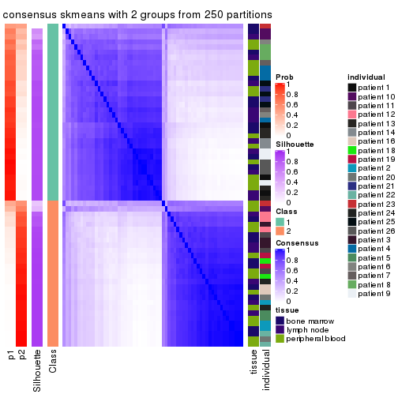</p>

</div>
<div id='tab-CV-skmeans-consensus-heatmap-2'>
<pre><code class="r">consensus_heatmap(res, k = 3)
</code></pre>

<p>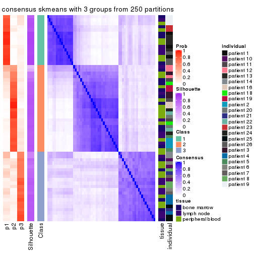</p>

</div>
<div id='tab-CV-skmeans-consensus-heatmap-3'>
<pre><code class="r">consensus_heatmap(res, k = 4)
</code></pre>

<p>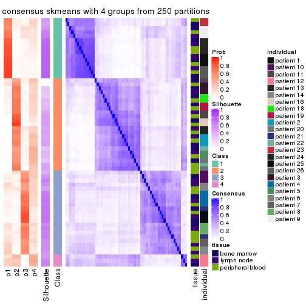</p>

</div>
<div id='tab-CV-skmeans-consensus-heatmap-4'>
<pre><code class="r">consensus_heatmap(res, k = 5)
</code></pre>

<p>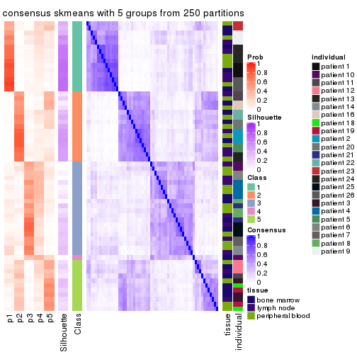</p>

</div>
<div id='tab-CV-skmeans-consensus-heatmap-5'>
<pre><code class="r">consensus_heatmap(res, k = 6)
</code></pre>

<p>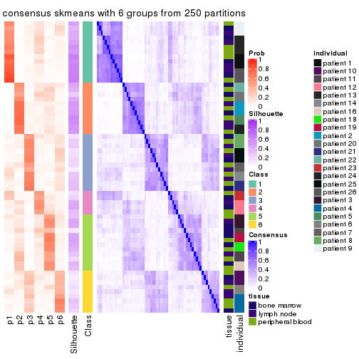</p>

</div>
</div>

Heatmaps for the membership of samples in all partitions to see how consistent they are:


<script>
$( function() {
	$( '#tabs-CV-skmeans-membership-heatmap' ).tabs();
} );
</script>
<div id='tabs-CV-skmeans-membership-heatmap'>
<ul>
<li><a href='#tab-CV-skmeans-membership-heatmap-1'>k = 2</a></li>
<li><a href='#tab-CV-skmeans-membership-heatmap-2'>k = 3</a></li>
<li><a href='#tab-CV-skmeans-membership-heatmap-3'>k = 4</a></li>
<li><a href='#tab-CV-skmeans-membership-heatmap-4'>k = 5</a></li>
<li><a href='#tab-CV-skmeans-membership-heatmap-5'>k = 6</a></li>
</ul>
<div id='tab-CV-skmeans-membership-heatmap-1'>
<pre><code class="r">membership_heatmap(res, k = 2)
</code></pre>

<p>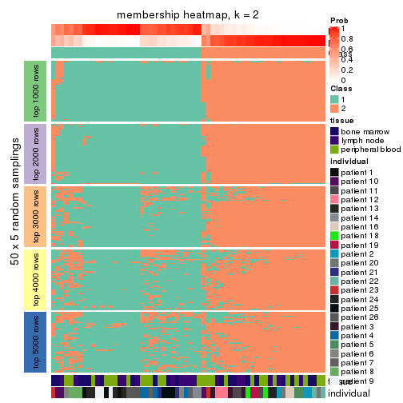</p>

</div>
<div id='tab-CV-skmeans-membership-heatmap-2'>
<pre><code class="r">membership_heatmap(res, k = 3)
</code></pre>

<p>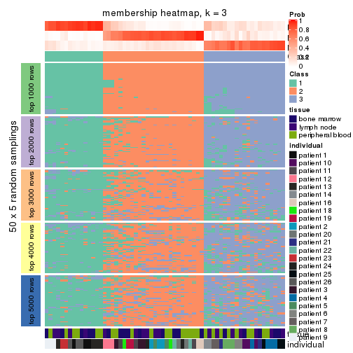</p>

</div>
<div id='tab-CV-skmeans-membership-heatmap-3'>
<pre><code class="r">membership_heatmap(res, k = 4)
</code></pre>

<p>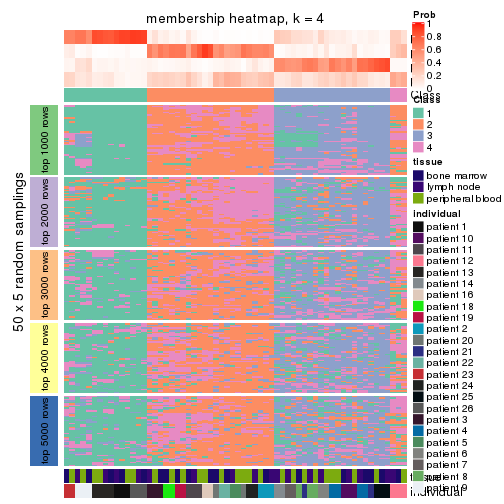</p>

</div>
<div id='tab-CV-skmeans-membership-heatmap-4'>
<pre><code class="r">membership_heatmap(res, k = 5)
</code></pre>

<p>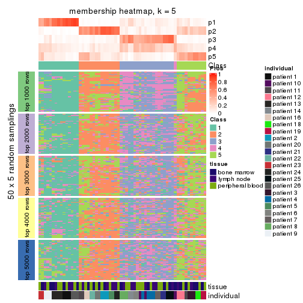</p>

</div>
<div id='tab-CV-skmeans-membership-heatmap-5'>
<pre><code class="r">membership_heatmap(res, k = 6)
</code></pre>

<p>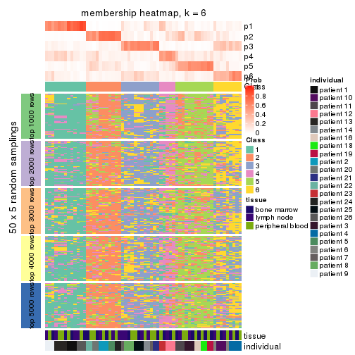</p>

</div>
</div>

As soon as we have had the classes for columns, we can look for signatures
which are significantly different between classes which can be candidate marks
for certain classes. Following are the heatmaps for signatures.


Signature heatmaps where rows are scaled:


<script>
$( function() {
	$( '#tabs-CV-skmeans-get-signatures' ).tabs();
} );
</script>
<div id='tabs-CV-skmeans-get-signatures'>
<ul>
<li><a href='#tab-CV-skmeans-get-signatures-1'>k = 2</a></li>
<li><a href='#tab-CV-skmeans-get-signatures-2'>k = 3</a></li>
<li><a href='#tab-CV-skmeans-get-signatures-3'>k = 4</a></li>
<li><a href='#tab-CV-skmeans-get-signatures-4'>k = 5</a></li>
<li><a href='#tab-CV-skmeans-get-signatures-5'>k = 6</a></li>
</ul>
<div id='tab-CV-skmeans-get-signatures-1'>
<pre><code class="r">get_signatures(res, k = 2)
</code></pre>

<p>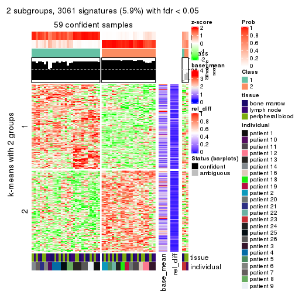</p>

</div>
<div id='tab-CV-skmeans-get-signatures-2'>
<pre><code class="r">get_signatures(res, k = 3)
</code></pre>

<p>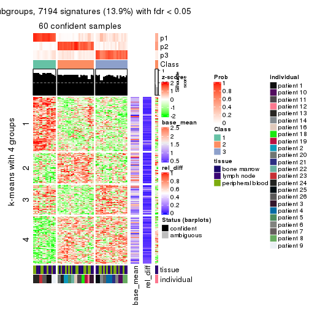</p>

</div>
<div id='tab-CV-skmeans-get-signatures-3'>
<pre><code class="r">get_signatures(res, k = 4)
</code></pre>

<p>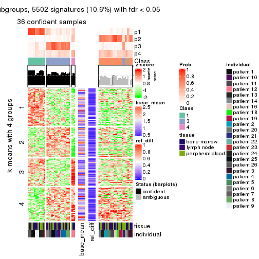</p>

</div>
<div id='tab-CV-skmeans-get-signatures-4'>
<pre><code class="r">get_signatures(res, k = 5)
</code></pre>

<p>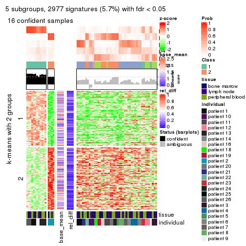</p>

</div>
<div id='tab-CV-skmeans-get-signatures-5'>
<pre><code class="r">get_signatures(res, k = 6)
</code></pre>

<p>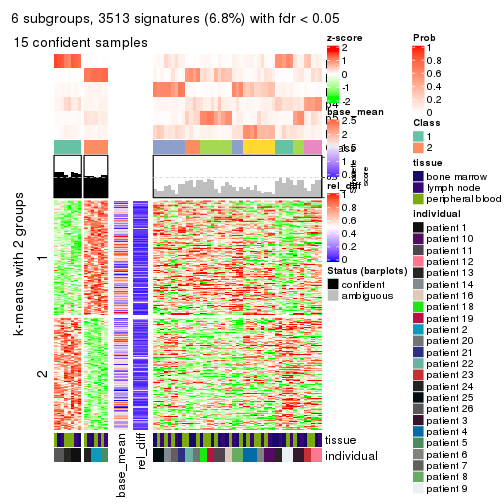</p>

</div>
</div>


Signature heatmaps where rows are not scaled:


<script>
$( function() {
	$( '#tabs-CV-skmeans-get-signatures-no-scale' ).tabs();
} );
</script>
<div id='tabs-CV-skmeans-get-signatures-no-scale'>
<ul>
<li><a href='#tab-CV-skmeans-get-signatures-no-scale-1'>k = 2</a></li>
<li><a href='#tab-CV-skmeans-get-signatures-no-scale-2'>k = 3</a></li>
<li><a href='#tab-CV-skmeans-get-signatures-no-scale-3'>k = 4</a></li>
<li><a href='#tab-CV-skmeans-get-signatures-no-scale-4'>k = 5</a></li>
<li><a href='#tab-CV-skmeans-get-signatures-no-scale-5'>k = 6</a></li>
</ul>
<div id='tab-CV-skmeans-get-signatures-no-scale-1'>
<pre><code class="r">get_signatures(res, k = 2, scale_rows = FALSE)
</code></pre>

<p>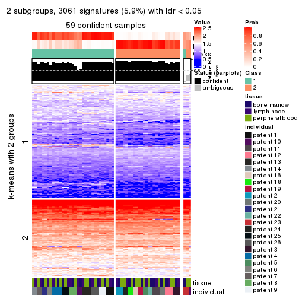</p>

</div>
<div id='tab-CV-skmeans-get-signatures-no-scale-2'>
<pre><code class="r">get_signatures(res, k = 3, scale_rows = FALSE)
</code></pre>

<p>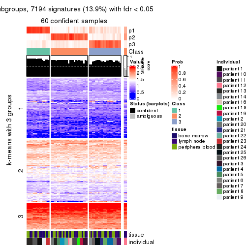</p>

</div>
<div id='tab-CV-skmeans-get-signatures-no-scale-3'>
<pre><code class="r">get_signatures(res, k = 4, scale_rows = FALSE)
</code></pre>

<p>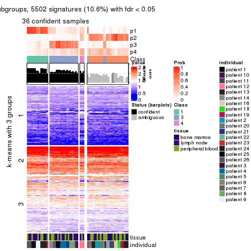</p>

</div>
<div id='tab-CV-skmeans-get-signatures-no-scale-4'>
<pre><code class="r">get_signatures(res, k = 5, scale_rows = FALSE)
</code></pre>

<p>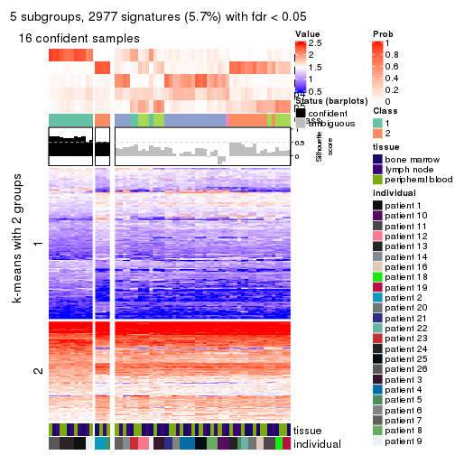</p>

</div>
<div id='tab-CV-skmeans-get-signatures-no-scale-5'>
<pre><code class="r">get_signatures(res, k = 6, scale_rows = FALSE)
</code></pre>

<p>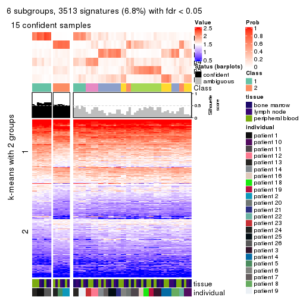</p>

</div>
</div>


Compare the overlap of signatures from different k:

```r
compare_signatures(res)
```

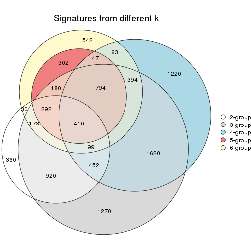

`get_signature()` returns a data frame invisibly. TO get the list of signatures, the function
call should be assigned to a variable explicitly. In following code, if `plot` argument is set
to `FALSE`, no heatmap is plotted while only the differential analysis is performed.

```r
# code only for demonstration
tb = get_signature(res, k = ..., plot = FALSE)
```

An example of the output of `tb` is:

```
#>   which_row         fdr    mean_1    mean_2 scaled_mean_1 scaled_mean_2 km
#> 1        38 0.042760348  8.373488  9.131774    -0.5533452     0.5164555  1
#> 2        40 0.018707592  7.106213  8.469186    -0.6173731     0.5762149  1
#> 3        55 0.019134737 10.221463 11.207825    -0.6159697     0.5749050  1
#> 4        59 0.006059896  5.921854  7.869574    -0.6899429     0.6439467  1
#> 5        60 0.018055526  8.928898 10.211722    -0.6204761     0.5791110  1
#> 6        98 0.009384629 15.714769 14.887706     0.6635654    -0.6193277  2
...
```

The columns in `tb` are:

1. `which_row`: row indices corresponding to the input matrix.
2. `fdr`: FDR for the differential test. 
3. `mean_x`: The mean value in group x.
4. `scaled_mean_x`: The mean value in group x after rows are scaled.
5. `km`: Row groups if k-means clustering is applied to rows.


UMAP plot which shows how samples are separated.


<script>
$( function() {
	$( '#tabs-CV-skmeans-dimension-reduction' ).tabs();
} );
</script>
<div id='tabs-CV-skmeans-dimension-reduction'>
<ul>
<li><a href='#tab-CV-skmeans-dimension-reduction-1'>k = 2</a></li>
<li><a href='#tab-CV-skmeans-dimension-reduction-2'>k = 3</a></li>
<li><a href='#tab-CV-skmeans-dimension-reduction-3'>k = 4</a></li>
<li><a href='#tab-CV-skmeans-dimension-reduction-4'>k = 5</a></li>
<li><a href='#tab-CV-skmeans-dimension-reduction-5'>k = 6</a></li>
</ul>
<div id='tab-CV-skmeans-dimension-reduction-1'>
<pre><code class="r">dimension_reduction(res, k = 2, method = &quot;UMAP&quot;)
</code></pre>

<p>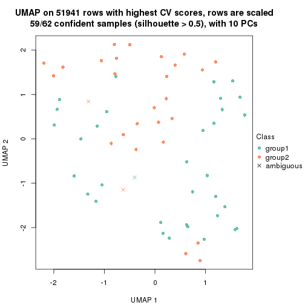</p>

</div>
<div id='tab-CV-skmeans-dimension-reduction-2'>
<pre><code class="r">dimension_reduction(res, k = 3, method = &quot;UMAP&quot;)
</code></pre>

<p>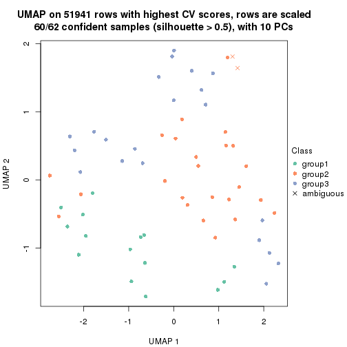</p>

</div>
<div id='tab-CV-skmeans-dimension-reduction-3'>
<pre><code class="r">dimension_reduction(res, k = 4, method = &quot;UMAP&quot;)
</code></pre>

<p>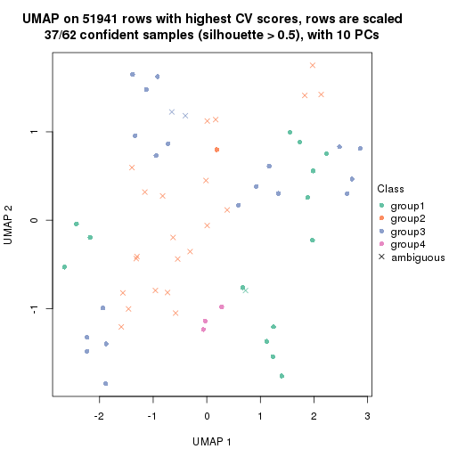</p>

</div>
<div id='tab-CV-skmeans-dimension-reduction-4'>
<pre><code class="r">dimension_reduction(res, k = 5, method = &quot;UMAP&quot;)
</code></pre>

<p>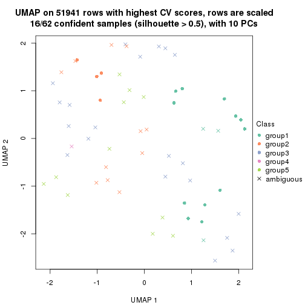</p>

</div>
<div id='tab-CV-skmeans-dimension-reduction-5'>
<pre><code class="r">dimension_reduction(res, k = 6, method = &quot;UMAP&quot;)
</code></pre>

<p>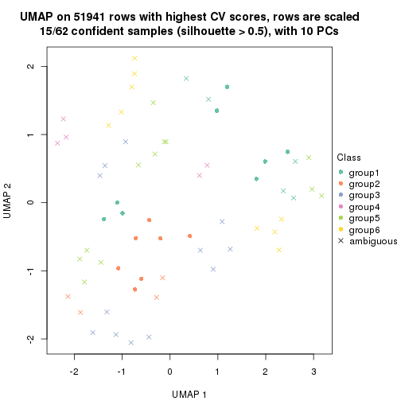</p>

</div>
</div>


Following heatmap shows how subgroups are split when increasing `k`:

```r
collect_classes(res)
```

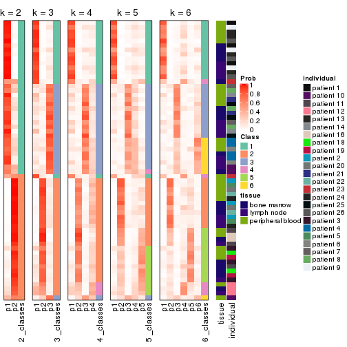


Test correlation between subgroups and known annotations. If the known
annotation is numeric, one-way ANOVA test is applied, and if the known
annotation is discrete, chi-squared contingency table test is applied.

```r
test_to_known_factors(res)
```

```
#>             n tissue(p) individual(p) k
#> CV:skmeans 59     0.664      3.14e-05 2
#> CV:skmeans 60     0.887      1.60e-08 3
#> CV:skmeans 37     0.935      3.84e-08 4
#> CV:skmeans 16     0.944      6.84e-03 5
#> CV:skmeans 15     0.736      1.04e-02 6
```


If matrix rows can be associated to genes, consider to use `functional_enrichment(res,
...)` to perform function enrichment for the signature genes. See [this vignette](http://bioconductor.org/packages/devel/bioc/vignettes/cola/inst/doc/functional_enrichment.html) for more detailed explanations.


 

---------------------------------------------------


### CV:pam


The object with results only for a single top-value method and a single partition method 
can be extracted as:

```r
res = res_list["CV", "pam"]
# you can also extract it by
# res = res_list["CV:pam"]
```

A summary of `res` and all the functions that can be applied to it:

```r
res
```

```
#> A 'ConsensusPartition' object with k = 2, 3, 4, 5, 6.
#>   On a matrix with 51941 rows and 62 columns.
#>   Top rows (1000, 2000, 3000, 4000, 5000) are extracted by 'CV' method.
#>   Subgroups are detected by 'pam' method.
#>   Performed in total 1250 partitions by row resampling.
#>   Best k for subgroups seems to be 6.
#> 
#> Following methods can be applied to this 'ConsensusPartition' object:
#>  [1] "cola_report"             "collect_classes"         "collect_plots"          
#>  [4] "collect_stats"           "colnames"                "compare_signatures"     
#>  [7] "consensus_heatmap"       "dimension_reduction"     "functional_enrichment"  
#> [10] "get_anno_col"            "get_anno"                "get_classes"            
#> [13] "get_consensus"           "get_matrix"              "get_membership"         
#> [16] "get_param"               "get_signatures"          "get_stats"              
#> [19] "is_best_k"               "is_stable_k"             "membership_heatmap"     
#> [22] "ncol"                    "nrow"                    "plot_ecdf"              
#> [25] "rownames"                "select_partition_number" "show"                   
#> [28] "suggest_best_k"          "test_to_known_factors"
```

`collect_plots()` function collects all the plots made from `res` for all `k` (number of partitions)
into one single page to provide an easy and fast comparison between different `k`.

```r
collect_plots(res)
```

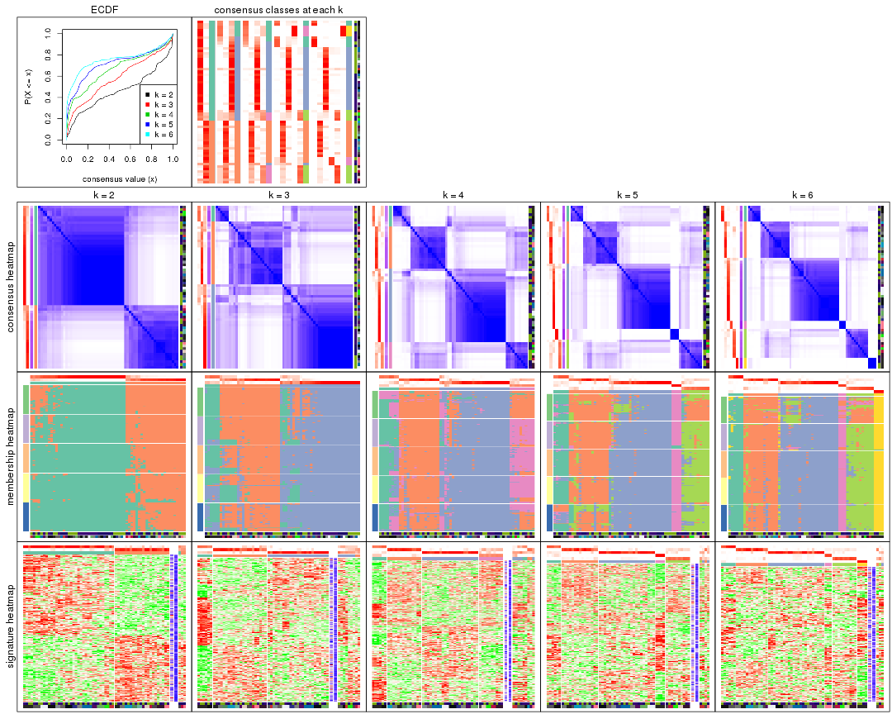

The plots are:

- The first row: a plot of the ECDF (empirical cumulative distribution
  function) curves of the consensus matrix for each `k` and the heatmap of
  predicted classes for each `k`.
- The second row: heatmaps of the consensus matrix for each `k`.
- The third row: heatmaps of the membership matrix for each `k`.
- The fouth row: heatmaps of the signatures for each `k`.

All the plots in panels can be made by individual functions and they are
plotted later in this section.

`select_partition_number()` produces several plots showing different
statistics for choosing "optimized" `k`. There are following statistics:

- ECDF curves of the consensus matrix for each `k`;
- 1-PAC. [The PAC
  score](https://en.wikipedia.org/wiki/Consensus_clustering#Over-interpretation_potential_of_consensus_clustering)
  measures the proportion of the ambiguous subgrouping.
- Mean silhouette score.
- Concordance. The mean probability of fiting the consensus class ids in all
  partitions.
- Area increased. Denote $A_k$ as the area under the ECDF curve for current
  `k`, the area increased is defined as $A_k - A_{k-1}$.
- Rand index. The percent of pairs of samples that are both in a same cluster
  or both are not in a same cluster in the partition of k and k-1.
- Jaccard index. The ratio of pairs of samples are both in a same cluster in
  the partition of k and k-1 and the pairs of samples are both in a same
  cluster in the partition k or k-1.

The detailed explanations of these statistics can be found in [the _cola_
vignette](http://bioconductor.org/packages/devel/bioc/vignettes/cola/inst/doc/cola.html#toc_13).

Generally speaking, lower PAC score, higher mean silhouette score or higher
concordance corresponds to better partition. Rand index and Jaccard index
measure how similar the current partition is compared to partition with `k-1`.
If they are too similar, we won't accept `k` is better than `k-1`.

```r
select_partition_number(res)
```

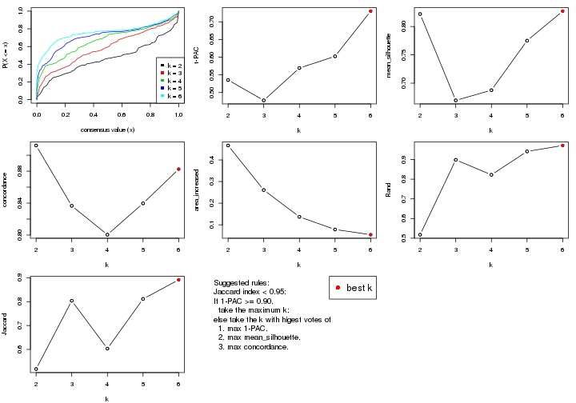

The numeric values for all these statistics can be obtained by `get_stats()`.

```r
get_stats(res)
```

```
#>   k 1-PAC mean_silhouette concordance area_increased  Rand Jaccard
#> 2 2 0.535           0.822       0.912         0.4667 0.518   0.518
#> 3 3 0.478           0.670       0.837         0.2608 0.898   0.804
#> 4 4 0.569           0.688       0.800         0.1368 0.822   0.603
#> 5 5 0.603           0.775       0.840         0.0784 0.941   0.812
#> 6 6 0.730           0.827       0.883         0.0543 0.971   0.892
```

`suggest_best_k()` suggests the best $k$ based on these statistics. The rules are as follows:

- All $k$ with Jaccard index larger than 0.95 are removed because increasing
  $k$ does not provide enough extra information. If all $k$ are removed, it is
  marked as no subgroup is detected.
- For all $k$ with 1-PAC score larger than 0.9, the maximal $k$ is taken as
  the best $k$, and other $k$ are marked as optional $k$.
- If it does not fit the second rule. The $k$ with the maximal vote of the
  highest 1-PAC score, highest mean silhouette, and highest concordance is
  taken as the best $k$.

```r
suggest_best_k(res)
```

```
#> [1] 6
```


Following shows the table of the partitions (You need to click the **show/hide
code output** link to see it). The membership matrix (columns with name `p*`)
is inferred by
[`clue::cl_consensus()`](https://www.rdocumentation.org/link/cl_consensus?package=clue)
function with the `SE` method. Basically the value in the membership matrix
represents the probability to belong to a certain group. The finall class
label for an item is determined with the group with highest probability it
belongs to.

In `get_classes()` function, the entropy is calculated from the membership
matrix and the silhouette score is calculated from the consensus matrix.


<script>
$( function() {
	$( '#tabs-CV-pam-get-classes' ).tabs();
} );
</script>
<div id='tabs-CV-pam-get-classes'>
<ul>
<li><a href='#tab-CV-pam-get-classes-1'>k = 2</a></li>
<li><a href='#tab-CV-pam-get-classes-2'>k = 3</a></li>
<li><a href='#tab-CV-pam-get-classes-3'>k = 4</a></li>
<li><a href='#tab-CV-pam-get-classes-4'>k = 5</a></li>
<li><a href='#tab-CV-pam-get-classes-5'>k = 6</a></li>
</ul>

<div id='tab-CV-pam-get-classes-1'>
<p><a id='tab-CV-pam-get-classes-1-a' style='color:#0366d6' href='#'>show/hide code output</a></p>
<pre><code class="r">cbind(get_classes(res, k = 2), get_membership(res, k = 2))
</code></pre>

<pre><code>#&gt;           class entropy silhouette    p1    p2
#&gt; GSM525314     1  0.1184      0.915 0.984 0.016
#&gt; GSM525315     2  0.2236      0.871 0.036 0.964
#&gt; GSM525316     2  0.4161      0.851 0.084 0.916
#&gt; GSM525317     1  0.7219      0.746 0.800 0.200
#&gt; GSM525318     1  0.0000      0.920 1.000 0.000
#&gt; GSM525319     2  0.2043      0.870 0.032 0.968
#&gt; GSM525320     1  0.6343      0.799 0.840 0.160
#&gt; GSM525321     1  0.4690      0.857 0.900 0.100
#&gt; GSM525322     1  0.0376      0.919 0.996 0.004
#&gt; GSM525323     1  0.0000      0.920 1.000 0.000
#&gt; GSM525324     2  0.9286      0.543 0.344 0.656
#&gt; GSM525325     2  0.0376      0.862 0.004 0.996
#&gt; GSM525326     2  0.0000      0.860 0.000 1.000
#&gt; GSM525327     1  0.6148      0.812 0.848 0.152
#&gt; GSM525328     1  0.0672      0.917 0.992 0.008
#&gt; GSM525329     1  0.0000      0.920 1.000 0.000
#&gt; GSM525330     2  0.0000      0.860 0.000 1.000
#&gt; GSM525331     1  0.8661      0.620 0.712 0.288
#&gt; GSM525332     2  0.8386      0.655 0.268 0.732
#&gt; GSM525333     2  0.1843      0.869 0.028 0.972
#&gt; GSM525334     1  0.0000      0.920 1.000 0.000
#&gt; GSM525335     2  0.3733      0.868 0.072 0.928
#&gt; GSM525336     1  0.8713      0.592 0.708 0.292
#&gt; GSM525337     2  0.3879      0.867 0.076 0.924
#&gt; GSM525338     1  0.0000      0.920 1.000 0.000
#&gt; GSM525339     1  0.0376      0.919 0.996 0.004
#&gt; GSM525340     1  0.6438      0.786 0.836 0.164
#&gt; GSM525341     2  0.4939      0.847 0.108 0.892
#&gt; GSM525342     2  0.4939      0.836 0.108 0.892
#&gt; GSM525343     1  0.3114      0.893 0.944 0.056
#&gt; GSM525344     1  0.0000      0.920 1.000 0.000
#&gt; GSM525345     1  0.0000      0.920 1.000 0.000
#&gt; GSM525346     1  0.2043      0.908 0.968 0.032
#&gt; GSM525347     1  0.9686      0.339 0.604 0.396
#&gt; GSM525348     2  0.9922      0.256 0.448 0.552
#&gt; GSM525349     1  0.0000      0.920 1.000 0.000
#&gt; GSM525350     2  0.0376      0.862 0.004 0.996
#&gt; GSM525351     1  0.8813      0.596 0.700 0.300
#&gt; GSM525352     2  0.9977      0.119 0.472 0.528
#&gt; GSM525353     2  0.1633      0.869 0.024 0.976
#&gt; GSM525354     1  0.0000      0.920 1.000 0.000
#&gt; GSM525355     2  0.4161      0.863 0.084 0.916
#&gt; GSM525356     1  0.2778      0.896 0.952 0.048
#&gt; GSM525357     1  0.0000      0.920 1.000 0.000
#&gt; GSM525358     1  0.0000      0.920 1.000 0.000
#&gt; GSM525359     1  0.5946      0.814 0.856 0.144
#&gt; GSM525360     2  0.8555      0.670 0.280 0.720
#&gt; GSM525361     2  0.8081      0.680 0.248 0.752
#&gt; GSM525362     1  0.0000      0.920 1.000 0.000
#&gt; GSM525363     2  0.2603      0.872 0.044 0.956
#&gt; GSM525364     1  0.0000      0.920 1.000 0.000
#&gt; GSM525365     1  0.2043      0.907 0.968 0.032
#&gt; GSM525366     1  0.0000      0.920 1.000 0.000
#&gt; GSM525367     1  0.0000      0.920 1.000 0.000
#&gt; GSM525368     1  0.6247      0.802 0.844 0.156
#&gt; GSM525369     2  0.1414      0.869 0.020 0.980
#&gt; GSM525370     2  0.2603      0.873 0.044 0.956
#&gt; GSM525371     1  0.0000      0.920 1.000 0.000
#&gt; GSM525372     1  0.0000      0.920 1.000 0.000
#&gt; GSM525373     2  0.3584      0.869 0.068 0.932
#&gt; GSM525374     1  0.0000      0.920 1.000 0.000
#&gt; GSM525375     1  0.0000      0.920 1.000 0.000
</code></pre>

<script>
$('#tab-CV-pam-get-classes-1-a').parent().next().next().hide();
$('#tab-CV-pam-get-classes-1-a').click(function(){
  $('#tab-CV-pam-get-classes-1-a').parent().next().next().toggle();
  return(false);
});
</script>
</div>

<div id='tab-CV-pam-get-classes-2'>
<p><a id='tab-CV-pam-get-classes-2-a' style='color:#0366d6' href='#'>show/hide code output</a></p>
<pre><code class="r">cbind(get_classes(res, k = 3), get_membership(res, k = 3))
</code></pre>

<pre><code>#&gt;           class entropy silhouette    p1    p2    p3
#&gt; GSM525314     1  0.6079      0.728 0.612 0.000 0.388
#&gt; GSM525315     2  0.0892      0.808 0.000 0.980 0.020
#&gt; GSM525316     2  0.7080      0.567 0.412 0.564 0.024
#&gt; GSM525317     3  0.4555      0.602 0.000 0.200 0.800
#&gt; GSM525318     3  0.0000      0.794 0.000 0.000 1.000
#&gt; GSM525319     2  0.0592      0.807 0.000 0.988 0.012
#&gt; GSM525320     3  0.4002      0.656 0.000 0.160 0.840
#&gt; GSM525321     3  0.3038      0.713 0.000 0.104 0.896
#&gt; GSM525322     3  0.0237      0.792 0.000 0.004 0.996
#&gt; GSM525323     3  0.0000      0.794 0.000 0.000 1.000
#&gt; GSM525324     2  0.5706      0.507 0.000 0.680 0.320
#&gt; GSM525325     2  0.2682      0.803 0.076 0.920 0.004
#&gt; GSM525326     2  0.0592      0.806 0.012 0.988 0.000
#&gt; GSM525327     1  0.5986      0.857 0.736 0.024 0.240
#&gt; GSM525328     1  0.5397      0.874 0.720 0.000 0.280
#&gt; GSM525329     3  0.0000      0.794 0.000 0.000 1.000
#&gt; GSM525330     2  0.4842      0.744 0.224 0.776 0.000
#&gt; GSM525331     3  0.9400      0.226 0.228 0.264 0.508
#&gt; GSM525332     2  0.8286      0.643 0.236 0.624 0.140
#&gt; GSM525333     2  0.0592      0.807 0.000 0.988 0.012
#&gt; GSM525334     3  0.0000      0.794 0.000 0.000 1.000
#&gt; GSM525335     2  0.1643      0.810 0.000 0.956 0.044
#&gt; GSM525336     3  0.8770      0.206 0.272 0.156 0.572
#&gt; GSM525337     2  0.1860      0.810 0.000 0.948 0.052
#&gt; GSM525338     3  0.0000      0.794 0.000 0.000 1.000
#&gt; GSM525339     3  0.5138      0.436 0.252 0.000 0.748
#&gt; GSM525340     1  0.5968      0.719 0.636 0.000 0.364
#&gt; GSM525341     2  0.2625      0.790 0.000 0.916 0.084
#&gt; GSM525342     2  0.6887      0.713 0.236 0.704 0.060
#&gt; GSM525343     3  0.2486      0.754 0.008 0.060 0.932
#&gt; GSM525344     3  0.0000      0.794 0.000 0.000 1.000
#&gt; GSM525345     3  0.0000      0.794 0.000 0.000 1.000
#&gt; GSM525346     3  0.1031      0.784 0.000 0.024 0.976
#&gt; GSM525347     3  0.9547      0.113 0.228 0.292 0.480
#&gt; GSM525348     2  0.6286      0.140 0.000 0.536 0.464
#&gt; GSM525349     1  0.5431      0.872 0.716 0.000 0.284
#&gt; GSM525350     2  0.5201      0.737 0.236 0.760 0.004
#&gt; GSM525351     3  0.9330      0.256 0.236 0.244 0.520
#&gt; GSM525352     2  0.9653      0.372 0.232 0.456 0.312
#&gt; GSM525353     2  0.1905      0.813 0.028 0.956 0.016
#&gt; GSM525354     3  0.0000      0.794 0.000 0.000 1.000
#&gt; GSM525355     2  0.2066      0.805 0.000 0.940 0.060
#&gt; GSM525356     3  0.5551      0.551 0.212 0.020 0.768
#&gt; GSM525357     3  0.0000      0.794 0.000 0.000 1.000
#&gt; GSM525358     3  0.2066      0.741 0.060 0.000 0.940
#&gt; GSM525359     3  0.7561     -0.358 0.444 0.040 0.516
#&gt; GSM525360     2  0.5291      0.601 0.000 0.732 0.268
#&gt; GSM525361     2  0.7710      0.677 0.240 0.660 0.100
#&gt; GSM525362     3  0.0000      0.794 0.000 0.000 1.000
#&gt; GSM525363     2  0.0892      0.810 0.000 0.980 0.020
#&gt; GSM525364     3  0.0000      0.794 0.000 0.000 1.000
#&gt; GSM525365     3  0.1289      0.778 0.000 0.032 0.968
#&gt; GSM525366     3  0.0000      0.794 0.000 0.000 1.000
#&gt; GSM525367     3  0.0000      0.794 0.000 0.000 1.000
#&gt; GSM525368     3  0.3941      0.661 0.000 0.156 0.844
#&gt; GSM525369     2  0.2955      0.803 0.080 0.912 0.008
#&gt; GSM525370     2  0.1765      0.812 0.004 0.956 0.040
#&gt; GSM525371     1  0.5098      0.860 0.752 0.000 0.248
#&gt; GSM525372     3  0.0000      0.794 0.000 0.000 1.000
#&gt; GSM525373     2  0.1643      0.810 0.000 0.956 0.044
#&gt; GSM525374     3  0.0000      0.794 0.000 0.000 1.000
#&gt; GSM525375     3  0.6215     -0.197 0.428 0.000 0.572
</code></pre>

<script>
$('#tab-CV-pam-get-classes-2-a').parent().next().next().hide();
$('#tab-CV-pam-get-classes-2-a').click(function(){
  $('#tab-CV-pam-get-classes-2-a').parent().next().next().toggle();
  return(false);
});
</script>
</div>

<div id='tab-CV-pam-get-classes-3'>
<p><a id='tab-CV-pam-get-classes-3-a' style='color:#0366d6' href='#'>show/hide code output</a></p>
<pre><code class="r">cbind(get_classes(res, k = 4), get_membership(res, k = 4))
</code></pre>

<pre><code>#&gt;           class entropy silhouette    p1    p2    p3    p4
#&gt; GSM525314     1  0.4204    0.64805 0.788 0.000 0.192 0.020
#&gt; GSM525315     2  0.0895    0.83149 0.000 0.976 0.004 0.020
#&gt; GSM525316     4  0.5165    0.73019 0.004 0.352 0.008 0.636
#&gt; GSM525317     3  0.4079    0.68555 0.000 0.180 0.800 0.020
#&gt; GSM525318     3  0.0707    0.84088 0.000 0.000 0.980 0.020
#&gt; GSM525319     2  0.0524    0.83129 0.000 0.988 0.004 0.008
#&gt; GSM525320     3  0.3658    0.72705 0.000 0.144 0.836 0.020
#&gt; GSM525321     3  0.2408    0.77196 0.000 0.104 0.896 0.000
#&gt; GSM525322     3  0.0188    0.84493 0.000 0.004 0.996 0.000
#&gt; GSM525323     3  0.0524    0.84329 0.008 0.000 0.988 0.004
#&gt; GSM525324     2  0.4331    0.43899 0.000 0.712 0.288 0.000
#&gt; GSM525325     2  0.3649    0.57844 0.000 0.796 0.000 0.204
#&gt; GSM525326     2  0.2334    0.80350 0.004 0.908 0.000 0.088
#&gt; GSM525327     1  0.4936    0.67183 0.700 0.000 0.020 0.280
#&gt; GSM525328     1  0.5472    0.67466 0.676 0.000 0.044 0.280
#&gt; GSM525329     3  0.0000    0.84496 0.000 0.000 1.000 0.000
#&gt; GSM525330     4  0.4981    0.57913 0.000 0.464 0.000 0.536
#&gt; GSM525331     4  0.7355    0.60298 0.000 0.204 0.276 0.520
#&gt; GSM525332     4  0.5682    0.74099 0.000 0.352 0.036 0.612
#&gt; GSM525333     2  0.0927    0.83243 0.000 0.976 0.008 0.016
#&gt; GSM525334     3  0.0000    0.84496 0.000 0.000 1.000 0.000
#&gt; GSM525335     2  0.1305    0.83958 0.000 0.960 0.036 0.004
#&gt; GSM525336     3  0.8395    0.17814 0.084 0.112 0.496 0.308
#&gt; GSM525337     2  0.2060    0.82978 0.000 0.932 0.052 0.016
#&gt; GSM525338     3  0.0000    0.84496 0.000 0.000 1.000 0.000
#&gt; GSM525339     3  0.5168   -0.09490 0.496 0.000 0.500 0.004
#&gt; GSM525340     1  0.4323    0.62866 0.776 0.000 0.204 0.020
#&gt; GSM525341     2  0.2335    0.80647 0.000 0.920 0.060 0.020
#&gt; GSM525342     4  0.4950    0.72323 0.000 0.376 0.004 0.620
#&gt; GSM525343     3  0.2399    0.81009 0.000 0.048 0.920 0.032
#&gt; GSM525344     3  0.0000    0.84496 0.000 0.000 1.000 0.000
#&gt; GSM525345     3  0.1022    0.83176 0.032 0.000 0.968 0.000
#&gt; GSM525346     3  0.0895    0.83856 0.000 0.020 0.976 0.004
#&gt; GSM525347     4  0.6793    0.57733 0.000 0.132 0.288 0.580
#&gt; GSM525348     3  0.6381   -0.03116 0.004 0.472 0.472 0.052
#&gt; GSM525349     1  0.5649    0.67047 0.664 0.000 0.052 0.284
#&gt; GSM525350     4  0.4855    0.70061 0.000 0.400 0.000 0.600
#&gt; GSM525351     4  0.6854    0.67298 0.000 0.196 0.204 0.600
#&gt; GSM525352     4  0.6828    0.71016 0.000 0.264 0.148 0.588
#&gt; GSM525353     2  0.2089    0.82090 0.000 0.932 0.020 0.048
#&gt; GSM525354     3  0.0000    0.84496 0.000 0.000 1.000 0.000
#&gt; GSM525355     2  0.1854    0.83088 0.000 0.940 0.048 0.012
#&gt; GSM525356     3  0.6546   -0.00714 0.076 0.000 0.492 0.432
#&gt; GSM525357     3  0.0000    0.84496 0.000 0.000 1.000 0.000
#&gt; GSM525358     3  0.4761    0.39750 0.332 0.000 0.664 0.004
#&gt; GSM525359     1  0.5844    0.41193 0.616 0.020 0.348 0.016
#&gt; GSM525360     2  0.4744    0.48742 0.000 0.736 0.240 0.024
#&gt; GSM525361     4  0.5231    0.72100 0.000 0.384 0.012 0.604
#&gt; GSM525362     3  0.0707    0.84088 0.000 0.000 0.980 0.020
#&gt; GSM525363     2  0.0895    0.83149 0.000 0.976 0.004 0.020
#&gt; GSM525364     3  0.0469    0.84311 0.000 0.000 0.988 0.012
#&gt; GSM525365     3  0.1388    0.83190 0.000 0.028 0.960 0.012
#&gt; GSM525366     3  0.0000    0.84496 0.000 0.000 1.000 0.000
#&gt; GSM525367     3  0.0336    0.84408 0.000 0.000 0.992 0.008
#&gt; GSM525368     3  0.4365    0.67208 0.000 0.188 0.784 0.028
#&gt; GSM525369     2  0.3870    0.54177 0.000 0.788 0.004 0.208
#&gt; GSM525370     2  0.2716    0.81656 0.008 0.912 0.028 0.052
#&gt; GSM525371     1  0.4718    0.66767 0.708 0.000 0.012 0.280
#&gt; GSM525372     3  0.0000    0.84496 0.000 0.000 1.000 0.000
#&gt; GSM525373     2  0.1284    0.84105 0.000 0.964 0.024 0.012
#&gt; GSM525374     3  0.0000    0.84496 0.000 0.000 1.000 0.000
#&gt; GSM525375     1  0.5183    0.26857 0.584 0.000 0.408 0.008
</code></pre>

<script>
$('#tab-CV-pam-get-classes-3-a').parent().next().next().hide();
$('#tab-CV-pam-get-classes-3-a').click(function(){
  $('#tab-CV-pam-get-classes-3-a').parent().next().next().toggle();
  return(false);
});
</script>
</div>

<div id='tab-CV-pam-get-classes-4'>
<p><a id='tab-CV-pam-get-classes-4-a' style='color:#0366d6' href='#'>show/hide code output</a></p>
<pre><code class="r">cbind(get_classes(res, k = 5), get_membership(res, k = 5))
</code></pre>

<pre><code>#&gt;           class entropy silhouette    p1    p2    p3    p4    p5
#&gt; GSM525314     1  0.5059     0.8049 0.696 0.000 0.112 0.192 0.000
#&gt; GSM525315     2  0.0162     0.8083 0.000 0.996 0.000 0.000 0.004
#&gt; GSM525316     5  0.3365     0.7729 0.000 0.180 0.004 0.008 0.808
#&gt; GSM525317     3  0.4154     0.7630 0.008 0.124 0.796 0.000 0.072
#&gt; GSM525318     3  0.1697     0.8728 0.008 0.000 0.932 0.000 0.060
#&gt; GSM525319     2  0.1270     0.8109 0.000 0.948 0.000 0.000 0.052
#&gt; GSM525320     3  0.3787     0.7950 0.008 0.104 0.824 0.000 0.064
#&gt; GSM525321     3  0.2074     0.8226 0.000 0.104 0.896 0.000 0.000
#&gt; GSM525322     3  0.0162     0.8928 0.000 0.004 0.996 0.000 0.000
#&gt; GSM525323     3  0.0693     0.8902 0.008 0.000 0.980 0.000 0.012
#&gt; GSM525324     2  0.3715     0.5653 0.000 0.736 0.260 0.000 0.004
#&gt; GSM525325     2  0.3837     0.4938 0.000 0.692 0.000 0.000 0.308
#&gt; GSM525326     2  0.5818     0.6185 0.172 0.628 0.000 0.004 0.196
#&gt; GSM525327     4  0.0162     0.9941 0.000 0.000 0.004 0.996 0.000
#&gt; GSM525328     4  0.0162     0.9941 0.000 0.000 0.004 0.996 0.000
#&gt; GSM525329     3  0.0000     0.8930 0.000 0.000 1.000 0.000 0.000
#&gt; GSM525330     5  0.3816     0.6477 0.000 0.304 0.000 0.000 0.696
#&gt; GSM525331     5  0.5299     0.6935 0.000 0.120 0.212 0.000 0.668
#&gt; GSM525332     5  0.3656     0.7814 0.000 0.196 0.020 0.000 0.784
#&gt; GSM525333     2  0.1764     0.8106 0.000 0.928 0.008 0.000 0.064
#&gt; GSM525334     3  0.0000     0.8930 0.000 0.000 1.000 0.000 0.000
#&gt; GSM525335     2  0.1485     0.8194 0.000 0.948 0.020 0.000 0.032
#&gt; GSM525336     3  0.8372     0.0767 0.024 0.120 0.452 0.184 0.220
#&gt; GSM525337     2  0.2790     0.8009 0.000 0.880 0.052 0.000 0.068
#&gt; GSM525338     3  0.0000     0.8930 0.000 0.000 1.000 0.000 0.000
#&gt; GSM525339     1  0.3669     0.8808 0.816 0.000 0.128 0.056 0.000
#&gt; GSM525340     1  0.3980     0.8596 0.816 0.000 0.080 0.092 0.012
#&gt; GSM525341     2  0.1041     0.8044 0.000 0.964 0.032 0.000 0.004
#&gt; GSM525342     5  0.3353     0.7749 0.000 0.196 0.008 0.000 0.796
#&gt; GSM525343     3  0.2674     0.8523 0.008 0.020 0.888 0.000 0.084
#&gt; GSM525344     3  0.0000     0.8930 0.000 0.000 1.000 0.000 0.000
#&gt; GSM525345     3  0.1041     0.8812 0.032 0.000 0.964 0.000 0.004
#&gt; GSM525346     3  0.0771     0.8872 0.000 0.020 0.976 0.000 0.004
#&gt; GSM525347     5  0.5457     0.6886 0.004 0.132 0.196 0.000 0.668
#&gt; GSM525348     3  0.8380    -0.1076 0.172 0.280 0.376 0.004 0.168
#&gt; GSM525349     4  0.0162     0.9941 0.004 0.000 0.000 0.996 0.000
#&gt; GSM525350     5  0.3452     0.7427 0.000 0.244 0.000 0.000 0.756
#&gt; GSM525351     5  0.4545     0.7670 0.000 0.132 0.116 0.000 0.752
#&gt; GSM525352     5  0.4783     0.7683 0.000 0.176 0.100 0.000 0.724
#&gt; GSM525353     2  0.2824     0.7928 0.000 0.872 0.032 0.000 0.096
#&gt; GSM525354     3  0.0000     0.8930 0.000 0.000 1.000 0.000 0.000
#&gt; GSM525355     2  0.1386     0.8155 0.000 0.952 0.032 0.000 0.016
#&gt; GSM525356     5  0.5914     0.2853 0.080 0.000 0.408 0.008 0.504
#&gt; GSM525357     3  0.0000     0.8930 0.000 0.000 1.000 0.000 0.000
#&gt; GSM525358     1  0.2966     0.8282 0.816 0.000 0.184 0.000 0.000
#&gt; GSM525359     1  0.5152     0.8003 0.696 0.000 0.104 0.196 0.004
#&gt; GSM525360     2  0.3807     0.5394 0.000 0.748 0.240 0.000 0.012
#&gt; GSM525361     5  0.3519     0.7647 0.000 0.216 0.008 0.000 0.776
#&gt; GSM525362     3  0.1697     0.8728 0.008 0.000 0.932 0.000 0.060
#&gt; GSM525363     2  0.0000     0.8095 0.000 1.000 0.000 0.000 0.000
#&gt; GSM525364     3  0.1282     0.8813 0.004 0.000 0.952 0.000 0.044
#&gt; GSM525365     3  0.1281     0.8830 0.000 0.032 0.956 0.000 0.012
#&gt; GSM525366     3  0.0000     0.8930 0.000 0.000 1.000 0.000 0.000
#&gt; GSM525367     3  0.0510     0.8911 0.000 0.000 0.984 0.000 0.016
#&gt; GSM525368     3  0.4496     0.6652 0.004 0.232 0.724 0.000 0.040
#&gt; GSM525369     2  0.3689     0.5493 0.000 0.740 0.004 0.000 0.256
#&gt; GSM525370     2  0.6238     0.6255 0.172 0.636 0.020 0.008 0.164
#&gt; GSM525371     4  0.0162     0.9941 0.004 0.000 0.000 0.996 0.000
#&gt; GSM525372     3  0.0000     0.8930 0.000 0.000 1.000 0.000 0.000
#&gt; GSM525373     2  0.1557     0.8158 0.000 0.940 0.008 0.000 0.052
#&gt; GSM525374     3  0.0000     0.8930 0.000 0.000 1.000 0.000 0.000
#&gt; GSM525375     1  0.3749     0.8809 0.816 0.000 0.104 0.080 0.000
</code></pre>

<script>
$('#tab-CV-pam-get-classes-4-a').parent().next().next().hide();
$('#tab-CV-pam-get-classes-4-a').click(function(){
  $('#tab-CV-pam-get-classes-4-a').parent().next().next().toggle();
  return(false);
});
</script>
</div>

<div id='tab-CV-pam-get-classes-5'>
<p><a id='tab-CV-pam-get-classes-5-a' style='color:#0366d6' href='#'>show/hide code output</a></p>
<pre><code class="r">cbind(get_classes(res, k = 6), get_membership(res, k = 6))
</code></pre>

<pre><code>#&gt;           class entropy silhouette    p1    p2    p3    p4    p5    p6
#&gt; GSM525314     1  0.3341     0.7951 0.816 0.000 0.068 0.000 0.000 0.116
#&gt; GSM525315     2  0.0146     0.8235 0.000 0.996 0.000 0.004 0.000 0.000
#&gt; GSM525316     5  0.1753     0.8338 0.000 0.084 0.000 0.004 0.912 0.000
#&gt; GSM525317     3  0.4864     0.7826 0.004 0.084 0.752 0.092 0.060 0.008
#&gt; GSM525318     3  0.3014     0.8631 0.004 0.000 0.860 0.076 0.052 0.008
#&gt; GSM525319     2  0.0865     0.8325 0.000 0.964 0.000 0.000 0.036 0.000
#&gt; GSM525320     3  0.4343     0.8140 0.004 0.080 0.788 0.068 0.056 0.004
#&gt; GSM525321     3  0.1814     0.8513 0.000 0.100 0.900 0.000 0.000 0.000
#&gt; GSM525322     3  0.0146     0.9115 0.000 0.004 0.996 0.000 0.000 0.000
#&gt; GSM525323     3  0.0870     0.9095 0.012 0.000 0.972 0.000 0.012 0.004
#&gt; GSM525324     2  0.3290     0.5937 0.000 0.744 0.252 0.000 0.004 0.000
#&gt; GSM525325     2  0.3659     0.4039 0.000 0.636 0.000 0.000 0.364 0.000
#&gt; GSM525326     4  0.2019     0.9921 0.000 0.088 0.000 0.900 0.012 0.000
#&gt; GSM525327     6  0.0260     1.0000 0.008 0.000 0.000 0.000 0.000 0.992
#&gt; GSM525328     6  0.0260     1.0000 0.008 0.000 0.000 0.000 0.000 0.992
#&gt; GSM525329     3  0.0000     0.9115 0.000 0.000 1.000 0.000 0.000 0.000
#&gt; GSM525330     5  0.2980     0.7675 0.000 0.192 0.000 0.008 0.800 0.000
#&gt; GSM525331     5  0.3694     0.7645 0.000 0.076 0.140 0.000 0.784 0.000
#&gt; GSM525332     5  0.2118     0.8406 0.000 0.104 0.008 0.000 0.888 0.000
#&gt; GSM525333     2  0.1462     0.8314 0.000 0.936 0.008 0.000 0.056 0.000
#&gt; GSM525334     3  0.0000     0.9115 0.000 0.000 1.000 0.000 0.000 0.000
#&gt; GSM525335     2  0.1010     0.8338 0.000 0.960 0.004 0.000 0.036 0.000
#&gt; GSM525336     3  0.8234     0.0484 0.008 0.080 0.412 0.104 0.236 0.160
#&gt; GSM525337     2  0.2846     0.7911 0.000 0.856 0.084 0.000 0.060 0.000
#&gt; GSM525338     3  0.0146     0.9115 0.000 0.000 0.996 0.004 0.000 0.000
#&gt; GSM525339     1  0.0260     0.9157 0.992 0.000 0.000 0.000 0.000 0.008
#&gt; GSM525340     1  0.0976     0.9082 0.968 0.000 0.000 0.008 0.016 0.008
#&gt; GSM525341     2  0.0146     0.8235 0.000 0.996 0.000 0.004 0.000 0.000
#&gt; GSM525342     5  0.2053     0.8391 0.000 0.108 0.004 0.000 0.888 0.000
#&gt; GSM525343     3  0.3855     0.8394 0.004 0.016 0.816 0.080 0.076 0.008
#&gt; GSM525344     3  0.0000     0.9115 0.000 0.000 1.000 0.000 0.000 0.000
#&gt; GSM525345     3  0.1155     0.9032 0.036 0.000 0.956 0.004 0.004 0.000
#&gt; GSM525346     3  0.0777     0.9055 0.000 0.024 0.972 0.000 0.004 0.000
#&gt; GSM525347     5  0.4266     0.7388 0.004 0.112 0.116 0.008 0.760 0.000
#&gt; GSM525348     4  0.2060     0.9960 0.000 0.084 0.000 0.900 0.016 0.000
#&gt; GSM525349     6  0.0260     1.0000 0.008 0.000 0.000 0.000 0.000 0.992
#&gt; GSM525350     5  0.2520     0.8190 0.000 0.152 0.000 0.004 0.844 0.000
#&gt; GSM525351     5  0.2560     0.8386 0.000 0.092 0.036 0.000 0.872 0.000
#&gt; GSM525352     5  0.3295     0.8209 0.000 0.128 0.056 0.000 0.816 0.000
#&gt; GSM525353     2  0.2897     0.7957 0.000 0.852 0.060 0.000 0.088 0.000
#&gt; GSM525354     3  0.0146     0.9115 0.000 0.000 0.996 0.004 0.000 0.000
#&gt; GSM525355     2  0.1088     0.8320 0.000 0.960 0.024 0.000 0.016 0.000
#&gt; GSM525356     5  0.5347     0.4132 0.080 0.000 0.320 0.008 0.584 0.008
#&gt; GSM525357     3  0.0146     0.9115 0.000 0.000 0.996 0.004 0.000 0.000
#&gt; GSM525358     1  0.0458     0.9107 0.984 0.000 0.016 0.000 0.000 0.000
#&gt; GSM525359     1  0.3044     0.8246 0.836 0.000 0.048 0.000 0.000 0.116
#&gt; GSM525360     2  0.3608     0.5393 0.000 0.736 0.248 0.004 0.012 0.000
#&gt; GSM525361     5  0.2488     0.8319 0.000 0.124 0.004 0.008 0.864 0.000
#&gt; GSM525362     3  0.3014     0.8631 0.004 0.000 0.860 0.076 0.052 0.008
#&gt; GSM525363     2  0.0146     0.8265 0.000 0.996 0.000 0.000 0.004 0.000
#&gt; GSM525364     3  0.1867     0.8937 0.000 0.000 0.924 0.036 0.036 0.004
#&gt; GSM525365     3  0.1194     0.9036 0.000 0.032 0.956 0.000 0.008 0.004
#&gt; GSM525366     3  0.0000     0.9115 0.000 0.000 1.000 0.000 0.000 0.000
#&gt; GSM525367     3  0.0964     0.9081 0.000 0.000 0.968 0.012 0.016 0.004
#&gt; GSM525368     3  0.4940     0.6528 0.000 0.240 0.676 0.048 0.032 0.004
#&gt; GSM525369     2  0.3844     0.5039 0.000 0.676 0.008 0.004 0.312 0.000
#&gt; GSM525370     4  0.2060     0.9960 0.000 0.084 0.000 0.900 0.016 0.000
#&gt; GSM525371     6  0.0260     1.0000 0.008 0.000 0.000 0.000 0.000 0.992
#&gt; GSM525372     3  0.0000     0.9115 0.000 0.000 1.000 0.000 0.000 0.000
#&gt; GSM525373     2  0.1152     0.8333 0.000 0.952 0.004 0.000 0.044 0.000
#&gt; GSM525374     3  0.0146     0.9115 0.000 0.000 0.996 0.004 0.000 0.000
#&gt; GSM525375     1  0.0260     0.9157 0.992 0.000 0.000 0.000 0.000 0.008
</code></pre>

<script>
$('#tab-CV-pam-get-classes-5-a').parent().next().next().hide();
$('#tab-CV-pam-get-classes-5-a').click(function(){
  $('#tab-CV-pam-get-classes-5-a').parent().next().next().toggle();
  return(false);
});
</script>
</div>
</div>

Heatmaps for the consensus matrix. It visualizes the probability of two
samples to be in a same group.


<script>
$( function() {
	$( '#tabs-CV-pam-consensus-heatmap' ).tabs();
} );
</script>
<div id='tabs-CV-pam-consensus-heatmap'>
<ul>
<li><a href='#tab-CV-pam-consensus-heatmap-1'>k = 2</a></li>
<li><a href='#tab-CV-pam-consensus-heatmap-2'>k = 3</a></li>
<li><a href='#tab-CV-pam-consensus-heatmap-3'>k = 4</a></li>
<li><a href='#tab-CV-pam-consensus-heatmap-4'>k = 5</a></li>
<li><a href='#tab-CV-pam-consensus-heatmap-5'>k = 6</a></li>
</ul>
<div id='tab-CV-pam-consensus-heatmap-1'>
<pre><code class="r">consensus_heatmap(res, k = 2)
</code></pre>

<p>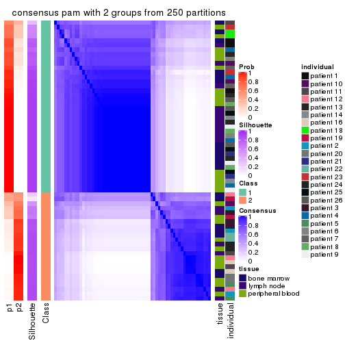</p>

</div>
<div id='tab-CV-pam-consensus-heatmap-2'>
<pre><code class="r">consensus_heatmap(res, k = 3)
</code></pre>

<p>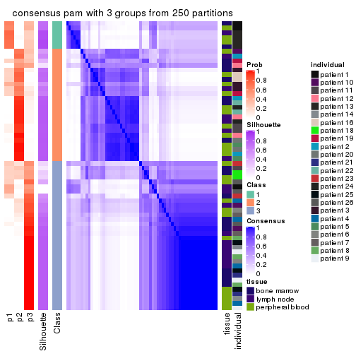</p>

</div>
<div id='tab-CV-pam-consensus-heatmap-3'>
<pre><code class="r">consensus_heatmap(res, k = 4)
</code></pre>

<p>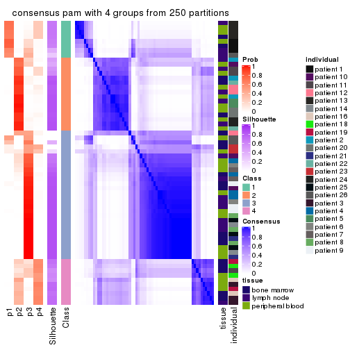</p>

</div>
<div id='tab-CV-pam-consensus-heatmap-4'>
<pre><code class="r">consensus_heatmap(res, k = 5)
</code></pre>

<p>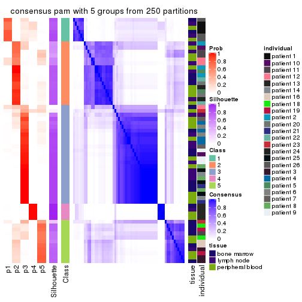</p>

</div>
<div id='tab-CV-pam-consensus-heatmap-5'>
<pre><code class="r">consensus_heatmap(res, k = 6)
</code></pre>

<p>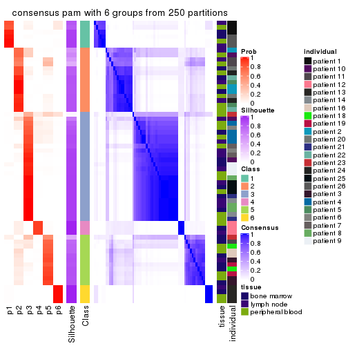</p>

</div>
</div>

Heatmaps for the membership of samples in all partitions to see how consistent they are:


<script>
$( function() {
	$( '#tabs-CV-pam-membership-heatmap' ).tabs();
} );
</script>
<div id='tabs-CV-pam-membership-heatmap'>
<ul>
<li><a href='#tab-CV-pam-membership-heatmap-1'>k = 2</a></li>
<li><a href='#tab-CV-pam-membership-heatmap-2'>k = 3</a></li>
<li><a href='#tab-CV-pam-membership-heatmap-3'>k = 4</a></li>
<li><a href='#tab-CV-pam-membership-heatmap-4'>k = 5</a></li>
<li><a href='#tab-CV-pam-membership-heatmap-5'>k = 6</a></li>
</ul>
<div id='tab-CV-pam-membership-heatmap-1'>
<pre><code class="r">membership_heatmap(res, k = 2)
</code></pre>

<p>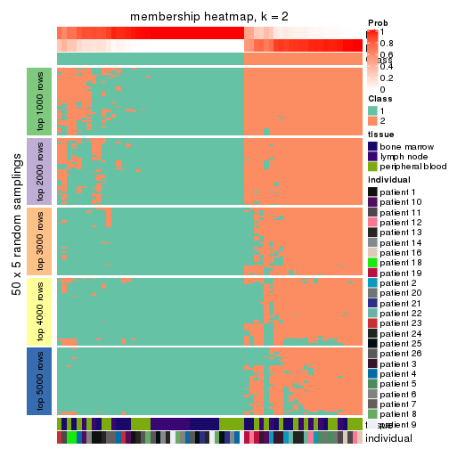</p>

</div>
<div id='tab-CV-pam-membership-heatmap-2'>
<pre><code class="r">membership_heatmap(res, k = 3)
</code></pre>

<p>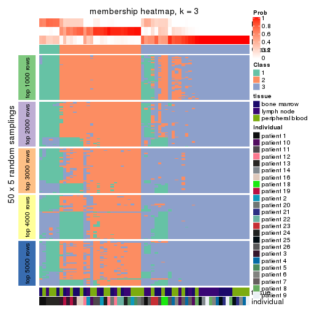</p>

</div>
<div id='tab-CV-pam-membership-heatmap-3'>
<pre><code class="r">membership_heatmap(res, k = 4)
</code></pre>

<p>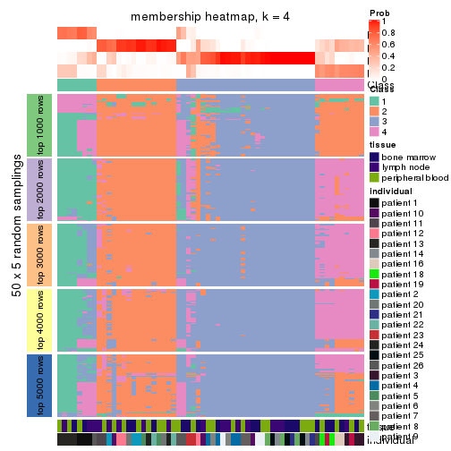</p>

</div>
<div id='tab-CV-pam-membership-heatmap-4'>
<pre><code class="r">membership_heatmap(res, k = 5)
</code></pre>

<p>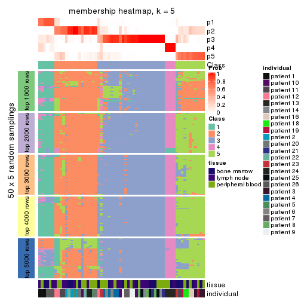</p>

</div>
<div id='tab-CV-pam-membership-heatmap-5'>
<pre><code class="r">membership_heatmap(res, k = 6)
</code></pre>

<p>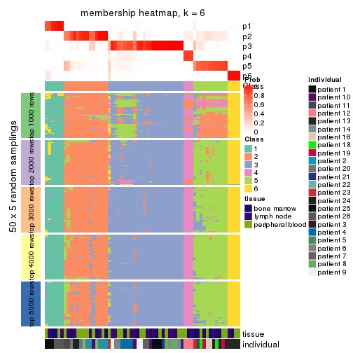</p>

</div>
</div>

As soon as we have had the classes for columns, we can look for signatures
which are significantly different between classes which can be candidate marks
for certain classes. Following are the heatmaps for signatures.


Signature heatmaps where rows are scaled:


<script>
$( function() {
	$( '#tabs-CV-pam-get-signatures' ).tabs();
} );
</script>
<div id='tabs-CV-pam-get-signatures'>
<ul>
<li><a href='#tab-CV-pam-get-signatures-1'>k = 2</a></li>
<li><a href='#tab-CV-pam-get-signatures-2'>k = 3</a></li>
<li><a href='#tab-CV-pam-get-signatures-3'>k = 4</a></li>
<li><a href='#tab-CV-pam-get-signatures-4'>k = 5</a></li>
<li><a href='#tab-CV-pam-get-signatures-5'>k = 6</a></li>
</ul>
<div id='tab-CV-pam-get-signatures-1'>
<pre><code class="r">get_signatures(res, k = 2)
</code></pre>

<p>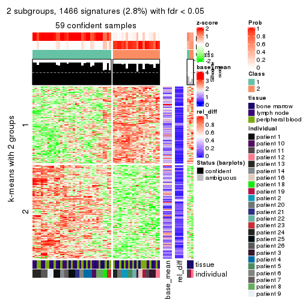</p>

</div>
<div id='tab-CV-pam-get-signatures-2'>
<pre><code class="r">get_signatures(res, k = 3)
</code></pre>

<p>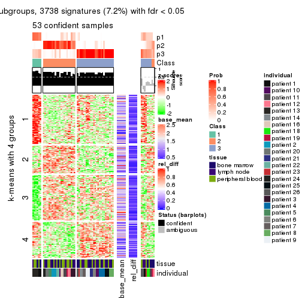</p>

</div>
<div id='tab-CV-pam-get-signatures-3'>
<pre><code class="r">get_signatures(res, k = 4)
</code></pre>

<p>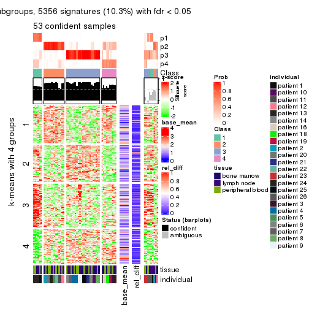</p>

</div>
<div id='tab-CV-pam-get-signatures-4'>
<pre><code class="r">get_signatures(res, k = 5)
</code></pre>

<p>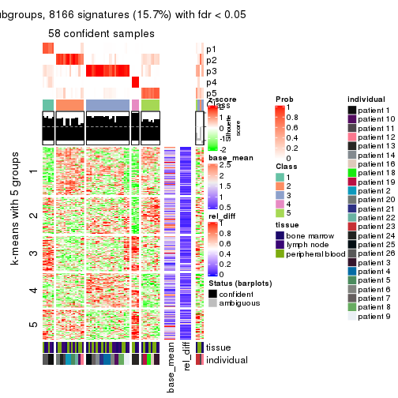</p>

</div>
<div id='tab-CV-pam-get-signatures-5'>
<pre><code class="r">get_signatures(res, k = 6)
</code></pre>

<p>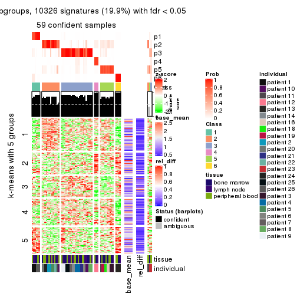</p>

</div>
</div>


Signature heatmaps where rows are not scaled:


<script>
$( function() {
	$( '#tabs-CV-pam-get-signatures-no-scale' ).tabs();
} );
</script>
<div id='tabs-CV-pam-get-signatures-no-scale'>
<ul>
<li><a href='#tab-CV-pam-get-signatures-no-scale-1'>k = 2</a></li>
<li><a href='#tab-CV-pam-get-signatures-no-scale-2'>k = 3</a></li>
<li><a href='#tab-CV-pam-get-signatures-no-scale-3'>k = 4</a></li>
<li><a href='#tab-CV-pam-get-signatures-no-scale-4'>k = 5</a></li>
<li><a href='#tab-CV-pam-get-signatures-no-scale-5'>k = 6</a></li>
</ul>
<div id='tab-CV-pam-get-signatures-no-scale-1'>
<pre><code class="r">get_signatures(res, k = 2, scale_rows = FALSE)
</code></pre>

<p>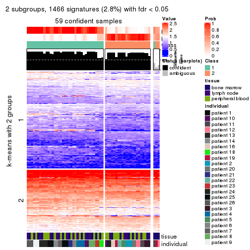</p>

</div>
<div id='tab-CV-pam-get-signatures-no-scale-2'>
<pre><code class="r">get_signatures(res, k = 3, scale_rows = FALSE)
</code></pre>

<p>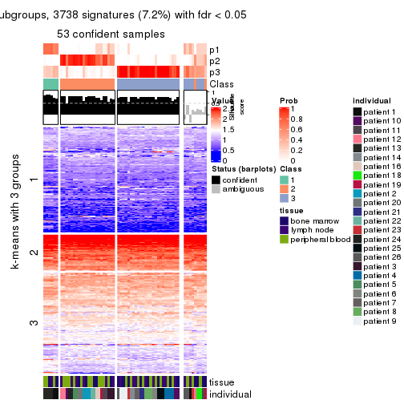</p>

</div>
<div id='tab-CV-pam-get-signatures-no-scale-3'>
<pre><code class="r">get_signatures(res, k = 4, scale_rows = FALSE)
</code></pre>

<p>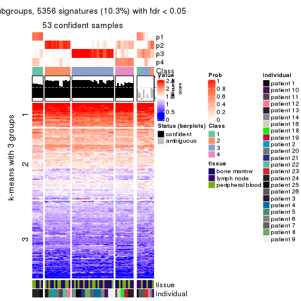</p>

</div>
<div id='tab-CV-pam-get-signatures-no-scale-4'>
<pre><code class="r">get_signatures(res, k = 5, scale_rows = FALSE)
</code></pre>

<p>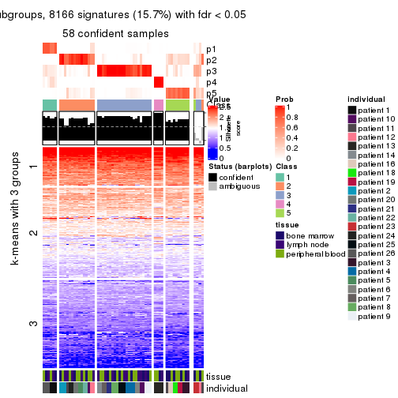</p>

</div>
<div id='tab-CV-pam-get-signatures-no-scale-5'>
<pre><code class="r">get_signatures(res, k = 6, scale_rows = FALSE)
</code></pre>

<p>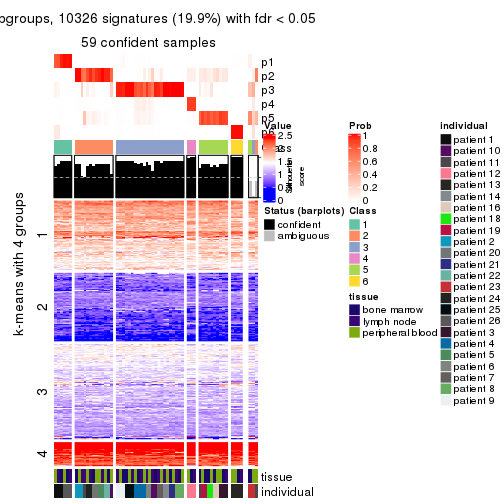</p>

</div>
</div>


Compare the overlap of signatures from different k:

```r
compare_signatures(res)
```

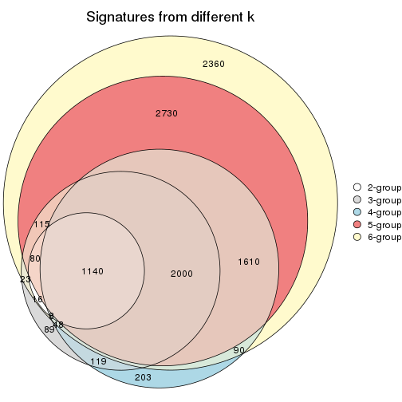

`get_signature()` returns a data frame invisibly. TO get the list of signatures, the function
call should be assigned to a variable explicitly. In following code, if `plot` argument is set
to `FALSE`, no heatmap is plotted while only the differential analysis is performed.

```r
# code only for demonstration
tb = get_signature(res, k = ..., plot = FALSE)
```

An example of the output of `tb` is:

```
#>   which_row         fdr    mean_1    mean_2 scaled_mean_1 scaled_mean_2 km
#> 1        38 0.042760348  8.373488  9.131774    -0.5533452     0.5164555  1
#> 2        40 0.018707592  7.106213  8.469186    -0.6173731     0.5762149  1
#> 3        55 0.019134737 10.221463 11.207825    -0.6159697     0.5749050  1
#> 4        59 0.006059896  5.921854  7.869574    -0.6899429     0.6439467  1
#> 5        60 0.018055526  8.928898 10.211722    -0.6204761     0.5791110  1
#> 6        98 0.009384629 15.714769 14.887706     0.6635654    -0.6193277  2
...
```

The columns in `tb` are:

1. `which_row`: row indices corresponding to the input matrix.
2. `fdr`: FDR for the differential test. 
3. `mean_x`: The mean value in group x.
4. `scaled_mean_x`: The mean value in group x after rows are scaled.
5. `km`: Row groups if k-means clustering is applied to rows.


UMAP plot which shows how samples are separated.


<script>
$( function() {
	$( '#tabs-CV-pam-dimension-reduction' ).tabs();
} );
</script>
<div id='tabs-CV-pam-dimension-reduction'>
<ul>
<li><a href='#tab-CV-pam-dimension-reduction-1'>k = 2</a></li>
<li><a href='#tab-CV-pam-dimension-reduction-2'>k = 3</a></li>
<li><a href='#tab-CV-pam-dimension-reduction-3'>k = 4</a></li>
<li><a href='#tab-CV-pam-dimension-reduction-4'>k = 5</a></li>
<li><a href='#tab-CV-pam-dimension-reduction-5'>k = 6</a></li>
</ul>
<div id='tab-CV-pam-dimension-reduction-1'>
<pre><code class="r">dimension_reduction(res, k = 2, method = &quot;UMAP&quot;)
</code></pre>

<p>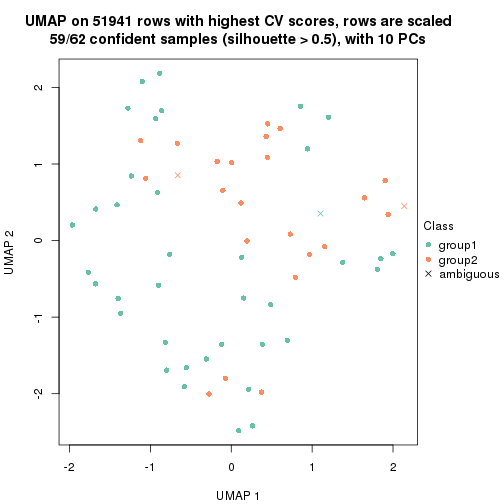</p>

</div>
<div id='tab-CV-pam-dimension-reduction-2'>
<pre><code class="r">dimension_reduction(res, k = 3, method = &quot;UMAP&quot;)
</code></pre>

<p>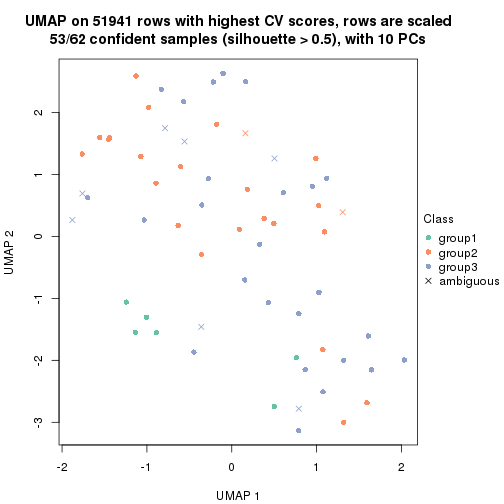</p>

</div>
<div id='tab-CV-pam-dimension-reduction-3'>
<pre><code class="r">dimension_reduction(res, k = 4, method = &quot;UMAP&quot;)
</code></pre>

<p>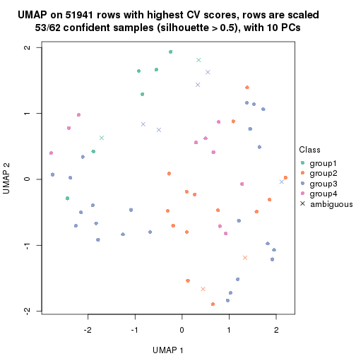</p>

</div>
<div id='tab-CV-pam-dimension-reduction-4'>
<pre><code class="r">dimension_reduction(res, k = 5, method = &quot;UMAP&quot;)
</code></pre>

<p>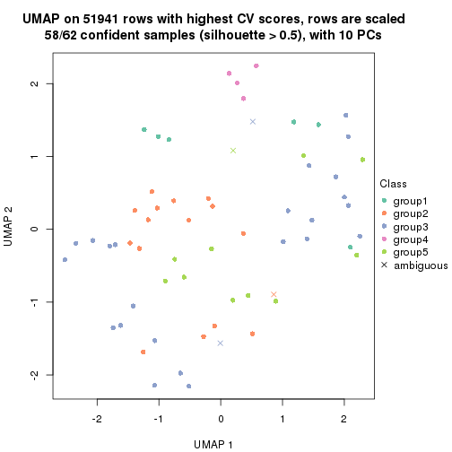</p>

</div>
<div id='tab-CV-pam-dimension-reduction-5'>
<pre><code class="r">dimension_reduction(res, k = 6, method = &quot;UMAP&quot;)
</code></pre>

<p>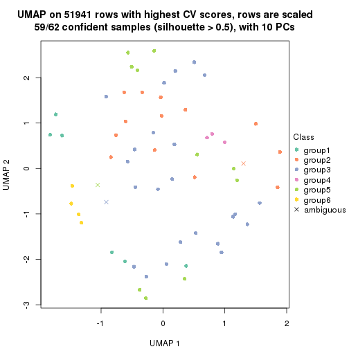</p>

</div>
</div>


Following heatmap shows how subgroups are split when increasing `k`:

```r
collect_classes(res)
```

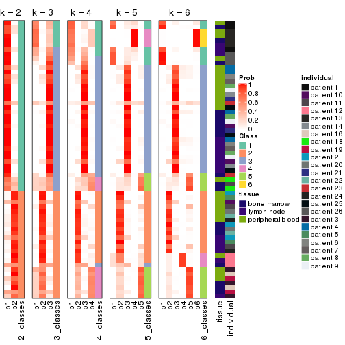


Test correlation between subgroups and known annotations. If the known
annotation is numeric, one-way ANOVA test is applied, and if the known
annotation is discrete, chi-squared contingency table test is applied.

```r
test_to_known_factors(res)
```

```
#>         n tissue(p) individual(p) k
#> CV:pam 59     0.756      1.35e-04 2
#> CV:pam 53     0.839      1.24e-06 3
#> CV:pam 53     0.677      1.92e-09 4
#> CV:pam 58     0.858      1.12e-13 5
#> CV:pam 59     0.963      1.79e-17 6
```


If matrix rows can be associated to genes, consider to use `functional_enrichment(res,
...)` to perform function enrichment for the signature genes. See [this vignette](http://bioconductor.org/packages/devel/bioc/vignettes/cola/inst/doc/functional_enrichment.html) for more detailed explanations.


 

---------------------------------------------------


### CV:mclust*


The object with results only for a single top-value method and a single partition method 
can be extracted as:

```r
res = res_list["CV", "mclust"]
# you can also extract it by
# res = res_list["CV:mclust"]
```

A summary of `res` and all the functions that can be applied to it:

```r
res
```

```
#> A 'ConsensusPartition' object with k = 2, 3, 4, 5, 6.
#>   On a matrix with 51941 rows and 62 columns.
#>   Top rows (1000, 2000, 3000, 4000, 5000) are extracted by 'CV' method.
#>   Subgroups are detected by 'mclust' method.
#>   Performed in total 1250 partitions by row resampling.
#>   Best k for subgroups seems to be 3.
#> 
#> Following methods can be applied to this 'ConsensusPartition' object:
#>  [1] "cola_report"             "collect_classes"         "collect_plots"          
#>  [4] "collect_stats"           "colnames"                "compare_signatures"     
#>  [7] "consensus_heatmap"       "dimension_reduction"     "functional_enrichment"  
#> [10] "get_anno_col"            "get_anno"                "get_classes"            
#> [13] "get_consensus"           "get_matrix"              "get_membership"         
#> [16] "get_param"               "get_signatures"          "get_stats"              
#> [19] "is_best_k"               "is_stable_k"             "membership_heatmap"     
#> [22] "ncol"                    "nrow"                    "plot_ecdf"              
#> [25] "rownames"                "select_partition_number" "show"                   
#> [28] "suggest_best_k"          "test_to_known_factors"
```

`collect_plots()` function collects all the plots made from `res` for all `k` (number of partitions)
into one single page to provide an easy and fast comparison between different `k`.

```r
collect_plots(res)
```

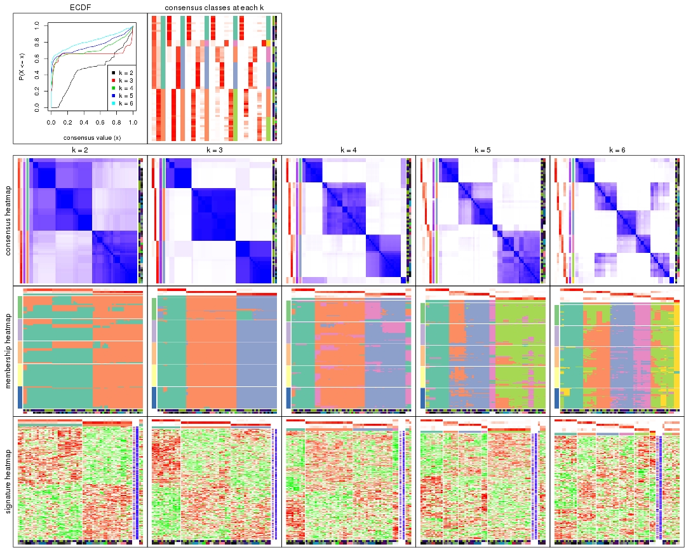

The plots are:

- The first row: a plot of the ECDF (empirical cumulative distribution
  function) curves of the consensus matrix for each `k` and the heatmap of
  predicted classes for each `k`.
- The second row: heatmaps of the consensus matrix for each `k`.
- The third row: heatmaps of the membership matrix for each `k`.
- The fouth row: heatmaps of the signatures for each `k`.

All the plots in panels can be made by individual functions and they are
plotted later in this section.

`select_partition_number()` produces several plots showing different
statistics for choosing "optimized" `k`. There are following statistics:

- ECDF curves of the consensus matrix for each `k`;
- 1-PAC. [The PAC
  score](https://en.wikipedia.org/wiki/Consensus_clustering#Over-interpretation_potential_of_consensus_clustering)
  measures the proportion of the ambiguous subgrouping.
- Mean silhouette score.
- Concordance. The mean probability of fiting the consensus class ids in all
  partitions.
- Area increased. Denote $A_k$ as the area under the ECDF curve for current
  `k`, the area increased is defined as $A_k - A_{k-1}$.
- Rand index. The percent of pairs of samples that are both in a same cluster
  or both are not in a same cluster in the partition of k and k-1.
- Jaccard index. The ratio of pairs of samples are both in a same cluster in
  the partition of k and k-1 and the pairs of samples are both in a same
  cluster in the partition k or k-1.

The detailed explanations of these statistics can be found in [the _cola_
vignette](http://bioconductor.org/packages/devel/bioc/vignettes/cola/inst/doc/cola.html#toc_13).

Generally speaking, lower PAC score, higher mean silhouette score or higher
concordance corresponds to better partition. Rand index and Jaccard index
measure how similar the current partition is compared to partition with `k-1`.
If they are too similar, we won't accept `k` is better than `k-1`.

```r
select_partition_number(res)
```

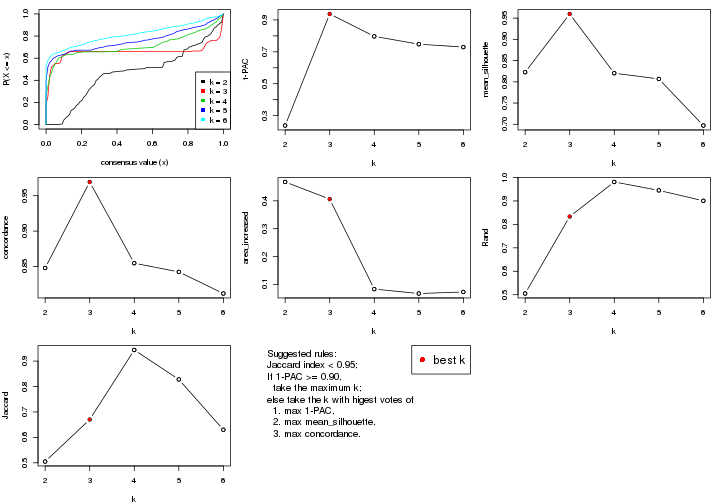

The numeric values for all these statistics can be obtained by `get_stats()`.

```r
get_stats(res)
```

```
#>   k 1-PAC mean_silhouette concordance area_increased  Rand Jaccard
#> 2 2 0.238           0.823       0.848         0.4677 0.505   0.505
#> 3 3 0.937           0.960       0.969         0.4061 0.833   0.670
#> 4 4 0.797           0.820       0.855         0.0829 0.981   0.944
#> 5 5 0.748           0.807       0.842         0.0671 0.945   0.828
#> 6 6 0.730           0.697       0.812         0.0727 0.901   0.630
```

`suggest_best_k()` suggests the best $k$ based on these statistics. The rules are as follows:

- All $k$ with Jaccard index larger than 0.95 are removed because increasing
  $k$ does not provide enough extra information. If all $k$ are removed, it is
  marked as no subgroup is detected.
- For all $k$ with 1-PAC score larger than 0.9, the maximal $k$ is taken as
  the best $k$, and other $k$ are marked as optional $k$.
- If it does not fit the second rule. The $k$ with the maximal vote of the
  highest 1-PAC score, highest mean silhouette, and highest concordance is
  taken as the best $k$.

```r
suggest_best_k(res)
```

```
#> [1] 3
```


Following shows the table of the partitions (You need to click the **show/hide
code output** link to see it). The membership matrix (columns with name `p*`)
is inferred by
[`clue::cl_consensus()`](https://www.rdocumentation.org/link/cl_consensus?package=clue)
function with the `SE` method. Basically the value in the membership matrix
represents the probability to belong to a certain group. The finall class
label for an item is determined with the group with highest probability it
belongs to.

In `get_classes()` function, the entropy is calculated from the membership
matrix and the silhouette score is calculated from the consensus matrix.


<script>
$( function() {
	$( '#tabs-CV-mclust-get-classes' ).tabs();
} );
</script>
<div id='tabs-CV-mclust-get-classes'>
<ul>
<li><a href='#tab-CV-mclust-get-classes-1'>k = 2</a></li>
<li><a href='#tab-CV-mclust-get-classes-2'>k = 3</a></li>
<li><a href='#tab-CV-mclust-get-classes-3'>k = 4</a></li>
<li><a href='#tab-CV-mclust-get-classes-4'>k = 5</a></li>
<li><a href='#tab-CV-mclust-get-classes-5'>k = 6</a></li>
</ul>

<div id='tab-CV-mclust-get-classes-1'>
<p><a id='tab-CV-mclust-get-classes-1-a' style='color:#0366d6' href='#'>show/hide code output</a></p>
<pre><code class="r">cbind(get_classes(res, k = 2), get_membership(res, k = 2))
</code></pre>

<pre><code>#&gt;           class entropy silhouette    p1    p2
#&gt; GSM525314     1  0.5059      0.783 0.888 0.112
#&gt; GSM525315     2  0.2778      0.895 0.048 0.952
#&gt; GSM525316     2  0.6531      0.838 0.168 0.832
#&gt; GSM525317     1  0.7745      0.810 0.772 0.228
#&gt; GSM525318     1  0.7745      0.810 0.772 0.228
#&gt; GSM525319     2  0.0938      0.901 0.012 0.988
#&gt; GSM525320     1  0.8144      0.817 0.748 0.252
#&gt; GSM525321     1  0.8386      0.826 0.732 0.268
#&gt; GSM525322     1  0.8386      0.826 0.732 0.268
#&gt; GSM525323     1  0.6801      0.787 0.820 0.180
#&gt; GSM525324     1  0.8713      0.818 0.708 0.292
#&gt; GSM525325     2  0.3431      0.901 0.064 0.936
#&gt; GSM525326     2  0.6887      0.818 0.184 0.816
#&gt; GSM525327     1  0.5059      0.783 0.888 0.112
#&gt; GSM525328     1  0.5059      0.783 0.888 0.112
#&gt; GSM525329     1  0.8386      0.826 0.732 0.268
#&gt; GSM525330     2  0.0938      0.909 0.012 0.988
#&gt; GSM525331     2  0.2423      0.906 0.040 0.960
#&gt; GSM525332     2  0.4431      0.893 0.092 0.908
#&gt; GSM525333     2  0.0672      0.903 0.008 0.992
#&gt; GSM525334     1  0.8386      0.826 0.732 0.268
#&gt; GSM525335     2  0.0938      0.901 0.012 0.988
#&gt; GSM525336     1  0.9552      0.356 0.624 0.376
#&gt; GSM525337     2  0.0938      0.901 0.012 0.988
#&gt; GSM525338     1  0.7745      0.810 0.772 0.228
#&gt; GSM525339     1  0.5059      0.783 0.888 0.112
#&gt; GSM525340     1  0.5178      0.784 0.884 0.116
#&gt; GSM525341     2  0.2778      0.895 0.048 0.952
#&gt; GSM525342     2  0.6048      0.856 0.148 0.852
#&gt; GSM525343     1  0.7745      0.810 0.772 0.228
#&gt; GSM525344     1  0.8386      0.826 0.732 0.268
#&gt; GSM525345     1  0.6801      0.787 0.820 0.180
#&gt; GSM525346     1  0.8555      0.819 0.720 0.280
#&gt; GSM525347     2  0.7139      0.822 0.196 0.804
#&gt; GSM525348     2  0.6887      0.818 0.184 0.816
#&gt; GSM525349     1  0.5059      0.783 0.888 0.112
#&gt; GSM525350     2  0.0672      0.908 0.008 0.992
#&gt; GSM525351     2  0.5059      0.873 0.112 0.888
#&gt; GSM525352     2  0.5294      0.878 0.120 0.880
#&gt; GSM525353     2  0.0376      0.908 0.004 0.996
#&gt; GSM525354     1  0.8861      0.816 0.696 0.304
#&gt; GSM525355     2  0.0938      0.901 0.012 0.988
#&gt; GSM525356     1  0.9522      0.368 0.628 0.372
#&gt; GSM525357     1  0.7745      0.810 0.772 0.228
#&gt; GSM525358     1  0.5059      0.783 0.888 0.112
#&gt; GSM525359     1  0.5059      0.783 0.888 0.112
#&gt; GSM525360     2  0.2778      0.895 0.048 0.952
#&gt; GSM525361     2  0.4562      0.887 0.096 0.904
#&gt; GSM525362     1  0.7745      0.810 0.772 0.228
#&gt; GSM525363     2  0.0938      0.901 0.012 0.988
#&gt; GSM525364     1  0.7815      0.812 0.768 0.232
#&gt; GSM525365     1  0.8386      0.826 0.732 0.268
#&gt; GSM525366     1  0.8386      0.826 0.732 0.268
#&gt; GSM525367     1  0.6801      0.787 0.820 0.180
#&gt; GSM525368     1  0.7815      0.812 0.768 0.232
#&gt; GSM525369     2  0.2948      0.901 0.052 0.948
#&gt; GSM525370     2  0.6973      0.815 0.188 0.812
#&gt; GSM525371     1  0.5059      0.783 0.888 0.112
#&gt; GSM525372     1  0.8386      0.826 0.732 0.268
#&gt; GSM525373     2  0.1184      0.900 0.016 0.984
#&gt; GSM525374     1  0.7745      0.810 0.772 0.228
#&gt; GSM525375     1  0.5059      0.783 0.888 0.112
</code></pre>

<script>
$('#tab-CV-mclust-get-classes-1-a').parent().next().next().hide();
$('#tab-CV-mclust-get-classes-1-a').click(function(){
  $('#tab-CV-mclust-get-classes-1-a').parent().next().next().toggle();
  return(false);
});
</script>
</div>

<div id='tab-CV-mclust-get-classes-2'>
<p><a id='tab-CV-mclust-get-classes-2-a' style='color:#0366d6' href='#'>show/hide code output</a></p>
<pre><code class="r">cbind(get_classes(res, k = 3), get_membership(res, k = 3))
</code></pre>

<pre><code>#&gt;           class entropy silhouette    p1    p2    p3
#&gt; GSM525314     1  0.0000      0.959 1.000 0.000 0.000
#&gt; GSM525315     2  0.0661      0.985 0.004 0.988 0.008
#&gt; GSM525316     2  0.1129      0.978 0.020 0.976 0.004
#&gt; GSM525317     3  0.0424      0.956 0.000 0.008 0.992
#&gt; GSM525318     3  0.0424      0.956 0.000 0.008 0.992
#&gt; GSM525319     2  0.0424      0.988 0.000 0.992 0.008
#&gt; GSM525320     3  0.0747      0.956 0.000 0.016 0.984
#&gt; GSM525321     3  0.3359      0.935 0.084 0.016 0.900
#&gt; GSM525322     3  0.3359      0.935 0.084 0.016 0.900
#&gt; GSM525323     1  0.3889      0.903 0.884 0.032 0.084
#&gt; GSM525324     3  0.1411      0.947 0.000 0.036 0.964
#&gt; GSM525325     2  0.0661      0.985 0.004 0.988 0.008
#&gt; GSM525326     2  0.0424      0.988 0.000 0.992 0.008
#&gt; GSM525327     1  0.0000      0.959 1.000 0.000 0.000
#&gt; GSM525328     1  0.0000      0.959 1.000 0.000 0.000
#&gt; GSM525329     3  0.3359      0.935 0.084 0.016 0.900
#&gt; GSM525330     2  0.0237      0.989 0.000 0.996 0.004
#&gt; GSM525331     2  0.0237      0.989 0.000 0.996 0.004
#&gt; GSM525332     2  0.0424      0.986 0.000 0.992 0.008
#&gt; GSM525333     2  0.0237      0.989 0.000 0.996 0.004
#&gt; GSM525334     3  0.3359      0.935 0.084 0.016 0.900
#&gt; GSM525335     2  0.0424      0.988 0.000 0.992 0.008
#&gt; GSM525336     1  0.3267      0.877 0.884 0.116 0.000
#&gt; GSM525337     2  0.0424      0.988 0.000 0.992 0.008
#&gt; GSM525338     3  0.0424      0.956 0.000 0.008 0.992
#&gt; GSM525339     1  0.0000      0.959 1.000 0.000 0.000
#&gt; GSM525340     1  0.0000      0.959 1.000 0.000 0.000
#&gt; GSM525341     2  0.0661      0.985 0.004 0.988 0.008
#&gt; GSM525342     2  0.0983      0.981 0.016 0.980 0.004
#&gt; GSM525343     3  0.0424      0.956 0.000 0.008 0.992
#&gt; GSM525344     3  0.3445      0.932 0.088 0.016 0.896
#&gt; GSM525345     1  0.3889      0.903 0.884 0.032 0.084
#&gt; GSM525346     3  0.0747      0.956 0.000 0.016 0.984
#&gt; GSM525347     2  0.0661      0.984 0.008 0.988 0.004
#&gt; GSM525348     2  0.0424      0.988 0.000 0.992 0.008
#&gt; GSM525349     1  0.0000      0.959 1.000 0.000 0.000
#&gt; GSM525350     2  0.0237      0.989 0.000 0.996 0.004
#&gt; GSM525351     2  0.0237      0.989 0.000 0.996 0.004
#&gt; GSM525352     2  0.0424      0.986 0.000 0.992 0.008
#&gt; GSM525353     2  0.0237      0.989 0.000 0.996 0.004
#&gt; GSM525354     3  0.1453      0.952 0.008 0.024 0.968
#&gt; GSM525355     2  0.0424      0.988 0.000 0.992 0.008
#&gt; GSM525356     1  0.3412      0.869 0.876 0.124 0.000
#&gt; GSM525357     3  0.0424      0.956 0.000 0.008 0.992
#&gt; GSM525358     1  0.0000      0.959 1.000 0.000 0.000
#&gt; GSM525359     1  0.0000      0.959 1.000 0.000 0.000
#&gt; GSM525360     2  0.0661      0.985 0.004 0.988 0.008
#&gt; GSM525361     2  0.0983      0.981 0.016 0.980 0.004
#&gt; GSM525362     3  0.0424      0.956 0.000 0.008 0.992
#&gt; GSM525363     2  0.0424      0.988 0.000 0.992 0.008
#&gt; GSM525364     3  0.0592      0.956 0.000 0.012 0.988
#&gt; GSM525365     3  0.3359      0.935 0.084 0.016 0.900
#&gt; GSM525366     3  0.3359      0.935 0.084 0.016 0.900
#&gt; GSM525367     1  0.3889      0.903 0.884 0.032 0.084
#&gt; GSM525368     3  0.0592      0.956 0.000 0.012 0.988
#&gt; GSM525369     2  0.0661      0.984 0.008 0.988 0.004
#&gt; GSM525370     2  0.0661      0.986 0.004 0.988 0.008
#&gt; GSM525371     1  0.0000      0.959 1.000 0.000 0.000
#&gt; GSM525372     3  0.3359      0.935 0.084 0.016 0.900
#&gt; GSM525373     2  0.2537      0.914 0.000 0.920 0.080
#&gt; GSM525374     3  0.0424      0.956 0.000 0.008 0.992
#&gt; GSM525375     1  0.0000      0.959 1.000 0.000 0.000
</code></pre>

<script>
$('#tab-CV-mclust-get-classes-2-a').parent().next().next().hide();
$('#tab-CV-mclust-get-classes-2-a').click(function(){
  $('#tab-CV-mclust-get-classes-2-a').parent().next().next().toggle();
  return(false);
});
</script>
</div>

<div id='tab-CV-mclust-get-classes-3'>
<p><a id='tab-CV-mclust-get-classes-3-a' style='color:#0366d6' href='#'>show/hide code output</a></p>
<pre><code class="r">cbind(get_classes(res, k = 4), get_membership(res, k = 4))
</code></pre>

<pre><code>#&gt;           class entropy silhouette    p1    p2    p3    p4
#&gt; GSM525314     1  0.1004      0.873 0.972 0.000 0.004 0.024
#&gt; GSM525315     2  0.3649      0.820 0.000 0.796 0.000 0.204
#&gt; GSM525316     2  0.5099      0.417 0.008 0.612 0.000 0.380
#&gt; GSM525317     3  0.0000      0.846 0.000 0.000 1.000 0.000
#&gt; GSM525318     3  0.0336      0.846 0.000 0.000 0.992 0.008
#&gt; GSM525319     2  0.3529      0.842 0.000 0.836 0.012 0.152
#&gt; GSM525320     3  0.1059      0.846 0.000 0.012 0.972 0.016
#&gt; GSM525321     3  0.5157      0.781 0.028 0.000 0.688 0.284
#&gt; GSM525322     3  0.5565      0.750 0.032 0.000 0.624 0.344
#&gt; GSM525323     4  0.7565      0.979 0.416 0.068 0.048 0.468
#&gt; GSM525324     3  0.2565      0.813 0.000 0.056 0.912 0.032
#&gt; GSM525325     2  0.1716      0.874 0.000 0.936 0.000 0.064
#&gt; GSM525326     2  0.2142      0.860 0.016 0.928 0.000 0.056
#&gt; GSM525327     1  0.0336      0.888 0.992 0.000 0.000 0.008
#&gt; GSM525328     1  0.0336      0.888 0.992 0.000 0.000 0.008
#&gt; GSM525329     3  0.5615      0.742 0.032 0.000 0.612 0.356
#&gt; GSM525330     2  0.1284      0.876 0.000 0.964 0.024 0.012
#&gt; GSM525331     2  0.0336      0.875 0.000 0.992 0.000 0.008
#&gt; GSM525332     2  0.0921      0.875 0.000 0.972 0.000 0.028
#&gt; GSM525333     2  0.2032      0.874 0.000 0.936 0.028 0.036
#&gt; GSM525334     3  0.5343      0.768 0.028 0.000 0.656 0.316
#&gt; GSM525335     2  0.2813      0.866 0.000 0.896 0.024 0.080
#&gt; GSM525336     1  0.5213      0.424 0.756 0.168 0.004 0.072
#&gt; GSM525337     2  0.3447      0.849 0.000 0.852 0.020 0.128
#&gt; GSM525338     3  0.0188      0.845 0.000 0.000 0.996 0.004
#&gt; GSM525339     1  0.0000      0.888 1.000 0.000 0.000 0.000
#&gt; GSM525340     1  0.1004      0.871 0.972 0.000 0.004 0.024
#&gt; GSM525341     2  0.3688      0.818 0.000 0.792 0.000 0.208
#&gt; GSM525342     2  0.4746      0.570 0.008 0.688 0.000 0.304
#&gt; GSM525343     3  0.0188      0.846 0.000 0.000 0.996 0.004
#&gt; GSM525344     3  0.5848      0.757 0.036 0.008 0.636 0.320
#&gt; GSM525345     4  0.7562      0.978 0.412 0.068 0.048 0.472
#&gt; GSM525346     3  0.1356      0.834 0.000 0.032 0.960 0.008
#&gt; GSM525347     2  0.1576      0.871 0.004 0.948 0.000 0.048
#&gt; GSM525348     2  0.2300      0.856 0.016 0.920 0.000 0.064
#&gt; GSM525349     1  0.0336      0.888 0.992 0.000 0.000 0.008
#&gt; GSM525350     2  0.1042      0.876 0.000 0.972 0.020 0.008
#&gt; GSM525351     2  0.1022      0.871 0.000 0.968 0.000 0.032
#&gt; GSM525352     2  0.1211      0.872 0.000 0.960 0.000 0.040
#&gt; GSM525353     2  0.0524      0.877 0.000 0.988 0.004 0.008
#&gt; GSM525354     3  0.3554      0.826 0.000 0.020 0.844 0.136
#&gt; GSM525355     2  0.2706      0.868 0.000 0.900 0.020 0.080
#&gt; GSM525356     1  0.5365      0.394 0.744 0.176 0.004 0.076
#&gt; GSM525357     3  0.0188      0.845 0.000 0.000 0.996 0.004
#&gt; GSM525358     1  0.0188      0.886 0.996 0.000 0.000 0.004
#&gt; GSM525359     1  0.1004      0.873 0.972 0.000 0.004 0.024
#&gt; GSM525360     2  0.3726      0.815 0.000 0.788 0.000 0.212
#&gt; GSM525361     2  0.4697      0.566 0.008 0.696 0.000 0.296
#&gt; GSM525362     3  0.0188      0.847 0.000 0.000 0.996 0.004
#&gt; GSM525363     2  0.3672      0.835 0.000 0.824 0.012 0.164
#&gt; GSM525364     3  0.0376      0.847 0.000 0.004 0.992 0.004
#&gt; GSM525365     3  0.5247      0.779 0.032 0.000 0.684 0.284
#&gt; GSM525366     3  0.5453      0.763 0.032 0.000 0.648 0.320
#&gt; GSM525367     4  0.7557      0.965 0.408 0.068 0.048 0.476
#&gt; GSM525368     3  0.0376      0.846 0.000 0.004 0.992 0.004
#&gt; GSM525369     2  0.1557      0.875 0.000 0.944 0.000 0.056
#&gt; GSM525370     2  0.2222      0.858 0.016 0.924 0.000 0.060
#&gt; GSM525371     1  0.0469      0.886 0.988 0.000 0.000 0.012
#&gt; GSM525372     3  0.5615      0.742 0.032 0.000 0.612 0.356
#&gt; GSM525373     2  0.4335      0.817 0.000 0.796 0.036 0.168
#&gt; GSM525374     3  0.0188      0.845 0.000 0.000 0.996 0.004
#&gt; GSM525375     1  0.0000      0.888 1.000 0.000 0.000 0.000
</code></pre>

<script>
$('#tab-CV-mclust-get-classes-3-a').parent().next().next().hide();
$('#tab-CV-mclust-get-classes-3-a').click(function(){
  $('#tab-CV-mclust-get-classes-3-a').parent().next().next().toggle();
  return(false);
});
</script>
</div>

<div id='tab-CV-mclust-get-classes-4'>
<p><a id='tab-CV-mclust-get-classes-4-a' style='color:#0366d6' href='#'>show/hide code output</a></p>
<pre><code class="r">cbind(get_classes(res, k = 5), get_membership(res, k = 5))
</code></pre>

<pre><code>#&gt;           class entropy silhouette    p1    p2    p3    p4    p5
#&gt; GSM525314     1  0.1571      0.901 0.936 0.004 0.000 0.060 0.000
#&gt; GSM525315     5  0.4558      0.752 0.000 0.252 0.004 0.036 0.708
#&gt; GSM525316     5  0.4793      0.355 0.000 0.020 0.000 0.436 0.544
#&gt; GSM525317     3  0.0451      0.893 0.000 0.004 0.988 0.008 0.000
#&gt; GSM525318     3  0.0451      0.893 0.000 0.004 0.988 0.008 0.000
#&gt; GSM525319     5  0.4178      0.766 0.000 0.220 0.004 0.028 0.748
#&gt; GSM525320     3  0.1851      0.855 0.000 0.088 0.912 0.000 0.000
#&gt; GSM525321     2  0.4367      0.795 0.004 0.580 0.416 0.000 0.000
#&gt; GSM525322     2  0.3766      0.872 0.004 0.728 0.268 0.000 0.000
#&gt; GSM525323     4  0.2621      0.992 0.112 0.000 0.008 0.876 0.004
#&gt; GSM525324     3  0.3888      0.691 0.000 0.176 0.788 0.004 0.032
#&gt; GSM525325     5  0.1106      0.823 0.000 0.024 0.000 0.012 0.964
#&gt; GSM525326     5  0.4520      0.718 0.028 0.032 0.000 0.180 0.760
#&gt; GSM525327     1  0.0162      0.913 0.996 0.000 0.000 0.004 0.000
#&gt; GSM525328     1  0.0290      0.913 0.992 0.000 0.000 0.008 0.000
#&gt; GSM525329     2  0.3814      0.869 0.004 0.720 0.276 0.000 0.000
#&gt; GSM525330     5  0.0771      0.823 0.000 0.020 0.000 0.004 0.976
#&gt; GSM525331     5  0.0912      0.821 0.000 0.016 0.000 0.012 0.972
#&gt; GSM525332     5  0.1582      0.815 0.000 0.028 0.000 0.028 0.944
#&gt; GSM525333     5  0.1704      0.822 0.000 0.068 0.004 0.000 0.928
#&gt; GSM525334     2  0.4135      0.873 0.004 0.656 0.340 0.000 0.000
#&gt; GSM525335     5  0.2233      0.814 0.000 0.104 0.000 0.004 0.892
#&gt; GSM525336     1  0.4983      0.656 0.740 0.016 0.000 0.128 0.116
#&gt; GSM525337     5  0.4184      0.766 0.000 0.232 0.004 0.024 0.740
#&gt; GSM525338     3  0.0510      0.896 0.000 0.016 0.984 0.000 0.000
#&gt; GSM525339     1  0.0609      0.914 0.980 0.000 0.000 0.020 0.000
#&gt; GSM525340     1  0.1544      0.899 0.932 0.000 0.000 0.068 0.000
#&gt; GSM525341     5  0.4558      0.752 0.000 0.252 0.004 0.036 0.708
#&gt; GSM525342     5  0.4675      0.475 0.000 0.020 0.000 0.380 0.600
#&gt; GSM525343     3  0.0451      0.893 0.000 0.004 0.988 0.008 0.000
#&gt; GSM525344     2  0.4348      0.881 0.016 0.668 0.316 0.000 0.000
#&gt; GSM525345     4  0.2517      0.993 0.104 0.000 0.008 0.884 0.004
#&gt; GSM525346     3  0.2162      0.857 0.000 0.064 0.916 0.008 0.012
#&gt; GSM525347     5  0.2388      0.802 0.000 0.028 0.000 0.072 0.900
#&gt; GSM525348     5  0.4814      0.696 0.036 0.032 0.000 0.196 0.736
#&gt; GSM525349     1  0.0162      0.914 0.996 0.000 0.000 0.004 0.000
#&gt; GSM525350     5  0.0955      0.823 0.000 0.028 0.000 0.004 0.968
#&gt; GSM525351     5  0.1965      0.805 0.000 0.024 0.000 0.052 0.924
#&gt; GSM525352     5  0.1818      0.810 0.000 0.024 0.000 0.044 0.932
#&gt; GSM525353     5  0.0992      0.825 0.000 0.024 0.000 0.008 0.968
#&gt; GSM525354     3  0.3966      0.137 0.000 0.336 0.664 0.000 0.000
#&gt; GSM525355     5  0.2536      0.809 0.000 0.128 0.000 0.004 0.868
#&gt; GSM525356     1  0.5144      0.636 0.724 0.016 0.000 0.148 0.112
#&gt; GSM525357     3  0.0609      0.896 0.000 0.020 0.980 0.000 0.000
#&gt; GSM525358     1  0.0703      0.913 0.976 0.000 0.000 0.024 0.000
#&gt; GSM525359     1  0.1571      0.901 0.936 0.004 0.000 0.060 0.000
#&gt; GSM525360     5  0.4583      0.749 0.000 0.256 0.004 0.036 0.704
#&gt; GSM525361     5  0.4675      0.487 0.000 0.016 0.004 0.360 0.620
#&gt; GSM525362     3  0.0290      0.897 0.000 0.008 0.992 0.000 0.000
#&gt; GSM525363     5  0.4209      0.764 0.000 0.224 0.004 0.028 0.744
#&gt; GSM525364     3  0.1792      0.844 0.000 0.084 0.916 0.000 0.000
#&gt; GSM525365     2  0.4410      0.762 0.004 0.556 0.440 0.000 0.000
#&gt; GSM525366     2  0.3814      0.883 0.004 0.720 0.276 0.000 0.000
#&gt; GSM525367     4  0.2570      0.995 0.108 0.000 0.008 0.880 0.004
#&gt; GSM525368     3  0.0404      0.896 0.000 0.012 0.988 0.000 0.000
#&gt; GSM525369     5  0.1403      0.821 0.000 0.024 0.000 0.024 0.952
#&gt; GSM525370     5  0.4855      0.696 0.040 0.032 0.000 0.192 0.736
#&gt; GSM525371     1  0.0290      0.913 0.992 0.000 0.000 0.008 0.000
#&gt; GSM525372     2  0.3861      0.866 0.004 0.712 0.284 0.000 0.000
#&gt; GSM525373     5  0.4616      0.723 0.000 0.288 0.004 0.028 0.680
#&gt; GSM525374     3  0.0510      0.896 0.000 0.016 0.984 0.000 0.000
#&gt; GSM525375     1  0.0609      0.914 0.980 0.000 0.000 0.020 0.000
</code></pre>

<script>
$('#tab-CV-mclust-get-classes-4-a').parent().next().next().hide();
$('#tab-CV-mclust-get-classes-4-a').click(function(){
  $('#tab-CV-mclust-get-classes-4-a').parent().next().next().toggle();
  return(false);
});
</script>
</div>

<div id='tab-CV-mclust-get-classes-5'>
<p><a id='tab-CV-mclust-get-classes-5-a' style='color:#0366d6' href='#'>show/hide code output</a></p>
<pre><code class="r">cbind(get_classes(res, k = 6), get_membership(res, k = 6))
</code></pre>

<pre><code>#&gt;           class entropy silhouette    p1    p2    p3    p4    p5    p6
#&gt; GSM525314     1  0.1913     0.8693 0.908 0.000 0.000 0.000 0.012 0.080
#&gt; GSM525315     2  0.0000     0.6622 0.000 1.000 0.000 0.000 0.000 0.000
#&gt; GSM525316     5  0.4153     0.5215 0.000 0.020 0.000 0.020 0.712 0.248
#&gt; GSM525317     3  0.0146     0.8964 0.000 0.000 0.996 0.000 0.000 0.004
#&gt; GSM525318     3  0.0291     0.8972 0.000 0.000 0.992 0.004 0.000 0.004
#&gt; GSM525319     2  0.2048     0.6889 0.000 0.880 0.000 0.000 0.120 0.000
#&gt; GSM525320     3  0.2892     0.8489 0.000 0.020 0.840 0.136 0.004 0.000
#&gt; GSM525321     4  0.3151     0.7970 0.000 0.000 0.252 0.748 0.000 0.000
#&gt; GSM525322     4  0.1863     0.8518 0.000 0.000 0.104 0.896 0.000 0.000
#&gt; GSM525323     6  0.0713     0.9980 0.028 0.000 0.000 0.000 0.000 0.972
#&gt; GSM525324     3  0.4039     0.7923 0.000 0.072 0.776 0.136 0.016 0.000
#&gt; GSM525325     2  0.3817     0.2075 0.000 0.568 0.000 0.000 0.432 0.000
#&gt; GSM525326     5  0.3364     0.6269 0.020 0.012 0.000 0.024 0.840 0.104
#&gt; GSM525327     1  0.0520     0.8964 0.984 0.000 0.000 0.008 0.008 0.000
#&gt; GSM525328     1  0.0520     0.8964 0.984 0.000 0.000 0.008 0.008 0.000
#&gt; GSM525329     4  0.2092     0.8322 0.000 0.000 0.124 0.876 0.000 0.000
#&gt; GSM525330     2  0.3866     0.3356 0.000 0.516 0.000 0.000 0.484 0.000
#&gt; GSM525331     5  0.3923     0.0883 0.000 0.372 0.000 0.008 0.620 0.000
#&gt; GSM525332     5  0.3782     0.3304 0.000 0.360 0.000 0.004 0.636 0.000
#&gt; GSM525333     2  0.3965     0.5557 0.000 0.616 0.004 0.004 0.376 0.000
#&gt; GSM525334     4  0.2562     0.8479 0.000 0.000 0.172 0.828 0.000 0.000
#&gt; GSM525335     2  0.3531     0.6069 0.000 0.672 0.000 0.000 0.328 0.000
#&gt; GSM525336     1  0.5484     0.6092 0.652 0.012 0.000 0.036 0.224 0.076
#&gt; GSM525337     2  0.2442     0.6897 0.000 0.852 0.004 0.000 0.144 0.000
#&gt; GSM525338     3  0.1910     0.8994 0.000 0.000 0.892 0.108 0.000 0.000
#&gt; GSM525339     1  0.0260     0.8949 0.992 0.000 0.000 0.000 0.000 0.008
#&gt; GSM525340     1  0.1913     0.8662 0.908 0.000 0.000 0.000 0.012 0.080
#&gt; GSM525341     2  0.0000     0.6622 0.000 1.000 0.000 0.000 0.000 0.000
#&gt; GSM525342     5  0.4238     0.5453 0.000 0.036 0.000 0.016 0.720 0.228
#&gt; GSM525343     3  0.0291     0.8979 0.000 0.000 0.992 0.004 0.000 0.004
#&gt; GSM525344     4  0.2135     0.8524 0.000 0.000 0.128 0.872 0.000 0.000
#&gt; GSM525345     6  0.0713     0.9980 0.028 0.000 0.000 0.000 0.000 0.972
#&gt; GSM525346     3  0.2313     0.8845 0.000 0.012 0.884 0.100 0.000 0.004
#&gt; GSM525347     5  0.4133     0.5134 0.008 0.252 0.000 0.000 0.708 0.032
#&gt; GSM525348     5  0.3476     0.6225 0.016 0.012 0.000 0.032 0.832 0.108
#&gt; GSM525349     1  0.0520     0.8964 0.984 0.000 0.000 0.008 0.008 0.000
#&gt; GSM525350     2  0.3989     0.3534 0.000 0.528 0.000 0.004 0.468 0.000
#&gt; GSM525351     5  0.1644     0.5974 0.000 0.076 0.000 0.004 0.920 0.000
#&gt; GSM525352     5  0.3409     0.4207 0.000 0.300 0.000 0.000 0.700 0.000
#&gt; GSM525353     5  0.3847    -0.2992 0.000 0.456 0.000 0.000 0.544 0.000
#&gt; GSM525354     4  0.3838     0.3192 0.000 0.000 0.448 0.552 0.000 0.000
#&gt; GSM525355     2  0.3409     0.6291 0.000 0.700 0.000 0.000 0.300 0.000
#&gt; GSM525356     1  0.5622     0.5953 0.640 0.012 0.000 0.036 0.224 0.088
#&gt; GSM525357     3  0.2003     0.8945 0.000 0.000 0.884 0.116 0.000 0.000
#&gt; GSM525358     1  0.0260     0.8949 0.992 0.000 0.000 0.000 0.000 0.008
#&gt; GSM525359     1  0.1967     0.8669 0.904 0.000 0.000 0.000 0.012 0.084
#&gt; GSM525360     2  0.0146     0.6633 0.000 0.996 0.000 0.000 0.004 0.000
#&gt; GSM525361     5  0.4745     0.5540 0.000 0.100 0.000 0.004 0.676 0.220
#&gt; GSM525362     3  0.1387     0.9077 0.000 0.000 0.932 0.068 0.000 0.000
#&gt; GSM525363     2  0.1910     0.6891 0.000 0.892 0.000 0.000 0.108 0.000
#&gt; GSM525364     3  0.2473     0.8735 0.000 0.008 0.856 0.136 0.000 0.000
#&gt; GSM525365     4  0.3489     0.7591 0.000 0.004 0.288 0.708 0.000 0.000
#&gt; GSM525366     4  0.1765     0.8502 0.000 0.000 0.096 0.904 0.000 0.000
#&gt; GSM525367     6  0.0790     0.9961 0.032 0.000 0.000 0.000 0.000 0.968
#&gt; GSM525368     3  0.1285     0.9096 0.000 0.004 0.944 0.052 0.000 0.000
#&gt; GSM525369     2  0.3866     0.0424 0.000 0.516 0.000 0.000 0.484 0.000
#&gt; GSM525370     5  0.3416     0.6206 0.020 0.008 0.000 0.032 0.836 0.104
#&gt; GSM525371     1  0.0520     0.8964 0.984 0.000 0.000 0.008 0.008 0.000
#&gt; GSM525372     4  0.2092     0.8322 0.000 0.000 0.124 0.876 0.000 0.000
#&gt; GSM525373     2  0.2118     0.6875 0.000 0.888 0.008 0.000 0.104 0.000
#&gt; GSM525374     3  0.2003     0.8951 0.000 0.000 0.884 0.116 0.000 0.000
#&gt; GSM525375     1  0.0363     0.8948 0.988 0.000 0.000 0.000 0.000 0.012
</code></pre>

<script>
$('#tab-CV-mclust-get-classes-5-a').parent().next().next().hide();
$('#tab-CV-mclust-get-classes-5-a').click(function(){
  $('#tab-CV-mclust-get-classes-5-a').parent().next().next().toggle();
  return(false);
});
</script>
</div>
</div>

Heatmaps for the consensus matrix. It visualizes the probability of two
samples to be in a same group.


<script>
$( function() {
	$( '#tabs-CV-mclust-consensus-heatmap' ).tabs();
} );
</script>
<div id='tabs-CV-mclust-consensus-heatmap'>
<ul>
<li><a href='#tab-CV-mclust-consensus-heatmap-1'>k = 2</a></li>
<li><a href='#tab-CV-mclust-consensus-heatmap-2'>k = 3</a></li>
<li><a href='#tab-CV-mclust-consensus-heatmap-3'>k = 4</a></li>
<li><a href='#tab-CV-mclust-consensus-heatmap-4'>k = 5</a></li>
<li><a href='#tab-CV-mclust-consensus-heatmap-5'>k = 6</a></li>
</ul>
<div id='tab-CV-mclust-consensus-heatmap-1'>
<pre><code class="r">consensus_heatmap(res, k = 2)
</code></pre>

<p>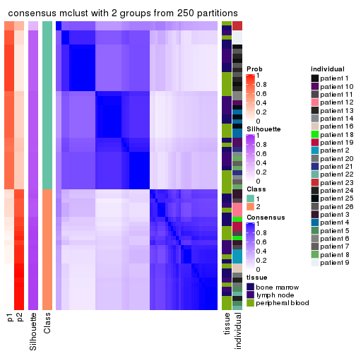</p>

</div>
<div id='tab-CV-mclust-consensus-heatmap-2'>
<pre><code class="r">consensus_heatmap(res, k = 3)
</code></pre>

<p>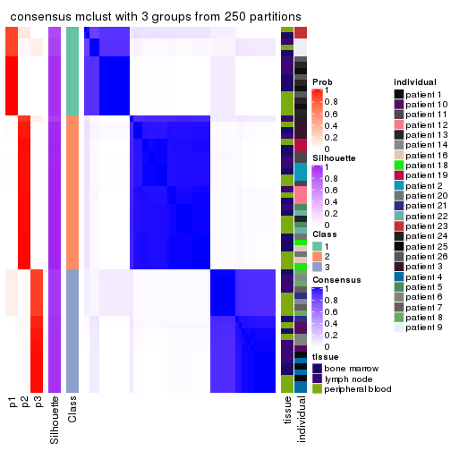</p>

</div>
<div id='tab-CV-mclust-consensus-heatmap-3'>
<pre><code class="r">consensus_heatmap(res, k = 4)
</code></pre>

<p>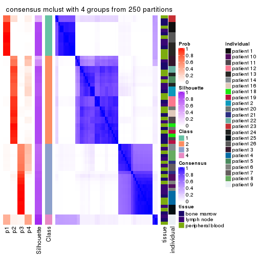</p>

</div>
<div id='tab-CV-mclust-consensus-heatmap-4'>
<pre><code class="r">consensus_heatmap(res, k = 5)
</code></pre>

<p>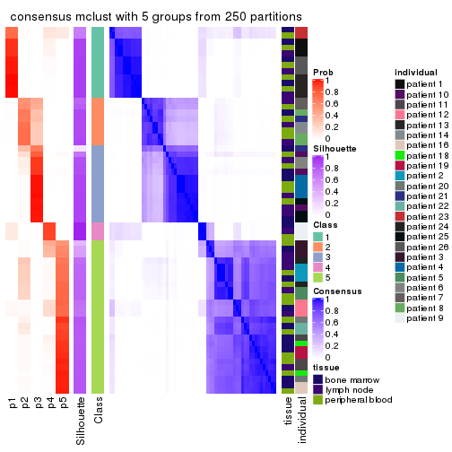</p>

</div>
<div id='tab-CV-mclust-consensus-heatmap-5'>
<pre><code class="r">consensus_heatmap(res, k = 6)
</code></pre>

<p>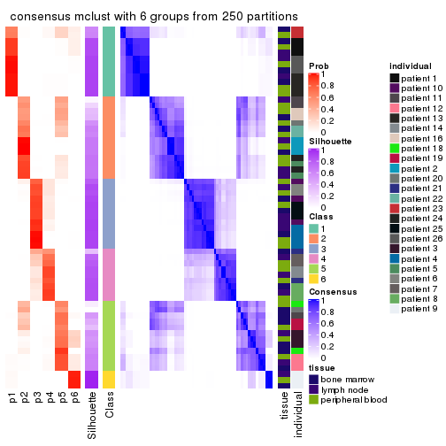</p>

</div>
</div>

Heatmaps for the membership of samples in all partitions to see how consistent they are:


<script>
$( function() {
	$( '#tabs-CV-mclust-membership-heatmap' ).tabs();
} );
</script>
<div id='tabs-CV-mclust-membership-heatmap'>
<ul>
<li><a href='#tab-CV-mclust-membership-heatmap-1'>k = 2</a></li>
<li><a href='#tab-CV-mclust-membership-heatmap-2'>k = 3</a></li>
<li><a href='#tab-CV-mclust-membership-heatmap-3'>k = 4</a></li>
<li><a href='#tab-CV-mclust-membership-heatmap-4'>k = 5</a></li>
<li><a href='#tab-CV-mclust-membership-heatmap-5'>k = 6</a></li>
</ul>
<div id='tab-CV-mclust-membership-heatmap-1'>
<pre><code class="r">membership_heatmap(res, k = 2)
</code></pre>

<p>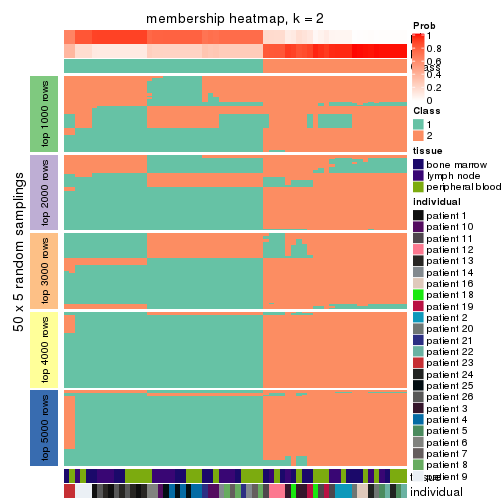</p>

</div>
<div id='tab-CV-mclust-membership-heatmap-2'>
<pre><code class="r">membership_heatmap(res, k = 3)
</code></pre>

<p>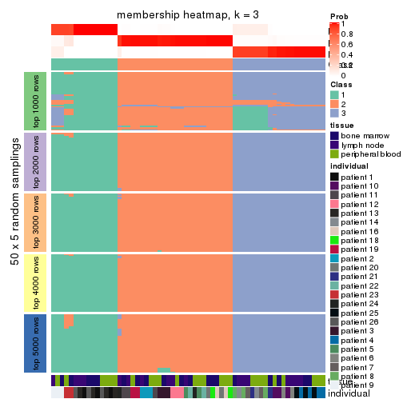</p>

</div>
<div id='tab-CV-mclust-membership-heatmap-3'>
<pre><code class="r">membership_heatmap(res, k = 4)
</code></pre>

<p>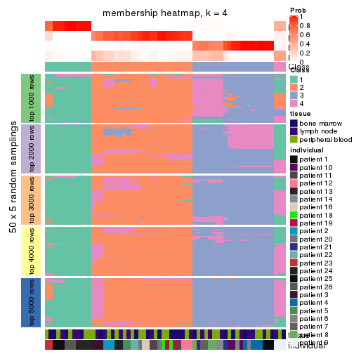</p>

</div>
<div id='tab-CV-mclust-membership-heatmap-4'>
<pre><code class="r">membership_heatmap(res, k = 5)
</code></pre>

<p>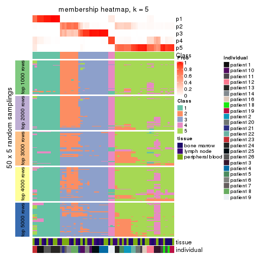</p>

</div>
<div id='tab-CV-mclust-membership-heatmap-5'>
<pre><code class="r">membership_heatmap(res, k = 6)
</code></pre>

<p>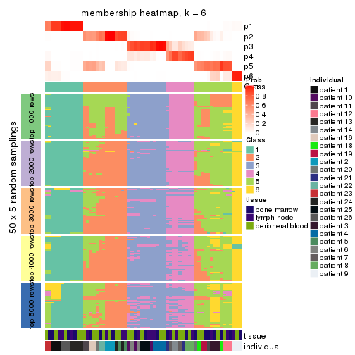</p>

</div>
</div>

As soon as we have had the classes for columns, we can look for signatures
which are significantly different between classes which can be candidate marks
for certain classes. Following are the heatmaps for signatures.


Signature heatmaps where rows are scaled:


<script>
$( function() {
	$( '#tabs-CV-mclust-get-signatures' ).tabs();
} );
</script>
<div id='tabs-CV-mclust-get-signatures'>
<ul>
<li><a href='#tab-CV-mclust-get-signatures-1'>k = 2</a></li>
<li><a href='#tab-CV-mclust-get-signatures-2'>k = 3</a></li>
<li><a href='#tab-CV-mclust-get-signatures-3'>k = 4</a></li>
<li><a href='#tab-CV-mclust-get-signatures-4'>k = 5</a></li>
<li><a href='#tab-CV-mclust-get-signatures-5'>k = 6</a></li>
</ul>
<div id='tab-CV-mclust-get-signatures-1'>
<pre><code class="r">get_signatures(res, k = 2)
</code></pre>

<p>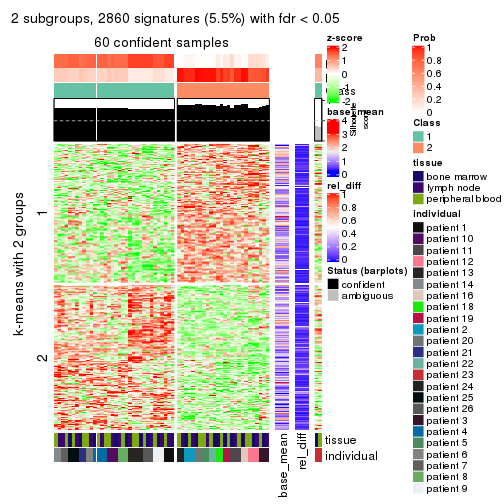</p>

</div>
<div id='tab-CV-mclust-get-signatures-2'>
<pre><code class="r">get_signatures(res, k = 3)
</code></pre>

<p>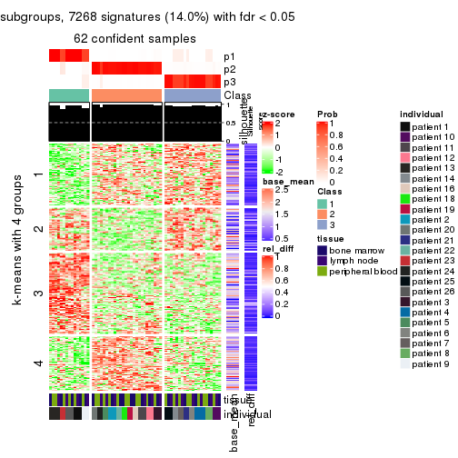</p>

</div>
<div id='tab-CV-mclust-get-signatures-3'>
<pre><code class="r">get_signatures(res, k = 4)
</code></pre>

<p>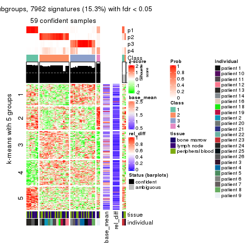</p>

</div>
<div id='tab-CV-mclust-get-signatures-4'>
<pre><code class="r">get_signatures(res, k = 5)
</code></pre>

<p>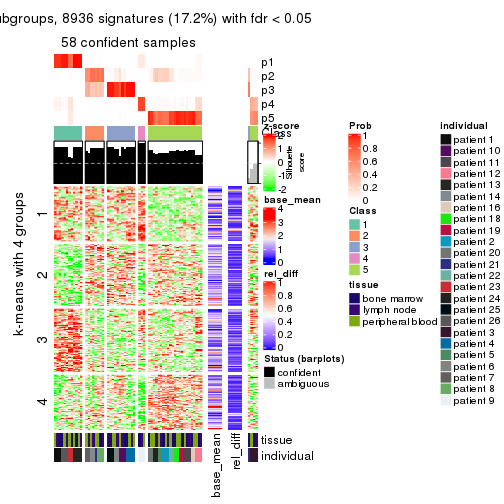</p>

</div>
<div id='tab-CV-mclust-get-signatures-5'>
<pre><code class="r">get_signatures(res, k = 6)
</code></pre>

<p>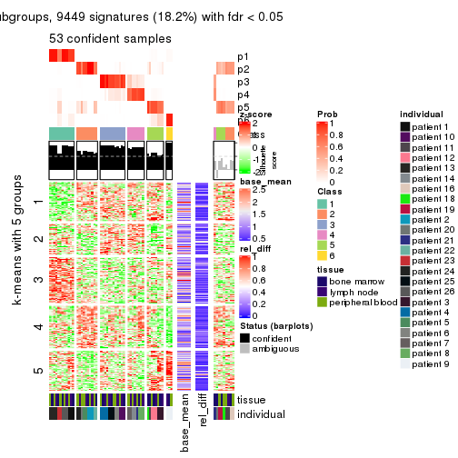</p>

</div>
</div>


Signature heatmaps where rows are not scaled:


<script>
$( function() {
	$( '#tabs-CV-mclust-get-signatures-no-scale' ).tabs();
} );
</script>
<div id='tabs-CV-mclust-get-signatures-no-scale'>
<ul>
<li><a href='#tab-CV-mclust-get-signatures-no-scale-1'>k = 2</a></li>
<li><a href='#tab-CV-mclust-get-signatures-no-scale-2'>k = 3</a></li>
<li><a href='#tab-CV-mclust-get-signatures-no-scale-3'>k = 4</a></li>
<li><a href='#tab-CV-mclust-get-signatures-no-scale-4'>k = 5</a></li>
<li><a href='#tab-CV-mclust-get-signatures-no-scale-5'>k = 6</a></li>
</ul>
<div id='tab-CV-mclust-get-signatures-no-scale-1'>
<pre><code class="r">get_signatures(res, k = 2, scale_rows = FALSE)
</code></pre>

<p>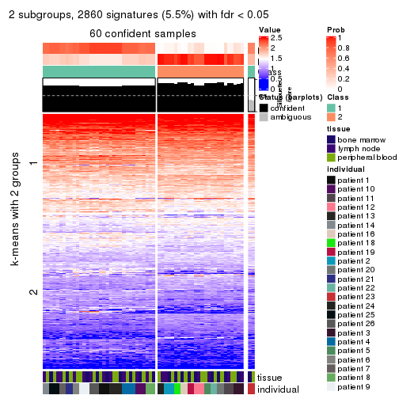</p>

</div>
<div id='tab-CV-mclust-get-signatures-no-scale-2'>
<pre><code class="r">get_signatures(res, k = 3, scale_rows = FALSE)
</code></pre>

<p>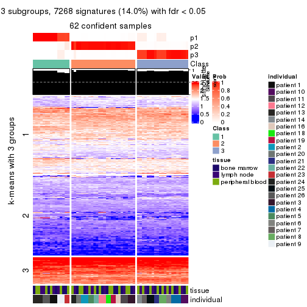</p>

</div>
<div id='tab-CV-mclust-get-signatures-no-scale-3'>
<pre><code class="r">get_signatures(res, k = 4, scale_rows = FALSE)
</code></pre>

<p>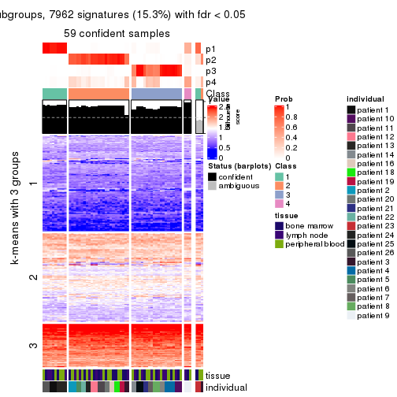</p>

</div>
<div id='tab-CV-mclust-get-signatures-no-scale-4'>
<pre><code class="r">get_signatures(res, k = 5, scale_rows = FALSE)
</code></pre>

<p>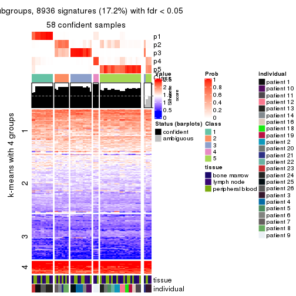</p>

</div>
<div id='tab-CV-mclust-get-signatures-no-scale-5'>
<pre><code class="r">get_signatures(res, k = 6, scale_rows = FALSE)
</code></pre>

<p>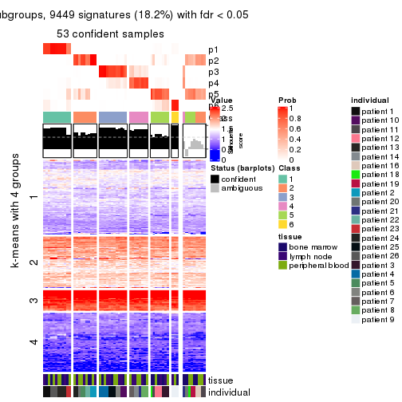</p>

</div>
</div>


Compare the overlap of signatures from different k:

```r
compare_signatures(res)
```

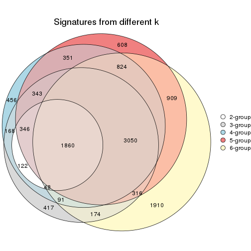

`get_signature()` returns a data frame invisibly. TO get the list of signatures, the function
call should be assigned to a variable explicitly. In following code, if `plot` argument is set
to `FALSE`, no heatmap is plotted while only the differential analysis is performed.

```r
# code only for demonstration
tb = get_signature(res, k = ..., plot = FALSE)
```

An example of the output of `tb` is:

```
#>   which_row         fdr    mean_1    mean_2 scaled_mean_1 scaled_mean_2 km
#> 1        38 0.042760348  8.373488  9.131774    -0.5533452     0.5164555  1
#> 2        40 0.018707592  7.106213  8.469186    -0.6173731     0.5762149  1
#> 3        55 0.019134737 10.221463 11.207825    -0.6159697     0.5749050  1
#> 4        59 0.006059896  5.921854  7.869574    -0.6899429     0.6439467  1
#> 5        60 0.018055526  8.928898 10.211722    -0.6204761     0.5791110  1
#> 6        98 0.009384629 15.714769 14.887706     0.6635654    -0.6193277  2
...
```

The columns in `tb` are:

1. `which_row`: row indices corresponding to the input matrix.
2. `fdr`: FDR for the differential test. 
3. `mean_x`: The mean value in group x.
4. `scaled_mean_x`: The mean value in group x after rows are scaled.
5. `km`: Row groups if k-means clustering is applied to rows.


UMAP plot which shows how samples are separated.


<script>
$( function() {
	$( '#tabs-CV-mclust-dimension-reduction' ).tabs();
} );
</script>
<div id='tabs-CV-mclust-dimension-reduction'>
<ul>
<li><a href='#tab-CV-mclust-dimension-reduction-1'>k = 2</a></li>
<li><a href='#tab-CV-mclust-dimension-reduction-2'>k = 3</a></li>
<li><a href='#tab-CV-mclust-dimension-reduction-3'>k = 4</a></li>
<li><a href='#tab-CV-mclust-dimension-reduction-4'>k = 5</a></li>
<li><a href='#tab-CV-mclust-dimension-reduction-5'>k = 6</a></li>
</ul>
<div id='tab-CV-mclust-dimension-reduction-1'>
<pre><code class="r">dimension_reduction(res, k = 2, method = &quot;UMAP&quot;)
</code></pre>

<p>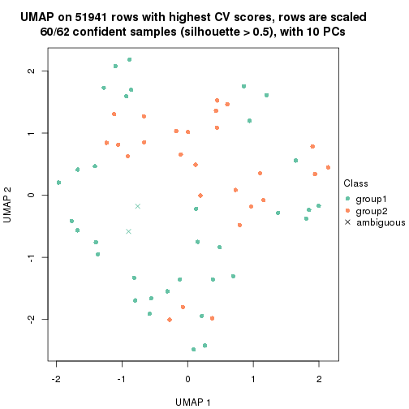</p>

</div>
<div id='tab-CV-mclust-dimension-reduction-2'>
<pre><code class="r">dimension_reduction(res, k = 3, method = &quot;UMAP&quot;)
</code></pre>

<p>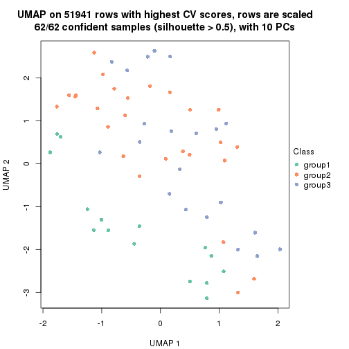</p>

</div>
<div id='tab-CV-mclust-dimension-reduction-3'>
<pre><code class="r">dimension_reduction(res, k = 4, method = &quot;UMAP&quot;)
</code></pre>

<p>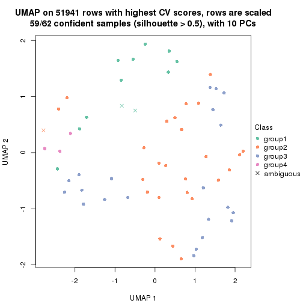</p>

</div>
<div id='tab-CV-mclust-dimension-reduction-4'>
<pre><code class="r">dimension_reduction(res, k = 5, method = &quot;UMAP&quot;)
</code></pre>

<p>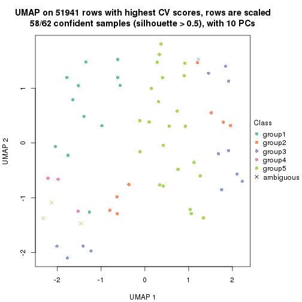</p>

</div>
<div id='tab-CV-mclust-dimension-reduction-5'>
<pre><code class="r">dimension_reduction(res, k = 6, method = &quot;UMAP&quot;)
</code></pre>

<p>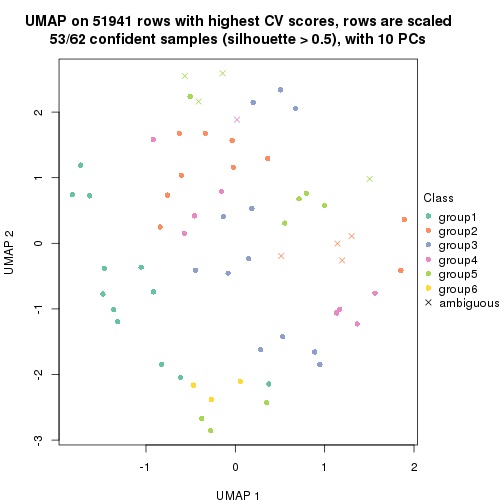</p>

</div>
</div>


Following heatmap shows how subgroups are split when increasing `k`:

```r
collect_classes(res)
```

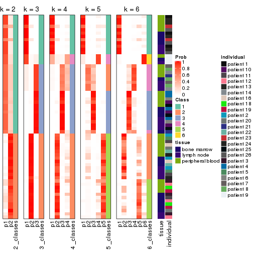


Test correlation between subgroups and known annotations. If the known
annotation is numeric, one-way ANOVA test is applied, and if the known
annotation is discrete, chi-squared contingency table test is applied.

```r
test_to_known_factors(res)
```

```
#>            n tissue(p) individual(p) k
#> CV:mclust 60     0.678      2.23e-05 2
#> CV:mclust 62     0.916      4.37e-09 3
#> CV:mclust 59     0.985      4.34e-12 4
#> CV:mclust 58     0.977      6.46e-15 5
#> CV:mclust 53     0.959      8.18e-16 6
```


If matrix rows can be associated to genes, consider to use `functional_enrichment(res,
...)` to perform function enrichment for the signature genes. See [this vignette](http://bioconductor.org/packages/devel/bioc/vignettes/cola/inst/doc/functional_enrichment.html) for more detailed explanations.


 

---------------------------------------------------


### CV:NMF*


The object with results only for a single top-value method and a single partition method 
can be extracted as:

```r
res = res_list["CV", "NMF"]
# you can also extract it by
# res = res_list["CV:NMF"]
```

A summary of `res` and all the functions that can be applied to it:

```r
res
```

```
#> A 'ConsensusPartition' object with k = 2, 3, 4, 5, 6.
#>   On a matrix with 51941 rows and 62 columns.
#>   Top rows (1000, 2000, 3000, 4000, 5000) are extracted by 'CV' method.
#>   Subgroups are detected by 'NMF' method.
#>   Performed in total 1250 partitions by row resampling.
#>   Best k for subgroups seems to be 2.
#> 
#> Following methods can be applied to this 'ConsensusPartition' object:
#>  [1] "cola_report"             "collect_classes"         "collect_plots"          
#>  [4] "collect_stats"           "colnames"                "compare_signatures"     
#>  [7] "consensus_heatmap"       "dimension_reduction"     "functional_enrichment"  
#> [10] "get_anno_col"            "get_anno"                "get_classes"            
#> [13] "get_consensus"           "get_matrix"              "get_membership"         
#> [16] "get_param"               "get_signatures"          "get_stats"              
#> [19] "is_best_k"               "is_stable_k"             "membership_heatmap"     
#> [22] "ncol"                    "nrow"                    "plot_ecdf"              
#> [25] "rownames"                "select_partition_number" "show"                   
#> [28] "suggest_best_k"          "test_to_known_factors"
```

`collect_plots()` function collects all the plots made from `res` for all `k` (number of partitions)
into one single page to provide an easy and fast comparison between different `k`.

```r
collect_plots(res)
```

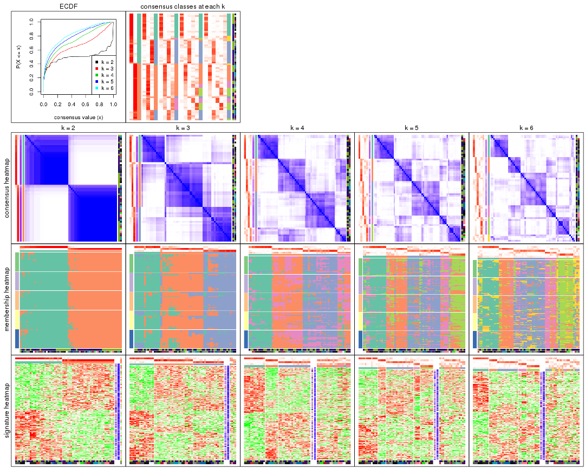

The plots are:

- The first row: a plot of the ECDF (empirical cumulative distribution
  function) curves of the consensus matrix for each `k` and the heatmap of
  predicted classes for each `k`.
- The second row: heatmaps of the consensus matrix for each `k`.
- The third row: heatmaps of the membership matrix for each `k`.
- The fouth row: heatmaps of the signatures for each `k`.

All the plots in panels can be made by individual functions and they are
plotted later in this section.

`select_partition_number()` produces several plots showing different
statistics for choosing "optimized" `k`. There are following statistics:

- ECDF curves of the consensus matrix for each `k`;
- 1-PAC. [The PAC
  score](https://en.wikipedia.org/wiki/Consensus_clustering#Over-interpretation_potential_of_consensus_clustering)
  measures the proportion of the ambiguous subgrouping.
- Mean silhouette score.
- Concordance. The mean probability of fiting the consensus class ids in all
  partitions.
- Area increased. Denote $A_k$ as the area under the ECDF curve for current
  `k`, the area increased is defined as $A_k - A_{k-1}$.
- Rand index. The percent of pairs of samples that are both in a same cluster
  or both are not in a same cluster in the partition of k and k-1.
- Jaccard index. The ratio of pairs of samples are both in a same cluster in
  the partition of k and k-1 and the pairs of samples are both in a same
  cluster in the partition k or k-1.

The detailed explanations of these statistics can be found in [the _cola_
vignette](http://bioconductor.org/packages/devel/bioc/vignettes/cola/inst/doc/cola.html#toc_13).

Generally speaking, lower PAC score, higher mean silhouette score or higher
concordance corresponds to better partition. Rand index and Jaccard index
measure how similar the current partition is compared to partition with `k-1`.
If they are too similar, we won't accept `k` is better than `k-1`.

```r
select_partition_number(res)
```

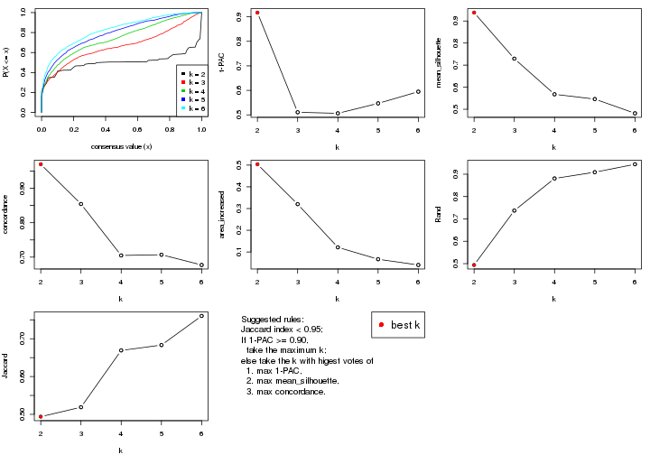

The numeric values for all these statistics can be obtained by `get_stats()`.

```r
get_stats(res)
```

```
#>   k 1-PAC mean_silhouette concordance area_increased  Rand Jaccard
#> 2 2 0.917           0.938       0.970         0.5038 0.494   0.494
#> 3 3 0.511           0.729       0.854         0.3202 0.737   0.519
#> 4 4 0.506           0.568       0.705         0.1214 0.881   0.669
#> 5 5 0.547           0.546       0.707         0.0666 0.909   0.683
#> 6 6 0.595           0.482       0.677         0.0402 0.944   0.760
```

`suggest_best_k()` suggests the best $k$ based on these statistics. The rules are as follows:

- All $k$ with Jaccard index larger than 0.95 are removed because increasing
  $k$ does not provide enough extra information. If all $k$ are removed, it is
  marked as no subgroup is detected.
- For all $k$ with 1-PAC score larger than 0.9, the maximal $k$ is taken as
  the best $k$, and other $k$ are marked as optional $k$.
- If it does not fit the second rule. The $k$ with the maximal vote of the
  highest 1-PAC score, highest mean silhouette, and highest concordance is
  taken as the best $k$.

```r
suggest_best_k(res)
```

```
#> [1] 2
```


Following shows the table of the partitions (You need to click the **show/hide
code output** link to see it). The membership matrix (columns with name `p*`)
is inferred by
[`clue::cl_consensus()`](https://www.rdocumentation.org/link/cl_consensus?package=clue)
function with the `SE` method. Basically the value in the membership matrix
represents the probability to belong to a certain group. The finall class
label for an item is determined with the group with highest probability it
belongs to.

In `get_classes()` function, the entropy is calculated from the membership
matrix and the silhouette score is calculated from the consensus matrix.


<script>
$( function() {
	$( '#tabs-CV-NMF-get-classes' ).tabs();
} );
</script>
<div id='tabs-CV-NMF-get-classes'>
<ul>
<li><a href='#tab-CV-NMF-get-classes-1'>k = 2</a></li>
<li><a href='#tab-CV-NMF-get-classes-2'>k = 3</a></li>
<li><a href='#tab-CV-NMF-get-classes-3'>k = 4</a></li>
<li><a href='#tab-CV-NMF-get-classes-4'>k = 5</a></li>
<li><a href='#tab-CV-NMF-get-classes-5'>k = 6</a></li>
</ul>

<div id='tab-CV-NMF-get-classes-1'>
<p><a id='tab-CV-NMF-get-classes-1-a' style='color:#0366d6' href='#'>show/hide code output</a></p>
<pre><code class="r">cbind(get_classes(res, k = 2), get_membership(res, k = 2))
</code></pre>

<pre><code>#&gt;           class entropy silhouette    p1    p2
#&gt; GSM525314     1  0.0000      0.961 1.000 0.000
#&gt; GSM525315     2  0.0000      0.973 0.000 1.000
#&gt; GSM525316     2  0.0000      0.973 0.000 1.000
#&gt; GSM525317     2  0.1843      0.953 0.028 0.972
#&gt; GSM525318     2  0.7376      0.737 0.208 0.792
#&gt; GSM525319     2  0.0000      0.973 0.000 1.000
#&gt; GSM525320     2  0.9209      0.485 0.336 0.664
#&gt; GSM525321     1  0.4161      0.909 0.916 0.084
#&gt; GSM525322     1  0.8443      0.656 0.728 0.272
#&gt; GSM525323     1  0.0000      0.961 1.000 0.000
#&gt; GSM525324     2  0.0000      0.973 0.000 1.000
#&gt; GSM525325     2  0.0000      0.973 0.000 1.000
#&gt; GSM525326     2  0.0000      0.973 0.000 1.000
#&gt; GSM525327     1  0.0000      0.961 1.000 0.000
#&gt; GSM525328     1  0.0000      0.961 1.000 0.000
#&gt; GSM525329     1  0.0000      0.961 1.000 0.000
#&gt; GSM525330     2  0.0000      0.973 0.000 1.000
#&gt; GSM525331     2  0.0000      0.973 0.000 1.000
#&gt; GSM525332     2  0.0000      0.973 0.000 1.000
#&gt; GSM525333     2  0.0000      0.973 0.000 1.000
#&gt; GSM525334     1  0.0000      0.961 1.000 0.000
#&gt; GSM525335     2  0.0000      0.973 0.000 1.000
#&gt; GSM525336     1  0.0376      0.960 0.996 0.004
#&gt; GSM525337     2  0.0000      0.973 0.000 1.000
#&gt; GSM525338     1  0.2236      0.946 0.964 0.036
#&gt; GSM525339     1  0.0000      0.961 1.000 0.000
#&gt; GSM525340     1  0.0000      0.961 1.000 0.000
#&gt; GSM525341     2  0.0000      0.973 0.000 1.000
#&gt; GSM525342     2  0.0000      0.973 0.000 1.000
#&gt; GSM525343     2  0.4431      0.891 0.092 0.908
#&gt; GSM525344     1  0.4690      0.894 0.900 0.100
#&gt; GSM525345     1  0.2236      0.945 0.964 0.036
#&gt; GSM525346     2  0.4431      0.892 0.092 0.908
#&gt; GSM525347     2  0.0938      0.965 0.012 0.988
#&gt; GSM525348     2  0.0000      0.973 0.000 1.000
#&gt; GSM525349     1  0.0000      0.961 1.000 0.000
#&gt; GSM525350     2  0.0000      0.973 0.000 1.000
#&gt; GSM525351     2  0.0000      0.973 0.000 1.000
#&gt; GSM525352     2  0.0000      0.973 0.000 1.000
#&gt; GSM525353     2  0.0000      0.973 0.000 1.000
#&gt; GSM525354     1  0.0000      0.961 1.000 0.000
#&gt; GSM525355     2  0.0000      0.973 0.000 1.000
#&gt; GSM525356     1  0.1843      0.949 0.972 0.028
#&gt; GSM525357     1  0.2236      0.946 0.964 0.036
#&gt; GSM525358     1  0.0000      0.961 1.000 0.000
#&gt; GSM525359     1  0.0000      0.961 1.000 0.000
#&gt; GSM525360     2  0.0000      0.973 0.000 1.000
#&gt; GSM525361     2  0.0000      0.973 0.000 1.000
#&gt; GSM525362     1  0.6887      0.797 0.816 0.184
#&gt; GSM525363     2  0.0000      0.973 0.000 1.000
#&gt; GSM525364     1  0.4161      0.907 0.916 0.084
#&gt; GSM525365     1  0.0376      0.960 0.996 0.004
#&gt; GSM525366     1  0.0672      0.958 0.992 0.008
#&gt; GSM525367     1  0.0000      0.961 1.000 0.000
#&gt; GSM525368     2  0.0000      0.973 0.000 1.000
#&gt; GSM525369     2  0.2236      0.946 0.036 0.964
#&gt; GSM525370     2  0.0376      0.971 0.004 0.996
#&gt; GSM525371     1  0.0000      0.961 1.000 0.000
#&gt; GSM525372     1  0.0000      0.961 1.000 0.000
#&gt; GSM525373     2  0.0000      0.973 0.000 1.000
#&gt; GSM525374     1  0.7139      0.781 0.804 0.196
#&gt; GSM525375     1  0.0000      0.961 1.000 0.000
</code></pre>

<script>
$('#tab-CV-NMF-get-classes-1-a').parent().next().next().hide();
$('#tab-CV-NMF-get-classes-1-a').click(function(){
  $('#tab-CV-NMF-get-classes-1-a').parent().next().next().toggle();
  return(false);
});
</script>
</div>

<div id='tab-CV-NMF-get-classes-2'>
<p><a id='tab-CV-NMF-get-classes-2-a' style='color:#0366d6' href='#'>show/hide code output</a></p>
<pre><code class="r">cbind(get_classes(res, k = 3), get_membership(res, k = 3))
</code></pre>

<pre><code>#&gt;           class entropy silhouette    p1    p2    p3
#&gt; GSM525314     1  0.2356      0.858 0.928 0.000 0.072
#&gt; GSM525315     2  0.3340      0.770 0.000 0.880 0.120
#&gt; GSM525316     2  0.5016      0.684 0.240 0.760 0.000
#&gt; GSM525317     3  0.5968      0.525 0.000 0.364 0.636
#&gt; GSM525318     3  0.5201      0.716 0.004 0.236 0.760
#&gt; GSM525319     2  0.3192      0.775 0.000 0.888 0.112
#&gt; GSM525320     3  0.4796      0.730 0.000 0.220 0.780
#&gt; GSM525321     3  0.1643      0.816 0.044 0.000 0.956
#&gt; GSM525322     3  0.2261      0.826 0.000 0.068 0.932
#&gt; GSM525323     1  0.2050      0.850 0.952 0.020 0.028
#&gt; GSM525324     2  0.6521     -0.187 0.004 0.504 0.492
#&gt; GSM525325     2  0.3941      0.755 0.156 0.844 0.000
#&gt; GSM525326     2  0.5178      0.670 0.256 0.744 0.000
#&gt; GSM525327     1  0.3340      0.845 0.880 0.000 0.120
#&gt; GSM525328     1  0.3340      0.844 0.880 0.000 0.120
#&gt; GSM525329     3  0.4002      0.704 0.160 0.000 0.840
#&gt; GSM525330     2  0.0237      0.807 0.004 0.996 0.000
#&gt; GSM525331     2  0.0475      0.808 0.004 0.992 0.004
#&gt; GSM525332     2  0.4887      0.697 0.228 0.772 0.000
#&gt; GSM525333     2  0.1399      0.804 0.004 0.968 0.028
#&gt; GSM525334     3  0.1765      0.821 0.040 0.004 0.956
#&gt; GSM525335     2  0.2537      0.791 0.000 0.920 0.080
#&gt; GSM525336     1  0.2796      0.793 0.908 0.092 0.000
#&gt; GSM525337     2  0.3267      0.773 0.000 0.884 0.116
#&gt; GSM525338     3  0.0848      0.832 0.008 0.008 0.984
#&gt; GSM525339     1  0.4178      0.808 0.828 0.000 0.172
#&gt; GSM525340     1  0.1170      0.849 0.976 0.016 0.008
#&gt; GSM525341     2  0.3267      0.773 0.000 0.884 0.116
#&gt; GSM525342     2  0.4346      0.739 0.184 0.816 0.000
#&gt; GSM525343     3  0.4931      0.719 0.000 0.232 0.768
#&gt; GSM525344     3  0.5760      0.753 0.140 0.064 0.796
#&gt; GSM525345     1  0.3141      0.821 0.912 0.068 0.020
#&gt; GSM525346     3  0.6345      0.429 0.004 0.400 0.596
#&gt; GSM525347     1  0.6308     -0.180 0.508 0.492 0.000
#&gt; GSM525348     2  0.6111      0.430 0.396 0.604 0.000
#&gt; GSM525349     1  0.1950      0.861 0.952 0.008 0.040
#&gt; GSM525350     2  0.0237      0.807 0.000 0.996 0.004
#&gt; GSM525351     2  0.3340      0.777 0.120 0.880 0.000
#&gt; GSM525352     2  0.5397      0.630 0.280 0.720 0.000
#&gt; GSM525353     2  0.0848      0.808 0.008 0.984 0.008
#&gt; GSM525354     3  0.1529      0.816 0.040 0.000 0.960
#&gt; GSM525355     2  0.2860      0.790 0.004 0.912 0.084
#&gt; GSM525356     1  0.3340      0.763 0.880 0.120 0.000
#&gt; GSM525357     3  0.0424      0.832 0.000 0.008 0.992
#&gt; GSM525358     1  0.3879      0.824 0.848 0.000 0.152
#&gt; GSM525359     1  0.1878      0.861 0.952 0.004 0.044
#&gt; GSM525360     2  0.4062      0.723 0.000 0.836 0.164
#&gt; GSM525361     2  0.3193      0.786 0.100 0.896 0.004
#&gt; GSM525362     3  0.1031      0.834 0.000 0.024 0.976
#&gt; GSM525363     2  0.3267      0.773 0.000 0.884 0.116
#&gt; GSM525364     3  0.3267      0.827 0.044 0.044 0.912
#&gt; GSM525365     3  0.2796      0.779 0.092 0.000 0.908
#&gt; GSM525366     3  0.0661      0.831 0.008 0.004 0.988
#&gt; GSM525367     1  0.2356      0.857 0.928 0.000 0.072
#&gt; GSM525368     3  0.5956      0.593 0.004 0.324 0.672
#&gt; GSM525369     2  0.4912      0.722 0.196 0.796 0.008
#&gt; GSM525370     2  0.5905      0.524 0.352 0.648 0.000
#&gt; GSM525371     1  0.4399      0.795 0.812 0.000 0.188
#&gt; GSM525372     3  0.4555      0.646 0.200 0.000 0.800
#&gt; GSM525373     2  0.4346      0.698 0.000 0.816 0.184
#&gt; GSM525374     3  0.1411      0.832 0.000 0.036 0.964
#&gt; GSM525375     1  0.4605      0.775 0.796 0.000 0.204
</code></pre>

<script>
$('#tab-CV-NMF-get-classes-2-a').parent().next().next().hide();
$('#tab-CV-NMF-get-classes-2-a').click(function(){
  $('#tab-CV-NMF-get-classes-2-a').parent().next().next().toggle();
  return(false);
});
</script>
</div>

<div id='tab-CV-NMF-get-classes-3'>
<p><a id='tab-CV-NMF-get-classes-3-a' style='color:#0366d6' href='#'>show/hide code output</a></p>
<pre><code class="r">cbind(get_classes(res, k = 4), get_membership(res, k = 4))
</code></pre>

<pre><code>#&gt;           class entropy silhouette    p1    p2    p3    p4
#&gt; GSM525314     1   0.241     0.8409 0.920 0.000 0.044 0.036
#&gt; GSM525315     2   0.185     0.5827 0.000 0.940 0.048 0.012
#&gt; GSM525316     4   0.544     0.3688 0.048 0.264 0.000 0.688
#&gt; GSM525317     3   0.506     0.6591 0.000 0.024 0.692 0.284
#&gt; GSM525318     3   0.568     0.6046 0.012 0.020 0.632 0.336
#&gt; GSM525319     2   0.439     0.5670 0.000 0.808 0.060 0.132
#&gt; GSM525320     3   0.613     0.6482 0.008 0.100 0.688 0.204
#&gt; GSM525321     3   0.433     0.7710 0.080 0.068 0.836 0.016
#&gt; GSM525322     3   0.571     0.7239 0.056 0.168 0.744 0.032
#&gt; GSM525323     1   0.664     0.3906 0.552 0.000 0.096 0.352
#&gt; GSM525324     3   0.706     0.5206 0.000 0.228 0.572 0.200
#&gt; GSM525325     2   0.327     0.5340 0.012 0.856 0.000 0.132
#&gt; GSM525326     4   0.690     0.2978 0.116 0.284 0.008 0.592
#&gt; GSM525327     1   0.189     0.8546 0.944 0.004 0.016 0.036
#&gt; GSM525328     1   0.243     0.8439 0.920 0.008 0.012 0.060
#&gt; GSM525329     3   0.428     0.7184 0.172 0.004 0.800 0.024
#&gt; GSM525330     2   0.492     0.2401 0.000 0.572 0.000 0.428
#&gt; GSM525331     2   0.492     0.3464 0.000 0.628 0.004 0.368
#&gt; GSM525332     2   0.602     0.0955 0.044 0.540 0.000 0.416
#&gt; GSM525333     2   0.475     0.4366 0.000 0.688 0.008 0.304
#&gt; GSM525334     3   0.580     0.7387 0.116 0.100 0.752 0.032
#&gt; GSM525335     2   0.546     0.3905 0.000 0.632 0.028 0.340
#&gt; GSM525336     1   0.379     0.7643 0.820 0.016 0.000 0.164
#&gt; GSM525337     2   0.421     0.5810 0.000 0.816 0.048 0.136
#&gt; GSM525338     3   0.253     0.7763 0.004 0.008 0.908 0.080
#&gt; GSM525339     1   0.121     0.8529 0.964 0.000 0.032 0.004
#&gt; GSM525340     1   0.208     0.8286 0.916 0.000 0.000 0.084
#&gt; GSM525341     2   0.210     0.5835 0.000 0.928 0.060 0.012
#&gt; GSM525342     4   0.518     0.3286 0.024 0.304 0.000 0.672
#&gt; GSM525343     3   0.402     0.7313 0.000 0.012 0.792 0.196
#&gt; GSM525344     3   0.794     0.3097 0.120 0.396 0.448 0.036
#&gt; GSM525345     4   0.701     0.0223 0.356 0.004 0.112 0.528
#&gt; GSM525346     3   0.645     0.6170 0.000 0.132 0.636 0.232
#&gt; GSM525347     2   0.708     0.0767 0.200 0.568 0.000 0.232
#&gt; GSM525348     4   0.746     0.3794 0.252 0.212 0.004 0.532
#&gt; GSM525349     1   0.273     0.8342 0.896 0.008 0.004 0.092
#&gt; GSM525350     2   0.496     0.1974 0.000 0.552 0.000 0.448
#&gt; GSM525351     4   0.586    -0.0869 0.032 0.476 0.000 0.492
#&gt; GSM525352     2   0.532     0.3711 0.032 0.672 0.000 0.296
#&gt; GSM525353     2   0.571     0.2812 0.000 0.556 0.028 0.416
#&gt; GSM525354     3   0.214     0.7820 0.040 0.012 0.936 0.012
#&gt; GSM525355     2   0.634     0.2939 0.000 0.552 0.068 0.380
#&gt; GSM525356     1   0.458     0.7139 0.768 0.032 0.000 0.200
#&gt; GSM525357     3   0.197     0.7793 0.000 0.008 0.932 0.060
#&gt; GSM525358     1   0.104     0.8551 0.972 0.000 0.020 0.008
#&gt; GSM525359     1   0.182     0.8516 0.944 0.000 0.036 0.020
#&gt; GSM525360     2   0.305     0.5551 0.000 0.884 0.088 0.028
#&gt; GSM525361     4   0.501     0.2837 0.004 0.320 0.008 0.668
#&gt; GSM525362     3   0.186     0.7831 0.004 0.012 0.944 0.040
#&gt; GSM525363     2   0.374     0.5764 0.000 0.852 0.060 0.088
#&gt; GSM525364     3   0.472     0.7561 0.056 0.020 0.812 0.112
#&gt; GSM525365     3   0.499     0.7430 0.136 0.048 0.792 0.024
#&gt; GSM525366     3   0.561     0.7453 0.068 0.120 0.768 0.044
#&gt; GSM525367     1   0.644     0.5764 0.640 0.000 0.136 0.224
#&gt; GSM525368     3   0.538     0.7191 0.000 0.128 0.744 0.128
#&gt; GSM525369     2   0.406     0.4869 0.012 0.788 0.000 0.200
#&gt; GSM525370     4   0.747     0.3770 0.276 0.196 0.004 0.524
#&gt; GSM525371     1   0.297     0.8339 0.900 0.008 0.032 0.060
#&gt; GSM525372     3   0.474     0.6830 0.208 0.004 0.760 0.028
#&gt; GSM525373     2   0.357     0.5684 0.000 0.860 0.092 0.048
#&gt; GSM525374     3   0.183     0.7807 0.000 0.024 0.944 0.032
#&gt; GSM525375     1   0.214     0.8381 0.928 0.000 0.056 0.016
</code></pre>

<script>
$('#tab-CV-NMF-get-classes-3-a').parent().next().next().hide();
$('#tab-CV-NMF-get-classes-3-a').click(function(){
  $('#tab-CV-NMF-get-classes-3-a').parent().next().next().toggle();
  return(false);
});
</script>
</div>

<div id='tab-CV-NMF-get-classes-4'>
<p><a id='tab-CV-NMF-get-classes-4-a' style='color:#0366d6' href='#'>show/hide code output</a></p>
<pre><code class="r">cbind(get_classes(res, k = 5), get_membership(res, k = 5))
</code></pre>

<pre><code>#&gt;           class entropy silhouette    p1    p2    p3    p4    p5
#&gt; GSM525314     1   0.290     0.7812 0.888 0.000 0.044 0.020 0.048
#&gt; GSM525315     2   0.248     0.5775 0.000 0.892 0.008 0.008 0.092
#&gt; GSM525316     5   0.278     0.6405 0.000 0.072 0.000 0.048 0.880
#&gt; GSM525317     3   0.509     0.6342 0.000 0.020 0.732 0.100 0.148
#&gt; GSM525318     3   0.547     0.5975 0.004 0.008 0.692 0.136 0.160
#&gt; GSM525319     2   0.459     0.4773 0.000 0.760 0.024 0.172 0.044
#&gt; GSM525320     3   0.624     0.2080 0.016 0.048 0.480 0.020 0.436
#&gt; GSM525321     3   0.568     0.6588 0.100 0.172 0.696 0.024 0.008
#&gt; GSM525322     3   0.602     0.5424 0.056 0.284 0.616 0.040 0.004
#&gt; GSM525323     1   0.756     0.3517 0.424 0.000 0.104 0.116 0.356
#&gt; GSM525324     3   0.647     0.3351 0.000 0.132 0.540 0.308 0.020
#&gt; GSM525325     2   0.487     0.2561 0.004 0.640 0.000 0.032 0.324
#&gt; GSM525326     4   0.503     0.7164 0.028 0.136 0.004 0.752 0.080
#&gt; GSM525327     1   0.221     0.7897 0.908 0.004 0.004 0.080 0.004
#&gt; GSM525328     1   0.300     0.7824 0.872 0.020 0.004 0.096 0.008
#&gt; GSM525329     3   0.550     0.5904 0.256 0.028 0.668 0.040 0.008
#&gt; GSM525330     5   0.446     0.5601 0.000 0.320 0.000 0.020 0.660
#&gt; GSM525331     5   0.497     0.5819 0.000 0.300 0.004 0.044 0.652
#&gt; GSM525332     5   0.477     0.6290 0.016 0.236 0.000 0.036 0.712
#&gt; GSM525333     2   0.693     0.0490 0.000 0.456 0.016 0.320 0.208
#&gt; GSM525334     3   0.650     0.6026 0.132 0.204 0.620 0.036 0.008
#&gt; GSM525335     2   0.695     0.1863 0.000 0.452 0.016 0.212 0.320
#&gt; GSM525336     1   0.570     0.5703 0.580 0.016 0.000 0.344 0.060
#&gt; GSM525337     2   0.498     0.5474 0.000 0.744 0.020 0.104 0.132
#&gt; GSM525338     3   0.324     0.6955 0.016 0.016 0.868 0.088 0.012
#&gt; GSM525339     1   0.308     0.7892 0.880 0.000 0.028 0.052 0.040
#&gt; GSM525340     1   0.319     0.7806 0.852 0.004 0.000 0.112 0.032
#&gt; GSM525341     2   0.173     0.6004 0.000 0.932 0.004 0.004 0.060
#&gt; GSM525342     5   0.279     0.6418 0.000 0.068 0.000 0.052 0.880
#&gt; GSM525343     3   0.390     0.6731 0.004 0.004 0.820 0.092 0.080
#&gt; GSM525344     2   0.738    -0.0171 0.084 0.512 0.308 0.076 0.020
#&gt; GSM525345     5   0.807    -0.0845 0.212 0.000 0.144 0.212 0.432
#&gt; GSM525346     3   0.608     0.2847 0.000 0.080 0.512 0.392 0.016
#&gt; GSM525347     2   0.751     0.1535 0.060 0.456 0.000 0.276 0.208
#&gt; GSM525348     4   0.493     0.6848 0.092 0.080 0.000 0.768 0.060
#&gt; GSM525349     1   0.346     0.7509 0.812 0.016 0.000 0.168 0.004
#&gt; GSM525350     5   0.401     0.6224 0.000 0.256 0.000 0.016 0.728
#&gt; GSM525351     5   0.574     0.5611 0.004 0.232 0.004 0.120 0.640
#&gt; GSM525352     5   0.696     0.1891 0.020 0.392 0.004 0.156 0.428
#&gt; GSM525353     4   0.620     0.5122 0.000 0.308 0.020 0.568 0.104
#&gt; GSM525354     3   0.300     0.7054 0.048 0.028 0.888 0.032 0.004
#&gt; GSM525355     4   0.752     0.4028 0.000 0.320 0.072 0.444 0.164
#&gt; GSM525356     1   0.629     0.4300 0.484 0.028 0.000 0.412 0.076
#&gt; GSM525357     3   0.258     0.6937 0.000 0.024 0.896 0.072 0.008
#&gt; GSM525358     1   0.239     0.7942 0.908 0.000 0.008 0.060 0.024
#&gt; GSM525359     1   0.278     0.7857 0.900 0.004 0.028 0.032 0.036
#&gt; GSM525360     2   0.212     0.5706 0.000 0.924 0.044 0.020 0.012
#&gt; GSM525361     5   0.354     0.6451 0.000 0.100 0.008 0.052 0.840
#&gt; GSM525362     3   0.269     0.7066 0.024 0.024 0.908 0.028 0.016
#&gt; GSM525363     2   0.467     0.4240 0.004 0.744 0.032 0.200 0.020
#&gt; GSM525364     3   0.601     0.6035 0.112 0.004 0.648 0.024 0.212
#&gt; GSM525365     3   0.650     0.6008 0.216 0.152 0.596 0.036 0.000
#&gt; GSM525366     3   0.657     0.5588 0.116 0.252 0.584 0.048 0.000
#&gt; GSM525367     1   0.762     0.5207 0.512 0.000 0.152 0.152 0.184
#&gt; GSM525368     3   0.523     0.6066 0.004 0.096 0.708 0.184 0.008
#&gt; GSM525369     2   0.518     0.2362 0.016 0.628 0.000 0.032 0.324
#&gt; GSM525370     4   0.499     0.7047 0.088 0.104 0.000 0.760 0.048
#&gt; GSM525371     1   0.311     0.7733 0.876 0.028 0.016 0.076 0.004
#&gt; GSM525372     3   0.573     0.5082 0.328 0.036 0.596 0.040 0.000
#&gt; GSM525373     2   0.387     0.5963 0.004 0.832 0.024 0.040 0.100
#&gt; GSM525374     3   0.246     0.7014 0.004 0.032 0.908 0.052 0.004
#&gt; GSM525375     1   0.188     0.7892 0.936 0.000 0.032 0.020 0.012
</code></pre>

<script>
$('#tab-CV-NMF-get-classes-4-a').parent().next().next().hide();
$('#tab-CV-NMF-get-classes-4-a').click(function(){
  $('#tab-CV-NMF-get-classes-4-a').parent().next().next().toggle();
  return(false);
});
</script>
</div>

<div id='tab-CV-NMF-get-classes-5'>
<p><a id='tab-CV-NMF-get-classes-5-a' style='color:#0366d6' href='#'>show/hide code output</a></p>
<pre><code class="r">cbind(get_classes(res, k = 6), get_membership(res, k = 6))
</code></pre>

<pre><code>#&gt;           class entropy silhouette    p1    p2    p3    p4    p5    p6
#&gt; GSM525314     1   0.279    0.67628 0.872 0.000 0.016 0.004 0.020 0.088
#&gt; GSM525315     2   0.262    0.69283 0.000 0.884 0.008 0.012 0.080 0.016
#&gt; GSM525316     5   0.223    0.63528 0.008 0.016 0.000 0.008 0.908 0.060
#&gt; GSM525317     3   0.560    0.56369 0.000 0.012 0.680 0.132 0.112 0.064
#&gt; GSM525318     3   0.588    0.55402 0.004 0.012 0.668 0.124 0.100 0.092
#&gt; GSM525319     2   0.451    0.37248 0.000 0.636 0.008 0.328 0.020 0.008
#&gt; GSM525320     5   0.599    0.09288 0.012 0.012 0.376 0.024 0.516 0.060
#&gt; GSM525321     3   0.548    0.56498 0.064 0.164 0.680 0.008 0.000 0.084
#&gt; GSM525322     3   0.598    0.53041 0.024 0.140 0.652 0.020 0.016 0.148
#&gt; GSM525323     1   0.796   -0.04850 0.328 0.004 0.092 0.032 0.264 0.280
#&gt; GSM525324     3   0.639    0.26105 0.000 0.072 0.444 0.404 0.008 0.072
#&gt; GSM525325     2   0.490    0.49434 0.000 0.660 0.000 0.008 0.236 0.096
#&gt; GSM525326     4   0.320    0.61521 0.012 0.048 0.004 0.868 0.028 0.040
#&gt; GSM525327     1   0.284    0.66481 0.860 0.004 0.000 0.028 0.004 0.104
#&gt; GSM525328     1   0.352    0.64505 0.816 0.008 0.000 0.048 0.004 0.124
#&gt; GSM525329     3   0.555    0.52172 0.220 0.048 0.648 0.008 0.000 0.076
#&gt; GSM525330     5   0.353    0.62743 0.000 0.220 0.000 0.012 0.760 0.008
#&gt; GSM525331     5   0.541    0.61856 0.012 0.196 0.000 0.020 0.660 0.112
#&gt; GSM525332     5   0.510    0.64984 0.016 0.140 0.000 0.024 0.712 0.108
#&gt; GSM525333     4   0.567    0.14275 0.000 0.392 0.000 0.468 0.136 0.004
#&gt; GSM525334     3   0.682    0.50936 0.112 0.136 0.592 0.016 0.016 0.128
#&gt; GSM525335     4   0.675    0.09189 0.000 0.324 0.012 0.364 0.284 0.016
#&gt; GSM525336     1   0.617    0.13982 0.412 0.004 0.000 0.184 0.008 0.392
#&gt; GSM525337     2   0.481    0.59774 0.000 0.712 0.004 0.176 0.088 0.020
#&gt; GSM525338     3   0.402    0.63026 0.012 0.028 0.804 0.056 0.000 0.100
#&gt; GSM525339     1   0.410    0.64001 0.776 0.000 0.048 0.012 0.012 0.152
#&gt; GSM525340     1   0.322    0.66431 0.824 0.000 0.000 0.024 0.012 0.140
#&gt; GSM525341     2   0.199    0.70128 0.000 0.916 0.000 0.028 0.052 0.004
#&gt; GSM525342     5   0.229    0.65074 0.004 0.024 0.000 0.016 0.908 0.048
#&gt; GSM525343     3   0.437    0.61512 0.000 0.012 0.776 0.120 0.032 0.060
#&gt; GSM525344     6   0.735   -0.17775 0.016 0.248 0.324 0.012 0.036 0.364
#&gt; GSM525345     6   0.818    0.00139 0.184 0.000 0.168 0.044 0.260 0.344
#&gt; GSM525346     3   0.646    0.38922 0.000 0.032 0.484 0.348 0.020 0.116
#&gt; GSM525347     6   0.758   -0.09689 0.040 0.360 0.000 0.100 0.128 0.372
#&gt; GSM525348     4   0.376    0.56107 0.040 0.028 0.000 0.824 0.016 0.092
#&gt; GSM525349     1   0.378    0.63899 0.800 0.008 0.000 0.068 0.004 0.120
#&gt; GSM525350     5   0.295    0.66470 0.000 0.172 0.000 0.004 0.816 0.008
#&gt; GSM525351     5   0.597    0.56515 0.008 0.112 0.000 0.052 0.612 0.216
#&gt; GSM525352     5   0.711    0.26887 0.012 0.236 0.000 0.052 0.404 0.296
#&gt; GSM525353     4   0.479    0.52932 0.000 0.248 0.004 0.680 0.028 0.040
#&gt; GSM525354     3   0.343    0.62877 0.032 0.040 0.848 0.012 0.000 0.068
#&gt; GSM525355     4   0.574    0.51219 0.000 0.204 0.016 0.628 0.132 0.020
#&gt; GSM525356     6   0.672   -0.07041 0.264 0.028 0.000 0.188 0.024 0.496
#&gt; GSM525357     3   0.343    0.63640 0.004 0.028 0.840 0.084 0.000 0.044
#&gt; GSM525358     1   0.336    0.66959 0.824 0.000 0.028 0.012 0.004 0.132
#&gt; GSM525359     1   0.251    0.67590 0.892 0.004 0.000 0.012 0.024 0.068
#&gt; GSM525360     2   0.206    0.67048 0.000 0.920 0.016 0.044 0.004 0.016
#&gt; GSM525361     5   0.247    0.64595 0.000 0.028 0.000 0.024 0.896 0.052
#&gt; GSM525362     3   0.420    0.62968 0.008 0.020 0.800 0.056 0.016 0.100
#&gt; GSM525363     2   0.398    0.44377 0.000 0.692 0.004 0.288 0.008 0.008
#&gt; GSM525364     3   0.727    0.32389 0.056 0.016 0.480 0.036 0.304 0.108
#&gt; GSM525365     3   0.692    0.45666 0.168 0.180 0.524 0.008 0.000 0.120
#&gt; GSM525366     3   0.679    0.47654 0.084 0.144 0.564 0.012 0.008 0.188
#&gt; GSM525367     1   0.785    0.10147 0.388 0.004 0.140 0.044 0.108 0.316
#&gt; GSM525368     3   0.619    0.52238 0.000 0.068 0.588 0.248 0.016 0.080
#&gt; GSM525369     2   0.512    0.41741 0.004 0.628 0.000 0.004 0.264 0.100
#&gt; GSM525370     4   0.386    0.57576 0.052 0.032 0.004 0.828 0.016 0.068
#&gt; GSM525371     1   0.409    0.62217 0.780 0.020 0.008 0.032 0.004 0.156
#&gt; GSM525372     3   0.617    0.45995 0.256 0.052 0.572 0.008 0.000 0.112
#&gt; GSM525373     2   0.366    0.67777 0.000 0.828 0.012 0.052 0.088 0.020
#&gt; GSM525374     3   0.332    0.63725 0.000 0.024 0.836 0.104 0.000 0.036
#&gt; GSM525375     1   0.187    0.68859 0.916 0.000 0.020 0.000 0.000 0.064
</code></pre>

<script>
$('#tab-CV-NMF-get-classes-5-a').parent().next().next().hide();
$('#tab-CV-NMF-get-classes-5-a').click(function(){
  $('#tab-CV-NMF-get-classes-5-a').parent().next().next().toggle();
  return(false);
});
</script>
</div>
</div>

Heatmaps for the consensus matrix. It visualizes the probability of two
samples to be in a same group.


<script>
$( function() {
	$( '#tabs-CV-NMF-consensus-heatmap' ).tabs();
} );
</script>
<div id='tabs-CV-NMF-consensus-heatmap'>
<ul>
<li><a href='#tab-CV-NMF-consensus-heatmap-1'>k = 2</a></li>
<li><a href='#tab-CV-NMF-consensus-heatmap-2'>k = 3</a></li>
<li><a href='#tab-CV-NMF-consensus-heatmap-3'>k = 4</a></li>
<li><a href='#tab-CV-NMF-consensus-heatmap-4'>k = 5</a></li>
<li><a href='#tab-CV-NMF-consensus-heatmap-5'>k = 6</a></li>
</ul>
<div id='tab-CV-NMF-consensus-heatmap-1'>
<pre><code class="r">consensus_heatmap(res, k = 2)
</code></pre>

<p>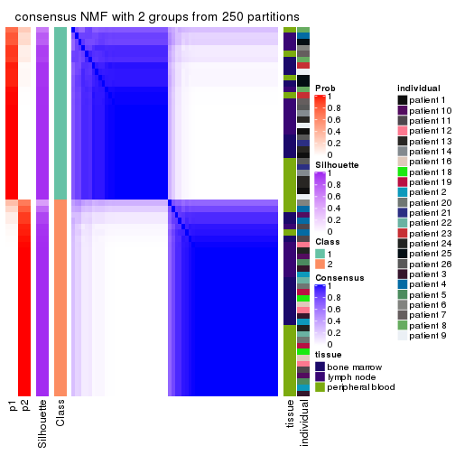</p>

</div>
<div id='tab-CV-NMF-consensus-heatmap-2'>
<pre><code class="r">consensus_heatmap(res, k = 3)
</code></pre>

<p>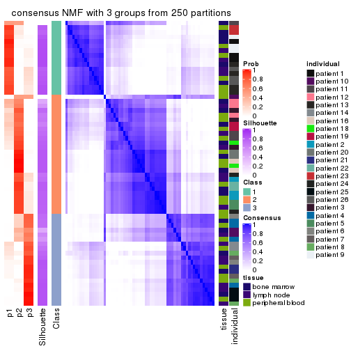</p>

</div>
<div id='tab-CV-NMF-consensus-heatmap-3'>
<pre><code class="r">consensus_heatmap(res, k = 4)
</code></pre>

<p>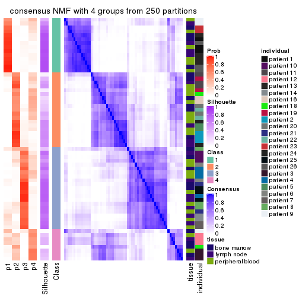</p>

</div>
<div id='tab-CV-NMF-consensus-heatmap-4'>
<pre><code class="r">consensus_heatmap(res, k = 5)
</code></pre>

<p>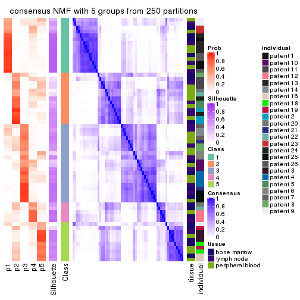</p>

</div>
<div id='tab-CV-NMF-consensus-heatmap-5'>
<pre><code class="r">consensus_heatmap(res, k = 6)
</code></pre>

<p>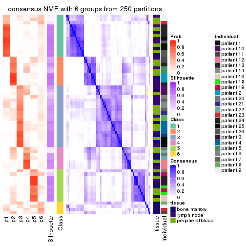</p>

</div>
</div>

Heatmaps for the membership of samples in all partitions to see how consistent they are:


<script>
$( function() {
	$( '#tabs-CV-NMF-membership-heatmap' ).tabs();
} );
</script>
<div id='tabs-CV-NMF-membership-heatmap'>
<ul>
<li><a href='#tab-CV-NMF-membership-heatmap-1'>k = 2</a></li>
<li><a href='#tab-CV-NMF-membership-heatmap-2'>k = 3</a></li>
<li><a href='#tab-CV-NMF-membership-heatmap-3'>k = 4</a></li>
<li><a href='#tab-CV-NMF-membership-heatmap-4'>k = 5</a></li>
<li><a href='#tab-CV-NMF-membership-heatmap-5'>k = 6</a></li>
</ul>
<div id='tab-CV-NMF-membership-heatmap-1'>
<pre><code class="r">membership_heatmap(res, k = 2)
</code></pre>

<p>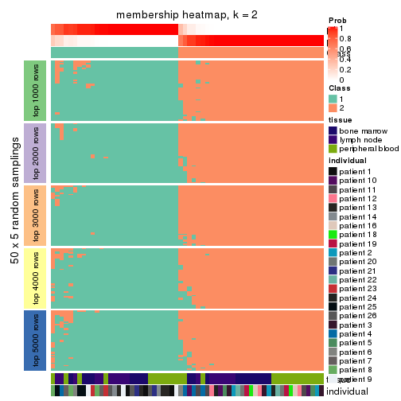</p>

</div>
<div id='tab-CV-NMF-membership-heatmap-2'>
<pre><code class="r">membership_heatmap(res, k = 3)
</code></pre>

<p>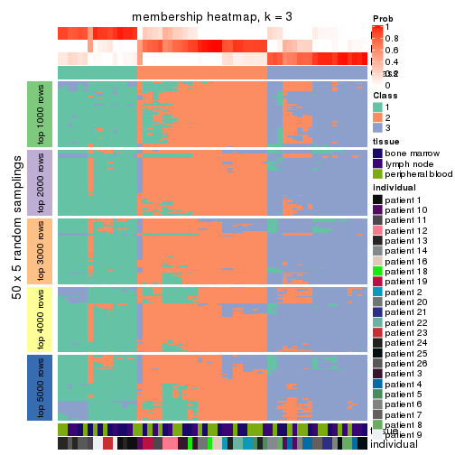</p>

</div>
<div id='tab-CV-NMF-membership-heatmap-3'>
<pre><code class="r">membership_heatmap(res, k = 4)
</code></pre>

<p>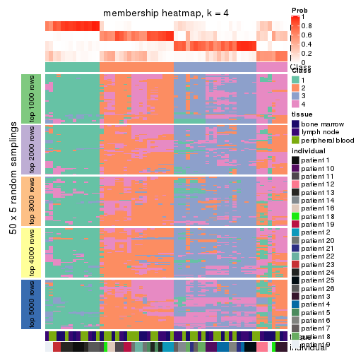</p>

</div>
<div id='tab-CV-NMF-membership-heatmap-4'>
<pre><code class="r">membership_heatmap(res, k = 5)
</code></pre>

<p>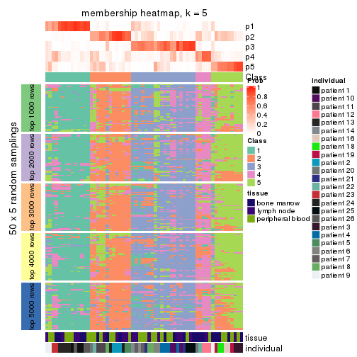</p>

</div>
<div id='tab-CV-NMF-membership-heatmap-5'>
<pre><code class="r">membership_heatmap(res, k = 6)
</code></pre>

<p>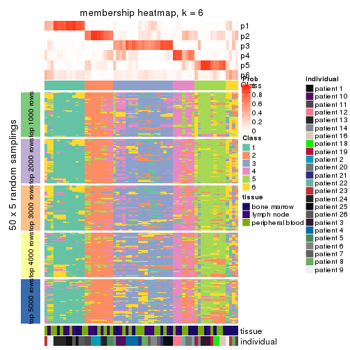</p>

</div>
</div>

As soon as we have had the classes for columns, we can look for signatures
which are significantly different between classes which can be candidate marks
for certain classes. Following are the heatmaps for signatures.


Signature heatmaps where rows are scaled:


<script>
$( function() {
	$( '#tabs-CV-NMF-get-signatures' ).tabs();
} );
</script>
<div id='tabs-CV-NMF-get-signatures'>
<ul>
<li><a href='#tab-CV-NMF-get-signatures-1'>k = 2</a></li>
<li><a href='#tab-CV-NMF-get-signatures-2'>k = 3</a></li>
<li><a href='#tab-CV-NMF-get-signatures-3'>k = 4</a></li>
<li><a href='#tab-CV-NMF-get-signatures-4'>k = 5</a></li>
<li><a href='#tab-CV-NMF-get-signatures-5'>k = 6</a></li>
</ul>
<div id='tab-CV-NMF-get-signatures-1'>
<pre><code class="r">get_signatures(res, k = 2)
</code></pre>

<p>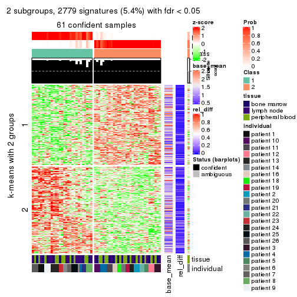</p>

</div>
<div id='tab-CV-NMF-get-signatures-2'>
<pre><code class="r">get_signatures(res, k = 3)
</code></pre>

<p>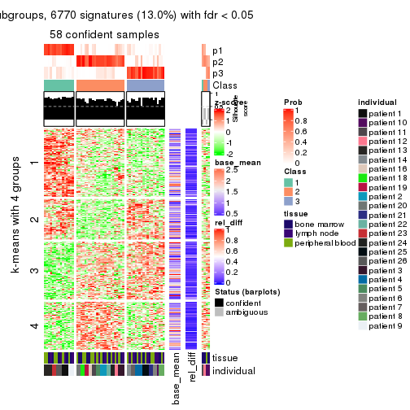</p>

</div>
<div id='tab-CV-NMF-get-signatures-3'>
<pre><code class="r">get_signatures(res, k = 4)
</code></pre>

<p>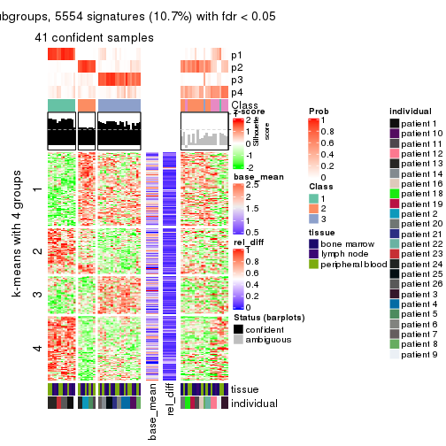</p>

</div>
<div id='tab-CV-NMF-get-signatures-4'>
<pre><code class="r">get_signatures(res, k = 5)
</code></pre>

<p>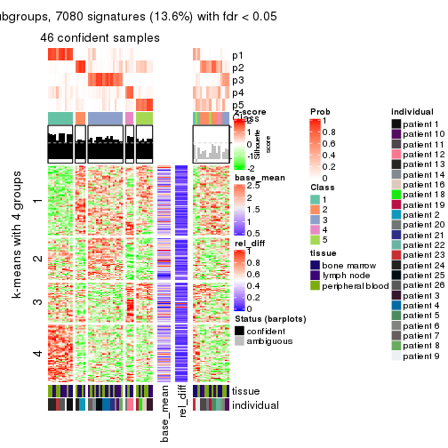</p>

</div>
<div id='tab-CV-NMF-get-signatures-5'>
<pre><code class="r">get_signatures(res, k = 6)
</code></pre>

<p>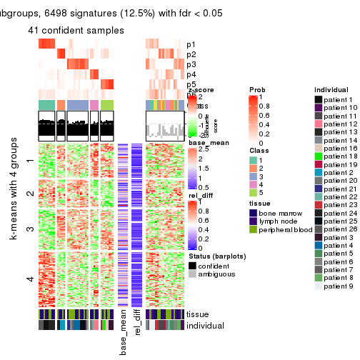</p>

</div>
</div>


Signature heatmaps where rows are not scaled:


<script>
$( function() {
	$( '#tabs-CV-NMF-get-signatures-no-scale' ).tabs();
} );
</script>
<div id='tabs-CV-NMF-get-signatures-no-scale'>
<ul>
<li><a href='#tab-CV-NMF-get-signatures-no-scale-1'>k = 2</a></li>
<li><a href='#tab-CV-NMF-get-signatures-no-scale-2'>k = 3</a></li>
<li><a href='#tab-CV-NMF-get-signatures-no-scale-3'>k = 4</a></li>
<li><a href='#tab-CV-NMF-get-signatures-no-scale-4'>k = 5</a></li>
<li><a href='#tab-CV-NMF-get-signatures-no-scale-5'>k = 6</a></li>
</ul>
<div id='tab-CV-NMF-get-signatures-no-scale-1'>
<pre><code class="r">get_signatures(res, k = 2, scale_rows = FALSE)
</code></pre>

<p>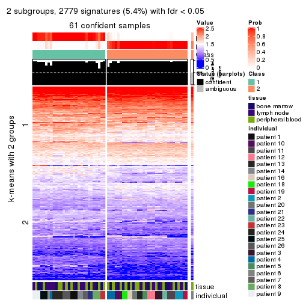</p>

</div>
<div id='tab-CV-NMF-get-signatures-no-scale-2'>
<pre><code class="r">get_signatures(res, k = 3, scale_rows = FALSE)
</code></pre>

<p>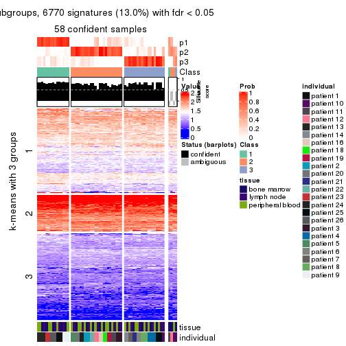</p>

</div>
<div id='tab-CV-NMF-get-signatures-no-scale-3'>
<pre><code class="r">get_signatures(res, k = 4, scale_rows = FALSE)
</code></pre>

<p>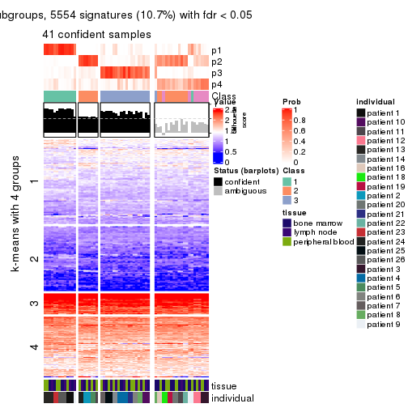</p>

</div>
<div id='tab-CV-NMF-get-signatures-no-scale-4'>
<pre><code class="r">get_signatures(res, k = 5, scale_rows = FALSE)
</code></pre>

<p>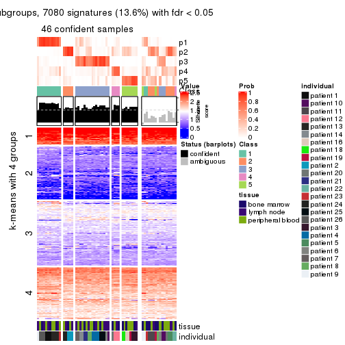</p>

</div>
<div id='tab-CV-NMF-get-signatures-no-scale-5'>
<pre><code class="r">get_signatures(res, k = 6, scale_rows = FALSE)
</code></pre>

<p>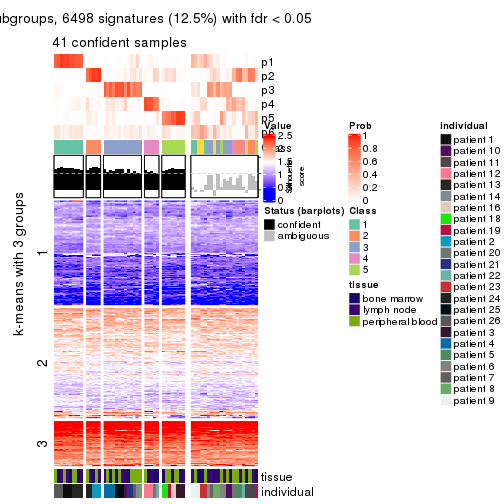</p>

</div>
</div>


Compare the overlap of signatures from different k:

```r
compare_signatures(res)
```

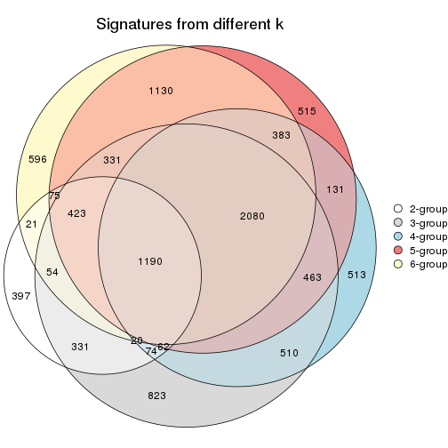

`get_signature()` returns a data frame invisibly. TO get the list of signatures, the function
call should be assigned to a variable explicitly. In following code, if `plot` argument is set
to `FALSE`, no heatmap is plotted while only the differential analysis is performed.

```r
# code only for demonstration
tb = get_signature(res, k = ..., plot = FALSE)
```

An example of the output of `tb` is:

```
#>   which_row         fdr    mean_1    mean_2 scaled_mean_1 scaled_mean_2 km
#> 1        38 0.042760348  8.373488  9.131774    -0.5533452     0.5164555  1
#> 2        40 0.018707592  7.106213  8.469186    -0.6173731     0.5762149  1
#> 3        55 0.019134737 10.221463 11.207825    -0.6159697     0.5749050  1
#> 4        59 0.006059896  5.921854  7.869574    -0.6899429     0.6439467  1
#> 5        60 0.018055526  8.928898 10.211722    -0.6204761     0.5791110  1
#> 6        98 0.009384629 15.714769 14.887706     0.6635654    -0.6193277  2
...
```

The columns in `tb` are:

1. `which_row`: row indices corresponding to the input matrix.
2. `fdr`: FDR for the differential test. 
3. `mean_x`: The mean value in group x.
4. `scaled_mean_x`: The mean value in group x after rows are scaled.
5. `km`: Row groups if k-means clustering is applied to rows.


UMAP plot which shows how samples are separated.


<script>
$( function() {
	$( '#tabs-CV-NMF-dimension-reduction' ).tabs();
} );
</script>
<div id='tabs-CV-NMF-dimension-reduction'>
<ul>
<li><a href='#tab-CV-NMF-dimension-reduction-1'>k = 2</a></li>
<li><a href='#tab-CV-NMF-dimension-reduction-2'>k = 3</a></li>
<li><a href='#tab-CV-NMF-dimension-reduction-3'>k = 4</a></li>
<li><a href='#tab-CV-NMF-dimension-reduction-4'>k = 5</a></li>
<li><a href='#tab-CV-NMF-dimension-reduction-5'>k = 6</a></li>
</ul>
<div id='tab-CV-NMF-dimension-reduction-1'>
<pre><code class="r">dimension_reduction(res, k = 2, method = &quot;UMAP&quot;)
</code></pre>

<p>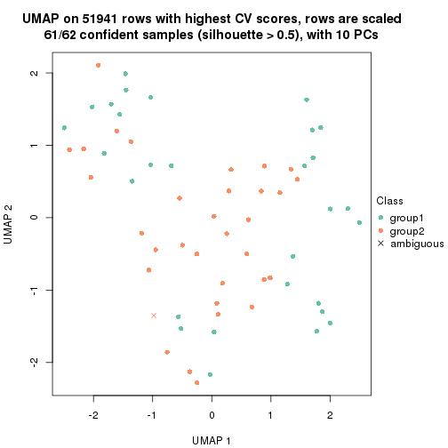</p>

</div>
<div id='tab-CV-NMF-dimension-reduction-2'>
<pre><code class="r">dimension_reduction(res, k = 3, method = &quot;UMAP&quot;)
</code></pre>

<p>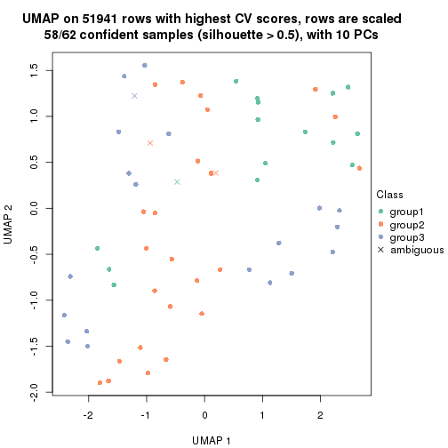</p>

</div>
<div id='tab-CV-NMF-dimension-reduction-3'>
<pre><code class="r">dimension_reduction(res, k = 4, method = &quot;UMAP&quot;)
</code></pre>

<p>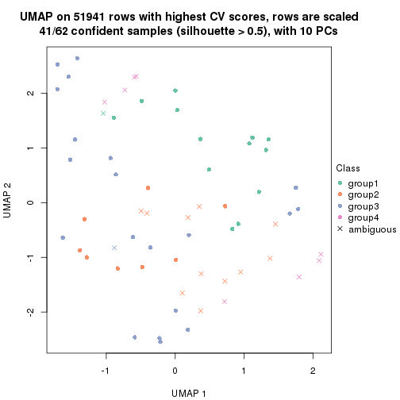</p>

</div>
<div id='tab-CV-NMF-dimension-reduction-4'>
<pre><code class="r">dimension_reduction(res, k = 5, method = &quot;UMAP&quot;)
</code></pre>

<p>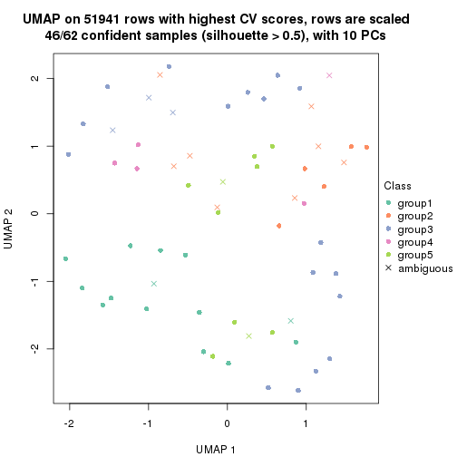</p>

</div>
<div id='tab-CV-NMF-dimension-reduction-5'>
<pre><code class="r">dimension_reduction(res, k = 6, method = &quot;UMAP&quot;)
</code></pre>

<p>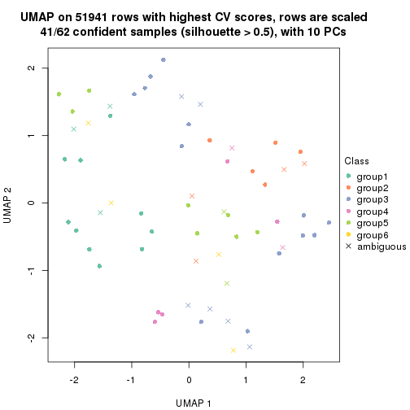</p>

</div>
</div>


Following heatmap shows how subgroups are split when increasing `k`:

```r
collect_classes(res)
```

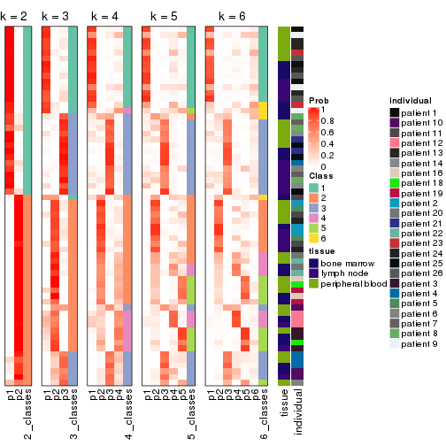


Test correlation between subgroups and known annotations. If the known
annotation is numeric, one-way ANOVA test is applied, and if the known
annotation is discrete, chi-squared contingency table test is applied.

```r
test_to_known_factors(res)
```

```
#>         n tissue(p) individual(p) k
#> CV:NMF 61     0.544      7.41e-05 2
#> CV:NMF 58     0.889      5.70e-08 3
#> CV:NMF 41     0.901      2.87e-06 4
#> CV:NMF 46     0.879      3.61e-10 5
#> CV:NMF 41     0.850      3.91e-09 6
```


If matrix rows can be associated to genes, consider to use `functional_enrichment(res,
...)` to perform function enrichment for the signature genes. See [this vignette](http://bioconductor.org/packages/devel/bioc/vignettes/cola/inst/doc/functional_enrichment.html) for more detailed explanations.


 

---------------------------------------------------


### MAD:hclust*


The object with results only for a single top-value method and a single partition method 
can be extracted as:

```r
res = res_list["MAD", "hclust"]
# you can also extract it by
# res = res_list["MAD:hclust"]
```

A summary of `res` and all the functions that can be applied to it:

```r
res
```

```
#> A 'ConsensusPartition' object with k = 2, 3, 4, 5, 6.
#>   On a matrix with 51941 rows and 62 columns.
#>   Top rows (1000, 2000, 3000, 4000, 5000) are extracted by 'MAD' method.
#>   Subgroups are detected by 'hclust' method.
#>   Performed in total 1250 partitions by row resampling.
#>   Best k for subgroups seems to be 6.
#> 
#> Following methods can be applied to this 'ConsensusPartition' object:
#>  [1] "cola_report"             "collect_classes"         "collect_plots"          
#>  [4] "collect_stats"           "colnames"                "compare_signatures"     
#>  [7] "consensus_heatmap"       "dimension_reduction"     "functional_enrichment"  
#> [10] "get_anno_col"            "get_anno"                "get_classes"            
#> [13] "get_consensus"           "get_matrix"              "get_membership"         
#> [16] "get_param"               "get_signatures"          "get_stats"              
#> [19] "is_best_k"               "is_stable_k"             "membership_heatmap"     
#> [22] "ncol"                    "nrow"                    "plot_ecdf"              
#> [25] "rownames"                "select_partition_number" "show"                   
#> [28] "suggest_best_k"          "test_to_known_factors"
```

`collect_plots()` function collects all the plots made from `res` for all `k` (number of partitions)
into one single page to provide an easy and fast comparison between different `k`.

```r
collect_plots(res)
```

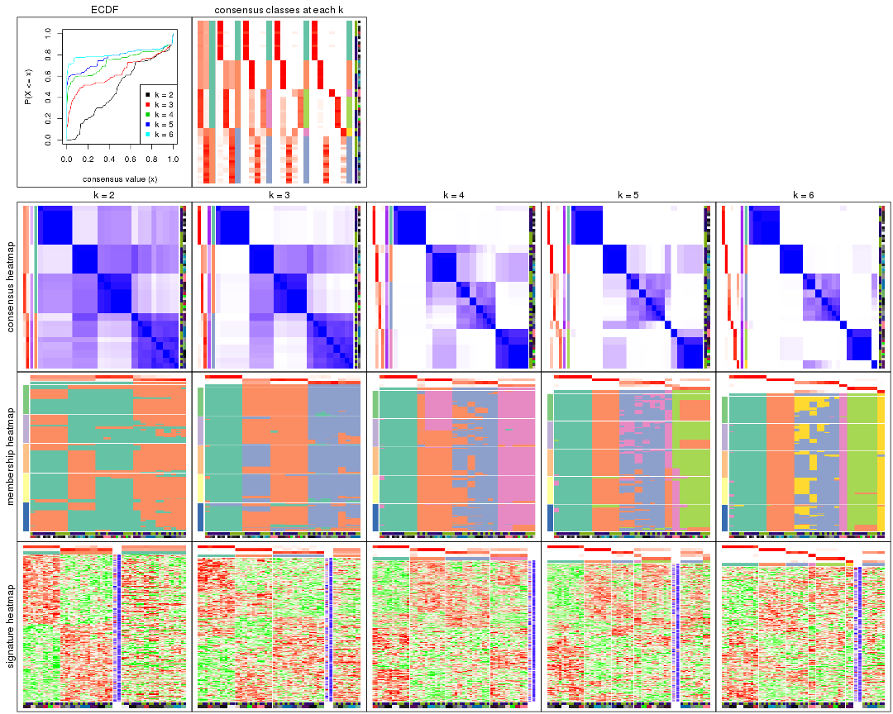

The plots are:

- The first row: a plot of the ECDF (empirical cumulative distribution
  function) curves of the consensus matrix for each `k` and the heatmap of
  predicted classes for each `k`.
- The second row: heatmaps of the consensus matrix for each `k`.
- The third row: heatmaps of the membership matrix for each `k`.
- The fouth row: heatmaps of the signatures for each `k`.

All the plots in panels can be made by individual functions and they are
plotted later in this section.

`select_partition_number()` produces several plots showing different
statistics for choosing "optimized" `k`. There are following statistics:

- ECDF curves of the consensus matrix for each `k`;
- 1-PAC. [The PAC
  score](https://en.wikipedia.org/wiki/Consensus_clustering#Over-interpretation_potential_of_consensus_clustering)
  measures the proportion of the ambiguous subgrouping.
- Mean silhouette score.
- Concordance. The mean probability of fiting the consensus class ids in all
  partitions.
- Area increased. Denote $A_k$ as the area under the ECDF curve for current
  `k`, the area increased is defined as $A_k - A_{k-1}$.
- Rand index. The percent of pairs of samples that are both in a same cluster
  or both are not in a same cluster in the partition of k and k-1.
- Jaccard index. The ratio of pairs of samples are both in a same cluster in
  the partition of k and k-1 and the pairs of samples are both in a same
  cluster in the partition k or k-1.

The detailed explanations of these statistics can be found in [the _cola_
vignette](http://bioconductor.org/packages/devel/bioc/vignettes/cola/inst/doc/cola.html#toc_13).

Generally speaking, lower PAC score, higher mean silhouette score or higher
concordance corresponds to better partition. Rand index and Jaccard index
measure how similar the current partition is compared to partition with `k-1`.
If they are too similar, we won't accept `k` is better than `k-1`.

```r
select_partition_number(res)
```

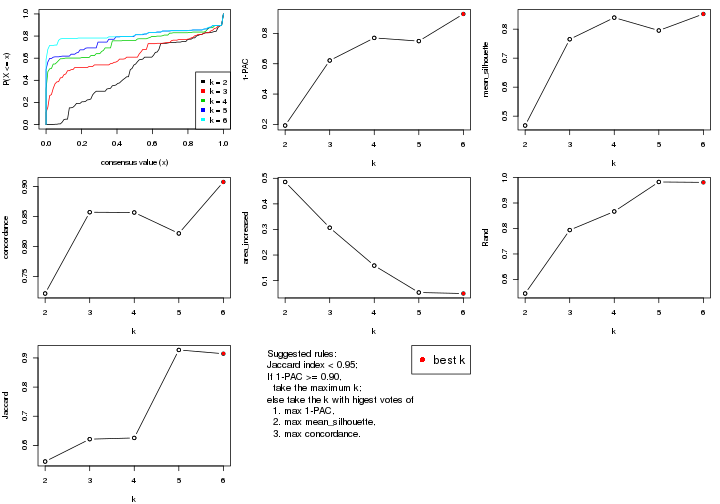

The numeric values for all these statistics can be obtained by `get_stats()`.

```r
get_stats(res)
```

```
#>   k 1-PAC mean_silhouette concordance area_increased  Rand Jaccard
#> 2 2 0.192           0.468       0.722         0.4856 0.545   0.545
#> 3 3 0.621           0.765       0.857         0.3068 0.794   0.621
#> 4 4 0.770           0.840       0.857         0.1587 0.867   0.626
#> 5 5 0.749           0.795       0.822         0.0536 0.983   0.927
#> 6 6 0.928           0.852       0.908         0.0495 0.981   0.914
```

`suggest_best_k()` suggests the best $k$ based on these statistics. The rules are as follows:

- All $k$ with Jaccard index larger than 0.95 are removed because increasing
  $k$ does not provide enough extra information. If all $k$ are removed, it is
  marked as no subgroup is detected.
- For all $k$ with 1-PAC score larger than 0.9, the maximal $k$ is taken as
  the best $k$, and other $k$ are marked as optional $k$.
- If it does not fit the second rule. The $k$ with the maximal vote of the
  highest 1-PAC score, highest mean silhouette, and highest concordance is
  taken as the best $k$.

```r
suggest_best_k(res)
```

```
#> [1] 6
```


Following shows the table of the partitions (You need to click the **show/hide
code output** link to see it). The membership matrix (columns with name `p*`)
is inferred by
[`clue::cl_consensus()`](https://www.rdocumentation.org/link/cl_consensus?package=clue)
function with the `SE` method. Basically the value in the membership matrix
represents the probability to belong to a certain group. The finall class
label for an item is determined with the group with highest probability it
belongs to.

In `get_classes()` function, the entropy is calculated from the membership
matrix and the silhouette score is calculated from the consensus matrix.


<script>
$( function() {
	$( '#tabs-MAD-hclust-get-classes' ).tabs();
} );
</script>
<div id='tabs-MAD-hclust-get-classes'>
<ul>
<li><a href='#tab-MAD-hclust-get-classes-1'>k = 2</a></li>
<li><a href='#tab-MAD-hclust-get-classes-2'>k = 3</a></li>
<li><a href='#tab-MAD-hclust-get-classes-3'>k = 4</a></li>
<li><a href='#tab-MAD-hclust-get-classes-4'>k = 5</a></li>
<li><a href='#tab-MAD-hclust-get-classes-5'>k = 6</a></li>
</ul>

<div id='tab-MAD-hclust-get-classes-1'>
<p><a id='tab-MAD-hclust-get-classes-1-a' style='color:#0366d6' href='#'>show/hide code output</a></p>
<pre><code class="r">cbind(get_classes(res, k = 2), get_membership(res, k = 2))
</code></pre>

<pre><code>#&gt;           class entropy silhouette    p1    p2
#&gt; GSM525314     1   0.988     0.3789 0.564 0.436
#&gt; GSM525315     1   0.994    -0.0465 0.544 0.456
#&gt; GSM525316     1   0.373     0.5248 0.928 0.072
#&gt; GSM525317     2   0.671     0.7910 0.176 0.824
#&gt; GSM525318     2   0.671     0.7910 0.176 0.824
#&gt; GSM525319     1   0.994    -0.0465 0.544 0.456
#&gt; GSM525320     2   0.634     0.8012 0.160 0.840
#&gt; GSM525321     2   0.184     0.7913 0.028 0.972
#&gt; GSM525322     2   0.456     0.8166 0.096 0.904
#&gt; GSM525323     1   0.988     0.3789 0.564 0.436
#&gt; GSM525324     2   0.921     0.5400 0.336 0.664
#&gt; GSM525325     1   0.456     0.5208 0.904 0.096
#&gt; GSM525326     1   0.311     0.5236 0.944 0.056
#&gt; GSM525327     1   0.988     0.3789 0.564 0.436
#&gt; GSM525328     1   0.988     0.3789 0.564 0.436
#&gt; GSM525329     2   0.118     0.7463 0.016 0.984
#&gt; GSM525330     1   0.456     0.5208 0.904 0.096
#&gt; GSM525331     1   0.456     0.5208 0.904 0.096
#&gt; GSM525332     1   0.456     0.5208 0.904 0.096
#&gt; GSM525333     1   0.993    -0.0384 0.548 0.452
#&gt; GSM525334     2   0.204     0.7998 0.032 0.968
#&gt; GSM525335     1   0.994    -0.0465 0.544 0.456
#&gt; GSM525336     1   0.971     0.3881 0.600 0.400
#&gt; GSM525337     1   0.994    -0.0465 0.544 0.456
#&gt; GSM525338     2   0.373     0.8176 0.072 0.928
#&gt; GSM525339     1   0.988     0.3789 0.564 0.436
#&gt; GSM525340     1   0.988     0.3789 0.564 0.436
#&gt; GSM525341     1   0.994    -0.0465 0.544 0.456
#&gt; GSM525342     1   0.373     0.5248 0.928 0.072
#&gt; GSM525343     2   0.671     0.7910 0.176 0.824
#&gt; GSM525344     2   0.456     0.8166 0.096 0.904
#&gt; GSM525345     1   0.988     0.3789 0.564 0.436
#&gt; GSM525346     2   0.921     0.5400 0.336 0.664
#&gt; GSM525347     1   0.456     0.5208 0.904 0.096
#&gt; GSM525348     1   0.311     0.5236 0.944 0.056
#&gt; GSM525349     1   0.988     0.3789 0.564 0.436
#&gt; GSM525350     1   0.456     0.5208 0.904 0.096
#&gt; GSM525351     1   0.456     0.5208 0.904 0.096
#&gt; GSM525352     1   0.456     0.5208 0.904 0.096
#&gt; GSM525353     1   0.993    -0.0384 0.548 0.452
#&gt; GSM525354     2   0.204     0.7998 0.032 0.968
#&gt; GSM525355     1   0.994    -0.0465 0.544 0.456
#&gt; GSM525356     1   0.971     0.3881 0.600 0.400
#&gt; GSM525357     2   0.373     0.8176 0.072 0.928
#&gt; GSM525358     1   0.988     0.3789 0.564 0.436
#&gt; GSM525359     1   0.988     0.3789 0.564 0.436
#&gt; GSM525360     1   0.994    -0.0465 0.544 0.456
#&gt; GSM525361     1   0.373     0.5248 0.928 0.072
#&gt; GSM525362     2   0.671     0.7910 0.176 0.824
#&gt; GSM525363     1   0.994    -0.0465 0.544 0.456
#&gt; GSM525364     2   0.634     0.8012 0.160 0.840
#&gt; GSM525365     2   0.184     0.7913 0.028 0.972
#&gt; GSM525366     2   0.456     0.8166 0.096 0.904
#&gt; GSM525367     1   0.988     0.3789 0.564 0.436
#&gt; GSM525368     2   0.921     0.5400 0.336 0.664
#&gt; GSM525369     1   0.456     0.5208 0.904 0.096
#&gt; GSM525370     1   0.311     0.5236 0.944 0.056
#&gt; GSM525371     1   0.988     0.3789 0.564 0.436
#&gt; GSM525372     2   0.118     0.7463 0.016 0.984
#&gt; GSM525373     1   0.994    -0.0465 0.544 0.456
#&gt; GSM525374     2   0.373     0.8176 0.072 0.928
#&gt; GSM525375     1   0.988     0.3789 0.564 0.436
</code></pre>

<script>
$('#tab-MAD-hclust-get-classes-1-a').parent().next().next().hide();
$('#tab-MAD-hclust-get-classes-1-a').click(function(){
  $('#tab-MAD-hclust-get-classes-1-a').parent().next().next().toggle();
  return(false);
});
</script>
</div>

<div id='tab-MAD-hclust-get-classes-2'>
<p><a id='tab-MAD-hclust-get-classes-2-a' style='color:#0366d6' href='#'>show/hide code output</a></p>
<pre><code class="r">cbind(get_classes(res, k = 3), get_membership(res, k = 3))
</code></pre>

<pre><code>#&gt;           class entropy silhouette    p1    p2    p3
#&gt; GSM525314     1  0.0000      0.989 1.000 0.000 0.000
#&gt; GSM525315     2  0.6260      0.444 0.000 0.552 0.448
#&gt; GSM525316     2  0.0892      0.723 0.020 0.980 0.000
#&gt; GSM525317     3  0.5136      0.826 0.044 0.132 0.824
#&gt; GSM525318     3  0.5136      0.826 0.044 0.132 0.824
#&gt; GSM525319     2  0.6260      0.444 0.000 0.552 0.448
#&gt; GSM525320     3  0.5036      0.835 0.048 0.120 0.832
#&gt; GSM525321     3  0.3459      0.843 0.096 0.012 0.892
#&gt; GSM525322     3  0.0661      0.845 0.008 0.004 0.988
#&gt; GSM525323     1  0.0000      0.989 1.000 0.000 0.000
#&gt; GSM525324     3  0.5178      0.593 0.000 0.256 0.744
#&gt; GSM525325     2  0.2031      0.738 0.016 0.952 0.032
#&gt; GSM525326     2  0.1411      0.716 0.036 0.964 0.000
#&gt; GSM525327     1  0.0000      0.989 1.000 0.000 0.000
#&gt; GSM525328     1  0.0000      0.989 1.000 0.000 0.000
#&gt; GSM525329     3  0.3340      0.822 0.120 0.000 0.880
#&gt; GSM525330     2  0.2031      0.738 0.016 0.952 0.032
#&gt; GSM525331     2  0.2031      0.738 0.016 0.952 0.032
#&gt; GSM525332     2  0.2031      0.738 0.016 0.952 0.032
#&gt; GSM525333     2  0.6252      0.449 0.000 0.556 0.444
#&gt; GSM525334     3  0.2356      0.849 0.072 0.000 0.928
#&gt; GSM525335     2  0.6260      0.444 0.000 0.552 0.448
#&gt; GSM525336     1  0.2448      0.925 0.924 0.076 0.000
#&gt; GSM525337     2  0.6260      0.444 0.000 0.552 0.448
#&gt; GSM525338     3  0.3947      0.856 0.076 0.040 0.884
#&gt; GSM525339     1  0.0000      0.989 1.000 0.000 0.000
#&gt; GSM525340     1  0.0000      0.989 1.000 0.000 0.000
#&gt; GSM525341     2  0.6260      0.444 0.000 0.552 0.448
#&gt; GSM525342     2  0.0892      0.723 0.020 0.980 0.000
#&gt; GSM525343     3  0.5136      0.826 0.044 0.132 0.824
#&gt; GSM525344     3  0.0661      0.845 0.008 0.004 0.988
#&gt; GSM525345     1  0.0000      0.989 1.000 0.000 0.000
#&gt; GSM525346     3  0.5178      0.593 0.000 0.256 0.744
#&gt; GSM525347     2  0.2031      0.738 0.016 0.952 0.032
#&gt; GSM525348     2  0.1411      0.716 0.036 0.964 0.000
#&gt; GSM525349     1  0.0000      0.989 1.000 0.000 0.000
#&gt; GSM525350     2  0.2031      0.738 0.016 0.952 0.032
#&gt; GSM525351     2  0.2031      0.738 0.016 0.952 0.032
#&gt; GSM525352     2  0.2031      0.738 0.016 0.952 0.032
#&gt; GSM525353     2  0.6252      0.449 0.000 0.556 0.444
#&gt; GSM525354     3  0.2356      0.849 0.072 0.000 0.928
#&gt; GSM525355     2  0.6260      0.444 0.000 0.552 0.448
#&gt; GSM525356     1  0.2448      0.925 0.924 0.076 0.000
#&gt; GSM525357     3  0.3947      0.856 0.076 0.040 0.884
#&gt; GSM525358     1  0.0000      0.989 1.000 0.000 0.000
#&gt; GSM525359     1  0.0000      0.989 1.000 0.000 0.000
#&gt; GSM525360     2  0.6260      0.444 0.000 0.552 0.448
#&gt; GSM525361     2  0.0892      0.723 0.020 0.980 0.000
#&gt; GSM525362     3  0.5136      0.826 0.044 0.132 0.824
#&gt; GSM525363     2  0.6260      0.444 0.000 0.552 0.448
#&gt; GSM525364     3  0.5036      0.835 0.048 0.120 0.832
#&gt; GSM525365     3  0.3459      0.843 0.096 0.012 0.892
#&gt; GSM525366     3  0.0661      0.845 0.008 0.004 0.988
#&gt; GSM525367     1  0.0000      0.989 1.000 0.000 0.000
#&gt; GSM525368     3  0.5178      0.593 0.000 0.256 0.744
#&gt; GSM525369     2  0.2031      0.738 0.016 0.952 0.032
#&gt; GSM525370     2  0.1411      0.716 0.036 0.964 0.000
#&gt; GSM525371     1  0.0000      0.989 1.000 0.000 0.000
#&gt; GSM525372     3  0.3340      0.822 0.120 0.000 0.880
#&gt; GSM525373     2  0.6260      0.444 0.000 0.552 0.448
#&gt; GSM525374     3  0.3947      0.856 0.076 0.040 0.884
#&gt; GSM525375     1  0.0000      0.989 1.000 0.000 0.000
</code></pre>

<script>
$('#tab-MAD-hclust-get-classes-2-a').parent().next().next().hide();
$('#tab-MAD-hclust-get-classes-2-a').click(function(){
  $('#tab-MAD-hclust-get-classes-2-a').parent().next().next().toggle();
  return(false);
});
</script>
</div>

<div id='tab-MAD-hclust-get-classes-3'>
<p><a id='tab-MAD-hclust-get-classes-3-a' style='color:#0366d6' href='#'>show/hide code output</a></p>
<pre><code class="r">cbind(get_classes(res, k = 4), get_membership(res, k = 4))
</code></pre>

<pre><code>#&gt;           class entropy silhouette    p1    p2    p3    p4
#&gt; GSM525314     1  0.0188      0.987 0.996 0.000 0.004 0.000
#&gt; GSM525315     2  0.0000      0.888 0.000 1.000 0.000 0.000
#&gt; GSM525316     4  0.4431      0.935 0.000 0.304 0.000 0.696
#&gt; GSM525317     3  0.6523      0.574 0.004 0.332 0.584 0.080
#&gt; GSM525318     3  0.6523      0.574 0.004 0.332 0.584 0.080
#&gt; GSM525319     2  0.0000      0.888 0.000 1.000 0.000 0.000
#&gt; GSM525320     3  0.6621      0.578 0.004 0.316 0.588 0.092
#&gt; GSM525321     3  0.1484      0.755 0.004 0.020 0.960 0.016
#&gt; GSM525322     3  0.6192      0.591 0.000 0.244 0.652 0.104
#&gt; GSM525323     1  0.0188      0.987 0.996 0.000 0.004 0.000
#&gt; GSM525324     2  0.5855      0.520 0.000 0.692 0.100 0.208
#&gt; GSM525325     4  0.4730      0.954 0.000 0.364 0.000 0.636
#&gt; GSM525326     4  0.4869      0.911 0.012 0.276 0.004 0.708
#&gt; GSM525327     1  0.0188      0.987 0.996 0.000 0.004 0.000
#&gt; GSM525328     1  0.0188      0.987 0.996 0.000 0.004 0.000
#&gt; GSM525329     3  0.2125      0.735 0.004 0.000 0.920 0.076
#&gt; GSM525330     4  0.4730      0.954 0.000 0.364 0.000 0.636
#&gt; GSM525331     4  0.4730      0.954 0.000 0.364 0.000 0.636
#&gt; GSM525332     4  0.4730      0.954 0.000 0.364 0.000 0.636
#&gt; GSM525333     2  0.0188      0.883 0.000 0.996 0.000 0.004
#&gt; GSM525334     3  0.3016      0.750 0.004 0.040 0.896 0.060
#&gt; GSM525335     2  0.0000      0.888 0.000 1.000 0.000 0.000
#&gt; GSM525336     1  0.2311      0.913 0.916 0.004 0.004 0.076
#&gt; GSM525337     2  0.0000      0.888 0.000 1.000 0.000 0.000
#&gt; GSM525338     3  0.2699      0.756 0.000 0.068 0.904 0.028
#&gt; GSM525339     1  0.0188      0.987 0.996 0.000 0.004 0.000
#&gt; GSM525340     1  0.0188      0.987 0.996 0.000 0.004 0.000
#&gt; GSM525341     2  0.0000      0.888 0.000 1.000 0.000 0.000
#&gt; GSM525342     4  0.4431      0.935 0.000 0.304 0.000 0.696
#&gt; GSM525343     3  0.6523      0.574 0.004 0.332 0.584 0.080
#&gt; GSM525344     3  0.6192      0.591 0.000 0.244 0.652 0.104
#&gt; GSM525345     1  0.0188      0.987 0.996 0.000 0.004 0.000
#&gt; GSM525346     2  0.5855      0.520 0.000 0.692 0.100 0.208
#&gt; GSM525347     4  0.4730      0.954 0.000 0.364 0.000 0.636
#&gt; GSM525348     4  0.4869      0.911 0.012 0.276 0.004 0.708
#&gt; GSM525349     1  0.0188      0.987 0.996 0.000 0.004 0.000
#&gt; GSM525350     4  0.4730      0.954 0.000 0.364 0.000 0.636
#&gt; GSM525351     4  0.4730      0.954 0.000 0.364 0.000 0.636
#&gt; GSM525352     4  0.4730      0.954 0.000 0.364 0.000 0.636
#&gt; GSM525353     2  0.0188      0.883 0.000 0.996 0.000 0.004
#&gt; GSM525354     3  0.3016      0.750 0.004 0.040 0.896 0.060
#&gt; GSM525355     2  0.0000      0.888 0.000 1.000 0.000 0.000
#&gt; GSM525356     1  0.2311      0.913 0.916 0.004 0.004 0.076
#&gt; GSM525357     3  0.2699      0.756 0.000 0.068 0.904 0.028
#&gt; GSM525358     1  0.0188      0.987 0.996 0.000 0.004 0.000
#&gt; GSM525359     1  0.0188      0.987 0.996 0.000 0.004 0.000
#&gt; GSM525360     2  0.0000      0.888 0.000 1.000 0.000 0.000
#&gt; GSM525361     4  0.4431      0.935 0.000 0.304 0.000 0.696
#&gt; GSM525362     3  0.6523      0.574 0.004 0.332 0.584 0.080
#&gt; GSM525363     2  0.0000      0.888 0.000 1.000 0.000 0.000
#&gt; GSM525364     3  0.6621      0.578 0.004 0.316 0.588 0.092
#&gt; GSM525365     3  0.1484      0.755 0.004 0.020 0.960 0.016
#&gt; GSM525366     3  0.6192      0.591 0.000 0.244 0.652 0.104
#&gt; GSM525367     1  0.0188      0.987 0.996 0.000 0.004 0.000
#&gt; GSM525368     2  0.5855      0.520 0.000 0.692 0.100 0.208
#&gt; GSM525369     4  0.4730      0.954 0.000 0.364 0.000 0.636
#&gt; GSM525370     4  0.4869      0.911 0.012 0.276 0.004 0.708
#&gt; GSM525371     1  0.0188      0.987 0.996 0.000 0.004 0.000
#&gt; GSM525372     3  0.2125      0.735 0.004 0.000 0.920 0.076
#&gt; GSM525373     2  0.0000      0.888 0.000 1.000 0.000 0.000
#&gt; GSM525374     3  0.2699      0.756 0.000 0.068 0.904 0.028
#&gt; GSM525375     1  0.0188      0.987 0.996 0.000 0.004 0.000
</code></pre>

<script>
$('#tab-MAD-hclust-get-classes-3-a').parent().next().next().hide();
$('#tab-MAD-hclust-get-classes-3-a').click(function(){
  $('#tab-MAD-hclust-get-classes-3-a').parent().next().next().toggle();
  return(false);
});
</script>
</div>

<div id='tab-MAD-hclust-get-classes-4'>
<p><a id='tab-MAD-hclust-get-classes-4-a' style='color:#0366d6' href='#'>show/hide code output</a></p>
<pre><code class="r">cbind(get_classes(res, k = 5), get_membership(res, k = 5))
</code></pre>

<pre><code>#&gt;           class entropy silhouette    p1    p2    p3    p4    p5
#&gt; GSM525314     1  0.0000      0.988 1.000 0.000 0.000 0.000 0.000
#&gt; GSM525315     2  0.0000      0.998 0.000 1.000 0.000 0.000 0.000
#&gt; GSM525316     5  0.3551      0.802 0.000 0.220 0.000 0.008 0.772
#&gt; GSM525317     3  0.6298      0.399 0.000 0.188 0.520 0.292 0.000
#&gt; GSM525318     3  0.6298      0.399 0.000 0.188 0.520 0.292 0.000
#&gt; GSM525319     2  0.0000      0.998 0.000 1.000 0.000 0.000 0.000
#&gt; GSM525320     3  0.6233      0.384 0.000 0.168 0.520 0.312 0.000
#&gt; GSM525321     3  0.1410      0.692 0.000 0.000 0.940 0.060 0.000
#&gt; GSM525322     3  0.5322      0.447 0.000 0.140 0.672 0.188 0.000
#&gt; GSM525323     1  0.0000      0.988 1.000 0.000 0.000 0.000 0.000
#&gt; GSM525324     4  0.4697      1.000 0.000 0.388 0.020 0.592 0.000
#&gt; GSM525325     5  0.3707      0.822 0.000 0.284 0.000 0.000 0.716
#&gt; GSM525326     5  0.4150      0.331 0.000 0.000 0.000 0.388 0.612
#&gt; GSM525327     1  0.0000      0.988 1.000 0.000 0.000 0.000 0.000
#&gt; GSM525328     1  0.0000      0.988 1.000 0.000 0.000 0.000 0.000
#&gt; GSM525329     3  0.0609      0.672 0.000 0.000 0.980 0.020 0.000
#&gt; GSM525330     5  0.3707      0.822 0.000 0.284 0.000 0.000 0.716
#&gt; GSM525331     5  0.3707      0.822 0.000 0.284 0.000 0.000 0.716
#&gt; GSM525332     5  0.3707      0.822 0.000 0.284 0.000 0.000 0.716
#&gt; GSM525333     2  0.0162      0.992 0.000 0.996 0.000 0.000 0.004
#&gt; GSM525334     3  0.1281      0.684 0.000 0.032 0.956 0.012 0.000
#&gt; GSM525335     2  0.0000      0.998 0.000 1.000 0.000 0.000 0.000
#&gt; GSM525336     1  0.2017      0.921 0.912 0.000 0.000 0.080 0.008
#&gt; GSM525337     2  0.0000      0.998 0.000 1.000 0.000 0.000 0.000
#&gt; GSM525338     3  0.3061      0.683 0.000 0.020 0.844 0.136 0.000
#&gt; GSM525339     1  0.0000      0.988 1.000 0.000 0.000 0.000 0.000
#&gt; GSM525340     1  0.0000      0.988 1.000 0.000 0.000 0.000 0.000
#&gt; GSM525341     2  0.0000      0.998 0.000 1.000 0.000 0.000 0.000
#&gt; GSM525342     5  0.3551      0.802 0.000 0.220 0.000 0.008 0.772
#&gt; GSM525343     3  0.6298      0.399 0.000 0.188 0.520 0.292 0.000
#&gt; GSM525344     3  0.5322      0.447 0.000 0.140 0.672 0.188 0.000
#&gt; GSM525345     1  0.0000      0.988 1.000 0.000 0.000 0.000 0.000
#&gt; GSM525346     4  0.4697      1.000 0.000 0.388 0.020 0.592 0.000
#&gt; GSM525347     5  0.3707      0.822 0.000 0.284 0.000 0.000 0.716
#&gt; GSM525348     5  0.4150      0.331 0.000 0.000 0.000 0.388 0.612
#&gt; GSM525349     1  0.0000      0.988 1.000 0.000 0.000 0.000 0.000
#&gt; GSM525350     5  0.3707      0.822 0.000 0.284 0.000 0.000 0.716
#&gt; GSM525351     5  0.3707      0.822 0.000 0.284 0.000 0.000 0.716
#&gt; GSM525352     5  0.3707      0.822 0.000 0.284 0.000 0.000 0.716
#&gt; GSM525353     2  0.0162      0.992 0.000 0.996 0.000 0.000 0.004
#&gt; GSM525354     3  0.1281      0.684 0.000 0.032 0.956 0.012 0.000
#&gt; GSM525355     2  0.0000      0.998 0.000 1.000 0.000 0.000 0.000
#&gt; GSM525356     1  0.2017      0.921 0.912 0.000 0.000 0.080 0.008
#&gt; GSM525357     3  0.3061      0.683 0.000 0.020 0.844 0.136 0.000
#&gt; GSM525358     1  0.0000      0.988 1.000 0.000 0.000 0.000 0.000
#&gt; GSM525359     1  0.0000      0.988 1.000 0.000 0.000 0.000 0.000
#&gt; GSM525360     2  0.0000      0.998 0.000 1.000 0.000 0.000 0.000
#&gt; GSM525361     5  0.3551      0.802 0.000 0.220 0.000 0.008 0.772
#&gt; GSM525362     3  0.6298      0.399 0.000 0.188 0.520 0.292 0.000
#&gt; GSM525363     2  0.0000      0.998 0.000 1.000 0.000 0.000 0.000
#&gt; GSM525364     3  0.6233      0.384 0.000 0.168 0.520 0.312 0.000
#&gt; GSM525365     3  0.1410      0.692 0.000 0.000 0.940 0.060 0.000
#&gt; GSM525366     3  0.5322      0.447 0.000 0.140 0.672 0.188 0.000
#&gt; GSM525367     1  0.0000      0.988 1.000 0.000 0.000 0.000 0.000
#&gt; GSM525368     4  0.4697      1.000 0.000 0.388 0.020 0.592 0.000
#&gt; GSM525369     5  0.3707      0.822 0.000 0.284 0.000 0.000 0.716
#&gt; GSM525370     5  0.4150      0.331 0.000 0.000 0.000 0.388 0.612
#&gt; GSM525371     1  0.0000      0.988 1.000 0.000 0.000 0.000 0.000
#&gt; GSM525372     3  0.0609      0.672 0.000 0.000 0.980 0.020 0.000
#&gt; GSM525373     2  0.0000      0.998 0.000 1.000 0.000 0.000 0.000
#&gt; GSM525374     3  0.3061      0.683 0.000 0.020 0.844 0.136 0.000
#&gt; GSM525375     1  0.0000      0.988 1.000 0.000 0.000 0.000 0.000
</code></pre>

<script>
$('#tab-MAD-hclust-get-classes-4-a').parent().next().next().hide();
$('#tab-MAD-hclust-get-classes-4-a').click(function(){
  $('#tab-MAD-hclust-get-classes-4-a').parent().next().next().toggle();
  return(false);
});
</script>
</div>

<div id='tab-MAD-hclust-get-classes-5'>
<p><a id='tab-MAD-hclust-get-classes-5-a' style='color:#0366d6' href='#'>show/hide code output</a></p>
<pre><code class="r">cbind(get_classes(res, k = 6), get_membership(res, k = 6))
</code></pre>

<pre><code>#&gt;           class entropy silhouette    p1    p2    p3    p4    p5    p6
#&gt; GSM525314     1  0.0000      0.985 1.000 0.000 0.000 0.000 0.000 0.000
#&gt; GSM525315     2  0.0000      0.998 0.000 1.000 0.000 0.000 0.000 0.000
#&gt; GSM525316     5  0.0000      0.932 0.000 0.000 0.000 0.000 1.000 0.000
#&gt; GSM525317     3  0.4258      0.402 0.000 0.016 0.516 0.000 0.000 0.468
#&gt; GSM525318     3  0.4258      0.402 0.000 0.016 0.516 0.000 0.000 0.468
#&gt; GSM525319     2  0.0000      0.998 0.000 1.000 0.000 0.000 0.000 0.000
#&gt; GSM525320     3  0.3995      0.366 0.000 0.004 0.516 0.000 0.000 0.480
#&gt; GSM525321     3  0.1327      0.683 0.000 0.000 0.936 0.000 0.000 0.064
#&gt; GSM525322     3  0.3668      0.428 0.000 0.004 0.668 0.000 0.000 0.328
#&gt; GSM525323     1  0.0000      0.985 1.000 0.000 0.000 0.000 0.000 0.000
#&gt; GSM525324     6  0.0717      1.000 0.000 0.008 0.016 0.000 0.000 0.976
#&gt; GSM525325     5  0.1327      0.978 0.000 0.064 0.000 0.000 0.936 0.000
#&gt; GSM525326     4  0.0146      1.000 0.000 0.000 0.000 0.996 0.004 0.000
#&gt; GSM525327     1  0.0260      0.983 0.992 0.000 0.000 0.000 0.000 0.008
#&gt; GSM525328     1  0.0260      0.983 0.992 0.000 0.000 0.000 0.000 0.008
#&gt; GSM525329     3  0.0603      0.661 0.000 0.000 0.980 0.004 0.000 0.016
#&gt; GSM525330     5  0.1327      0.978 0.000 0.064 0.000 0.000 0.936 0.000
#&gt; GSM525331     5  0.1327      0.978 0.000 0.064 0.000 0.000 0.936 0.000
#&gt; GSM525332     5  0.1327      0.978 0.000 0.064 0.000 0.000 0.936 0.000
#&gt; GSM525333     2  0.0260      0.990 0.000 0.992 0.000 0.000 0.008 0.000
#&gt; GSM525334     3  0.1074      0.673 0.000 0.012 0.960 0.000 0.000 0.028
#&gt; GSM525335     2  0.0000      0.998 0.000 1.000 0.000 0.000 0.000 0.000
#&gt; GSM525336     1  0.1806      0.910 0.908 0.000 0.000 0.088 0.000 0.004
#&gt; GSM525337     2  0.0000      0.998 0.000 1.000 0.000 0.000 0.000 0.000
#&gt; GSM525338     3  0.2558      0.672 0.000 0.004 0.840 0.000 0.000 0.156
#&gt; GSM525339     1  0.0000      0.985 1.000 0.000 0.000 0.000 0.000 0.000
#&gt; GSM525340     1  0.0000      0.985 1.000 0.000 0.000 0.000 0.000 0.000
#&gt; GSM525341     2  0.0000      0.998 0.000 1.000 0.000 0.000 0.000 0.000
#&gt; GSM525342     5  0.0000      0.932 0.000 0.000 0.000 0.000 1.000 0.000
#&gt; GSM525343     3  0.4258      0.402 0.000 0.016 0.516 0.000 0.000 0.468
#&gt; GSM525344     3  0.3668      0.428 0.000 0.004 0.668 0.000 0.000 0.328
#&gt; GSM525345     1  0.0000      0.985 1.000 0.000 0.000 0.000 0.000 0.000
#&gt; GSM525346     6  0.0717      1.000 0.000 0.008 0.016 0.000 0.000 0.976
#&gt; GSM525347     5  0.1327      0.978 0.000 0.064 0.000 0.000 0.936 0.000
#&gt; GSM525348     4  0.0146      1.000 0.000 0.000 0.000 0.996 0.004 0.000
#&gt; GSM525349     1  0.0260      0.983 0.992 0.000 0.000 0.000 0.000 0.008
#&gt; GSM525350     5  0.1327      0.978 0.000 0.064 0.000 0.000 0.936 0.000
#&gt; GSM525351     5  0.1327      0.978 0.000 0.064 0.000 0.000 0.936 0.000
#&gt; GSM525352     5  0.1327      0.978 0.000 0.064 0.000 0.000 0.936 0.000
#&gt; GSM525353     2  0.0260      0.990 0.000 0.992 0.000 0.000 0.008 0.000
#&gt; GSM525354     3  0.1074      0.673 0.000 0.012 0.960 0.000 0.000 0.028
#&gt; GSM525355     2  0.0000      0.998 0.000 1.000 0.000 0.000 0.000 0.000
#&gt; GSM525356     1  0.1806      0.910 0.908 0.000 0.000 0.088 0.000 0.004
#&gt; GSM525357     3  0.2558      0.672 0.000 0.004 0.840 0.000 0.000 0.156
#&gt; GSM525358     1  0.0000      0.985 1.000 0.000 0.000 0.000 0.000 0.000
#&gt; GSM525359     1  0.0000      0.985 1.000 0.000 0.000 0.000 0.000 0.000
#&gt; GSM525360     2  0.0000      0.998 0.000 1.000 0.000 0.000 0.000 0.000
#&gt; GSM525361     5  0.0000      0.932 0.000 0.000 0.000 0.000 1.000 0.000
#&gt; GSM525362     3  0.4258      0.402 0.000 0.016 0.516 0.000 0.000 0.468
#&gt; GSM525363     2  0.0000      0.998 0.000 1.000 0.000 0.000 0.000 0.000
#&gt; GSM525364     3  0.3995      0.366 0.000 0.004 0.516 0.000 0.000 0.480
#&gt; GSM525365     3  0.1327      0.683 0.000 0.000 0.936 0.000 0.000 0.064
#&gt; GSM525366     3  0.3668      0.428 0.000 0.004 0.668 0.000 0.000 0.328
#&gt; GSM525367     1  0.0000      0.985 1.000 0.000 0.000 0.000 0.000 0.000
#&gt; GSM525368     6  0.0717      1.000 0.000 0.008 0.016 0.000 0.000 0.976
#&gt; GSM525369     5  0.1327      0.978 0.000 0.064 0.000 0.000 0.936 0.000
#&gt; GSM525370     4  0.0146      1.000 0.000 0.000 0.000 0.996 0.004 0.000
#&gt; GSM525371     1  0.0260      0.983 0.992 0.000 0.000 0.000 0.000 0.008
#&gt; GSM525372     3  0.0603      0.661 0.000 0.000 0.980 0.004 0.000 0.016
#&gt; GSM525373     2  0.0000      0.998 0.000 1.000 0.000 0.000 0.000 0.000
#&gt; GSM525374     3  0.2558      0.672 0.000 0.004 0.840 0.000 0.000 0.156
#&gt; GSM525375     1  0.0000      0.985 1.000 0.000 0.000 0.000 0.000 0.000
</code></pre>

<script>
$('#tab-MAD-hclust-get-classes-5-a').parent().next().next().hide();
$('#tab-MAD-hclust-get-classes-5-a').click(function(){
  $('#tab-MAD-hclust-get-classes-5-a').parent().next().next().toggle();
  return(false);
});
</script>
</div>
</div>

Heatmaps for the consensus matrix. It visualizes the probability of two
samples to be in a same group.


<script>
$( function() {
	$( '#tabs-MAD-hclust-consensus-heatmap' ).tabs();
} );
</script>
<div id='tabs-MAD-hclust-consensus-heatmap'>
<ul>
<li><a href='#tab-MAD-hclust-consensus-heatmap-1'>k = 2</a></li>
<li><a href='#tab-MAD-hclust-consensus-heatmap-2'>k = 3</a></li>
<li><a href='#tab-MAD-hclust-consensus-heatmap-3'>k = 4</a></li>
<li><a href='#tab-MAD-hclust-consensus-heatmap-4'>k = 5</a></li>
<li><a href='#tab-MAD-hclust-consensus-heatmap-5'>k = 6</a></li>
</ul>
<div id='tab-MAD-hclust-consensus-heatmap-1'>
<pre><code class="r">consensus_heatmap(res, k = 2)
</code></pre>

<p>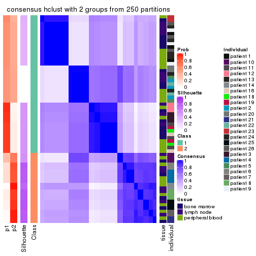</p>

</div>
<div id='tab-MAD-hclust-consensus-heatmap-2'>
<pre><code class="r">consensus_heatmap(res, k = 3)
</code></pre>

<p>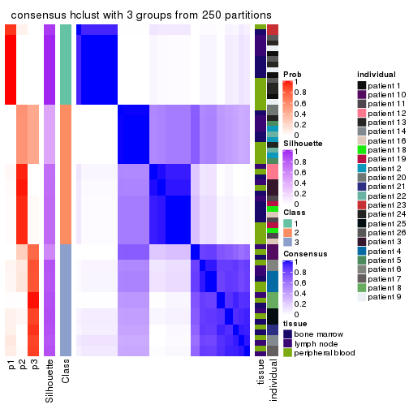</p>

</div>
<div id='tab-MAD-hclust-consensus-heatmap-3'>
<pre><code class="r">consensus_heatmap(res, k = 4)
</code></pre>

<p>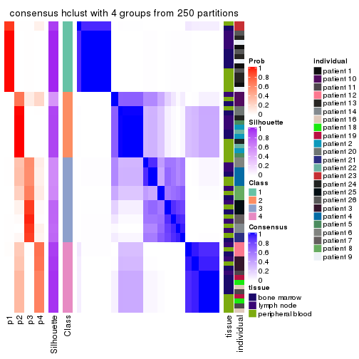</p>

</div>
<div id='tab-MAD-hclust-consensus-heatmap-4'>
<pre><code class="r">consensus_heatmap(res, k = 5)
</code></pre>

<p>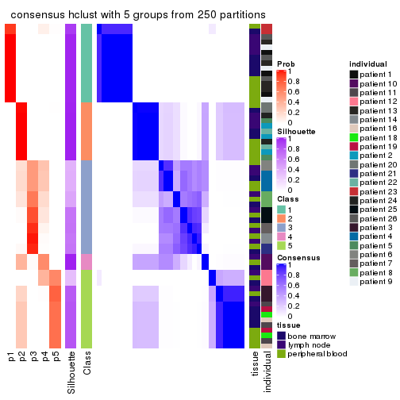</p>

</div>
<div id='tab-MAD-hclust-consensus-heatmap-5'>
<pre><code class="r">consensus_heatmap(res, k = 6)
</code></pre>

<p>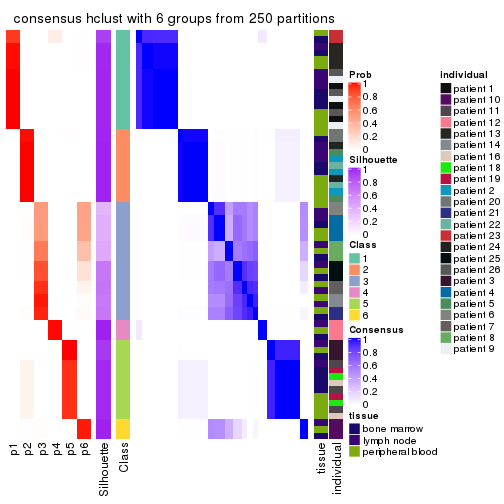</p>

</div>
</div>

Heatmaps for the membership of samples in all partitions to see how consistent they are:


<script>
$( function() {
	$( '#tabs-MAD-hclust-membership-heatmap' ).tabs();
} );
</script>
<div id='tabs-MAD-hclust-membership-heatmap'>
<ul>
<li><a href='#tab-MAD-hclust-membership-heatmap-1'>k = 2</a></li>
<li><a href='#tab-MAD-hclust-membership-heatmap-2'>k = 3</a></li>
<li><a href='#tab-MAD-hclust-membership-heatmap-3'>k = 4</a></li>
<li><a href='#tab-MAD-hclust-membership-heatmap-4'>k = 5</a></li>
<li><a href='#tab-MAD-hclust-membership-heatmap-5'>k = 6</a></li>
</ul>
<div id='tab-MAD-hclust-membership-heatmap-1'>
<pre><code class="r">membership_heatmap(res, k = 2)
</code></pre>

<p>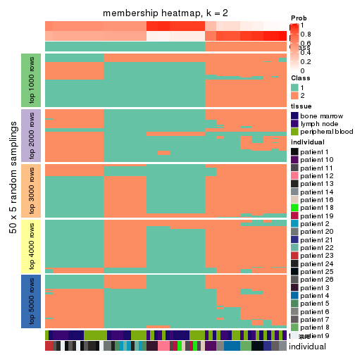</p>

</div>
<div id='tab-MAD-hclust-membership-heatmap-2'>
<pre><code class="r">membership_heatmap(res, k = 3)
</code></pre>

<p>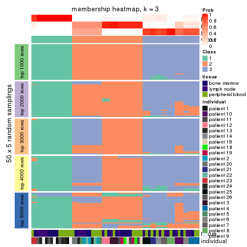</p>

</div>
<div id='tab-MAD-hclust-membership-heatmap-3'>
<pre><code class="r">membership_heatmap(res, k = 4)
</code></pre>

<p>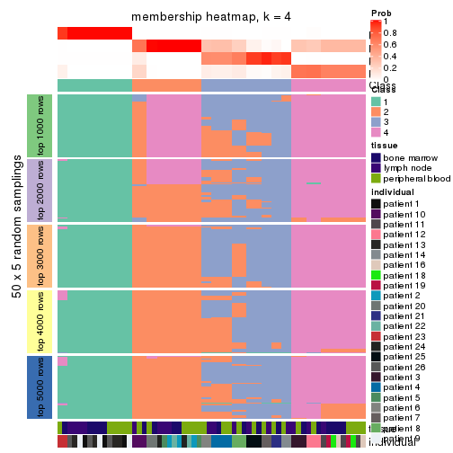</p>

</div>
<div id='tab-MAD-hclust-membership-heatmap-4'>
<pre><code class="r">membership_heatmap(res, k = 5)
</code></pre>

<p>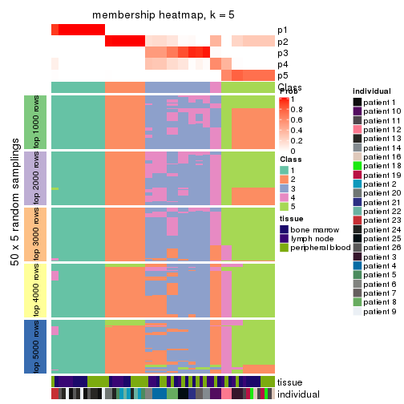</p>

</div>
<div id='tab-MAD-hclust-membership-heatmap-5'>
<pre><code class="r">membership_heatmap(res, k = 6)
</code></pre>

<p>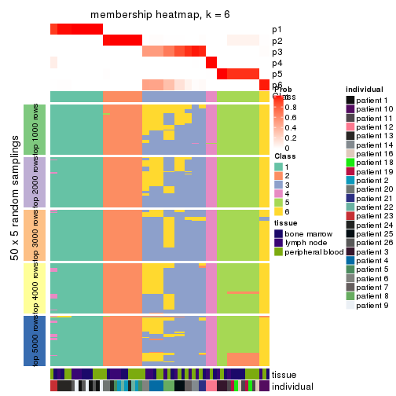</p>

</div>
</div>

As soon as we have had the classes for columns, we can look for signatures
which are significantly different between classes which can be candidate marks
for certain classes. Following are the heatmaps for signatures.


Signature heatmaps where rows are scaled:


<script>
$( function() {
	$( '#tabs-MAD-hclust-get-signatures' ).tabs();
} );
</script>
<div id='tabs-MAD-hclust-get-signatures'>
<ul>
<li><a href='#tab-MAD-hclust-get-signatures-1'>k = 2</a></li>
<li><a href='#tab-MAD-hclust-get-signatures-2'>k = 3</a></li>
<li><a href='#tab-MAD-hclust-get-signatures-3'>k = 4</a></li>
<li><a href='#tab-MAD-hclust-get-signatures-4'>k = 5</a></li>
<li><a href='#tab-MAD-hclust-get-signatures-5'>k = 6</a></li>
</ul>
<div id='tab-MAD-hclust-get-signatures-1'>
<pre><code class="r">get_signatures(res, k = 2)
</code></pre>

<p>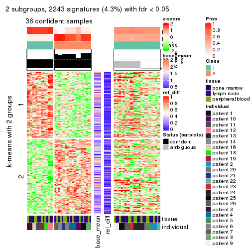</p>

</div>
<div id='tab-MAD-hclust-get-signatures-2'>
<pre><code class="r">get_signatures(res, k = 3)
</code></pre>

<p>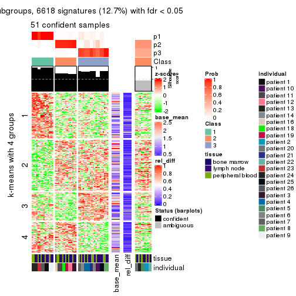</p>

</div>
<div id='tab-MAD-hclust-get-signatures-3'>
<pre><code class="r">get_signatures(res, k = 4)
</code></pre>

<p>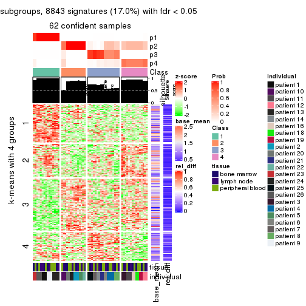</p>

</div>
<div id='tab-MAD-hclust-get-signatures-4'>
<pre><code class="r">get_signatures(res, k = 5)
</code></pre>

<p>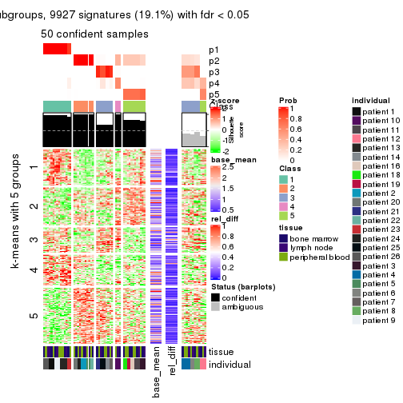</p>

</div>
<div id='tab-MAD-hclust-get-signatures-5'>
<pre><code class="r">get_signatures(res, k = 6)
</code></pre>

<p>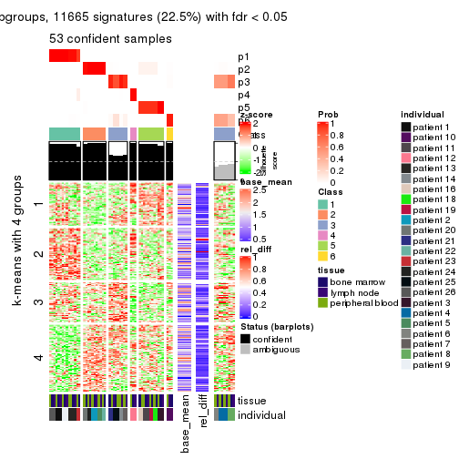</p>

</div>
</div>


Signature heatmaps where rows are not scaled:


<script>
$( function() {
	$( '#tabs-MAD-hclust-get-signatures-no-scale' ).tabs();
} );
</script>
<div id='tabs-MAD-hclust-get-signatures-no-scale'>
<ul>
<li><a href='#tab-MAD-hclust-get-signatures-no-scale-1'>k = 2</a></li>
<li><a href='#tab-MAD-hclust-get-signatures-no-scale-2'>k = 3</a></li>
<li><a href='#tab-MAD-hclust-get-signatures-no-scale-3'>k = 4</a></li>
<li><a href='#tab-MAD-hclust-get-signatures-no-scale-4'>k = 5</a></li>
<li><a href='#tab-MAD-hclust-get-signatures-no-scale-5'>k = 6</a></li>
</ul>
<div id='tab-MAD-hclust-get-signatures-no-scale-1'>
<pre><code class="r">get_signatures(res, k = 2, scale_rows = FALSE)
</code></pre>

<p>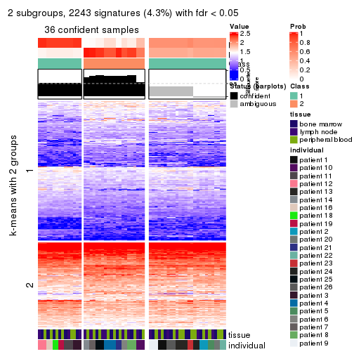</p>

</div>
<div id='tab-MAD-hclust-get-signatures-no-scale-2'>
<pre><code class="r">get_signatures(res, k = 3, scale_rows = FALSE)
</code></pre>

<p>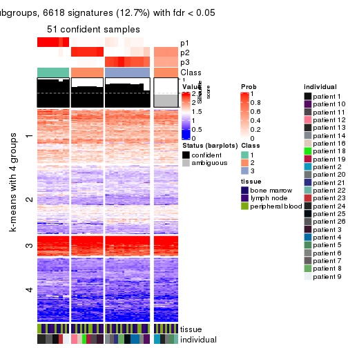</p>

</div>
<div id='tab-MAD-hclust-get-signatures-no-scale-3'>
<pre><code class="r">get_signatures(res, k = 4, scale_rows = FALSE)
</code></pre>

<p>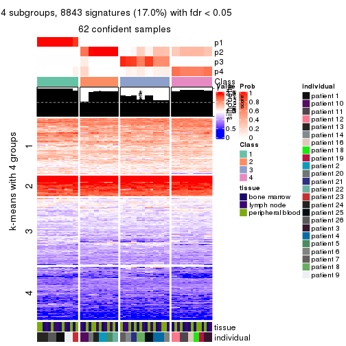</p>

</div>
<div id='tab-MAD-hclust-get-signatures-no-scale-4'>
<pre><code class="r">get_signatures(res, k = 5, scale_rows = FALSE)
</code></pre>

<p>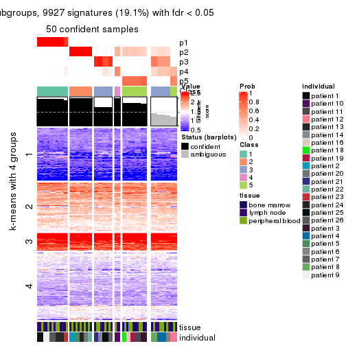</p>

</div>
<div id='tab-MAD-hclust-get-signatures-no-scale-5'>
<pre><code class="r">get_signatures(res, k = 6, scale_rows = FALSE)
</code></pre>

<p>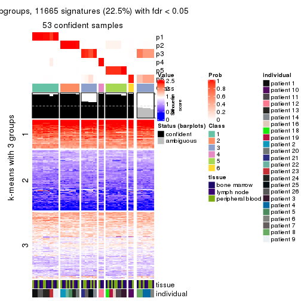</p>

</div>
</div>


Compare the overlap of signatures from different k:

```r
compare_signatures(res)
```

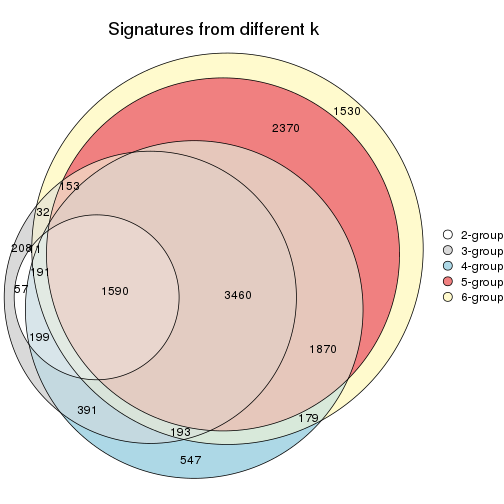

`get_signature()` returns a data frame invisibly. TO get the list of signatures, the function
call should be assigned to a variable explicitly. In following code, if `plot` argument is set
to `FALSE`, no heatmap is plotted while only the differential analysis is performed.

```r
# code only for demonstration
tb = get_signature(res, k = ..., plot = FALSE)
```

An example of the output of `tb` is:

```
#>   which_row         fdr    mean_1    mean_2 scaled_mean_1 scaled_mean_2 km
#> 1        38 0.042760348  8.373488  9.131774    -0.5533452     0.5164555  1
#> 2        40 0.018707592  7.106213  8.469186    -0.6173731     0.5762149  1
#> 3        55 0.019134737 10.221463 11.207825    -0.6159697     0.5749050  1
#> 4        59 0.006059896  5.921854  7.869574    -0.6899429     0.6439467  1
#> 5        60 0.018055526  8.928898 10.211722    -0.6204761     0.5791110  1
#> 6        98 0.009384629 15.714769 14.887706     0.6635654    -0.6193277  2
...
```

The columns in `tb` are:

1. `which_row`: row indices corresponding to the input matrix.
2. `fdr`: FDR for the differential test. 
3. `mean_x`: The mean value in group x.
4. `scaled_mean_x`: The mean value in group x after rows are scaled.
5. `km`: Row groups if k-means clustering is applied to rows.


UMAP plot which shows how samples are separated.


<script>
$( function() {
	$( '#tabs-MAD-hclust-dimension-reduction' ).tabs();
} );
</script>
<div id='tabs-MAD-hclust-dimension-reduction'>
<ul>
<li><a href='#tab-MAD-hclust-dimension-reduction-1'>k = 2</a></li>
<li><a href='#tab-MAD-hclust-dimension-reduction-2'>k = 3</a></li>
<li><a href='#tab-MAD-hclust-dimension-reduction-3'>k = 4</a></li>
<li><a href='#tab-MAD-hclust-dimension-reduction-4'>k = 5</a></li>
<li><a href='#tab-MAD-hclust-dimension-reduction-5'>k = 6</a></li>
</ul>
<div id='tab-MAD-hclust-dimension-reduction-1'>
<pre><code class="r">dimension_reduction(res, k = 2, method = &quot;UMAP&quot;)
</code></pre>

<p>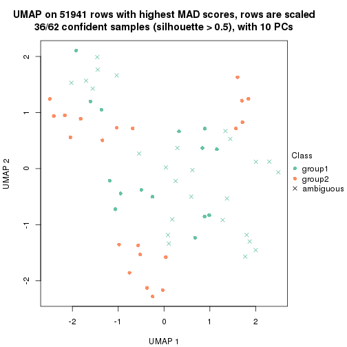</p>

</div>
<div id='tab-MAD-hclust-dimension-reduction-2'>
<pre><code class="r">dimension_reduction(res, k = 3, method = &quot;UMAP&quot;)
</code></pre>

<p>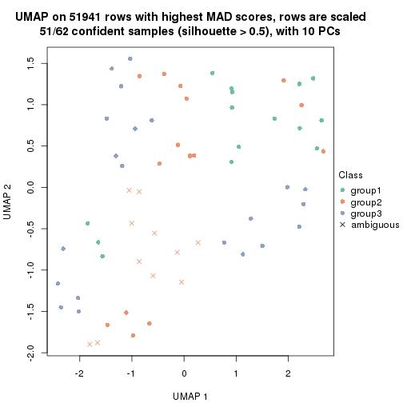</p>

</div>
<div id='tab-MAD-hclust-dimension-reduction-3'>
<pre><code class="r">dimension_reduction(res, k = 4, method = &quot;UMAP&quot;)
</code></pre>

<p>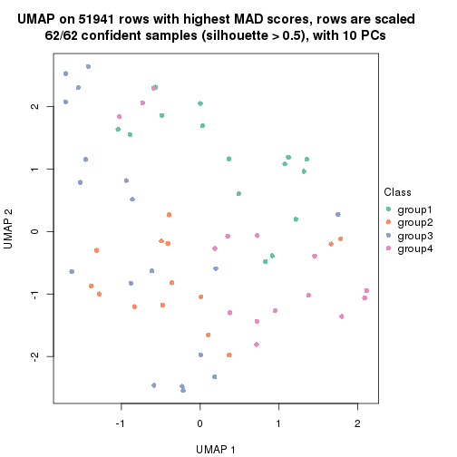</p>

</div>
<div id='tab-MAD-hclust-dimension-reduction-4'>
<pre><code class="r">dimension_reduction(res, k = 5, method = &quot;UMAP&quot;)
</code></pre>

<p>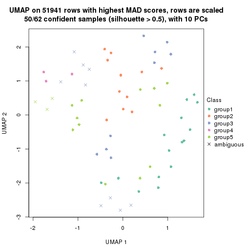</p>

</div>
<div id='tab-MAD-hclust-dimension-reduction-5'>
<pre><code class="r">dimension_reduction(res, k = 6, method = &quot;UMAP&quot;)
</code></pre>

<p>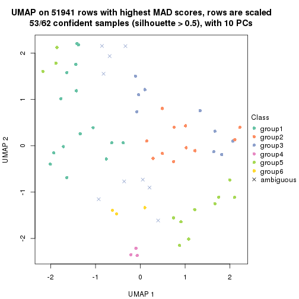</p>

</div>
</div>


Following heatmap shows how subgroups are split when increasing `k`:

```r
collect_classes(res)
```

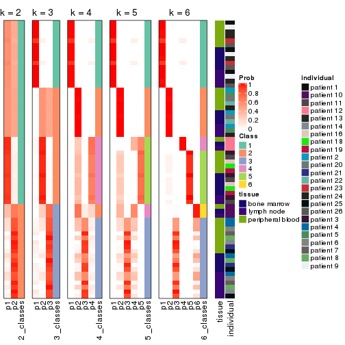


Test correlation between subgroups and known annotations. If the known
annotation is numeric, one-way ANOVA test is applied, and if the known
annotation is discrete, chi-squared contingency table test is applied.

```r
test_to_known_factors(res)
```

```
#>             n tissue(p) individual(p) k
#> MAD:hclust 36     0.515      5.93e-04 2
#> MAD:hclust 51     0.852      3.15e-08 3
#> MAD:hclust 62     0.960      1.10e-12 4
#> MAD:hclust 50     0.993      4.25e-13 5
#> MAD:hclust 53     0.999      7.21e-17 6
```


If matrix rows can be associated to genes, consider to use `functional_enrichment(res,
...)` to perform function enrichment for the signature genes. See [this vignette](http://bioconductor.org/packages/devel/bioc/vignettes/cola/inst/doc/functional_enrichment.html) for more detailed explanations.


 

---------------------------------------------------


### MAD:kmeans


The object with results only for a single top-value method and a single partition method 
can be extracted as:

```r
res = res_list["MAD", "kmeans"]
# you can also extract it by
# res = res_list["MAD:kmeans"]
```

A summary of `res` and all the functions that can be applied to it:

```r
res
```

```
#> A 'ConsensusPartition' object with k = 2, 3, 4, 5, 6.
#>   On a matrix with 51941 rows and 62 columns.
#>   Top rows (1000, 2000, 3000, 4000, 5000) are extracted by 'MAD' method.
#>   Subgroups are detected by 'kmeans' method.
#>   Performed in total 1250 partitions by row resampling.
#>   Best k for subgroups seems to be 3.
#> 
#> Following methods can be applied to this 'ConsensusPartition' object:
#>  [1] "cola_report"             "collect_classes"         "collect_plots"          
#>  [4] "collect_stats"           "colnames"                "compare_signatures"     
#>  [7] "consensus_heatmap"       "dimension_reduction"     "functional_enrichment"  
#> [10] "get_anno_col"            "get_anno"                "get_classes"            
#> [13] "get_consensus"           "get_matrix"              "get_membership"         
#> [16] "get_param"               "get_signatures"          "get_stats"              
#> [19] "is_best_k"               "is_stable_k"             "membership_heatmap"     
#> [22] "ncol"                    "nrow"                    "plot_ecdf"              
#> [25] "rownames"                "select_partition_number" "show"                   
#> [28] "suggest_best_k"          "test_to_known_factors"
```

`collect_plots()` function collects all the plots made from `res` for all `k` (number of partitions)
into one single page to provide an easy and fast comparison between different `k`.

```r
collect_plots(res)
```

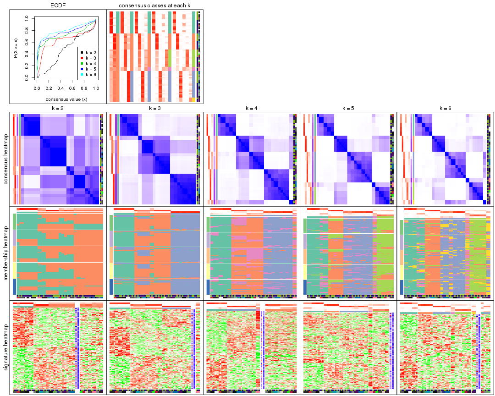

The plots are:

- The first row: a plot of the ECDF (empirical cumulative distribution
  function) curves of the consensus matrix for each `k` and the heatmap of
  predicted classes for each `k`.
- The second row: heatmaps of the consensus matrix for each `k`.
- The third row: heatmaps of the membership matrix for each `k`.
- The fouth row: heatmaps of the signatures for each `k`.

All the plots in panels can be made by individual functions and they are
plotted later in this section.

`select_partition_number()` produces several plots showing different
statistics for choosing "optimized" `k`. There are following statistics:

- ECDF curves of the consensus matrix for each `k`;
- 1-PAC. [The PAC
  score](https://en.wikipedia.org/wiki/Consensus_clustering#Over-interpretation_potential_of_consensus_clustering)
  measures the proportion of the ambiguous subgrouping.
- Mean silhouette score.
- Concordance. The mean probability of fiting the consensus class ids in all
  partitions.
- Area increased. Denote $A_k$ as the area under the ECDF curve for current
  `k`, the area increased is defined as $A_k - A_{k-1}$.
- Rand index. The percent of pairs of samples that are both in a same cluster
  or both are not in a same cluster in the partition of k and k-1.
- Jaccard index. The ratio of pairs of samples are both in a same cluster in
  the partition of k and k-1 and the pairs of samples are both in a same
  cluster in the partition k or k-1.

The detailed explanations of these statistics can be found in [the _cola_
vignette](http://bioconductor.org/packages/devel/bioc/vignettes/cola/inst/doc/cola.html#toc_13).

Generally speaking, lower PAC score, higher mean silhouette score or higher
concordance corresponds to better partition. Rand index and Jaccard index
measure how similar the current partition is compared to partition with `k-1`.
If they are too similar, we won't accept `k` is better than `k-1`.

```r
select_partition_number(res)
```

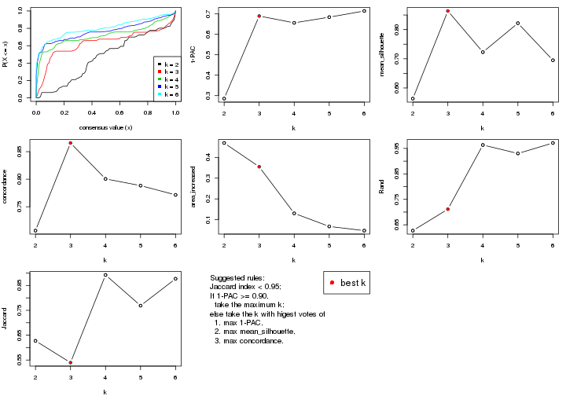

The numeric values for all these statistics can be obtained by `get_stats()`.

```r
get_stats(res)
```

```
#>   k 1-PAC mean_silhouette concordance area_increased  Rand Jaccard
#> 2 2 0.285           0.563       0.707         0.4700 0.627   0.627
#> 3 3 0.690           0.864       0.866         0.3551 0.711   0.540
#> 4 4 0.656           0.723       0.801         0.1303 0.964   0.892
#> 5 5 0.684           0.822       0.788         0.0670 0.930   0.769
#> 6 6 0.714           0.695       0.772         0.0468 0.971   0.877
```

`suggest_best_k()` suggests the best $k$ based on these statistics. The rules are as follows:

- All $k$ with Jaccard index larger than 0.95 are removed because increasing
  $k$ does not provide enough extra information. If all $k$ are removed, it is
  marked as no subgroup is detected.
- For all $k$ with 1-PAC score larger than 0.9, the maximal $k$ is taken as
  the best $k$, and other $k$ are marked as optional $k$.
- If it does not fit the second rule. The $k$ with the maximal vote of the
  highest 1-PAC score, highest mean silhouette, and highest concordance is
  taken as the best $k$.

```r
suggest_best_k(res)
```

```
#> [1] 3
```


Following shows the table of the partitions (You need to click the **show/hide
code output** link to see it). The membership matrix (columns with name `p*`)
is inferred by
[`clue::cl_consensus()`](https://www.rdocumentation.org/link/cl_consensus?package=clue)
function with the `SE` method. Basically the value in the membership matrix
represents the probability to belong to a certain group. The finall class
label for an item is determined with the group with highest probability it
belongs to.

In `get_classes()` function, the entropy is calculated from the membership
matrix and the silhouette score is calculated from the consensus matrix.


<script>
$( function() {
	$( '#tabs-MAD-kmeans-get-classes' ).tabs();
} );
</script>
<div id='tabs-MAD-kmeans-get-classes'>
<ul>
<li><a href='#tab-MAD-kmeans-get-classes-1'>k = 2</a></li>
<li><a href='#tab-MAD-kmeans-get-classes-2'>k = 3</a></li>
<li><a href='#tab-MAD-kmeans-get-classes-3'>k = 4</a></li>
<li><a href='#tab-MAD-kmeans-get-classes-4'>k = 5</a></li>
<li><a href='#tab-MAD-kmeans-get-classes-5'>k = 6</a></li>
</ul>

<div id='tab-MAD-kmeans-get-classes-1'>
<p><a id='tab-MAD-kmeans-get-classes-1-a' style='color:#0366d6' href='#'>show/hide code output</a></p>
<pre><code class="r">cbind(get_classes(res, k = 2), get_membership(res, k = 2))
</code></pre>

<pre><code>#&gt;           class entropy silhouette    p1    p2
#&gt; GSM525314     1  0.1414     0.9418 0.980 0.020
#&gt; GSM525315     2  0.1414     0.5864 0.020 0.980
#&gt; GSM525316     2  0.9775     0.1544 0.412 0.588
#&gt; GSM525317     2  0.9427     0.5355 0.360 0.640
#&gt; GSM525318     2  0.9427     0.5355 0.360 0.640
#&gt; GSM525319     2  0.1414     0.5864 0.020 0.980
#&gt; GSM525320     2  0.9427     0.5355 0.360 0.640
#&gt; GSM525321     2  0.9427     0.5355 0.360 0.640
#&gt; GSM525322     2  0.9209     0.5473 0.336 0.664
#&gt; GSM525323     1  0.1414     0.9418 0.980 0.020
#&gt; GSM525324     2  0.9129     0.5498 0.328 0.672
#&gt; GSM525325     2  0.7745     0.4613 0.228 0.772
#&gt; GSM525326     2  1.0000    -0.0629 0.496 0.504
#&gt; GSM525327     1  0.1414     0.9418 0.980 0.020
#&gt; GSM525328     1  0.1414     0.9418 0.980 0.020
#&gt; GSM525329     2  0.9710     0.4783 0.400 0.600
#&gt; GSM525330     2  0.7453     0.4764 0.212 0.788
#&gt; GSM525331     2  0.8661     0.3861 0.288 0.712
#&gt; GSM525332     2  0.9323     0.2886 0.348 0.652
#&gt; GSM525333     2  0.6048     0.5241 0.148 0.852
#&gt; GSM525334     2  0.9427     0.5355 0.360 0.640
#&gt; GSM525335     2  0.1414     0.5864 0.020 0.980
#&gt; GSM525336     1  0.7674     0.6146 0.776 0.224
#&gt; GSM525337     2  0.1414     0.5864 0.020 0.980
#&gt; GSM525338     2  0.9427     0.5355 0.360 0.640
#&gt; GSM525339     1  0.0672     0.9286 0.992 0.008
#&gt; GSM525340     1  0.1414     0.9418 0.980 0.020
#&gt; GSM525341     2  0.1414     0.5864 0.020 0.980
#&gt; GSM525342     2  0.9775     0.1544 0.412 0.588
#&gt; GSM525343     2  0.9427     0.5355 0.360 0.640
#&gt; GSM525344     2  0.9209     0.5473 0.336 0.664
#&gt; GSM525345     1  0.1414     0.9418 0.980 0.020
#&gt; GSM525346     2  0.9129     0.5498 0.328 0.672
#&gt; GSM525347     2  0.7745     0.4613 0.228 0.772
#&gt; GSM525348     2  1.0000    -0.0629 0.496 0.504
#&gt; GSM525349     1  0.1414     0.9418 0.980 0.020
#&gt; GSM525350     2  0.7453     0.4764 0.212 0.788
#&gt; GSM525351     2  0.8661     0.3861 0.288 0.712
#&gt; GSM525352     2  0.9323     0.2886 0.348 0.652
#&gt; GSM525353     2  0.6048     0.5241 0.148 0.852
#&gt; GSM525354     2  0.9427     0.5355 0.360 0.640
#&gt; GSM525355     2  0.1414     0.5864 0.020 0.980
#&gt; GSM525356     1  0.7602     0.6220 0.780 0.220
#&gt; GSM525357     2  0.9427     0.5355 0.360 0.640
#&gt; GSM525358     1  0.0672     0.9286 0.992 0.008
#&gt; GSM525359     1  0.1414     0.9418 0.980 0.020
#&gt; GSM525360     2  0.1414     0.5864 0.020 0.980
#&gt; GSM525361     2  0.9775     0.1544 0.412 0.588
#&gt; GSM525362     2  0.9427     0.5355 0.360 0.640
#&gt; GSM525363     2  0.1414     0.5864 0.020 0.980
#&gt; GSM525364     2  0.9427     0.5355 0.360 0.640
#&gt; GSM525365     2  0.9427     0.5355 0.360 0.640
#&gt; GSM525366     2  0.9209     0.5473 0.336 0.664
#&gt; GSM525367     1  0.1414     0.9418 0.980 0.020
#&gt; GSM525368     2  0.9129     0.5498 0.328 0.672
#&gt; GSM525369     2  0.7745     0.4613 0.228 0.772
#&gt; GSM525370     2  1.0000    -0.0629 0.496 0.504
#&gt; GSM525371     1  0.1414     0.9418 0.980 0.020
#&gt; GSM525372     2  0.9710     0.4783 0.400 0.600
#&gt; GSM525373     2  0.1414     0.5864 0.020 0.980
#&gt; GSM525374     2  0.9427     0.5355 0.360 0.640
#&gt; GSM525375     1  0.0672     0.9286 0.992 0.008
</code></pre>

<script>
$('#tab-MAD-kmeans-get-classes-1-a').parent().next().next().hide();
$('#tab-MAD-kmeans-get-classes-1-a').click(function(){
  $('#tab-MAD-kmeans-get-classes-1-a').parent().next().next().toggle();
  return(false);
});
</script>
</div>

<div id='tab-MAD-kmeans-get-classes-2'>
<p><a id='tab-MAD-kmeans-get-classes-2-a' style='color:#0366d6' href='#'>show/hide code output</a></p>
<pre><code class="r">cbind(get_classes(res, k = 3), get_membership(res, k = 3))
</code></pre>

<pre><code>#&gt;           class entropy silhouette    p1    p2    p3
#&gt; GSM525314     1   0.318      0.964 0.912 0.024 0.064
#&gt; GSM525315     2   0.665      0.704 0.020 0.640 0.340
#&gt; GSM525316     2   0.386      0.797 0.072 0.888 0.040
#&gt; GSM525317     3   0.188      0.973 0.032 0.012 0.956
#&gt; GSM525318     3   0.188      0.973 0.032 0.012 0.956
#&gt; GSM525319     2   0.665      0.704 0.020 0.640 0.340
#&gt; GSM525320     3   0.218      0.971 0.032 0.020 0.948
#&gt; GSM525321     3   0.153      0.973 0.032 0.004 0.964
#&gt; GSM525322     3   0.192      0.955 0.024 0.020 0.956
#&gt; GSM525323     1   0.346      0.964 0.900 0.024 0.076
#&gt; GSM525324     3   0.255      0.924 0.024 0.040 0.936
#&gt; GSM525325     2   0.388      0.816 0.044 0.888 0.068
#&gt; GSM525326     2   0.693      0.454 0.328 0.640 0.032
#&gt; GSM525327     1   0.389      0.956 0.888 0.048 0.064
#&gt; GSM525328     1   0.389      0.956 0.888 0.048 0.064
#&gt; GSM525329     3   0.220      0.959 0.056 0.004 0.940
#&gt; GSM525330     2   0.376      0.817 0.040 0.892 0.068
#&gt; GSM525331     2   0.389      0.815 0.048 0.888 0.064
#&gt; GSM525332     2   0.369      0.811 0.048 0.896 0.056
#&gt; GSM525333     2   0.475      0.806 0.024 0.832 0.144
#&gt; GSM525334     3   0.153      0.973 0.032 0.004 0.964
#&gt; GSM525335     2   0.665      0.701 0.020 0.640 0.340
#&gt; GSM525336     1   0.372      0.906 0.888 0.088 0.024
#&gt; GSM525337     2   0.665      0.704 0.020 0.640 0.340
#&gt; GSM525338     3   0.141      0.973 0.036 0.000 0.964
#&gt; GSM525339     1   0.321      0.959 0.904 0.012 0.084
#&gt; GSM525340     1   0.318      0.964 0.912 0.024 0.064
#&gt; GSM525341     2   0.665      0.704 0.020 0.640 0.340
#&gt; GSM525342     2   0.386      0.797 0.072 0.888 0.040
#&gt; GSM525343     3   0.188      0.973 0.032 0.012 0.956
#&gt; GSM525344     3   0.192      0.955 0.024 0.020 0.956
#&gt; GSM525345     1   0.346      0.964 0.900 0.024 0.076
#&gt; GSM525346     3   0.230      0.938 0.020 0.036 0.944
#&gt; GSM525347     2   0.388      0.816 0.044 0.888 0.068
#&gt; GSM525348     2   0.693      0.454 0.328 0.640 0.032
#&gt; GSM525349     1   0.389      0.956 0.888 0.048 0.064
#&gt; GSM525350     2   0.376      0.817 0.040 0.892 0.068
#&gt; GSM525351     2   0.389      0.815 0.048 0.888 0.064
#&gt; GSM525352     2   0.369      0.811 0.048 0.896 0.056
#&gt; GSM525353     2   0.475      0.806 0.024 0.832 0.144
#&gt; GSM525354     3   0.153      0.973 0.032 0.004 0.964
#&gt; GSM525355     2   0.665      0.701 0.020 0.640 0.340
#&gt; GSM525356     1   0.372      0.906 0.888 0.088 0.024
#&gt; GSM525357     3   0.153      0.973 0.040 0.000 0.960
#&gt; GSM525358     1   0.321      0.959 0.904 0.012 0.084
#&gt; GSM525359     1   0.305      0.964 0.916 0.020 0.064
#&gt; GSM525360     2   0.665      0.704 0.020 0.640 0.340
#&gt; GSM525361     2   0.386      0.797 0.072 0.888 0.040
#&gt; GSM525362     3   0.200      0.972 0.036 0.012 0.952
#&gt; GSM525363     2   0.665      0.704 0.020 0.640 0.340
#&gt; GSM525364     3   0.230      0.970 0.036 0.020 0.944
#&gt; GSM525365     3   0.165      0.973 0.036 0.004 0.960
#&gt; GSM525366     3   0.205      0.956 0.028 0.020 0.952
#&gt; GSM525367     1   0.333      0.962 0.904 0.020 0.076
#&gt; GSM525368     3   0.230      0.938 0.020 0.036 0.944
#&gt; GSM525369     2   0.388      0.816 0.044 0.888 0.068
#&gt; GSM525370     2   0.693      0.454 0.328 0.640 0.032
#&gt; GSM525371     1   0.378      0.957 0.892 0.044 0.064
#&gt; GSM525372     3   0.220      0.959 0.056 0.004 0.940
#&gt; GSM525373     2   0.665      0.704 0.020 0.640 0.340
#&gt; GSM525374     3   0.153      0.973 0.040 0.000 0.960
#&gt; GSM525375     1   0.321      0.959 0.904 0.012 0.084
</code></pre>

<script>
$('#tab-MAD-kmeans-get-classes-2-a').parent().next().next().hide();
$('#tab-MAD-kmeans-get-classes-2-a').click(function(){
  $('#tab-MAD-kmeans-get-classes-2-a').parent().next().next().toggle();
  return(false);
});
</script>
</div>

<div id='tab-MAD-kmeans-get-classes-3'>
<p><a id='tab-MAD-kmeans-get-classes-3-a' style='color:#0366d6' href='#'>show/hide code output</a></p>
<pre><code class="r">cbind(get_classes(res, k = 4), get_membership(res, k = 4))
</code></pre>

<pre><code>#&gt;           class entropy silhouette    p1    p2    p3    p4
#&gt; GSM525314     1   0.159      0.898 0.956 0.004 0.016 0.024
#&gt; GSM525315     2   0.343      0.469 0.004 0.848 0.140 0.008
#&gt; GSM525316     2   0.594      0.237 0.028 0.512 0.004 0.456
#&gt; GSM525317     3   0.227      0.915 0.012 0.008 0.928 0.052
#&gt; GSM525318     3   0.227      0.915 0.012 0.008 0.928 0.052
#&gt; GSM525319     2   0.363      0.465 0.004 0.844 0.136 0.016
#&gt; GSM525320     3   0.273      0.911 0.008 0.004 0.896 0.092
#&gt; GSM525321     3   0.162      0.919 0.012 0.008 0.956 0.024
#&gt; GSM525322     3   0.434      0.873 0.008 0.064 0.828 0.100
#&gt; GSM525323     1   0.289      0.883 0.900 0.008 0.020 0.072
#&gt; GSM525324     3   0.501      0.841 0.008 0.068 0.780 0.144
#&gt; GSM525325     2   0.544      0.466 0.008 0.644 0.016 0.332
#&gt; GSM525326     4   0.696      1.000 0.108 0.352 0.004 0.536
#&gt; GSM525327     1   0.345      0.869 0.852 0.004 0.012 0.132
#&gt; GSM525328     1   0.345      0.869 0.852 0.004 0.012 0.132
#&gt; GSM525329     3   0.280      0.905 0.028 0.008 0.908 0.056
#&gt; GSM525330     2   0.534      0.478 0.008 0.664 0.016 0.312
#&gt; GSM525331     2   0.521      0.463 0.008 0.652 0.008 0.332
#&gt; GSM525332     2   0.528      0.447 0.008 0.636 0.008 0.348
#&gt; GSM525333     2   0.264      0.457 0.000 0.908 0.032 0.060
#&gt; GSM525334     3   0.206      0.916 0.020 0.008 0.940 0.032
#&gt; GSM525335     2   0.352      0.461 0.004 0.856 0.120 0.020
#&gt; GSM525336     1   0.455      0.746 0.724 0.004 0.004 0.268
#&gt; GSM525337     2   0.343      0.469 0.004 0.848 0.140 0.008
#&gt; GSM525338     3   0.160      0.920 0.020 0.004 0.956 0.020
#&gt; GSM525339     1   0.162      0.895 0.956 0.008 0.024 0.012
#&gt; GSM525340     1   0.159      0.898 0.956 0.004 0.016 0.024
#&gt; GSM525341     2   0.343      0.469 0.004 0.848 0.140 0.008
#&gt; GSM525342     2   0.594      0.237 0.028 0.512 0.004 0.456
#&gt; GSM525343     3   0.227      0.915 0.012 0.008 0.928 0.052
#&gt; GSM525344     3   0.434      0.873 0.008 0.064 0.828 0.100
#&gt; GSM525345     1   0.289      0.883 0.900 0.008 0.020 0.072
#&gt; GSM525346     3   0.523      0.838 0.012 0.068 0.768 0.152
#&gt; GSM525347     2   0.544      0.466 0.008 0.644 0.016 0.332
#&gt; GSM525348     4   0.696      1.000 0.108 0.352 0.004 0.536
#&gt; GSM525349     1   0.345      0.869 0.852 0.004 0.012 0.132
#&gt; GSM525350     2   0.534      0.478 0.008 0.664 0.016 0.312
#&gt; GSM525351     2   0.521      0.463 0.008 0.652 0.008 0.332
#&gt; GSM525352     2   0.528      0.447 0.008 0.636 0.008 0.348
#&gt; GSM525353     2   0.264      0.457 0.000 0.908 0.032 0.060
#&gt; GSM525354     3   0.206      0.916 0.020 0.008 0.940 0.032
#&gt; GSM525355     2   0.352      0.461 0.004 0.856 0.120 0.020
#&gt; GSM525356     1   0.455      0.746 0.724 0.004 0.004 0.268
#&gt; GSM525357     3   0.160      0.920 0.020 0.004 0.956 0.020
#&gt; GSM525358     1   0.162      0.895 0.956 0.008 0.024 0.012
#&gt; GSM525359     1   0.151      0.898 0.956 0.000 0.016 0.028
#&gt; GSM525360     2   0.379      0.459 0.004 0.836 0.140 0.020
#&gt; GSM525361     2   0.594      0.237 0.028 0.512 0.004 0.456
#&gt; GSM525362     3   0.255      0.914 0.016 0.008 0.916 0.060
#&gt; GSM525363     2   0.394      0.455 0.004 0.832 0.136 0.028
#&gt; GSM525364     3   0.299      0.909 0.012 0.004 0.884 0.100
#&gt; GSM525365     3   0.180      0.918 0.016 0.004 0.948 0.032
#&gt; GSM525366     3   0.458      0.871 0.012 0.064 0.816 0.108
#&gt; GSM525367     1   0.275      0.883 0.904 0.004 0.020 0.072
#&gt; GSM525368     3   0.523      0.838 0.012 0.068 0.768 0.152
#&gt; GSM525369     2   0.544      0.466 0.008 0.644 0.016 0.332
#&gt; GSM525370     4   0.696      1.000 0.108 0.352 0.004 0.536
#&gt; GSM525371     1   0.332      0.868 0.852 0.000 0.012 0.136
#&gt; GSM525372     3   0.305      0.904 0.032 0.008 0.896 0.064
#&gt; GSM525373     2   0.379      0.459 0.004 0.836 0.140 0.020
#&gt; GSM525374     3   0.171      0.921 0.020 0.004 0.952 0.024
#&gt; GSM525375     1   0.174      0.894 0.952 0.008 0.024 0.016
</code></pre>

<script>
$('#tab-MAD-kmeans-get-classes-3-a').parent().next().next().hide();
$('#tab-MAD-kmeans-get-classes-3-a').click(function(){
  $('#tab-MAD-kmeans-get-classes-3-a').parent().next().next().toggle();
  return(false);
});
</script>
</div>

<div id='tab-MAD-kmeans-get-classes-4'>
<p><a id='tab-MAD-kmeans-get-classes-4-a' style='color:#0366d6' href='#'>show/hide code output</a></p>
<pre><code class="r">cbind(get_classes(res, k = 5), get_membership(res, k = 5))
</code></pre>

<pre><code>#&gt;           class entropy silhouette    p1    p2    p3    p4    p5
#&gt; GSM525314     1   0.128      0.807 0.960 0.000 0.008 0.008 0.024
#&gt; GSM525315     2   0.120      0.934 0.000 0.956 0.040 0.000 0.004
#&gt; GSM525316     5   0.468      0.696 0.024 0.200 0.000 0.036 0.740
#&gt; GSM525317     3   0.311      0.842 0.000 0.016 0.872 0.076 0.036
#&gt; GSM525318     3   0.327      0.842 0.004 0.016 0.868 0.076 0.036
#&gt; GSM525319     2   0.120      0.934 0.000 0.956 0.040 0.004 0.000
#&gt; GSM525320     3   0.403      0.834 0.004 0.012 0.812 0.124 0.048
#&gt; GSM525321     3   0.286      0.851 0.008 0.016 0.896 0.040 0.040
#&gt; GSM525322     3   0.575      0.773 0.000 0.096 0.704 0.128 0.072
#&gt; GSM525323     1   0.205      0.797 0.932 0.004 0.012 0.024 0.028
#&gt; GSM525324     3   0.630      0.728 0.000 0.080 0.616 0.244 0.060
#&gt; GSM525325     5   0.500      0.856 0.000 0.364 0.000 0.040 0.596
#&gt; GSM525326     4   0.790      1.000 0.060 0.260 0.004 0.372 0.304
#&gt; GSM525327     1   0.463      0.699 0.632 0.000 0.004 0.348 0.016
#&gt; GSM525328     1   0.463      0.699 0.632 0.000 0.004 0.348 0.016
#&gt; GSM525329     3   0.327      0.842 0.008 0.012 0.872 0.060 0.048
#&gt; GSM525330     5   0.491      0.848 0.000 0.380 0.000 0.032 0.588
#&gt; GSM525331     5   0.429      0.865 0.004 0.340 0.000 0.004 0.652
#&gt; GSM525332     5   0.437      0.863 0.004 0.332 0.000 0.008 0.656
#&gt; GSM525333     2   0.301      0.706 0.000 0.844 0.000 0.016 0.140
#&gt; GSM525334     3   0.219      0.856 0.008 0.020 0.928 0.028 0.016
#&gt; GSM525335     2   0.160      0.927 0.000 0.940 0.048 0.012 0.000
#&gt; GSM525336     1   0.573      0.560 0.556 0.008 0.000 0.364 0.072
#&gt; GSM525337     2   0.120      0.934 0.000 0.956 0.040 0.004 0.000
#&gt; GSM525338     3   0.256      0.859 0.008 0.024 0.912 0.032 0.024
#&gt; GSM525339     1   0.237      0.804 0.916 0.008 0.008 0.048 0.020
#&gt; GSM525340     1   0.128      0.807 0.960 0.000 0.008 0.008 0.024
#&gt; GSM525341     2   0.120      0.934 0.000 0.956 0.040 0.000 0.004
#&gt; GSM525342     5   0.468      0.696 0.024 0.200 0.000 0.036 0.740
#&gt; GSM525343     3   0.327      0.842 0.004 0.016 0.868 0.076 0.036
#&gt; GSM525344     3   0.575      0.773 0.000 0.096 0.704 0.128 0.072
#&gt; GSM525345     1   0.205      0.797 0.932 0.004 0.012 0.024 0.028
#&gt; GSM525346     3   0.616      0.730 0.000 0.068 0.624 0.248 0.060
#&gt; GSM525347     5   0.500      0.856 0.000 0.364 0.000 0.040 0.596
#&gt; GSM525348     4   0.790      1.000 0.060 0.260 0.004 0.372 0.304
#&gt; GSM525349     1   0.463      0.699 0.632 0.000 0.004 0.348 0.016
#&gt; GSM525350     5   0.491      0.848 0.000 0.380 0.000 0.032 0.588
#&gt; GSM525351     5   0.429      0.865 0.004 0.340 0.000 0.004 0.652
#&gt; GSM525352     5   0.437      0.863 0.004 0.332 0.000 0.008 0.656
#&gt; GSM525353     2   0.301      0.706 0.000 0.844 0.000 0.016 0.140
#&gt; GSM525354     3   0.219      0.856 0.008 0.020 0.928 0.028 0.016
#&gt; GSM525355     2   0.160      0.927 0.000 0.940 0.048 0.012 0.000
#&gt; GSM525356     1   0.573      0.560 0.556 0.008 0.000 0.364 0.072
#&gt; GSM525357     3   0.237      0.858 0.008 0.016 0.920 0.032 0.024
#&gt; GSM525358     1   0.237      0.804 0.916 0.008 0.008 0.048 0.020
#&gt; GSM525359     1   0.128      0.807 0.960 0.000 0.008 0.008 0.024
#&gt; GSM525360     2   0.133      0.933 0.000 0.952 0.040 0.000 0.008
#&gt; GSM525361     5   0.468      0.696 0.024 0.200 0.000 0.036 0.740
#&gt; GSM525362     3   0.296      0.843 0.000 0.008 0.876 0.080 0.036
#&gt; GSM525363     2   0.149      0.929 0.000 0.948 0.040 0.004 0.008
#&gt; GSM525364     3   0.385      0.835 0.004 0.004 0.816 0.128 0.048
#&gt; GSM525365     3   0.287      0.851 0.008 0.008 0.892 0.048 0.044
#&gt; GSM525366     3   0.579      0.772 0.000 0.092 0.700 0.132 0.076
#&gt; GSM525367     1   0.205      0.797 0.932 0.004 0.012 0.024 0.028
#&gt; GSM525368     3   0.616      0.730 0.000 0.068 0.624 0.248 0.060
#&gt; GSM525369     5   0.500      0.856 0.000 0.364 0.000 0.040 0.596
#&gt; GSM525370     4   0.790      1.000 0.060 0.260 0.004 0.372 0.304
#&gt; GSM525371     1   0.463      0.699 0.632 0.000 0.004 0.348 0.016
#&gt; GSM525372     3   0.340      0.842 0.008 0.012 0.864 0.064 0.052
#&gt; GSM525373     2   0.149      0.929 0.000 0.948 0.040 0.004 0.008
#&gt; GSM525374     3   0.241      0.859 0.004 0.016 0.916 0.036 0.028
#&gt; GSM525375     1   0.237      0.804 0.916 0.008 0.008 0.048 0.020
</code></pre>

<script>
$('#tab-MAD-kmeans-get-classes-4-a').parent().next().next().hide();
$('#tab-MAD-kmeans-get-classes-4-a').click(function(){
  $('#tab-MAD-kmeans-get-classes-4-a').parent().next().next().toggle();
  return(false);
});
</script>
</div>

<div id='tab-MAD-kmeans-get-classes-5'>
<p><a id='tab-MAD-kmeans-get-classes-5-a' style='color:#0366d6' href='#'>show/hide code output</a></p>
<pre><code class="r">cbind(get_classes(res, k = 6), get_membership(res, k = 6))
</code></pre>

<pre><code>#&gt;           class entropy silhouette    p1    p2    p3    p4    p5    p6
#&gt; GSM525314     1   0.107     0.7568 0.964 0.008 0.000 0.020 0.000 0.008
#&gt; GSM525315     2   0.177     0.9217 0.000 0.932 0.044 0.012 0.008 0.004
#&gt; GSM525316     5   0.547     0.6197 0.040 0.072 0.000 0.084 0.716 0.088
#&gt; GSM525317     3   0.455     0.5149 0.012 0.016 0.752 0.028 0.020 0.172
#&gt; GSM525318     3   0.455     0.5149 0.012 0.016 0.752 0.028 0.020 0.172
#&gt; GSM525319     2   0.108     0.9220 0.000 0.956 0.040 0.000 0.004 0.000
#&gt; GSM525320     3   0.497     0.1550 0.000 0.012 0.628 0.040 0.012 0.308
#&gt; GSM525321     3   0.204     0.6354 0.000 0.012 0.924 0.012 0.016 0.036
#&gt; GSM525322     3   0.553    -0.0511 0.000 0.076 0.596 0.040 0.000 0.288
#&gt; GSM525323     1   0.220     0.7327 0.912 0.000 0.000 0.028 0.024 0.036
#&gt; GSM525324     6   0.517     0.9687 0.000 0.064 0.376 0.012 0.000 0.548
#&gt; GSM525325     5   0.449     0.8248 0.000 0.216 0.000 0.020 0.712 0.052
#&gt; GSM525326     4   0.791     1.0000 0.040 0.168 0.000 0.408 0.236 0.148
#&gt; GSM525327     1   0.415     0.6497 0.552 0.000 0.000 0.436 0.012 0.000
#&gt; GSM525328     1   0.415     0.6497 0.552 0.000 0.000 0.436 0.012 0.000
#&gt; GSM525329     3   0.281     0.5930 0.012 0.008 0.884 0.016 0.012 0.068
#&gt; GSM525330     5   0.399     0.8281 0.000 0.212 0.000 0.016 0.744 0.028
#&gt; GSM525331     5   0.306     0.8343 0.000 0.184 0.000 0.004 0.804 0.008
#&gt; GSM525332     5   0.323     0.8312 0.000 0.168 0.000 0.012 0.808 0.012
#&gt; GSM525333     2   0.296     0.7842 0.000 0.836 0.000 0.016 0.140 0.008
#&gt; GSM525334     3   0.160     0.6354 0.000 0.020 0.944 0.012 0.004 0.020
#&gt; GSM525335     2   0.264     0.8881 0.000 0.896 0.020 0.020 0.024 0.040
#&gt; GSM525336     1   0.582     0.4874 0.516 0.008 0.000 0.376 0.036 0.064
#&gt; GSM525337     2   0.177     0.9205 0.000 0.932 0.044 0.008 0.012 0.004
#&gt; GSM525338     3   0.198     0.6248 0.000 0.020 0.908 0.000 0.000 0.072
#&gt; GSM525339     1   0.342     0.7384 0.840 0.000 0.012 0.096 0.020 0.032
#&gt; GSM525340     1   0.107     0.7568 0.964 0.008 0.000 0.020 0.000 0.008
#&gt; GSM525341     2   0.177     0.9217 0.000 0.932 0.044 0.012 0.008 0.004
#&gt; GSM525342     5   0.547     0.6197 0.040 0.072 0.000 0.084 0.716 0.088
#&gt; GSM525343     3   0.455     0.5149 0.012 0.016 0.752 0.028 0.020 0.172
#&gt; GSM525344     3   0.553    -0.0511 0.000 0.076 0.596 0.040 0.000 0.288
#&gt; GSM525345     1   0.220     0.7327 0.912 0.000 0.000 0.028 0.024 0.036
#&gt; GSM525346     6   0.511     0.9845 0.000 0.060 0.372 0.012 0.000 0.556
#&gt; GSM525347     5   0.449     0.8248 0.000 0.216 0.000 0.020 0.712 0.052
#&gt; GSM525348     4   0.791     1.0000 0.040 0.168 0.000 0.408 0.236 0.148
#&gt; GSM525349     1   0.415     0.6497 0.552 0.000 0.000 0.436 0.012 0.000
#&gt; GSM525350     5   0.399     0.8281 0.000 0.212 0.000 0.016 0.744 0.028
#&gt; GSM525351     5   0.306     0.8343 0.000 0.184 0.000 0.004 0.804 0.008
#&gt; GSM525352     5   0.323     0.8312 0.000 0.168 0.000 0.012 0.808 0.012
#&gt; GSM525353     2   0.296     0.7842 0.000 0.836 0.000 0.016 0.140 0.008
#&gt; GSM525354     3   0.160     0.6354 0.000 0.020 0.944 0.012 0.004 0.020
#&gt; GSM525355     2   0.264     0.8881 0.000 0.896 0.020 0.020 0.024 0.040
#&gt; GSM525356     1   0.582     0.4874 0.516 0.008 0.000 0.376 0.036 0.064
#&gt; GSM525357     3   0.190     0.6248 0.000 0.016 0.912 0.000 0.000 0.072
#&gt; GSM525358     1   0.342     0.7384 0.840 0.000 0.012 0.096 0.020 0.032
#&gt; GSM525359     1   0.117     0.7570 0.960 0.008 0.000 0.020 0.000 0.012
#&gt; GSM525360     2   0.177     0.9217 0.000 0.932 0.044 0.012 0.008 0.004
#&gt; GSM525361     5   0.547     0.6197 0.040 0.072 0.000 0.084 0.716 0.088
#&gt; GSM525362     3   0.452     0.5089 0.012 0.012 0.748 0.028 0.020 0.180
#&gt; GSM525363     2   0.115     0.9220 0.000 0.952 0.044 0.000 0.004 0.000
#&gt; GSM525364     3   0.490     0.1409 0.000 0.008 0.624 0.040 0.012 0.316
#&gt; GSM525365     3   0.208     0.6335 0.000 0.008 0.920 0.012 0.016 0.044
#&gt; GSM525366     3   0.552    -0.0669 0.000 0.072 0.592 0.040 0.000 0.296
#&gt; GSM525367     1   0.220     0.7327 0.912 0.000 0.000 0.028 0.024 0.036
#&gt; GSM525368     6   0.511     0.9845 0.000 0.060 0.372 0.012 0.000 0.556
#&gt; GSM525369     5   0.449     0.8248 0.000 0.216 0.000 0.020 0.712 0.052
#&gt; GSM525370     4   0.791     1.0000 0.040 0.168 0.000 0.408 0.236 0.148
#&gt; GSM525371     1   0.427     0.6503 0.552 0.000 0.000 0.432 0.012 0.004
#&gt; GSM525372     3   0.292     0.5904 0.012 0.008 0.876 0.016 0.012 0.076
#&gt; GSM525373     2   0.184     0.9196 0.000 0.928 0.048 0.008 0.012 0.004
#&gt; GSM525374     3   0.201     0.6229 0.000 0.016 0.904 0.000 0.000 0.080
#&gt; GSM525375     1   0.349     0.7381 0.836 0.000 0.012 0.096 0.020 0.036
</code></pre>

<script>
$('#tab-MAD-kmeans-get-classes-5-a').parent().next().next().hide();
$('#tab-MAD-kmeans-get-classes-5-a').click(function(){
  $('#tab-MAD-kmeans-get-classes-5-a').parent().next().next().toggle();
  return(false);
});
</script>
</div>
</div>

Heatmaps for the consensus matrix. It visualizes the probability of two
samples to be in a same group.


<script>
$( function() {
	$( '#tabs-MAD-kmeans-consensus-heatmap' ).tabs();
} );
</script>
<div id='tabs-MAD-kmeans-consensus-heatmap'>
<ul>
<li><a href='#tab-MAD-kmeans-consensus-heatmap-1'>k = 2</a></li>
<li><a href='#tab-MAD-kmeans-consensus-heatmap-2'>k = 3</a></li>
<li><a href='#tab-MAD-kmeans-consensus-heatmap-3'>k = 4</a></li>
<li><a href='#tab-MAD-kmeans-consensus-heatmap-4'>k = 5</a></li>
<li><a href='#tab-MAD-kmeans-consensus-heatmap-5'>k = 6</a></li>
</ul>
<div id='tab-MAD-kmeans-consensus-heatmap-1'>
<pre><code class="r">consensus_heatmap(res, k = 2)
</code></pre>

<p>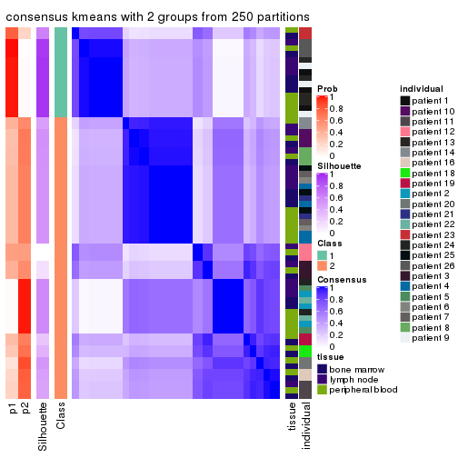</p>

</div>
<div id='tab-MAD-kmeans-consensus-heatmap-2'>
<pre><code class="r">consensus_heatmap(res, k = 3)
</code></pre>

<p>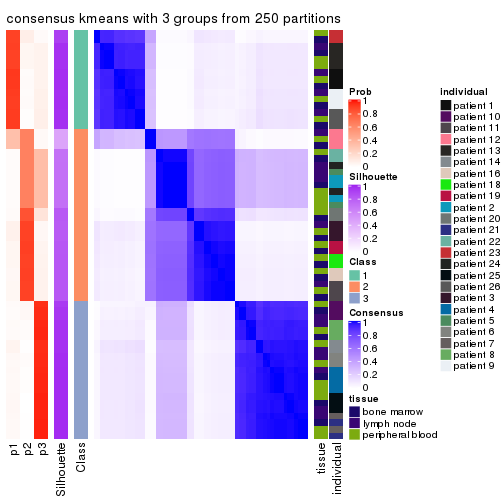</p>

</div>
<div id='tab-MAD-kmeans-consensus-heatmap-3'>
<pre><code class="r">consensus_heatmap(res, k = 4)
</code></pre>

<p>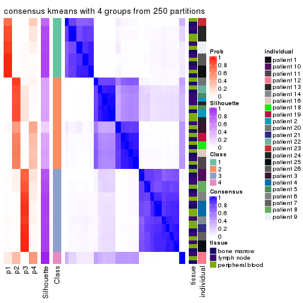</p>

</div>
<div id='tab-MAD-kmeans-consensus-heatmap-4'>
<pre><code class="r">consensus_heatmap(res, k = 5)
</code></pre>

<p>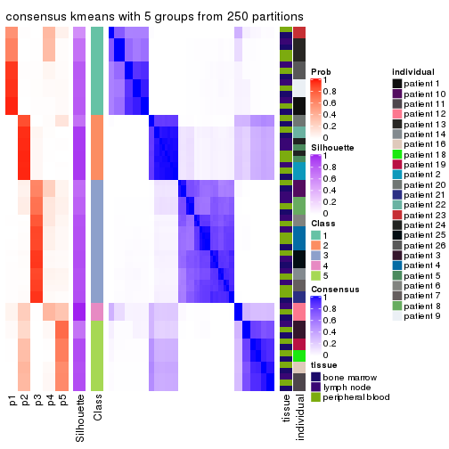</p>

</div>
<div id='tab-MAD-kmeans-consensus-heatmap-5'>
<pre><code class="r">consensus_heatmap(res, k = 6)
</code></pre>

<p>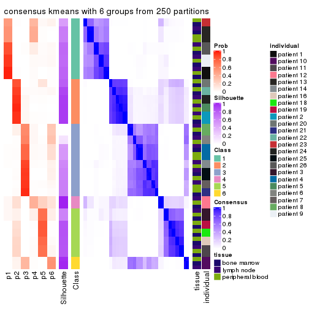</p>

</div>
</div>

Heatmaps for the membership of samples in all partitions to see how consistent they are:


<script>
$( function() {
	$( '#tabs-MAD-kmeans-membership-heatmap' ).tabs();
} );
</script>
<div id='tabs-MAD-kmeans-membership-heatmap'>
<ul>
<li><a href='#tab-MAD-kmeans-membership-heatmap-1'>k = 2</a></li>
<li><a href='#tab-MAD-kmeans-membership-heatmap-2'>k = 3</a></li>
<li><a href='#tab-MAD-kmeans-membership-heatmap-3'>k = 4</a></li>
<li><a href='#tab-MAD-kmeans-membership-heatmap-4'>k = 5</a></li>
<li><a href='#tab-MAD-kmeans-membership-heatmap-5'>k = 6</a></li>
</ul>
<div id='tab-MAD-kmeans-membership-heatmap-1'>
<pre><code class="r">membership_heatmap(res, k = 2)
</code></pre>

<p>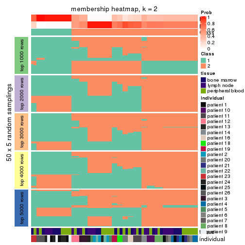</p>

</div>
<div id='tab-MAD-kmeans-membership-heatmap-2'>
<pre><code class="r">membership_heatmap(res, k = 3)
</code></pre>

<p>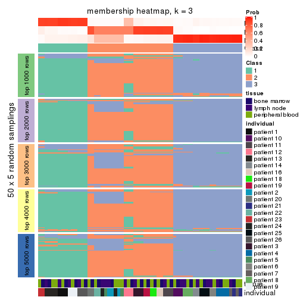</p>

</div>
<div id='tab-MAD-kmeans-membership-heatmap-3'>
<pre><code class="r">membership_heatmap(res, k = 4)
</code></pre>

<p>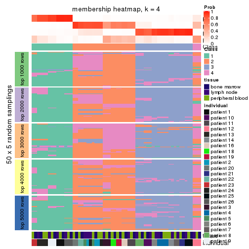</p>

</div>
<div id='tab-MAD-kmeans-membership-heatmap-4'>
<pre><code class="r">membership_heatmap(res, k = 5)
</code></pre>

<p>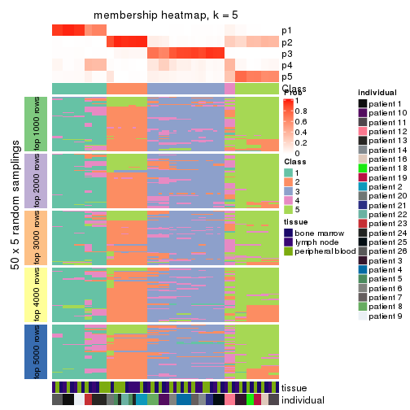</p>

</div>
<div id='tab-MAD-kmeans-membership-heatmap-5'>
<pre><code class="r">membership_heatmap(res, k = 6)
</code></pre>

<p>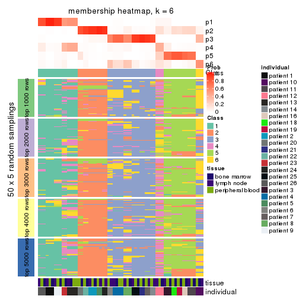</p>

</div>
</div>

As soon as we have had the classes for columns, we can look for signatures
which are significantly different between classes which can be candidate marks
for certain classes. Following are the heatmaps for signatures.


Signature heatmaps where rows are scaled:


<script>
$( function() {
	$( '#tabs-MAD-kmeans-get-signatures' ).tabs();
} );
</script>
<div id='tabs-MAD-kmeans-get-signatures'>
<ul>
<li><a href='#tab-MAD-kmeans-get-signatures-1'>k = 2</a></li>
<li><a href='#tab-MAD-kmeans-get-signatures-2'>k = 3</a></li>
<li><a href='#tab-MAD-kmeans-get-signatures-3'>k = 4</a></li>
<li><a href='#tab-MAD-kmeans-get-signatures-4'>k = 5</a></li>
<li><a href='#tab-MAD-kmeans-get-signatures-5'>k = 6</a></li>
</ul>
<div id='tab-MAD-kmeans-get-signatures-1'>
<pre><code class="r">get_signatures(res, k = 2)
</code></pre>

<p>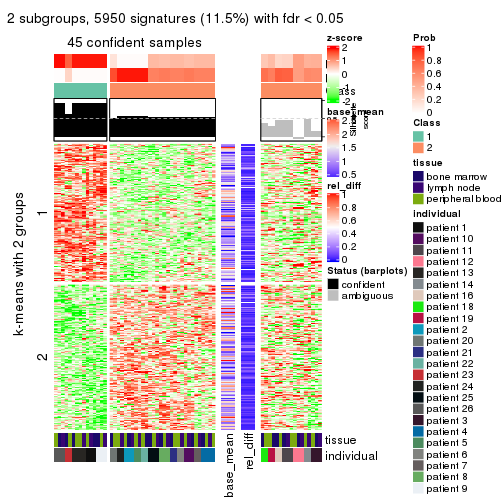</p>

</div>
<div id='tab-MAD-kmeans-get-signatures-2'>
<pre><code class="r">get_signatures(res, k = 3)
</code></pre>

<p>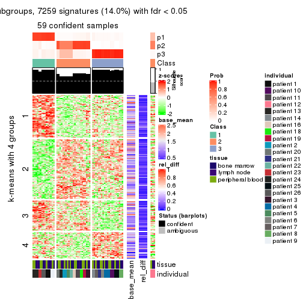</p>

</div>
<div id='tab-MAD-kmeans-get-signatures-3'>
<pre><code class="r">get_signatures(res, k = 4)
</code></pre>

<p>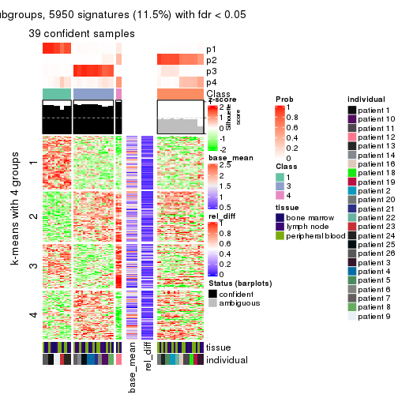</p>

</div>
<div id='tab-MAD-kmeans-get-signatures-4'>
<pre><code class="r">get_signatures(res, k = 5)
</code></pre>

<p>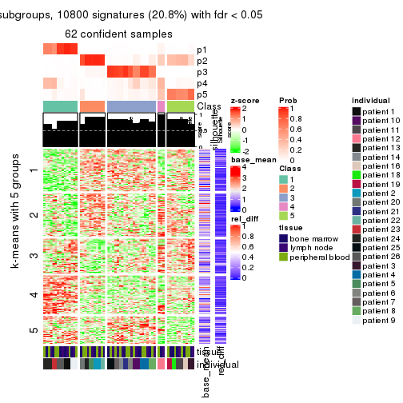</p>

</div>
<div id='tab-MAD-kmeans-get-signatures-5'>
<pre><code class="r">get_signatures(res, k = 6)
</code></pre>

<p>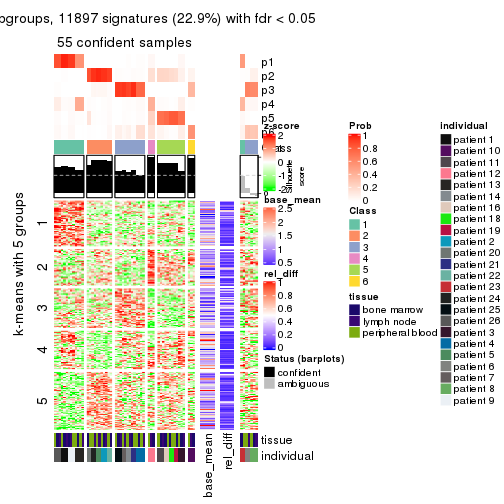</p>

</div>
</div>


Signature heatmaps where rows are not scaled:


<script>
$( function() {
	$( '#tabs-MAD-kmeans-get-signatures-no-scale' ).tabs();
} );
</script>
<div id='tabs-MAD-kmeans-get-signatures-no-scale'>
<ul>
<li><a href='#tab-MAD-kmeans-get-signatures-no-scale-1'>k = 2</a></li>
<li><a href='#tab-MAD-kmeans-get-signatures-no-scale-2'>k = 3</a></li>
<li><a href='#tab-MAD-kmeans-get-signatures-no-scale-3'>k = 4</a></li>
<li><a href='#tab-MAD-kmeans-get-signatures-no-scale-4'>k = 5</a></li>
<li><a href='#tab-MAD-kmeans-get-signatures-no-scale-5'>k = 6</a></li>
</ul>
<div id='tab-MAD-kmeans-get-signatures-no-scale-1'>
<pre><code class="r">get_signatures(res, k = 2, scale_rows = FALSE)
</code></pre>

<p>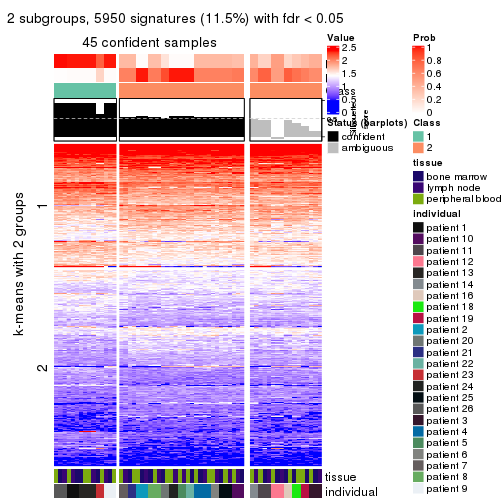</p>

</div>
<div id='tab-MAD-kmeans-get-signatures-no-scale-2'>
<pre><code class="r">get_signatures(res, k = 3, scale_rows = FALSE)
</code></pre>

<p>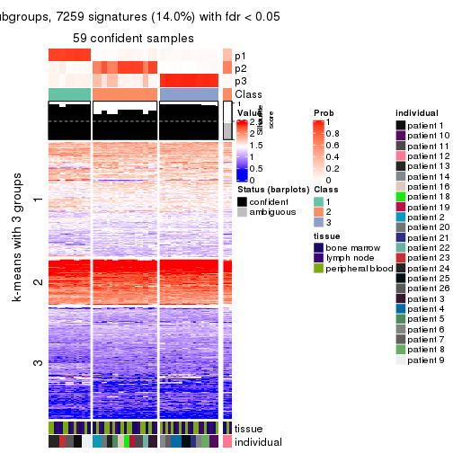</p>

</div>
<div id='tab-MAD-kmeans-get-signatures-no-scale-3'>
<pre><code class="r">get_signatures(res, k = 4, scale_rows = FALSE)
</code></pre>

<p>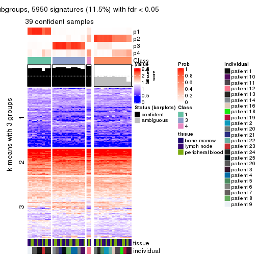</p>

</div>
<div id='tab-MAD-kmeans-get-signatures-no-scale-4'>
<pre><code class="r">get_signatures(res, k = 5, scale_rows = FALSE)
</code></pre>

<p>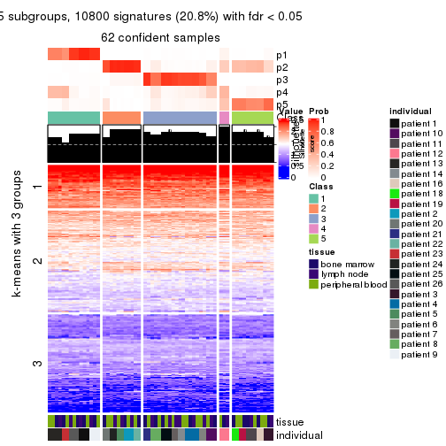</p>

</div>
<div id='tab-MAD-kmeans-get-signatures-no-scale-5'>
<pre><code class="r">get_signatures(res, k = 6, scale_rows = FALSE)
</code></pre>

<p>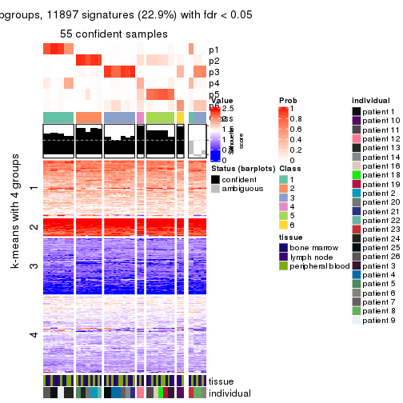</p>

</div>
</div>


Compare the overlap of signatures from different k:

```r
compare_signatures(res)
```

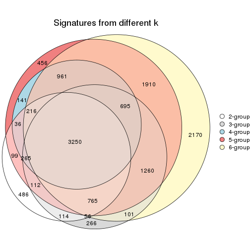

`get_signature()` returns a data frame invisibly. TO get the list of signatures, the function
call should be assigned to a variable explicitly. In following code, if `plot` argument is set
to `FALSE`, no heatmap is plotted while only the differential analysis is performed.

```r
# code only for demonstration
tb = get_signature(res, k = ..., plot = FALSE)
```

An example of the output of `tb` is:

```
#>   which_row         fdr    mean_1    mean_2 scaled_mean_1 scaled_mean_2 km
#> 1        38 0.042760348  8.373488  9.131774    -0.5533452     0.5164555  1
#> 2        40 0.018707592  7.106213  8.469186    -0.6173731     0.5762149  1
#> 3        55 0.019134737 10.221463 11.207825    -0.6159697     0.5749050  1
#> 4        59 0.006059896  5.921854  7.869574    -0.6899429     0.6439467  1
#> 5        60 0.018055526  8.928898 10.211722    -0.6204761     0.5791110  1
#> 6        98 0.009384629 15.714769 14.887706     0.6635654    -0.6193277  2
...
```

The columns in `tb` are:

1. `which_row`: row indices corresponding to the input matrix.
2. `fdr`: FDR for the differential test. 
3. `mean_x`: The mean value in group x.
4. `scaled_mean_x`: The mean value in group x after rows are scaled.
5. `km`: Row groups if k-means clustering is applied to rows.


UMAP plot which shows how samples are separated.


<script>
$( function() {
	$( '#tabs-MAD-kmeans-dimension-reduction' ).tabs();
} );
</script>
<div id='tabs-MAD-kmeans-dimension-reduction'>
<ul>
<li><a href='#tab-MAD-kmeans-dimension-reduction-1'>k = 2</a></li>
<li><a href='#tab-MAD-kmeans-dimension-reduction-2'>k = 3</a></li>
<li><a href='#tab-MAD-kmeans-dimension-reduction-3'>k = 4</a></li>
<li><a href='#tab-MAD-kmeans-dimension-reduction-4'>k = 5</a></li>
<li><a href='#tab-MAD-kmeans-dimension-reduction-5'>k = 6</a></li>
</ul>
<div id='tab-MAD-kmeans-dimension-reduction-1'>
<pre><code class="r">dimension_reduction(res, k = 2, method = &quot;UMAP&quot;)
</code></pre>

<p>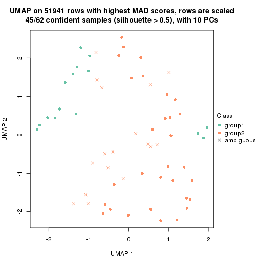</p>

</div>
<div id='tab-MAD-kmeans-dimension-reduction-2'>
<pre><code class="r">dimension_reduction(res, k = 3, method = &quot;UMAP&quot;)
</code></pre>

<p>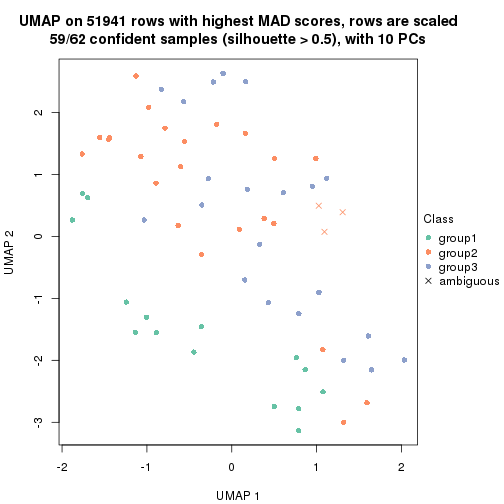</p>

</div>
<div id='tab-MAD-kmeans-dimension-reduction-3'>
<pre><code class="r">dimension_reduction(res, k = 4, method = &quot;UMAP&quot;)
</code></pre>

<p>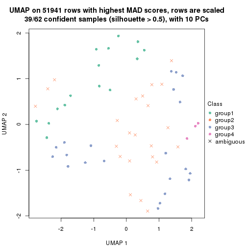</p>

</div>
<div id='tab-MAD-kmeans-dimension-reduction-4'>
<pre><code class="r">dimension_reduction(res, k = 5, method = &quot;UMAP&quot;)
</code></pre>

<p>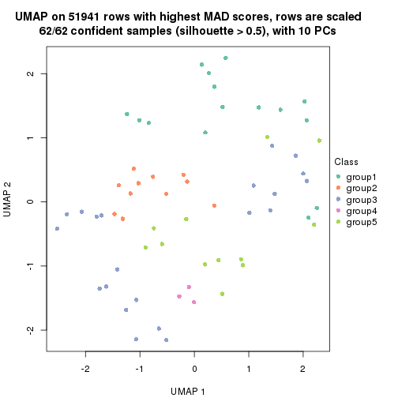</p>

</div>
<div id='tab-MAD-kmeans-dimension-reduction-5'>
<pre><code class="r">dimension_reduction(res, k = 6, method = &quot;UMAP&quot;)
</code></pre>

<p>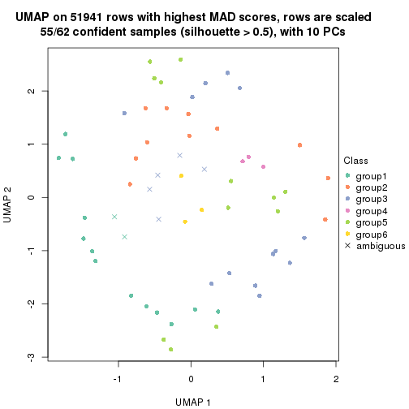</p>

</div>
</div>


Following heatmap shows how subgroups are split when increasing `k`:

```r
collect_classes(res)
```

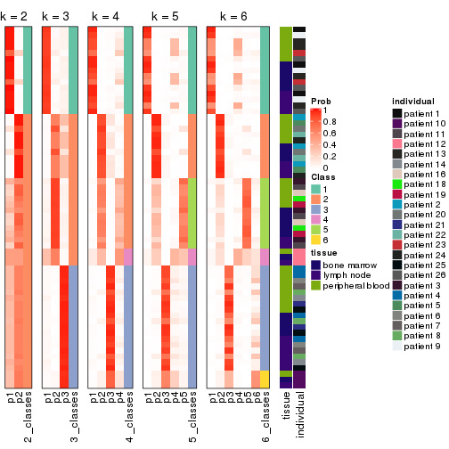


Test correlation between subgroups and known annotations. If the known
annotation is numeric, one-way ANOVA test is applied, and if the known
annotation is discrete, chi-squared contingency table test is applied.

```r
test_to_known_factors(res)
```

```
#>             n tissue(p) individual(p) k
#> MAD:kmeans 45     0.896      1.39e-04 2
#> MAD:kmeans 59     0.901      1.10e-08 3
#> MAD:kmeans 39     0.973      4.25e-07 4
#> MAD:kmeans 62     0.987      2.93e-16 5
#> MAD:kmeans 55     0.998      2.92e-18 6
```


If matrix rows can be associated to genes, consider to use `functional_enrichment(res,
...)` to perform function enrichment for the signature genes. See [this vignette](http://bioconductor.org/packages/devel/bioc/vignettes/cola/inst/doc/functional_enrichment.html) for more detailed explanations.


 

---------------------------------------------------


### MAD:skmeans**


The object with results only for a single top-value method and a single partition method 
can be extracted as:

```r
res = res_list["MAD", "skmeans"]
# you can also extract it by
# res = res_list["MAD:skmeans"]
```

A summary of `res` and all the functions that can be applied to it:

```r
res
```

```
#> A 'ConsensusPartition' object with k = 2, 3, 4, 5, 6.
#>   On a matrix with 51941 rows and 62 columns.
#>   Top rows (1000, 2000, 3000, 4000, 5000) are extracted by 'MAD' method.
#>   Subgroups are detected by 'skmeans' method.
#>   Performed in total 1250 partitions by row resampling.
#>   Best k for subgroups seems to be 3.
#> 
#> Following methods can be applied to this 'ConsensusPartition' object:
#>  [1] "cola_report"             "collect_classes"         "collect_plots"          
#>  [4] "collect_stats"           "colnames"                "compare_signatures"     
#>  [7] "consensus_heatmap"       "dimension_reduction"     "functional_enrichment"  
#> [10] "get_anno_col"            "get_anno"                "get_classes"            
#> [13] "get_consensus"           "get_matrix"              "get_membership"         
#> [16] "get_param"               "get_signatures"          "get_stats"              
#> [19] "is_best_k"               "is_stable_k"             "membership_heatmap"     
#> [22] "ncol"                    "nrow"                    "plot_ecdf"              
#> [25] "rownames"                "select_partition_number" "show"                   
#> [28] "suggest_best_k"          "test_to_known_factors"
```

`collect_plots()` function collects all the plots made from `res` for all `k` (number of partitions)
into one single page to provide an easy and fast comparison between different `k`.

```r
collect_plots(res)
```

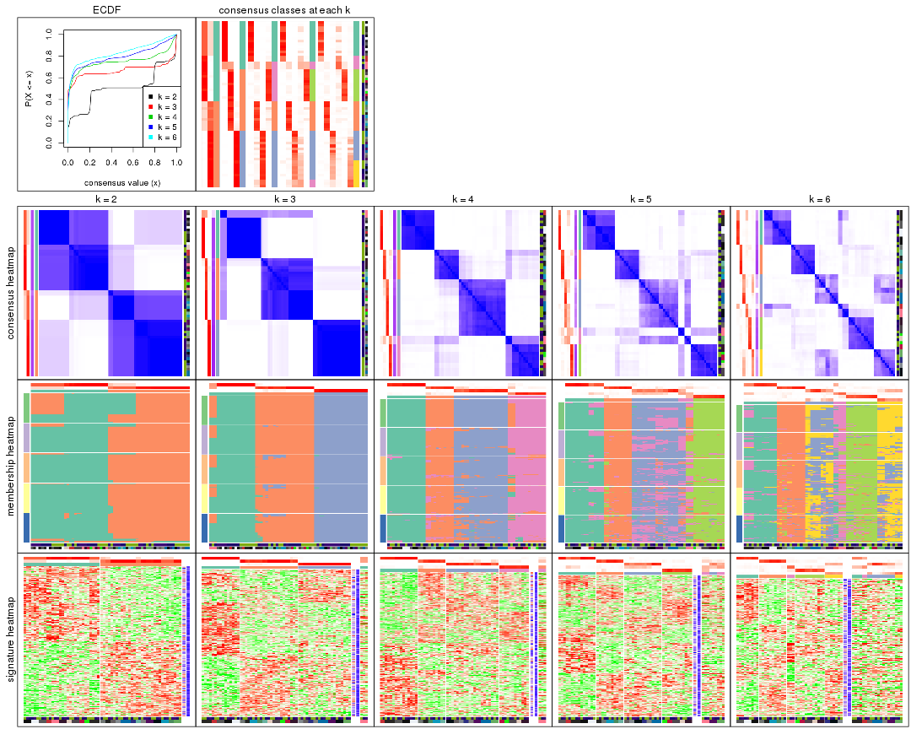

The plots are:

- The first row: a plot of the ECDF (empirical cumulative distribution
  function) curves of the consensus matrix for each `k` and the heatmap of
  predicted classes for each `k`.
- The second row: heatmaps of the consensus matrix for each `k`.
- The third row: heatmaps of the membership matrix for each `k`.
- The fouth row: heatmaps of the signatures for each `k`.

All the plots in panels can be made by individual functions and they are
plotted later in this section.

`select_partition_number()` produces several plots showing different
statistics for choosing "optimized" `k`. There are following statistics:

- ECDF curves of the consensus matrix for each `k`;
- 1-PAC. [The PAC
  score](https://en.wikipedia.org/wiki/Consensus_clustering#Over-interpretation_potential_of_consensus_clustering)
  measures the proportion of the ambiguous subgrouping.
- Mean silhouette score.
- Concordance. The mean probability of fiting the consensus class ids in all
  partitions.
- Area increased. Denote $A_k$ as the area under the ECDF curve for current
  `k`, the area increased is defined as $A_k - A_{k-1}$.
- Rand index. The percent of pairs of samples that are both in a same cluster
  or both are not in a same cluster in the partition of k and k-1.
- Jaccard index. The ratio of pairs of samples are both in a same cluster in
  the partition of k and k-1 and the pairs of samples are both in a same
  cluster in the partition k or k-1.

The detailed explanations of these statistics can be found in [the _cola_
vignette](http://bioconductor.org/packages/devel/bioc/vignettes/cola/inst/doc/cola.html#toc_13).

Generally speaking, lower PAC score, higher mean silhouette score or higher
concordance corresponds to better partition. Rand index and Jaccard index
measure how similar the current partition is compared to partition with `k-1`.
If they are too similar, we won't accept `k` is better than `k-1`.

```r
select_partition_number(res)
```

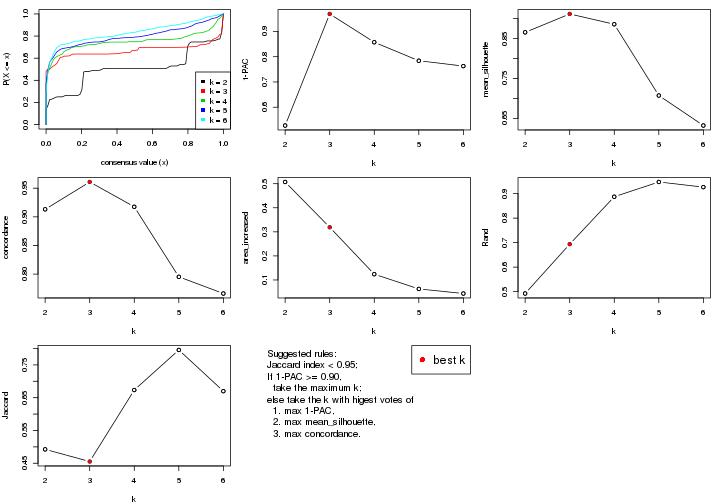

The numeric values for all these statistics can be obtained by `get_stats()`.

```r
get_stats(res)
```

```
#>   k 1-PAC mean_silhouette concordance area_increased  Rand Jaccard
#> 2 2 0.528           0.866       0.913         0.5071 0.492   0.492
#> 3 3 0.969           0.912       0.961         0.3188 0.694   0.455
#> 4 4 0.857           0.886       0.918         0.1239 0.887   0.673
#> 5 5 0.784           0.707       0.795         0.0626 0.948   0.795
#> 6 6 0.763           0.632       0.766         0.0436 0.926   0.670
```

`suggest_best_k()` suggests the best $k$ based on these statistics. The rules are as follows:

- All $k$ with Jaccard index larger than 0.95 are removed because increasing
  $k$ does not provide enough extra information. If all $k$ are removed, it is
  marked as no subgroup is detected.
- For all $k$ with 1-PAC score larger than 0.9, the maximal $k$ is taken as
  the best $k$, and other $k$ are marked as optional $k$.
- If it does not fit the second rule. The $k$ with the maximal vote of the
  highest 1-PAC score, highest mean silhouette, and highest concordance is
  taken as the best $k$.

```r
suggest_best_k(res)
```

```
#> [1] 3
```


Following shows the table of the partitions (You need to click the **show/hide
code output** link to see it). The membership matrix (columns with name `p*`)
is inferred by
[`clue::cl_consensus()`](https://www.rdocumentation.org/link/cl_consensus?package=clue)
function with the `SE` method. Basically the value in the membership matrix
represents the probability to belong to a certain group. The finall class
label for an item is determined with the group with highest probability it
belongs to.

In `get_classes()` function, the entropy is calculated from the membership
matrix and the silhouette score is calculated from the consensus matrix.


<script>
$( function() {
	$( '#tabs-MAD-skmeans-get-classes' ).tabs();
} );
</script>
<div id='tabs-MAD-skmeans-get-classes'>
<ul>
<li><a href='#tab-MAD-skmeans-get-classes-1'>k = 2</a></li>
<li><a href='#tab-MAD-skmeans-get-classes-2'>k = 3</a></li>
<li><a href='#tab-MAD-skmeans-get-classes-3'>k = 4</a></li>
<li><a href='#tab-MAD-skmeans-get-classes-4'>k = 5</a></li>
<li><a href='#tab-MAD-skmeans-get-classes-5'>k = 6</a></li>
</ul>

<div id='tab-MAD-skmeans-get-classes-1'>
<p><a id='tab-MAD-skmeans-get-classes-1-a' style='color:#0366d6' href='#'>show/hide code output</a></p>
<pre><code class="r">cbind(get_classes(res, k = 2), get_membership(res, k = 2))
</code></pre>

<pre><code>#&gt;           class entropy silhouette    p1    p2
#&gt; GSM525314     1  0.7376      0.846 0.792 0.208
#&gt; GSM525315     2  0.7376      0.815 0.208 0.792
#&gt; GSM525316     1  0.0000      0.883 1.000 0.000
#&gt; GSM525317     2  0.0000      0.904 0.000 1.000
#&gt; GSM525318     2  0.0000      0.904 0.000 1.000
#&gt; GSM525319     2  0.7376      0.815 0.208 0.792
#&gt; GSM525320     2  0.0376      0.904 0.004 0.996
#&gt; GSM525321     2  0.0000      0.904 0.000 1.000
#&gt; GSM525322     2  0.0938      0.904 0.012 0.988
#&gt; GSM525323     1  0.7376      0.846 0.792 0.208
#&gt; GSM525324     2  0.1414      0.902 0.020 0.980
#&gt; GSM525325     1  0.0672      0.880 0.992 0.008
#&gt; GSM525326     1  0.0000      0.883 1.000 0.000
#&gt; GSM525327     1  0.7376      0.846 0.792 0.208
#&gt; GSM525328     1  0.7376      0.846 0.792 0.208
#&gt; GSM525329     2  0.0000      0.904 0.000 1.000
#&gt; GSM525330     1  0.2778      0.852 0.952 0.048
#&gt; GSM525331     1  0.0000      0.883 1.000 0.000
#&gt; GSM525332     1  0.0000      0.883 1.000 0.000
#&gt; GSM525333     2  0.8909      0.709 0.308 0.692
#&gt; GSM525334     2  0.0000      0.904 0.000 1.000
#&gt; GSM525335     2  0.7376      0.815 0.208 0.792
#&gt; GSM525336     1  0.0938      0.882 0.988 0.012
#&gt; GSM525337     2  0.7376      0.815 0.208 0.792
#&gt; GSM525338     2  0.0000      0.904 0.000 1.000
#&gt; GSM525339     1  0.7376      0.846 0.792 0.208
#&gt; GSM525340     1  0.7376      0.846 0.792 0.208
#&gt; GSM525341     2  0.7376      0.815 0.208 0.792
#&gt; GSM525342     1  0.0000      0.883 1.000 0.000
#&gt; GSM525343     2  0.0000      0.904 0.000 1.000
#&gt; GSM525344     2  0.0938      0.904 0.012 0.988
#&gt; GSM525345     1  0.7376      0.846 0.792 0.208
#&gt; GSM525346     2  0.0938      0.904 0.012 0.988
#&gt; GSM525347     1  0.0376      0.882 0.996 0.004
#&gt; GSM525348     1  0.0000      0.883 1.000 0.000
#&gt; GSM525349     1  0.7376      0.846 0.792 0.208
#&gt; GSM525350     1  0.2423      0.858 0.960 0.040
#&gt; GSM525351     1  0.0000      0.883 1.000 0.000
#&gt; GSM525352     1  0.0000      0.883 1.000 0.000
#&gt; GSM525353     2  0.9000      0.699 0.316 0.684
#&gt; GSM525354     2  0.0000      0.904 0.000 1.000
#&gt; GSM525355     2  0.7376      0.815 0.208 0.792
#&gt; GSM525356     1  0.1414      0.882 0.980 0.020
#&gt; GSM525357     2  0.0000      0.904 0.000 1.000
#&gt; GSM525358     1  0.7376      0.846 0.792 0.208
#&gt; GSM525359     1  0.7376      0.846 0.792 0.208
#&gt; GSM525360     2  0.7376      0.815 0.208 0.792
#&gt; GSM525361     1  0.0000      0.883 1.000 0.000
#&gt; GSM525362     2  0.0000      0.904 0.000 1.000
#&gt; GSM525363     2  0.7376      0.815 0.208 0.792
#&gt; GSM525364     2  0.0000      0.904 0.000 1.000
#&gt; GSM525365     2  0.0000      0.904 0.000 1.000
#&gt; GSM525366     2  0.0938      0.904 0.012 0.988
#&gt; GSM525367     1  0.7376      0.846 0.792 0.208
#&gt; GSM525368     2  0.0938      0.904 0.012 0.988
#&gt; GSM525369     1  0.0376      0.882 0.996 0.004
#&gt; GSM525370     1  0.0000      0.883 1.000 0.000
#&gt; GSM525371     1  0.7376      0.846 0.792 0.208
#&gt; GSM525372     2  0.0000      0.904 0.000 1.000
#&gt; GSM525373     2  0.7376      0.815 0.208 0.792
#&gt; GSM525374     2  0.0000      0.904 0.000 1.000
#&gt; GSM525375     1  0.7376      0.846 0.792 0.208
</code></pre>

<script>
$('#tab-MAD-skmeans-get-classes-1-a').parent().next().next().hide();
$('#tab-MAD-skmeans-get-classes-1-a').click(function(){
  $('#tab-MAD-skmeans-get-classes-1-a').parent().next().next().toggle();
  return(false);
});
</script>
</div>

<div id='tab-MAD-skmeans-get-classes-2'>
<p><a id='tab-MAD-skmeans-get-classes-2-a' style='color:#0366d6' href='#'>show/hide code output</a></p>
<pre><code class="r">cbind(get_classes(res, k = 3), get_membership(res, k = 3))
</code></pre>

<pre><code>#&gt;           class entropy silhouette    p1    p2    p3
#&gt; GSM525314     1  0.0000      0.911 1.000 0.000 0.000
#&gt; GSM525315     2  0.1964      0.938 0.000 0.944 0.056
#&gt; GSM525316     2  0.3752      0.818 0.144 0.856 0.000
#&gt; GSM525317     3  0.0000      0.997 0.000 0.000 1.000
#&gt; GSM525318     3  0.0237      0.994 0.004 0.000 0.996
#&gt; GSM525319     2  0.2261      0.932 0.000 0.932 0.068
#&gt; GSM525320     3  0.0000      0.997 0.000 0.000 1.000
#&gt; GSM525321     3  0.0000      0.997 0.000 0.000 1.000
#&gt; GSM525322     3  0.0000      0.997 0.000 0.000 1.000
#&gt; GSM525323     1  0.0000      0.911 1.000 0.000 0.000
#&gt; GSM525324     3  0.0000      0.997 0.000 0.000 1.000
#&gt; GSM525325     2  0.0000      0.952 0.000 1.000 0.000
#&gt; GSM525326     1  0.6302      0.183 0.520 0.480 0.000
#&gt; GSM525327     1  0.0000      0.911 1.000 0.000 0.000
#&gt; GSM525328     1  0.0000      0.911 1.000 0.000 0.000
#&gt; GSM525329     3  0.1031      0.975 0.024 0.000 0.976
#&gt; GSM525330     2  0.0000      0.952 0.000 1.000 0.000
#&gt; GSM525331     2  0.0000      0.952 0.000 1.000 0.000
#&gt; GSM525332     2  0.0000      0.952 0.000 1.000 0.000
#&gt; GSM525333     2  0.0000      0.952 0.000 1.000 0.000
#&gt; GSM525334     3  0.0000      0.997 0.000 0.000 1.000
#&gt; GSM525335     2  0.1289      0.946 0.000 0.968 0.032
#&gt; GSM525336     1  0.0000      0.911 1.000 0.000 0.000
#&gt; GSM525337     2  0.2448      0.926 0.000 0.924 0.076
#&gt; GSM525338     3  0.0000      0.997 0.000 0.000 1.000
#&gt; GSM525339     1  0.0000      0.911 1.000 0.000 0.000
#&gt; GSM525340     1  0.0000      0.911 1.000 0.000 0.000
#&gt; GSM525341     2  0.2165      0.934 0.000 0.936 0.064
#&gt; GSM525342     2  0.2448      0.899 0.076 0.924 0.000
#&gt; GSM525343     3  0.0237      0.994 0.004 0.000 0.996
#&gt; GSM525344     3  0.0000      0.997 0.000 0.000 1.000
#&gt; GSM525345     1  0.0000      0.911 1.000 0.000 0.000
#&gt; GSM525346     3  0.0000      0.997 0.000 0.000 1.000
#&gt; GSM525347     2  0.0000      0.952 0.000 1.000 0.000
#&gt; GSM525348     1  0.6302      0.183 0.520 0.480 0.000
#&gt; GSM525349     1  0.0000      0.911 1.000 0.000 0.000
#&gt; GSM525350     2  0.0000      0.952 0.000 1.000 0.000
#&gt; GSM525351     2  0.0000      0.952 0.000 1.000 0.000
#&gt; GSM525352     2  0.0000      0.952 0.000 1.000 0.000
#&gt; GSM525353     2  0.0000      0.952 0.000 1.000 0.000
#&gt; GSM525354     3  0.0000      0.997 0.000 0.000 1.000
#&gt; GSM525355     2  0.1643      0.943 0.000 0.956 0.044
#&gt; GSM525356     1  0.0000      0.911 1.000 0.000 0.000
#&gt; GSM525357     3  0.0000      0.997 0.000 0.000 1.000
#&gt; GSM525358     1  0.0000      0.911 1.000 0.000 0.000
#&gt; GSM525359     1  0.0000      0.911 1.000 0.000 0.000
#&gt; GSM525360     2  0.2356      0.929 0.000 0.928 0.072
#&gt; GSM525361     2  0.2261      0.906 0.068 0.932 0.000
#&gt; GSM525362     3  0.0000      0.997 0.000 0.000 1.000
#&gt; GSM525363     2  0.2878      0.907 0.000 0.904 0.096
#&gt; GSM525364     3  0.0000      0.997 0.000 0.000 1.000
#&gt; GSM525365     3  0.0000      0.997 0.000 0.000 1.000
#&gt; GSM525366     3  0.0000      0.997 0.000 0.000 1.000
#&gt; GSM525367     1  0.0000      0.911 1.000 0.000 0.000
#&gt; GSM525368     3  0.0000      0.997 0.000 0.000 1.000
#&gt; GSM525369     2  0.0000      0.952 0.000 1.000 0.000
#&gt; GSM525370     1  0.6302      0.183 0.520 0.480 0.000
#&gt; GSM525371     1  0.0000      0.911 1.000 0.000 0.000
#&gt; GSM525372     3  0.1031      0.975 0.024 0.000 0.976
#&gt; GSM525373     2  0.3551      0.869 0.000 0.868 0.132
#&gt; GSM525374     3  0.0000      0.997 0.000 0.000 1.000
#&gt; GSM525375     1  0.0000      0.911 1.000 0.000 0.000
</code></pre>

<script>
$('#tab-MAD-skmeans-get-classes-2-a').parent().next().next().hide();
$('#tab-MAD-skmeans-get-classes-2-a').click(function(){
  $('#tab-MAD-skmeans-get-classes-2-a').parent().next().next().toggle();
  return(false);
});
</script>
</div>

<div id='tab-MAD-skmeans-get-classes-3'>
<p><a id='tab-MAD-skmeans-get-classes-3-a' style='color:#0366d6' href='#'>show/hide code output</a></p>
<pre><code class="r">cbind(get_classes(res, k = 4), get_membership(res, k = 4))
</code></pre>

<pre><code>#&gt;           class entropy silhouette    p1    p2    p3    p4
#&gt; GSM525314     1  0.0188      0.982 0.996 0.000 0.004 0.000
#&gt; GSM525315     2  0.1792      0.925 0.000 0.932 0.000 0.068
#&gt; GSM525316     4  0.1211      0.850 0.040 0.000 0.000 0.960
#&gt; GSM525317     3  0.1305      0.921 0.000 0.036 0.960 0.004
#&gt; GSM525318     3  0.1209      0.921 0.000 0.032 0.964 0.004
#&gt; GSM525319     2  0.1302      0.926 0.000 0.956 0.000 0.044
#&gt; GSM525320     3  0.2587      0.913 0.004 0.076 0.908 0.012
#&gt; GSM525321     3  0.1296      0.924 0.004 0.028 0.964 0.004
#&gt; GSM525322     3  0.3873      0.817 0.000 0.228 0.772 0.000
#&gt; GSM525323     1  0.0524      0.979 0.988 0.000 0.004 0.008
#&gt; GSM525324     3  0.4372      0.769 0.000 0.268 0.728 0.004
#&gt; GSM525325     4  0.1389      0.873 0.000 0.048 0.000 0.952
#&gt; GSM525326     4  0.6535      0.430 0.100 0.312 0.000 0.588
#&gt; GSM525327     1  0.1151      0.977 0.968 0.008 0.000 0.024
#&gt; GSM525328     1  0.1256      0.976 0.964 0.008 0.000 0.028
#&gt; GSM525329     3  0.2123      0.917 0.028 0.032 0.936 0.004
#&gt; GSM525330     4  0.1867      0.861 0.000 0.072 0.000 0.928
#&gt; GSM525331     4  0.1474      0.871 0.000 0.052 0.000 0.948
#&gt; GSM525332     4  0.0895      0.871 0.004 0.020 0.000 0.976
#&gt; GSM525333     2  0.4008      0.730 0.000 0.756 0.000 0.244
#&gt; GSM525334     3  0.1474      0.922 0.000 0.052 0.948 0.000
#&gt; GSM525335     2  0.2466      0.910 0.000 0.900 0.004 0.096
#&gt; GSM525336     1  0.1807      0.960 0.940 0.008 0.000 0.052
#&gt; GSM525337     2  0.2222      0.921 0.000 0.924 0.016 0.060
#&gt; GSM525338     3  0.1474      0.924 0.000 0.052 0.948 0.000
#&gt; GSM525339     1  0.0000      0.983 1.000 0.000 0.000 0.000
#&gt; GSM525340     1  0.0000      0.983 1.000 0.000 0.000 0.000
#&gt; GSM525341     2  0.1389      0.927 0.000 0.952 0.000 0.048
#&gt; GSM525342     4  0.1211      0.853 0.040 0.000 0.000 0.960
#&gt; GSM525343     3  0.1302      0.922 0.000 0.044 0.956 0.000
#&gt; GSM525344     3  0.3907      0.818 0.000 0.232 0.768 0.000
#&gt; GSM525345     1  0.0524      0.979 0.988 0.000 0.004 0.008
#&gt; GSM525346     3  0.3356      0.864 0.000 0.176 0.824 0.000
#&gt; GSM525347     4  0.1389      0.873 0.000 0.048 0.000 0.952
#&gt; GSM525348     4  0.6516      0.438 0.100 0.308 0.000 0.592
#&gt; GSM525349     1  0.1151      0.977 0.968 0.008 0.000 0.024
#&gt; GSM525350     4  0.1716      0.865 0.000 0.064 0.000 0.936
#&gt; GSM525351     4  0.1716      0.869 0.000 0.064 0.000 0.936
#&gt; GSM525352     4  0.1004      0.872 0.004 0.024 0.000 0.972
#&gt; GSM525353     2  0.3942      0.737 0.000 0.764 0.000 0.236
#&gt; GSM525354     3  0.1389      0.924 0.000 0.048 0.952 0.000
#&gt; GSM525355     2  0.1902      0.919 0.000 0.932 0.004 0.064
#&gt; GSM525356     1  0.1545      0.969 0.952 0.008 0.000 0.040
#&gt; GSM525357     3  0.1211      0.924 0.000 0.040 0.960 0.000
#&gt; GSM525358     1  0.0000      0.983 1.000 0.000 0.000 0.000
#&gt; GSM525359     1  0.0000      0.983 1.000 0.000 0.000 0.000
#&gt; GSM525360     2  0.1635      0.926 0.000 0.948 0.008 0.044
#&gt; GSM525361     4  0.1151      0.858 0.024 0.008 0.000 0.968
#&gt; GSM525362     3  0.0921      0.921 0.000 0.028 0.972 0.000
#&gt; GSM525363     2  0.1584      0.919 0.000 0.952 0.012 0.036
#&gt; GSM525364     3  0.1807      0.919 0.008 0.052 0.940 0.000
#&gt; GSM525365     3  0.0967      0.923 0.004 0.016 0.976 0.004
#&gt; GSM525366     3  0.3024      0.880 0.000 0.148 0.852 0.000
#&gt; GSM525367     1  0.0376      0.980 0.992 0.000 0.004 0.004
#&gt; GSM525368     3  0.3400      0.861 0.000 0.180 0.820 0.000
#&gt; GSM525369     4  0.1389      0.873 0.000 0.048 0.000 0.952
#&gt; GSM525370     4  0.6585      0.427 0.104 0.312 0.000 0.584
#&gt; GSM525371     1  0.1256      0.976 0.964 0.008 0.000 0.028
#&gt; GSM525372     3  0.2019      0.915 0.032 0.024 0.940 0.004
#&gt; GSM525373     2  0.2500      0.903 0.000 0.916 0.040 0.044
#&gt; GSM525374     3  0.1118      0.924 0.000 0.036 0.964 0.000
#&gt; GSM525375     1  0.0188      0.982 0.996 0.000 0.000 0.004
</code></pre>

<script>
$('#tab-MAD-skmeans-get-classes-3-a').parent().next().next().hide();
$('#tab-MAD-skmeans-get-classes-3-a').click(function(){
  $('#tab-MAD-skmeans-get-classes-3-a').parent().next().next().toggle();
  return(false);
});
</script>
</div>

<div id='tab-MAD-skmeans-get-classes-4'>
<p><a id='tab-MAD-skmeans-get-classes-4-a' style='color:#0366d6' href='#'>show/hide code output</a></p>
<pre><code class="r">cbind(get_classes(res, k = 5), get_membership(res, k = 5))
</code></pre>

<pre><code>#&gt;           class entropy silhouette    p1    p2    p3    p4    p5
#&gt; GSM525314     1  0.0162      0.909 0.996 0.000 0.000 0.004 0.000
#&gt; GSM525315     2  0.0912      0.917 0.000 0.972 0.000 0.012 0.016
#&gt; GSM525316     5  0.1626      0.922 0.016 0.000 0.000 0.044 0.940
#&gt; GSM525317     3  0.1522      0.656 0.000 0.012 0.944 0.044 0.000
#&gt; GSM525318     3  0.0771      0.659 0.000 0.004 0.976 0.020 0.000
#&gt; GSM525319     2  0.0579      0.916 0.000 0.984 0.000 0.008 0.008
#&gt; GSM525320     3  0.4460      0.591 0.012 0.020 0.756 0.200 0.012
#&gt; GSM525321     3  0.4161      0.650 0.000 0.016 0.704 0.280 0.000
#&gt; GSM525322     4  0.6094     -0.420 0.000 0.128 0.384 0.488 0.000
#&gt; GSM525323     1  0.0771      0.906 0.976 0.000 0.004 0.020 0.000
#&gt; GSM525324     3  0.6436      0.336 0.000 0.168 0.528 0.296 0.008
#&gt; GSM525325     5  0.2149      0.939 0.000 0.048 0.000 0.036 0.916
#&gt; GSM525326     4  0.7504      0.113 0.044 0.224 0.000 0.380 0.352
#&gt; GSM525327     1  0.2930      0.870 0.832 0.000 0.000 0.164 0.004
#&gt; GSM525328     1  0.3010      0.868 0.824 0.000 0.000 0.172 0.004
#&gt; GSM525329     3  0.5760      0.566 0.080 0.008 0.572 0.340 0.000
#&gt; GSM525330     5  0.2104      0.935 0.000 0.060 0.000 0.024 0.916
#&gt; GSM525331     5  0.1444      0.941 0.000 0.040 0.000 0.012 0.948
#&gt; GSM525332     5  0.0451      0.941 0.000 0.008 0.000 0.004 0.988
#&gt; GSM525333     2  0.3492      0.755 0.000 0.796 0.000 0.016 0.188
#&gt; GSM525334     3  0.5113      0.615 0.004 0.040 0.604 0.352 0.000
#&gt; GSM525335     2  0.1836      0.902 0.000 0.936 0.008 0.040 0.016
#&gt; GSM525336     1  0.4595      0.752 0.684 0.004 0.000 0.284 0.028
#&gt; GSM525337     2  0.2568      0.897 0.000 0.904 0.016 0.048 0.032
#&gt; GSM525338     3  0.4622      0.654 0.000 0.040 0.684 0.276 0.000
#&gt; GSM525339     1  0.0510      0.908 0.984 0.000 0.000 0.016 0.000
#&gt; GSM525340     1  0.0404      0.909 0.988 0.000 0.000 0.012 0.000
#&gt; GSM525341     2  0.0807      0.917 0.000 0.976 0.000 0.012 0.012
#&gt; GSM525342     5  0.1281      0.926 0.012 0.000 0.000 0.032 0.956
#&gt; GSM525343     3  0.1106      0.658 0.000 0.012 0.964 0.024 0.000
#&gt; GSM525344     4  0.6146     -0.410 0.000 0.136 0.376 0.488 0.000
#&gt; GSM525345     1  0.0671      0.905 0.980 0.000 0.004 0.016 0.000
#&gt; GSM525346     3  0.5455      0.449 0.000 0.080 0.624 0.292 0.004
#&gt; GSM525347     5  0.2729      0.924 0.000 0.060 0.000 0.056 0.884
#&gt; GSM525348     4  0.7541      0.117 0.048 0.220 0.000 0.384 0.348
#&gt; GSM525349     1  0.3010      0.868 0.824 0.000 0.000 0.172 0.004
#&gt; GSM525350     5  0.1965      0.939 0.000 0.052 0.000 0.024 0.924
#&gt; GSM525351     5  0.2450      0.919 0.000 0.076 0.000 0.028 0.896
#&gt; GSM525352     5  0.0798      0.943 0.000 0.016 0.000 0.008 0.976
#&gt; GSM525353     2  0.3264      0.814 0.000 0.836 0.004 0.020 0.140
#&gt; GSM525354     3  0.4473      0.633 0.000 0.020 0.656 0.324 0.000
#&gt; GSM525355     2  0.2312      0.894 0.000 0.912 0.012 0.060 0.016
#&gt; GSM525356     1  0.4262      0.765 0.696 0.004 0.000 0.288 0.012
#&gt; GSM525357     3  0.4173      0.657 0.000 0.012 0.688 0.300 0.000
#&gt; GSM525358     1  0.0510      0.908 0.984 0.000 0.000 0.016 0.000
#&gt; GSM525359     1  0.0000      0.909 1.000 0.000 0.000 0.000 0.000
#&gt; GSM525360     2  0.0865      0.913 0.000 0.972 0.004 0.024 0.000
#&gt; GSM525361     5  0.1808      0.916 0.012 0.000 0.008 0.044 0.936
#&gt; GSM525362     3  0.1502      0.662 0.000 0.004 0.940 0.056 0.000
#&gt; GSM525363     2  0.1211      0.909 0.000 0.960 0.024 0.016 0.000
#&gt; GSM525364     3  0.3642      0.582 0.000 0.008 0.760 0.232 0.000
#&gt; GSM525365     3  0.4015      0.659 0.004 0.004 0.708 0.284 0.000
#&gt; GSM525366     4  0.5773     -0.478 0.000 0.088 0.436 0.476 0.000
#&gt; GSM525367     1  0.0510      0.906 0.984 0.000 0.000 0.016 0.000
#&gt; GSM525368     3  0.5117      0.478 0.000 0.072 0.652 0.276 0.000
#&gt; GSM525369     5  0.2074      0.941 0.000 0.036 0.000 0.044 0.920
#&gt; GSM525370     4  0.7555      0.119 0.048 0.224 0.000 0.380 0.348
#&gt; GSM525371     1  0.3048      0.866 0.820 0.000 0.000 0.176 0.004
#&gt; GSM525372     3  0.5228      0.592 0.056 0.000 0.588 0.356 0.000
#&gt; GSM525373     2  0.2576      0.881 0.000 0.900 0.036 0.056 0.008
#&gt; GSM525374     3  0.4127      0.654 0.000 0.008 0.680 0.312 0.000
#&gt; GSM525375     1  0.0609      0.908 0.980 0.000 0.000 0.020 0.000
</code></pre>

<script>
$('#tab-MAD-skmeans-get-classes-4-a').parent().next().next().hide();
$('#tab-MAD-skmeans-get-classes-4-a').click(function(){
  $('#tab-MAD-skmeans-get-classes-4-a').parent().next().next().toggle();
  return(false);
});
</script>
</div>

<div id='tab-MAD-skmeans-get-classes-5'>
<p><a id='tab-MAD-skmeans-get-classes-5-a' style='color:#0366d6' href='#'>show/hide code output</a></p>
<pre><code class="r">cbind(get_classes(res, k = 6), get_membership(res, k = 6))
</code></pre>

<pre><code>#&gt;           class entropy silhouette    p1    p2    p3    p4    p5    p6
#&gt; GSM525314     1  0.1180      0.793 0.960 0.000 0.008 0.024 0.004 0.004
#&gt; GSM525315     2  0.0984      0.924 0.000 0.968 0.000 0.012 0.008 0.012
#&gt; GSM525316     5  0.3939      0.825 0.032 0.000 0.008 0.124 0.800 0.036
#&gt; GSM525317     3  0.2015      0.450 0.012 0.000 0.916 0.016 0.000 0.056
#&gt; GSM525318     3  0.1464      0.412 0.016 0.000 0.944 0.004 0.000 0.036
#&gt; GSM525319     2  0.0603      0.922 0.000 0.980 0.000 0.016 0.000 0.004
#&gt; GSM525320     3  0.5507      0.426 0.004 0.012 0.636 0.036 0.052 0.260
#&gt; GSM525321     3  0.4929     -0.489 0.008 0.012 0.520 0.024 0.000 0.436
#&gt; GSM525322     6  0.4335      0.429 0.004 0.040 0.140 0.040 0.004 0.772
#&gt; GSM525323     1  0.2407      0.777 0.904 0.000 0.024 0.048 0.008 0.016
#&gt; GSM525324     3  0.6426      0.341 0.000 0.060 0.460 0.104 0.004 0.372
#&gt; GSM525325     5  0.3132      0.880 0.000 0.036 0.004 0.084 0.856 0.020
#&gt; GSM525326     4  0.4505      0.669 0.020 0.068 0.000 0.760 0.136 0.016
#&gt; GSM525327     1  0.4603      0.496 0.636 0.000 0.004 0.316 0.004 0.040
#&gt; GSM525328     1  0.4506      0.488 0.636 0.000 0.004 0.324 0.004 0.032
#&gt; GSM525329     6  0.5424      0.526 0.024 0.008 0.404 0.044 0.000 0.520
#&gt; GSM525330     5  0.2485      0.883 0.000 0.056 0.000 0.040 0.892 0.012
#&gt; GSM525331     5  0.1893      0.885 0.004 0.044 0.004 0.016 0.928 0.004
#&gt; GSM525332     5  0.1262      0.888 0.000 0.016 0.008 0.020 0.956 0.000
#&gt; GSM525333     2  0.3368      0.837 0.000 0.828 0.012 0.052 0.108 0.000
#&gt; GSM525334     6  0.5424      0.511 0.004 0.032 0.360 0.032 0.008 0.564
#&gt; GSM525335     2  0.2949      0.888 0.000 0.868 0.012 0.084 0.016 0.020
#&gt; GSM525336     4  0.4404      0.176 0.400 0.000 0.000 0.576 0.016 0.008
#&gt; GSM525337     2  0.2742      0.899 0.000 0.892 0.024 0.032 0.028 0.024
#&gt; GSM525338     6  0.4998      0.530 0.000 0.028 0.444 0.024 0.000 0.504
#&gt; GSM525339     1  0.1313      0.787 0.952 0.000 0.004 0.028 0.000 0.016
#&gt; GSM525340     1  0.1836      0.789 0.928 0.000 0.008 0.048 0.004 0.012
#&gt; GSM525341     2  0.0717      0.923 0.000 0.976 0.000 0.008 0.000 0.016
#&gt; GSM525342     5  0.3667      0.841 0.028 0.004 0.004 0.116 0.820 0.028
#&gt; GSM525343     3  0.1452      0.419 0.008 0.008 0.948 0.004 0.000 0.032
#&gt; GSM525344     6  0.4638      0.394 0.004 0.060 0.148 0.044 0.000 0.744
#&gt; GSM525345     1  0.2472      0.772 0.900 0.000 0.024 0.052 0.008 0.016
#&gt; GSM525346     3  0.5605      0.351 0.000 0.012 0.444 0.100 0.000 0.444
#&gt; GSM525347     5  0.4094      0.829 0.000 0.056 0.000 0.140 0.776 0.028
#&gt; GSM525348     4  0.4529      0.670 0.024 0.064 0.000 0.760 0.136 0.016
#&gt; GSM525349     1  0.4452      0.480 0.636 0.000 0.004 0.328 0.004 0.028
#&gt; GSM525350     5  0.2505      0.882 0.000 0.064 0.000 0.040 0.888 0.008
#&gt; GSM525351     5  0.2696      0.865 0.004 0.076 0.000 0.048 0.872 0.000
#&gt; GSM525352     5  0.1334      0.890 0.000 0.020 0.000 0.032 0.948 0.000
#&gt; GSM525353     2  0.3325      0.850 0.000 0.832 0.008 0.080 0.080 0.000
#&gt; GSM525354     6  0.5313      0.546 0.008 0.020 0.416 0.040 0.000 0.516
#&gt; GSM525355     2  0.2792      0.893 0.000 0.880 0.016 0.068 0.008 0.028
#&gt; GSM525356     4  0.4522      0.128 0.424 0.000 0.000 0.548 0.020 0.008
#&gt; GSM525357     6  0.4513      0.533 0.000 0.004 0.440 0.024 0.000 0.532
#&gt; GSM525358     1  0.1313      0.789 0.952 0.000 0.004 0.028 0.000 0.016
#&gt; GSM525359     1  0.1297      0.792 0.948 0.000 0.000 0.040 0.000 0.012
#&gt; GSM525360     2  0.0891      0.921 0.000 0.968 0.000 0.008 0.000 0.024
#&gt; GSM525361     5  0.3534      0.845 0.020 0.000 0.008 0.108 0.828 0.036
#&gt; GSM525362     3  0.2462      0.451 0.004 0.000 0.860 0.004 0.000 0.132
#&gt; GSM525363     2  0.1173      0.923 0.000 0.960 0.016 0.008 0.000 0.016
#&gt; GSM525364     3  0.5102      0.426 0.016 0.004 0.600 0.052 0.000 0.328
#&gt; GSM525365     3  0.4778     -0.479 0.012 0.000 0.508 0.028 0.000 0.452
#&gt; GSM525366     6  0.4028      0.425 0.004 0.032 0.144 0.036 0.000 0.784
#&gt; GSM525367     1  0.2001      0.782 0.920 0.000 0.016 0.044 0.000 0.020
#&gt; GSM525368     3  0.5535      0.358 0.000 0.012 0.460 0.092 0.000 0.436
#&gt; GSM525369     5  0.3492      0.875 0.000 0.048 0.004 0.084 0.836 0.028
#&gt; GSM525370     4  0.4559      0.670 0.024 0.072 0.000 0.760 0.128 0.016
#&gt; GSM525371     1  0.4627      0.463 0.616 0.000 0.004 0.340 0.004 0.036
#&gt; GSM525372     6  0.5248      0.532 0.032 0.000 0.392 0.040 0.000 0.536
#&gt; GSM525373     2  0.2430      0.903 0.000 0.904 0.016 0.016 0.016 0.048
#&gt; GSM525374     6  0.4192      0.522 0.000 0.000 0.412 0.016 0.000 0.572
#&gt; GSM525375     1  0.1636      0.783 0.936 0.000 0.004 0.036 0.000 0.024
</code></pre>

<script>
$('#tab-MAD-skmeans-get-classes-5-a').parent().next().next().hide();
$('#tab-MAD-skmeans-get-classes-5-a').click(function(){
  $('#tab-MAD-skmeans-get-classes-5-a').parent().next().next().toggle();
  return(false);
});
</script>
</div>
</div>

Heatmaps for the consensus matrix. It visualizes the probability of two
samples to be in a same group.


<script>
$( function() {
	$( '#tabs-MAD-skmeans-consensus-heatmap' ).tabs();
} );
</script>
<div id='tabs-MAD-skmeans-consensus-heatmap'>
<ul>
<li><a href='#tab-MAD-skmeans-consensus-heatmap-1'>k = 2</a></li>
<li><a href='#tab-MAD-skmeans-consensus-heatmap-2'>k = 3</a></li>
<li><a href='#tab-MAD-skmeans-consensus-heatmap-3'>k = 4</a></li>
<li><a href='#tab-MAD-skmeans-consensus-heatmap-4'>k = 5</a></li>
<li><a href='#tab-MAD-skmeans-consensus-heatmap-5'>k = 6</a></li>
</ul>
<div id='tab-MAD-skmeans-consensus-heatmap-1'>
<pre><code class="r">consensus_heatmap(res, k = 2)
</code></pre>

<p>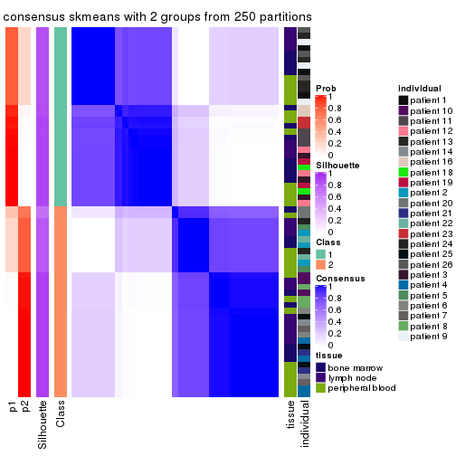</p>

</div>
<div id='tab-MAD-skmeans-consensus-heatmap-2'>
<pre><code class="r">consensus_heatmap(res, k = 3)
</code></pre>

<p>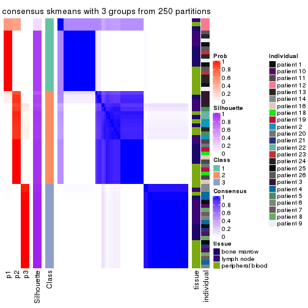</p>

</div>
<div id='tab-MAD-skmeans-consensus-heatmap-3'>
<pre><code class="r">consensus_heatmap(res, k = 4)
</code></pre>

<p>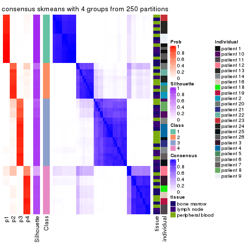</p>

</div>
<div id='tab-MAD-skmeans-consensus-heatmap-4'>
<pre><code class="r">consensus_heatmap(res, k = 5)
</code></pre>

<p>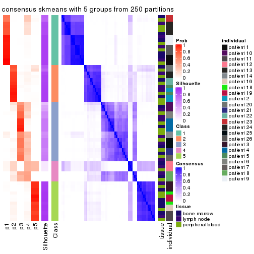</p>

</div>
<div id='tab-MAD-skmeans-consensus-heatmap-5'>
<pre><code class="r">consensus_heatmap(res, k = 6)
</code></pre>

<p>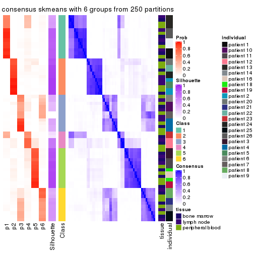</p>

</div>
</div>

Heatmaps for the membership of samples in all partitions to see how consistent they are:


<script>
$( function() {
	$( '#tabs-MAD-skmeans-membership-heatmap' ).tabs();
} );
</script>
<div id='tabs-MAD-skmeans-membership-heatmap'>
<ul>
<li><a href='#tab-MAD-skmeans-membership-heatmap-1'>k = 2</a></li>
<li><a href='#tab-MAD-skmeans-membership-heatmap-2'>k = 3</a></li>
<li><a href='#tab-MAD-skmeans-membership-heatmap-3'>k = 4</a></li>
<li><a href='#tab-MAD-skmeans-membership-heatmap-4'>k = 5</a></li>
<li><a href='#tab-MAD-skmeans-membership-heatmap-5'>k = 6</a></li>
</ul>
<div id='tab-MAD-skmeans-membership-heatmap-1'>
<pre><code class="r">membership_heatmap(res, k = 2)
</code></pre>

<p>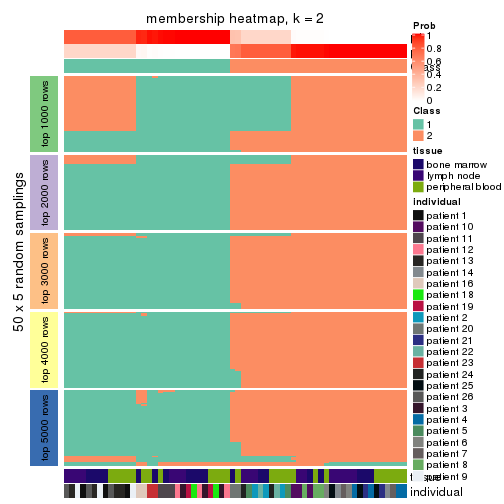</p>

</div>
<div id='tab-MAD-skmeans-membership-heatmap-2'>
<pre><code class="r">membership_heatmap(res, k = 3)
</code></pre>

<p>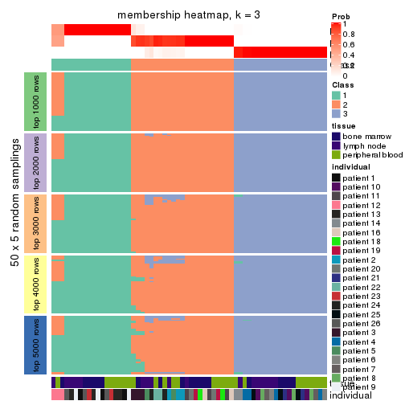</p>

</div>
<div id='tab-MAD-skmeans-membership-heatmap-3'>
<pre><code class="r">membership_heatmap(res, k = 4)
</code></pre>

<p>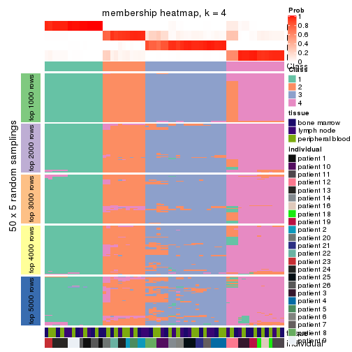</p>

</div>
<div id='tab-MAD-skmeans-membership-heatmap-4'>
<pre><code class="r">membership_heatmap(res, k = 5)
</code></pre>

<p>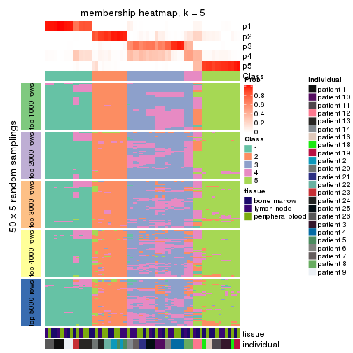</p>

</div>
<div id='tab-MAD-skmeans-membership-heatmap-5'>
<pre><code class="r">membership_heatmap(res, k = 6)
</code></pre>

<p>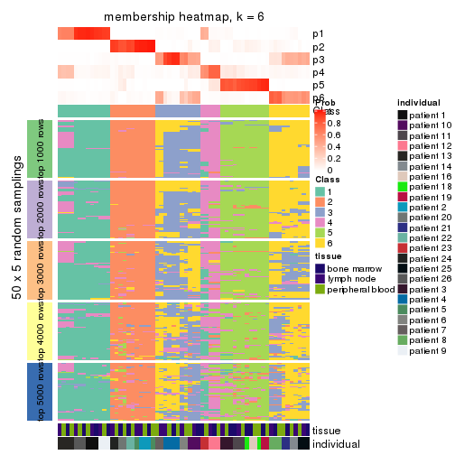</p>

</div>
</div>

As soon as we have had the classes for columns, we can look for signatures
which are significantly different between classes which can be candidate marks
for certain classes. Following are the heatmaps for signatures.


Signature heatmaps where rows are scaled:


<script>
$( function() {
	$( '#tabs-MAD-skmeans-get-signatures' ).tabs();
} );
</script>
<div id='tabs-MAD-skmeans-get-signatures'>
<ul>
<li><a href='#tab-MAD-skmeans-get-signatures-1'>k = 2</a></li>
<li><a href='#tab-MAD-skmeans-get-signatures-2'>k = 3</a></li>
<li><a href='#tab-MAD-skmeans-get-signatures-3'>k = 4</a></li>
<li><a href='#tab-MAD-skmeans-get-signatures-4'>k = 5</a></li>
<li><a href='#tab-MAD-skmeans-get-signatures-5'>k = 6</a></li>
</ul>
<div id='tab-MAD-skmeans-get-signatures-1'>
<pre><code class="r">get_signatures(res, k = 2)
</code></pre>

<p>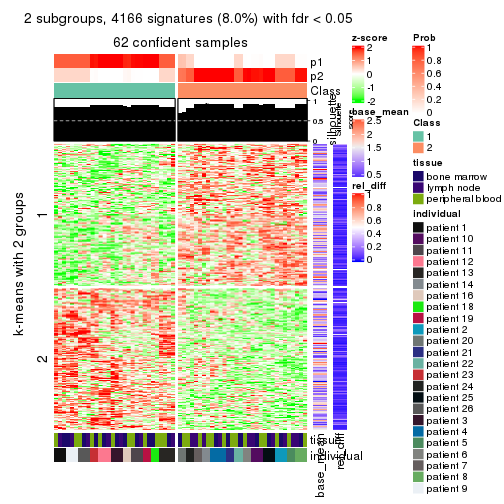</p>

</div>
<div id='tab-MAD-skmeans-get-signatures-2'>
<pre><code class="r">get_signatures(res, k = 3)
</code></pre>

<p>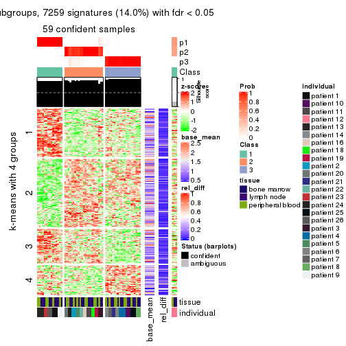</p>

</div>
<div id='tab-MAD-skmeans-get-signatures-3'>
<pre><code class="r">get_signatures(res, k = 4)
</code></pre>

<p>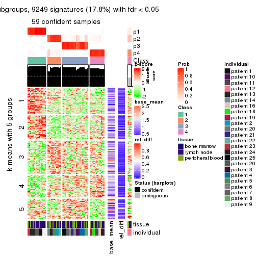</p>

</div>
<div id='tab-MAD-skmeans-get-signatures-4'>
<pre><code class="r">get_signatures(res, k = 5)
</code></pre>

<p>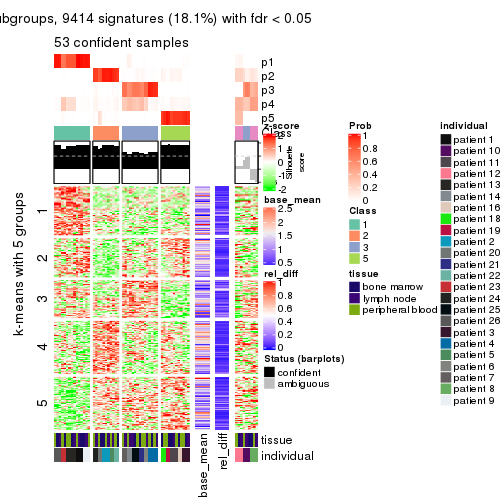</p>

</div>
<div id='tab-MAD-skmeans-get-signatures-5'>
<pre><code class="r">get_signatures(res, k = 6)
</code></pre>

<p>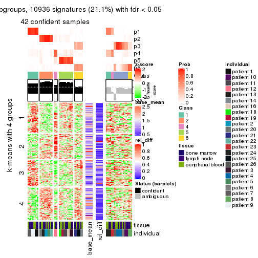</p>

</div>
</div>


Signature heatmaps where rows are not scaled:


<script>
$( function() {
	$( '#tabs-MAD-skmeans-get-signatures-no-scale' ).tabs();
} );
</script>
<div id='tabs-MAD-skmeans-get-signatures-no-scale'>
<ul>
<li><a href='#tab-MAD-skmeans-get-signatures-no-scale-1'>k = 2</a></li>
<li><a href='#tab-MAD-skmeans-get-signatures-no-scale-2'>k = 3</a></li>
<li><a href='#tab-MAD-skmeans-get-signatures-no-scale-3'>k = 4</a></li>
<li><a href='#tab-MAD-skmeans-get-signatures-no-scale-4'>k = 5</a></li>
<li><a href='#tab-MAD-skmeans-get-signatures-no-scale-5'>k = 6</a></li>
</ul>
<div id='tab-MAD-skmeans-get-signatures-no-scale-1'>
<pre><code class="r">get_signatures(res, k = 2, scale_rows = FALSE)
</code></pre>

<p>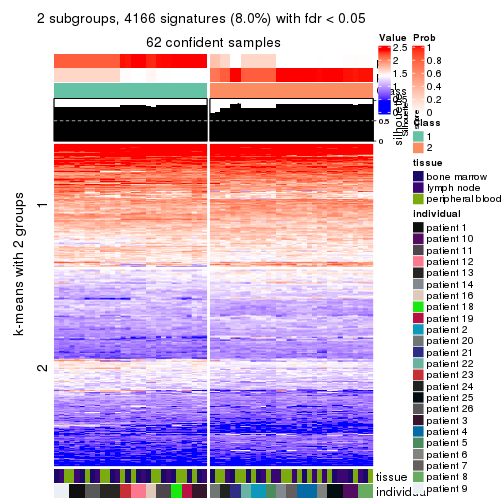</p>

</div>
<div id='tab-MAD-skmeans-get-signatures-no-scale-2'>
<pre><code class="r">get_signatures(res, k = 3, scale_rows = FALSE)
</code></pre>

<p>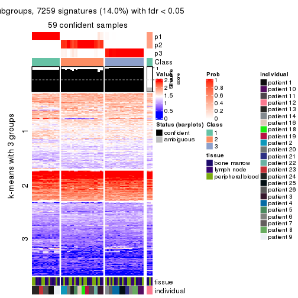</p>

</div>
<div id='tab-MAD-skmeans-get-signatures-no-scale-3'>
<pre><code class="r">get_signatures(res, k = 4, scale_rows = FALSE)
</code></pre>

<p>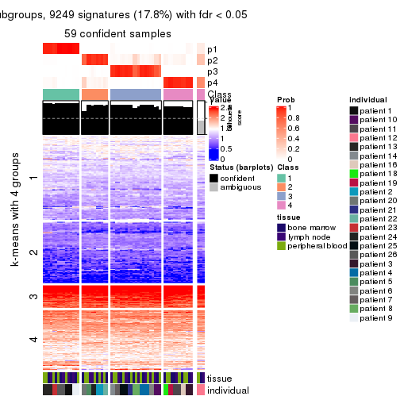</p>

</div>
<div id='tab-MAD-skmeans-get-signatures-no-scale-4'>
<pre><code class="r">get_signatures(res, k = 5, scale_rows = FALSE)
</code></pre>

<p>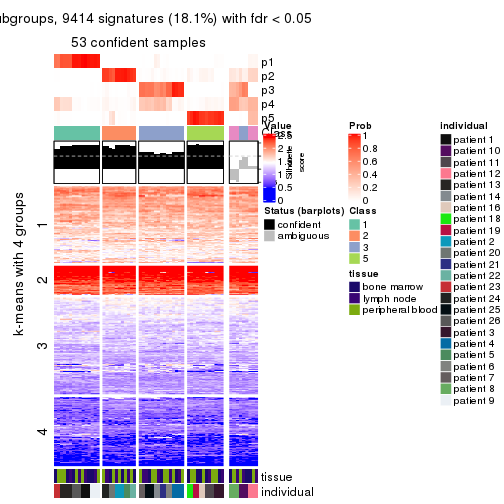</p>

</div>
<div id='tab-MAD-skmeans-get-signatures-no-scale-5'>
<pre><code class="r">get_signatures(res, k = 6, scale_rows = FALSE)
</code></pre>

<p>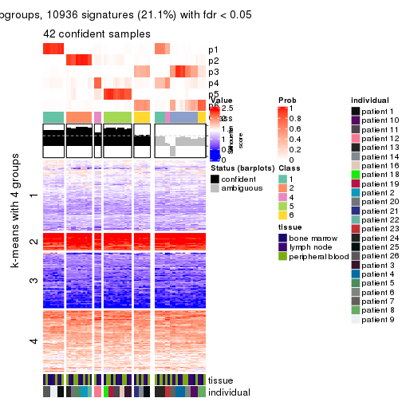</p>

</div>
</div>


Compare the overlap of signatures from different k:

```r
compare_signatures(res)
```

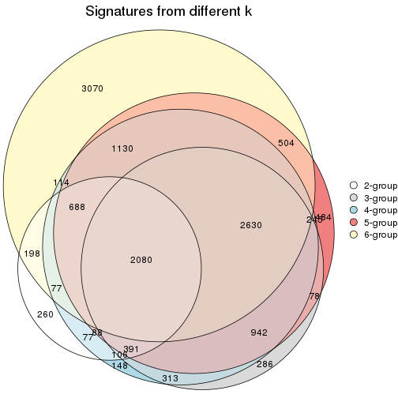

`get_signature()` returns a data frame invisibly. TO get the list of signatures, the function
call should be assigned to a variable explicitly. In following code, if `plot` argument is set
to `FALSE`, no heatmap is plotted while only the differential analysis is performed.

```r
# code only for demonstration
tb = get_signature(res, k = ..., plot = FALSE)
```

An example of the output of `tb` is:

```
#>   which_row         fdr    mean_1    mean_2 scaled_mean_1 scaled_mean_2 km
#> 1        38 0.042760348  8.373488  9.131774    -0.5533452     0.5164555  1
#> 2        40 0.018707592  7.106213  8.469186    -0.6173731     0.5762149  1
#> 3        55 0.019134737 10.221463 11.207825    -0.6159697     0.5749050  1
#> 4        59 0.006059896  5.921854  7.869574    -0.6899429     0.6439467  1
#> 5        60 0.018055526  8.928898 10.211722    -0.6204761     0.5791110  1
#> 6        98 0.009384629 15.714769 14.887706     0.6635654    -0.6193277  2
...
```

The columns in `tb` are:

1. `which_row`: row indices corresponding to the input matrix.
2. `fdr`: FDR for the differential test. 
3. `mean_x`: The mean value in group x.
4. `scaled_mean_x`: The mean value in group x after rows are scaled.
5. `km`: Row groups if k-means clustering is applied to rows.


UMAP plot which shows how samples are separated.


<script>
$( function() {
	$( '#tabs-MAD-skmeans-dimension-reduction' ).tabs();
} );
</script>
<div id='tabs-MAD-skmeans-dimension-reduction'>
<ul>
<li><a href='#tab-MAD-skmeans-dimension-reduction-1'>k = 2</a></li>
<li><a href='#tab-MAD-skmeans-dimension-reduction-2'>k = 3</a></li>
<li><a href='#tab-MAD-skmeans-dimension-reduction-3'>k = 4</a></li>
<li><a href='#tab-MAD-skmeans-dimension-reduction-4'>k = 5</a></li>
<li><a href='#tab-MAD-skmeans-dimension-reduction-5'>k = 6</a></li>
</ul>
<div id='tab-MAD-skmeans-dimension-reduction-1'>
<pre><code class="r">dimension_reduction(res, k = 2, method = &quot;UMAP&quot;)
</code></pre>

<p>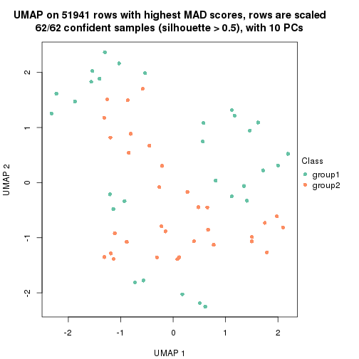</p>

</div>
<div id='tab-MAD-skmeans-dimension-reduction-2'>
<pre><code class="r">dimension_reduction(res, k = 3, method = &quot;UMAP&quot;)
</code></pre>

<p>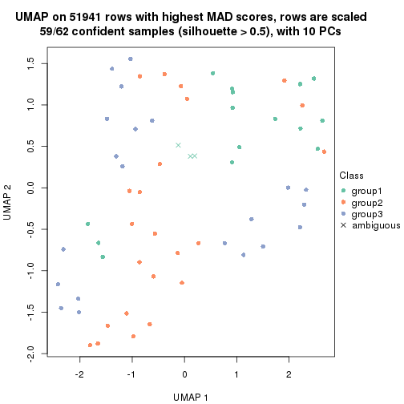</p>

</div>
<div id='tab-MAD-skmeans-dimension-reduction-3'>
<pre><code class="r">dimension_reduction(res, k = 4, method = &quot;UMAP&quot;)
</code></pre>

<p>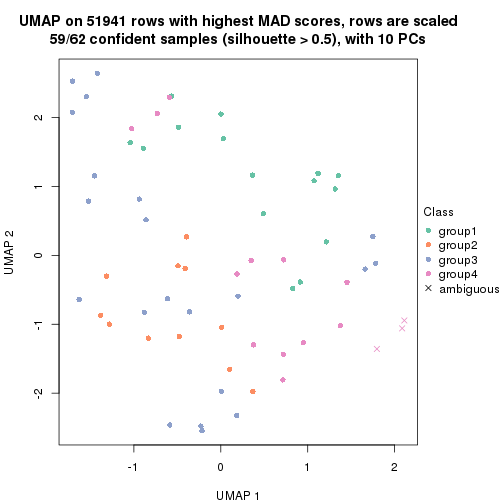</p>

</div>
<div id='tab-MAD-skmeans-dimension-reduction-4'>
<pre><code class="r">dimension_reduction(res, k = 5, method = &quot;UMAP&quot;)
</code></pre>

<p>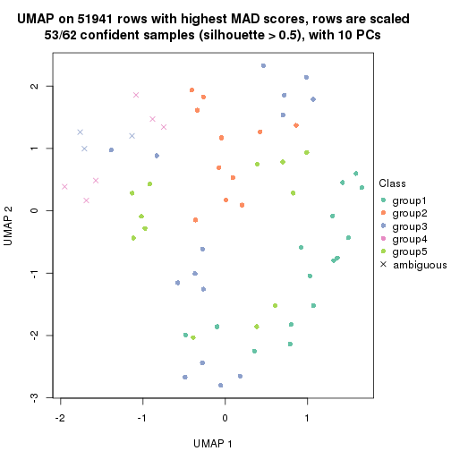</p>

</div>
<div id='tab-MAD-skmeans-dimension-reduction-5'>
<pre><code class="r">dimension_reduction(res, k = 6, method = &quot;UMAP&quot;)
</code></pre>

<p>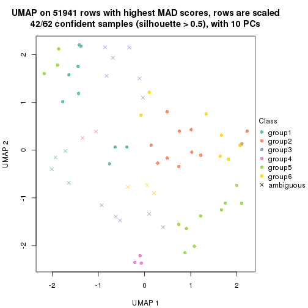</p>

</div>
</div>


Following heatmap shows how subgroups are split when increasing `k`:

```r
collect_classes(res)
```

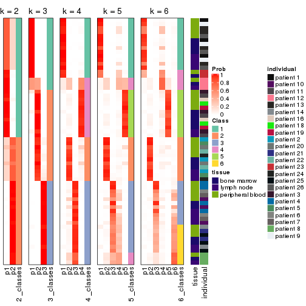


Test correlation between subgroups and known annotations. If the known
annotation is numeric, one-way ANOVA test is applied, and if the known
annotation is discrete, chi-squared contingency table test is applied.

```r
test_to_known_factors(res)
```

```
#>              n tissue(p) individual(p) k
#> MAD:skmeans 62     0.579      1.95e-05 2
#> MAD:skmeans 59     0.901      1.10e-08 3
#> MAD:skmeans 59     0.945      4.34e-12 4
#> MAD:skmeans 53     0.927      6.76e-11 5
#> MAD:skmeans 42     0.995      2.83e-11 6
```


If matrix rows can be associated to genes, consider to use `functional_enrichment(res,
...)` to perform function enrichment for the signature genes. See [this vignette](http://bioconductor.org/packages/devel/bioc/vignettes/cola/inst/doc/functional_enrichment.html) for more detailed explanations.


 

---------------------------------------------------


### MAD:pam**


The object with results only for a single top-value method and a single partition method 
can be extracted as:

```r
res = res_list["MAD", "pam"]
# you can also extract it by
# res = res_list["MAD:pam"]
```

A summary of `res` and all the functions that can be applied to it:

```r
res
```

```
#> A 'ConsensusPartition' object with k = 2, 3, 4, 5, 6.
#>   On a matrix with 51941 rows and 62 columns.
#>   Top rows (1000, 2000, 3000, 4000, 5000) are extracted by 'MAD' method.
#>   Subgroups are detected by 'pam' method.
#>   Performed in total 1250 partitions by row resampling.
#>   Best k for subgroups seems to be 6.
#> 
#> Following methods can be applied to this 'ConsensusPartition' object:
#>  [1] "cola_report"             "collect_classes"         "collect_plots"          
#>  [4] "collect_stats"           "colnames"                "compare_signatures"     
#>  [7] "consensus_heatmap"       "dimension_reduction"     "functional_enrichment"  
#> [10] "get_anno_col"            "get_anno"                "get_classes"            
#> [13] "get_consensus"           "get_matrix"              "get_membership"         
#> [16] "get_param"               "get_signatures"          "get_stats"              
#> [19] "is_best_k"               "is_stable_k"             "membership_heatmap"     
#> [22] "ncol"                    "nrow"                    "plot_ecdf"              
#> [25] "rownames"                "select_partition_number" "show"                   
#> [28] "suggest_best_k"          "test_to_known_factors"
```

`collect_plots()` function collects all the plots made from `res` for all `k` (number of partitions)
into one single page to provide an easy and fast comparison between different `k`.

```r
collect_plots(res)
```

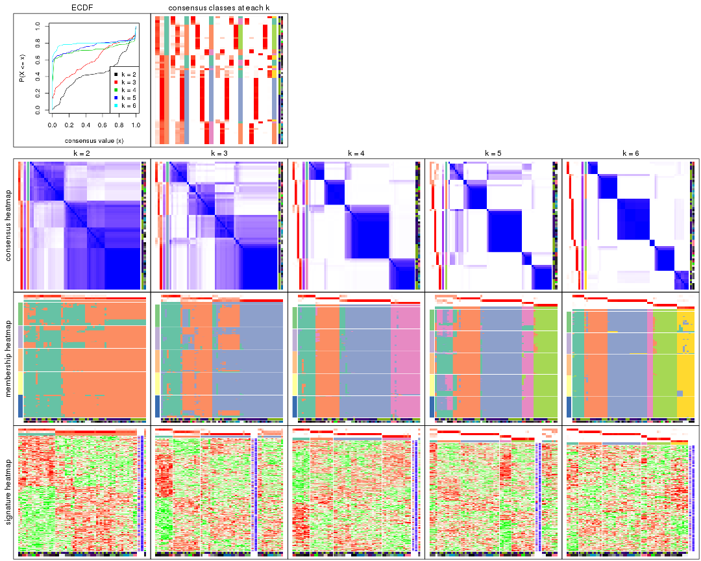

The plots are:

- The first row: a plot of the ECDF (empirical cumulative distribution
  function) curves of the consensus matrix for each `k` and the heatmap of
  predicted classes for each `k`.
- The second row: heatmaps of the consensus matrix for each `k`.
- The third row: heatmaps of the membership matrix for each `k`.
- The fouth row: heatmaps of the signatures for each `k`.

All the plots in panels can be made by individual functions and they are
plotted later in this section.

`select_partition_number()` produces several plots showing different
statistics for choosing "optimized" `k`. There are following statistics:

- ECDF curves of the consensus matrix for each `k`;
- 1-PAC. [The PAC
  score](https://en.wikipedia.org/wiki/Consensus_clustering#Over-interpretation_potential_of_consensus_clustering)
  measures the proportion of the ambiguous subgrouping.
- Mean silhouette score.
- Concordance. The mean probability of fiting the consensus class ids in all
  partitions.
- Area increased. Denote $A_k$ as the area under the ECDF curve for current
  `k`, the area increased is defined as $A_k - A_{k-1}$.
- Rand index. The percent of pairs of samples that are both in a same cluster
  or both are not in a same cluster in the partition of k and k-1.
- Jaccard index. The ratio of pairs of samples are both in a same cluster in
  the partition of k and k-1 and the pairs of samples are both in a same
  cluster in the partition k or k-1.

The detailed explanations of these statistics can be found in [the _cola_
vignette](http://bioconductor.org/packages/devel/bioc/vignettes/cola/inst/doc/cola.html#toc_13).

Generally speaking, lower PAC score, higher mean silhouette score or higher
concordance corresponds to better partition. Rand index and Jaccard index
measure how similar the current partition is compared to partition with `k-1`.
If they are too similar, we won't accept `k` is better than `k-1`.

```r
select_partition_number(res)
```

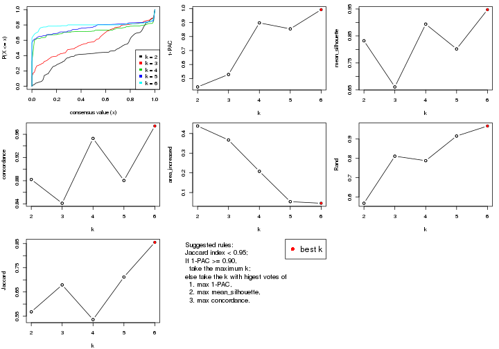

The numeric values for all these statistics can be obtained by `get_stats()`.

```r
get_stats(res)
```

```
#>   k 1-PAC mean_silhouette concordance area_increased  Rand Jaccard
#> 2 2 0.440           0.832       0.882         0.4381 0.568   0.568
#> 3 3 0.529           0.661       0.841         0.3670 0.811   0.679
#> 4 4 0.898           0.894       0.953         0.2078 0.788   0.536
#> 5 5 0.855           0.802       0.880         0.0538 0.915   0.712
#> 6 6 0.992           0.947       0.974         0.0456 0.967   0.855
```

`suggest_best_k()` suggests the best $k$ based on these statistics. The rules are as follows:

- All $k$ with Jaccard index larger than 0.95 are removed because increasing
  $k$ does not provide enough extra information. If all $k$ are removed, it is
  marked as no subgroup is detected.
- For all $k$ with 1-PAC score larger than 0.9, the maximal $k$ is taken as
  the best $k$, and other $k$ are marked as optional $k$.
- If it does not fit the second rule. The $k$ with the maximal vote of the
  highest 1-PAC score, highest mean silhouette, and highest concordance is
  taken as the best $k$.

```r
suggest_best_k(res)
```

```
#> [1] 6
```


Following shows the table of the partitions (You need to click the **show/hide
code output** link to see it). The membership matrix (columns with name `p*`)
is inferred by
[`clue::cl_consensus()`](https://www.rdocumentation.org/link/cl_consensus?package=clue)
function with the `SE` method. Basically the value in the membership matrix
represents the probability to belong to a certain group. The finall class
label for an item is determined with the group with highest probability it
belongs to.

In `get_classes()` function, the entropy is calculated from the membership
matrix and the silhouette score is calculated from the consensus matrix.


<script>
$( function() {
	$( '#tabs-MAD-pam-get-classes' ).tabs();
} );
</script>
<div id='tabs-MAD-pam-get-classes'>
<ul>
<li><a href='#tab-MAD-pam-get-classes-1'>k = 2</a></li>
<li><a href='#tab-MAD-pam-get-classes-2'>k = 3</a></li>
<li><a href='#tab-MAD-pam-get-classes-3'>k = 4</a></li>
<li><a href='#tab-MAD-pam-get-classes-4'>k = 5</a></li>
<li><a href='#tab-MAD-pam-get-classes-5'>k = 6</a></li>
</ul>

<div id='tab-MAD-pam-get-classes-1'>
<p><a id='tab-MAD-pam-get-classes-1-a' style='color:#0366d6' href='#'>show/hide code output</a></p>
<pre><code class="r">cbind(get_classes(res, k = 2), get_membership(res, k = 2))
</code></pre>

<pre><code>#&gt;           class entropy silhouette    p1    p2
#&gt; GSM525314     2  0.4939      0.844 0.108 0.892
#&gt; GSM525315     2  0.7602      0.748 0.220 0.780
#&gt; GSM525316     1  0.6148      0.839 0.848 0.152
#&gt; GSM525317     2  0.0000      0.899 0.000 1.000
#&gt; GSM525318     2  0.0000      0.899 0.000 1.000
#&gt; GSM525319     2  0.7453      0.757 0.212 0.788
#&gt; GSM525320     2  0.0000      0.899 0.000 1.000
#&gt; GSM525321     2  0.0000      0.899 0.000 1.000
#&gt; GSM525322     2  0.0000      0.899 0.000 1.000
#&gt; GSM525323     2  0.3879      0.863 0.076 0.924
#&gt; GSM525324     2  0.4690      0.845 0.100 0.900
#&gt; GSM525325     1  0.4562      0.861 0.904 0.096
#&gt; GSM525326     1  0.9286      0.553 0.656 0.344
#&gt; GSM525327     2  0.5294      0.840 0.120 0.880
#&gt; GSM525328     1  0.8386      0.697 0.732 0.268
#&gt; GSM525329     2  0.0000      0.899 0.000 1.000
#&gt; GSM525330     1  0.4562      0.861 0.904 0.096
#&gt; GSM525331     1  0.5629      0.866 0.868 0.132
#&gt; GSM525332     1  0.6531      0.859 0.832 0.168
#&gt; GSM525333     1  0.5842      0.845 0.860 0.140
#&gt; GSM525334     2  0.0000      0.899 0.000 1.000
#&gt; GSM525335     2  0.7453      0.757 0.212 0.788
#&gt; GSM525336     1  0.0672      0.839 0.992 0.008
#&gt; GSM525337     2  0.7528      0.752 0.216 0.784
#&gt; GSM525338     2  0.0000      0.899 0.000 1.000
#&gt; GSM525339     2  0.4298      0.867 0.088 0.912
#&gt; GSM525340     1  0.8555      0.683 0.720 0.280
#&gt; GSM525341     2  0.7219      0.770 0.200 0.800
#&gt; GSM525342     1  0.6148      0.827 0.848 0.152
#&gt; GSM525343     2  0.0000      0.899 0.000 1.000
#&gt; GSM525344     2  0.0000      0.899 0.000 1.000
#&gt; GSM525345     2  0.2778      0.878 0.048 0.952
#&gt; GSM525346     2  0.0000      0.899 0.000 1.000
#&gt; GSM525347     1  0.4431      0.861 0.908 0.092
#&gt; GSM525348     2  0.6973      0.787 0.188 0.812
#&gt; GSM525349     2  0.9491      0.414 0.368 0.632
#&gt; GSM525350     1  0.4562      0.861 0.904 0.096
#&gt; GSM525351     1  0.4298      0.861 0.912 0.088
#&gt; GSM525352     1  0.5946      0.864 0.856 0.144
#&gt; GSM525353     1  0.8081      0.738 0.752 0.248
#&gt; GSM525354     2  0.0000      0.899 0.000 1.000
#&gt; GSM525355     2  0.6438      0.798 0.164 0.836
#&gt; GSM525356     1  0.6531      0.799 0.832 0.168
#&gt; GSM525357     2  0.0000      0.899 0.000 1.000
#&gt; GSM525358     2  0.4939      0.853 0.108 0.892
#&gt; GSM525359     2  0.4298      0.855 0.088 0.912
#&gt; GSM525360     2  0.6712      0.789 0.176 0.824
#&gt; GSM525361     1  0.5946      0.832 0.856 0.144
#&gt; GSM525362     2  0.0000      0.899 0.000 1.000
#&gt; GSM525363     2  0.7056      0.801 0.192 0.808
#&gt; GSM525364     2  0.0000      0.899 0.000 1.000
#&gt; GSM525365     2  0.0000      0.899 0.000 1.000
#&gt; GSM525366     2  0.0000      0.899 0.000 1.000
#&gt; GSM525367     2  0.3733      0.864 0.072 0.928
#&gt; GSM525368     2  0.0000      0.899 0.000 1.000
#&gt; GSM525369     1  0.1633      0.847 0.976 0.024
#&gt; GSM525370     2  0.9044      0.669 0.320 0.680
#&gt; GSM525371     2  0.4562      0.849 0.096 0.904
#&gt; GSM525372     2  0.0376      0.897 0.004 0.996
#&gt; GSM525373     2  0.7299      0.772 0.204 0.796
#&gt; GSM525374     2  0.0000      0.899 0.000 1.000
#&gt; GSM525375     2  0.4562      0.849 0.096 0.904
</code></pre>

<script>
$('#tab-MAD-pam-get-classes-1-a').parent().next().next().hide();
$('#tab-MAD-pam-get-classes-1-a').click(function(){
  $('#tab-MAD-pam-get-classes-1-a').parent().next().next().toggle();
  return(false);
});
</script>
</div>

<div id='tab-MAD-pam-get-classes-2'>
<p><a id='tab-MAD-pam-get-classes-2-a' style='color:#0366d6' href='#'>show/hide code output</a></p>
<pre><code class="r">cbind(get_classes(res, k = 3), get_membership(res, k = 3))
</code></pre>

<pre><code>#&gt;           class entropy silhouette    p1    p2    p3
#&gt; GSM525314     1  0.3879     0.7561 0.848 0.000 0.152
#&gt; GSM525315     3  0.6244     0.4450 0.000 0.440 0.560
#&gt; GSM525316     2  0.8132     0.5161 0.104 0.612 0.284
#&gt; GSM525317     3  0.0000     0.7992 0.000 0.000 1.000
#&gt; GSM525318     3  0.0000     0.7992 0.000 0.000 1.000
#&gt; GSM525319     3  0.6267     0.4260 0.000 0.452 0.548
#&gt; GSM525320     3  0.0000     0.7992 0.000 0.000 1.000
#&gt; GSM525321     3  0.0000     0.7992 0.000 0.000 1.000
#&gt; GSM525322     3  0.0000     0.7992 0.000 0.000 1.000
#&gt; GSM525323     3  0.6016     0.5053 0.256 0.020 0.724
#&gt; GSM525324     3  0.5733     0.5771 0.000 0.324 0.676
#&gt; GSM525325     2  0.1289     0.7399 0.032 0.968 0.000
#&gt; GSM525326     2  0.4842     0.5237 0.000 0.776 0.224
#&gt; GSM525327     1  0.1289     0.8407 0.968 0.000 0.032
#&gt; GSM525328     1  0.0237     0.8366 0.996 0.000 0.004
#&gt; GSM525329     3  0.0000     0.7992 0.000 0.000 1.000
#&gt; GSM525330     2  0.1289     0.7399 0.032 0.968 0.000
#&gt; GSM525331     2  0.4731     0.7136 0.032 0.840 0.128
#&gt; GSM525332     2  0.5826     0.6652 0.032 0.764 0.204
#&gt; GSM525333     2  0.1031     0.7244 0.000 0.976 0.024
#&gt; GSM525334     3  0.0000     0.7992 0.000 0.000 1.000
#&gt; GSM525335     3  0.6260     0.4333 0.000 0.448 0.552
#&gt; GSM525336     1  0.2066     0.8034 0.940 0.060 0.000
#&gt; GSM525337     3  0.6308     0.3401 0.000 0.492 0.508
#&gt; GSM525338     3  0.0000     0.7992 0.000 0.000 1.000
#&gt; GSM525339     3  0.5397     0.5492 0.280 0.000 0.720
#&gt; GSM525340     1  0.0237     0.8366 0.996 0.000 0.004
#&gt; GSM525341     3  0.6215     0.4638 0.000 0.428 0.572
#&gt; GSM525342     2  0.8168     0.5148 0.108 0.612 0.280
#&gt; GSM525343     3  0.0000     0.7992 0.000 0.000 1.000
#&gt; GSM525344     3  0.0237     0.7975 0.000 0.004 0.996
#&gt; GSM525345     3  0.1529     0.7775 0.040 0.000 0.960
#&gt; GSM525346     3  0.0000     0.7992 0.000 0.000 1.000
#&gt; GSM525347     2  0.1289     0.7399 0.032 0.968 0.000
#&gt; GSM525348     3  0.6704     0.5086 0.016 0.376 0.608
#&gt; GSM525349     1  0.1267     0.8400 0.972 0.004 0.024
#&gt; GSM525350     2  0.1525     0.7416 0.032 0.964 0.004
#&gt; GSM525351     2  0.2443     0.7437 0.032 0.940 0.028
#&gt; GSM525352     2  0.8321     0.4775 0.228 0.624 0.148
#&gt; GSM525353     2  0.2878     0.6889 0.000 0.904 0.096
#&gt; GSM525354     3  0.0000     0.7992 0.000 0.000 1.000
#&gt; GSM525355     3  0.6154     0.4905 0.000 0.408 0.592
#&gt; GSM525356     1  0.4291     0.6662 0.820 0.180 0.000
#&gt; GSM525357     3  0.0000     0.7992 0.000 0.000 1.000
#&gt; GSM525358     3  0.5968     0.4059 0.364 0.000 0.636
#&gt; GSM525359     1  0.3551     0.7743 0.868 0.000 0.132
#&gt; GSM525360     3  0.6180     0.4804 0.000 0.416 0.584
#&gt; GSM525361     2  0.8230     0.5117 0.112 0.608 0.280
#&gt; GSM525362     3  0.0000     0.7992 0.000 0.000 1.000
#&gt; GSM525363     3  0.6140     0.4951 0.000 0.404 0.596
#&gt; GSM525364     3  0.0000     0.7992 0.000 0.000 1.000
#&gt; GSM525365     3  0.0000     0.7992 0.000 0.000 1.000
#&gt; GSM525366     3  0.0000     0.7992 0.000 0.000 1.000
#&gt; GSM525367     3  0.2878     0.7409 0.096 0.000 0.904
#&gt; GSM525368     3  0.0000     0.7992 0.000 0.000 1.000
#&gt; GSM525369     2  0.2066     0.7330 0.060 0.940 0.000
#&gt; GSM525370     2  0.9877    -0.0588 0.260 0.388 0.352
#&gt; GSM525371     1  0.1289     0.8407 0.968 0.000 0.032
#&gt; GSM525372     3  0.0000     0.7992 0.000 0.000 1.000
#&gt; GSM525373     3  0.6302     0.3655 0.000 0.480 0.520
#&gt; GSM525374     3  0.0000     0.7992 0.000 0.000 1.000
#&gt; GSM525375     1  0.6267     0.0857 0.548 0.000 0.452
</code></pre>

<script>
$('#tab-MAD-pam-get-classes-2-a').parent().next().next().hide();
$('#tab-MAD-pam-get-classes-2-a').click(function(){
  $('#tab-MAD-pam-get-classes-2-a').parent().next().next().toggle();
  return(false);
});
</script>
</div>

<div id='tab-MAD-pam-get-classes-3'>
<p><a id='tab-MAD-pam-get-classes-3-a' style='color:#0366d6' href='#'>show/hide code output</a></p>
<pre><code class="r">cbind(get_classes(res, k = 4), get_membership(res, k = 4))
</code></pre>

<pre><code>#&gt;           class entropy silhouette    p1    p2    p3    p4
#&gt; GSM525314     1  0.2589     0.8367 0.884 0.000 0.116 0.000
#&gt; GSM525315     4  0.0469     0.9575 0.000 0.000 0.012 0.988
#&gt; GSM525316     2  0.0188     0.9657 0.004 0.996 0.000 0.000
#&gt; GSM525317     3  0.0000     0.9390 0.000 0.000 1.000 0.000
#&gt; GSM525318     3  0.0000     0.9390 0.000 0.000 1.000 0.000
#&gt; GSM525319     4  0.0469     0.9575 0.000 0.000 0.012 0.988
#&gt; GSM525320     3  0.0000     0.9390 0.000 0.000 1.000 0.000
#&gt; GSM525321     3  0.0000     0.9390 0.000 0.000 1.000 0.000
#&gt; GSM525322     3  0.0336     0.9338 0.000 0.000 0.992 0.008
#&gt; GSM525323     3  0.4228     0.6684 0.232 0.008 0.760 0.000
#&gt; GSM525324     4  0.2530     0.8581 0.000 0.000 0.112 0.888
#&gt; GSM525325     2  0.0188     0.9662 0.000 0.996 0.000 0.004
#&gt; GSM525326     4  0.1706     0.9248 0.000 0.036 0.016 0.948
#&gt; GSM525327     1  0.0000     0.9205 1.000 0.000 0.000 0.000
#&gt; GSM525328     1  0.0000     0.9205 1.000 0.000 0.000 0.000
#&gt; GSM525329     3  0.0000     0.9390 0.000 0.000 1.000 0.000
#&gt; GSM525330     2  0.0188     0.9662 0.000 0.996 0.000 0.004
#&gt; GSM525331     2  0.0188     0.9661 0.000 0.996 0.004 0.000
#&gt; GSM525332     2  0.0188     0.9661 0.000 0.996 0.004 0.000
#&gt; GSM525333     4  0.0469     0.9471 0.000 0.012 0.000 0.988
#&gt; GSM525334     3  0.0000     0.9390 0.000 0.000 1.000 0.000
#&gt; GSM525335     4  0.0469     0.9575 0.000 0.000 0.012 0.988
#&gt; GSM525336     1  0.1792     0.8851 0.932 0.068 0.000 0.000
#&gt; GSM525337     4  0.0469     0.9575 0.000 0.000 0.012 0.988
#&gt; GSM525338     3  0.0000     0.9390 0.000 0.000 1.000 0.000
#&gt; GSM525339     3  0.4677     0.5443 0.316 0.004 0.680 0.000
#&gt; GSM525340     1  0.0000     0.9205 1.000 0.000 0.000 0.000
#&gt; GSM525341     4  0.0469     0.9575 0.000 0.000 0.012 0.988
#&gt; GSM525342     2  0.0188     0.9657 0.004 0.996 0.000 0.000
#&gt; GSM525343     3  0.0000     0.9390 0.000 0.000 1.000 0.000
#&gt; GSM525344     3  0.0469     0.9301 0.000 0.000 0.988 0.012
#&gt; GSM525345     3  0.0336     0.9340 0.008 0.000 0.992 0.000
#&gt; GSM525346     3  0.0000     0.9390 0.000 0.000 1.000 0.000
#&gt; GSM525347     2  0.3688     0.7428 0.000 0.792 0.000 0.208
#&gt; GSM525348     4  0.4431     0.6313 0.004 0.004 0.252 0.740
#&gt; GSM525349     1  0.0000     0.9205 1.000 0.000 0.000 0.000
#&gt; GSM525350     2  0.0188     0.9662 0.000 0.996 0.000 0.004
#&gt; GSM525351     2  0.0188     0.9661 0.000 0.996 0.004 0.000
#&gt; GSM525352     2  0.0188     0.9661 0.000 0.996 0.004 0.000
#&gt; GSM525353     4  0.0524     0.9511 0.000 0.008 0.004 0.988
#&gt; GSM525354     3  0.0000     0.9390 0.000 0.000 1.000 0.000
#&gt; GSM525355     4  0.0469     0.9575 0.000 0.000 0.012 0.988
#&gt; GSM525356     1  0.4103     0.6516 0.744 0.256 0.000 0.000
#&gt; GSM525357     3  0.0000     0.9390 0.000 0.000 1.000 0.000
#&gt; GSM525358     3  0.5173     0.5121 0.320 0.020 0.660 0.000
#&gt; GSM525359     1  0.2530     0.8350 0.888 0.000 0.112 0.000
#&gt; GSM525360     4  0.0469     0.9575 0.000 0.000 0.012 0.988
#&gt; GSM525361     2  0.0188     0.9657 0.004 0.996 0.000 0.000
#&gt; GSM525362     3  0.0000     0.9390 0.000 0.000 1.000 0.000
#&gt; GSM525363     4  0.0469     0.9575 0.000 0.000 0.012 0.988
#&gt; GSM525364     3  0.0000     0.9390 0.000 0.000 1.000 0.000
#&gt; GSM525365     3  0.0000     0.9390 0.000 0.000 1.000 0.000
#&gt; GSM525366     3  0.0000     0.9390 0.000 0.000 1.000 0.000
#&gt; GSM525367     3  0.0707     0.9256 0.020 0.000 0.980 0.000
#&gt; GSM525368     3  0.0000     0.9390 0.000 0.000 1.000 0.000
#&gt; GSM525369     2  0.1940     0.9013 0.000 0.924 0.000 0.076
#&gt; GSM525370     4  0.1639     0.9244 0.036 0.004 0.008 0.952
#&gt; GSM525371     1  0.0000     0.9205 1.000 0.000 0.000 0.000
#&gt; GSM525372     3  0.0000     0.9390 0.000 0.000 1.000 0.000
#&gt; GSM525373     4  0.0469     0.9575 0.000 0.000 0.012 0.988
#&gt; GSM525374     3  0.0000     0.9390 0.000 0.000 1.000 0.000
#&gt; GSM525375     3  0.4998     0.0973 0.488 0.000 0.512 0.000
</code></pre>

<script>
$('#tab-MAD-pam-get-classes-3-a').parent().next().next().hide();
$('#tab-MAD-pam-get-classes-3-a').click(function(){
  $('#tab-MAD-pam-get-classes-3-a').parent().next().next().toggle();
  return(false);
});
</script>
</div>

<div id='tab-MAD-pam-get-classes-4'>
<p><a id='tab-MAD-pam-get-classes-4-a' style='color:#0366d6' href='#'>show/hide code output</a></p>
<pre><code class="r">cbind(get_classes(res, k = 5), get_membership(res, k = 5))
</code></pre>

<pre><code>#&gt;           class entropy silhouette    p1    p2    p3    p4    p5
#&gt; GSM525314     1  0.5103      0.208 0.512 0.000 0.036 0.452 0.000
#&gt; GSM525315     2  0.0000      0.906 0.000 1.000 0.000 0.000 0.000
#&gt; GSM525316     5  0.0000      0.966 0.000 0.000 0.000 0.000 1.000
#&gt; GSM525317     3  0.0000      0.966 0.000 0.000 1.000 0.000 0.000
#&gt; GSM525318     3  0.0000      0.966 0.000 0.000 1.000 0.000 0.000
#&gt; GSM525319     2  0.0000      0.906 0.000 1.000 0.000 0.000 0.000
#&gt; GSM525320     3  0.0000      0.966 0.000 0.000 1.000 0.000 0.000
#&gt; GSM525321     3  0.0000      0.966 0.000 0.000 1.000 0.000 0.000
#&gt; GSM525322     3  0.0290      0.956 0.000 0.008 0.992 0.000 0.000
#&gt; GSM525323     1  0.6047      0.513 0.500 0.000 0.376 0.124 0.000
#&gt; GSM525324     2  0.3274      0.612 0.000 0.780 0.220 0.000 0.000
#&gt; GSM525325     5  0.0000      0.966 0.000 0.000 0.000 0.000 1.000
#&gt; GSM525326     2  0.4304      0.497 0.484 0.516 0.000 0.000 0.000
#&gt; GSM525327     4  0.0000      0.924 0.000 0.000 0.000 1.000 0.000
#&gt; GSM525328     4  0.0000      0.924 0.000 0.000 0.000 1.000 0.000
#&gt; GSM525329     3  0.0000      0.966 0.000 0.000 1.000 0.000 0.000
#&gt; GSM525330     5  0.0000      0.966 0.000 0.000 0.000 0.000 1.000
#&gt; GSM525331     5  0.0000      0.966 0.000 0.000 0.000 0.000 1.000
#&gt; GSM525332     5  0.0000      0.966 0.000 0.000 0.000 0.000 1.000
#&gt; GSM525333     2  0.0162      0.904 0.000 0.996 0.000 0.000 0.004
#&gt; GSM525334     3  0.0000      0.966 0.000 0.000 1.000 0.000 0.000
#&gt; GSM525335     2  0.0000      0.906 0.000 1.000 0.000 0.000 0.000
#&gt; GSM525336     4  0.1270      0.888 0.000 0.000 0.000 0.948 0.052
#&gt; GSM525337     2  0.1082      0.883 0.000 0.964 0.008 0.000 0.028
#&gt; GSM525338     3  0.0000      0.966 0.000 0.000 1.000 0.000 0.000
#&gt; GSM525339     1  0.6363      0.572 0.516 0.000 0.316 0.164 0.004
#&gt; GSM525340     1  0.4304      0.114 0.516 0.000 0.000 0.484 0.000
#&gt; GSM525341     2  0.0000      0.906 0.000 1.000 0.000 0.000 0.000
#&gt; GSM525342     5  0.0000      0.966 0.000 0.000 0.000 0.000 1.000
#&gt; GSM525343     3  0.0000      0.966 0.000 0.000 1.000 0.000 0.000
#&gt; GSM525344     3  0.0510      0.946 0.000 0.016 0.984 0.000 0.000
#&gt; GSM525345     1  0.4307      0.250 0.500 0.000 0.500 0.000 0.000
#&gt; GSM525346     3  0.0000      0.966 0.000 0.000 1.000 0.000 0.000
#&gt; GSM525347     5  0.3336      0.709 0.000 0.228 0.000 0.000 0.772
#&gt; GSM525348     1  0.6012     -0.408 0.484 0.400 0.116 0.000 0.000
#&gt; GSM525349     4  0.0000      0.924 0.000 0.000 0.000 1.000 0.000
#&gt; GSM525350     5  0.0000      0.966 0.000 0.000 0.000 0.000 1.000
#&gt; GSM525351     5  0.0000      0.966 0.000 0.000 0.000 0.000 1.000
#&gt; GSM525352     5  0.0000      0.966 0.000 0.000 0.000 0.000 1.000
#&gt; GSM525353     2  0.0000      0.906 0.000 1.000 0.000 0.000 0.000
#&gt; GSM525354     3  0.0000      0.966 0.000 0.000 1.000 0.000 0.000
#&gt; GSM525355     2  0.0000      0.906 0.000 1.000 0.000 0.000 0.000
#&gt; GSM525356     4  0.4021      0.713 0.052 0.000 0.000 0.780 0.168
#&gt; GSM525357     3  0.0000      0.966 0.000 0.000 1.000 0.000 0.000
#&gt; GSM525358     1  0.6736      0.563 0.488 0.000 0.324 0.172 0.016
#&gt; GSM525359     1  0.5223      0.209 0.512 0.000 0.044 0.444 0.000
#&gt; GSM525360     2  0.0000      0.906 0.000 1.000 0.000 0.000 0.000
#&gt; GSM525361     5  0.0000      0.966 0.000 0.000 0.000 0.000 1.000
#&gt; GSM525362     3  0.0000      0.966 0.000 0.000 1.000 0.000 0.000
#&gt; GSM525363     2  0.0000      0.906 0.000 1.000 0.000 0.000 0.000
#&gt; GSM525364     3  0.0000      0.966 0.000 0.000 1.000 0.000 0.000
#&gt; GSM525365     3  0.0000      0.966 0.000 0.000 1.000 0.000 0.000
#&gt; GSM525366     3  0.0000      0.966 0.000 0.000 1.000 0.000 0.000
#&gt; GSM525367     3  0.4641     -0.269 0.456 0.000 0.532 0.012 0.000
#&gt; GSM525368     3  0.0000      0.966 0.000 0.000 1.000 0.000 0.000
#&gt; GSM525369     5  0.1792      0.886 0.000 0.084 0.000 0.000 0.916
#&gt; GSM525370     2  0.4304      0.497 0.484 0.516 0.000 0.000 0.000
#&gt; GSM525371     4  0.0000      0.924 0.000 0.000 0.000 1.000 0.000
#&gt; GSM525372     3  0.0000      0.966 0.000 0.000 1.000 0.000 0.000
#&gt; GSM525373     2  0.0000      0.906 0.000 1.000 0.000 0.000 0.000
#&gt; GSM525374     3  0.0000      0.966 0.000 0.000 1.000 0.000 0.000
#&gt; GSM525375     1  0.6394      0.558 0.504 0.000 0.292 0.204 0.000
</code></pre>

<script>
$('#tab-MAD-pam-get-classes-4-a').parent().next().next().hide();
$('#tab-MAD-pam-get-classes-4-a').click(function(){
  $('#tab-MAD-pam-get-classes-4-a').parent().next().next().toggle();
  return(false);
});
</script>
</div>

<div id='tab-MAD-pam-get-classes-5'>
<p><a id='tab-MAD-pam-get-classes-5-a' style='color:#0366d6' href='#'>show/hide code output</a></p>
<pre><code class="r">cbind(get_classes(res, k = 6), get_membership(res, k = 6))
</code></pre>

<pre><code>#&gt;           class entropy silhouette    p1    p2    p3    p4    p5    p6
#&gt; GSM525314     6  0.0632      0.904 0.024 0.000 0.000 0.000 0.000 0.976
#&gt; GSM525315     2  0.0000      0.954 0.000 1.000 0.000 0.000 0.000 0.000
#&gt; GSM525316     5  0.0000      0.963 0.000 0.000 0.000 0.000 1.000 0.000
#&gt; GSM525317     3  0.0146      0.994 0.000 0.000 0.996 0.000 0.000 0.004
#&gt; GSM525318     3  0.0146      0.994 0.000 0.000 0.996 0.000 0.000 0.004
#&gt; GSM525319     2  0.0000      0.954 0.000 1.000 0.000 0.000 0.000 0.000
#&gt; GSM525320     3  0.0146      0.994 0.000 0.000 0.996 0.000 0.000 0.004
#&gt; GSM525321     3  0.0000      0.994 0.000 0.000 1.000 0.000 0.000 0.000
#&gt; GSM525322     3  0.0622      0.982 0.000 0.008 0.980 0.000 0.000 0.012
#&gt; GSM525323     6  0.1267      0.904 0.000 0.000 0.060 0.000 0.000 0.940
#&gt; GSM525324     2  0.3371      0.517 0.000 0.708 0.292 0.000 0.000 0.000
#&gt; GSM525325     5  0.0000      0.963 0.000 0.000 0.000 0.000 1.000 0.000
#&gt; GSM525326     4  0.0000      1.000 0.000 0.000 0.000 1.000 0.000 0.000
#&gt; GSM525327     1  0.0000      0.973 1.000 0.000 0.000 0.000 0.000 0.000
#&gt; GSM525328     1  0.0000      0.973 1.000 0.000 0.000 0.000 0.000 0.000
#&gt; GSM525329     3  0.0363      0.988 0.000 0.000 0.988 0.000 0.000 0.012
#&gt; GSM525330     5  0.0000      0.963 0.000 0.000 0.000 0.000 1.000 0.000
#&gt; GSM525331     5  0.0000      0.963 0.000 0.000 0.000 0.000 1.000 0.000
#&gt; GSM525332     5  0.0000      0.963 0.000 0.000 0.000 0.000 1.000 0.000
#&gt; GSM525333     2  0.0146      0.951 0.000 0.996 0.000 0.000 0.004 0.000
#&gt; GSM525334     3  0.0363      0.988 0.000 0.000 0.988 0.000 0.000 0.012
#&gt; GSM525335     2  0.0000      0.954 0.000 1.000 0.000 0.000 0.000 0.000
#&gt; GSM525336     1  0.0858      0.951 0.968 0.000 0.000 0.000 0.028 0.004
#&gt; GSM525337     2  0.1461      0.900 0.000 0.940 0.016 0.000 0.044 0.000
#&gt; GSM525338     3  0.0000      0.994 0.000 0.000 1.000 0.000 0.000 0.000
#&gt; GSM525339     6  0.1867      0.905 0.020 0.000 0.064 0.000 0.000 0.916
#&gt; GSM525340     6  0.0458      0.904 0.016 0.000 0.000 0.000 0.000 0.984
#&gt; GSM525341     2  0.0000      0.954 0.000 1.000 0.000 0.000 0.000 0.000
#&gt; GSM525342     5  0.0000      0.963 0.000 0.000 0.000 0.000 1.000 0.000
#&gt; GSM525343     3  0.0146      0.994 0.000 0.000 0.996 0.000 0.000 0.004
#&gt; GSM525344     3  0.0820      0.974 0.000 0.016 0.972 0.000 0.000 0.012
#&gt; GSM525345     6  0.1327      0.905 0.000 0.000 0.064 0.000 0.000 0.936
#&gt; GSM525346     3  0.0146      0.994 0.000 0.000 0.996 0.000 0.000 0.004
#&gt; GSM525347     5  0.3076      0.673 0.000 0.240 0.000 0.000 0.760 0.000
#&gt; GSM525348     4  0.0000      1.000 0.000 0.000 0.000 1.000 0.000 0.000
#&gt; GSM525349     1  0.0000      0.973 1.000 0.000 0.000 0.000 0.000 0.000
#&gt; GSM525350     5  0.0000      0.963 0.000 0.000 0.000 0.000 1.000 0.000
#&gt; GSM525351     5  0.0000      0.963 0.000 0.000 0.000 0.000 1.000 0.000
#&gt; GSM525352     5  0.0000      0.963 0.000 0.000 0.000 0.000 1.000 0.000
#&gt; GSM525353     2  0.0000      0.954 0.000 1.000 0.000 0.000 0.000 0.000
#&gt; GSM525354     3  0.0000      0.994 0.000 0.000 1.000 0.000 0.000 0.000
#&gt; GSM525355     2  0.0000      0.954 0.000 1.000 0.000 0.000 0.000 0.000
#&gt; GSM525356     1  0.2257      0.902 0.904 0.000 0.000 0.048 0.040 0.008
#&gt; GSM525357     3  0.0000      0.994 0.000 0.000 1.000 0.000 0.000 0.000
#&gt; GSM525358     6  0.2794      0.878 0.080 0.000 0.060 0.000 0.000 0.860
#&gt; GSM525359     6  0.0692      0.907 0.020 0.000 0.004 0.000 0.000 0.976
#&gt; GSM525360     2  0.0000      0.954 0.000 1.000 0.000 0.000 0.000 0.000
#&gt; GSM525361     5  0.0000      0.963 0.000 0.000 0.000 0.000 1.000 0.000
#&gt; GSM525362     3  0.0146      0.994 0.000 0.000 0.996 0.000 0.000 0.004
#&gt; GSM525363     2  0.0000      0.954 0.000 1.000 0.000 0.000 0.000 0.000
#&gt; GSM525364     3  0.0146      0.994 0.000 0.000 0.996 0.000 0.000 0.004
#&gt; GSM525365     3  0.0146      0.994 0.000 0.000 0.996 0.000 0.000 0.004
#&gt; GSM525366     3  0.0363      0.988 0.000 0.000 0.988 0.000 0.000 0.012
#&gt; GSM525367     6  0.2092      0.834 0.000 0.000 0.124 0.000 0.000 0.876
#&gt; GSM525368     3  0.0146      0.994 0.000 0.000 0.996 0.000 0.000 0.004
#&gt; GSM525369     5  0.1663      0.876 0.000 0.088 0.000 0.000 0.912 0.000
#&gt; GSM525370     4  0.0000      1.000 0.000 0.000 0.000 1.000 0.000 0.000
#&gt; GSM525371     1  0.0000      0.973 1.000 0.000 0.000 0.000 0.000 0.000
#&gt; GSM525372     3  0.0000      0.994 0.000 0.000 1.000 0.000 0.000 0.000
#&gt; GSM525373     2  0.0000      0.954 0.000 1.000 0.000 0.000 0.000 0.000
#&gt; GSM525374     3  0.0000      0.994 0.000 0.000 1.000 0.000 0.000 0.000
#&gt; GSM525375     6  0.2511      0.892 0.064 0.000 0.056 0.000 0.000 0.880
</code></pre>

<script>
$('#tab-MAD-pam-get-classes-5-a').parent().next().next().hide();
$('#tab-MAD-pam-get-classes-5-a').click(function(){
  $('#tab-MAD-pam-get-classes-5-a').parent().next().next().toggle();
  return(false);
});
</script>
</div>
</div>

Heatmaps for the consensus matrix. It visualizes the probability of two
samples to be in a same group.


<script>
$( function() {
	$( '#tabs-MAD-pam-consensus-heatmap' ).tabs();
} );
</script>
<div id='tabs-MAD-pam-consensus-heatmap'>
<ul>
<li><a href='#tab-MAD-pam-consensus-heatmap-1'>k = 2</a></li>
<li><a href='#tab-MAD-pam-consensus-heatmap-2'>k = 3</a></li>
<li><a href='#tab-MAD-pam-consensus-heatmap-3'>k = 4</a></li>
<li><a href='#tab-MAD-pam-consensus-heatmap-4'>k = 5</a></li>
<li><a href='#tab-MAD-pam-consensus-heatmap-5'>k = 6</a></li>
</ul>
<div id='tab-MAD-pam-consensus-heatmap-1'>
<pre><code class="r">consensus_heatmap(res, k = 2)
</code></pre>

<p>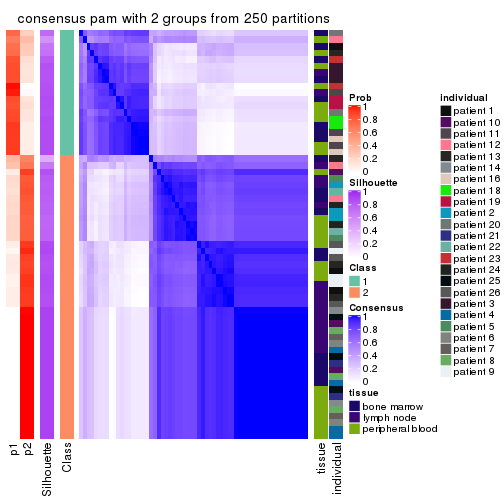</p>

</div>
<div id='tab-MAD-pam-consensus-heatmap-2'>
<pre><code class="r">consensus_heatmap(res, k = 3)
</code></pre>

<p>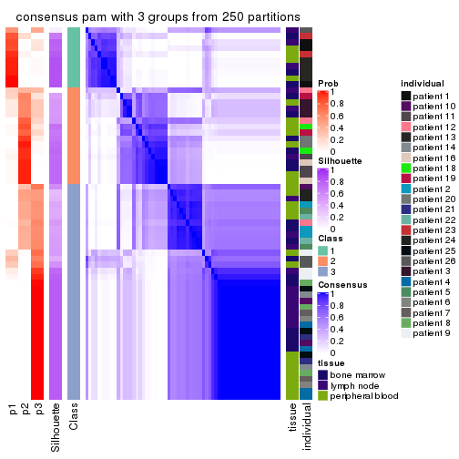</p>

</div>
<div id='tab-MAD-pam-consensus-heatmap-3'>
<pre><code class="r">consensus_heatmap(res, k = 4)
</code></pre>

<p>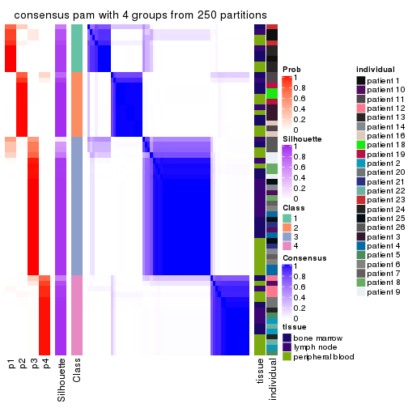</p>

</div>
<div id='tab-MAD-pam-consensus-heatmap-4'>
<pre><code class="r">consensus_heatmap(res, k = 5)
</code></pre>

<p>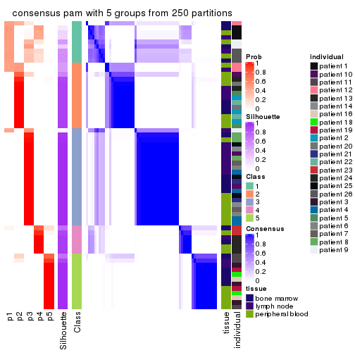</p>

</div>
<div id='tab-MAD-pam-consensus-heatmap-5'>
<pre><code class="r">consensus_heatmap(res, k = 6)
</code></pre>

<p>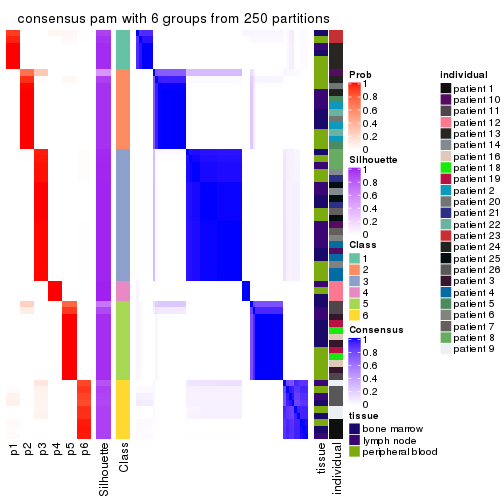</p>

</div>
</div>

Heatmaps for the membership of samples in all partitions to see how consistent they are:


<script>
$( function() {
	$( '#tabs-MAD-pam-membership-heatmap' ).tabs();
} );
</script>
<div id='tabs-MAD-pam-membership-heatmap'>
<ul>
<li><a href='#tab-MAD-pam-membership-heatmap-1'>k = 2</a></li>
<li><a href='#tab-MAD-pam-membership-heatmap-2'>k = 3</a></li>
<li><a href='#tab-MAD-pam-membership-heatmap-3'>k = 4</a></li>
<li><a href='#tab-MAD-pam-membership-heatmap-4'>k = 5</a></li>
<li><a href='#tab-MAD-pam-membership-heatmap-5'>k = 6</a></li>
</ul>
<div id='tab-MAD-pam-membership-heatmap-1'>
<pre><code class="r">membership_heatmap(res, k = 2)
</code></pre>

<p>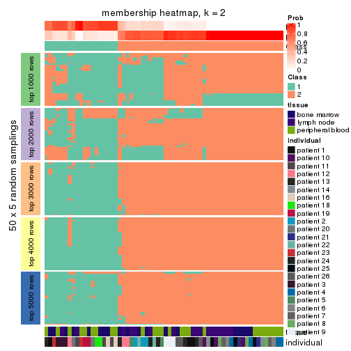</p>

</div>
<div id='tab-MAD-pam-membership-heatmap-2'>
<pre><code class="r">membership_heatmap(res, k = 3)
</code></pre>

<p>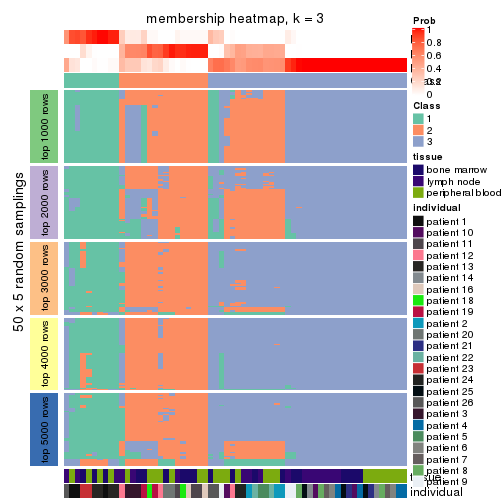</p>

</div>
<div id='tab-MAD-pam-membership-heatmap-3'>
<pre><code class="r">membership_heatmap(res, k = 4)
</code></pre>

<p>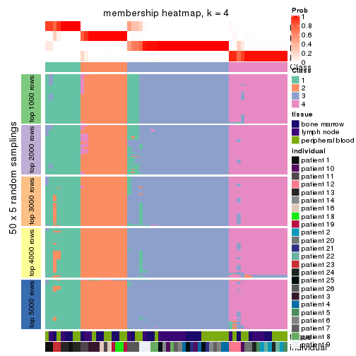</p>

</div>
<div id='tab-MAD-pam-membership-heatmap-4'>
<pre><code class="r">membership_heatmap(res, k = 5)
</code></pre>

<p>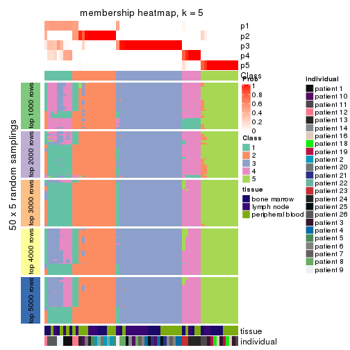</p>

</div>
<div id='tab-MAD-pam-membership-heatmap-5'>
<pre><code class="r">membership_heatmap(res, k = 6)
</code></pre>

<p>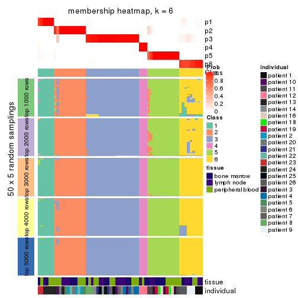</p>

</div>
</div>

As soon as we have had the classes for columns, we can look for signatures
which are significantly different between classes which can be candidate marks
for certain classes. Following are the heatmaps for signatures.


Signature heatmaps where rows are scaled:


<script>
$( function() {
	$( '#tabs-MAD-pam-get-signatures' ).tabs();
} );
</script>
<div id='tabs-MAD-pam-get-signatures'>
<ul>
<li><a href='#tab-MAD-pam-get-signatures-1'>k = 2</a></li>
<li><a href='#tab-MAD-pam-get-signatures-2'>k = 3</a></li>
<li><a href='#tab-MAD-pam-get-signatures-3'>k = 4</a></li>
<li><a href='#tab-MAD-pam-get-signatures-4'>k = 5</a></li>
<li><a href='#tab-MAD-pam-get-signatures-5'>k = 6</a></li>
</ul>
<div id='tab-MAD-pam-get-signatures-1'>
<pre><code class="r">get_signatures(res, k = 2)
</code></pre>

<p>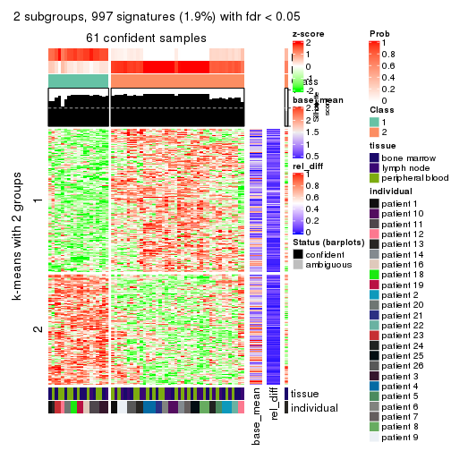</p>

</div>
<div id='tab-MAD-pam-get-signatures-2'>
<pre><code class="r">get_signatures(res, k = 3)
</code></pre>

<p>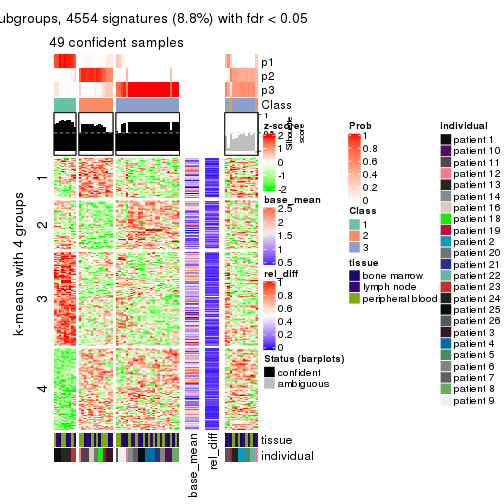</p>

</div>
<div id='tab-MAD-pam-get-signatures-3'>
<pre><code class="r">get_signatures(res, k = 4)
</code></pre>

<p>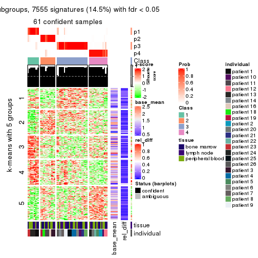</p>

</div>
<div id='tab-MAD-pam-get-signatures-4'>
<pre><code class="r">get_signatures(res, k = 5)
</code></pre>

<p>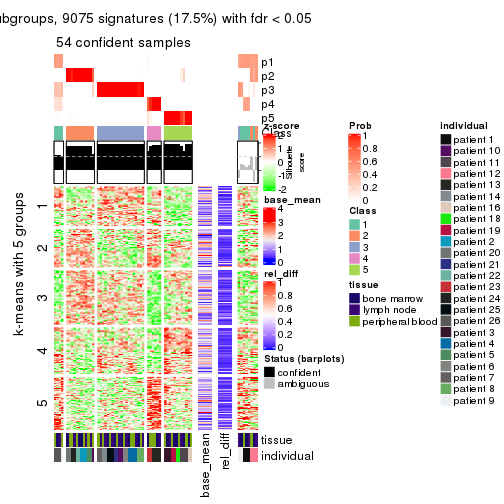</p>

</div>
<div id='tab-MAD-pam-get-signatures-5'>
<pre><code class="r">get_signatures(res, k = 6)
</code></pre>

<p>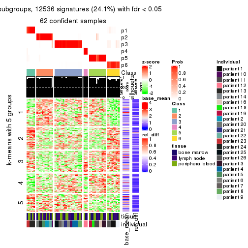</p>

</div>
</div>


Signature heatmaps where rows are not scaled:


<script>
$( function() {
	$( '#tabs-MAD-pam-get-signatures-no-scale' ).tabs();
} );
</script>
<div id='tabs-MAD-pam-get-signatures-no-scale'>
<ul>
<li><a href='#tab-MAD-pam-get-signatures-no-scale-1'>k = 2</a></li>
<li><a href='#tab-MAD-pam-get-signatures-no-scale-2'>k = 3</a></li>
<li><a href='#tab-MAD-pam-get-signatures-no-scale-3'>k = 4</a></li>
<li><a href='#tab-MAD-pam-get-signatures-no-scale-4'>k = 5</a></li>
<li><a href='#tab-MAD-pam-get-signatures-no-scale-5'>k = 6</a></li>
</ul>
<div id='tab-MAD-pam-get-signatures-no-scale-1'>
<pre><code class="r">get_signatures(res, k = 2, scale_rows = FALSE)
</code></pre>

<p>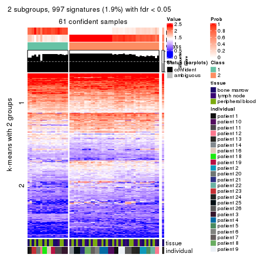</p>

</div>
<div id='tab-MAD-pam-get-signatures-no-scale-2'>
<pre><code class="r">get_signatures(res, k = 3, scale_rows = FALSE)
</code></pre>

<p>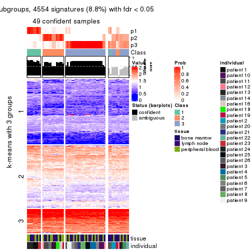</p>

</div>
<div id='tab-MAD-pam-get-signatures-no-scale-3'>
<pre><code class="r">get_signatures(res, k = 4, scale_rows = FALSE)
</code></pre>

<p>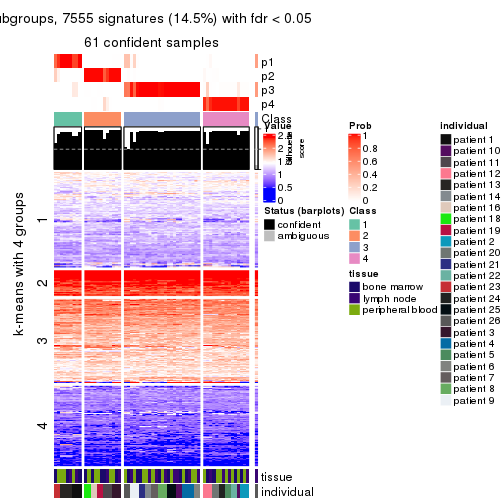</p>

</div>
<div id='tab-MAD-pam-get-signatures-no-scale-4'>
<pre><code class="r">get_signatures(res, k = 5, scale_rows = FALSE)
</code></pre>

<p>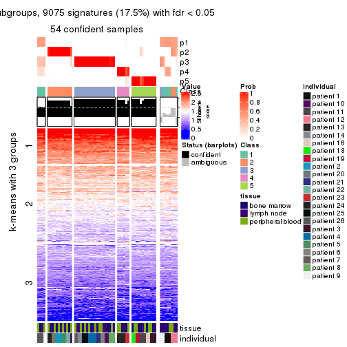</p>

</div>
<div id='tab-MAD-pam-get-signatures-no-scale-5'>
<pre><code class="r">get_signatures(res, k = 6, scale_rows = FALSE)
</code></pre>

<p>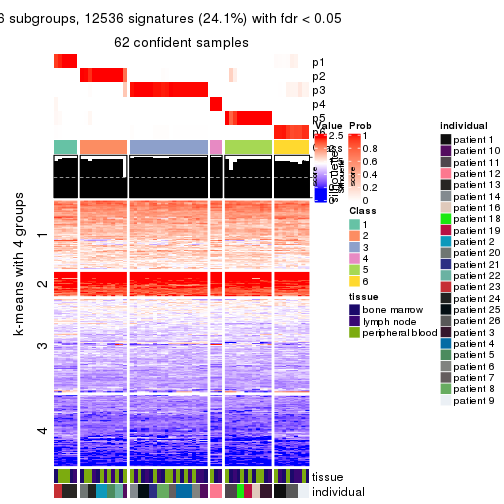</p>

</div>
</div>


Compare the overlap of signatures from different k:

```r
compare_signatures(res)
```

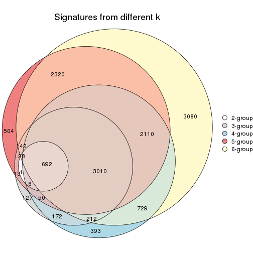

`get_signature()` returns a data frame invisibly. TO get the list of signatures, the function
call should be assigned to a variable explicitly. In following code, if `plot` argument is set
to `FALSE`, no heatmap is plotted while only the differential analysis is performed.

```r
# code only for demonstration
tb = get_signature(res, k = ..., plot = FALSE)
```

An example of the output of `tb` is:

```
#>   which_row         fdr    mean_1    mean_2 scaled_mean_1 scaled_mean_2 km
#> 1        38 0.042760348  8.373488  9.131774    -0.5533452     0.5164555  1
#> 2        40 0.018707592  7.106213  8.469186    -0.6173731     0.5762149  1
#> 3        55 0.019134737 10.221463 11.207825    -0.6159697     0.5749050  1
#> 4        59 0.006059896  5.921854  7.869574    -0.6899429     0.6439467  1
#> 5        60 0.018055526  8.928898 10.211722    -0.6204761     0.5791110  1
#> 6        98 0.009384629 15.714769 14.887706     0.6635654    -0.6193277  2
...
```

The columns in `tb` are:

1. `which_row`: row indices corresponding to the input matrix.
2. `fdr`: FDR for the differential test. 
3. `mean_x`: The mean value in group x.
4. `scaled_mean_x`: The mean value in group x after rows are scaled.
5. `km`: Row groups if k-means clustering is applied to rows.


UMAP plot which shows how samples are separated.


<script>
$( function() {
	$( '#tabs-MAD-pam-dimension-reduction' ).tabs();
} );
</script>
<div id='tabs-MAD-pam-dimension-reduction'>
<ul>
<li><a href='#tab-MAD-pam-dimension-reduction-1'>k = 2</a></li>
<li><a href='#tab-MAD-pam-dimension-reduction-2'>k = 3</a></li>
<li><a href='#tab-MAD-pam-dimension-reduction-3'>k = 4</a></li>
<li><a href='#tab-MAD-pam-dimension-reduction-4'>k = 5</a></li>
<li><a href='#tab-MAD-pam-dimension-reduction-5'>k = 6</a></li>
</ul>
<div id='tab-MAD-pam-dimension-reduction-1'>
<pre><code class="r">dimension_reduction(res, k = 2, method = &quot;UMAP&quot;)
</code></pre>

<p>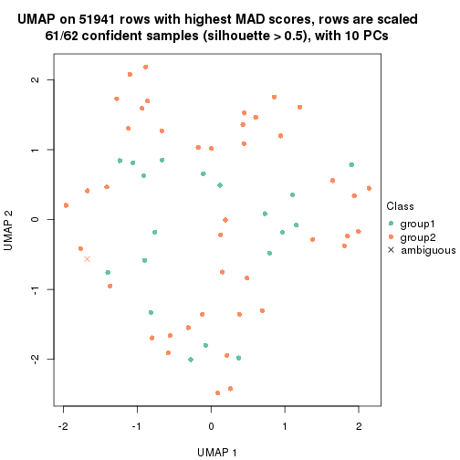</p>

</div>
<div id='tab-MAD-pam-dimension-reduction-2'>
<pre><code class="r">dimension_reduction(res, k = 3, method = &quot;UMAP&quot;)
</code></pre>

<p>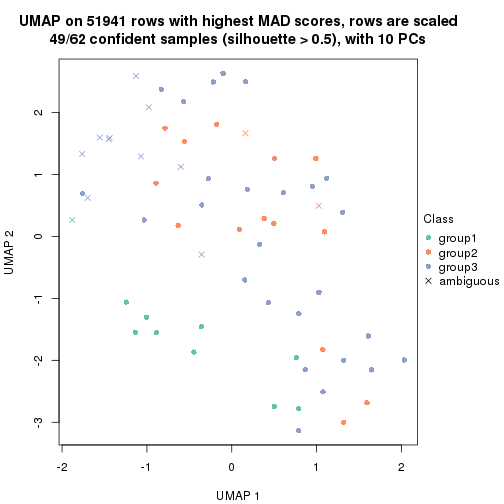</p>

</div>
<div id='tab-MAD-pam-dimension-reduction-3'>
<pre><code class="r">dimension_reduction(res, k = 4, method = &quot;UMAP&quot;)
</code></pre>

<p>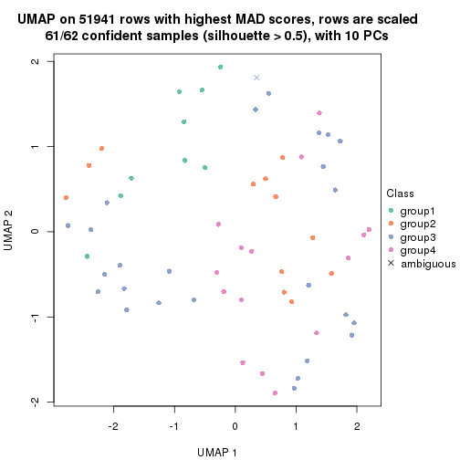</p>

</div>
<div id='tab-MAD-pam-dimension-reduction-4'>
<pre><code class="r">dimension_reduction(res, k = 5, method = &quot;UMAP&quot;)
</code></pre>

<p>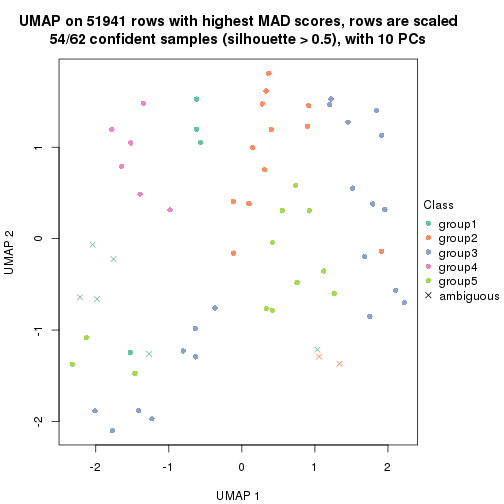</p>

</div>
<div id='tab-MAD-pam-dimension-reduction-5'>
<pre><code class="r">dimension_reduction(res, k = 6, method = &quot;UMAP&quot;)
</code></pre>

<p>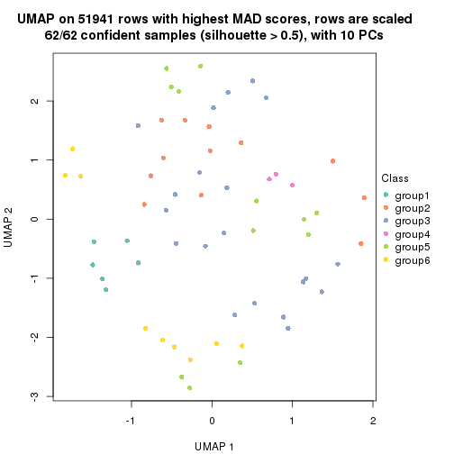</p>

</div>
</div>


Following heatmap shows how subgroups are split when increasing `k`:

```r
collect_classes(res)
```

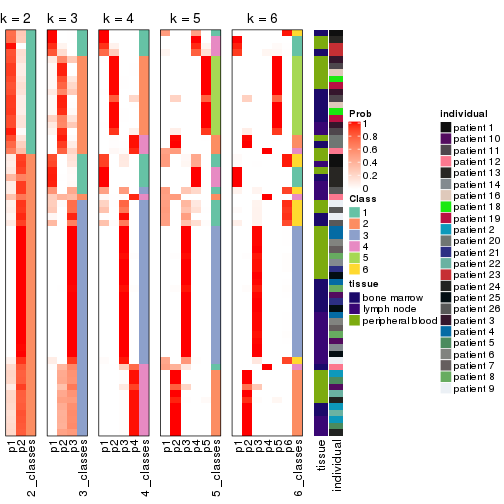


Test correlation between subgroups and known annotations. If the known
annotation is numeric, one-way ANOVA test is applied, and if the known
annotation is discrete, chi-squared contingency table test is applied.

```r
test_to_known_factors(res)
```

```
#>          n tissue(p) individual(p) k
#> MAD:pam 61    0.0999      5.53e-04 2
#> MAD:pam 49    0.8425      7.97e-07 3
#> MAD:pam 61    0.9584      1.15e-11 4
#> MAD:pam 54    0.9674      6.22e-13 5
#> MAD:pam 62    0.9873      4.62e-19 6
```


If matrix rows can be associated to genes, consider to use `functional_enrichment(res,
...)` to perform function enrichment for the signature genes. See [this vignette](http://bioconductor.org/packages/devel/bioc/vignettes/cola/inst/doc/functional_enrichment.html) for more detailed explanations.


 

---------------------------------------------------


### MAD:mclust


The object with results only for a single top-value method and a single partition method 
can be extracted as:

```r
res = res_list["MAD", "mclust"]
# you can also extract it by
# res = res_list["MAD:mclust"]
```

A summary of `res` and all the functions that can be applied to it:

```r
res
```

```
#> A 'ConsensusPartition' object with k = 2, 3, 4, 5, 6.
#>   On a matrix with 51941 rows and 62 columns.
#>   Top rows (1000, 2000, 3000, 4000, 5000) are extracted by 'MAD' method.
#>   Subgroups are detected by 'mclust' method.
#>   Performed in total 1250 partitions by row resampling.
#>   Best k for subgroups seems to be 3.
#> 
#> Following methods can be applied to this 'ConsensusPartition' object:
#>  [1] "cola_report"             "collect_classes"         "collect_plots"          
#>  [4] "collect_stats"           "colnames"                "compare_signatures"     
#>  [7] "consensus_heatmap"       "dimension_reduction"     "functional_enrichment"  
#> [10] "get_anno_col"            "get_anno"                "get_classes"            
#> [13] "get_consensus"           "get_matrix"              "get_membership"         
#> [16] "get_param"               "get_signatures"          "get_stats"              
#> [19] "is_best_k"               "is_stable_k"             "membership_heatmap"     
#> [22] "ncol"                    "nrow"                    "plot_ecdf"              
#> [25] "rownames"                "select_partition_number" "show"                   
#> [28] "suggest_best_k"          "test_to_known_factors"
```

`collect_plots()` function collects all the plots made from `res` for all `k` (number of partitions)
into one single page to provide an easy and fast comparison between different `k`.

```r
collect_plots(res)
```

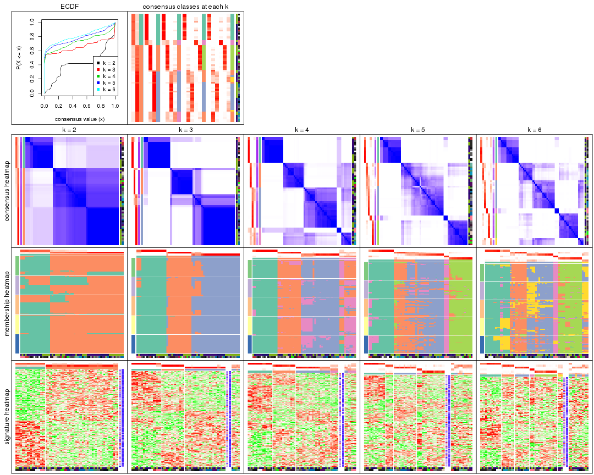

The plots are:

- The first row: a plot of the ECDF (empirical cumulative distribution
  function) curves of the consensus matrix for each `k` and the heatmap of
  predicted classes for each `k`.
- The second row: heatmaps of the consensus matrix for each `k`.
- The third row: heatmaps of the membership matrix for each `k`.
- The fouth row: heatmaps of the signatures for each `k`.

All the plots in panels can be made by individual functions and they are
plotted later in this section.

`select_partition_number()` produces several plots showing different
statistics for choosing "optimized" `k`. There are following statistics:

- ECDF curves of the consensus matrix for each `k`;
- 1-PAC. [The PAC
  score](https://en.wikipedia.org/wiki/Consensus_clustering#Over-interpretation_potential_of_consensus_clustering)
  measures the proportion of the ambiguous subgrouping.
- Mean silhouette score.
- Concordance. The mean probability of fiting the consensus class ids in all
  partitions.
- Area increased. Denote $A_k$ as the area under the ECDF curve for current
  `k`, the area increased is defined as $A_k - A_{k-1}$.
- Rand index. The percent of pairs of samples that are both in a same cluster
  or both are not in a same cluster in the partition of k and k-1.
- Jaccard index. The ratio of pairs of samples are both in a same cluster in
  the partition of k and k-1 and the pairs of samples are both in a same
  cluster in the partition k or k-1.

The detailed explanations of these statistics can be found in [the _cola_
vignette](http://bioconductor.org/packages/devel/bioc/vignettes/cola/inst/doc/cola.html#toc_13).

Generally speaking, lower PAC score, higher mean silhouette score or higher
concordance corresponds to better partition. Rand index and Jaccard index
measure how similar the current partition is compared to partition with `k-1`.
If they are too similar, we won't accept `k` is better than `k-1`.

```r
select_partition_number(res)
```

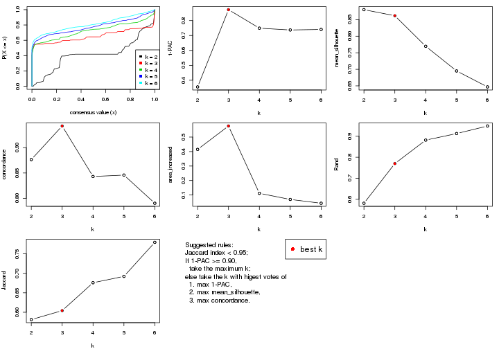

The numeric values for all these statistics can be obtained by `get_stats()`.

```r
get_stats(res)
```

```
#>   k 1-PAC mean_silhouette concordance area_increased  Rand Jaccard
#> 2 2 0.355           0.880       0.877         0.4149 0.581   0.581
#> 3 3 0.873           0.862       0.943         0.5765 0.770   0.604
#> 4 4 0.749           0.770       0.843         0.1117 0.882   0.676
#> 5 5 0.737           0.695       0.846         0.0695 0.913   0.692
#> 6 6 0.740           0.647       0.790         0.0432 0.949   0.780
```

`suggest_best_k()` suggests the best $k$ based on these statistics. The rules are as follows:

- All $k$ with Jaccard index larger than 0.95 are removed because increasing
  $k$ does not provide enough extra information. If all $k$ are removed, it is
  marked as no subgroup is detected.
- For all $k$ with 1-PAC score larger than 0.9, the maximal $k$ is taken as
  the best $k$, and other $k$ are marked as optional $k$.
- If it does not fit the second rule. The $k$ with the maximal vote of the
  highest 1-PAC score, highest mean silhouette, and highest concordance is
  taken as the best $k$.

```r
suggest_best_k(res)
```

```
#> [1] 3
```


Following shows the table of the partitions (You need to click the **show/hide
code output** link to see it). The membership matrix (columns with name `p*`)
is inferred by
[`clue::cl_consensus()`](https://www.rdocumentation.org/link/cl_consensus?package=clue)
function with the `SE` method. Basically the value in the membership matrix
represents the probability to belong to a certain group. The finall class
label for an item is determined with the group with highest probability it
belongs to.

In `get_classes()` function, the entropy is calculated from the membership
matrix and the silhouette score is calculated from the consensus matrix.


<script>
$( function() {
	$( '#tabs-MAD-mclust-get-classes' ).tabs();
} );
</script>
<div id='tabs-MAD-mclust-get-classes'>
<ul>
<li><a href='#tab-MAD-mclust-get-classes-1'>k = 2</a></li>
<li><a href='#tab-MAD-mclust-get-classes-2'>k = 3</a></li>
<li><a href='#tab-MAD-mclust-get-classes-3'>k = 4</a></li>
<li><a href='#tab-MAD-mclust-get-classes-4'>k = 5</a></li>
<li><a href='#tab-MAD-mclust-get-classes-5'>k = 6</a></li>
</ul>

<div id='tab-MAD-mclust-get-classes-1'>
<p><a id='tab-MAD-mclust-get-classes-1-a' style='color:#0366d6' href='#'>show/hide code output</a></p>
<pre><code class="r">cbind(get_classes(res, k = 2), get_membership(res, k = 2))
</code></pre>

<pre><code>#&gt;           class entropy silhouette    p1    p2
#&gt; GSM525314     1  0.7602      0.949 0.780 0.220
#&gt; GSM525315     2  0.5408      0.877 0.124 0.876
#&gt; GSM525316     2  0.8608      0.792 0.284 0.716
#&gt; GSM525317     2  0.0938      0.883 0.012 0.988
#&gt; GSM525318     2  0.0938      0.883 0.012 0.988
#&gt; GSM525319     2  0.5408      0.877 0.124 0.876
#&gt; GSM525320     2  0.0938      0.883 0.012 0.988
#&gt; GSM525321     2  0.0938      0.883 0.012 0.988
#&gt; GSM525322     2  0.0938      0.883 0.012 0.988
#&gt; GSM525323     1  0.7602      0.949 0.780 0.220
#&gt; GSM525324     2  0.0938      0.883 0.012 0.988
#&gt; GSM525325     2  0.8016      0.818 0.244 0.756
#&gt; GSM525326     1  0.6712      0.797 0.824 0.176
#&gt; GSM525327     1  0.7602      0.949 0.780 0.220
#&gt; GSM525328     1  0.7602      0.949 0.780 0.220
#&gt; GSM525329     2  0.0938      0.883 0.012 0.988
#&gt; GSM525330     2  0.7815      0.822 0.232 0.768
#&gt; GSM525331     2  0.8144      0.814 0.252 0.748
#&gt; GSM525332     2  0.8144      0.814 0.252 0.748
#&gt; GSM525333     2  0.7815      0.822 0.232 0.768
#&gt; GSM525334     2  0.0938      0.883 0.012 0.988
#&gt; GSM525335     2  0.5519      0.875 0.128 0.872
#&gt; GSM525336     1  0.5946      0.894 0.856 0.144
#&gt; GSM525337     2  0.5408      0.877 0.124 0.876
#&gt; GSM525338     2  0.0938      0.883 0.012 0.988
#&gt; GSM525339     1  0.7602      0.949 0.780 0.220
#&gt; GSM525340     1  0.7602      0.949 0.780 0.220
#&gt; GSM525341     2  0.5408      0.877 0.124 0.876
#&gt; GSM525342     2  0.8661      0.788 0.288 0.712
#&gt; GSM525343     2  0.0938      0.883 0.012 0.988
#&gt; GSM525344     2  0.0938      0.883 0.012 0.988
#&gt; GSM525345     1  0.7602      0.949 0.780 0.220
#&gt; GSM525346     2  0.0938      0.883 0.012 0.988
#&gt; GSM525347     2  0.6343      0.865 0.160 0.840
#&gt; GSM525348     1  0.6712      0.797 0.824 0.176
#&gt; GSM525349     1  0.7602      0.949 0.780 0.220
#&gt; GSM525350     2  0.7815      0.822 0.232 0.768
#&gt; GSM525351     2  0.6887      0.856 0.184 0.816
#&gt; GSM525352     2  0.8144      0.814 0.252 0.748
#&gt; GSM525353     2  0.5842      0.872 0.140 0.860
#&gt; GSM525354     2  0.0938      0.883 0.012 0.988
#&gt; GSM525355     2  0.5519      0.875 0.128 0.872
#&gt; GSM525356     1  0.6148      0.900 0.848 0.152
#&gt; GSM525357     2  0.0938      0.883 0.012 0.988
#&gt; GSM525358     1  0.7602      0.949 0.780 0.220
#&gt; GSM525359     1  0.7674      0.948 0.776 0.224
#&gt; GSM525360     2  0.5408      0.877 0.124 0.876
#&gt; GSM525361     2  0.7219      0.843 0.200 0.800
#&gt; GSM525362     2  0.0938      0.883 0.012 0.988
#&gt; GSM525363     2  0.5408      0.878 0.124 0.876
#&gt; GSM525364     2  0.0938      0.883 0.012 0.988
#&gt; GSM525365     2  0.0938      0.883 0.012 0.988
#&gt; GSM525366     2  0.0938      0.883 0.012 0.988
#&gt; GSM525367     1  0.7602      0.949 0.780 0.220
#&gt; GSM525368     2  0.0938      0.883 0.012 0.988
#&gt; GSM525369     2  0.6247      0.866 0.156 0.844
#&gt; GSM525370     1  0.6712      0.797 0.824 0.176
#&gt; GSM525371     1  0.7674      0.948 0.776 0.224
#&gt; GSM525372     2  0.0938      0.883 0.012 0.988
#&gt; GSM525373     2  0.2236      0.884 0.036 0.964
#&gt; GSM525374     2  0.0938      0.883 0.012 0.988
#&gt; GSM525375     1  0.7674      0.948 0.776 0.224
</code></pre>

<script>
$('#tab-MAD-mclust-get-classes-1-a').parent().next().next().hide();
$('#tab-MAD-mclust-get-classes-1-a').click(function(){
  $('#tab-MAD-mclust-get-classes-1-a').parent().next().next().toggle();
  return(false);
});
</script>
</div>

<div id='tab-MAD-mclust-get-classes-2'>
<p><a id='tab-MAD-mclust-get-classes-2-a' style='color:#0366d6' href='#'>show/hide code output</a></p>
<pre><code class="r">cbind(get_classes(res, k = 3), get_membership(res, k = 3))
</code></pre>

<pre><code>#&gt;           class entropy silhouette    p1    p2    p3
#&gt; GSM525314     1  0.0000     0.9545 1.000 0.000 0.000
#&gt; GSM525315     3  0.6215     0.3419 0.000 0.428 0.572
#&gt; GSM525316     2  0.0592     0.9498 0.012 0.988 0.000
#&gt; GSM525317     3  0.0000     0.9100 0.000 0.000 1.000
#&gt; GSM525318     3  0.0000     0.9100 0.000 0.000 1.000
#&gt; GSM525319     3  0.6140     0.4004 0.000 0.404 0.596
#&gt; GSM525320     3  0.0000     0.9100 0.000 0.000 1.000
#&gt; GSM525321     3  0.0000     0.9100 0.000 0.000 1.000
#&gt; GSM525322     3  0.0000     0.9100 0.000 0.000 1.000
#&gt; GSM525323     1  0.0000     0.9545 1.000 0.000 0.000
#&gt; GSM525324     3  0.0000     0.9100 0.000 0.000 1.000
#&gt; GSM525325     2  0.0000     0.9562 0.000 1.000 0.000
#&gt; GSM525326     1  0.5378     0.7095 0.756 0.236 0.008
#&gt; GSM525327     1  0.0000     0.9545 1.000 0.000 0.000
#&gt; GSM525328     1  0.0000     0.9545 1.000 0.000 0.000
#&gt; GSM525329     3  0.0000     0.9100 0.000 0.000 1.000
#&gt; GSM525330     2  0.0000     0.9562 0.000 1.000 0.000
#&gt; GSM525331     2  0.0000     0.9562 0.000 1.000 0.000
#&gt; GSM525332     2  0.0000     0.9562 0.000 1.000 0.000
#&gt; GSM525333     2  0.0000     0.9562 0.000 1.000 0.000
#&gt; GSM525334     3  0.0000     0.9100 0.000 0.000 1.000
#&gt; GSM525335     2  0.6244     0.0361 0.000 0.560 0.440
#&gt; GSM525336     1  0.0000     0.9545 1.000 0.000 0.000
#&gt; GSM525337     3  0.2878     0.8388 0.000 0.096 0.904
#&gt; GSM525338     3  0.0000     0.9100 0.000 0.000 1.000
#&gt; GSM525339     1  0.0000     0.9545 1.000 0.000 0.000
#&gt; GSM525340     1  0.0000     0.9545 1.000 0.000 0.000
#&gt; GSM525341     3  0.6168     0.3817 0.000 0.412 0.588
#&gt; GSM525342     2  0.0592     0.9498 0.012 0.988 0.000
#&gt; GSM525343     3  0.0000     0.9100 0.000 0.000 1.000
#&gt; GSM525344     3  0.0000     0.9100 0.000 0.000 1.000
#&gt; GSM525345     1  0.0000     0.9545 1.000 0.000 0.000
#&gt; GSM525346     3  0.0000     0.9100 0.000 0.000 1.000
#&gt; GSM525347     2  0.0237     0.9547 0.000 0.996 0.004
#&gt; GSM525348     1  0.5378     0.7095 0.756 0.236 0.008
#&gt; GSM525349     1  0.0000     0.9545 1.000 0.000 0.000
#&gt; GSM525350     2  0.0000     0.9562 0.000 1.000 0.000
#&gt; GSM525351     2  0.0000     0.9562 0.000 1.000 0.000
#&gt; GSM525352     2  0.0000     0.9562 0.000 1.000 0.000
#&gt; GSM525353     2  0.0747     0.9444 0.000 0.984 0.016
#&gt; GSM525354     3  0.0000     0.9100 0.000 0.000 1.000
#&gt; GSM525355     3  0.6235     0.3202 0.000 0.436 0.564
#&gt; GSM525356     1  0.0000     0.9545 1.000 0.000 0.000
#&gt; GSM525357     3  0.0000     0.9100 0.000 0.000 1.000
#&gt; GSM525358     1  0.0000     0.9545 1.000 0.000 0.000
#&gt; GSM525359     1  0.0000     0.9545 1.000 0.000 0.000
#&gt; GSM525360     3  0.5621     0.5844 0.000 0.308 0.692
#&gt; GSM525361     2  0.0829     0.9489 0.012 0.984 0.004
#&gt; GSM525362     3  0.0000     0.9100 0.000 0.000 1.000
#&gt; GSM525363     3  0.4605     0.7288 0.000 0.204 0.796
#&gt; GSM525364     3  0.0000     0.9100 0.000 0.000 1.000
#&gt; GSM525365     3  0.0000     0.9100 0.000 0.000 1.000
#&gt; GSM525366     3  0.0000     0.9100 0.000 0.000 1.000
#&gt; GSM525367     1  0.0000     0.9545 1.000 0.000 0.000
#&gt; GSM525368     3  0.0000     0.9100 0.000 0.000 1.000
#&gt; GSM525369     2  0.0237     0.9547 0.000 0.996 0.004
#&gt; GSM525370     1  0.5378     0.7095 0.756 0.236 0.008
#&gt; GSM525371     1  0.0000     0.9545 1.000 0.000 0.000
#&gt; GSM525372     3  0.0000     0.9100 0.000 0.000 1.000
#&gt; GSM525373     3  0.0747     0.8998 0.000 0.016 0.984
#&gt; GSM525374     3  0.0000     0.9100 0.000 0.000 1.000
#&gt; GSM525375     1  0.0000     0.9545 1.000 0.000 0.000
</code></pre>

<script>
$('#tab-MAD-mclust-get-classes-2-a').parent().next().next().hide();
$('#tab-MAD-mclust-get-classes-2-a').click(function(){
  $('#tab-MAD-mclust-get-classes-2-a').parent().next().next().toggle();
  return(false);
});
</script>
</div>

<div id='tab-MAD-mclust-get-classes-3'>
<p><a id='tab-MAD-mclust-get-classes-3-a' style='color:#0366d6' href='#'>show/hide code output</a></p>
<pre><code class="r">cbind(get_classes(res, k = 4), get_membership(res, k = 4))
</code></pre>

<pre><code>#&gt;           class entropy silhouette    p1    p2    p3    p4
#&gt; GSM525314     1  0.0000     0.9837 1.000 0.000 0.000 0.000
#&gt; GSM525315     4  0.6925     0.5243 0.000 0.328 0.128 0.544
#&gt; GSM525316     2  0.0804     0.9074 0.012 0.980 0.000 0.008
#&gt; GSM525317     3  0.0188     0.8291 0.000 0.000 0.996 0.004
#&gt; GSM525318     3  0.0188     0.8291 0.000 0.000 0.996 0.004
#&gt; GSM525319     4  0.6375     0.5306 0.000 0.312 0.088 0.600
#&gt; GSM525320     3  0.1302     0.8324 0.000 0.000 0.956 0.044
#&gt; GSM525321     3  0.0188     0.8291 0.000 0.000 0.996 0.004
#&gt; GSM525322     3  0.4564     0.6554 0.000 0.000 0.672 0.328
#&gt; GSM525323     1  0.0000     0.9837 1.000 0.000 0.000 0.000
#&gt; GSM525324     3  0.5039     0.5682 0.000 0.004 0.592 0.404
#&gt; GSM525325     2  0.1576     0.9118 0.000 0.948 0.004 0.048
#&gt; GSM525326     4  0.7716     0.0366 0.224 0.380 0.000 0.396
#&gt; GSM525327     1  0.0000     0.9837 1.000 0.000 0.000 0.000
#&gt; GSM525328     1  0.0000     0.9837 1.000 0.000 0.000 0.000
#&gt; GSM525329     3  0.0524     0.8271 0.008 0.000 0.988 0.004
#&gt; GSM525330     2  0.1635     0.9105 0.000 0.948 0.008 0.044
#&gt; GSM525331     2  0.0000     0.9157 0.000 1.000 0.000 0.000
#&gt; GSM525332     2  0.0336     0.9133 0.000 0.992 0.000 0.008
#&gt; GSM525333     2  0.1807     0.9048 0.000 0.940 0.008 0.052
#&gt; GSM525334     3  0.0921     0.8339 0.000 0.000 0.972 0.028
#&gt; GSM525335     4  0.6042     0.4329 0.000 0.392 0.048 0.560
#&gt; GSM525336     1  0.2589     0.8938 0.884 0.000 0.000 0.116
#&gt; GSM525337     3  0.6019     0.4851 0.000 0.136 0.688 0.176
#&gt; GSM525338     3  0.0817     0.8343 0.000 0.000 0.976 0.024
#&gt; GSM525339     1  0.0000     0.9837 1.000 0.000 0.000 0.000
#&gt; GSM525340     1  0.0000     0.9837 1.000 0.000 0.000 0.000
#&gt; GSM525341     4  0.6808     0.5308 0.000 0.320 0.120 0.560
#&gt; GSM525342     2  0.0672     0.9100 0.008 0.984 0.000 0.008
#&gt; GSM525343     3  0.0188     0.8291 0.000 0.000 0.996 0.004
#&gt; GSM525344     3  0.4643     0.6561 0.000 0.000 0.656 0.344
#&gt; GSM525345     1  0.0000     0.9837 1.000 0.000 0.000 0.000
#&gt; GSM525346     3  0.4661     0.6552 0.000 0.000 0.652 0.348
#&gt; GSM525347     2  0.2473     0.8763 0.000 0.908 0.012 0.080
#&gt; GSM525348     4  0.7716     0.0366 0.224 0.380 0.000 0.396
#&gt; GSM525349     1  0.0000     0.9837 1.000 0.000 0.000 0.000
#&gt; GSM525350     2  0.1635     0.9105 0.000 0.948 0.008 0.044
#&gt; GSM525351     2  0.0672     0.9165 0.000 0.984 0.008 0.008
#&gt; GSM525352     2  0.0336     0.9133 0.000 0.992 0.000 0.008
#&gt; GSM525353     2  0.4244     0.7334 0.000 0.800 0.032 0.168
#&gt; GSM525354     3  0.0921     0.8339 0.000 0.000 0.972 0.028
#&gt; GSM525355     4  0.6234     0.5014 0.000 0.348 0.068 0.584
#&gt; GSM525356     1  0.2589     0.8938 0.884 0.000 0.000 0.116
#&gt; GSM525357     3  0.1557     0.8307 0.000 0.000 0.944 0.056
#&gt; GSM525358     1  0.0000     0.9837 1.000 0.000 0.000 0.000
#&gt; GSM525359     1  0.0188     0.9822 0.996 0.000 0.000 0.004
#&gt; GSM525360     4  0.7121     0.5214 0.000 0.300 0.160 0.540
#&gt; GSM525361     2  0.1617     0.9061 0.008 0.956 0.012 0.024
#&gt; GSM525362     3  0.1302     0.8329 0.000 0.000 0.956 0.044
#&gt; GSM525363     4  0.7426     0.3472 0.000 0.224 0.264 0.512
#&gt; GSM525364     3  0.1792     0.8257 0.000 0.000 0.932 0.068
#&gt; GSM525365     3  0.0469     0.8291 0.000 0.000 0.988 0.012
#&gt; GSM525366     3  0.4697     0.6463 0.000 0.000 0.644 0.356
#&gt; GSM525367     1  0.0000     0.9837 1.000 0.000 0.000 0.000
#&gt; GSM525368     3  0.4697     0.6463 0.000 0.000 0.644 0.356
#&gt; GSM525369     2  0.3913     0.7884 0.000 0.824 0.028 0.148
#&gt; GSM525370     4  0.7716     0.0366 0.224 0.380 0.000 0.396
#&gt; GSM525371     1  0.0188     0.9822 0.996 0.000 0.000 0.004
#&gt; GSM525372     3  0.0804     0.8291 0.008 0.000 0.980 0.012
#&gt; GSM525373     3  0.5329     0.4898 0.000 0.012 0.568 0.420
#&gt; GSM525374     3  0.2760     0.7997 0.000 0.000 0.872 0.128
#&gt; GSM525375     1  0.0188     0.9822 0.996 0.000 0.000 0.004
</code></pre>

<script>
$('#tab-MAD-mclust-get-classes-3-a').parent().next().next().hide();
$('#tab-MAD-mclust-get-classes-3-a').click(function(){
  $('#tab-MAD-mclust-get-classes-3-a').parent().next().next().toggle();
  return(false);
});
</script>
</div>

<div id='tab-MAD-mclust-get-classes-4'>
<p><a id='tab-MAD-mclust-get-classes-4-a' style='color:#0366d6' href='#'>show/hide code output</a></p>
<pre><code class="r">cbind(get_classes(res, k = 5), get_membership(res, k = 5))
</code></pre>

<pre><code>#&gt;           class entropy silhouette    p1    p2    p3    p4    p5
#&gt; GSM525314     1  0.0000    0.89809 1.000 0.000 0.000 0.000 0.000
#&gt; GSM525315     2  0.4194    0.58536 0.000 0.804 0.092 0.016 0.088
#&gt; GSM525316     5  0.0771    0.91510 0.000 0.004 0.000 0.020 0.976
#&gt; GSM525317     3  0.0609    0.76341 0.000 0.020 0.980 0.000 0.000
#&gt; GSM525318     3  0.0703    0.76606 0.000 0.024 0.976 0.000 0.000
#&gt; GSM525319     2  0.2907    0.58762 0.000 0.876 0.016 0.016 0.092
#&gt; GSM525320     3  0.2424    0.72317 0.000 0.132 0.868 0.000 0.000
#&gt; GSM525321     3  0.0771    0.76056 0.000 0.020 0.976 0.004 0.000
#&gt; GSM525322     3  0.4403    0.02506 0.000 0.436 0.560 0.004 0.000
#&gt; GSM525323     1  0.0000    0.89809 1.000 0.000 0.000 0.000 0.000
#&gt; GSM525324     2  0.4341    0.25156 0.000 0.592 0.404 0.004 0.000
#&gt; GSM525325     5  0.1121    0.92377 0.000 0.044 0.000 0.000 0.956
#&gt; GSM525326     4  0.1410    1.00000 0.000 0.000 0.000 0.940 0.060
#&gt; GSM525327     1  0.2179    0.85851 0.888 0.000 0.000 0.112 0.000
#&gt; GSM525328     1  0.2230    0.85635 0.884 0.000 0.000 0.116 0.000
#&gt; GSM525329     3  0.1455    0.75997 0.008 0.032 0.952 0.008 0.000
#&gt; GSM525330     5  0.1197    0.92310 0.000 0.048 0.000 0.000 0.952
#&gt; GSM525331     5  0.0000    0.92240 0.000 0.000 0.000 0.000 1.000
#&gt; GSM525332     5  0.0162    0.92209 0.000 0.000 0.000 0.004 0.996
#&gt; GSM525333     5  0.1851    0.90396 0.000 0.088 0.000 0.000 0.912
#&gt; GSM525334     3  0.2068    0.74446 0.000 0.092 0.904 0.004 0.000
#&gt; GSM525335     2  0.4557    0.25305 0.000 0.656 0.008 0.012 0.324
#&gt; GSM525336     1  0.4504    0.39518 0.564 0.000 0.000 0.428 0.008
#&gt; GSM525337     3  0.5604    0.00646 0.000 0.444 0.500 0.016 0.040
#&gt; GSM525338     3  0.1952    0.75315 0.000 0.084 0.912 0.004 0.000
#&gt; GSM525339     1  0.0162    0.89752 0.996 0.000 0.000 0.004 0.000
#&gt; GSM525340     1  0.0000    0.89809 1.000 0.000 0.000 0.000 0.000
#&gt; GSM525341     2  0.3287    0.60239 0.000 0.864 0.052 0.016 0.068
#&gt; GSM525342     5  0.0566    0.91883 0.000 0.004 0.000 0.012 0.984
#&gt; GSM525343     3  0.0609    0.76341 0.000 0.020 0.980 0.000 0.000
#&gt; GSM525344     2  0.4744    0.01770 0.000 0.508 0.476 0.016 0.000
#&gt; GSM525345     1  0.0000    0.89809 1.000 0.000 0.000 0.000 0.000
#&gt; GSM525346     2  0.5204    0.13360 0.000 0.560 0.392 0.048 0.000
#&gt; GSM525347     5  0.2616    0.88623 0.000 0.100 0.000 0.020 0.880
#&gt; GSM525348     4  0.1410    1.00000 0.000 0.000 0.000 0.940 0.060
#&gt; GSM525349     1  0.2230    0.85635 0.884 0.000 0.000 0.116 0.000
#&gt; GSM525350     5  0.1197    0.92310 0.000 0.048 0.000 0.000 0.952
#&gt; GSM525351     5  0.0510    0.92479 0.000 0.016 0.000 0.000 0.984
#&gt; GSM525352     5  0.0000    0.92240 0.000 0.000 0.000 0.000 1.000
#&gt; GSM525353     5  0.4142    0.73420 0.000 0.252 0.004 0.016 0.728
#&gt; GSM525354     3  0.2011    0.74939 0.000 0.088 0.908 0.004 0.000
#&gt; GSM525355     2  0.3996    0.46196 0.000 0.752 0.008 0.012 0.228
#&gt; GSM525356     1  0.4504    0.39518 0.564 0.000 0.000 0.428 0.008
#&gt; GSM525357     3  0.4080    0.58395 0.000 0.252 0.728 0.020 0.000
#&gt; GSM525358     1  0.0162    0.89752 0.996 0.000 0.000 0.004 0.000
#&gt; GSM525359     1  0.0510    0.89539 0.984 0.000 0.000 0.016 0.000
#&gt; GSM525360     2  0.3096    0.60177 0.000 0.868 0.084 0.008 0.040
#&gt; GSM525361     5  0.2344    0.89906 0.000 0.064 0.000 0.032 0.904
#&gt; GSM525362     3  0.4758    0.54723 0.000 0.276 0.676 0.048 0.000
#&gt; GSM525363     2  0.2629    0.58844 0.000 0.880 0.104 0.004 0.012
#&gt; GSM525364     3  0.4313    0.66473 0.000 0.228 0.732 0.040 0.000
#&gt; GSM525365     3  0.3262    0.72349 0.000 0.124 0.840 0.036 0.000
#&gt; GSM525366     2  0.5256    0.07810 0.000 0.532 0.420 0.048 0.000
#&gt; GSM525367     1  0.0162    0.89808 0.996 0.000 0.000 0.004 0.000
#&gt; GSM525368     2  0.5204    0.13858 0.000 0.560 0.392 0.048 0.000
#&gt; GSM525369     5  0.3351    0.85255 0.000 0.148 0.004 0.020 0.828
#&gt; GSM525370     4  0.1410    1.00000 0.000 0.000 0.000 0.940 0.060
#&gt; GSM525371     1  0.2280    0.85892 0.880 0.000 0.000 0.120 0.000
#&gt; GSM525372     3  0.3519    0.73958 0.008 0.136 0.828 0.028 0.000
#&gt; GSM525373     2  0.4162    0.41380 0.000 0.680 0.312 0.004 0.004
#&gt; GSM525374     3  0.4990    0.43578 0.000 0.324 0.628 0.048 0.000
#&gt; GSM525375     1  0.0510    0.89539 0.984 0.000 0.000 0.016 0.000
</code></pre>

<script>
$('#tab-MAD-mclust-get-classes-4-a').parent().next().next().hide();
$('#tab-MAD-mclust-get-classes-4-a').click(function(){
  $('#tab-MAD-mclust-get-classes-4-a').parent().next().next().toggle();
  return(false);
});
</script>
</div>

<div id='tab-MAD-mclust-get-classes-5'>
<p><a id='tab-MAD-mclust-get-classes-5-a' style='color:#0366d6' href='#'>show/hide code output</a></p>
<pre><code class="r">cbind(get_classes(res, k = 6), get_membership(res, k = 6))
</code></pre>

<pre><code>#&gt;           class entropy silhouette    p1    p2    p3    p4    p5    p6
#&gt; GSM525314     1  0.1075     0.8080 0.952 0.000 0.000 0.000 0.000 0.048
#&gt; GSM525315     2  0.2259     0.7645 0.000 0.908 0.040 0.000 0.032 0.020
#&gt; GSM525316     5  0.1699     0.8547 0.016 0.000 0.000 0.032 0.936 0.016
#&gt; GSM525317     3  0.0547     0.6266 0.000 0.000 0.980 0.000 0.000 0.020
#&gt; GSM525318     3  0.0937     0.6265 0.000 0.000 0.960 0.000 0.000 0.040
#&gt; GSM525319     2  0.0935     0.7559 0.000 0.964 0.004 0.000 0.032 0.000
#&gt; GSM525320     3  0.3164     0.5440 0.000 0.044 0.832 0.000 0.004 0.120
#&gt; GSM525321     3  0.0363     0.6264 0.000 0.000 0.988 0.000 0.000 0.012
#&gt; GSM525322     3  0.4617     0.1999 0.000 0.252 0.664 0.000 0.000 0.084
#&gt; GSM525323     1  0.1141     0.8073 0.948 0.000 0.000 0.000 0.000 0.052
#&gt; GSM525324     2  0.5366     0.2072 0.000 0.564 0.292 0.000 0.000 0.144
#&gt; GSM525325     5  0.0790     0.8758 0.000 0.032 0.000 0.000 0.968 0.000
#&gt; GSM525326     4  0.0291     0.9975 0.000 0.004 0.000 0.992 0.004 0.000
#&gt; GSM525327     1  0.4305     0.7247 0.700 0.000 0.000 0.068 0.000 0.232
#&gt; GSM525328     1  0.4354     0.7211 0.692 0.000 0.000 0.068 0.000 0.240
#&gt; GSM525329     3  0.2333     0.5909 0.004 0.000 0.872 0.000 0.004 0.120
#&gt; GSM525330     5  0.2706     0.8131 0.000 0.160 0.000 0.000 0.832 0.008
#&gt; GSM525331     5  0.0837     0.8748 0.000 0.020 0.000 0.004 0.972 0.004
#&gt; GSM525332     5  0.1176     0.8739 0.000 0.024 0.000 0.020 0.956 0.000
#&gt; GSM525333     5  0.2933     0.7950 0.000 0.200 0.000 0.000 0.796 0.004
#&gt; GSM525334     3  0.2573     0.5722 0.000 0.024 0.864 0.000 0.000 0.112
#&gt; GSM525335     2  0.2799     0.7190 0.000 0.852 0.012 0.000 0.124 0.012
#&gt; GSM525336     1  0.6011     0.4382 0.472 0.004 0.000 0.280 0.000 0.244
#&gt; GSM525337     2  0.5192     0.5569 0.000 0.648 0.220 0.000 0.016 0.116
#&gt; GSM525338     3  0.1720     0.6166 0.000 0.040 0.928 0.000 0.000 0.032
#&gt; GSM525339     1  0.0260     0.8165 0.992 0.000 0.000 0.000 0.000 0.008
#&gt; GSM525340     1  0.1267     0.8108 0.940 0.000 0.000 0.000 0.000 0.060
#&gt; GSM525341     2  0.1777     0.7648 0.000 0.932 0.024 0.000 0.032 0.012
#&gt; GSM525342     5  0.1448     0.8584 0.012 0.000 0.000 0.024 0.948 0.016
#&gt; GSM525343     3  0.0363     0.6256 0.000 0.000 0.988 0.000 0.000 0.012
#&gt; GSM525344     3  0.5926    -0.3660 0.000 0.244 0.460 0.000 0.000 0.296
#&gt; GSM525345     1  0.1141     0.8073 0.948 0.000 0.000 0.000 0.000 0.052
#&gt; GSM525346     6  0.5370     0.7452 0.000 0.192 0.220 0.000 0.000 0.588
#&gt; GSM525347     5  0.2653     0.8379 0.000 0.144 0.000 0.012 0.844 0.000
#&gt; GSM525348     4  0.0291     0.9975 0.000 0.004 0.000 0.992 0.004 0.000
#&gt; GSM525349     1  0.4377     0.7194 0.688 0.000 0.000 0.068 0.000 0.244
#&gt; GSM525350     5  0.2772     0.8119 0.000 0.180 0.000 0.000 0.816 0.004
#&gt; GSM525351     5  0.1082     0.8754 0.000 0.040 0.000 0.004 0.956 0.000
#&gt; GSM525352     5  0.0914     0.8739 0.000 0.016 0.000 0.016 0.968 0.000
#&gt; GSM525353     5  0.3699     0.6261 0.000 0.336 0.000 0.000 0.660 0.004
#&gt; GSM525354     3  0.2605     0.5748 0.000 0.028 0.864 0.000 0.000 0.108
#&gt; GSM525355     2  0.1957     0.7418 0.000 0.912 0.008 0.000 0.072 0.008
#&gt; GSM525356     1  0.6002     0.4486 0.476 0.004 0.000 0.272 0.000 0.248
#&gt; GSM525357     3  0.4620     0.2436 0.000 0.068 0.640 0.000 0.000 0.292
#&gt; GSM525358     1  0.0260     0.8165 0.992 0.000 0.000 0.000 0.000 0.008
#&gt; GSM525359     1  0.0858     0.8161 0.968 0.000 0.000 0.004 0.000 0.028
#&gt; GSM525360     2  0.2988     0.7503 0.000 0.860 0.080 0.000 0.016 0.044
#&gt; GSM525361     5  0.3092     0.8387 0.000 0.088 0.000 0.044 0.852 0.016
#&gt; GSM525362     3  0.4690    -0.0624 0.000 0.048 0.552 0.000 0.000 0.400
#&gt; GSM525363     2  0.3054     0.7194 0.000 0.848 0.072 0.000 0.004 0.076
#&gt; GSM525364     6  0.4648     0.1227 0.000 0.040 0.464 0.000 0.000 0.496
#&gt; GSM525365     3  0.3986     0.2396 0.000 0.020 0.664 0.000 0.000 0.316
#&gt; GSM525366     6  0.5770     0.7113 0.000 0.212 0.288 0.000 0.000 0.500
#&gt; GSM525367     1  0.1141     0.8073 0.948 0.000 0.000 0.000 0.000 0.052
#&gt; GSM525368     6  0.5509     0.7381 0.000 0.216 0.220 0.000 0.000 0.564
#&gt; GSM525369     5  0.2980     0.8052 0.000 0.192 0.000 0.008 0.800 0.000
#&gt; GSM525370     4  0.0146     0.9950 0.000 0.000 0.000 0.996 0.004 0.000
#&gt; GSM525371     1  0.4332     0.7280 0.700 0.000 0.000 0.072 0.000 0.228
#&gt; GSM525372     3  0.4108     0.3264 0.004 0.012 0.660 0.000 0.004 0.320
#&gt; GSM525373     2  0.5457     0.2342 0.000 0.544 0.328 0.000 0.004 0.124
#&gt; GSM525374     3  0.4933    -0.1049 0.000 0.068 0.536 0.000 0.000 0.396
#&gt; GSM525375     1  0.0858     0.8154 0.968 0.000 0.000 0.004 0.000 0.028
</code></pre>

<script>
$('#tab-MAD-mclust-get-classes-5-a').parent().next().next().hide();
$('#tab-MAD-mclust-get-classes-5-a').click(function(){
  $('#tab-MAD-mclust-get-classes-5-a').parent().next().next().toggle();
  return(false);
});
</script>
</div>
</div>

Heatmaps for the consensus matrix. It visualizes the probability of two
samples to be in a same group.


<script>
$( function() {
	$( '#tabs-MAD-mclust-consensus-heatmap' ).tabs();
} );
</script>
<div id='tabs-MAD-mclust-consensus-heatmap'>
<ul>
<li><a href='#tab-MAD-mclust-consensus-heatmap-1'>k = 2</a></li>
<li><a href='#tab-MAD-mclust-consensus-heatmap-2'>k = 3</a></li>
<li><a href='#tab-MAD-mclust-consensus-heatmap-3'>k = 4</a></li>
<li><a href='#tab-MAD-mclust-consensus-heatmap-4'>k = 5</a></li>
<li><a href='#tab-MAD-mclust-consensus-heatmap-5'>k = 6</a></li>
</ul>
<div id='tab-MAD-mclust-consensus-heatmap-1'>
<pre><code class="r">consensus_heatmap(res, k = 2)
</code></pre>

<p>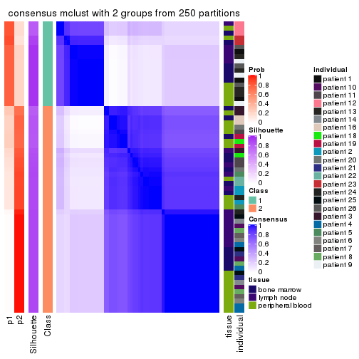</p>

</div>
<div id='tab-MAD-mclust-consensus-heatmap-2'>
<pre><code class="r">consensus_heatmap(res, k = 3)
</code></pre>

<p>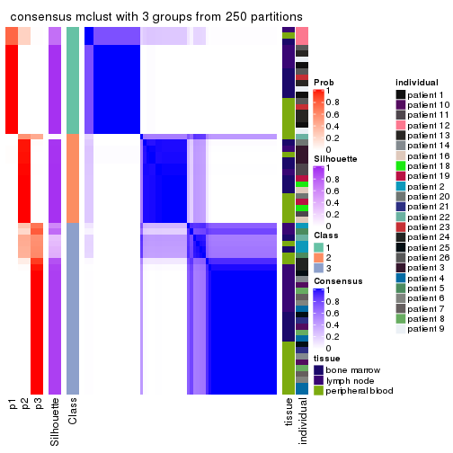</p>

</div>
<div id='tab-MAD-mclust-consensus-heatmap-3'>
<pre><code class="r">consensus_heatmap(res, k = 4)
</code></pre>

<p>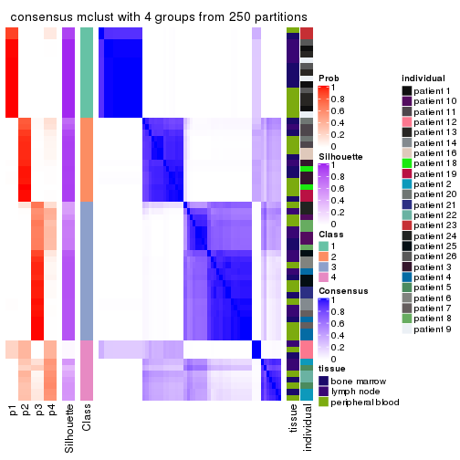</p>

</div>
<div id='tab-MAD-mclust-consensus-heatmap-4'>
<pre><code class="r">consensus_heatmap(res, k = 5)
</code></pre>

<p>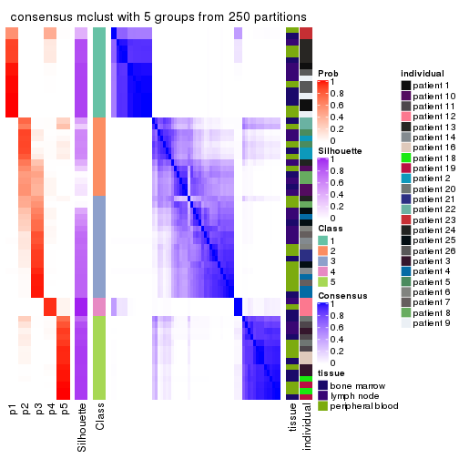</p>

</div>
<div id='tab-MAD-mclust-consensus-heatmap-5'>
<pre><code class="r">consensus_heatmap(res, k = 6)
</code></pre>

<p>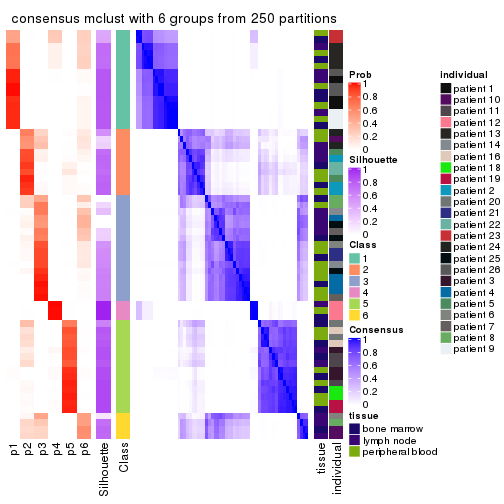</p>

</div>
</div>

Heatmaps for the membership of samples in all partitions to see how consistent they are:


<script>
$( function() {
	$( '#tabs-MAD-mclust-membership-heatmap' ).tabs();
} );
</script>
<div id='tabs-MAD-mclust-membership-heatmap'>
<ul>
<li><a href='#tab-MAD-mclust-membership-heatmap-1'>k = 2</a></li>
<li><a href='#tab-MAD-mclust-membership-heatmap-2'>k = 3</a></li>
<li><a href='#tab-MAD-mclust-membership-heatmap-3'>k = 4</a></li>
<li><a href='#tab-MAD-mclust-membership-heatmap-4'>k = 5</a></li>
<li><a href='#tab-MAD-mclust-membership-heatmap-5'>k = 6</a></li>
</ul>
<div id='tab-MAD-mclust-membership-heatmap-1'>
<pre><code class="r">membership_heatmap(res, k = 2)
</code></pre>

<p>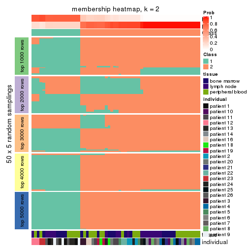</p>

</div>
<div id='tab-MAD-mclust-membership-heatmap-2'>
<pre><code class="r">membership_heatmap(res, k = 3)
</code></pre>

<p>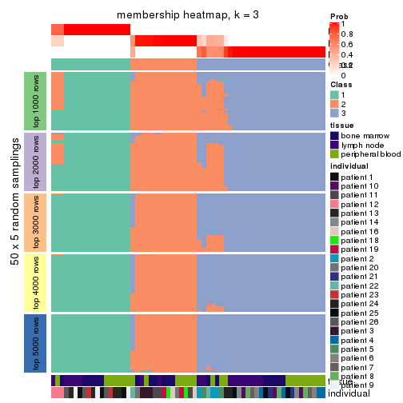</p>

</div>
<div id='tab-MAD-mclust-membership-heatmap-3'>
<pre><code class="r">membership_heatmap(res, k = 4)
</code></pre>

<p>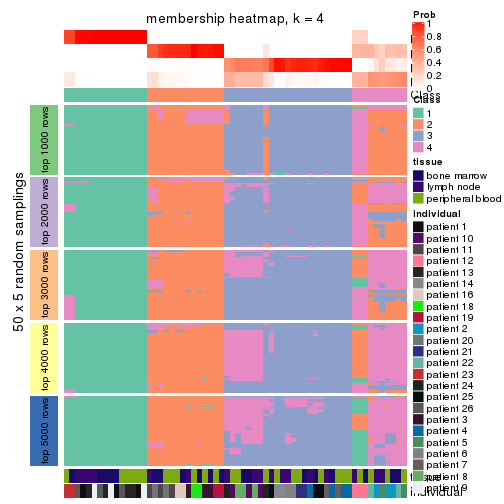</p>

</div>
<div id='tab-MAD-mclust-membership-heatmap-4'>
<pre><code class="r">membership_heatmap(res, k = 5)
</code></pre>

<p>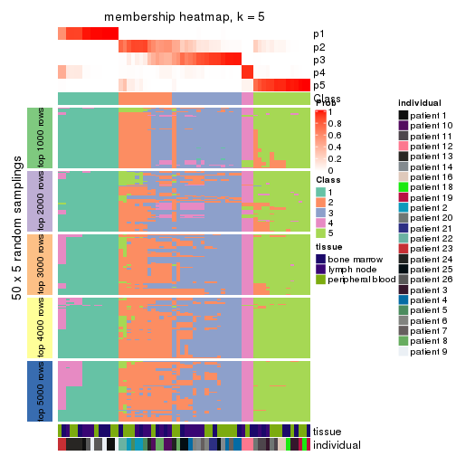</p>

</div>
<div id='tab-MAD-mclust-membership-heatmap-5'>
<pre><code class="r">membership_heatmap(res, k = 6)
</code></pre>

<p>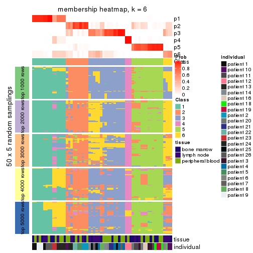</p>

</div>
</div>

As soon as we have had the classes for columns, we can look for signatures
which are significantly different between classes which can be candidate marks
for certain classes. Following are the heatmaps for signatures.


Signature heatmaps where rows are scaled:


<script>
$( function() {
	$( '#tabs-MAD-mclust-get-signatures' ).tabs();
} );
</script>
<div id='tabs-MAD-mclust-get-signatures'>
<ul>
<li><a href='#tab-MAD-mclust-get-signatures-1'>k = 2</a></li>
<li><a href='#tab-MAD-mclust-get-signatures-2'>k = 3</a></li>
<li><a href='#tab-MAD-mclust-get-signatures-3'>k = 4</a></li>
<li><a href='#tab-MAD-mclust-get-signatures-4'>k = 5</a></li>
<li><a href='#tab-MAD-mclust-get-signatures-5'>k = 6</a></li>
</ul>
<div id='tab-MAD-mclust-get-signatures-1'>
<pre><code class="r">get_signatures(res, k = 2)
</code></pre>

<p>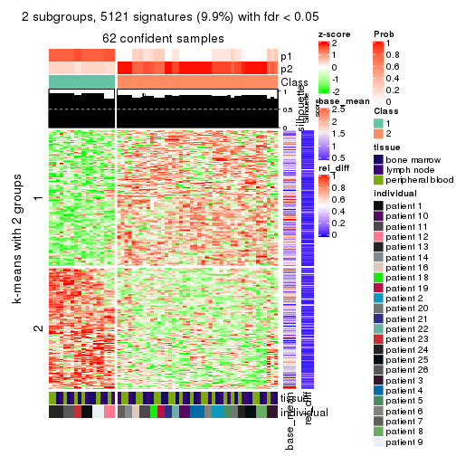</p>

</div>
<div id='tab-MAD-mclust-get-signatures-2'>
<pre><code class="r">get_signatures(res, k = 3)
</code></pre>

<p>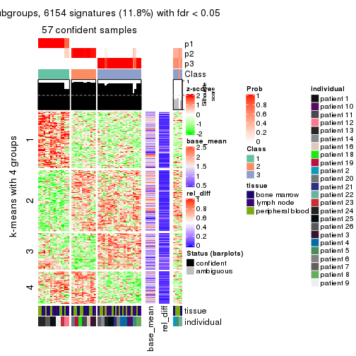</p>

</div>
<div id='tab-MAD-mclust-get-signatures-3'>
<pre><code class="r">get_signatures(res, k = 4)
</code></pre>

<p>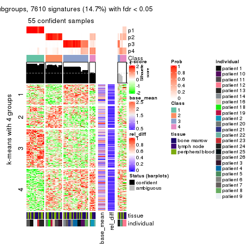</p>

</div>
<div id='tab-MAD-mclust-get-signatures-4'>
<pre><code class="r">get_signatures(res, k = 5)
</code></pre>

<p>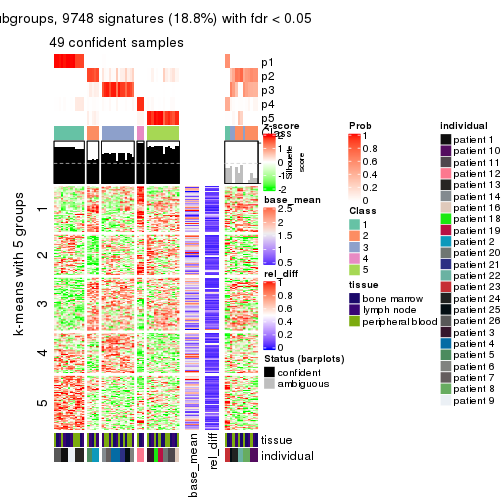</p>

</div>
<div id='tab-MAD-mclust-get-signatures-5'>
<pre><code class="r">get_signatures(res, k = 6)
</code></pre>

<p>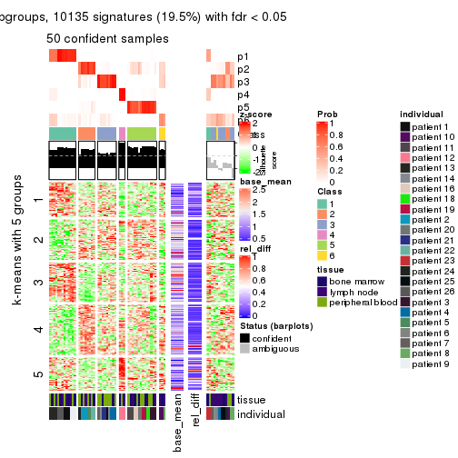</p>

</div>
</div>


Signature heatmaps where rows are not scaled:


<script>
$( function() {
	$( '#tabs-MAD-mclust-get-signatures-no-scale' ).tabs();
} );
</script>
<div id='tabs-MAD-mclust-get-signatures-no-scale'>
<ul>
<li><a href='#tab-MAD-mclust-get-signatures-no-scale-1'>k = 2</a></li>
<li><a href='#tab-MAD-mclust-get-signatures-no-scale-2'>k = 3</a></li>
<li><a href='#tab-MAD-mclust-get-signatures-no-scale-3'>k = 4</a></li>
<li><a href='#tab-MAD-mclust-get-signatures-no-scale-4'>k = 5</a></li>
<li><a href='#tab-MAD-mclust-get-signatures-no-scale-5'>k = 6</a></li>
</ul>
<div id='tab-MAD-mclust-get-signatures-no-scale-1'>
<pre><code class="r">get_signatures(res, k = 2, scale_rows = FALSE)
</code></pre>

<p>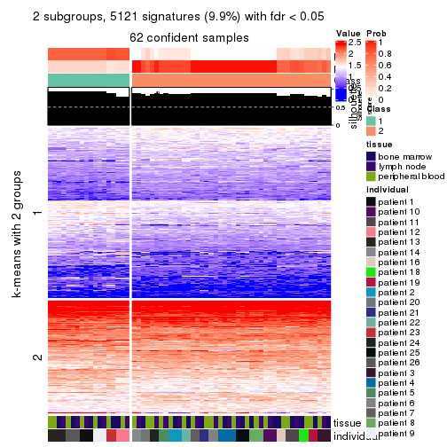</p>

</div>
<div id='tab-MAD-mclust-get-signatures-no-scale-2'>
<pre><code class="r">get_signatures(res, k = 3, scale_rows = FALSE)
</code></pre>

<p>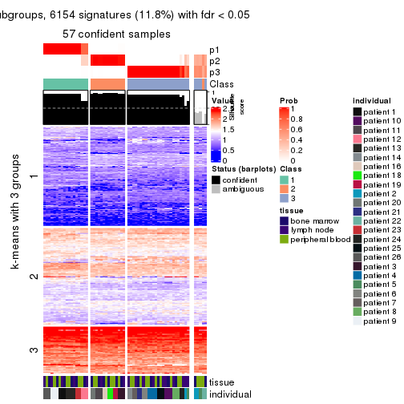</p>

</div>
<div id='tab-MAD-mclust-get-signatures-no-scale-3'>
<pre><code class="r">get_signatures(res, k = 4, scale_rows = FALSE)
</code></pre>

<p>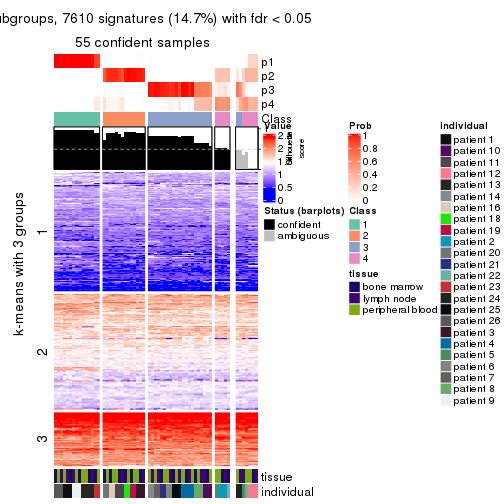</p>

</div>
<div id='tab-MAD-mclust-get-signatures-no-scale-4'>
<pre><code class="r">get_signatures(res, k = 5, scale_rows = FALSE)
</code></pre>

<p>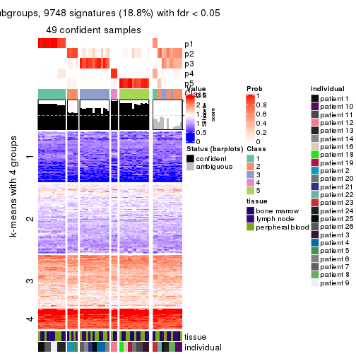</p>

</div>
<div id='tab-MAD-mclust-get-signatures-no-scale-5'>
<pre><code class="r">get_signatures(res, k = 6, scale_rows = FALSE)
</code></pre>

<p>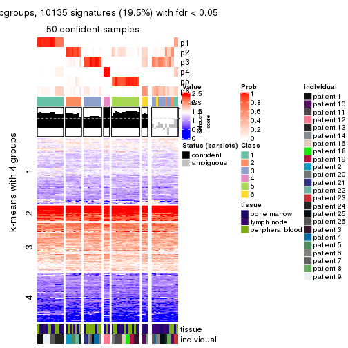</p>

</div>
</div>


Compare the overlap of signatures from different k:

```r
compare_signatures(res)
```

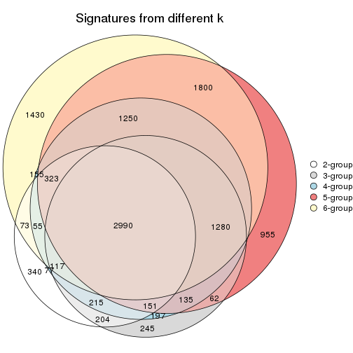

`get_signature()` returns a data frame invisibly. TO get the list of signatures, the function
call should be assigned to a variable explicitly. In following code, if `plot` argument is set
to `FALSE`, no heatmap is plotted while only the differential analysis is performed.

```r
# code only for demonstration
tb = get_signature(res, k = ..., plot = FALSE)
```

An example of the output of `tb` is:

```
#>   which_row         fdr    mean_1    mean_2 scaled_mean_1 scaled_mean_2 km
#> 1        38 0.042760348  8.373488  9.131774    -0.5533452     0.5164555  1
#> 2        40 0.018707592  7.106213  8.469186    -0.6173731     0.5762149  1
#> 3        55 0.019134737 10.221463 11.207825    -0.6159697     0.5749050  1
#> 4        59 0.006059896  5.921854  7.869574    -0.6899429     0.6439467  1
#> 5        60 0.018055526  8.928898 10.211722    -0.6204761     0.5791110  1
#> 6        98 0.009384629 15.714769 14.887706     0.6635654    -0.6193277  2
...
```

The columns in `tb` are:

1. `which_row`: row indices corresponding to the input matrix.
2. `fdr`: FDR for the differential test. 
3. `mean_x`: The mean value in group x.
4. `scaled_mean_x`: The mean value in group x after rows are scaled.
5. `km`: Row groups if k-means clustering is applied to rows.


UMAP plot which shows how samples are separated.


<script>
$( function() {
	$( '#tabs-MAD-mclust-dimension-reduction' ).tabs();
} );
</script>
<div id='tabs-MAD-mclust-dimension-reduction'>
<ul>
<li><a href='#tab-MAD-mclust-dimension-reduction-1'>k = 2</a></li>
<li><a href='#tab-MAD-mclust-dimension-reduction-2'>k = 3</a></li>
<li><a href='#tab-MAD-mclust-dimension-reduction-3'>k = 4</a></li>
<li><a href='#tab-MAD-mclust-dimension-reduction-4'>k = 5</a></li>
<li><a href='#tab-MAD-mclust-dimension-reduction-5'>k = 6</a></li>
</ul>
<div id='tab-MAD-mclust-dimension-reduction-1'>
<pre><code class="r">dimension_reduction(res, k = 2, method = &quot;UMAP&quot;)
</code></pre>

<p>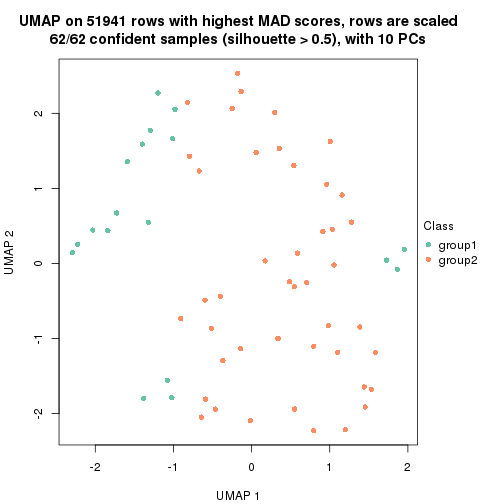</p>

</div>
<div id='tab-MAD-mclust-dimension-reduction-2'>
<pre><code class="r">dimension_reduction(res, k = 3, method = &quot;UMAP&quot;)
</code></pre>

<p>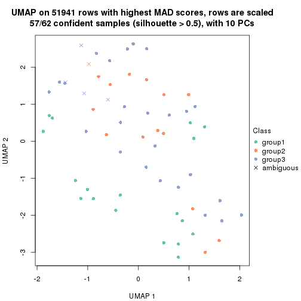</p>

</div>
<div id='tab-MAD-mclust-dimension-reduction-3'>
<pre><code class="r">dimension_reduction(res, k = 4, method = &quot;UMAP&quot;)
</code></pre>

<p>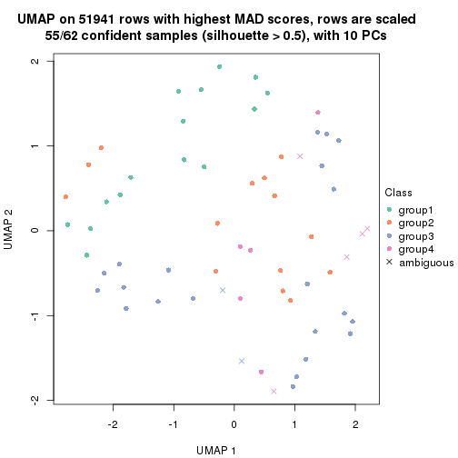</p>

</div>
<div id='tab-MAD-mclust-dimension-reduction-4'>
<pre><code class="r">dimension_reduction(res, k = 5, method = &quot;UMAP&quot;)
</code></pre>

<p>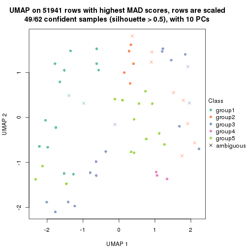</p>

</div>
<div id='tab-MAD-mclust-dimension-reduction-5'>
<pre><code class="r">dimension_reduction(res, k = 6, method = &quot;UMAP&quot;)
</code></pre>

<p>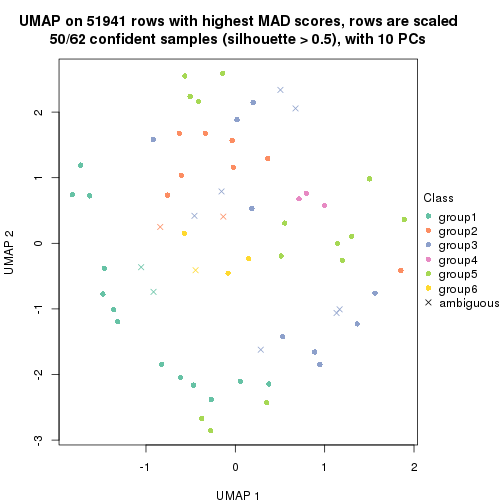</p>

</div>
</div>


Following heatmap shows how subgroups are split when increasing `k`:

```r
collect_classes(res)
```

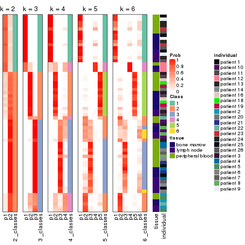


Test correlation between subgroups and known annotations. If the known
annotation is numeric, one-way ANOVA test is applied, and if the known
annotation is discrete, chi-squared contingency table test is applied.

```r
test_to_known_factors(res)
```

```
#>             n tissue(p) individual(p) k
#> MAD:mclust 62     0.943      1.95e-05 2
#> MAD:mclust 57     0.442      4.01e-08 3
#> MAD:mclust 55     0.888      4.48e-11 4
#> MAD:mclust 49     0.943      2.02e-13 5
#> MAD:mclust 50     0.411      6.67e-13 6
```


If matrix rows can be associated to genes, consider to use `functional_enrichment(res,
...)` to perform function enrichment for the signature genes. See [this vignette](http://bioconductor.org/packages/devel/bioc/vignettes/cola/inst/doc/functional_enrichment.html) for more detailed explanations.


 

---------------------------------------------------


### MAD:NMF


The object with results only for a single top-value method and a single partition method 
can be extracted as:

```r
res = res_list["MAD", "NMF"]
# you can also extract it by
# res = res_list["MAD:NMF"]
```

A summary of `res` and all the functions that can be applied to it:

```r
res
```

```
#> A 'ConsensusPartition' object with k = 2, 3, 4, 5, 6.
#>   On a matrix with 51941 rows and 62 columns.
#>   Top rows (1000, 2000, 3000, 4000, 5000) are extracted by 'MAD' method.
#>   Subgroups are detected by 'NMF' method.
#>   Performed in total 1250 partitions by row resampling.
#>   Best k for subgroups seems to be 2.
#> 
#> Following methods can be applied to this 'ConsensusPartition' object:
#>  [1] "cola_report"             "collect_classes"         "collect_plots"          
#>  [4] "collect_stats"           "colnames"                "compare_signatures"     
#>  [7] "consensus_heatmap"       "dimension_reduction"     "functional_enrichment"  
#> [10] "get_anno_col"            "get_anno"                "get_classes"            
#> [13] "get_consensus"           "get_matrix"              "get_membership"         
#> [16] "get_param"               "get_signatures"          "get_stats"              
#> [19] "is_best_k"               "is_stable_k"             "membership_heatmap"     
#> [22] "ncol"                    "nrow"                    "plot_ecdf"              
#> [25] "rownames"                "select_partition_number" "show"                   
#> [28] "suggest_best_k"          "test_to_known_factors"
```

`collect_plots()` function collects all the plots made from `res` for all `k` (number of partitions)
into one single page to provide an easy and fast comparison between different `k`.

```r
collect_plots(res)
```

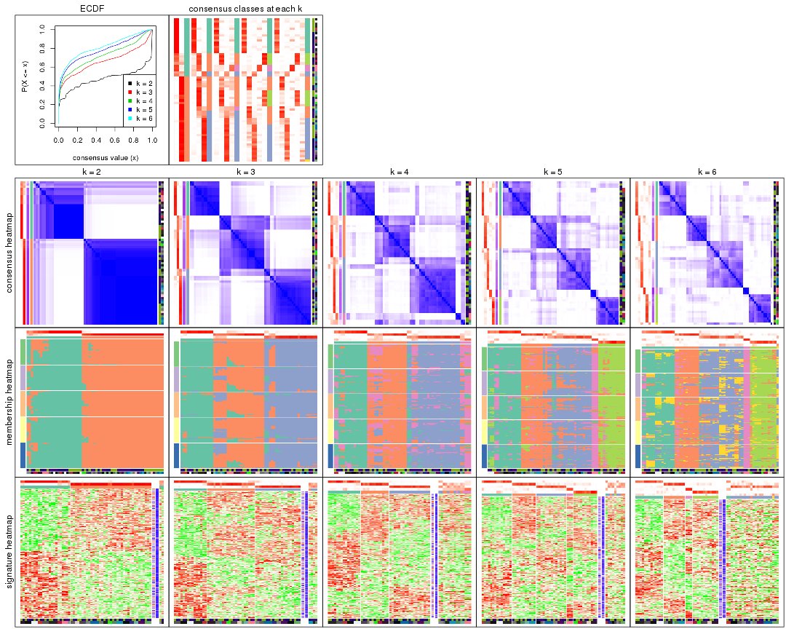

The plots are:

- The first row: a plot of the ECDF (empirical cumulative distribution
  function) curves of the consensus matrix for each `k` and the heatmap of
  predicted classes for each `k`.
- The second row: heatmaps of the consensus matrix for each `k`.
- The third row: heatmaps of the membership matrix for each `k`.
- The fouth row: heatmaps of the signatures for each `k`.

All the plots in panels can be made by individual functions and they are
plotted later in this section.

`select_partition_number()` produces several plots showing different
statistics for choosing "optimized" `k`. There are following statistics:

- ECDF curves of the consensus matrix for each `k`;
- 1-PAC. [The PAC
  score](https://en.wikipedia.org/wiki/Consensus_clustering#Over-interpretation_potential_of_consensus_clustering)
  measures the proportion of the ambiguous subgrouping.
- Mean silhouette score.
- Concordance. The mean probability of fiting the consensus class ids in all
  partitions.
- Area increased. Denote $A_k$ as the area under the ECDF curve for current
  `k`, the area increased is defined as $A_k - A_{k-1}$.
- Rand index. The percent of pairs of samples that are both in a same cluster
  or both are not in a same cluster in the partition of k and k-1.
- Jaccard index. The ratio of pairs of samples are both in a same cluster in
  the partition of k and k-1 and the pairs of samples are both in a same
  cluster in the partition k or k-1.

The detailed explanations of these statistics can be found in [the _cola_
vignette](http://bioconductor.org/packages/devel/bioc/vignettes/cola/inst/doc/cola.html#toc_13).

Generally speaking, lower PAC score, higher mean silhouette score or higher
concordance corresponds to better partition. Rand index and Jaccard index
measure how similar the current partition is compared to partition with `k-1`.
If they are too similar, we won't accept `k` is better than `k-1`.

```r
select_partition_number(res)
```

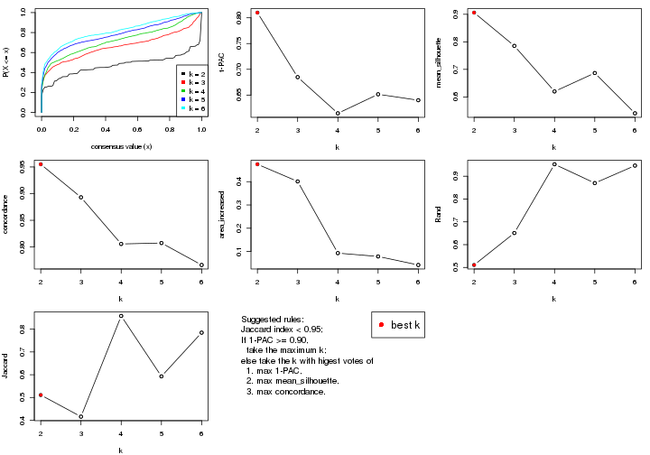

The numeric values for all these statistics can be obtained by `get_stats()`.

```r
get_stats(res)
```

```
#>   k 1-PAC mean_silhouette concordance area_increased  Rand Jaccard
#> 2 2 0.810           0.906       0.955         0.4746 0.511   0.511
#> 3 3 0.685           0.785       0.893         0.4009 0.651   0.416
#> 4 4 0.615           0.620       0.806         0.0931 0.952   0.858
#> 5 5 0.652           0.687       0.807         0.0788 0.870   0.593
#> 6 6 0.640           0.541       0.766         0.0422 0.947   0.785
```

`suggest_best_k()` suggests the best $k$ based on these statistics. The rules are as follows:

- All $k$ with Jaccard index larger than 0.95 are removed because increasing
  $k$ does not provide enough extra information. If all $k$ are removed, it is
  marked as no subgroup is detected.
- For all $k$ with 1-PAC score larger than 0.9, the maximal $k$ is taken as
  the best $k$, and other $k$ are marked as optional $k$.
- If it does not fit the second rule. The $k$ with the maximal vote of the
  highest 1-PAC score, highest mean silhouette, and highest concordance is
  taken as the best $k$.

```r
suggest_best_k(res)
```

```
#> [1] 2
```


Following shows the table of the partitions (You need to click the **show/hide
code output** link to see it). The membership matrix (columns with name `p*`)
is inferred by
[`clue::cl_consensus()`](https://www.rdocumentation.org/link/cl_consensus?package=clue)
function with the `SE` method. Basically the value in the membership matrix
represents the probability to belong to a certain group. The finall class
label for an item is determined with the group with highest probability it
belongs to.

In `get_classes()` function, the entropy is calculated from the membership
matrix and the silhouette score is calculated from the consensus matrix.


<script>
$( function() {
	$( '#tabs-MAD-NMF-get-classes' ).tabs();
} );
</script>
<div id='tabs-MAD-NMF-get-classes'>
<ul>
<li><a href='#tab-MAD-NMF-get-classes-1'>k = 2</a></li>
<li><a href='#tab-MAD-NMF-get-classes-2'>k = 3</a></li>
<li><a href='#tab-MAD-NMF-get-classes-3'>k = 4</a></li>
<li><a href='#tab-MAD-NMF-get-classes-4'>k = 5</a></li>
<li><a href='#tab-MAD-NMF-get-classes-5'>k = 6</a></li>
</ul>

<div id='tab-MAD-NMF-get-classes-1'>
<p><a id='tab-MAD-NMF-get-classes-1-a' style='color:#0366d6' href='#'>show/hide code output</a></p>
<pre><code class="r">cbind(get_classes(res, k = 2), get_membership(res, k = 2))
</code></pre>

<pre><code>#&gt;           class entropy silhouette    p1    p2
#&gt; GSM525314     1  0.0000      0.903 1.000 0.000
#&gt; GSM525315     2  0.0000      0.984 0.000 1.000
#&gt; GSM525316     1  0.5408      0.845 0.876 0.124
#&gt; GSM525317     2  0.0000      0.984 0.000 1.000
#&gt; GSM525318     2  0.0000      0.984 0.000 1.000
#&gt; GSM525319     2  0.0000      0.984 0.000 1.000
#&gt; GSM525320     2  0.0938      0.977 0.012 0.988
#&gt; GSM525321     2  0.0376      0.982 0.004 0.996
#&gt; GSM525322     2  0.0376      0.982 0.004 0.996
#&gt; GSM525323     1  0.0000      0.903 1.000 0.000
#&gt; GSM525324     2  0.0000      0.984 0.000 1.000
#&gt; GSM525325     2  0.0376      0.981 0.004 0.996
#&gt; GSM525326     1  0.4022      0.873 0.920 0.080
#&gt; GSM525327     1  0.0000      0.903 1.000 0.000
#&gt; GSM525328     1  0.0000      0.903 1.000 0.000
#&gt; GSM525329     1  0.9988      0.130 0.520 0.480
#&gt; GSM525330     2  0.0000      0.984 0.000 1.000
#&gt; GSM525331     2  0.4690      0.879 0.100 0.900
#&gt; GSM525332     1  0.7950      0.729 0.760 0.240
#&gt; GSM525333     2  0.0000      0.984 0.000 1.000
#&gt; GSM525334     2  0.4022      0.908 0.080 0.920
#&gt; GSM525335     2  0.0000      0.984 0.000 1.000
#&gt; GSM525336     1  0.0000      0.903 1.000 0.000
#&gt; GSM525337     2  0.0000      0.984 0.000 1.000
#&gt; GSM525338     2  0.0376      0.982 0.004 0.996
#&gt; GSM525339     1  0.0000      0.903 1.000 0.000
#&gt; GSM525340     1  0.0000      0.903 1.000 0.000
#&gt; GSM525341     2  0.0000      0.984 0.000 1.000
#&gt; GSM525342     1  0.6531      0.808 0.832 0.168
#&gt; GSM525343     2  0.0000      0.984 0.000 1.000
#&gt; GSM525344     2  0.0376      0.982 0.004 0.996
#&gt; GSM525345     1  0.0000      0.903 1.000 0.000
#&gt; GSM525346     2  0.0000      0.984 0.000 1.000
#&gt; GSM525347     2  0.3733      0.914 0.072 0.928
#&gt; GSM525348     1  0.4815      0.859 0.896 0.104
#&gt; GSM525349     1  0.0000      0.903 1.000 0.000
#&gt; GSM525350     2  0.0000      0.984 0.000 1.000
#&gt; GSM525351     2  0.6531      0.779 0.168 0.832
#&gt; GSM525352     1  0.7815      0.740 0.768 0.232
#&gt; GSM525353     2  0.0000      0.984 0.000 1.000
#&gt; GSM525354     2  0.0938      0.977 0.012 0.988
#&gt; GSM525355     2  0.0000      0.984 0.000 1.000
#&gt; GSM525356     1  0.0000      0.903 1.000 0.000
#&gt; GSM525357     2  0.0376      0.982 0.004 0.996
#&gt; GSM525358     1  0.0000      0.903 1.000 0.000
#&gt; GSM525359     1  0.0000      0.903 1.000 0.000
#&gt; GSM525360     2  0.0000      0.984 0.000 1.000
#&gt; GSM525361     1  0.9881      0.342 0.564 0.436
#&gt; GSM525362     2  0.0000      0.984 0.000 1.000
#&gt; GSM525363     2  0.0000      0.984 0.000 1.000
#&gt; GSM525364     2  0.2043      0.959 0.032 0.968
#&gt; GSM525365     2  0.1184      0.974 0.016 0.984
#&gt; GSM525366     2  0.0376      0.982 0.004 0.996
#&gt; GSM525367     1  0.0000      0.903 1.000 0.000
#&gt; GSM525368     2  0.0000      0.984 0.000 1.000
#&gt; GSM525369     2  0.0000      0.984 0.000 1.000
#&gt; GSM525370     1  0.3733      0.877 0.928 0.072
#&gt; GSM525371     1  0.0000      0.903 1.000 0.000
#&gt; GSM525372     1  0.9129      0.544 0.672 0.328
#&gt; GSM525373     2  0.0000      0.984 0.000 1.000
#&gt; GSM525374     2  0.0376      0.982 0.004 0.996
#&gt; GSM525375     1  0.0000      0.903 1.000 0.000
</code></pre>

<script>
$('#tab-MAD-NMF-get-classes-1-a').parent().next().next().hide();
$('#tab-MAD-NMF-get-classes-1-a').click(function(){
  $('#tab-MAD-NMF-get-classes-1-a').parent().next().next().toggle();
  return(false);
});
</script>
</div>

<div id='tab-MAD-NMF-get-classes-2'>
<p><a id='tab-MAD-NMF-get-classes-2-a' style='color:#0366d6' href='#'>show/hide code output</a></p>
<pre><code class="r">cbind(get_classes(res, k = 3), get_membership(res, k = 3))
</code></pre>

<pre><code>#&gt;           class entropy silhouette    p1    p2    p3
#&gt; GSM525314     1  0.0747      0.948 0.984 0.016 0.000
#&gt; GSM525315     2  0.5465      0.591 0.000 0.712 0.288
#&gt; GSM525316     2  0.4654      0.693 0.208 0.792 0.000
#&gt; GSM525317     3  0.1753      0.865 0.000 0.048 0.952
#&gt; GSM525318     3  0.1163      0.875 0.028 0.000 0.972
#&gt; GSM525319     2  0.5706      0.537 0.000 0.680 0.320
#&gt; GSM525320     3  0.0983      0.877 0.004 0.016 0.980
#&gt; GSM525321     3  0.0829      0.878 0.012 0.004 0.984
#&gt; GSM525322     3  0.1860      0.862 0.000 0.052 0.948
#&gt; GSM525323     1  0.1163      0.946 0.972 0.028 0.000
#&gt; GSM525324     3  0.3752      0.781 0.000 0.144 0.856
#&gt; GSM525325     2  0.0424      0.817 0.008 0.992 0.000
#&gt; GSM525326     2  0.4887      0.666 0.228 0.772 0.000
#&gt; GSM525327     1  0.0475      0.948 0.992 0.004 0.004
#&gt; GSM525328     1  0.0892      0.948 0.980 0.020 0.000
#&gt; GSM525329     3  0.4887      0.674 0.228 0.000 0.772
#&gt; GSM525330     2  0.1529      0.815 0.000 0.960 0.040
#&gt; GSM525331     2  0.1031      0.816 0.024 0.976 0.000
#&gt; GSM525332     2  0.2625      0.795 0.084 0.916 0.000
#&gt; GSM525333     2  0.1529      0.815 0.000 0.960 0.040
#&gt; GSM525334     3  0.0747      0.878 0.016 0.000 0.984
#&gt; GSM525335     2  0.4842      0.671 0.000 0.776 0.224
#&gt; GSM525336     1  0.4178      0.801 0.828 0.172 0.000
#&gt; GSM525337     2  0.5621      0.561 0.000 0.692 0.308
#&gt; GSM525338     3  0.0424      0.876 0.000 0.008 0.992
#&gt; GSM525339     1  0.1163      0.939 0.972 0.000 0.028
#&gt; GSM525340     1  0.1163      0.946 0.972 0.028 0.000
#&gt; GSM525341     2  0.5968      0.440 0.000 0.636 0.364
#&gt; GSM525342     2  0.3879      0.748 0.152 0.848 0.000
#&gt; GSM525343     3  0.0892      0.875 0.000 0.020 0.980
#&gt; GSM525344     3  0.1753      0.865 0.000 0.048 0.952
#&gt; GSM525345     1  0.1163      0.946 0.972 0.028 0.000
#&gt; GSM525346     3  0.1643      0.867 0.000 0.044 0.956
#&gt; GSM525347     2  0.1031      0.816 0.024 0.976 0.000
#&gt; GSM525348     2  0.4750      0.681 0.216 0.784 0.000
#&gt; GSM525349     1  0.1163      0.945 0.972 0.028 0.000
#&gt; GSM525350     2  0.1411      0.816 0.000 0.964 0.036
#&gt; GSM525351     2  0.1031      0.816 0.024 0.976 0.000
#&gt; GSM525352     2  0.2796      0.792 0.092 0.908 0.000
#&gt; GSM525353     2  0.1411      0.816 0.000 0.964 0.036
#&gt; GSM525354     3  0.0892      0.877 0.020 0.000 0.980
#&gt; GSM525355     2  0.5591      0.567 0.000 0.696 0.304
#&gt; GSM525356     1  0.3752      0.837 0.856 0.144 0.000
#&gt; GSM525357     3  0.1289      0.873 0.032 0.000 0.968
#&gt; GSM525358     1  0.1163      0.939 0.972 0.000 0.028
#&gt; GSM525359     1  0.0747      0.944 0.984 0.000 0.016
#&gt; GSM525360     3  0.6280      0.113 0.000 0.460 0.540
#&gt; GSM525361     2  0.2878      0.789 0.096 0.904 0.000
#&gt; GSM525362     3  0.1289      0.874 0.032 0.000 0.968
#&gt; GSM525363     3  0.6280      0.113 0.000 0.460 0.540
#&gt; GSM525364     3  0.2165      0.855 0.064 0.000 0.936
#&gt; GSM525365     3  0.2796      0.835 0.092 0.000 0.908
#&gt; GSM525366     3  0.0592      0.877 0.012 0.000 0.988
#&gt; GSM525367     1  0.0983      0.946 0.980 0.004 0.016
#&gt; GSM525368     3  0.1289      0.871 0.000 0.032 0.968
#&gt; GSM525369     2  0.0892      0.818 0.000 0.980 0.020
#&gt; GSM525370     2  0.5529      0.552 0.296 0.704 0.000
#&gt; GSM525371     1  0.1289      0.936 0.968 0.000 0.032
#&gt; GSM525372     3  0.5291      0.606 0.268 0.000 0.732
#&gt; GSM525373     3  0.5810      0.470 0.000 0.336 0.664
#&gt; GSM525374     3  0.1289      0.873 0.032 0.000 0.968
#&gt; GSM525375     1  0.2711      0.882 0.912 0.000 0.088
</code></pre>

<script>
$('#tab-MAD-NMF-get-classes-2-a').parent().next().next().hide();
$('#tab-MAD-NMF-get-classes-2-a').click(function(){
  $('#tab-MAD-NMF-get-classes-2-a').parent().next().next().toggle();
  return(false);
});
</script>
</div>

<div id='tab-MAD-NMF-get-classes-3'>
<p><a id='tab-MAD-NMF-get-classes-3-a' style='color:#0366d6' href='#'>show/hide code output</a></p>
<pre><code class="r">cbind(get_classes(res, k = 4), get_membership(res, k = 4))
</code></pre>

<pre><code>#&gt;           class entropy silhouette    p1    p2    p3    p4
#&gt; GSM525314     1  0.2392     0.8503 0.928 0.024 0.012 0.036
#&gt; GSM525315     2  0.7536     0.1579 0.000 0.488 0.228 0.284
#&gt; GSM525316     2  0.3570     0.6053 0.048 0.860 0.000 0.092
#&gt; GSM525317     3  0.2189     0.7974 0.004 0.020 0.932 0.044
#&gt; GSM525318     3  0.3532     0.7695 0.044 0.020 0.880 0.056
#&gt; GSM525319     4  0.7768     0.1687 0.000 0.240 0.360 0.400
#&gt; GSM525320     3  0.1262     0.8032 0.008 0.008 0.968 0.016
#&gt; GSM525321     3  0.3240     0.7947 0.028 0.020 0.892 0.060
#&gt; GSM525322     3  0.2799     0.7670 0.000 0.008 0.884 0.108
#&gt; GSM525323     1  0.6123     0.6659 0.696 0.212 0.020 0.072
#&gt; GSM525324     3  0.3863     0.7191 0.000 0.028 0.828 0.144
#&gt; GSM525325     2  0.1492     0.6943 0.004 0.956 0.004 0.036
#&gt; GSM525326     4  0.5708     0.4976 0.124 0.160 0.000 0.716
#&gt; GSM525327     1  0.1022     0.8578 0.968 0.000 0.000 0.032
#&gt; GSM525328     1  0.2053     0.8479 0.924 0.004 0.000 0.072
#&gt; GSM525329     3  0.5982     0.2061 0.436 0.000 0.524 0.040
#&gt; GSM525330     2  0.2089     0.6881 0.000 0.932 0.020 0.048
#&gt; GSM525331     2  0.0859     0.6901 0.008 0.980 0.004 0.008
#&gt; GSM525332     2  0.1151     0.6833 0.008 0.968 0.000 0.024
#&gt; GSM525333     2  0.5156     0.5376 0.000 0.720 0.044 0.236
#&gt; GSM525334     3  0.3432     0.7860 0.036 0.020 0.884 0.060
#&gt; GSM525335     2  0.7816    -0.0647 0.000 0.400 0.260 0.340
#&gt; GSM525336     1  0.5344     0.6165 0.668 0.032 0.000 0.300
#&gt; GSM525337     2  0.7390     0.2119 0.000 0.520 0.228 0.252
#&gt; GSM525338     3  0.1675     0.7964 0.004 0.004 0.948 0.044
#&gt; GSM525339     1  0.0336     0.8596 0.992 0.000 0.000 0.008
#&gt; GSM525340     1  0.1733     0.8581 0.948 0.024 0.000 0.028
#&gt; GSM525341     2  0.7892    -0.1447 0.000 0.368 0.340 0.292
#&gt; GSM525342     2  0.3051     0.6297 0.028 0.884 0.000 0.088
#&gt; GSM525343     3  0.2861     0.7898 0.032 0.012 0.908 0.048
#&gt; GSM525344     3  0.3088     0.7537 0.000 0.008 0.864 0.128
#&gt; GSM525345     1  0.5980     0.6831 0.712 0.196 0.020 0.072
#&gt; GSM525346     3  0.2011     0.7938 0.000 0.000 0.920 0.080
#&gt; GSM525347     2  0.4134     0.5666 0.000 0.740 0.000 0.260
#&gt; GSM525348     4  0.5462     0.5001 0.112 0.152 0.000 0.736
#&gt; GSM525349     1  0.2530     0.8352 0.896 0.004 0.000 0.100
#&gt; GSM525350     2  0.1297     0.6934 0.000 0.964 0.016 0.020
#&gt; GSM525351     2  0.2401     0.6810 0.004 0.904 0.000 0.092
#&gt; GSM525352     2  0.0804     0.6857 0.008 0.980 0.000 0.012
#&gt; GSM525353     2  0.5522     0.4867 0.000 0.668 0.044 0.288
#&gt; GSM525354     3  0.2115     0.8016 0.024 0.004 0.936 0.036
#&gt; GSM525355     4  0.7820     0.1544 0.000 0.256 0.360 0.384
#&gt; GSM525356     1  0.5778     0.5212 0.604 0.040 0.000 0.356
#&gt; GSM525357     3  0.1624     0.8033 0.028 0.000 0.952 0.020
#&gt; GSM525358     1  0.0376     0.8586 0.992 0.000 0.004 0.004
#&gt; GSM525359     1  0.1007     0.8605 0.976 0.008 0.008 0.008
#&gt; GSM525360     3  0.7536    -0.0515 0.000 0.220 0.484 0.296
#&gt; GSM525361     2  0.2796     0.6375 0.016 0.892 0.000 0.092
#&gt; GSM525362     3  0.1936     0.7920 0.028 0.000 0.940 0.032
#&gt; GSM525363     3  0.6926     0.0407 0.000 0.112 0.496 0.392
#&gt; GSM525364     3  0.3189     0.7703 0.060 0.004 0.888 0.048
#&gt; GSM525365     3  0.3435     0.7484 0.100 0.000 0.864 0.036
#&gt; GSM525366     3  0.2412     0.7967 0.008 0.000 0.908 0.084
#&gt; GSM525367     1  0.4894     0.7758 0.816 0.068 0.052 0.064
#&gt; GSM525368     3  0.1792     0.7965 0.000 0.000 0.932 0.068
#&gt; GSM525369     2  0.3280     0.6706 0.000 0.860 0.016 0.124
#&gt; GSM525370     4  0.5428     0.4977 0.140 0.120 0.000 0.740
#&gt; GSM525371     1  0.2473     0.8430 0.908 0.000 0.012 0.080
#&gt; GSM525372     3  0.5699     0.3564 0.380 0.000 0.588 0.032
#&gt; GSM525373     3  0.6834     0.2969 0.000 0.164 0.596 0.240
#&gt; GSM525374     3  0.1724     0.7945 0.032 0.000 0.948 0.020
#&gt; GSM525375     1  0.1284     0.8524 0.964 0.000 0.024 0.012
</code></pre>

<script>
$('#tab-MAD-NMF-get-classes-3-a').parent().next().next().hide();
$('#tab-MAD-NMF-get-classes-3-a').click(function(){
  $('#tab-MAD-NMF-get-classes-3-a').parent().next().next().toggle();
  return(false);
});
</script>
</div>

<div id='tab-MAD-NMF-get-classes-4'>
<p><a id='tab-MAD-NMF-get-classes-4-a' style='color:#0366d6' href='#'>show/hide code output</a></p>
<pre><code class="r">cbind(get_classes(res, k = 5), get_membership(res, k = 5))
</code></pre>

<pre><code>#&gt;           class entropy silhouette    p1    p2    p3    p4    p5
#&gt; GSM525314     1   0.212     0.8004 0.924 0.008 0.036 0.000 0.032
#&gt; GSM525315     2   0.223     0.7426 0.000 0.916 0.020 0.008 0.056
#&gt; GSM525316     5   0.029     0.8319 0.000 0.008 0.000 0.000 0.992
#&gt; GSM525317     3   0.374     0.7352 0.016 0.156 0.812 0.008 0.008
#&gt; GSM525318     3   0.373     0.7504 0.024 0.092 0.844 0.008 0.032
#&gt; GSM525319     2   0.175     0.7470 0.000 0.936 0.028 0.036 0.000
#&gt; GSM525320     3   0.311     0.7570 0.008 0.124 0.852 0.016 0.000
#&gt; GSM525321     3   0.540     0.4269 0.036 0.368 0.580 0.016 0.000
#&gt; GSM525322     2   0.510     0.0952 0.000 0.556 0.404 0.040 0.000
#&gt; GSM525323     1   0.578     0.5253 0.592 0.012 0.056 0.008 0.332
#&gt; GSM525324     3   0.495     0.6700 0.000 0.164 0.712 0.124 0.000
#&gt; GSM525325     5   0.271     0.8500 0.000 0.132 0.000 0.008 0.860
#&gt; GSM525326     4   0.314     0.9848 0.040 0.096 0.000 0.860 0.004
#&gt; GSM525327     1   0.149     0.8049 0.948 0.008 0.004 0.040 0.000
#&gt; GSM525328     1   0.217     0.7985 0.920 0.016 0.004 0.056 0.004
#&gt; GSM525329     3   0.573     0.1759 0.452 0.048 0.484 0.016 0.000
#&gt; GSM525330     5   0.321     0.8222 0.000 0.180 0.000 0.008 0.812
#&gt; GSM525331     5   0.230     0.8615 0.000 0.100 0.000 0.008 0.892
#&gt; GSM525332     5   0.205     0.8596 0.008 0.072 0.000 0.004 0.916
#&gt; GSM525333     2   0.346     0.6209 0.000 0.812 0.004 0.016 0.168
#&gt; GSM525334     2   0.587     0.1804 0.076 0.552 0.360 0.012 0.000
#&gt; GSM525335     2   0.332     0.7144 0.000 0.852 0.012 0.104 0.032
#&gt; GSM525336     1   0.449     0.5024 0.652 0.008 0.000 0.332 0.008
#&gt; GSM525337     2   0.236     0.7377 0.000 0.900 0.024 0.000 0.076
#&gt; GSM525338     3   0.506     0.4128 0.020 0.388 0.580 0.012 0.000
#&gt; GSM525339     1   0.181     0.8036 0.944 0.008 0.016 0.020 0.012
#&gt; GSM525340     1   0.219     0.8090 0.928 0.008 0.020 0.016 0.028
#&gt; GSM525341     2   0.159     0.7503 0.000 0.948 0.016 0.008 0.028
#&gt; GSM525342     5   0.029     0.8324 0.000 0.008 0.000 0.000 0.992
#&gt; GSM525343     3   0.433     0.7190 0.024 0.176 0.776 0.008 0.016
#&gt; GSM525344     2   0.522    -0.0377 0.000 0.516 0.440 0.044 0.000
#&gt; GSM525345     1   0.596     0.5326 0.596 0.012 0.076 0.008 0.308
#&gt; GSM525346     3   0.328     0.7095 0.000 0.032 0.836 0.132 0.000
#&gt; GSM525347     5   0.630     0.4541 0.000 0.196 0.000 0.280 0.524
#&gt; GSM525348     4   0.298     0.9851 0.032 0.096 0.000 0.868 0.004
#&gt; GSM525349     1   0.294     0.7743 0.868 0.016 0.004 0.108 0.004
#&gt; GSM525350     5   0.251     0.8581 0.000 0.116 0.000 0.008 0.876
#&gt; GSM525351     5   0.451     0.6891 0.004 0.284 0.000 0.024 0.688
#&gt; GSM525352     5   0.199     0.8604 0.004 0.068 0.000 0.008 0.920
#&gt; GSM525353     2   0.459     0.6210 0.000 0.764 0.008 0.124 0.104
#&gt; GSM525354     3   0.525     0.4381 0.032 0.372 0.584 0.012 0.000
#&gt; GSM525355     2   0.429     0.6176 0.000 0.748 0.024 0.216 0.012
#&gt; GSM525356     1   0.423     0.3284 0.580 0.000 0.000 0.420 0.000
#&gt; GSM525357     3   0.369     0.7327 0.028 0.164 0.804 0.004 0.000
#&gt; GSM525358     1   0.125     0.8079 0.964 0.004 0.008 0.016 0.008
#&gt; GSM525359     1   0.245     0.8090 0.916 0.008 0.036 0.024 0.016
#&gt; GSM525360     2   0.134     0.7456 0.000 0.944 0.056 0.000 0.000
#&gt; GSM525361     5   0.131     0.8303 0.000 0.016 0.012 0.012 0.960
#&gt; GSM525362     3   0.207     0.7530 0.000 0.028 0.924 0.044 0.004
#&gt; GSM525363     2   0.353     0.7124 0.000 0.832 0.072 0.096 0.000
#&gt; GSM525364     3   0.313     0.7222 0.000 0.028 0.860 0.104 0.008
#&gt; GSM525365     3   0.265     0.7568 0.016 0.048 0.900 0.036 0.000
#&gt; GSM525366     3   0.454     0.7109 0.008 0.124 0.768 0.100 0.000
#&gt; GSM525367     1   0.514     0.6820 0.736 0.012 0.104 0.008 0.140
#&gt; GSM525368     3   0.321     0.7170 0.000 0.036 0.844 0.120 0.000
#&gt; GSM525369     5   0.458     0.7675 0.000 0.100 0.008 0.128 0.764
#&gt; GSM525370     4   0.281     0.9810 0.040 0.084 0.000 0.876 0.000
#&gt; GSM525371     1   0.297     0.7750 0.868 0.012 0.016 0.104 0.000
#&gt; GSM525372     3   0.497     0.6372 0.228 0.024 0.708 0.040 0.000
#&gt; GSM525373     2   0.316     0.7162 0.004 0.860 0.092 0.044 0.000
#&gt; GSM525374     3   0.212     0.7603 0.008 0.068 0.916 0.008 0.000
#&gt; GSM525375     1   0.118     0.8094 0.964 0.004 0.016 0.016 0.000
</code></pre>

<script>
$('#tab-MAD-NMF-get-classes-4-a').parent().next().next().hide();
$('#tab-MAD-NMF-get-classes-4-a').click(function(){
  $('#tab-MAD-NMF-get-classes-4-a').parent().next().next().toggle();
  return(false);
});
</script>
</div>

<div id='tab-MAD-NMF-get-classes-5'>
<p><a id='tab-MAD-NMF-get-classes-5-a' style='color:#0366d6' href='#'>show/hide code output</a></p>
<pre><code class="r">cbind(get_classes(res, k = 6), get_membership(res, k = 6))
</code></pre>

<pre><code>#&gt;           class entropy silhouette    p1    p2    p3    p4    p5    p6
#&gt; GSM525314     1   0.320     0.7237 0.856 0.004 0.072 0.012 0.004 0.052
#&gt; GSM525315     2   0.164     0.8330 0.000 0.932 0.012 0.000 0.052 0.004
#&gt; GSM525316     5   0.193     0.8144 0.004 0.000 0.004 0.008 0.916 0.068
#&gt; GSM525317     3   0.314     0.4839 0.016 0.092 0.856 0.004 0.004 0.028
#&gt; GSM525318     3   0.338     0.4627 0.056 0.040 0.848 0.004 0.000 0.052
#&gt; GSM525319     2   0.205     0.8335 0.000 0.912 0.028 0.056 0.004 0.000
#&gt; GSM525320     3   0.297     0.3927 0.004 0.032 0.864 0.000 0.016 0.084
#&gt; GSM525321     3   0.498     0.4515 0.076 0.208 0.684 0.000 0.000 0.032
#&gt; GSM525322     3   0.608    -0.1337 0.000 0.280 0.476 0.000 0.008 0.236
#&gt; GSM525323     1   0.592     0.5645 0.640 0.004 0.108 0.012 0.188 0.048
#&gt; GSM525324     3   0.503     0.1837 0.000 0.068 0.716 0.096 0.000 0.120
#&gt; GSM525325     5   0.221     0.8359 0.000 0.112 0.000 0.000 0.880 0.008
#&gt; GSM525326     4   0.155     0.9903 0.000 0.028 0.004 0.944 0.020 0.004
#&gt; GSM525327     1   0.418     0.6920 0.736 0.012 0.000 0.036 0.004 0.212
#&gt; GSM525328     1   0.429     0.6856 0.720 0.012 0.000 0.036 0.004 0.228
#&gt; GSM525329     3   0.671     0.1940 0.328 0.120 0.476 0.012 0.000 0.064
#&gt; GSM525330     5   0.328     0.7887 0.000 0.196 0.000 0.000 0.784 0.020
#&gt; GSM525331     5   0.245     0.8412 0.004 0.092 0.000 0.004 0.884 0.016
#&gt; GSM525332     5   0.148     0.8430 0.008 0.036 0.000 0.000 0.944 0.012
#&gt; GSM525333     2   0.283     0.7914 0.000 0.856 0.008 0.024 0.112 0.000
#&gt; GSM525334     3   0.591     0.3520 0.056 0.292 0.572 0.000 0.004 0.076
#&gt; GSM525335     2   0.486     0.6567 0.000 0.680 0.060 0.232 0.028 0.000
#&gt; GSM525336     1   0.503     0.4549 0.580 0.004 0.000 0.340 0.000 0.076
#&gt; GSM525337     2   0.150     0.8409 0.000 0.940 0.028 0.000 0.032 0.000
#&gt; GSM525338     3   0.485     0.4530 0.064 0.216 0.696 0.004 0.004 0.016
#&gt; GSM525339     1   0.220     0.7381 0.912 0.004 0.048 0.012 0.000 0.024
#&gt; GSM525340     1   0.182     0.7428 0.932 0.000 0.028 0.008 0.004 0.028
#&gt; GSM525341     2   0.129     0.8434 0.000 0.956 0.020 0.004 0.016 0.004
#&gt; GSM525342     5   0.197     0.8127 0.004 0.000 0.004 0.012 0.916 0.064
#&gt; GSM525343     3   0.426     0.4790 0.052 0.104 0.796 0.012 0.008 0.028
#&gt; GSM525344     3   0.613    -0.2402 0.000 0.260 0.464 0.000 0.008 0.268
#&gt; GSM525345     1   0.607     0.5585 0.632 0.004 0.140 0.012 0.160 0.052
#&gt; GSM525346     3   0.443    -0.4014 0.000 0.004 0.584 0.024 0.000 0.388
#&gt; GSM525347     5   0.465     0.7635 0.004 0.132 0.000 0.088 0.744 0.032
#&gt; GSM525348     4   0.126     0.9920 0.000 0.028 0.000 0.952 0.020 0.000
#&gt; GSM525349     1   0.471     0.6698 0.696 0.012 0.000 0.068 0.004 0.220
#&gt; GSM525350     5   0.207     0.8440 0.000 0.100 0.000 0.000 0.892 0.008
#&gt; GSM525351     5   0.438     0.7023 0.008 0.236 0.000 0.012 0.712 0.032
#&gt; GSM525352     5   0.148     0.8434 0.008 0.036 0.000 0.000 0.944 0.012
#&gt; GSM525353     2   0.410     0.7000 0.000 0.732 0.012 0.220 0.036 0.000
#&gt; GSM525354     3   0.497     0.4628 0.068 0.192 0.700 0.000 0.004 0.036
#&gt; GSM525355     2   0.516     0.2338 0.000 0.492 0.056 0.440 0.012 0.000
#&gt; GSM525356     1   0.481     0.3461 0.536 0.000 0.000 0.408 0.000 0.056
#&gt; GSM525357     3   0.266     0.4797 0.012 0.108 0.868 0.004 0.000 0.008
#&gt; GSM525358     1   0.209     0.7407 0.920 0.004 0.036 0.016 0.000 0.024
#&gt; GSM525359     1   0.308     0.7370 0.848 0.000 0.008 0.032 0.004 0.108
#&gt; GSM525360     2   0.105     0.8373 0.000 0.964 0.020 0.000 0.004 0.012
#&gt; GSM525361     5   0.341     0.7515 0.000 0.000 0.008 0.020 0.792 0.180
#&gt; GSM525362     3   0.262     0.2759 0.004 0.004 0.844 0.000 0.000 0.148
#&gt; GSM525363     2   0.267     0.8270 0.000 0.888 0.028 0.024 0.004 0.056
#&gt; GSM525364     3   0.444    -0.6410 0.000 0.004 0.500 0.012 0.004 0.480
#&gt; GSM525365     3   0.442     0.0810 0.024 0.036 0.708 0.000 0.000 0.232
#&gt; GSM525366     6   0.477     0.0000 0.000 0.044 0.404 0.004 0.000 0.548
#&gt; GSM525367     1   0.500     0.6522 0.744 0.004 0.112 0.016 0.076 0.048
#&gt; GSM525368     3   0.458    -0.4719 0.000 0.008 0.556 0.024 0.000 0.412
#&gt; GSM525369     5   0.475     0.6725 0.004 0.056 0.000 0.008 0.660 0.272
#&gt; GSM525370     4   0.109     0.9886 0.000 0.020 0.000 0.960 0.020 0.000
#&gt; GSM525371     1   0.503     0.6411 0.648 0.012 0.004 0.060 0.004 0.272
#&gt; GSM525372     3   0.607    -0.0666 0.136 0.044 0.556 0.000 0.000 0.264
#&gt; GSM525373     2   0.236     0.7992 0.000 0.892 0.032 0.000 0.004 0.072
#&gt; GSM525374     3   0.268     0.3473 0.000 0.032 0.860 0.000 0.000 0.108
#&gt; GSM525375     1   0.234     0.7444 0.900 0.004 0.012 0.016 0.000 0.068
</code></pre>

<script>
$('#tab-MAD-NMF-get-classes-5-a').parent().next().next().hide();
$('#tab-MAD-NMF-get-classes-5-a').click(function(){
  $('#tab-MAD-NMF-get-classes-5-a').parent().next().next().toggle();
  return(false);
});
</script>
</div>
</div>

Heatmaps for the consensus matrix. It visualizes the probability of two
samples to be in a same group.


<script>
$( function() {
	$( '#tabs-MAD-NMF-consensus-heatmap' ).tabs();
} );
</script>
<div id='tabs-MAD-NMF-consensus-heatmap'>
<ul>
<li><a href='#tab-MAD-NMF-consensus-heatmap-1'>k = 2</a></li>
<li><a href='#tab-MAD-NMF-consensus-heatmap-2'>k = 3</a></li>
<li><a href='#tab-MAD-NMF-consensus-heatmap-3'>k = 4</a></li>
<li><a href='#tab-MAD-NMF-consensus-heatmap-4'>k = 5</a></li>
<li><a href='#tab-MAD-NMF-consensus-heatmap-5'>k = 6</a></li>
</ul>
<div id='tab-MAD-NMF-consensus-heatmap-1'>
<pre><code class="r">consensus_heatmap(res, k = 2)
</code></pre>

<p>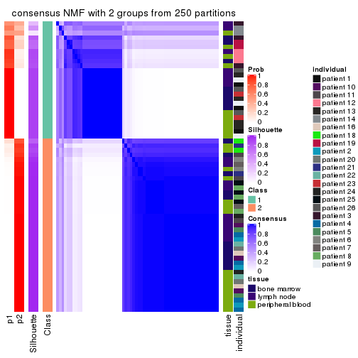</p>

</div>
<div id='tab-MAD-NMF-consensus-heatmap-2'>
<pre><code class="r">consensus_heatmap(res, k = 3)
</code></pre>

<p>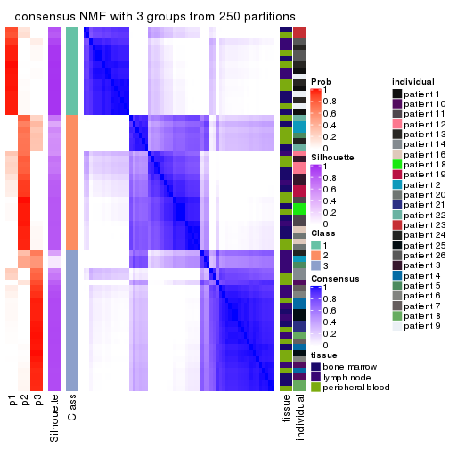</p>

</div>
<div id='tab-MAD-NMF-consensus-heatmap-3'>
<pre><code class="r">consensus_heatmap(res, k = 4)
</code></pre>

<p>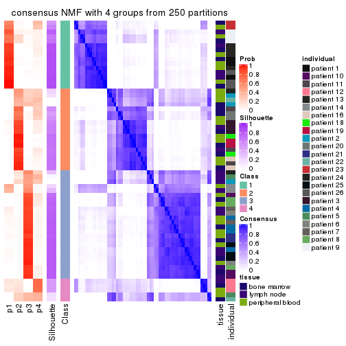</p>

</div>
<div id='tab-MAD-NMF-consensus-heatmap-4'>
<pre><code class="r">consensus_heatmap(res, k = 5)
</code></pre>

<p>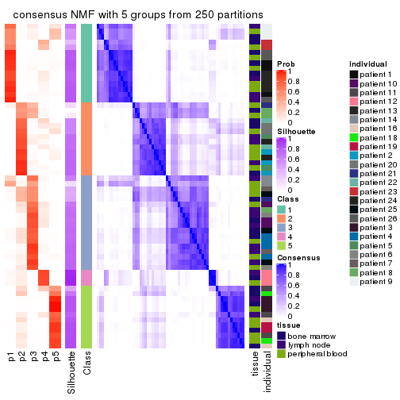</p>

</div>
<div id='tab-MAD-NMF-consensus-heatmap-5'>
<pre><code class="r">consensus_heatmap(res, k = 6)
</code></pre>

<p>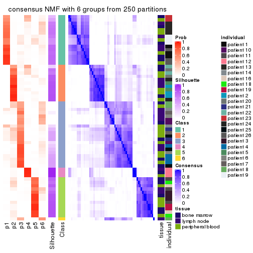</p>

</div>
</div>

Heatmaps for the membership of samples in all partitions to see how consistent they are:


<script>
$( function() {
	$( '#tabs-MAD-NMF-membership-heatmap' ).tabs();
} );
</script>
<div id='tabs-MAD-NMF-membership-heatmap'>
<ul>
<li><a href='#tab-MAD-NMF-membership-heatmap-1'>k = 2</a></li>
<li><a href='#tab-MAD-NMF-membership-heatmap-2'>k = 3</a></li>
<li><a href='#tab-MAD-NMF-membership-heatmap-3'>k = 4</a></li>
<li><a href='#tab-MAD-NMF-membership-heatmap-4'>k = 5</a></li>
<li><a href='#tab-MAD-NMF-membership-heatmap-5'>k = 6</a></li>
</ul>
<div id='tab-MAD-NMF-membership-heatmap-1'>
<pre><code class="r">membership_heatmap(res, k = 2)
</code></pre>

<p>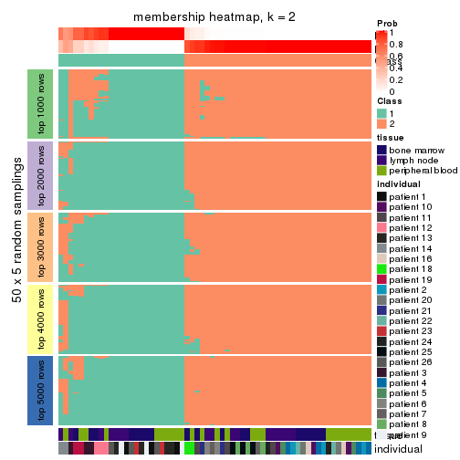</p>

</div>
<div id='tab-MAD-NMF-membership-heatmap-2'>
<pre><code class="r">membership_heatmap(res, k = 3)
</code></pre>

<p>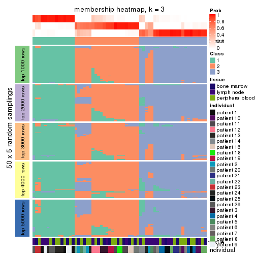</p>

</div>
<div id='tab-MAD-NMF-membership-heatmap-3'>
<pre><code class="r">membership_heatmap(res, k = 4)
</code></pre>

<p>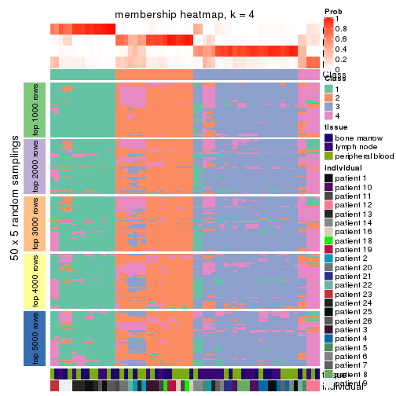</p>

</div>
<div id='tab-MAD-NMF-membership-heatmap-4'>
<pre><code class="r">membership_heatmap(res, k = 5)
</code></pre>

<p>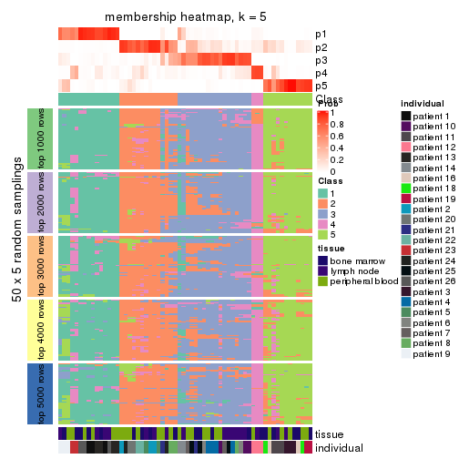</p>

</div>
<div id='tab-MAD-NMF-membership-heatmap-5'>
<pre><code class="r">membership_heatmap(res, k = 6)
</code></pre>

<p>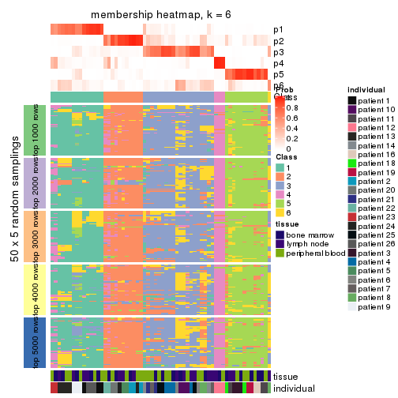</p>

</div>
</div>

As soon as we have had the classes for columns, we can look for signatures
which are significantly different between classes which can be candidate marks
for certain classes. Following are the heatmaps for signatures.


Signature heatmaps where rows are scaled:


<script>
$( function() {
	$( '#tabs-MAD-NMF-get-signatures' ).tabs();
} );
</script>
<div id='tabs-MAD-NMF-get-signatures'>
<ul>
<li><a href='#tab-MAD-NMF-get-signatures-1'>k = 2</a></li>
<li><a href='#tab-MAD-NMF-get-signatures-2'>k = 3</a></li>
<li><a href='#tab-MAD-NMF-get-signatures-3'>k = 4</a></li>
<li><a href='#tab-MAD-NMF-get-signatures-4'>k = 5</a></li>
<li><a href='#tab-MAD-NMF-get-signatures-5'>k = 6</a></li>
</ul>
<div id='tab-MAD-NMF-get-signatures-1'>
<pre><code class="r">get_signatures(res, k = 2)
</code></pre>

<p>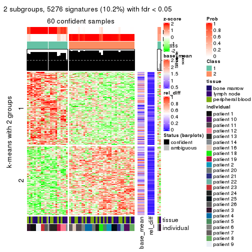</p>

</div>
<div id='tab-MAD-NMF-get-signatures-2'>
<pre><code class="r">get_signatures(res, k = 3)
</code></pre>

<p>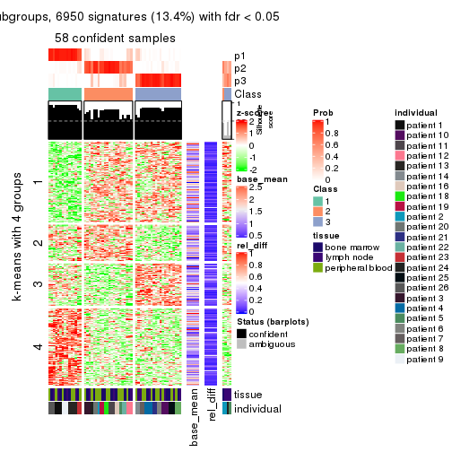</p>

</div>
<div id='tab-MAD-NMF-get-signatures-3'>
<pre><code class="r">get_signatures(res, k = 4)
</code></pre>

<p>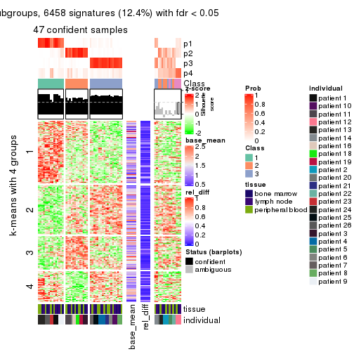</p>

</div>
<div id='tab-MAD-NMF-get-signatures-4'>
<pre><code class="r">get_signatures(res, k = 5)
</code></pre>

<p>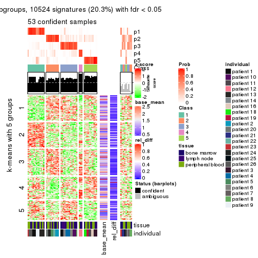</p>

</div>
<div id='tab-MAD-NMF-get-signatures-5'>
<pre><code class="r">get_signatures(res, k = 6)
</code></pre>

<p>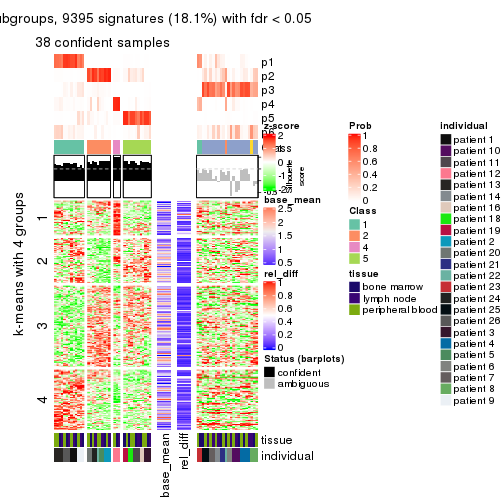</p>

</div>
</div>


Signature heatmaps where rows are not scaled:


<script>
$( function() {
	$( '#tabs-MAD-NMF-get-signatures-no-scale' ).tabs();
} );
</script>
<div id='tabs-MAD-NMF-get-signatures-no-scale'>
<ul>
<li><a href='#tab-MAD-NMF-get-signatures-no-scale-1'>k = 2</a></li>
<li><a href='#tab-MAD-NMF-get-signatures-no-scale-2'>k = 3</a></li>
<li><a href='#tab-MAD-NMF-get-signatures-no-scale-3'>k = 4</a></li>
<li><a href='#tab-MAD-NMF-get-signatures-no-scale-4'>k = 5</a></li>
<li><a href='#tab-MAD-NMF-get-signatures-no-scale-5'>k = 6</a></li>
</ul>
<div id='tab-MAD-NMF-get-signatures-no-scale-1'>
<pre><code class="r">get_signatures(res, k = 2, scale_rows = FALSE)
</code></pre>

<p>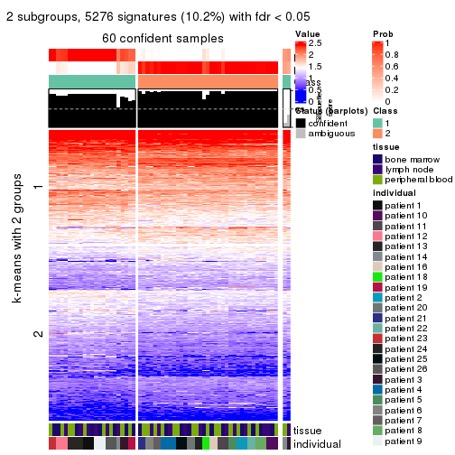</p>

</div>
<div id='tab-MAD-NMF-get-signatures-no-scale-2'>
<pre><code class="r">get_signatures(res, k = 3, scale_rows = FALSE)
</code></pre>

<p>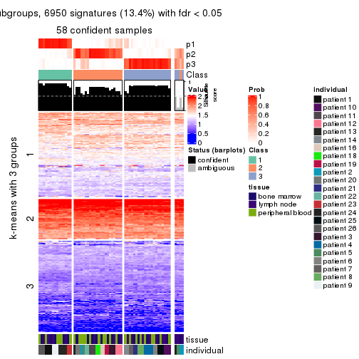</p>

</div>
<div id='tab-MAD-NMF-get-signatures-no-scale-3'>
<pre><code class="r">get_signatures(res, k = 4, scale_rows = FALSE)
</code></pre>

<p>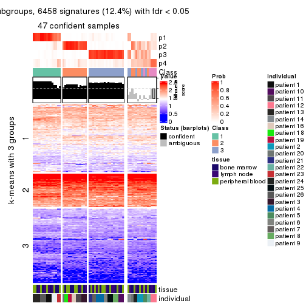</p>

</div>
<div id='tab-MAD-NMF-get-signatures-no-scale-4'>
<pre><code class="r">get_signatures(res, k = 5, scale_rows = FALSE)
</code></pre>

<p>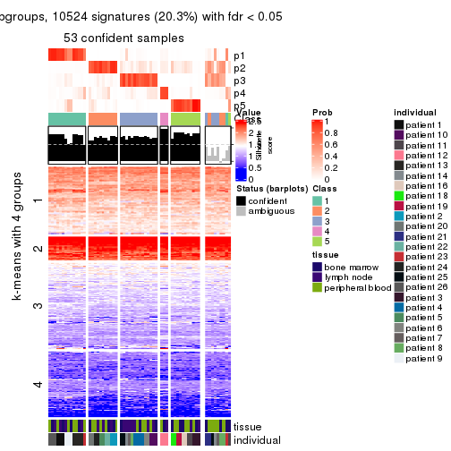</p>

</div>
<div id='tab-MAD-NMF-get-signatures-no-scale-5'>
<pre><code class="r">get_signatures(res, k = 6, scale_rows = FALSE)
</code></pre>

<p>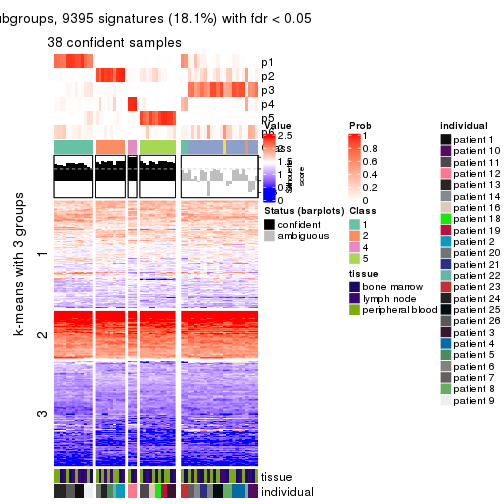</p>

</div>
</div>


Compare the overlap of signatures from different k:

```r
compare_signatures(res)
```

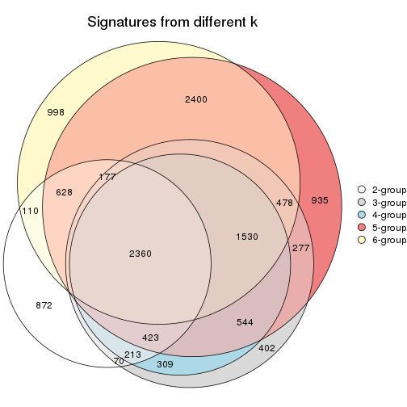

`get_signature()` returns a data frame invisibly. TO get the list of signatures, the function
call should be assigned to a variable explicitly. In following code, if `plot` argument is set
to `FALSE`, no heatmap is plotted while only the differential analysis is performed.

```r
# code only for demonstration
tb = get_signature(res, k = ..., plot = FALSE)
```

An example of the output of `tb` is:

```
#>   which_row         fdr    mean_1    mean_2 scaled_mean_1 scaled_mean_2 km
#> 1        38 0.042760348  8.373488  9.131774    -0.5533452     0.5164555  1
#> 2        40 0.018707592  7.106213  8.469186    -0.6173731     0.5762149  1
#> 3        55 0.019134737 10.221463 11.207825    -0.6159697     0.5749050  1
#> 4        59 0.006059896  5.921854  7.869574    -0.6899429     0.6439467  1
#> 5        60 0.018055526  8.928898 10.211722    -0.6204761     0.5791110  1
#> 6        98 0.009384629 15.714769 14.887706     0.6635654    -0.6193277  2
...
```

The columns in `tb` are:

1. `which_row`: row indices corresponding to the input matrix.
2. `fdr`: FDR for the differential test. 
3. `mean_x`: The mean value in group x.
4. `scaled_mean_x`: The mean value in group x after rows are scaled.
5. `km`: Row groups if k-means clustering is applied to rows.


UMAP plot which shows how samples are separated.


<script>
$( function() {
	$( '#tabs-MAD-NMF-dimension-reduction' ).tabs();
} );
</script>
<div id='tabs-MAD-NMF-dimension-reduction'>
<ul>
<li><a href='#tab-MAD-NMF-dimension-reduction-1'>k = 2</a></li>
<li><a href='#tab-MAD-NMF-dimension-reduction-2'>k = 3</a></li>
<li><a href='#tab-MAD-NMF-dimension-reduction-3'>k = 4</a></li>
<li><a href='#tab-MAD-NMF-dimension-reduction-4'>k = 5</a></li>
<li><a href='#tab-MAD-NMF-dimension-reduction-5'>k = 6</a></li>
</ul>
<div id='tab-MAD-NMF-dimension-reduction-1'>
<pre><code class="r">dimension_reduction(res, k = 2, method = &quot;UMAP&quot;)
</code></pre>

<p>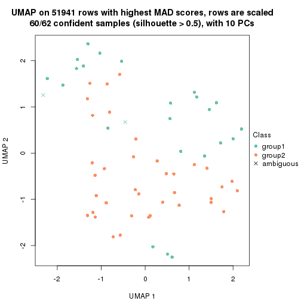</p>

</div>
<div id='tab-MAD-NMF-dimension-reduction-2'>
<pre><code class="r">dimension_reduction(res, k = 3, method = &quot;UMAP&quot;)
</code></pre>

<p>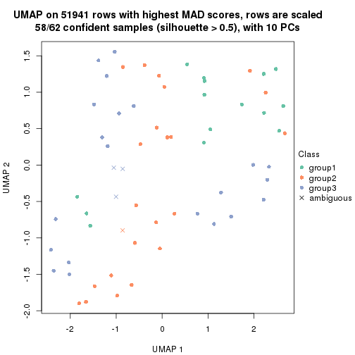</p>

</div>
<div id='tab-MAD-NMF-dimension-reduction-3'>
<pre><code class="r">dimension_reduction(res, k = 4, method = &quot;UMAP&quot;)
</code></pre>

<p>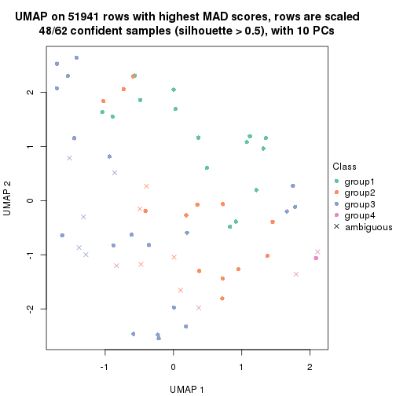</p>

</div>
<div id='tab-MAD-NMF-dimension-reduction-4'>
<pre><code class="r">dimension_reduction(res, k = 5, method = &quot;UMAP&quot;)
</code></pre>

<p>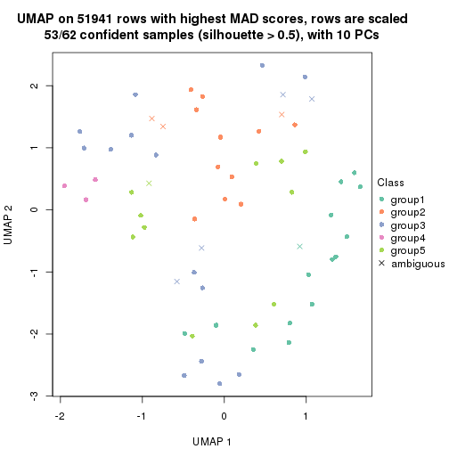</p>

</div>
<div id='tab-MAD-NMF-dimension-reduction-5'>
<pre><code class="r">dimension_reduction(res, k = 6, method = &quot;UMAP&quot;)
</code></pre>

<p>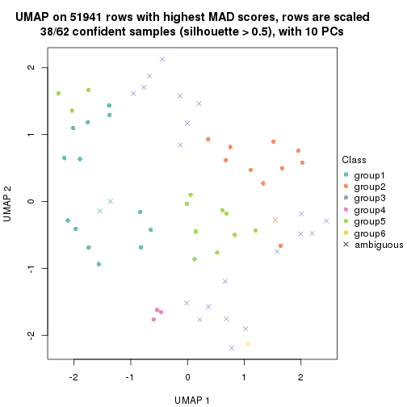</p>

</div>
</div>


Following heatmap shows how subgroups are split when increasing `k`:

```r
collect_classes(res)
```

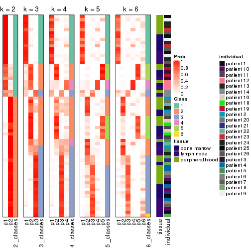


Test correlation between subgroups and known annotations. If the known
annotation is numeric, one-way ANOVA test is applied, and if the known
annotation is discrete, chi-squared contingency table test is applied.

```r
test_to_known_factors(res)
```

```
#>          n tissue(p) individual(p) k
#> MAD:NMF 60     0.915      3.82e-05 2
#> MAD:NMF 58     0.629      5.70e-08 3
#> MAD:NMF 48     0.773      4.03e-10 4
#> MAD:NMF 53     0.907      3.11e-12 5
#> MAD:NMF 38     0.946      1.44e-08 6
```


If matrix rows can be associated to genes, consider to use `functional_enrichment(res,
...)` to perform function enrichment for the signature genes. See [this vignette](http://bioconductor.org/packages/devel/bioc/vignettes/cola/inst/doc/functional_enrichment.html) for more detailed explanations.


 

---------------------------------------------------


### ATC:hclust


The object with results only for a single top-value method and a single partition method 
can be extracted as:

```r
res = res_list["ATC", "hclust"]
# you can also extract it by
# res = res_list["ATC:hclust"]
```

A summary of `res` and all the functions that can be applied to it:

```r
res
```

```
#> A 'ConsensusPartition' object with k = 2, 3, 4, 5, 6.
#>   On a matrix with 51941 rows and 62 columns.
#>   Top rows (1000, 2000, 3000, 4000, 5000) are extracted by 'ATC' method.
#>   Subgroups are detected by 'hclust' method.
#>   Performed in total 1250 partitions by row resampling.
#>   Best k for subgroups seems to be 3.
#> 
#> Following methods can be applied to this 'ConsensusPartition' object:
#>  [1] "cola_report"             "collect_classes"         "collect_plots"          
#>  [4] "collect_stats"           "colnames"                "compare_signatures"     
#>  [7] "consensus_heatmap"       "dimension_reduction"     "functional_enrichment"  
#> [10] "get_anno_col"            "get_anno"                "get_classes"            
#> [13] "get_consensus"           "get_matrix"              "get_membership"         
#> [16] "get_param"               "get_signatures"          "get_stats"              
#> [19] "is_best_k"               "is_stable_k"             "membership_heatmap"     
#> [22] "ncol"                    "nrow"                    "plot_ecdf"              
#> [25] "rownames"                "select_partition_number" "show"                   
#> [28] "suggest_best_k"          "test_to_known_factors"
```

`collect_plots()` function collects all the plots made from `res` for all `k` (number of partitions)
into one single page to provide an easy and fast comparison between different `k`.

```r
collect_plots(res)
```

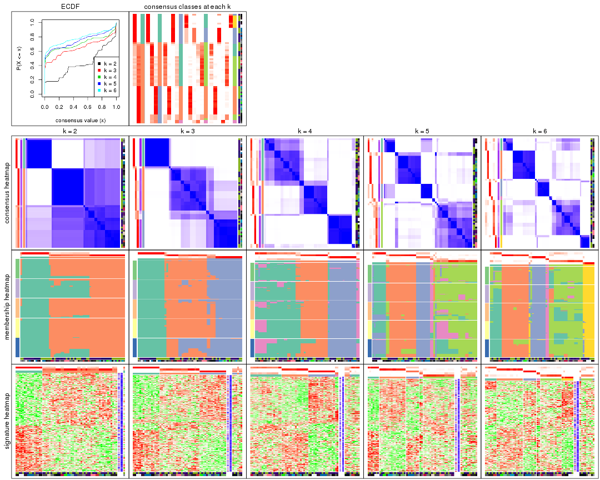

The plots are:

- The first row: a plot of the ECDF (empirical cumulative distribution
  function) curves of the consensus matrix for each `k` and the heatmap of
  predicted classes for each `k`.
- The second row: heatmaps of the consensus matrix for each `k`.
- The third row: heatmaps of the membership matrix for each `k`.
- The fouth row: heatmaps of the signatures for each `k`.

All the plots in panels can be made by individual functions and they are
plotted later in this section.

`select_partition_number()` produces several plots showing different
statistics for choosing "optimized" `k`. There are following statistics:

- ECDF curves of the consensus matrix for each `k`;
- 1-PAC. [The PAC
  score](https://en.wikipedia.org/wiki/Consensus_clustering#Over-interpretation_potential_of_consensus_clustering)
  measures the proportion of the ambiguous subgrouping.
- Mean silhouette score.
- Concordance. The mean probability of fiting the consensus class ids in all
  partitions.
- Area increased. Denote $A_k$ as the area under the ECDF curve for current
  `k`, the area increased is defined as $A_k - A_{k-1}$.
- Rand index. The percent of pairs of samples that are both in a same cluster
  or both are not in a same cluster in the partition of k and k-1.
- Jaccard index. The ratio of pairs of samples are both in a same cluster in
  the partition of k and k-1 and the pairs of samples are both in a same
  cluster in the partition k or k-1.

The detailed explanations of these statistics can be found in [the _cola_
vignette](http://bioconductor.org/packages/devel/bioc/vignettes/cola/inst/doc/cola.html#toc_13).

Generally speaking, lower PAC score, higher mean silhouette score or higher
concordance corresponds to better partition. Rand index and Jaccard index
measure how similar the current partition is compared to partition with `k-1`.
If they are too similar, we won't accept `k` is better than `k-1`.

```r
select_partition_number(res)
```

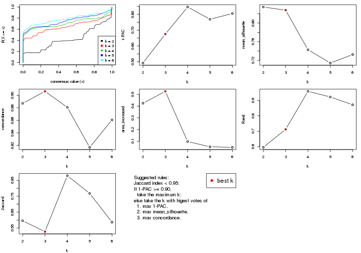

The numeric values for all these statistics can be obtained by `get_stats()`.

```r
get_stats(res)
```

```
#>   k 1-PAC mean_silhouette concordance area_increased  Rand Jaccard
#> 2 2 0.492           0.834       0.887         0.4252 0.595   0.595
#> 3 3 0.675           0.827       0.906         0.5267 0.712   0.527
#> 4 4 0.846           0.743       0.881         0.0973 0.959   0.879
#> 5 5 0.769           0.714       0.817         0.0522 0.922   0.768
#> 6 6 0.805           0.732       0.861         0.0476 0.871   0.587
```

`suggest_best_k()` suggests the best $k$ based on these statistics. The rules are as follows:

- All $k$ with Jaccard index larger than 0.95 are removed because increasing
  $k$ does not provide enough extra information. If all $k$ are removed, it is
  marked as no subgroup is detected.
- For all $k$ with 1-PAC score larger than 0.9, the maximal $k$ is taken as
  the best $k$, and other $k$ are marked as optional $k$.
- If it does not fit the second rule. The $k$ with the maximal vote of the
  highest 1-PAC score, highest mean silhouette, and highest concordance is
  taken as the best $k$.

```r
suggest_best_k(res)
```

```
#> [1] 3
```


Following shows the table of the partitions (You need to click the **show/hide
code output** link to see it). The membership matrix (columns with name `p*`)
is inferred by
[`clue::cl_consensus()`](https://www.rdocumentation.org/link/cl_consensus?package=clue)
function with the `SE` method. Basically the value in the membership matrix
represents the probability to belong to a certain group. The finall class
label for an item is determined with the group with highest probability it
belongs to.

In `get_classes()` function, the entropy is calculated from the membership
matrix and the silhouette score is calculated from the consensus matrix.


<script>
$( function() {
	$( '#tabs-ATC-hclust-get-classes' ).tabs();
} );
</script>
<div id='tabs-ATC-hclust-get-classes'>
<ul>
<li><a href='#tab-ATC-hclust-get-classes-1'>k = 2</a></li>
<li><a href='#tab-ATC-hclust-get-classes-2'>k = 3</a></li>
<li><a href='#tab-ATC-hclust-get-classes-3'>k = 4</a></li>
<li><a href='#tab-ATC-hclust-get-classes-4'>k = 5</a></li>
<li><a href='#tab-ATC-hclust-get-classes-5'>k = 6</a></li>
</ul>

<div id='tab-ATC-hclust-get-classes-1'>
<p><a id='tab-ATC-hclust-get-classes-1-a' style='color:#0366d6' href='#'>show/hide code output</a></p>
<pre><code class="r">cbind(get_classes(res, k = 2), get_membership(res, k = 2))
</code></pre>

<pre><code>#&gt;           class entropy silhouette    p1    p2
#&gt; GSM525314     1  0.0000      0.976 1.000 0.000
#&gt; GSM525315     2  0.0000      0.826 0.000 1.000
#&gt; GSM525316     1  0.0000      0.976 1.000 0.000
#&gt; GSM525317     1  0.0000      0.976 1.000 0.000
#&gt; GSM525318     1  0.0000      0.976 1.000 0.000
#&gt; GSM525319     2  0.0000      0.826 0.000 1.000
#&gt; GSM525320     2  0.6973      0.815 0.188 0.812
#&gt; GSM525321     1  0.0376      0.971 0.996 0.004
#&gt; GSM525322     2  0.0000      0.826 0.000 1.000
#&gt; GSM525323     1  0.0000      0.976 1.000 0.000
#&gt; GSM525324     2  0.0000      0.826 0.000 1.000
#&gt; GSM525325     2  0.9129      0.736 0.328 0.672
#&gt; GSM525326     2  0.8207      0.792 0.256 0.744
#&gt; GSM525327     2  0.9850      0.565 0.428 0.572
#&gt; GSM525328     2  0.9044      0.745 0.320 0.680
#&gt; GSM525329     1  0.8713      0.400 0.708 0.292
#&gt; GSM525330     2  0.9087      0.741 0.324 0.676
#&gt; GSM525331     2  0.0000      0.826 0.000 1.000
#&gt; GSM525332     2  0.7139      0.814 0.196 0.804
#&gt; GSM525333     2  0.8608      0.775 0.284 0.716
#&gt; GSM525334     2  0.0000      0.826 0.000 1.000
#&gt; GSM525335     2  0.0000      0.826 0.000 1.000
#&gt; GSM525336     2  0.9044      0.745 0.320 0.680
#&gt; GSM525337     2  0.9087      0.741 0.324 0.676
#&gt; GSM525338     2  0.0000      0.826 0.000 1.000
#&gt; GSM525339     2  0.9000      0.749 0.316 0.684
#&gt; GSM525340     1  0.0000      0.976 1.000 0.000
#&gt; GSM525341     2  0.0000      0.826 0.000 1.000
#&gt; GSM525342     1  0.0000      0.976 1.000 0.000
#&gt; GSM525343     1  0.0000      0.976 1.000 0.000
#&gt; GSM525344     2  0.0000      0.826 0.000 1.000
#&gt; GSM525345     1  0.0000      0.976 1.000 0.000
#&gt; GSM525346     2  0.7139      0.814 0.196 0.804
#&gt; GSM525347     2  0.8327      0.788 0.264 0.736
#&gt; GSM525348     2  0.8207      0.792 0.256 0.744
#&gt; GSM525349     2  0.9044      0.745 0.320 0.680
#&gt; GSM525350     2  0.9129      0.736 0.328 0.672
#&gt; GSM525351     2  0.0000      0.826 0.000 1.000
#&gt; GSM525352     2  0.7139      0.814 0.196 0.804
#&gt; GSM525353     2  0.8608      0.775 0.284 0.716
#&gt; GSM525354     2  0.0000      0.826 0.000 1.000
#&gt; GSM525355     2  0.0000      0.826 0.000 1.000
#&gt; GSM525356     2  0.9044      0.745 0.320 0.680
#&gt; GSM525357     2  0.0000      0.826 0.000 1.000
#&gt; GSM525358     2  0.9000      0.749 0.316 0.684
#&gt; GSM525359     1  0.0000      0.976 1.000 0.000
#&gt; GSM525360     2  0.0000      0.826 0.000 1.000
#&gt; GSM525361     1  0.0000      0.976 1.000 0.000
#&gt; GSM525362     1  0.0000      0.976 1.000 0.000
#&gt; GSM525363     2  0.0000      0.826 0.000 1.000
#&gt; GSM525364     2  0.7139      0.814 0.196 0.804
#&gt; GSM525365     1  0.0000      0.976 1.000 0.000
#&gt; GSM525366     2  0.0000      0.826 0.000 1.000
#&gt; GSM525367     1  0.0000      0.976 1.000 0.000
#&gt; GSM525368     2  0.7139      0.814 0.196 0.804
#&gt; GSM525369     2  0.8327      0.788 0.264 0.736
#&gt; GSM525370     2  0.8207      0.792 0.256 0.744
#&gt; GSM525371     2  0.0000      0.826 0.000 1.000
#&gt; GSM525372     1  0.0000      0.976 1.000 0.000
#&gt; GSM525373     2  0.0000      0.826 0.000 1.000
#&gt; GSM525374     2  0.0000      0.826 0.000 1.000
#&gt; GSM525375     2  0.1633      0.825 0.024 0.976
</code></pre>

<script>
$('#tab-ATC-hclust-get-classes-1-a').parent().next().next().hide();
$('#tab-ATC-hclust-get-classes-1-a').click(function(){
  $('#tab-ATC-hclust-get-classes-1-a').parent().next().next().toggle();
  return(false);
});
</script>
</div>

<div id='tab-ATC-hclust-get-classes-2'>
<p><a id='tab-ATC-hclust-get-classes-2-a' style='color:#0366d6' href='#'>show/hide code output</a></p>
<pre><code class="r">cbind(get_classes(res, k = 3), get_membership(res, k = 3))
</code></pre>

<pre><code>#&gt;           class entropy silhouette    p1    p2    p3
#&gt; GSM525314     1  0.0000      1.000 1.000 0.000 0.000
#&gt; GSM525315     3  0.0592      0.870 0.000 0.012 0.988
#&gt; GSM525316     1  0.0000      1.000 1.000 0.000 0.000
#&gt; GSM525317     1  0.0000      1.000 1.000 0.000 0.000
#&gt; GSM525318     1  0.0000      1.000 1.000 0.000 0.000
#&gt; GSM525319     3  0.0000      0.873 0.000 0.000 1.000
#&gt; GSM525320     2  0.4931      0.806 0.000 0.768 0.232
#&gt; GSM525321     1  0.0237      0.995 0.996 0.004 0.000
#&gt; GSM525322     3  0.0000      0.873 0.000 0.000 1.000
#&gt; GSM525323     1  0.0000      1.000 1.000 0.000 0.000
#&gt; GSM525324     3  0.0237      0.873 0.000 0.004 0.996
#&gt; GSM525325     2  0.3375      0.865 0.008 0.892 0.100
#&gt; GSM525326     2  0.4062      0.860 0.000 0.836 0.164
#&gt; GSM525327     2  0.3116      0.748 0.108 0.892 0.000
#&gt; GSM525328     2  0.0000      0.827 0.000 1.000 0.000
#&gt; GSM525329     2  0.6308      0.055 0.492 0.508 0.000
#&gt; GSM525330     2  0.3193      0.865 0.004 0.896 0.100
#&gt; GSM525331     3  0.0237      0.873 0.000 0.004 0.996
#&gt; GSM525332     2  0.5058      0.794 0.000 0.756 0.244
#&gt; GSM525333     2  0.3941      0.860 0.000 0.844 0.156
#&gt; GSM525334     3  0.0892      0.865 0.000 0.020 0.980
#&gt; GSM525335     3  0.0237      0.873 0.000 0.004 0.996
#&gt; GSM525336     2  0.0000      0.827 0.000 1.000 0.000
#&gt; GSM525337     2  0.3193      0.865 0.004 0.896 0.100
#&gt; GSM525338     3  0.6215      0.145 0.000 0.428 0.572
#&gt; GSM525339     2  0.0424      0.829 0.000 0.992 0.008
#&gt; GSM525340     1  0.0000      1.000 1.000 0.000 0.000
#&gt; GSM525341     3  0.0592      0.870 0.000 0.012 0.988
#&gt; GSM525342     1  0.0000      1.000 1.000 0.000 0.000
#&gt; GSM525343     1  0.0000      1.000 1.000 0.000 0.000
#&gt; GSM525344     3  0.0000      0.873 0.000 0.000 1.000
#&gt; GSM525345     1  0.0000      1.000 1.000 0.000 0.000
#&gt; GSM525346     2  0.4842      0.815 0.000 0.776 0.224
#&gt; GSM525347     2  0.3941      0.863 0.000 0.844 0.156
#&gt; GSM525348     2  0.4062      0.860 0.000 0.836 0.164
#&gt; GSM525349     2  0.0000      0.827 0.000 1.000 0.000
#&gt; GSM525350     2  0.3375      0.865 0.008 0.892 0.100
#&gt; GSM525351     3  0.0237      0.873 0.000 0.004 0.996
#&gt; GSM525352     2  0.5058      0.794 0.000 0.756 0.244
#&gt; GSM525353     2  0.3941      0.860 0.000 0.844 0.156
#&gt; GSM525354     3  0.0892      0.865 0.000 0.020 0.980
#&gt; GSM525355     3  0.0237      0.873 0.000 0.004 0.996
#&gt; GSM525356     2  0.0000      0.827 0.000 1.000 0.000
#&gt; GSM525357     3  0.6215      0.145 0.000 0.428 0.572
#&gt; GSM525358     2  0.0424      0.829 0.000 0.992 0.008
#&gt; GSM525359     1  0.0000      1.000 1.000 0.000 0.000
#&gt; GSM525360     3  0.0000      0.873 0.000 0.000 1.000
#&gt; GSM525361     1  0.0000      1.000 1.000 0.000 0.000
#&gt; GSM525362     1  0.0000      1.000 1.000 0.000 0.000
#&gt; GSM525363     3  0.0000      0.873 0.000 0.000 1.000
#&gt; GSM525364     2  0.4842      0.815 0.000 0.776 0.224
#&gt; GSM525365     1  0.0000      1.000 1.000 0.000 0.000
#&gt; GSM525366     3  0.0000      0.873 0.000 0.000 1.000
#&gt; GSM525367     1  0.0000      1.000 1.000 0.000 0.000
#&gt; GSM525368     2  0.4842      0.815 0.000 0.776 0.224
#&gt; GSM525369     2  0.3941      0.863 0.000 0.844 0.156
#&gt; GSM525370     2  0.4062      0.860 0.000 0.836 0.164
#&gt; GSM525371     3  0.6026      0.482 0.000 0.376 0.624
#&gt; GSM525372     1  0.0000      1.000 1.000 0.000 0.000
#&gt; GSM525373     3  0.0000      0.873 0.000 0.000 1.000
#&gt; GSM525374     3  0.6235      0.114 0.000 0.436 0.564
#&gt; GSM525375     3  0.6192      0.384 0.000 0.420 0.580
</code></pre>

<script>
$('#tab-ATC-hclust-get-classes-2-a').parent().next().next().hide();
$('#tab-ATC-hclust-get-classes-2-a').click(function(){
  $('#tab-ATC-hclust-get-classes-2-a').parent().next().next().toggle();
  return(false);
});
</script>
</div>

<div id='tab-ATC-hclust-get-classes-3'>
<p><a id='tab-ATC-hclust-get-classes-3-a' style='color:#0366d6' href='#'>show/hide code output</a></p>
<pre><code class="r">cbind(get_classes(res, k = 4), get_membership(res, k = 4))
</code></pre>

<pre><code>#&gt;           class entropy silhouette    p1    p2    p3    p4
#&gt; GSM525314     3  0.0707     0.9464 0.000 0.000 0.980 0.020
#&gt; GSM525315     2  0.2197     0.8138 0.004 0.916 0.000 0.080
#&gt; GSM525316     3  0.0707     0.9464 0.000 0.000 0.980 0.020
#&gt; GSM525317     3  0.0000     0.9486 0.000 0.000 1.000 0.000
#&gt; GSM525318     3  0.0000     0.9486 0.000 0.000 1.000 0.000
#&gt; GSM525319     2  0.0000     0.8217 0.000 1.000 0.000 0.000
#&gt; GSM525320     1  0.5193     0.7563 0.580 0.008 0.000 0.412
#&gt; GSM525321     3  0.0188     0.9462 0.004 0.000 0.996 0.000
#&gt; GSM525322     2  0.0000     0.8217 0.000 1.000 0.000 0.000
#&gt; GSM525323     3  0.0707     0.9464 0.000 0.000 0.980 0.020
#&gt; GSM525324     2  0.1824     0.8267 0.004 0.936 0.000 0.060
#&gt; GSM525325     1  0.4539     0.7751 0.720 0.000 0.008 0.272
#&gt; GSM525326     1  0.4761     0.7854 0.628 0.000 0.000 0.372
#&gt; GSM525327     1  0.4203     0.2007 0.824 0.000 0.108 0.068
#&gt; GSM525328     1  0.1792     0.4503 0.932 0.000 0.000 0.068
#&gt; GSM525329     3  0.5696    -0.0653 0.484 0.000 0.492 0.024
#&gt; GSM525330     1  0.4401     0.7762 0.724 0.000 0.004 0.272
#&gt; GSM525331     2  0.1576     0.8306 0.004 0.948 0.000 0.048
#&gt; GSM525332     1  0.6362     0.7310 0.560 0.072 0.000 0.368
#&gt; GSM525333     1  0.5453     0.7826 0.648 0.032 0.000 0.320
#&gt; GSM525334     2  0.1970     0.8249 0.008 0.932 0.000 0.060
#&gt; GSM525335     2  0.1576     0.8306 0.004 0.948 0.000 0.048
#&gt; GSM525336     1  0.1716     0.4571 0.936 0.000 0.000 0.064
#&gt; GSM525337     1  0.4401     0.7762 0.724 0.000 0.004 0.272
#&gt; GSM525338     2  0.7768    -0.0971 0.240 0.400 0.000 0.360
#&gt; GSM525339     1  0.1398     0.5556 0.956 0.004 0.000 0.040
#&gt; GSM525340     3  0.0707     0.9464 0.000 0.000 0.980 0.020
#&gt; GSM525341     2  0.2197     0.8138 0.004 0.916 0.000 0.080
#&gt; GSM525342     3  0.0592     0.9468 0.000 0.000 0.984 0.016
#&gt; GSM525343     3  0.0000     0.9486 0.000 0.000 1.000 0.000
#&gt; GSM525344     2  0.0000     0.8217 0.000 1.000 0.000 0.000
#&gt; GSM525345     3  0.0707     0.9464 0.000 0.000 0.980 0.020
#&gt; GSM525346     1  0.4888     0.7617 0.588 0.000 0.000 0.412
#&gt; GSM525347     1  0.4730     0.7881 0.636 0.000 0.000 0.364
#&gt; GSM525348     1  0.4761     0.7854 0.628 0.000 0.000 0.372
#&gt; GSM525349     1  0.1792     0.4503 0.932 0.000 0.000 0.068
#&gt; GSM525350     1  0.4539     0.7751 0.720 0.000 0.008 0.272
#&gt; GSM525351     2  0.1576     0.8306 0.004 0.948 0.000 0.048
#&gt; GSM525352     1  0.6362     0.7310 0.560 0.072 0.000 0.368
#&gt; GSM525353     1  0.5453     0.7826 0.648 0.032 0.000 0.320
#&gt; GSM525354     2  0.1970     0.8249 0.008 0.932 0.000 0.060
#&gt; GSM525355     2  0.1576     0.8306 0.004 0.948 0.000 0.048
#&gt; GSM525356     1  0.1716     0.4571 0.936 0.000 0.000 0.064
#&gt; GSM525357     2  0.7768    -0.0971 0.240 0.400 0.000 0.360
#&gt; GSM525358     1  0.1398     0.5556 0.956 0.004 0.000 0.040
#&gt; GSM525359     3  0.0188     0.9481 0.000 0.000 0.996 0.004
#&gt; GSM525360     2  0.0000     0.8217 0.000 1.000 0.000 0.000
#&gt; GSM525361     3  0.0000     0.9486 0.000 0.000 1.000 0.000
#&gt; GSM525362     3  0.0000     0.9486 0.000 0.000 1.000 0.000
#&gt; GSM525363     2  0.0000     0.8217 0.000 1.000 0.000 0.000
#&gt; GSM525364     1  0.4888     0.7617 0.588 0.000 0.000 0.412
#&gt; GSM525365     3  0.0000     0.9486 0.000 0.000 1.000 0.000
#&gt; GSM525366     2  0.0000     0.8217 0.000 1.000 0.000 0.000
#&gt; GSM525367     3  0.0707     0.9464 0.000 0.000 0.980 0.020
#&gt; GSM525368     1  0.4888     0.7617 0.588 0.000 0.000 0.412
#&gt; GSM525369     1  0.4730     0.7881 0.636 0.000 0.000 0.364
#&gt; GSM525370     1  0.4761     0.7854 0.628 0.000 0.000 0.372
#&gt; GSM525371     4  0.4910     0.9347 0.276 0.020 0.000 0.704
#&gt; GSM525372     3  0.0000     0.9486 0.000 0.000 1.000 0.000
#&gt; GSM525373     2  0.0000     0.8217 0.000 1.000 0.000 0.000
#&gt; GSM525374     2  0.7796    -0.1229 0.248 0.392 0.000 0.360
#&gt; GSM525375     4  0.4957     0.9310 0.320 0.012 0.000 0.668
</code></pre>

<script>
$('#tab-ATC-hclust-get-classes-3-a').parent().next().next().hide();
$('#tab-ATC-hclust-get-classes-3-a').click(function(){
  $('#tab-ATC-hclust-get-classes-3-a').parent().next().next().toggle();
  return(false);
});
</script>
</div>

<div id='tab-ATC-hclust-get-classes-4'>
<p><a id='tab-ATC-hclust-get-classes-4-a' style='color:#0366d6' href='#'>show/hide code output</a></p>
<pre><code class="r">cbind(get_classes(res, k = 5), get_membership(res, k = 5))
</code></pre>

<pre><code>#&gt;           class entropy silhouette    p1    p2    p3    p4    p5
#&gt; GSM525314     1  0.0000     0.8788 1.000 0.000 0.000 0.000 0.000
#&gt; GSM525315     2  0.0992     0.8637 0.000 0.968 0.000 0.008 0.024
#&gt; GSM525316     1  0.0000     0.8788 1.000 0.000 0.000 0.000 0.000
#&gt; GSM525317     3  0.3796     0.9978 0.300 0.000 0.700 0.000 0.000
#&gt; GSM525318     3  0.3796     0.9978 0.300 0.000 0.700 0.000 0.000
#&gt; GSM525319     2  0.1270     0.8713 0.000 0.948 0.052 0.000 0.000
#&gt; GSM525320     5  0.4226     0.6641 0.000 0.060 0.000 0.176 0.764
#&gt; GSM525321     3  0.3928     0.9911 0.296 0.000 0.700 0.004 0.000
#&gt; GSM525322     2  0.1270     0.8713 0.000 0.948 0.052 0.000 0.000
#&gt; GSM525323     1  0.0000     0.8788 1.000 0.000 0.000 0.000 0.000
#&gt; GSM525324     2  0.0671     0.8753 0.000 0.980 0.004 0.000 0.016
#&gt; GSM525325     5  0.1557     0.7139 0.000 0.000 0.008 0.052 0.940
#&gt; GSM525326     5  0.2726     0.7163 0.000 0.052 0.000 0.064 0.884
#&gt; GSM525327     5  0.5934     0.2341 0.000 0.000 0.108 0.396 0.496
#&gt; GSM525328     5  0.4171     0.4331 0.000 0.000 0.000 0.396 0.604
#&gt; GSM525329     5  0.7395     0.0563 0.220 0.000 0.272 0.048 0.460
#&gt; GSM525330     5  0.1430     0.7146 0.000 0.000 0.004 0.052 0.944
#&gt; GSM525331     2  0.0000     0.8797 0.000 1.000 0.000 0.000 0.000
#&gt; GSM525332     5  0.2612     0.6939 0.000 0.124 0.000 0.008 0.868
#&gt; GSM525333     5  0.1281     0.7206 0.000 0.032 0.000 0.012 0.956
#&gt; GSM525334     2  0.0510     0.8740 0.000 0.984 0.000 0.000 0.016
#&gt; GSM525335     2  0.0000     0.8797 0.000 1.000 0.000 0.000 0.000
#&gt; GSM525336     5  0.4161     0.4388 0.000 0.000 0.000 0.392 0.608
#&gt; GSM525337     5  0.1430     0.7146 0.000 0.000 0.004 0.052 0.944
#&gt; GSM525338     2  0.5968    -0.0476 0.000 0.452 0.000 0.108 0.440
#&gt; GSM525339     5  0.3949     0.5288 0.000 0.004 0.000 0.300 0.696
#&gt; GSM525340     1  0.0290     0.8734 0.992 0.000 0.008 0.000 0.000
#&gt; GSM525341     2  0.0992     0.8637 0.000 0.968 0.000 0.008 0.024
#&gt; GSM525342     1  0.2179     0.7418 0.888 0.000 0.112 0.000 0.000
#&gt; GSM525343     3  0.3796     0.9978 0.300 0.000 0.700 0.000 0.000
#&gt; GSM525344     2  0.1270     0.8713 0.000 0.948 0.052 0.000 0.000
#&gt; GSM525345     1  0.0000     0.8788 1.000 0.000 0.000 0.000 0.000
#&gt; GSM525346     5  0.4168     0.6645 0.000 0.052 0.000 0.184 0.764
#&gt; GSM525347     5  0.2409     0.7201 0.000 0.032 0.000 0.068 0.900
#&gt; GSM525348     5  0.2726     0.7163 0.000 0.052 0.000 0.064 0.884
#&gt; GSM525349     5  0.4171     0.4331 0.000 0.000 0.000 0.396 0.604
#&gt; GSM525350     5  0.1557     0.7139 0.000 0.000 0.008 0.052 0.940
#&gt; GSM525351     2  0.0000     0.8797 0.000 1.000 0.000 0.000 0.000
#&gt; GSM525352     5  0.2612     0.6939 0.000 0.124 0.000 0.008 0.868
#&gt; GSM525353     5  0.1281     0.7206 0.000 0.032 0.000 0.012 0.956
#&gt; GSM525354     2  0.0510     0.8740 0.000 0.984 0.000 0.000 0.016
#&gt; GSM525355     2  0.0000     0.8797 0.000 1.000 0.000 0.000 0.000
#&gt; GSM525356     5  0.4161     0.4388 0.000 0.000 0.000 0.392 0.608
#&gt; GSM525357     2  0.5968    -0.0476 0.000 0.452 0.000 0.108 0.440
#&gt; GSM525358     5  0.3949     0.5288 0.000 0.004 0.000 0.300 0.696
#&gt; GSM525359     1  0.4273    -0.4306 0.552 0.000 0.448 0.000 0.000
#&gt; GSM525360     2  0.1270     0.8713 0.000 0.948 0.052 0.000 0.000
#&gt; GSM525361     3  0.3796     0.9978 0.300 0.000 0.700 0.000 0.000
#&gt; GSM525362     3  0.3796     0.9978 0.300 0.000 0.700 0.000 0.000
#&gt; GSM525363     2  0.1270     0.8713 0.000 0.948 0.052 0.000 0.000
#&gt; GSM525364     5  0.4168     0.6645 0.000 0.052 0.000 0.184 0.764
#&gt; GSM525365     3  0.3796     0.9978 0.300 0.000 0.700 0.000 0.000
#&gt; GSM525366     2  0.1270     0.8713 0.000 0.948 0.052 0.000 0.000
#&gt; GSM525367     1  0.0000     0.8788 1.000 0.000 0.000 0.000 0.000
#&gt; GSM525368     5  0.4168     0.6645 0.000 0.052 0.000 0.184 0.764
#&gt; GSM525369     5  0.2409     0.7201 0.000 0.032 0.000 0.068 0.900
#&gt; GSM525370     5  0.2726     0.7163 0.000 0.052 0.000 0.064 0.884
#&gt; GSM525371     4  0.3910     0.9280 0.000 0.004 0.248 0.740 0.008
#&gt; GSM525372     3  0.3816     0.9926 0.304 0.000 0.696 0.000 0.000
#&gt; GSM525373     2  0.1270     0.8713 0.000 0.948 0.052 0.000 0.000
#&gt; GSM525374     5  0.5968    -0.0180 0.000 0.444 0.000 0.108 0.448
#&gt; GSM525375     4  0.4719     0.9287 0.000 0.000 0.248 0.696 0.056
</code></pre>

<script>
$('#tab-ATC-hclust-get-classes-4-a').parent().next().next().hide();
$('#tab-ATC-hclust-get-classes-4-a').click(function(){
  $('#tab-ATC-hclust-get-classes-4-a').parent().next().next().toggle();
  return(false);
});
</script>
</div>

<div id='tab-ATC-hclust-get-classes-5'>
<p><a id='tab-ATC-hclust-get-classes-5-a' style='color:#0366d6' href='#'>show/hide code output</a></p>
<pre><code class="r">cbind(get_classes(res, k = 6), get_membership(res, k = 6))
</code></pre>

<pre><code>#&gt;           class entropy silhouette    p1    p2    p3    p4    p5    p6
#&gt; GSM525314     6  0.0000    0.93742 0.000 0.000 0.000 0.000 0.000 1.000
#&gt; GSM525315     2  0.1610    0.93695 0.000 0.916 0.000 0.000 0.084 0.000
#&gt; GSM525316     6  0.0000    0.93742 0.000 0.000 0.000 0.000 0.000 1.000
#&gt; GSM525317     3  0.0000    0.84547 0.000 0.000 1.000 0.000 0.000 0.000
#&gt; GSM525318     3  0.0146    0.84688 0.000 0.000 0.996 0.000 0.000 0.004
#&gt; GSM525319     2  0.0000    0.95309 0.000 1.000 0.000 0.000 0.000 0.000
#&gt; GSM525320     5  0.2257    0.60872 0.040 0.008 0.000 0.048 0.904 0.000
#&gt; GSM525321     3  0.0291    0.84472 0.004 0.000 0.992 0.000 0.000 0.004
#&gt; GSM525322     2  0.0000    0.95309 0.000 1.000 0.000 0.000 0.000 0.000
#&gt; GSM525323     6  0.0000    0.93742 0.000 0.000 0.000 0.000 0.000 1.000
#&gt; GSM525324     2  0.1327    0.95176 0.000 0.936 0.000 0.000 0.064 0.000
#&gt; GSM525325     5  0.3899    0.41951 0.364 0.000 0.008 0.000 0.628 0.000
#&gt; GSM525326     5  0.1814    0.65281 0.100 0.000 0.000 0.000 0.900 0.000
#&gt; GSM525327     1  0.3138    0.66752 0.832 0.000 0.108 0.000 0.060 0.000
#&gt; GSM525328     1  0.2416    0.83136 0.844 0.000 0.000 0.000 0.156 0.000
#&gt; GSM525329     3  0.5616   -0.10679 0.156 0.000 0.492 0.000 0.352 0.000
#&gt; GSM525330     5  0.3795    0.42443 0.364 0.000 0.004 0.000 0.632 0.000
#&gt; GSM525331     2  0.1141    0.95811 0.000 0.948 0.000 0.000 0.052 0.000
#&gt; GSM525332     5  0.4148    0.57831 0.208 0.068 0.000 0.000 0.724 0.000
#&gt; GSM525333     5  0.4009    0.51594 0.288 0.028 0.000 0.000 0.684 0.000
#&gt; GSM525334     2  0.1531    0.94823 0.004 0.928 0.000 0.000 0.068 0.000
#&gt; GSM525335     2  0.1141    0.95811 0.000 0.948 0.000 0.000 0.052 0.000
#&gt; GSM525336     1  0.2454    0.83166 0.840 0.000 0.000 0.000 0.160 0.000
#&gt; GSM525337     5  0.3795    0.42443 0.364 0.000 0.004 0.000 0.632 0.000
#&gt; GSM525338     5  0.5718    0.30222 0.148 0.224 0.000 0.028 0.600 0.000
#&gt; GSM525339     1  0.3789    0.52316 0.584 0.000 0.000 0.000 0.416 0.000
#&gt; GSM525340     6  0.0363    0.92828 0.000 0.000 0.012 0.000 0.000 0.988
#&gt; GSM525341     2  0.1610    0.93695 0.000 0.916 0.000 0.000 0.084 0.000
#&gt; GSM525342     6  0.3198    0.59901 0.000 0.000 0.260 0.000 0.000 0.740
#&gt; GSM525343     3  0.0146    0.84688 0.000 0.000 0.996 0.000 0.000 0.004
#&gt; GSM525344     2  0.0000    0.95309 0.000 1.000 0.000 0.000 0.000 0.000
#&gt; GSM525345     6  0.0000    0.93742 0.000 0.000 0.000 0.000 0.000 1.000
#&gt; GSM525346     5  0.1856    0.60837 0.032 0.000 0.000 0.048 0.920 0.000
#&gt; GSM525347     5  0.2278    0.64388 0.128 0.000 0.000 0.004 0.868 0.000
#&gt; GSM525348     5  0.1814    0.65281 0.100 0.000 0.000 0.000 0.900 0.000
#&gt; GSM525349     1  0.2416    0.83136 0.844 0.000 0.000 0.000 0.156 0.000
#&gt; GSM525350     5  0.3899    0.41951 0.364 0.000 0.008 0.000 0.628 0.000
#&gt; GSM525351     2  0.1141    0.95811 0.000 0.948 0.000 0.000 0.052 0.000
#&gt; GSM525352     5  0.4148    0.57831 0.208 0.068 0.000 0.000 0.724 0.000
#&gt; GSM525353     5  0.4009    0.51594 0.288 0.028 0.000 0.000 0.684 0.000
#&gt; GSM525354     2  0.1531    0.94823 0.004 0.928 0.000 0.000 0.068 0.000
#&gt; GSM525355     2  0.1141    0.95811 0.000 0.948 0.000 0.000 0.052 0.000
#&gt; GSM525356     1  0.2454    0.83166 0.840 0.000 0.000 0.000 0.160 0.000
#&gt; GSM525357     5  0.5718    0.30222 0.148 0.224 0.000 0.028 0.600 0.000
#&gt; GSM525358     1  0.3789    0.52316 0.584 0.000 0.000 0.000 0.416 0.000
#&gt; GSM525359     3  0.3866   -0.00448 0.000 0.000 0.516 0.000 0.000 0.484
#&gt; GSM525360     2  0.0000    0.95309 0.000 1.000 0.000 0.000 0.000 0.000
#&gt; GSM525361     3  0.0146    0.84688 0.000 0.000 0.996 0.000 0.000 0.004
#&gt; GSM525362     3  0.0000    0.84547 0.000 0.000 1.000 0.000 0.000 0.000
#&gt; GSM525363     2  0.0000    0.95309 0.000 1.000 0.000 0.000 0.000 0.000
#&gt; GSM525364     5  0.1856    0.60837 0.032 0.000 0.000 0.048 0.920 0.000
#&gt; GSM525365     3  0.0146    0.84688 0.000 0.000 0.996 0.000 0.000 0.004
#&gt; GSM525366     2  0.0000    0.95309 0.000 1.000 0.000 0.000 0.000 0.000
#&gt; GSM525367     6  0.0000    0.93742 0.000 0.000 0.000 0.000 0.000 1.000
#&gt; GSM525368     5  0.1856    0.60837 0.032 0.000 0.000 0.048 0.920 0.000
#&gt; GSM525369     5  0.2278    0.64388 0.128 0.000 0.000 0.004 0.868 0.000
#&gt; GSM525370     5  0.1814    0.65281 0.100 0.000 0.000 0.000 0.900 0.000
#&gt; GSM525371     4  0.0777    0.89944 0.024 0.000 0.000 0.972 0.004 0.000
#&gt; GSM525372     3  0.0146    0.84470 0.000 0.000 0.996 0.000 0.000 0.004
#&gt; GSM525373     2  0.0000    0.95309 0.000 1.000 0.000 0.000 0.000 0.000
#&gt; GSM525374     5  0.5681    0.31484 0.152 0.212 0.000 0.028 0.608 0.000
#&gt; GSM525375     4  0.2568    0.89963 0.068 0.000 0.000 0.876 0.056 0.000
</code></pre>

<script>
$('#tab-ATC-hclust-get-classes-5-a').parent().next().next().hide();
$('#tab-ATC-hclust-get-classes-5-a').click(function(){
  $('#tab-ATC-hclust-get-classes-5-a').parent().next().next().toggle();
  return(false);
});
</script>
</div>
</div>

Heatmaps for the consensus matrix. It visualizes the probability of two
samples to be in a same group.


<script>
$( function() {
	$( '#tabs-ATC-hclust-consensus-heatmap' ).tabs();
} );
</script>
<div id='tabs-ATC-hclust-consensus-heatmap'>
<ul>
<li><a href='#tab-ATC-hclust-consensus-heatmap-1'>k = 2</a></li>
<li><a href='#tab-ATC-hclust-consensus-heatmap-2'>k = 3</a></li>
<li><a href='#tab-ATC-hclust-consensus-heatmap-3'>k = 4</a></li>
<li><a href='#tab-ATC-hclust-consensus-heatmap-4'>k = 5</a></li>
<li><a href='#tab-ATC-hclust-consensus-heatmap-5'>k = 6</a></li>
</ul>
<div id='tab-ATC-hclust-consensus-heatmap-1'>
<pre><code class="r">consensus_heatmap(res, k = 2)
</code></pre>

<p>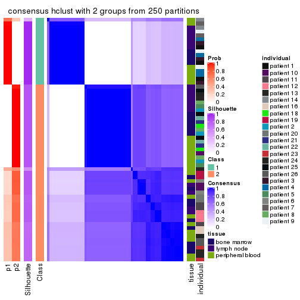</p>

</div>
<div id='tab-ATC-hclust-consensus-heatmap-2'>
<pre><code class="r">consensus_heatmap(res, k = 3)
</code></pre>

<p>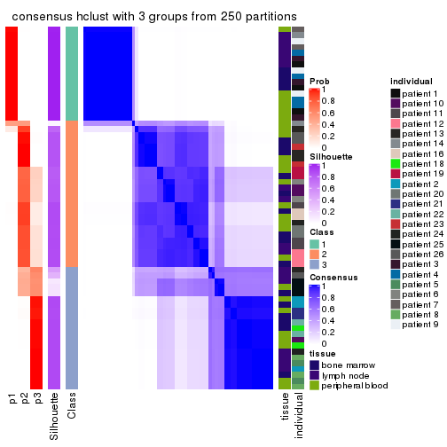</p>

</div>
<div id='tab-ATC-hclust-consensus-heatmap-3'>
<pre><code class="r">consensus_heatmap(res, k = 4)
</code></pre>

<p>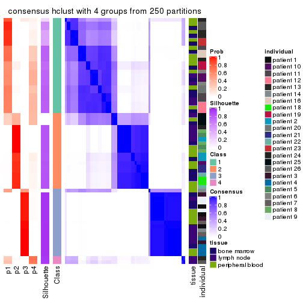</p>

</div>
<div id='tab-ATC-hclust-consensus-heatmap-4'>
<pre><code class="r">consensus_heatmap(res, k = 5)
</code></pre>

<p>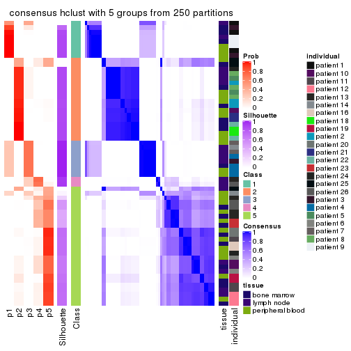</p>

</div>
<div id='tab-ATC-hclust-consensus-heatmap-5'>
<pre><code class="r">consensus_heatmap(res, k = 6)
</code></pre>

<p>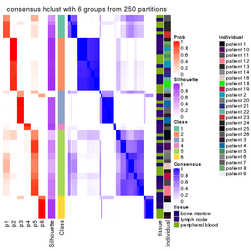</p>

</div>
</div>

Heatmaps for the membership of samples in all partitions to see how consistent they are:


<script>
$( function() {
	$( '#tabs-ATC-hclust-membership-heatmap' ).tabs();
} );
</script>
<div id='tabs-ATC-hclust-membership-heatmap'>
<ul>
<li><a href='#tab-ATC-hclust-membership-heatmap-1'>k = 2</a></li>
<li><a href='#tab-ATC-hclust-membership-heatmap-2'>k = 3</a></li>
<li><a href='#tab-ATC-hclust-membership-heatmap-3'>k = 4</a></li>
<li><a href='#tab-ATC-hclust-membership-heatmap-4'>k = 5</a></li>
<li><a href='#tab-ATC-hclust-membership-heatmap-5'>k = 6</a></li>
</ul>
<div id='tab-ATC-hclust-membership-heatmap-1'>
<pre><code class="r">membership_heatmap(res, k = 2)
</code></pre>

<p>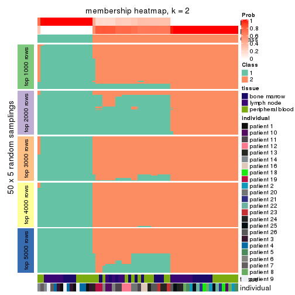</p>

</div>
<div id='tab-ATC-hclust-membership-heatmap-2'>
<pre><code class="r">membership_heatmap(res, k = 3)
</code></pre>

<p>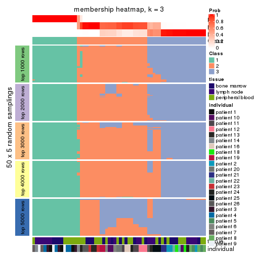</p>

</div>
<div id='tab-ATC-hclust-membership-heatmap-3'>
<pre><code class="r">membership_heatmap(res, k = 4)
</code></pre>

<p>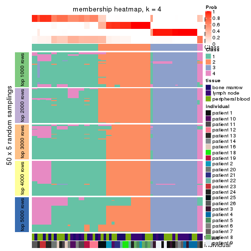</p>

</div>
<div id='tab-ATC-hclust-membership-heatmap-4'>
<pre><code class="r">membership_heatmap(res, k = 5)
</code></pre>

<p>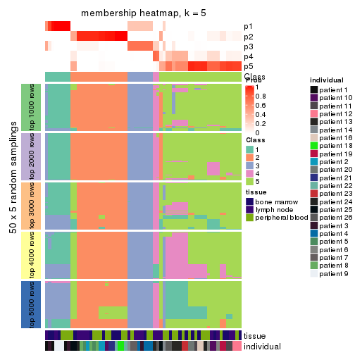</p>

</div>
<div id='tab-ATC-hclust-membership-heatmap-5'>
<pre><code class="r">membership_heatmap(res, k = 6)
</code></pre>

<p>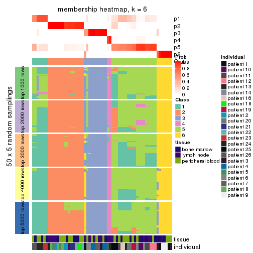</p>

</div>
</div>

As soon as we have had the classes for columns, we can look for signatures
which are significantly different between classes which can be candidate marks
for certain classes. Following are the heatmaps for signatures.


Signature heatmaps where rows are scaled:


<script>
$( function() {
	$( '#tabs-ATC-hclust-get-signatures' ).tabs();
} );
</script>
<div id='tabs-ATC-hclust-get-signatures'>
<ul>
<li><a href='#tab-ATC-hclust-get-signatures-1'>k = 2</a></li>
<li><a href='#tab-ATC-hclust-get-signatures-2'>k = 3</a></li>
<li><a href='#tab-ATC-hclust-get-signatures-3'>k = 4</a></li>
<li><a href='#tab-ATC-hclust-get-signatures-4'>k = 5</a></li>
<li><a href='#tab-ATC-hclust-get-signatures-5'>k = 6</a></li>
</ul>
<div id='tab-ATC-hclust-get-signatures-1'>
<pre><code class="r">get_signatures(res, k = 2)
</code></pre>

<p>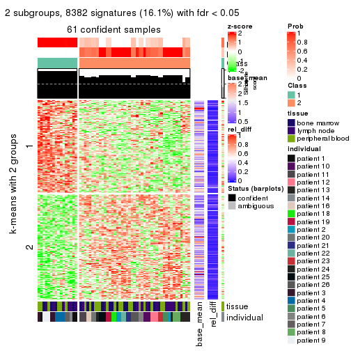</p>

</div>
<div id='tab-ATC-hclust-get-signatures-2'>
<pre><code class="r">get_signatures(res, k = 3)
</code></pre>

<p>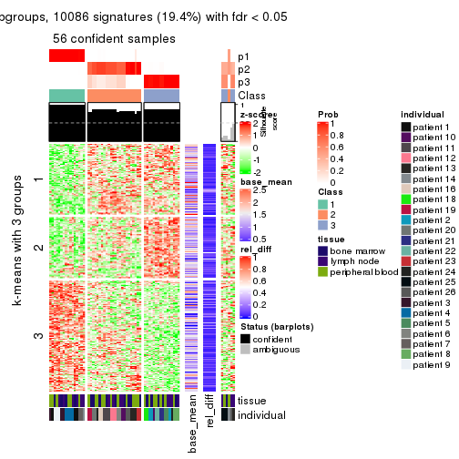</p>

</div>
<div id='tab-ATC-hclust-get-signatures-3'>
<pre><code class="r">get_signatures(res, k = 4)
</code></pre>

<p>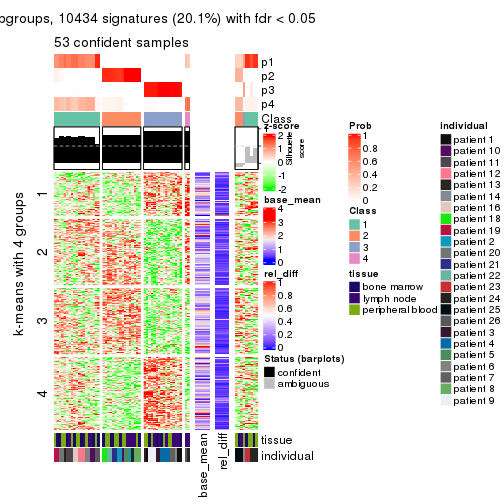</p>

</div>
<div id='tab-ATC-hclust-get-signatures-4'>
<pre><code class="r">get_signatures(res, k = 5)
</code></pre>

<p>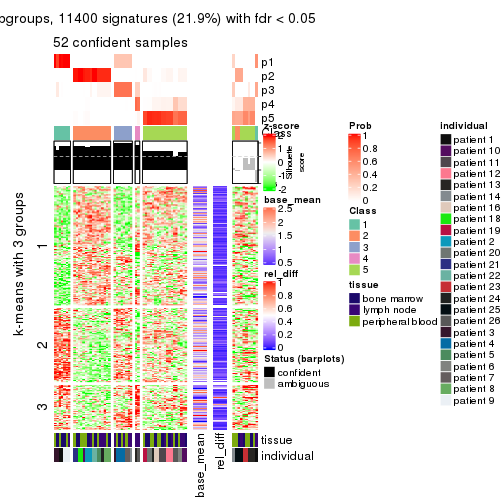</p>

</div>
<div id='tab-ATC-hclust-get-signatures-5'>
<pre><code class="r">get_signatures(res, k = 6)
</code></pre>

<p>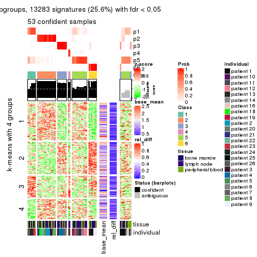</p>

</div>
</div>


Signature heatmaps where rows are not scaled:


<script>
$( function() {
	$( '#tabs-ATC-hclust-get-signatures-no-scale' ).tabs();
} );
</script>
<div id='tabs-ATC-hclust-get-signatures-no-scale'>
<ul>
<li><a href='#tab-ATC-hclust-get-signatures-no-scale-1'>k = 2</a></li>
<li><a href='#tab-ATC-hclust-get-signatures-no-scale-2'>k = 3</a></li>
<li><a href='#tab-ATC-hclust-get-signatures-no-scale-3'>k = 4</a></li>
<li><a href='#tab-ATC-hclust-get-signatures-no-scale-4'>k = 5</a></li>
<li><a href='#tab-ATC-hclust-get-signatures-no-scale-5'>k = 6</a></li>
</ul>
<div id='tab-ATC-hclust-get-signatures-no-scale-1'>
<pre><code class="r">get_signatures(res, k = 2, scale_rows = FALSE)
</code></pre>

<p>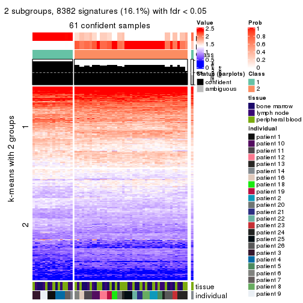</p>

</div>
<div id='tab-ATC-hclust-get-signatures-no-scale-2'>
<pre><code class="r">get_signatures(res, k = 3, scale_rows = FALSE)
</code></pre>

<p>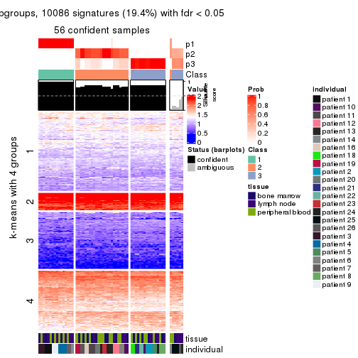</p>

</div>
<div id='tab-ATC-hclust-get-signatures-no-scale-3'>
<pre><code class="r">get_signatures(res, k = 4, scale_rows = FALSE)
</code></pre>

<p>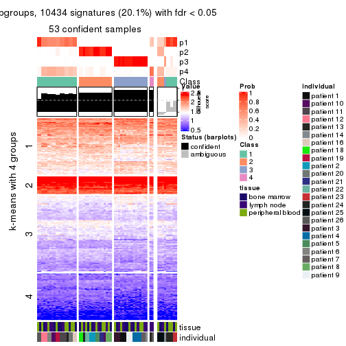</p>

</div>
<div id='tab-ATC-hclust-get-signatures-no-scale-4'>
<pre><code class="r">get_signatures(res, k = 5, scale_rows = FALSE)
</code></pre>

<p>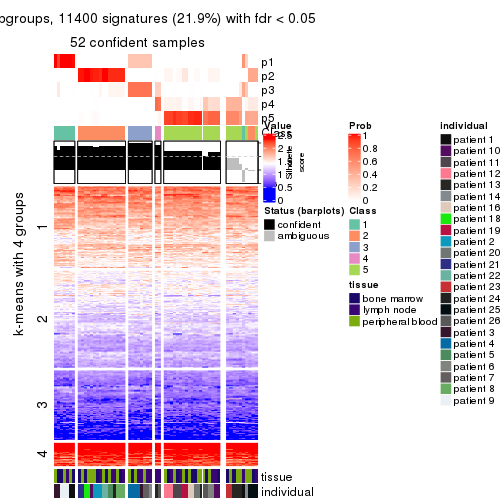</p>

</div>
<div id='tab-ATC-hclust-get-signatures-no-scale-5'>
<pre><code class="r">get_signatures(res, k = 6, scale_rows = FALSE)
</code></pre>

<p>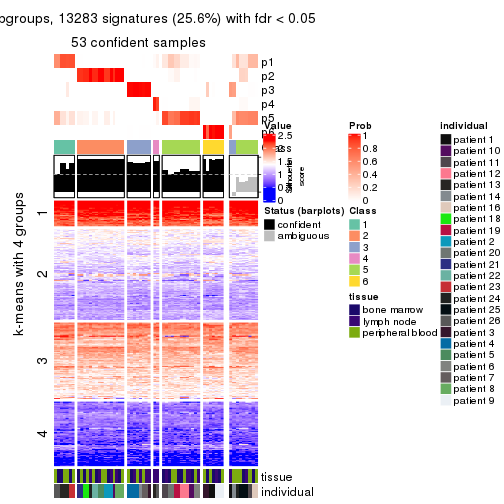</p>

</div>
</div>


Compare the overlap of signatures from different k:

```r
compare_signatures(res)
```

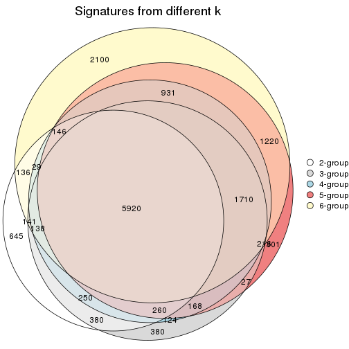

`get_signature()` returns a data frame invisibly. TO get the list of signatures, the function
call should be assigned to a variable explicitly. In following code, if `plot` argument is set
to `FALSE`, no heatmap is plotted while only the differential analysis is performed.

```r
# code only for demonstration
tb = get_signature(res, k = ..., plot = FALSE)
```

An example of the output of `tb` is:

```
#>   which_row         fdr    mean_1    mean_2 scaled_mean_1 scaled_mean_2 km
#> 1        38 0.042760348  8.373488  9.131774    -0.5533452     0.5164555  1
#> 2        40 0.018707592  7.106213  8.469186    -0.6173731     0.5762149  1
#> 3        55 0.019134737 10.221463 11.207825    -0.6159697     0.5749050  1
#> 4        59 0.006059896  5.921854  7.869574    -0.6899429     0.6439467  1
#> 5        60 0.018055526  8.928898 10.211722    -0.6204761     0.5791110  1
#> 6        98 0.009384629 15.714769 14.887706     0.6635654    -0.6193277  2
...
```

The columns in `tb` are:

1. `which_row`: row indices corresponding to the input matrix.
2. `fdr`: FDR for the differential test. 
3. `mean_x`: The mean value in group x.
4. `scaled_mean_x`: The mean value in group x after rows are scaled.
5. `km`: Row groups if k-means clustering is applied to rows.


UMAP plot which shows how samples are separated.


<script>
$( function() {
	$( '#tabs-ATC-hclust-dimension-reduction' ).tabs();
} );
</script>
<div id='tabs-ATC-hclust-dimension-reduction'>
<ul>
<li><a href='#tab-ATC-hclust-dimension-reduction-1'>k = 2</a></li>
<li><a href='#tab-ATC-hclust-dimension-reduction-2'>k = 3</a></li>
<li><a href='#tab-ATC-hclust-dimension-reduction-3'>k = 4</a></li>
<li><a href='#tab-ATC-hclust-dimension-reduction-4'>k = 5</a></li>
<li><a href='#tab-ATC-hclust-dimension-reduction-5'>k = 6</a></li>
</ul>
<div id='tab-ATC-hclust-dimension-reduction-1'>
<pre><code class="r">dimension_reduction(res, k = 2, method = &quot;UMAP&quot;)
</code></pre>

<p>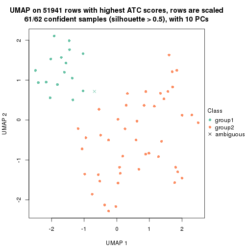</p>

</div>
<div id='tab-ATC-hclust-dimension-reduction-2'>
<pre><code class="r">dimension_reduction(res, k = 3, method = &quot;UMAP&quot;)
</code></pre>

<p>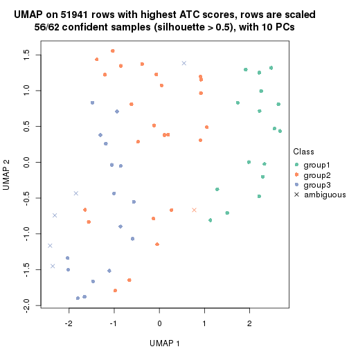</p>

</div>
<div id='tab-ATC-hclust-dimension-reduction-3'>
<pre><code class="r">dimension_reduction(res, k = 4, method = &quot;UMAP&quot;)
</code></pre>

<p>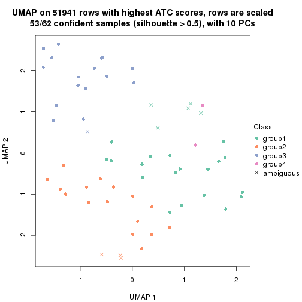</p>

</div>
<div id='tab-ATC-hclust-dimension-reduction-4'>
<pre><code class="r">dimension_reduction(res, k = 5, method = &quot;UMAP&quot;)
</code></pre>

<p>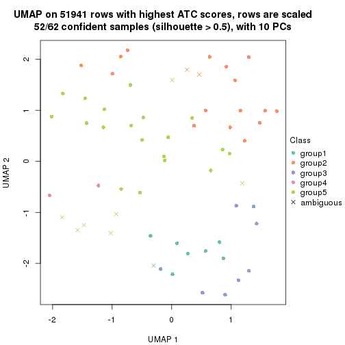</p>

</div>
<div id='tab-ATC-hclust-dimension-reduction-5'>
<pre><code class="r">dimension_reduction(res, k = 6, method = &quot;UMAP&quot;)
</code></pre>

<p>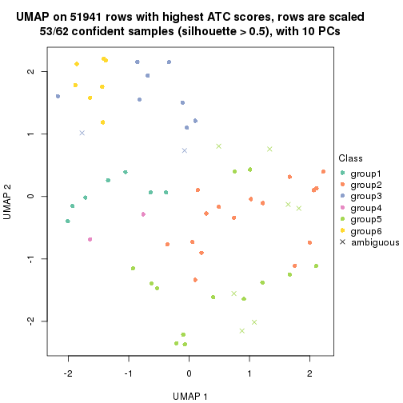</p>

</div>
</div>


Following heatmap shows how subgroups are split when increasing `k`:

```r
collect_classes(res)
```

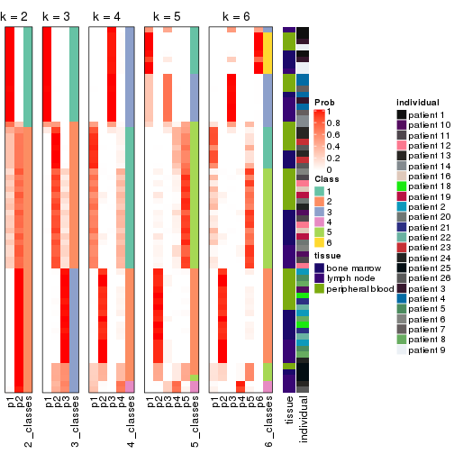


Test correlation between subgroups and known annotations. If the known
annotation is numeric, one-way ANOVA test is applied, and if the known
annotation is discrete, chi-squared contingency table test is applied.

```r
test_to_known_factors(res)
```

```
#>             n tissue(p) individual(p) k
#> ATC:hclust 61     0.592      2.74e-05 2
#> ATC:hclust 56     0.681      6.34e-07 3
#> ATC:hclust 53     0.410      7.63e-07 4
#> ATC:hclust 52     0.369      4.44e-08 5
#> ATC:hclust 53     0.321      3.76e-08 6
```


If matrix rows can be associated to genes, consider to use `functional_enrichment(res,
...)` to perform function enrichment for the signature genes. See [this vignette](http://bioconductor.org/packages/devel/bioc/vignettes/cola/inst/doc/functional_enrichment.html) for more detailed explanations.


 

---------------------------------------------------


### ATC:kmeans**


The object with results only for a single top-value method and a single partition method 
can be extracted as:

```r
res = res_list["ATC", "kmeans"]
# you can also extract it by
# res = res_list["ATC:kmeans"]
```

A summary of `res` and all the functions that can be applied to it:

```r
res
```

```
#> A 'ConsensusPartition' object with k = 2, 3, 4, 5, 6.
#>   On a matrix with 51941 rows and 62 columns.
#>   Top rows (1000, 2000, 3000, 4000, 5000) are extracted by 'ATC' method.
#>   Subgroups are detected by 'kmeans' method.
#>   Performed in total 1250 partitions by row resampling.
#>   Best k for subgroups seems to be 2.
#> 
#> Following methods can be applied to this 'ConsensusPartition' object:
#>  [1] "cola_report"             "collect_classes"         "collect_plots"          
#>  [4] "collect_stats"           "colnames"                "compare_signatures"     
#>  [7] "consensus_heatmap"       "dimension_reduction"     "functional_enrichment"  
#> [10] "get_anno_col"            "get_anno"                "get_classes"            
#> [13] "get_consensus"           "get_matrix"              "get_membership"         
#> [16] "get_param"               "get_signatures"          "get_stats"              
#> [19] "is_best_k"               "is_stable_k"             "membership_heatmap"     
#> [22] "ncol"                    "nrow"                    "plot_ecdf"              
#> [25] "rownames"                "select_partition_number" "show"                   
#> [28] "suggest_best_k"          "test_to_known_factors"
```

`collect_plots()` function collects all the plots made from `res` for all `k` (number of partitions)
into one single page to provide an easy and fast comparison between different `k`.

```r
collect_plots(res)
```

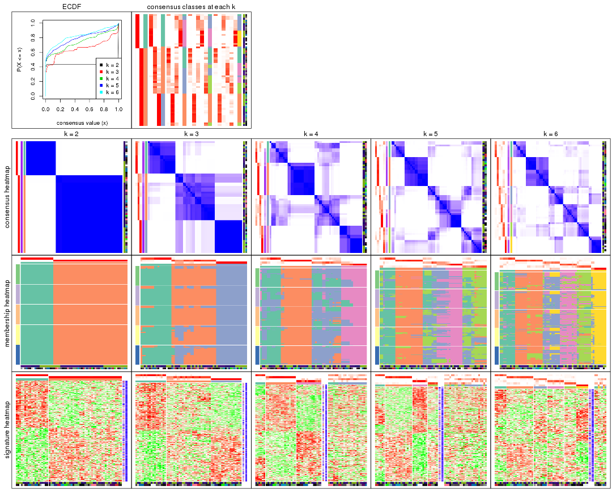

The plots are:

- The first row: a plot of the ECDF (empirical cumulative distribution
  function) curves of the consensus matrix for each `k` and the heatmap of
  predicted classes for each `k`.
- The second row: heatmaps of the consensus matrix for each `k`.
- The third row: heatmaps of the membership matrix for each `k`.
- The fouth row: heatmaps of the signatures for each `k`.

All the plots in panels can be made by individual functions and they are
plotted later in this section.

`select_partition_number()` produces several plots showing different
statistics for choosing "optimized" `k`. There are following statistics:

- ECDF curves of the consensus matrix for each `k`;
- 1-PAC. [The PAC
  score](https://en.wikipedia.org/wiki/Consensus_clustering#Over-interpretation_potential_of_consensus_clustering)
  measures the proportion of the ambiguous subgrouping.
- Mean silhouette score.
- Concordance. The mean probability of fiting the consensus class ids in all
  partitions.
- Area increased. Denote $A_k$ as the area under the ECDF curve for current
  `k`, the area increased is defined as $A_k - A_{k-1}$.
- Rand index. The percent of pairs of samples that are both in a same cluster
  or both are not in a same cluster in the partition of k and k-1.
- Jaccard index. The ratio of pairs of samples are both in a same cluster in
  the partition of k and k-1 and the pairs of samples are both in a same
  cluster in the partition k or k-1.

The detailed explanations of these statistics can be found in [the _cola_
vignette](http://bioconductor.org/packages/devel/bioc/vignettes/cola/inst/doc/cola.html#toc_13).

Generally speaking, lower PAC score, higher mean silhouette score or higher
concordance corresponds to better partition. Rand index and Jaccard index
measure how similar the current partition is compared to partition with `k-1`.
If they are too similar, we won't accept `k` is better than `k-1`.

```r
select_partition_number(res)
```


The numeric values for all these statistics can be obtained by `get_stats()`.

```r
get_stats(res)
```

```
#>   k 1-PAC mean_silhouette concordance area_increased  Rand Jaccard
#> 2 2 1.000           1.000       1.000         0.4327 0.568   0.568
#> 3 3 0.614           0.887       0.907         0.5146 0.739   0.551
#> 4 4 0.699           0.638       0.807         0.1325 0.866   0.624
#> 5 5 0.688           0.530       0.730         0.0665 0.856   0.506
#> 6 6 0.719           0.712       0.792         0.0417 0.924   0.650
```

`suggest_best_k()` suggests the best $k$ based on these statistics. The rules are as follows:

- All $k$ with Jaccard index larger than 0.95 are removed because increasing
  $k$ does not provide enough extra information. If all $k$ are removed, it is
  marked as no subgroup is detected.
- For all $k$ with 1-PAC score larger than 0.9, the maximal $k$ is taken as
  the best $k$, and other $k$ are marked as optional $k$.
- If it does not fit the second rule. The $k$ with the maximal vote of the
  highest 1-PAC score, highest mean silhouette, and highest concordance is
  taken as the best $k$.

```r
suggest_best_k(res)
```

```
#> [1] 2
```


Following shows the table of the partitions (You need to click the **show/hide
code output** link to see it). The membership matrix (columns with name `p*`)
is inferred by
[`clue::cl_consensus()`](https://www.rdocumentation.org/link/cl_consensus?package=clue)
function with the `SE` method. Basically the value in the membership matrix
represents the probability to belong to a certain group. The finall class
label for an item is determined with the group with highest probability it
belongs to.

In `get_classes()` function, the entropy is calculated from the membership
matrix and the silhouette score is calculated from the consensus matrix.


<script>
$( function() {
	$( '#tabs-ATC-kmeans-get-classes' ).tabs();
} );
</script>
<div id='tabs-ATC-kmeans-get-classes'>
<ul>
<li><a href='#tab-ATC-kmeans-get-classes-1'>k = 2</a></li>
<li><a href='#tab-ATC-kmeans-get-classes-2'>k = 3</a></li>
<li><a href='#tab-ATC-kmeans-get-classes-3'>k = 4</a></li>
<li><a href='#tab-ATC-kmeans-get-classes-4'>k = 5</a></li>
<li><a href='#tab-ATC-kmeans-get-classes-5'>k = 6</a></li>
</ul>

<div id='tab-ATC-kmeans-get-classes-1'>
<p><a id='tab-ATC-kmeans-get-classes-1-a' style='color:#0366d6' href='#'>show/hide code output</a></p>
<pre><code class="r">cbind(get_classes(res, k = 2), get_membership(res, k = 2))
</code></pre>

<pre><code>#&gt;           class entropy silhouette    p1    p2
#&gt; GSM525314     1  0.0000      1.000 1.000 0.000
#&gt; GSM525315     2  0.0000      1.000 0.000 1.000
#&gt; GSM525316     1  0.0000      1.000 1.000 0.000
#&gt; GSM525317     1  0.0000      1.000 1.000 0.000
#&gt; GSM525318     1  0.0000      1.000 1.000 0.000
#&gt; GSM525319     2  0.0000      1.000 0.000 1.000
#&gt; GSM525320     2  0.0000      1.000 0.000 1.000
#&gt; GSM525321     1  0.0000      1.000 1.000 0.000
#&gt; GSM525322     2  0.0000      1.000 0.000 1.000
#&gt; GSM525323     1  0.0000      1.000 1.000 0.000
#&gt; GSM525324     2  0.0000      1.000 0.000 1.000
#&gt; GSM525325     1  0.0000      1.000 1.000 0.000
#&gt; GSM525326     2  0.0376      0.996 0.004 0.996
#&gt; GSM525327     1  0.0000      1.000 1.000 0.000
#&gt; GSM525328     2  0.0000      1.000 0.000 1.000
#&gt; GSM525329     2  0.0376      0.996 0.004 0.996
#&gt; GSM525330     2  0.0000      1.000 0.000 1.000
#&gt; GSM525331     2  0.0000      1.000 0.000 1.000
#&gt; GSM525332     2  0.0000      1.000 0.000 1.000
#&gt; GSM525333     2  0.0000      1.000 0.000 1.000
#&gt; GSM525334     2  0.0000      1.000 0.000 1.000
#&gt; GSM525335     2  0.0000      1.000 0.000 1.000
#&gt; GSM525336     2  0.0376      0.996 0.004 0.996
#&gt; GSM525337     2  0.0376      0.996 0.004 0.996
#&gt; GSM525338     2  0.0000      1.000 0.000 1.000
#&gt; GSM525339     2  0.0000      1.000 0.000 1.000
#&gt; GSM525340     1  0.0000      1.000 1.000 0.000
#&gt; GSM525341     2  0.0000      1.000 0.000 1.000
#&gt; GSM525342     1  0.0000      1.000 1.000 0.000
#&gt; GSM525343     1  0.0000      1.000 1.000 0.000
#&gt; GSM525344     2  0.0000      1.000 0.000 1.000
#&gt; GSM525345     1  0.0000      1.000 1.000 0.000
#&gt; GSM525346     2  0.0000      1.000 0.000 1.000
#&gt; GSM525347     2  0.0000      1.000 0.000 1.000
#&gt; GSM525348     2  0.0000      1.000 0.000 1.000
#&gt; GSM525349     2  0.0000      1.000 0.000 1.000
#&gt; GSM525350     1  0.0000      1.000 1.000 0.000
#&gt; GSM525351     2  0.0000      1.000 0.000 1.000
#&gt; GSM525352     2  0.0000      1.000 0.000 1.000
#&gt; GSM525353     2  0.0000      1.000 0.000 1.000
#&gt; GSM525354     2  0.0000      1.000 0.000 1.000
#&gt; GSM525355     2  0.0000      1.000 0.000 1.000
#&gt; GSM525356     2  0.0000      1.000 0.000 1.000
#&gt; GSM525357     2  0.0000      1.000 0.000 1.000
#&gt; GSM525358     2  0.0000      1.000 0.000 1.000
#&gt; GSM525359     1  0.0000      1.000 1.000 0.000
#&gt; GSM525360     2  0.0000      1.000 0.000 1.000
#&gt; GSM525361     1  0.0000      1.000 1.000 0.000
#&gt; GSM525362     1  0.0000      1.000 1.000 0.000
#&gt; GSM525363     2  0.0000      1.000 0.000 1.000
#&gt; GSM525364     2  0.0000      1.000 0.000 1.000
#&gt; GSM525365     1  0.0000      1.000 1.000 0.000
#&gt; GSM525366     2  0.0000      1.000 0.000 1.000
#&gt; GSM525367     1  0.0000      1.000 1.000 0.000
#&gt; GSM525368     2  0.0000      1.000 0.000 1.000
#&gt; GSM525369     2  0.0000      1.000 0.000 1.000
#&gt; GSM525370     2  0.0000      1.000 0.000 1.000
#&gt; GSM525371     2  0.0000      1.000 0.000 1.000
#&gt; GSM525372     1  0.0000      1.000 1.000 0.000
#&gt; GSM525373     2  0.0000      1.000 0.000 1.000
#&gt; GSM525374     2  0.0000      1.000 0.000 1.000
#&gt; GSM525375     2  0.0000      1.000 0.000 1.000
</code></pre>

<script>
$('#tab-ATC-kmeans-get-classes-1-a').parent().next().next().hide();
$('#tab-ATC-kmeans-get-classes-1-a').click(function(){
  $('#tab-ATC-kmeans-get-classes-1-a').parent().next().next().toggle();
  return(false);
});
</script>
</div>

<div id='tab-ATC-kmeans-get-classes-2'>
<p><a id='tab-ATC-kmeans-get-classes-2-a' style='color:#0366d6' href='#'>show/hide code output</a></p>
<pre><code class="r">cbind(get_classes(res, k = 3), get_membership(res, k = 3))
</code></pre>

<pre><code>#&gt;           class entropy silhouette    p1    p2    p3
#&gt; GSM525314     1  0.0000      0.942 1.000 0.000 0.000
#&gt; GSM525315     3  0.0000      1.000 0.000 0.000 1.000
#&gt; GSM525316     1  0.0000      0.942 1.000 0.000 0.000
#&gt; GSM525317     1  0.3116      0.929 0.892 0.108 0.000
#&gt; GSM525318     1  0.0747      0.942 0.984 0.016 0.000
#&gt; GSM525319     3  0.0000      1.000 0.000 0.000 1.000
#&gt; GSM525320     2  0.5016      0.808 0.000 0.760 0.240
#&gt; GSM525321     1  0.3267      0.927 0.884 0.116 0.000
#&gt; GSM525322     3  0.0000      1.000 0.000 0.000 1.000
#&gt; GSM525323     1  0.0000      0.942 1.000 0.000 0.000
#&gt; GSM525324     3  0.0000      1.000 0.000 0.000 1.000
#&gt; GSM525325     1  0.3752      0.910 0.856 0.144 0.000
#&gt; GSM525326     2  0.0892      0.822 0.000 0.980 0.020
#&gt; GSM525327     1  0.5650      0.710 0.688 0.312 0.000
#&gt; GSM525328     2  0.3425      0.859 0.004 0.884 0.112
#&gt; GSM525329     2  0.3459      0.760 0.096 0.892 0.012
#&gt; GSM525330     2  0.3686      0.823 0.000 0.860 0.140
#&gt; GSM525331     3  0.0000      1.000 0.000 0.000 1.000
#&gt; GSM525332     2  0.6225      0.566 0.000 0.568 0.432
#&gt; GSM525333     2  0.6225      0.566 0.000 0.568 0.432
#&gt; GSM525334     3  0.0000      1.000 0.000 0.000 1.000
#&gt; GSM525335     3  0.0000      1.000 0.000 0.000 1.000
#&gt; GSM525336     2  0.0983      0.821 0.004 0.980 0.016
#&gt; GSM525337     2  0.3482      0.815 0.000 0.872 0.128
#&gt; GSM525338     3  0.0237      0.995 0.000 0.004 0.996
#&gt; GSM525339     2  0.3267      0.859 0.000 0.884 0.116
#&gt; GSM525340     1  0.0000      0.942 1.000 0.000 0.000
#&gt; GSM525341     3  0.0000      1.000 0.000 0.000 1.000
#&gt; GSM525342     1  0.0000      0.942 1.000 0.000 0.000
#&gt; GSM525343     1  0.3267      0.927 0.884 0.116 0.000
#&gt; GSM525344     3  0.0000      1.000 0.000 0.000 1.000
#&gt; GSM525345     1  0.0000      0.942 1.000 0.000 0.000
#&gt; GSM525346     2  0.3619      0.848 0.000 0.864 0.136
#&gt; GSM525347     2  0.5016      0.808 0.000 0.760 0.240
#&gt; GSM525348     2  0.3412      0.859 0.000 0.876 0.124
#&gt; GSM525349     2  0.3425      0.859 0.004 0.884 0.112
#&gt; GSM525350     1  0.3752      0.910 0.856 0.144 0.000
#&gt; GSM525351     3  0.0000      1.000 0.000 0.000 1.000
#&gt; GSM525352     2  0.6095      0.636 0.000 0.608 0.392
#&gt; GSM525353     2  0.6225      0.566 0.000 0.568 0.432
#&gt; GSM525354     3  0.0000      1.000 0.000 0.000 1.000
#&gt; GSM525355     3  0.0000      1.000 0.000 0.000 1.000
#&gt; GSM525356     2  0.3425      0.859 0.004 0.884 0.112
#&gt; GSM525357     3  0.0000      1.000 0.000 0.000 1.000
#&gt; GSM525358     2  0.3267      0.859 0.000 0.884 0.116
#&gt; GSM525359     1  0.0424      0.943 0.992 0.008 0.000
#&gt; GSM525360     3  0.0000      1.000 0.000 0.000 1.000
#&gt; GSM525361     1  0.3267      0.927 0.884 0.116 0.000
#&gt; GSM525362     2  0.3482      0.725 0.128 0.872 0.000
#&gt; GSM525363     3  0.0000      1.000 0.000 0.000 1.000
#&gt; GSM525364     2  0.1031      0.825 0.000 0.976 0.024
#&gt; GSM525365     1  0.0747      0.942 0.984 0.016 0.000
#&gt; GSM525366     3  0.0000      1.000 0.000 0.000 1.000
#&gt; GSM525367     1  0.0000      0.942 1.000 0.000 0.000
#&gt; GSM525368     2  0.4346      0.840 0.000 0.816 0.184
#&gt; GSM525369     2  0.0892      0.822 0.000 0.980 0.020
#&gt; GSM525370     2  0.3412      0.859 0.000 0.876 0.124
#&gt; GSM525371     2  0.3425      0.859 0.004 0.884 0.112
#&gt; GSM525372     1  0.3267      0.927 0.884 0.116 0.000
#&gt; GSM525373     3  0.0000      1.000 0.000 0.000 1.000
#&gt; GSM525374     2  0.6095      0.636 0.000 0.608 0.392
#&gt; GSM525375     2  0.3425      0.859 0.004 0.884 0.112
</code></pre>

<script>
$('#tab-ATC-kmeans-get-classes-2-a').parent().next().next().hide();
$('#tab-ATC-kmeans-get-classes-2-a').click(function(){
  $('#tab-ATC-kmeans-get-classes-2-a').parent().next().next().toggle();
  return(false);
});
</script>
</div>

<div id='tab-ATC-kmeans-get-classes-3'>
<p><a id='tab-ATC-kmeans-get-classes-3-a' style='color:#0366d6' href='#'>show/hide code output</a></p>
<pre><code class="r">cbind(get_classes(res, k = 4), get_membership(res, k = 4))
</code></pre>

<pre><code>#&gt;           class entropy silhouette    p1    p2    p3    p4
#&gt; GSM525314     4  0.0000     0.8807 0.000 0.000 0.000 1.000
#&gt; GSM525315     2  0.0188     0.9579 0.000 0.996 0.004 0.000
#&gt; GSM525316     4  0.0000     0.8807 0.000 0.000 0.000 1.000
#&gt; GSM525317     4  0.4382     0.8005 0.000 0.000 0.296 0.704
#&gt; GSM525318     4  0.0000     0.8807 0.000 0.000 0.000 1.000
#&gt; GSM525319     2  0.0469     0.9582 0.000 0.988 0.012 0.000
#&gt; GSM525320     3  0.5982     0.3313 0.436 0.040 0.524 0.000
#&gt; GSM525321     4  0.4382     0.8005 0.000 0.000 0.296 0.704
#&gt; GSM525322     2  0.0469     0.9582 0.000 0.988 0.012 0.000
#&gt; GSM525323     4  0.0000     0.8807 0.000 0.000 0.000 1.000
#&gt; GSM525324     2  0.0188     0.9579 0.000 0.996 0.004 0.000
#&gt; GSM525325     3  0.4422     0.2202 0.008 0.000 0.736 0.256
#&gt; GSM525326     1  0.4989    -0.1831 0.528 0.000 0.472 0.000
#&gt; GSM525327     1  0.7427    -0.0693 0.500 0.000 0.200 0.300
#&gt; GSM525328     1  0.1022     0.6211 0.968 0.000 0.032 0.000
#&gt; GSM525329     3  0.2589     0.4599 0.116 0.000 0.884 0.000
#&gt; GSM525330     3  0.3801     0.4583 0.220 0.000 0.780 0.000
#&gt; GSM525331     2  0.0188     0.9579 0.000 0.996 0.004 0.000
#&gt; GSM525332     3  0.7390     0.3747 0.204 0.284 0.512 0.000
#&gt; GSM525333     3  0.7408     0.3795 0.212 0.276 0.512 0.000
#&gt; GSM525334     2  0.0921     0.9429 0.000 0.972 0.028 0.000
#&gt; GSM525335     2  0.0000     0.9587 0.000 1.000 0.000 0.000
#&gt; GSM525336     1  0.1940     0.6166 0.924 0.000 0.076 0.000
#&gt; GSM525337     3  0.2589     0.4599 0.116 0.000 0.884 0.000
#&gt; GSM525338     2  0.5249     0.6032 0.044 0.708 0.248 0.000
#&gt; GSM525339     1  0.3975     0.4789 0.760 0.000 0.240 0.000
#&gt; GSM525340     4  0.0000     0.8807 0.000 0.000 0.000 1.000
#&gt; GSM525341     2  0.0000     0.9587 0.000 1.000 0.000 0.000
#&gt; GSM525342     4  0.0000     0.8807 0.000 0.000 0.000 1.000
#&gt; GSM525343     4  0.4382     0.8005 0.000 0.000 0.296 0.704
#&gt; GSM525344     2  0.0469     0.9582 0.000 0.988 0.012 0.000
#&gt; GSM525345     4  0.0000     0.8807 0.000 0.000 0.000 1.000
#&gt; GSM525346     3  0.4977     0.3053 0.460 0.000 0.540 0.000
#&gt; GSM525347     3  0.5929     0.4227 0.296 0.064 0.640 0.000
#&gt; GSM525348     1  0.5396    -0.1843 0.524 0.012 0.464 0.000
#&gt; GSM525349     1  0.0000     0.6192 1.000 0.000 0.000 0.000
#&gt; GSM525350     3  0.4422     0.2202 0.008 0.000 0.736 0.256
#&gt; GSM525351     2  0.0000     0.9587 0.000 1.000 0.000 0.000
#&gt; GSM525352     3  0.7324     0.3939 0.240 0.228 0.532 0.000
#&gt; GSM525353     3  0.7415     0.3805 0.216 0.272 0.512 0.000
#&gt; GSM525354     2  0.0817     0.9458 0.000 0.976 0.024 0.000
#&gt; GSM525355     2  0.0000     0.9587 0.000 1.000 0.000 0.000
#&gt; GSM525356     1  0.1940     0.6166 0.924 0.000 0.076 0.000
#&gt; GSM525357     2  0.4406     0.7249 0.028 0.780 0.192 0.000
#&gt; GSM525358     1  0.3975     0.4789 0.760 0.000 0.240 0.000
#&gt; GSM525359     4  0.3024     0.8578 0.000 0.000 0.148 0.852
#&gt; GSM525360     2  0.0469     0.9582 0.000 0.988 0.012 0.000
#&gt; GSM525361     4  0.4382     0.8005 0.000 0.000 0.296 0.704
#&gt; GSM525362     3  0.4872     0.3114 0.244 0.000 0.728 0.028
#&gt; GSM525363     2  0.0469     0.9582 0.000 0.988 0.012 0.000
#&gt; GSM525364     3  0.4998     0.2646 0.488 0.000 0.512 0.000
#&gt; GSM525365     4  0.2760     0.8628 0.000 0.000 0.128 0.872
#&gt; GSM525366     2  0.0469     0.9582 0.000 0.988 0.012 0.000
#&gt; GSM525367     4  0.0000     0.8807 0.000 0.000 0.000 1.000
#&gt; GSM525368     3  0.5147     0.3061 0.460 0.004 0.536 0.000
#&gt; GSM525369     3  0.4888     0.3381 0.412 0.000 0.588 0.000
#&gt; GSM525370     1  0.5329    -0.1522 0.568 0.012 0.420 0.000
#&gt; GSM525371     1  0.0707     0.6119 0.980 0.000 0.020 0.000
#&gt; GSM525372     4  0.4382     0.8005 0.000 0.000 0.296 0.704
#&gt; GSM525373     2  0.0469     0.9582 0.000 0.988 0.012 0.000
#&gt; GSM525374     3  0.6531     0.4471 0.204 0.160 0.636 0.000
#&gt; GSM525375     1  0.0707     0.6119 0.980 0.000 0.020 0.000
</code></pre>

<script>
$('#tab-ATC-kmeans-get-classes-3-a').parent().next().next().hide();
$('#tab-ATC-kmeans-get-classes-3-a').click(function(){
  $('#tab-ATC-kmeans-get-classes-3-a').parent().next().next().toggle();
  return(false);
});
</script>
</div>

<div id='tab-ATC-kmeans-get-classes-4'>
<p><a id='tab-ATC-kmeans-get-classes-4-a' style='color:#0366d6' href='#'>show/hide code output</a></p>
<pre><code class="r">cbind(get_classes(res, k = 5), get_membership(res, k = 5))
</code></pre>

<pre><code>#&gt;           class entropy silhouette    p1    p2    p3    p4    p5
#&gt; GSM525314     4  0.0000     0.8724 0.000 0.000 0.000 1.000 0.000
#&gt; GSM525315     2  0.1952     0.9216 0.000 0.912 0.004 0.000 0.084
#&gt; GSM525316     4  0.0162     0.8721 0.004 0.000 0.000 0.996 0.000
#&gt; GSM525317     3  0.4302    -0.2296 0.000 0.000 0.520 0.480 0.000
#&gt; GSM525318     4  0.2890     0.7498 0.004 0.000 0.160 0.836 0.000
#&gt; GSM525319     2  0.1168     0.9355 0.008 0.960 0.032 0.000 0.000
#&gt; GSM525320     3  0.7337    -0.2149 0.224 0.032 0.380 0.000 0.364
#&gt; GSM525321     3  0.4811    -0.1870 0.000 0.000 0.528 0.452 0.020
#&gt; GSM525322     2  0.1195     0.9357 0.012 0.960 0.028 0.000 0.000
#&gt; GSM525323     4  0.0000     0.8724 0.000 0.000 0.000 1.000 0.000
#&gt; GSM525324     2  0.1430     0.9351 0.000 0.944 0.004 0.000 0.052
#&gt; GSM525325     3  0.4421     0.2520 0.000 0.000 0.748 0.068 0.184
#&gt; GSM525326     5  0.6749     0.1629 0.268 0.000 0.336 0.000 0.396
#&gt; GSM525327     1  0.5646     0.3712 0.628 0.000 0.268 0.096 0.008
#&gt; GSM525328     1  0.1732     0.7678 0.920 0.000 0.000 0.000 0.080
#&gt; GSM525329     5  0.4604     0.2705 0.008 0.000 0.404 0.004 0.584
#&gt; GSM525330     5  0.5716     0.3117 0.080 0.004 0.364 0.000 0.552
#&gt; GSM525331     2  0.1952     0.9213 0.000 0.912 0.004 0.000 0.084
#&gt; GSM525332     5  0.2818     0.5738 0.004 0.128 0.008 0.000 0.860
#&gt; GSM525333     5  0.2193     0.5849 0.008 0.092 0.000 0.000 0.900
#&gt; GSM525334     2  0.2733     0.8924 0.004 0.872 0.012 0.000 0.112
#&gt; GSM525335     2  0.0703     0.9393 0.000 0.976 0.000 0.000 0.024
#&gt; GSM525336     1  0.2921     0.7586 0.856 0.000 0.020 0.000 0.124
#&gt; GSM525337     5  0.3741     0.4327 0.004 0.000 0.264 0.000 0.732
#&gt; GSM525338     5  0.3663     0.5074 0.000 0.208 0.016 0.000 0.776
#&gt; GSM525339     1  0.4425     0.4199 0.544 0.000 0.004 0.000 0.452
#&gt; GSM525340     4  0.0000     0.8724 0.000 0.000 0.000 1.000 0.000
#&gt; GSM525341     2  0.1410     0.9337 0.000 0.940 0.000 0.000 0.060
#&gt; GSM525342     4  0.0162     0.8721 0.004 0.000 0.000 0.996 0.000
#&gt; GSM525343     3  0.4302    -0.2296 0.000 0.000 0.520 0.480 0.000
#&gt; GSM525344     2  0.1195     0.9357 0.012 0.960 0.028 0.000 0.000
#&gt; GSM525345     4  0.0162     0.8721 0.004 0.000 0.000 0.996 0.000
#&gt; GSM525346     3  0.6752    -0.1252 0.280 0.000 0.404 0.000 0.316
#&gt; GSM525347     5  0.6067     0.3603 0.092 0.020 0.308 0.000 0.580
#&gt; GSM525348     5  0.6759     0.1614 0.276 0.000 0.328 0.000 0.396
#&gt; GSM525349     1  0.1502     0.7636 0.940 0.000 0.004 0.000 0.056
#&gt; GSM525350     3  0.4421     0.2520 0.000 0.000 0.748 0.068 0.184
#&gt; GSM525351     2  0.1704     0.9299 0.000 0.928 0.004 0.000 0.068
#&gt; GSM525352     5  0.1956     0.5848 0.008 0.076 0.000 0.000 0.916
#&gt; GSM525353     5  0.2193     0.5849 0.008 0.092 0.000 0.000 0.900
#&gt; GSM525354     2  0.2574     0.8947 0.000 0.876 0.012 0.000 0.112
#&gt; GSM525355     2  0.0703     0.9393 0.000 0.976 0.000 0.000 0.024
#&gt; GSM525356     1  0.2873     0.7583 0.856 0.000 0.016 0.000 0.128
#&gt; GSM525357     5  0.4525     0.2743 0.000 0.360 0.016 0.000 0.624
#&gt; GSM525358     1  0.4449     0.3631 0.512 0.000 0.004 0.000 0.484
#&gt; GSM525359     4  0.4423     0.5515 0.012 0.000 0.296 0.684 0.008
#&gt; GSM525360     2  0.1168     0.9355 0.008 0.960 0.032 0.000 0.000
#&gt; GSM525361     3  0.4297    -0.2143 0.000 0.000 0.528 0.472 0.000
#&gt; GSM525362     3  0.2721     0.2841 0.052 0.000 0.896 0.016 0.036
#&gt; GSM525363     2  0.1281     0.9343 0.012 0.956 0.032 0.000 0.000
#&gt; GSM525364     3  0.6689    -0.0784 0.344 0.000 0.412 0.000 0.244
#&gt; GSM525365     4  0.4928     0.3435 0.012 0.000 0.408 0.568 0.012
#&gt; GSM525366     2  0.1281     0.9343 0.012 0.956 0.032 0.000 0.000
#&gt; GSM525367     4  0.0000     0.8724 0.000 0.000 0.000 1.000 0.000
#&gt; GSM525368     3  0.6752    -0.1252 0.280 0.000 0.404 0.000 0.316
#&gt; GSM525369     5  0.6431     0.1658 0.176 0.000 0.388 0.000 0.436
#&gt; GSM525370     3  0.6823    -0.1799 0.328 0.000 0.348 0.000 0.324
#&gt; GSM525371     1  0.1981     0.7391 0.924 0.000 0.048 0.000 0.028
#&gt; GSM525372     3  0.5246    -0.1986 0.012 0.000 0.512 0.452 0.024
#&gt; GSM525373     2  0.1281     0.9343 0.012 0.956 0.032 0.000 0.000
#&gt; GSM525374     5  0.2362     0.5868 0.000 0.076 0.024 0.000 0.900
#&gt; GSM525375     1  0.2300     0.7370 0.908 0.000 0.052 0.000 0.040
</code></pre>

<script>
$('#tab-ATC-kmeans-get-classes-4-a').parent().next().next().hide();
$('#tab-ATC-kmeans-get-classes-4-a').click(function(){
  $('#tab-ATC-kmeans-get-classes-4-a').parent().next().next().toggle();
  return(false);
});
</script>
</div>

<div id='tab-ATC-kmeans-get-classes-5'>
<p><a id='tab-ATC-kmeans-get-classes-5-a' style='color:#0366d6' href='#'>show/hide code output</a></p>
<pre><code class="r">cbind(get_classes(res, k = 6), get_membership(res, k = 6))
</code></pre>

<pre><code>#&gt;           class entropy silhouette    p1    p2    p3    p4    p5    p6
#&gt; GSM525314     6  0.0000      0.871 0.000 0.000 0.000 0.000 0.000 1.000
#&gt; GSM525315     2  0.3053      0.800 0.004 0.812 0.012 0.000 0.172 0.000
#&gt; GSM525316     6  0.0146      0.870 0.000 0.000 0.000 0.000 0.004 0.996
#&gt; GSM525317     3  0.3383      0.657 0.000 0.000 0.728 0.000 0.004 0.268
#&gt; GSM525318     6  0.3847      0.301 0.000 0.000 0.348 0.000 0.008 0.644
#&gt; GSM525319     2  0.2367      0.830 0.016 0.888 0.088 0.008 0.000 0.000
#&gt; GSM525320     4  0.3510      0.814 0.016 0.016 0.020 0.824 0.124 0.000
#&gt; GSM525321     3  0.3697      0.664 0.004 0.000 0.732 0.000 0.016 0.248
#&gt; GSM525322     2  0.2745      0.826 0.020 0.860 0.112 0.008 0.000 0.000
#&gt; GSM525323     6  0.0000      0.871 0.000 0.000 0.000 0.000 0.000 1.000
#&gt; GSM525324     2  0.2214      0.836 0.004 0.892 0.012 0.000 0.092 0.000
#&gt; GSM525325     3  0.5776      0.510 0.008 0.000 0.584 0.272 0.116 0.020
#&gt; GSM525326     4  0.4442      0.791 0.068 0.000 0.048 0.760 0.124 0.000
#&gt; GSM525327     1  0.4667      0.529 0.720 0.000 0.204 0.016 0.036 0.024
#&gt; GSM525328     1  0.1769      0.765 0.924 0.000 0.004 0.060 0.012 0.000
#&gt; GSM525329     3  0.5916      0.168 0.012 0.000 0.464 0.148 0.376 0.000
#&gt; GSM525330     4  0.4954      0.624 0.012 0.000 0.092 0.660 0.236 0.000
#&gt; GSM525331     2  0.2946      0.809 0.004 0.824 0.012 0.000 0.160 0.000
#&gt; GSM525332     5  0.4145      0.823 0.040 0.060 0.008 0.096 0.796 0.000
#&gt; GSM525333     5  0.3855      0.826 0.044 0.044 0.000 0.108 0.804 0.000
#&gt; GSM525334     2  0.3919      0.705 0.004 0.728 0.008 0.016 0.244 0.000
#&gt; GSM525335     2  0.1644      0.840 0.000 0.920 0.004 0.000 0.076 0.000
#&gt; GSM525336     1  0.3040      0.756 0.856 0.000 0.044 0.084 0.016 0.000
#&gt; GSM525337     5  0.5684      0.328 0.024 0.000 0.264 0.128 0.584 0.000
#&gt; GSM525338     5  0.3940      0.785 0.016 0.104 0.012 0.064 0.804 0.000
#&gt; GSM525339     1  0.5220      0.334 0.540 0.000 0.024 0.048 0.388 0.000
#&gt; GSM525340     6  0.0405      0.869 0.004 0.000 0.000 0.000 0.008 0.988
#&gt; GSM525341     2  0.2442      0.821 0.004 0.852 0.000 0.000 0.144 0.000
#&gt; GSM525342     6  0.0363      0.870 0.000 0.000 0.000 0.000 0.012 0.988
#&gt; GSM525343     3  0.3383      0.657 0.000 0.000 0.728 0.000 0.004 0.268
#&gt; GSM525344     2  0.2565      0.827 0.016 0.872 0.104 0.008 0.000 0.000
#&gt; GSM525345     6  0.0363      0.870 0.000 0.000 0.000 0.000 0.012 0.988
#&gt; GSM525346     4  0.2782      0.811 0.032 0.000 0.024 0.876 0.068 0.000
#&gt; GSM525347     4  0.3690      0.655 0.008 0.000 0.000 0.684 0.308 0.000
#&gt; GSM525348     4  0.4512      0.793 0.072 0.000 0.044 0.752 0.132 0.000
#&gt; GSM525349     1  0.1745      0.763 0.920 0.000 0.000 0.068 0.012 0.000
#&gt; GSM525350     3  0.5776      0.510 0.008 0.000 0.584 0.272 0.116 0.020
#&gt; GSM525351     2  0.2700      0.813 0.004 0.836 0.004 0.000 0.156 0.000
#&gt; GSM525352     5  0.4039      0.824 0.044 0.044 0.004 0.112 0.796 0.000
#&gt; GSM525353     5  0.3855      0.826 0.044 0.044 0.000 0.108 0.804 0.000
#&gt; GSM525354     2  0.3437      0.731 0.004 0.752 0.008 0.000 0.236 0.000
#&gt; GSM525355     2  0.1644      0.840 0.000 0.920 0.004 0.000 0.076 0.000
#&gt; GSM525356     1  0.3113      0.759 0.856 0.000 0.040 0.076 0.028 0.000
#&gt; GSM525357     5  0.4309      0.706 0.012 0.176 0.012 0.048 0.752 0.000
#&gt; GSM525358     1  0.5241      0.297 0.528 0.000 0.024 0.048 0.400 0.000
#&gt; GSM525359     6  0.5354      0.157 0.036 0.000 0.352 0.004 0.040 0.568
#&gt; GSM525360     2  0.2565      0.827 0.016 0.872 0.104 0.008 0.000 0.000
#&gt; GSM525361     3  0.3383      0.657 0.000 0.000 0.728 0.004 0.000 0.268
#&gt; GSM525362     3  0.3497      0.593 0.008 0.000 0.760 0.224 0.004 0.004
#&gt; GSM525363     2  0.2652      0.826 0.020 0.868 0.104 0.008 0.000 0.000
#&gt; GSM525364     4  0.3139      0.740 0.080 0.000 0.048 0.852 0.020 0.000
#&gt; GSM525365     3  0.5292      0.392 0.028 0.000 0.548 0.004 0.040 0.380
#&gt; GSM525366     2  0.2652      0.826 0.020 0.868 0.104 0.008 0.000 0.000
#&gt; GSM525367     6  0.0000      0.871 0.000 0.000 0.000 0.000 0.000 1.000
#&gt; GSM525368     4  0.2782      0.811 0.032 0.000 0.024 0.876 0.068 0.000
#&gt; GSM525369     4  0.2945      0.793 0.000 0.000 0.020 0.824 0.156 0.000
#&gt; GSM525370     4  0.4180      0.799 0.076 0.000 0.044 0.784 0.096 0.000
#&gt; GSM525371     1  0.4015      0.689 0.744 0.000 0.036 0.208 0.012 0.000
#&gt; GSM525372     3  0.4974      0.636 0.028 0.000 0.668 0.004 0.052 0.248
#&gt; GSM525373     2  0.2652      0.826 0.020 0.868 0.104 0.008 0.000 0.000
#&gt; GSM525374     5  0.3549      0.809 0.020 0.032 0.020 0.092 0.836 0.000
#&gt; GSM525375     1  0.4359      0.687 0.724 0.000 0.040 0.212 0.024 0.000
</code></pre>

<script>
$('#tab-ATC-kmeans-get-classes-5-a').parent().next().next().hide();
$('#tab-ATC-kmeans-get-classes-5-a').click(function(){
  $('#tab-ATC-kmeans-get-classes-5-a').parent().next().next().toggle();
  return(false);
});
</script>
</div>
</div>

Heatmaps for the consensus matrix. It visualizes the probability of two
samples to be in a same group.


<script>
$( function() {
	$( '#tabs-ATC-kmeans-consensus-heatmap' ).tabs();
} );
</script>
<div id='tabs-ATC-kmeans-consensus-heatmap'>
<ul>
<li><a href='#tab-ATC-kmeans-consensus-heatmap-1'>k = 2</a></li>
<li><a href='#tab-ATC-kmeans-consensus-heatmap-2'>k = 3</a></li>
<li><a href='#tab-ATC-kmeans-consensus-heatmap-3'>k = 4</a></li>
<li><a href='#tab-ATC-kmeans-consensus-heatmap-4'>k = 5</a></li>
<li><a href='#tab-ATC-kmeans-consensus-heatmap-5'>k = 6</a></li>
</ul>
<div id='tab-ATC-kmeans-consensus-heatmap-1'>
<pre><code class="r">consensus_heatmap(res, k = 2)
</code></pre>

<p>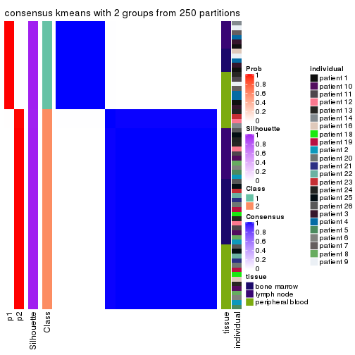</p>

</div>
<div id='tab-ATC-kmeans-consensus-heatmap-2'>
<pre><code class="r">consensus_heatmap(res, k = 3)
</code></pre>

<p>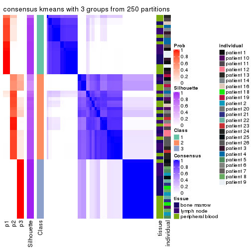</p>

</div>
<div id='tab-ATC-kmeans-consensus-heatmap-3'>
<pre><code class="r">consensus_heatmap(res, k = 4)
</code></pre>

<p>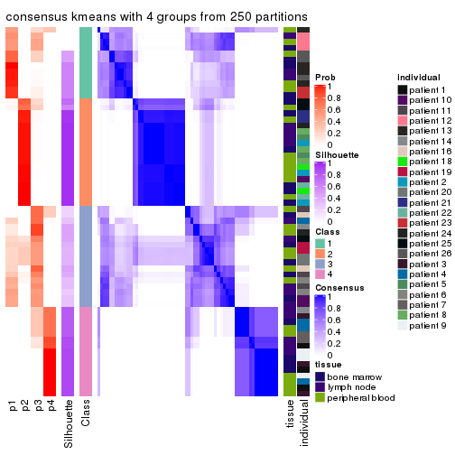</p>

</div>
<div id='tab-ATC-kmeans-consensus-heatmap-4'>
<pre><code class="r">consensus_heatmap(res, k = 5)
</code></pre>

<p>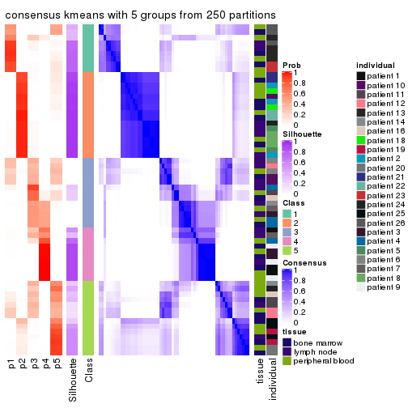</p>

</div>
<div id='tab-ATC-kmeans-consensus-heatmap-5'>
<pre><code class="r">consensus_heatmap(res, k = 6)
</code></pre>

<p>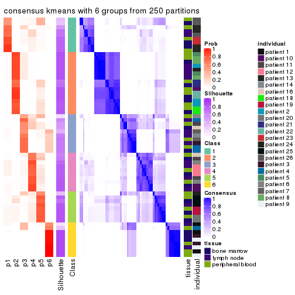</p>

</div>
</div>

Heatmaps for the membership of samples in all partitions to see how consistent they are:


<script>
$( function() {
	$( '#tabs-ATC-kmeans-membership-heatmap' ).tabs();
} );
</script>
<div id='tabs-ATC-kmeans-membership-heatmap'>
<ul>
<li><a href='#tab-ATC-kmeans-membership-heatmap-1'>k = 2</a></li>
<li><a href='#tab-ATC-kmeans-membership-heatmap-2'>k = 3</a></li>
<li><a href='#tab-ATC-kmeans-membership-heatmap-3'>k = 4</a></li>
<li><a href='#tab-ATC-kmeans-membership-heatmap-4'>k = 5</a></li>
<li><a href='#tab-ATC-kmeans-membership-heatmap-5'>k = 6</a></li>
</ul>
<div id='tab-ATC-kmeans-membership-heatmap-1'>
<pre><code class="r">membership_heatmap(res, k = 2)
</code></pre>

<p>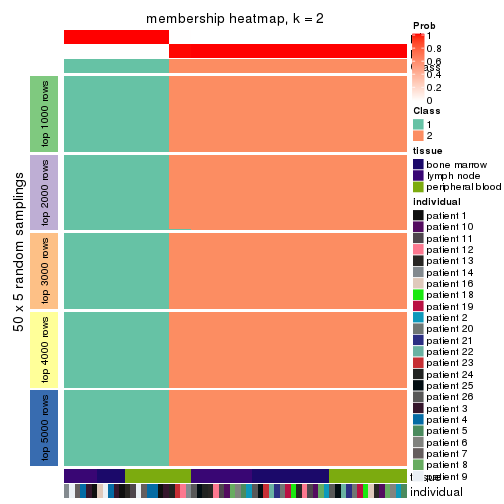</p>

</div>
<div id='tab-ATC-kmeans-membership-heatmap-2'>
<pre><code class="r">membership_heatmap(res, k = 3)
</code></pre>

<p>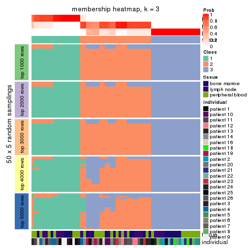</p>

</div>
<div id='tab-ATC-kmeans-membership-heatmap-3'>
<pre><code class="r">membership_heatmap(res, k = 4)
</code></pre>

<p>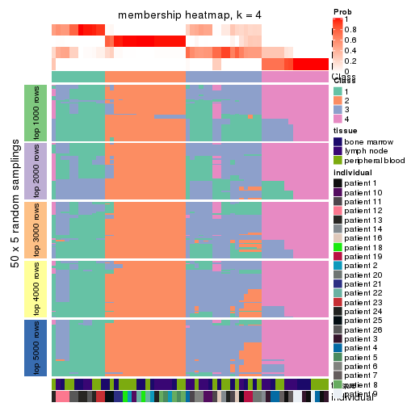</p>

</div>
<div id='tab-ATC-kmeans-membership-heatmap-4'>
<pre><code class="r">membership_heatmap(res, k = 5)
</code></pre>

<p>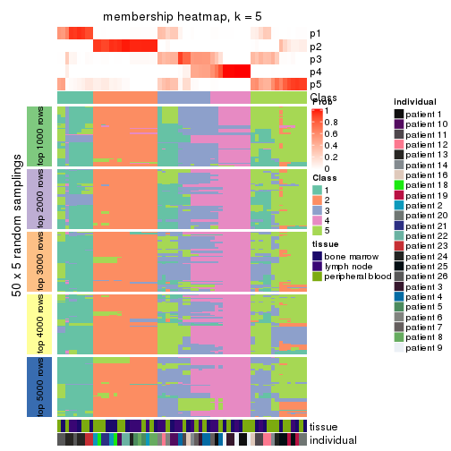</p>

</div>
<div id='tab-ATC-kmeans-membership-heatmap-5'>
<pre><code class="r">membership_heatmap(res, k = 6)
</code></pre>

<p>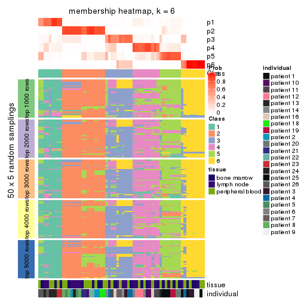</p>

</div>
</div>

As soon as we have had the classes for columns, we can look for signatures
which are significantly different between classes which can be candidate marks
for certain classes. Following are the heatmaps for signatures.


Signature heatmaps where rows are scaled:


<script>
$( function() {
	$( '#tabs-ATC-kmeans-get-signatures' ).tabs();
} );
</script>
<div id='tabs-ATC-kmeans-get-signatures'>
<ul>
<li><a href='#tab-ATC-kmeans-get-signatures-1'>k = 2</a></li>
<li><a href='#tab-ATC-kmeans-get-signatures-2'>k = 3</a></li>
<li><a href='#tab-ATC-kmeans-get-signatures-3'>k = 4</a></li>
<li><a href='#tab-ATC-kmeans-get-signatures-4'>k = 5</a></li>
<li><a href='#tab-ATC-kmeans-get-signatures-5'>k = 6</a></li>
</ul>
<div id='tab-ATC-kmeans-get-signatures-1'>
<pre><code class="r">get_signatures(res, k = 2)
</code></pre>

<p>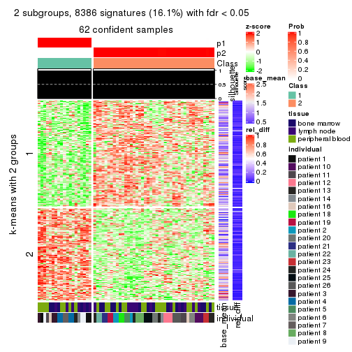</p>

</div>
<div id='tab-ATC-kmeans-get-signatures-2'>
<pre><code class="r">get_signatures(res, k = 3)
</code></pre>

<p>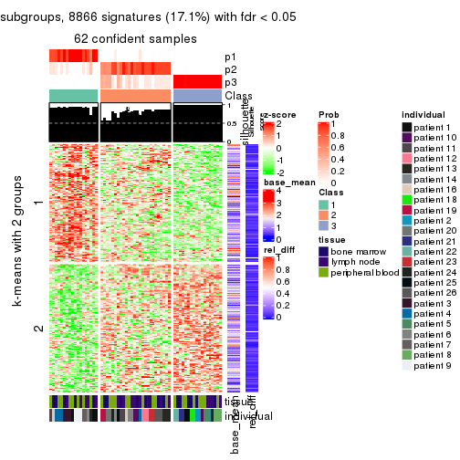</p>

</div>
<div id='tab-ATC-kmeans-get-signatures-3'>
<pre><code class="r">get_signatures(res, k = 4)
</code></pre>

<p>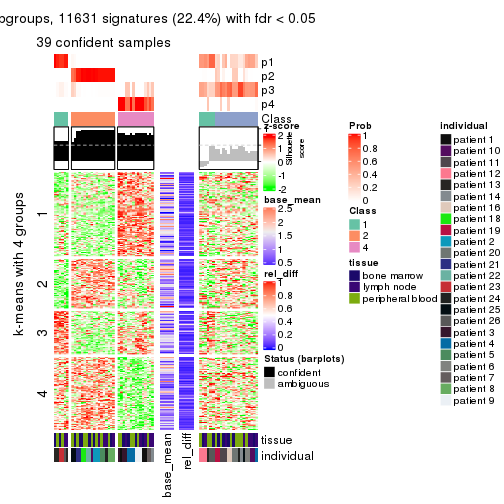</p>

</div>
<div id='tab-ATC-kmeans-get-signatures-4'>
<pre><code class="r">get_signatures(res, k = 5)
</code></pre>

<p>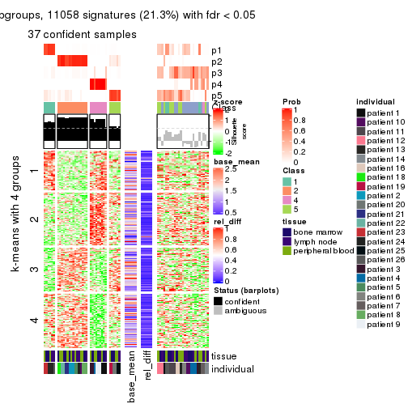</p>

</div>
<div id='tab-ATC-kmeans-get-signatures-5'>
<pre><code class="r">get_signatures(res, k = 6)
</code></pre>

<p>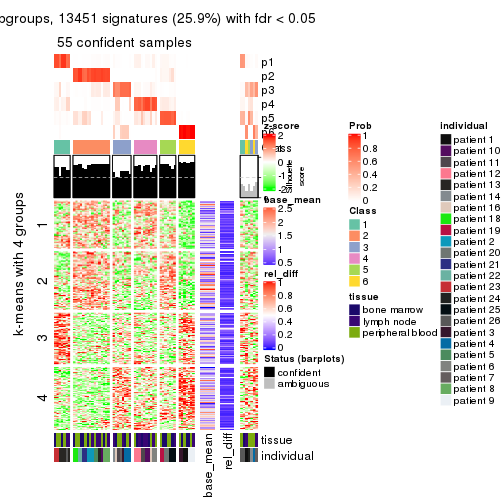</p>

</div>
</div>


Signature heatmaps where rows are not scaled:


<script>
$( function() {
	$( '#tabs-ATC-kmeans-get-signatures-no-scale' ).tabs();
} );
</script>
<div id='tabs-ATC-kmeans-get-signatures-no-scale'>
<ul>
<li><a href='#tab-ATC-kmeans-get-signatures-no-scale-1'>k = 2</a></li>
<li><a href='#tab-ATC-kmeans-get-signatures-no-scale-2'>k = 3</a></li>
<li><a href='#tab-ATC-kmeans-get-signatures-no-scale-3'>k = 4</a></li>
<li><a href='#tab-ATC-kmeans-get-signatures-no-scale-4'>k = 5</a></li>
<li><a href='#tab-ATC-kmeans-get-signatures-no-scale-5'>k = 6</a></li>
</ul>
<div id='tab-ATC-kmeans-get-signatures-no-scale-1'>
<pre><code class="r">get_signatures(res, k = 2, scale_rows = FALSE)
</code></pre>

<p>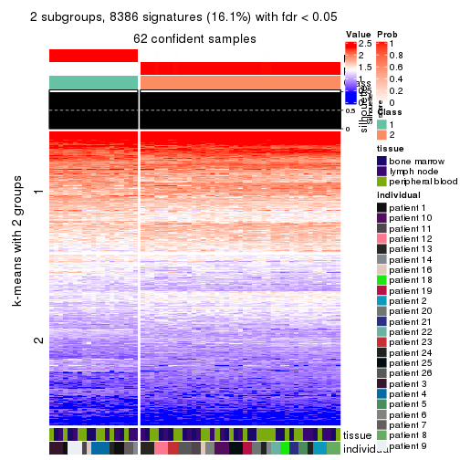</p>

</div>
<div id='tab-ATC-kmeans-get-signatures-no-scale-2'>
<pre><code class="r">get_signatures(res, k = 3, scale_rows = FALSE)
</code></pre>

<p>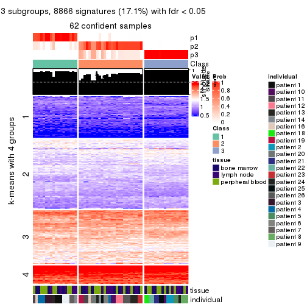</p>

</div>
<div id='tab-ATC-kmeans-get-signatures-no-scale-3'>
<pre><code class="r">get_signatures(res, k = 4, scale_rows = FALSE)
</code></pre>

<p>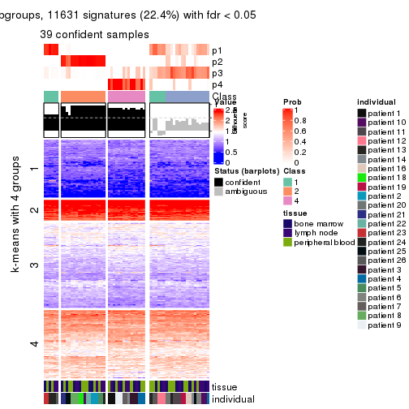</p>

</div>
<div id='tab-ATC-kmeans-get-signatures-no-scale-4'>
<pre><code class="r">get_signatures(res, k = 5, scale_rows = FALSE)
</code></pre>

<p>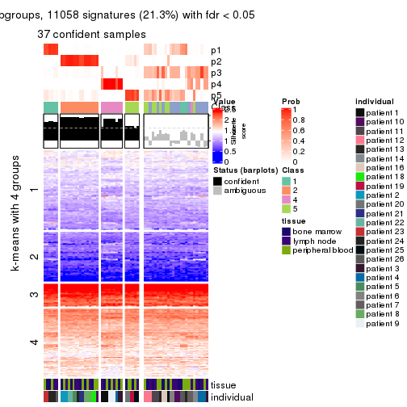</p>

</div>
<div id='tab-ATC-kmeans-get-signatures-no-scale-5'>
<pre><code class="r">get_signatures(res, k = 6, scale_rows = FALSE)
</code></pre>

<p>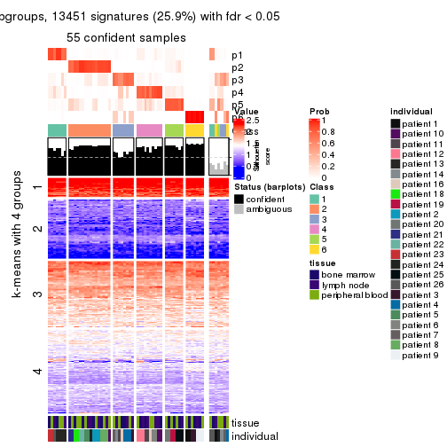</p>

</div>
</div>


Compare the overlap of signatures from different k:

```r
compare_signatures(res)
```

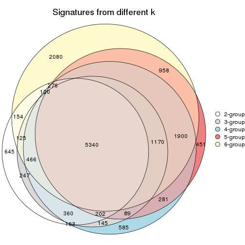

`get_signature()` returns a data frame invisibly. TO get the list of signatures, the function
call should be assigned to a variable explicitly. In following code, if `plot` argument is set
to `FALSE`, no heatmap is plotted while only the differential analysis is performed.

```r
# code only for demonstration
tb = get_signature(res, k = ..., plot = FALSE)
```

An example of the output of `tb` is:

```
#>   which_row         fdr    mean_1    mean_2 scaled_mean_1 scaled_mean_2 km
#> 1        38 0.042760348  8.373488  9.131774    -0.5533452     0.5164555  1
#> 2        40 0.018707592  7.106213  8.469186    -0.6173731     0.5762149  1
#> 3        55 0.019134737 10.221463 11.207825    -0.6159697     0.5749050  1
#> 4        59 0.006059896  5.921854  7.869574    -0.6899429     0.6439467  1
#> 5        60 0.018055526  8.928898 10.211722    -0.6204761     0.5791110  1
#> 6        98 0.009384629 15.714769 14.887706     0.6635654    -0.6193277  2
...
```

The columns in `tb` are:

1. `which_row`: row indices corresponding to the input matrix.
2. `fdr`: FDR for the differential test. 
3. `mean_x`: The mean value in group x.
4. `scaled_mean_x`: The mean value in group x after rows are scaled.
5. `km`: Row groups if k-means clustering is applied to rows.


UMAP plot which shows how samples are separated.


<script>
$( function() {
	$( '#tabs-ATC-kmeans-dimension-reduction' ).tabs();
} );
</script>
<div id='tabs-ATC-kmeans-dimension-reduction'>
<ul>
<li><a href='#tab-ATC-kmeans-dimension-reduction-1'>k = 2</a></li>
<li><a href='#tab-ATC-kmeans-dimension-reduction-2'>k = 3</a></li>
<li><a href='#tab-ATC-kmeans-dimension-reduction-3'>k = 4</a></li>
<li><a href='#tab-ATC-kmeans-dimension-reduction-4'>k = 5</a></li>
<li><a href='#tab-ATC-kmeans-dimension-reduction-5'>k = 6</a></li>
</ul>
<div id='tab-ATC-kmeans-dimension-reduction-1'>
<pre><code class="r">dimension_reduction(res, k = 2, method = &quot;UMAP&quot;)
</code></pre>

<p>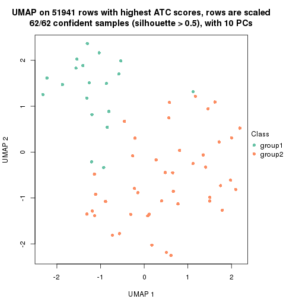</p>

</div>
<div id='tab-ATC-kmeans-dimension-reduction-2'>
<pre><code class="r">dimension_reduction(res, k = 3, method = &quot;UMAP&quot;)
</code></pre>

<p>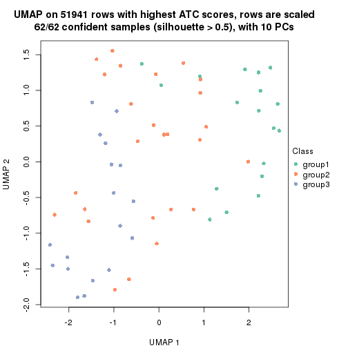</p>

</div>
<div id='tab-ATC-kmeans-dimension-reduction-3'>
<pre><code class="r">dimension_reduction(res, k = 4, method = &quot;UMAP&quot;)
</code></pre>

<p>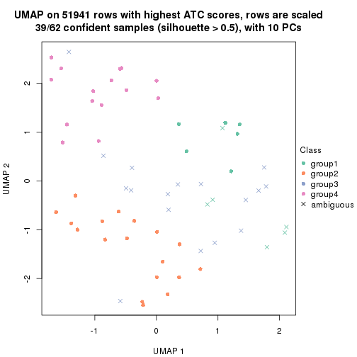</p>

</div>
<div id='tab-ATC-kmeans-dimension-reduction-4'>
<pre><code class="r">dimension_reduction(res, k = 5, method = &quot;UMAP&quot;)
</code></pre>

<p>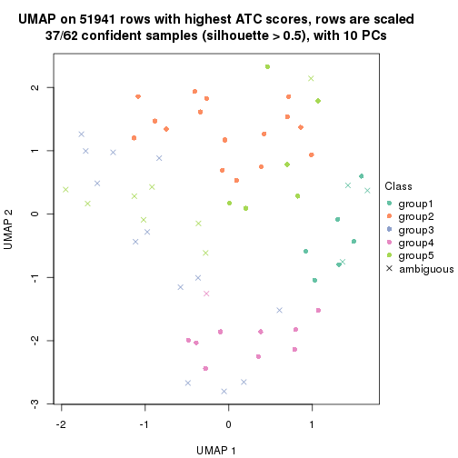</p>

</div>
<div id='tab-ATC-kmeans-dimension-reduction-5'>
<pre><code class="r">dimension_reduction(res, k = 6, method = &quot;UMAP&quot;)
</code></pre>

<p>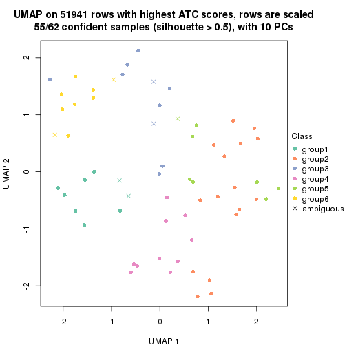</p>

</div>
</div>


Following heatmap shows how subgroups are split when increasing `k`:

```r
collect_classes(res)
```

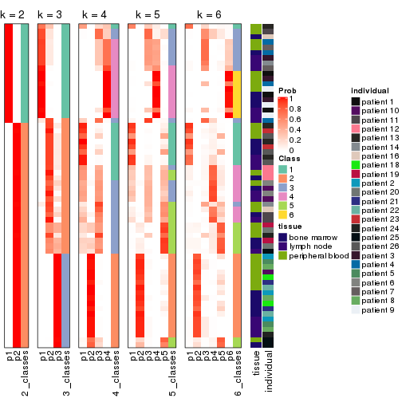


Test correlation between subgroups and known annotations. If the known
annotation is numeric, one-way ANOVA test is applied, and if the known
annotation is discrete, chi-squared contingency table test is applied.

```r
test_to_known_factors(res)
```

```
#>             n tissue(p) individual(p) k
#> ATC:kmeans 62     0.843      7.61e-04 2
#> ATC:kmeans 62     0.973      3.04e-05 3
#> ATC:kmeans 39     0.951      2.61e-05 4
#> ATC:kmeans 37     0.997      2.43e-06 5
#> ATC:kmeans 55     0.985      2.18e-11 6
```


If matrix rows can be associated to genes, consider to use `functional_enrichment(res,
...)` to perform function enrichment for the signature genes. See [this vignette](http://bioconductor.org/packages/devel/bioc/vignettes/cola/inst/doc/functional_enrichment.html) for more detailed explanations.


 

---------------------------------------------------


### ATC:skmeans**


The object with results only for a single top-value method and a single partition method 
can be extracted as:

```r
res = res_list["ATC", "skmeans"]
# you can also extract it by
# res = res_list["ATC:skmeans"]
```

A summary of `res` and all the functions that can be applied to it:

```r
res
```

```
#> A 'ConsensusPartition' object with k = 2, 3, 4, 5, 6.
#>   On a matrix with 51941 rows and 62 columns.
#>   Top rows (1000, 2000, 3000, 4000, 5000) are extracted by 'ATC' method.
#>   Subgroups are detected by 'skmeans' method.
#>   Performed in total 1250 partitions by row resampling.
#>   Best k for subgroups seems to be 4.
#> 
#> Following methods can be applied to this 'ConsensusPartition' object:
#>  [1] "cola_report"             "collect_classes"         "collect_plots"          
#>  [4] "collect_stats"           "colnames"                "compare_signatures"     
#>  [7] "consensus_heatmap"       "dimension_reduction"     "functional_enrichment"  
#> [10] "get_anno_col"            "get_anno"                "get_classes"            
#> [13] "get_consensus"           "get_matrix"              "get_membership"         
#> [16] "get_param"               "get_signatures"          "get_stats"              
#> [19] "is_best_k"               "is_stable_k"             "membership_heatmap"     
#> [22] "ncol"                    "nrow"                    "plot_ecdf"              
#> [25] "rownames"                "select_partition_number" "show"                   
#> [28] "suggest_best_k"          "test_to_known_factors"
```

`collect_plots()` function collects all the plots made from `res` for all `k` (number of partitions)
into one single page to provide an easy and fast comparison between different `k`.

```r
collect_plots(res)
```

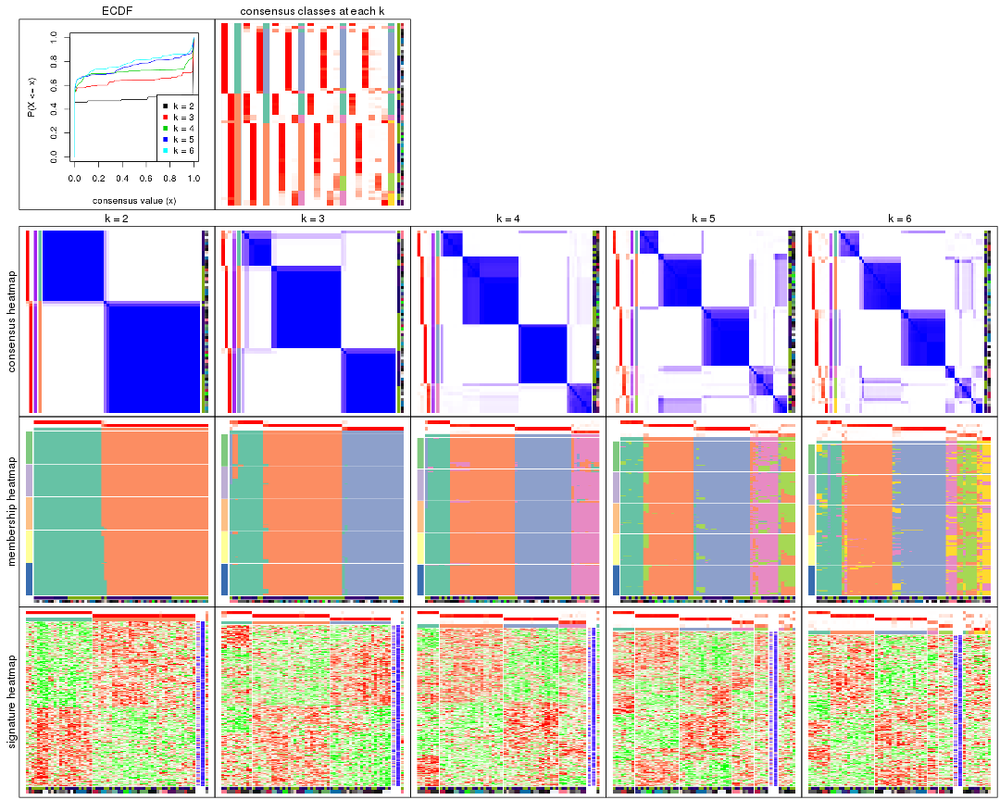

The plots are:

- The first row: a plot of the ECDF (empirical cumulative distribution
  function) curves of the consensus matrix for each `k` and the heatmap of
  predicted classes for each `k`.
- The second row: heatmaps of the consensus matrix for each `k`.
- The third row: heatmaps of the membership matrix for each `k`.
- The fouth row: heatmaps of the signatures for each `k`.

All the plots in panels can be made by individual functions and they are
plotted later in this section.

`select_partition_number()` produces several plots showing different
statistics for choosing "optimized" `k`. There are following statistics:

- ECDF curves of the consensus matrix for each `k`;
- 1-PAC. [The PAC
  score](https://en.wikipedia.org/wiki/Consensus_clustering#Over-interpretation_potential_of_consensus_clustering)
  measures the proportion of the ambiguous subgrouping.
- Mean silhouette score.
- Concordance. The mean probability of fiting the consensus class ids in all
  partitions.
- Area increased. Denote $A_k$ as the area under the ECDF curve for current
  `k`, the area increased is defined as $A_k - A_{k-1}$.
- Rand index. The percent of pairs of samples that are both in a same cluster
  or both are not in a same cluster in the partition of k and k-1.
- Jaccard index. The ratio of pairs of samples are both in a same cluster in
  the partition of k and k-1 and the pairs of samples are both in a same
  cluster in the partition k or k-1.

The detailed explanations of these statistics can be found in [the _cola_
vignette](http://bioconductor.org/packages/devel/bioc/vignettes/cola/inst/doc/cola.html#toc_13).

Generally speaking, lower PAC score, higher mean silhouette score or higher
concordance corresponds to better partition. Rand index and Jaccard index
measure how similar the current partition is compared to partition with `k-1`.
If they are too similar, we won't accept `k` is better than `k-1`.

```r
select_partition_number(res)
```

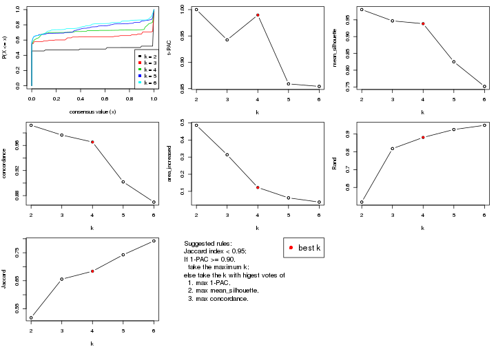

The numeric values for all these statistics can be obtained by `get_stats()`.

```r
get_stats(res)
```

```
#>   k 1-PAC mean_silhouette concordance area_increased  Rand Jaccard
#> 2 2 1.000           0.980       0.992         0.4860 0.518   0.518
#> 3 3 0.943           0.947       0.977         0.3139 0.818   0.656
#> 4 4 0.990           0.938       0.965         0.1223 0.881   0.684
#> 5 5 0.859           0.825       0.902         0.0617 0.925   0.743
#> 6 6 0.854           0.752       0.870         0.0371 0.949   0.792
```

`suggest_best_k()` suggests the best $k$ based on these statistics. The rules are as follows:

- All $k$ with Jaccard index larger than 0.95 are removed because increasing
  $k$ does not provide enough extra information. If all $k$ are removed, it is
  marked as no subgroup is detected.
- For all $k$ with 1-PAC score larger than 0.9, the maximal $k$ is taken as
  the best $k$, and other $k$ are marked as optional $k$.
- If it does not fit the second rule. The $k$ with the maximal vote of the
  highest 1-PAC score, highest mean silhouette, and highest concordance is
  taken as the best $k$.

```r
suggest_best_k(res)
```

```
#> [1] 4
#> attr(,"optional")
#> [1] 2 3
```

There is also optional best $k$ = 2 3 that is worth to check.

Following shows the table of the partitions (You need to click the **show/hide
code output** link to see it). The membership matrix (columns with name `p*`)
is inferred by
[`clue::cl_consensus()`](https://www.rdocumentation.org/link/cl_consensus?package=clue)
function with the `SE` method. Basically the value in the membership matrix
represents the probability to belong to a certain group. The finall class
label for an item is determined with the group with highest probability it
belongs to.

In `get_classes()` function, the entropy is calculated from the membership
matrix and the silhouette score is calculated from the consensus matrix.


<script>
$( function() {
	$( '#tabs-ATC-skmeans-get-classes' ).tabs();
} );
</script>
<div id='tabs-ATC-skmeans-get-classes'>
<ul>
<li><a href='#tab-ATC-skmeans-get-classes-1'>k = 2</a></li>
<li><a href='#tab-ATC-skmeans-get-classes-2'>k = 3</a></li>
<li><a href='#tab-ATC-skmeans-get-classes-3'>k = 4</a></li>
<li><a href='#tab-ATC-skmeans-get-classes-4'>k = 5</a></li>
<li><a href='#tab-ATC-skmeans-get-classes-5'>k = 6</a></li>
</ul>

<div id='tab-ATC-skmeans-get-classes-1'>
<p><a id='tab-ATC-skmeans-get-classes-1-a' style='color:#0366d6' href='#'>show/hide code output</a></p>
<pre><code class="r">cbind(get_classes(res, k = 2), get_membership(res, k = 2))
</code></pre>

<pre><code>#&gt;           class entropy silhouette    p1    p2
#&gt; GSM525314     1   0.000      1.000 1.000 0.000
#&gt; GSM525315     2   0.000      0.987 0.000 1.000
#&gt; GSM525316     1   0.000      1.000 1.000 0.000
#&gt; GSM525317     1   0.000      1.000 1.000 0.000
#&gt; GSM525318     1   0.000      1.000 1.000 0.000
#&gt; GSM525319     2   0.000      0.987 0.000 1.000
#&gt; GSM525320     2   0.000      0.987 0.000 1.000
#&gt; GSM525321     1   0.000      1.000 1.000 0.000
#&gt; GSM525322     2   0.000      0.987 0.000 1.000
#&gt; GSM525323     1   0.000      1.000 1.000 0.000
#&gt; GSM525324     2   0.000      0.987 0.000 1.000
#&gt; GSM525325     1   0.000      1.000 1.000 0.000
#&gt; GSM525326     1   0.000      1.000 1.000 0.000
#&gt; GSM525327     1   0.000      1.000 1.000 0.000
#&gt; GSM525328     2   0.000      0.987 0.000 1.000
#&gt; GSM525329     1   0.000      1.000 1.000 0.000
#&gt; GSM525330     2   0.482      0.878 0.104 0.896
#&gt; GSM525331     2   0.000      0.987 0.000 1.000
#&gt; GSM525332     2   0.000      0.987 0.000 1.000
#&gt; GSM525333     2   0.000      0.987 0.000 1.000
#&gt; GSM525334     2   0.000      0.987 0.000 1.000
#&gt; GSM525335     2   0.000      0.987 0.000 1.000
#&gt; GSM525336     1   0.000      1.000 1.000 0.000
#&gt; GSM525337     1   0.000      1.000 1.000 0.000
#&gt; GSM525338     2   0.000      0.987 0.000 1.000
#&gt; GSM525339     2   0.000      0.987 0.000 1.000
#&gt; GSM525340     1   0.000      1.000 1.000 0.000
#&gt; GSM525341     2   0.000      0.987 0.000 1.000
#&gt; GSM525342     1   0.000      1.000 1.000 0.000
#&gt; GSM525343     1   0.000      1.000 1.000 0.000
#&gt; GSM525344     2   0.000      0.987 0.000 1.000
#&gt; GSM525345     1   0.000      1.000 1.000 0.000
#&gt; GSM525346     2   0.000      0.987 0.000 1.000
#&gt; GSM525347     2   0.000      0.987 0.000 1.000
#&gt; GSM525348     2   0.000      0.987 0.000 1.000
#&gt; GSM525349     2   0.000      0.987 0.000 1.000
#&gt; GSM525350     1   0.000      1.000 1.000 0.000
#&gt; GSM525351     2   0.000      0.987 0.000 1.000
#&gt; GSM525352     2   0.000      0.987 0.000 1.000
#&gt; GSM525353     2   0.000      0.987 0.000 1.000
#&gt; GSM525354     2   0.000      0.987 0.000 1.000
#&gt; GSM525355     2   0.000      0.987 0.000 1.000
#&gt; GSM525356     2   0.000      0.987 0.000 1.000
#&gt; GSM525357     2   0.000      0.987 0.000 1.000
#&gt; GSM525358     2   0.000      0.987 0.000 1.000
#&gt; GSM525359     1   0.000      1.000 1.000 0.000
#&gt; GSM525360     2   0.000      0.987 0.000 1.000
#&gt; GSM525361     1   0.000      1.000 1.000 0.000
#&gt; GSM525362     1   0.000      1.000 1.000 0.000
#&gt; GSM525363     2   0.000      0.987 0.000 1.000
#&gt; GSM525364     2   0.961      0.385 0.384 0.616
#&gt; GSM525365     1   0.000      1.000 1.000 0.000
#&gt; GSM525366     2   0.000      0.987 0.000 1.000
#&gt; GSM525367     1   0.000      1.000 1.000 0.000
#&gt; GSM525368     2   0.000      0.987 0.000 1.000
#&gt; GSM525369     1   0.000      1.000 1.000 0.000
#&gt; GSM525370     2   0.000      0.987 0.000 1.000
#&gt; GSM525371     2   0.000      0.987 0.000 1.000
#&gt; GSM525372     1   0.000      1.000 1.000 0.000
#&gt; GSM525373     2   0.000      0.987 0.000 1.000
#&gt; GSM525374     2   0.000      0.987 0.000 1.000
#&gt; GSM525375     2   0.000      0.987 0.000 1.000
</code></pre>

<script>
$('#tab-ATC-skmeans-get-classes-1-a').parent().next().next().hide();
$('#tab-ATC-skmeans-get-classes-1-a').click(function(){
  $('#tab-ATC-skmeans-get-classes-1-a').parent().next().next().toggle();
  return(false);
});
</script>
</div>

<div id='tab-ATC-skmeans-get-classes-2'>
<p><a id='tab-ATC-skmeans-get-classes-2-a' style='color:#0366d6' href='#'>show/hide code output</a></p>
<pre><code class="r">cbind(get_classes(res, k = 3), get_membership(res, k = 3))
</code></pre>

<pre><code>#&gt;           class entropy silhouette    p1    p2    p3
#&gt; GSM525314     3  0.0000      0.983 0.000 0.000 1.000
#&gt; GSM525315     2  0.0000      0.992 0.000 1.000 0.000
#&gt; GSM525316     3  0.0000      0.983 0.000 0.000 1.000
#&gt; GSM525317     3  0.0000      0.983 0.000 0.000 1.000
#&gt; GSM525318     3  0.0000      0.983 0.000 0.000 1.000
#&gt; GSM525319     2  0.0000      0.992 0.000 1.000 0.000
#&gt; GSM525320     2  0.0000      0.992 0.000 1.000 0.000
#&gt; GSM525321     3  0.0000      0.983 0.000 0.000 1.000
#&gt; GSM525322     2  0.0000      0.992 0.000 1.000 0.000
#&gt; GSM525323     3  0.0000      0.983 0.000 0.000 1.000
#&gt; GSM525324     2  0.0000      0.992 0.000 1.000 0.000
#&gt; GSM525325     3  0.0000      0.983 0.000 0.000 1.000
#&gt; GSM525326     1  0.5785      0.483 0.668 0.000 0.332
#&gt; GSM525327     3  0.4399      0.761 0.188 0.000 0.812
#&gt; GSM525328     1  0.0000      0.908 1.000 0.000 0.000
#&gt; GSM525329     3  0.0000      0.983 0.000 0.000 1.000
#&gt; GSM525330     2  0.0000      0.992 0.000 1.000 0.000
#&gt; GSM525331     2  0.0000      0.992 0.000 1.000 0.000
#&gt; GSM525332     2  0.0000      0.992 0.000 1.000 0.000
#&gt; GSM525333     2  0.0000      0.992 0.000 1.000 0.000
#&gt; GSM525334     2  0.0000      0.992 0.000 1.000 0.000
#&gt; GSM525335     2  0.0000      0.992 0.000 1.000 0.000
#&gt; GSM525336     1  0.0000      0.908 1.000 0.000 0.000
#&gt; GSM525337     3  0.0000      0.983 0.000 0.000 1.000
#&gt; GSM525338     2  0.0000      0.992 0.000 1.000 0.000
#&gt; GSM525339     1  0.0592      0.903 0.988 0.012 0.000
#&gt; GSM525340     3  0.0000      0.983 0.000 0.000 1.000
#&gt; GSM525341     2  0.0000      0.992 0.000 1.000 0.000
#&gt; GSM525342     3  0.0000      0.983 0.000 0.000 1.000
#&gt; GSM525343     3  0.0000      0.983 0.000 0.000 1.000
#&gt; GSM525344     2  0.0000      0.992 0.000 1.000 0.000
#&gt; GSM525345     3  0.0000      0.983 0.000 0.000 1.000
#&gt; GSM525346     2  0.2959      0.884 0.100 0.900 0.000
#&gt; GSM525347     2  0.0000      0.992 0.000 1.000 0.000
#&gt; GSM525348     1  0.5497      0.614 0.708 0.292 0.000
#&gt; GSM525349     1  0.0000      0.908 1.000 0.000 0.000
#&gt; GSM525350     3  0.0000      0.983 0.000 0.000 1.000
#&gt; GSM525351     2  0.0000      0.992 0.000 1.000 0.000
#&gt; GSM525352     2  0.0000      0.992 0.000 1.000 0.000
#&gt; GSM525353     2  0.0000      0.992 0.000 1.000 0.000
#&gt; GSM525354     2  0.0000      0.992 0.000 1.000 0.000
#&gt; GSM525355     2  0.0000      0.992 0.000 1.000 0.000
#&gt; GSM525356     1  0.0000      0.908 1.000 0.000 0.000
#&gt; GSM525357     2  0.0000      0.992 0.000 1.000 0.000
#&gt; GSM525358     1  0.0592      0.903 0.988 0.012 0.000
#&gt; GSM525359     3  0.0000      0.983 0.000 0.000 1.000
#&gt; GSM525360     2  0.0000      0.992 0.000 1.000 0.000
#&gt; GSM525361     3  0.0000      0.983 0.000 0.000 1.000
#&gt; GSM525362     3  0.0000      0.983 0.000 0.000 1.000
#&gt; GSM525363     2  0.0000      0.992 0.000 1.000 0.000
#&gt; GSM525364     1  0.0000      0.908 1.000 0.000 0.000
#&gt; GSM525365     3  0.0000      0.983 0.000 0.000 1.000
#&gt; GSM525366     2  0.0000      0.992 0.000 1.000 0.000
#&gt; GSM525367     3  0.0000      0.983 0.000 0.000 1.000
#&gt; GSM525368     2  0.2959      0.884 0.100 0.900 0.000
#&gt; GSM525369     3  0.3686      0.828 0.140 0.000 0.860
#&gt; GSM525370     1  0.5397      0.633 0.720 0.280 0.000
#&gt; GSM525371     1  0.0000      0.908 1.000 0.000 0.000
#&gt; GSM525372     3  0.0000      0.983 0.000 0.000 1.000
#&gt; GSM525373     2  0.0000      0.992 0.000 1.000 0.000
#&gt; GSM525374     2  0.0000      0.992 0.000 1.000 0.000
#&gt; GSM525375     1  0.0000      0.908 1.000 0.000 0.000
</code></pre>

<script>
$('#tab-ATC-skmeans-get-classes-2-a').parent().next().next().hide();
$('#tab-ATC-skmeans-get-classes-2-a').click(function(){
  $('#tab-ATC-skmeans-get-classes-2-a').parent().next().next().toggle();
  return(false);
});
</script>
</div>

<div id='tab-ATC-skmeans-get-classes-3'>
<p><a id='tab-ATC-skmeans-get-classes-3-a' style='color:#0366d6' href='#'>show/hide code output</a></p>
<pre><code class="r">cbind(get_classes(res, k = 4), get_membership(res, k = 4))
</code></pre>

<pre><code>#&gt;           class entropy silhouette    p1    p2    p3    p4
#&gt; GSM525314     3  0.0000      0.997 0.000 0.000 1.000 0.000
#&gt; GSM525315     2  0.0000      0.977 0.000 1.000 0.000 0.000
#&gt; GSM525316     3  0.0000      0.997 0.000 0.000 1.000 0.000
#&gt; GSM525317     3  0.0000      0.997 0.000 0.000 1.000 0.000
#&gt; GSM525318     3  0.0000      0.997 0.000 0.000 1.000 0.000
#&gt; GSM525319     2  0.0188      0.978 0.000 0.996 0.000 0.004
#&gt; GSM525320     4  0.2760      0.871 0.000 0.128 0.000 0.872
#&gt; GSM525321     3  0.0000      0.997 0.000 0.000 1.000 0.000
#&gt; GSM525322     2  0.0188      0.978 0.000 0.996 0.000 0.004
#&gt; GSM525323     3  0.0000      0.997 0.000 0.000 1.000 0.000
#&gt; GSM525324     2  0.0188      0.978 0.000 0.996 0.000 0.004
#&gt; GSM525325     3  0.0000      0.997 0.000 0.000 1.000 0.000
#&gt; GSM525326     4  0.2867      0.805 0.012 0.000 0.104 0.884
#&gt; GSM525327     1  0.4961      0.191 0.552 0.000 0.448 0.000
#&gt; GSM525328     1  0.0000      0.917 1.000 0.000 0.000 0.000
#&gt; GSM525329     3  0.0000      0.997 0.000 0.000 1.000 0.000
#&gt; GSM525330     4  0.2011      0.897 0.000 0.080 0.000 0.920
#&gt; GSM525331     2  0.0188      0.978 0.000 0.996 0.000 0.004
#&gt; GSM525332     2  0.1637      0.948 0.000 0.940 0.000 0.060
#&gt; GSM525333     2  0.1792      0.943 0.000 0.932 0.000 0.068
#&gt; GSM525334     2  0.0188      0.978 0.000 0.996 0.000 0.004
#&gt; GSM525335     2  0.0188      0.978 0.000 0.996 0.000 0.004
#&gt; GSM525336     1  0.0592      0.912 0.984 0.000 0.000 0.016
#&gt; GSM525337     3  0.1743      0.936 0.000 0.004 0.940 0.056
#&gt; GSM525338     2  0.1302      0.957 0.000 0.956 0.000 0.044
#&gt; GSM525339     1  0.0188      0.917 0.996 0.000 0.000 0.004
#&gt; GSM525340     3  0.0000      0.997 0.000 0.000 1.000 0.000
#&gt; GSM525341     2  0.0000      0.977 0.000 1.000 0.000 0.000
#&gt; GSM525342     3  0.0000      0.997 0.000 0.000 1.000 0.000
#&gt; GSM525343     3  0.0000      0.997 0.000 0.000 1.000 0.000
#&gt; GSM525344     2  0.0188      0.978 0.000 0.996 0.000 0.004
#&gt; GSM525345     3  0.0000      0.997 0.000 0.000 1.000 0.000
#&gt; GSM525346     4  0.2489      0.904 0.020 0.068 0.000 0.912
#&gt; GSM525347     4  0.4624      0.580 0.000 0.340 0.000 0.660
#&gt; GSM525348     4  0.2179      0.904 0.012 0.064 0.000 0.924
#&gt; GSM525349     1  0.0000      0.917 1.000 0.000 0.000 0.000
#&gt; GSM525350     3  0.0000      0.997 0.000 0.000 1.000 0.000
#&gt; GSM525351     2  0.0188      0.978 0.000 0.996 0.000 0.004
#&gt; GSM525352     2  0.1978      0.940 0.004 0.928 0.000 0.068
#&gt; GSM525353     2  0.1792      0.943 0.000 0.932 0.000 0.068
#&gt; GSM525354     2  0.0188      0.978 0.000 0.996 0.000 0.004
#&gt; GSM525355     2  0.0188      0.978 0.000 0.996 0.000 0.004
#&gt; GSM525356     1  0.0592      0.912 0.984 0.000 0.000 0.016
#&gt; GSM525357     2  0.1302      0.957 0.000 0.956 0.000 0.044
#&gt; GSM525358     1  0.0188      0.917 0.996 0.000 0.000 0.004
#&gt; GSM525359     3  0.0000      0.997 0.000 0.000 1.000 0.000
#&gt; GSM525360     2  0.0188      0.978 0.000 0.996 0.000 0.004
#&gt; GSM525361     3  0.0000      0.997 0.000 0.000 1.000 0.000
#&gt; GSM525362     3  0.0000      0.997 0.000 0.000 1.000 0.000
#&gt; GSM525363     2  0.0188      0.978 0.000 0.996 0.000 0.004
#&gt; GSM525364     4  0.2546      0.880 0.060 0.028 0.000 0.912
#&gt; GSM525365     3  0.0000      0.997 0.000 0.000 1.000 0.000
#&gt; GSM525366     2  0.0188      0.978 0.000 0.996 0.000 0.004
#&gt; GSM525367     3  0.0000      0.997 0.000 0.000 1.000 0.000
#&gt; GSM525368     4  0.2489      0.904 0.020 0.068 0.000 0.912
#&gt; GSM525369     4  0.0657      0.867 0.004 0.000 0.012 0.984
#&gt; GSM525370     4  0.2101      0.904 0.012 0.060 0.000 0.928
#&gt; GSM525371     1  0.0469      0.914 0.988 0.000 0.000 0.012
#&gt; GSM525372     3  0.0000      0.997 0.000 0.000 1.000 0.000
#&gt; GSM525373     2  0.0188      0.978 0.000 0.996 0.000 0.004
#&gt; GSM525374     2  0.1792      0.944 0.000 0.932 0.000 0.068
#&gt; GSM525375     1  0.0469      0.914 0.988 0.000 0.000 0.012
</code></pre>

<script>
$('#tab-ATC-skmeans-get-classes-3-a').parent().next().next().hide();
$('#tab-ATC-skmeans-get-classes-3-a').click(function(){
  $('#tab-ATC-skmeans-get-classes-3-a').parent().next().next().toggle();
  return(false);
});
</script>
</div>

<div id='tab-ATC-skmeans-get-classes-4'>
<p><a id='tab-ATC-skmeans-get-classes-4-a' style='color:#0366d6' href='#'>show/hide code output</a></p>
<pre><code class="r">cbind(get_classes(res, k = 5), get_membership(res, k = 5))
</code></pre>

<pre><code>#&gt;           class entropy silhouette    p1    p2    p3    p4    p5
#&gt; GSM525314     3  0.0000     0.9544 0.000 0.000 1.000 0.000 0.000
#&gt; GSM525315     2  0.0290     0.9265 0.000 0.992 0.000 0.000 0.008
#&gt; GSM525316     3  0.0000     0.9544 0.000 0.000 1.000 0.000 0.000
#&gt; GSM525317     3  0.0000     0.9544 0.000 0.000 1.000 0.000 0.000
#&gt; GSM525318     3  0.0000     0.9544 0.000 0.000 1.000 0.000 0.000
#&gt; GSM525319     2  0.0000     0.9303 0.000 1.000 0.000 0.000 0.000
#&gt; GSM525320     4  0.6032     0.4188 0.000 0.368 0.000 0.508 0.124
#&gt; GSM525321     3  0.0000     0.9544 0.000 0.000 1.000 0.000 0.000
#&gt; GSM525322     2  0.0000     0.9303 0.000 1.000 0.000 0.000 0.000
#&gt; GSM525323     3  0.0000     0.9544 0.000 0.000 1.000 0.000 0.000
#&gt; GSM525324     2  0.0404     0.9199 0.000 0.988 0.000 0.000 0.012
#&gt; GSM525325     3  0.2127     0.8811 0.000 0.000 0.892 0.000 0.108
#&gt; GSM525326     4  0.2734     0.7514 0.008 0.000 0.052 0.892 0.048
#&gt; GSM525327     3  0.4287     0.1582 0.460 0.000 0.540 0.000 0.000
#&gt; GSM525328     1  0.0162     0.9728 0.996 0.000 0.000 0.000 0.004
#&gt; GSM525329     3  0.2773     0.8280 0.000 0.000 0.836 0.000 0.164
#&gt; GSM525330     4  0.5891     0.5749 0.000 0.120 0.000 0.552 0.328
#&gt; GSM525331     2  0.0290     0.9280 0.000 0.992 0.000 0.000 0.008
#&gt; GSM525332     5  0.4201     0.6929 0.000 0.408 0.000 0.000 0.592
#&gt; GSM525333     5  0.3999     0.7624 0.000 0.344 0.000 0.000 0.656
#&gt; GSM525334     2  0.0162     0.9296 0.000 0.996 0.000 0.000 0.004
#&gt; GSM525335     2  0.0162     0.9296 0.000 0.996 0.000 0.000 0.004
#&gt; GSM525336     1  0.0771     0.9698 0.976 0.000 0.000 0.004 0.020
#&gt; GSM525337     5  0.3612     0.2721 0.000 0.000 0.268 0.000 0.732
#&gt; GSM525338     2  0.4060    -0.0365 0.000 0.640 0.000 0.000 0.360
#&gt; GSM525339     1  0.0794     0.9690 0.972 0.000 0.000 0.000 0.028
#&gt; GSM525340     3  0.0000     0.9544 0.000 0.000 1.000 0.000 0.000
#&gt; GSM525341     2  0.0162     0.9285 0.000 0.996 0.000 0.000 0.004
#&gt; GSM525342     3  0.0000     0.9544 0.000 0.000 1.000 0.000 0.000
#&gt; GSM525343     3  0.0000     0.9544 0.000 0.000 1.000 0.000 0.000
#&gt; GSM525344     2  0.0000     0.9303 0.000 1.000 0.000 0.000 0.000
#&gt; GSM525345     3  0.0000     0.9544 0.000 0.000 1.000 0.000 0.000
#&gt; GSM525346     4  0.2787     0.7837 0.004 0.004 0.000 0.856 0.136
#&gt; GSM525347     4  0.4940     0.3079 0.000 0.392 0.000 0.576 0.032
#&gt; GSM525348     4  0.1883     0.7766 0.008 0.012 0.000 0.932 0.048
#&gt; GSM525349     1  0.0290     0.9727 0.992 0.000 0.000 0.000 0.008
#&gt; GSM525350     3  0.2127     0.8811 0.000 0.000 0.892 0.000 0.108
#&gt; GSM525351     2  0.0162     0.9296 0.000 0.996 0.000 0.000 0.004
#&gt; GSM525352     5  0.3966     0.7616 0.000 0.336 0.000 0.000 0.664
#&gt; GSM525353     5  0.3983     0.7636 0.000 0.340 0.000 0.000 0.660
#&gt; GSM525354     2  0.0510     0.9188 0.000 0.984 0.000 0.000 0.016
#&gt; GSM525355     2  0.0162     0.9296 0.000 0.996 0.000 0.000 0.004
#&gt; GSM525356     1  0.0865     0.9691 0.972 0.000 0.000 0.004 0.024
#&gt; GSM525357     2  0.3966     0.0859 0.000 0.664 0.000 0.000 0.336
#&gt; GSM525358     1  0.1270     0.9560 0.948 0.000 0.000 0.000 0.052
#&gt; GSM525359     3  0.0162     0.9527 0.000 0.000 0.996 0.000 0.004
#&gt; GSM525360     2  0.0000     0.9303 0.000 1.000 0.000 0.000 0.000
#&gt; GSM525361     3  0.0162     0.9527 0.000 0.000 0.996 0.000 0.004
#&gt; GSM525362     3  0.0404     0.9479 0.000 0.000 0.988 0.000 0.012
#&gt; GSM525363     2  0.0000     0.9303 0.000 1.000 0.000 0.000 0.000
#&gt; GSM525364     4  0.2843     0.7813 0.008 0.000 0.000 0.848 0.144
#&gt; GSM525365     3  0.0000     0.9544 0.000 0.000 1.000 0.000 0.000
#&gt; GSM525366     2  0.0162     0.9274 0.000 0.996 0.000 0.000 0.004
#&gt; GSM525367     3  0.0000     0.9544 0.000 0.000 1.000 0.000 0.000
#&gt; GSM525368     4  0.2787     0.7837 0.004 0.004 0.000 0.856 0.136
#&gt; GSM525369     4  0.1124     0.7816 0.004 0.000 0.000 0.960 0.036
#&gt; GSM525370     4  0.1644     0.7766 0.008 0.004 0.000 0.940 0.048
#&gt; GSM525371     1  0.1408     0.9562 0.948 0.000 0.000 0.008 0.044
#&gt; GSM525372     3  0.0162     0.9526 0.000 0.000 0.996 0.000 0.004
#&gt; GSM525373     2  0.0000     0.9303 0.000 1.000 0.000 0.000 0.000
#&gt; GSM525374     5  0.4559     0.5285 0.000 0.480 0.000 0.008 0.512
#&gt; GSM525375     1  0.1357     0.9602 0.948 0.000 0.000 0.004 0.048
</code></pre>

<script>
$('#tab-ATC-skmeans-get-classes-4-a').parent().next().next().hide();
$('#tab-ATC-skmeans-get-classes-4-a').click(function(){
  $('#tab-ATC-skmeans-get-classes-4-a').parent().next().next().toggle();
  return(false);
});
</script>
</div>

<div id='tab-ATC-skmeans-get-classes-5'>
<p><a id='tab-ATC-skmeans-get-classes-5-a' style='color:#0366d6' href='#'>show/hide code output</a></p>
<pre><code class="r">cbind(get_classes(res, k = 6), get_membership(res, k = 6))
</code></pre>

<pre><code>#&gt;           class entropy silhouette    p1    p2    p3    p4    p5    p6
#&gt; GSM525314     3  0.0000     0.9468 0.000 0.000 1.000 0.000 0.000 0.000
#&gt; GSM525315     2  0.1003     0.8898 0.000 0.964 0.000 0.020 0.016 0.000
#&gt; GSM525316     3  0.0000     0.9468 0.000 0.000 1.000 0.000 0.000 0.000
#&gt; GSM525317     3  0.0405     0.9453 0.000 0.000 0.988 0.008 0.004 0.000
#&gt; GSM525318     3  0.0405     0.9453 0.000 0.000 0.988 0.008 0.004 0.000
#&gt; GSM525319     2  0.0000     0.9040 0.000 1.000 0.000 0.000 0.000 0.000
#&gt; GSM525320     6  0.4648     0.2310 0.000 0.408 0.000 0.044 0.000 0.548
#&gt; GSM525321     3  0.0405     0.9453 0.000 0.000 0.988 0.008 0.004 0.000
#&gt; GSM525322     2  0.0777     0.8931 0.000 0.972 0.000 0.024 0.004 0.000
#&gt; GSM525323     3  0.0000     0.9468 0.000 0.000 1.000 0.000 0.000 0.000
#&gt; GSM525324     2  0.1218     0.8826 0.000 0.956 0.000 0.028 0.004 0.012
#&gt; GSM525325     3  0.4136     0.7172 0.000 0.000 0.732 0.192 0.076 0.000
#&gt; GSM525326     4  0.4426     0.8848 0.008 0.000 0.016 0.616 0.004 0.356
#&gt; GSM525327     1  0.3868     0.0129 0.508 0.000 0.492 0.000 0.000 0.000
#&gt; GSM525328     1  0.0260     0.8149 0.992 0.000 0.000 0.000 0.000 0.008
#&gt; GSM525329     3  0.5091     0.5997 0.000 0.000 0.640 0.220 0.136 0.004
#&gt; GSM525330     6  0.6846     0.1685 0.000 0.068 0.000 0.364 0.180 0.388
#&gt; GSM525331     2  0.0935     0.8911 0.000 0.964 0.000 0.032 0.004 0.000
#&gt; GSM525332     5  0.2700     0.7264 0.004 0.156 0.000 0.004 0.836 0.000
#&gt; GSM525333     5  0.3586     0.7192 0.000 0.124 0.000 0.080 0.796 0.000
#&gt; GSM525334     2  0.0767     0.8983 0.000 0.976 0.000 0.012 0.004 0.008
#&gt; GSM525335     2  0.0291     0.9026 0.000 0.992 0.000 0.004 0.004 0.000
#&gt; GSM525336     1  0.1285     0.8082 0.944 0.000 0.000 0.052 0.000 0.004
#&gt; GSM525337     5  0.4769     0.3419 0.000 0.000 0.092 0.264 0.644 0.000
#&gt; GSM525338     5  0.4444     0.3516 0.000 0.436 0.000 0.028 0.536 0.000
#&gt; GSM525339     1  0.3207     0.7695 0.828 0.000 0.000 0.044 0.124 0.004
#&gt; GSM525340     3  0.0000     0.9468 0.000 0.000 1.000 0.000 0.000 0.000
#&gt; GSM525341     2  0.0146     0.9032 0.000 0.996 0.000 0.000 0.004 0.000
#&gt; GSM525342     3  0.0000     0.9468 0.000 0.000 1.000 0.000 0.000 0.000
#&gt; GSM525343     3  0.0405     0.9453 0.000 0.000 0.988 0.008 0.004 0.000
#&gt; GSM525344     2  0.0000     0.9040 0.000 1.000 0.000 0.000 0.000 0.000
#&gt; GSM525345     3  0.0000     0.9468 0.000 0.000 1.000 0.000 0.000 0.000
#&gt; GSM525346     6  0.0146     0.4532 0.004 0.000 0.000 0.000 0.000 0.996
#&gt; GSM525347     2  0.6879    -0.2711 0.000 0.392 0.000 0.280 0.052 0.276
#&gt; GSM525348     4  0.4203     0.8997 0.008 0.004 0.000 0.608 0.004 0.376
#&gt; GSM525349     1  0.0260     0.8149 0.992 0.000 0.000 0.000 0.000 0.008
#&gt; GSM525350     3  0.4136     0.7172 0.000 0.000 0.732 0.192 0.076 0.000
#&gt; GSM525351     2  0.0508     0.9021 0.000 0.984 0.000 0.012 0.004 0.000
#&gt; GSM525352     5  0.2243     0.7240 0.004 0.112 0.000 0.004 0.880 0.000
#&gt; GSM525353     5  0.3534     0.7243 0.000 0.124 0.000 0.076 0.800 0.000
#&gt; GSM525354     2  0.0622     0.8971 0.000 0.980 0.000 0.012 0.008 0.000
#&gt; GSM525355     2  0.0291     0.9026 0.000 0.992 0.000 0.004 0.004 0.000
#&gt; GSM525356     1  0.1285     0.8082 0.944 0.000 0.000 0.052 0.000 0.004
#&gt; GSM525357     2  0.4408    -0.3401 0.000 0.488 0.000 0.024 0.488 0.000
#&gt; GSM525358     1  0.3447     0.7541 0.804 0.000 0.000 0.044 0.148 0.004
#&gt; GSM525359     3  0.0000     0.9468 0.000 0.000 1.000 0.000 0.000 0.000
#&gt; GSM525360     2  0.0000     0.9040 0.000 1.000 0.000 0.000 0.000 0.000
#&gt; GSM525361     3  0.0260     0.9455 0.000 0.000 0.992 0.008 0.000 0.000
#&gt; GSM525362     3  0.1116     0.9276 0.000 0.000 0.960 0.008 0.004 0.028
#&gt; GSM525363     2  0.0000     0.9040 0.000 1.000 0.000 0.000 0.000 0.000
#&gt; GSM525364     6  0.0260     0.4533 0.008 0.000 0.000 0.000 0.000 0.992
#&gt; GSM525365     3  0.0291     0.9458 0.000 0.000 0.992 0.004 0.004 0.000
#&gt; GSM525366     2  0.0260     0.9015 0.000 0.992 0.000 0.000 0.000 0.008
#&gt; GSM525367     3  0.0000     0.9468 0.000 0.000 1.000 0.000 0.000 0.000
#&gt; GSM525368     6  0.0146     0.4532 0.004 0.000 0.000 0.000 0.000 0.996
#&gt; GSM525369     4  0.4394     0.7240 0.004 0.000 0.000 0.496 0.016 0.484
#&gt; GSM525370     4  0.4079     0.9003 0.008 0.000 0.000 0.608 0.004 0.380
#&gt; GSM525371     1  0.2402     0.7629 0.856 0.000 0.000 0.000 0.004 0.140
#&gt; GSM525372     3  0.0520     0.9438 0.000 0.000 0.984 0.008 0.008 0.000
#&gt; GSM525373     2  0.0000     0.9040 0.000 1.000 0.000 0.000 0.000 0.000
#&gt; GSM525374     5  0.4740     0.6258 0.000 0.276 0.000 0.036 0.660 0.028
#&gt; GSM525375     1  0.3450     0.7511 0.808 0.000 0.000 0.032 0.012 0.148
</code></pre>

<script>
$('#tab-ATC-skmeans-get-classes-5-a').parent().next().next().hide();
$('#tab-ATC-skmeans-get-classes-5-a').click(function(){
  $('#tab-ATC-skmeans-get-classes-5-a').parent().next().next().toggle();
  return(false);
});
</script>
</div>
</div>

Heatmaps for the consensus matrix. It visualizes the probability of two
samples to be in a same group.


<script>
$( function() {
	$( '#tabs-ATC-skmeans-consensus-heatmap' ).tabs();
} );
</script>
<div id='tabs-ATC-skmeans-consensus-heatmap'>
<ul>
<li><a href='#tab-ATC-skmeans-consensus-heatmap-1'>k = 2</a></li>
<li><a href='#tab-ATC-skmeans-consensus-heatmap-2'>k = 3</a></li>
<li><a href='#tab-ATC-skmeans-consensus-heatmap-3'>k = 4</a></li>
<li><a href='#tab-ATC-skmeans-consensus-heatmap-4'>k = 5</a></li>
<li><a href='#tab-ATC-skmeans-consensus-heatmap-5'>k = 6</a></li>
</ul>
<div id='tab-ATC-skmeans-consensus-heatmap-1'>
<pre><code class="r">consensus_heatmap(res, k = 2)
</code></pre>

<p>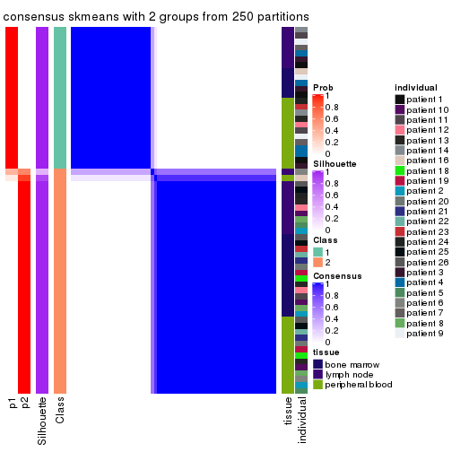</p>

</div>
<div id='tab-ATC-skmeans-consensus-heatmap-2'>
<pre><code class="r">consensus_heatmap(res, k = 3)
</code></pre>

<p>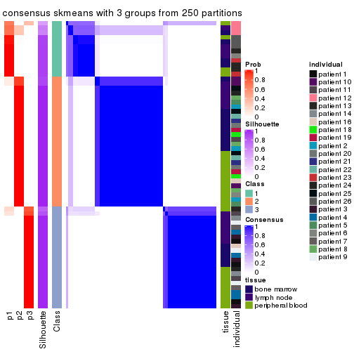</p>

</div>
<div id='tab-ATC-skmeans-consensus-heatmap-3'>
<pre><code class="r">consensus_heatmap(res, k = 4)
</code></pre>

<p></p>

</div>
<div id='tab-ATC-skmeans-consensus-heatmap-4'>
<pre><code class="r">consensus_heatmap(res, k = 5)
</code></pre>

<p>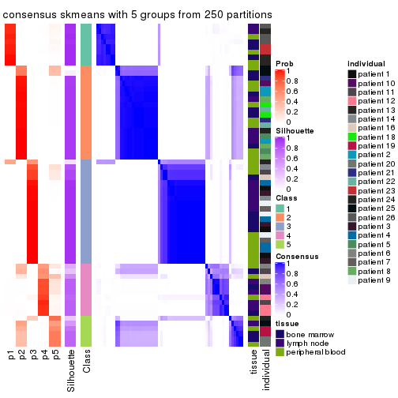</p>

</div>
<div id='tab-ATC-skmeans-consensus-heatmap-5'>
<pre><code class="r">consensus_heatmap(res, k = 6)
</code></pre>

<p>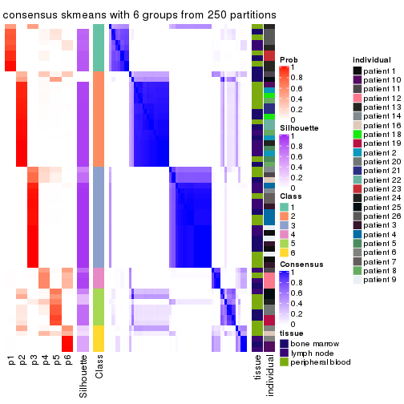</p>

</div>
</div>

Heatmaps for the membership of samples in all partitions to see how consistent they are:


<script>
$( function() {
	$( '#tabs-ATC-skmeans-membership-heatmap' ).tabs();
} );
</script>
<div id='tabs-ATC-skmeans-membership-heatmap'>
<ul>
<li><a href='#tab-ATC-skmeans-membership-heatmap-1'>k = 2</a></li>
<li><a href='#tab-ATC-skmeans-membership-heatmap-2'>k = 3</a></li>
<li><a href='#tab-ATC-skmeans-membership-heatmap-3'>k = 4</a></li>
<li><a href='#tab-ATC-skmeans-membership-heatmap-4'>k = 5</a></li>
<li><a href='#tab-ATC-skmeans-membership-heatmap-5'>k = 6</a></li>
</ul>
<div id='tab-ATC-skmeans-membership-heatmap-1'>
<pre><code class="r">membership_heatmap(res, k = 2)
</code></pre>

<p>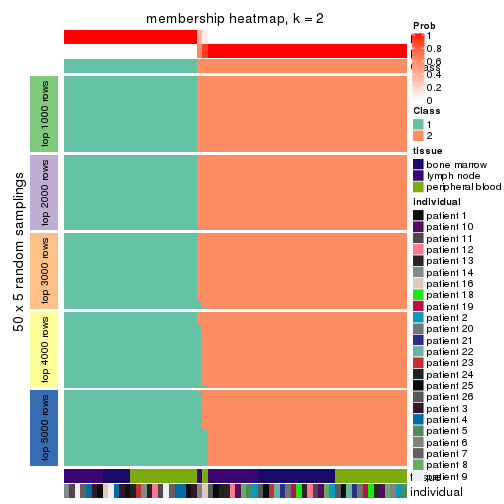</p>

</div>
<div id='tab-ATC-skmeans-membership-heatmap-2'>
<pre><code class="r">membership_heatmap(res, k = 3)
</code></pre>

<p>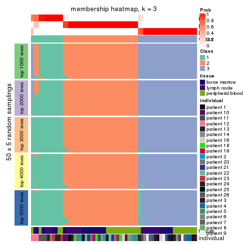</p>

</div>
<div id='tab-ATC-skmeans-membership-heatmap-3'>
<pre><code class="r">membership_heatmap(res, k = 4)
</code></pre>

<p>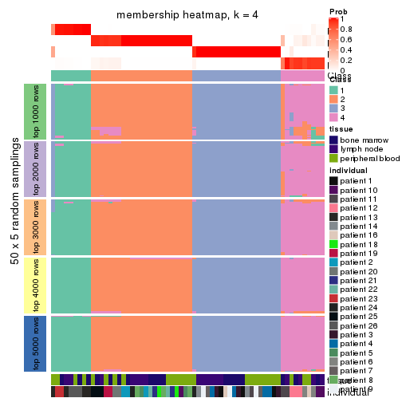</p>

</div>
<div id='tab-ATC-skmeans-membership-heatmap-4'>
<pre><code class="r">membership_heatmap(res, k = 5)
</code></pre>

<p>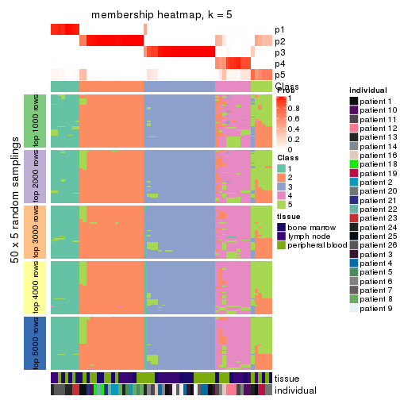</p>

</div>
<div id='tab-ATC-skmeans-membership-heatmap-5'>
<pre><code class="r">membership_heatmap(res, k = 6)
</code></pre>

<p>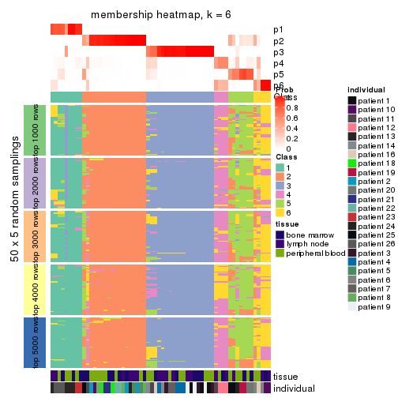</p>

</div>
</div>

As soon as we have had the classes for columns, we can look for signatures
which are significantly different between classes which can be candidate marks
for certain classes. Following are the heatmaps for signatures.


Signature heatmaps where rows are scaled:


<script>
$( function() {
	$( '#tabs-ATC-skmeans-get-signatures' ).tabs();
} );
</script>
<div id='tabs-ATC-skmeans-get-signatures'>
<ul>
<li><a href='#tab-ATC-skmeans-get-signatures-1'>k = 2</a></li>
<li><a href='#tab-ATC-skmeans-get-signatures-2'>k = 3</a></li>
<li><a href='#tab-ATC-skmeans-get-signatures-3'>k = 4</a></li>
<li><a href='#tab-ATC-skmeans-get-signatures-4'>k = 5</a></li>
<li><a href='#tab-ATC-skmeans-get-signatures-5'>k = 6</a></li>
</ul>
<div id='tab-ATC-skmeans-get-signatures-1'>
<pre><code class="r">get_signatures(res, k = 2)
</code></pre>

<p>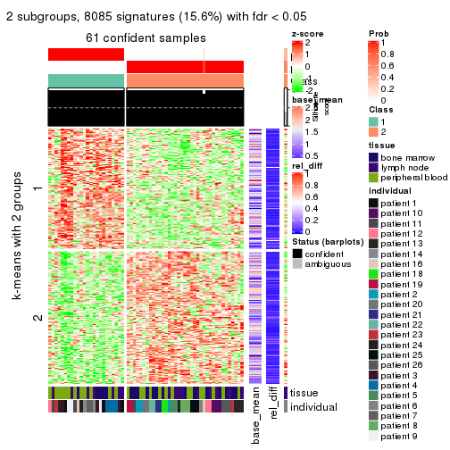</p>

</div>
<div id='tab-ATC-skmeans-get-signatures-2'>
<pre><code class="r">get_signatures(res, k = 3)
</code></pre>

<p>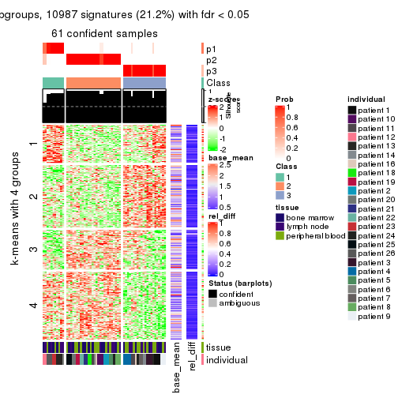</p>

</div>
<div id='tab-ATC-skmeans-get-signatures-3'>
<pre><code class="r">get_signatures(res, k = 4)
</code></pre>

<p>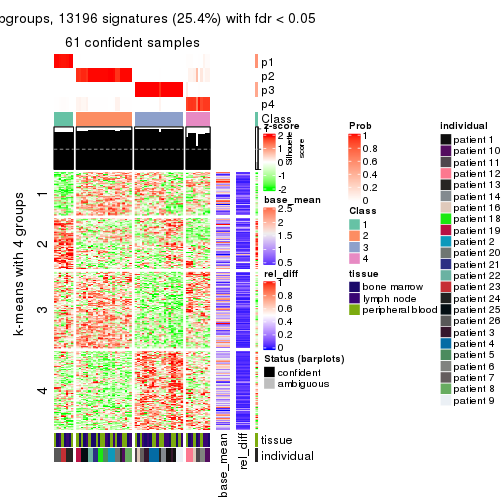</p>

</div>
<div id='tab-ATC-skmeans-get-signatures-4'>
<pre><code class="r">get_signatures(res, k = 5)
</code></pre>

<p>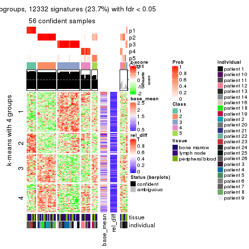</p>

</div>
<div id='tab-ATC-skmeans-get-signatures-5'>
<pre><code class="r">get_signatures(res, k = 6)
</code></pre>

<p>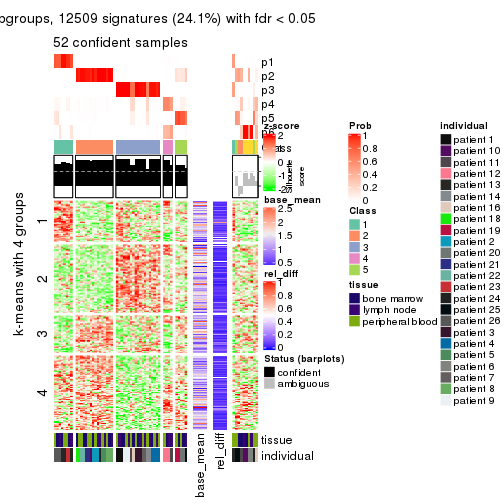</p>

</div>
</div>


Signature heatmaps where rows are not scaled:


<script>
$( function() {
	$( '#tabs-ATC-skmeans-get-signatures-no-scale' ).tabs();
} );
</script>
<div id='tabs-ATC-skmeans-get-signatures-no-scale'>
<ul>
<li><a href='#tab-ATC-skmeans-get-signatures-no-scale-1'>k = 2</a></li>
<li><a href='#tab-ATC-skmeans-get-signatures-no-scale-2'>k = 3</a></li>
<li><a href='#tab-ATC-skmeans-get-signatures-no-scale-3'>k = 4</a></li>
<li><a href='#tab-ATC-skmeans-get-signatures-no-scale-4'>k = 5</a></li>
<li><a href='#tab-ATC-skmeans-get-signatures-no-scale-5'>k = 6</a></li>
</ul>
<div id='tab-ATC-skmeans-get-signatures-no-scale-1'>
<pre><code class="r">get_signatures(res, k = 2, scale_rows = FALSE)
</code></pre>

<p>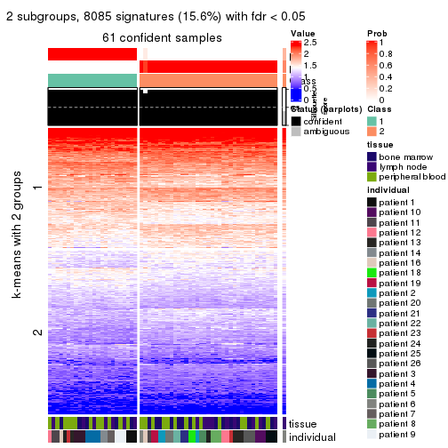</p>

</div>
<div id='tab-ATC-skmeans-get-signatures-no-scale-2'>
<pre><code class="r">get_signatures(res, k = 3, scale_rows = FALSE)
</code></pre>

<p>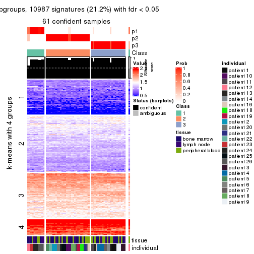</p>

</div>
<div id='tab-ATC-skmeans-get-signatures-no-scale-3'>
<pre><code class="r">get_signatures(res, k = 4, scale_rows = FALSE)
</code></pre>

<p>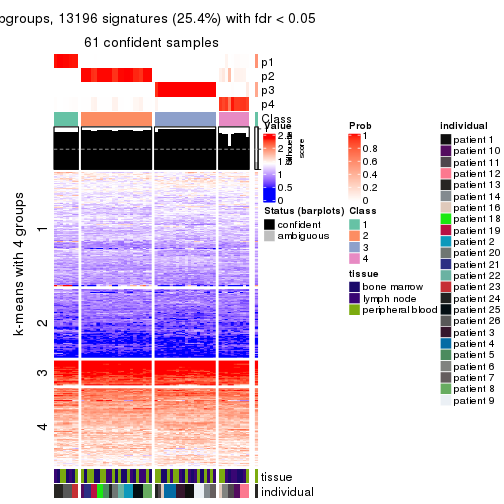</p>

</div>
<div id='tab-ATC-skmeans-get-signatures-no-scale-4'>
<pre><code class="r">get_signatures(res, k = 5, scale_rows = FALSE)
</code></pre>

<p>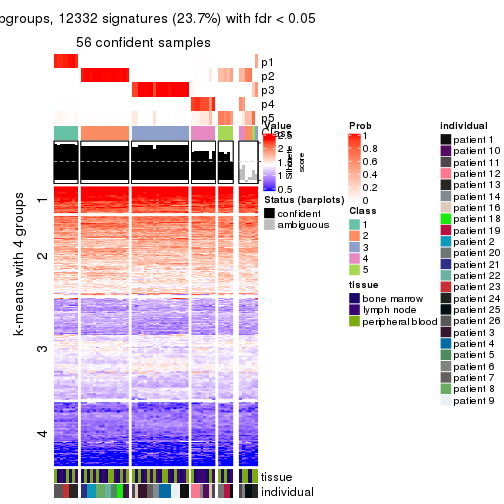</p>

</div>
<div id='tab-ATC-skmeans-get-signatures-no-scale-5'>
<pre><code class="r">get_signatures(res, k = 6, scale_rows = FALSE)
</code></pre>

<p>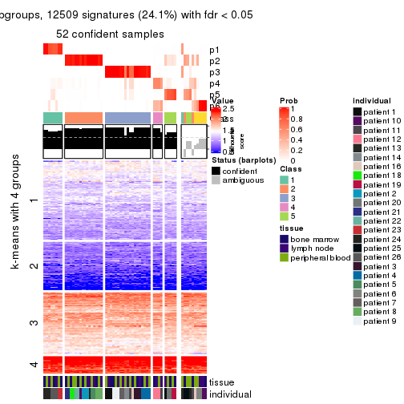</p>

</div>
</div>


Compare the overlap of signatures from different k:

```r
compare_signatures(res)
```

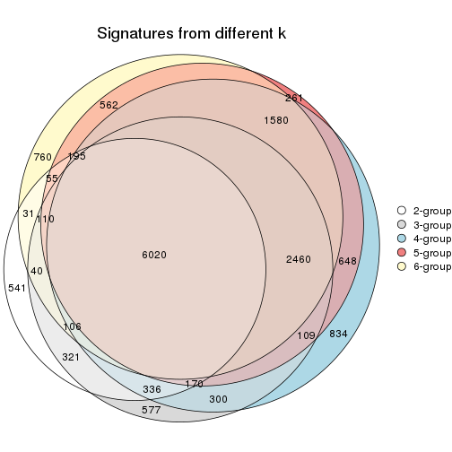

`get_signature()` returns a data frame invisibly. TO get the list of signatures, the function
call should be assigned to a variable explicitly. In following code, if `plot` argument is set
to `FALSE`, no heatmap is plotted while only the differential analysis is performed.

```r
# code only for demonstration
tb = get_signature(res, k = ..., plot = FALSE)
```

An example of the output of `tb` is:

```
#>   which_row         fdr    mean_1    mean_2 scaled_mean_1 scaled_mean_2 km
#> 1        38 0.042760348  8.373488  9.131774    -0.5533452     0.5164555  1
#> 2        40 0.018707592  7.106213  8.469186    -0.6173731     0.5762149  1
#> 3        55 0.019134737 10.221463 11.207825    -0.6159697     0.5749050  1
#> 4        59 0.006059896  5.921854  7.869574    -0.6899429     0.6439467  1
#> 5        60 0.018055526  8.928898 10.211722    -0.6204761     0.5791110  1
#> 6        98 0.009384629 15.714769 14.887706     0.6635654    -0.6193277  2
...
```

The columns in `tb` are:

1. `which_row`: row indices corresponding to the input matrix.
2. `fdr`: FDR for the differential test. 
3. `mean_x`: The mean value in group x.
4. `scaled_mean_x`: The mean value in group x after rows are scaled.
5. `km`: Row groups if k-means clustering is applied to rows.


UMAP plot which shows how samples are separated.


<script>
$( function() {
	$( '#tabs-ATC-skmeans-dimension-reduction' ).tabs();
} );
</script>
<div id='tabs-ATC-skmeans-dimension-reduction'>
<ul>
<li><a href='#tab-ATC-skmeans-dimension-reduction-1'>k = 2</a></li>
<li><a href='#tab-ATC-skmeans-dimension-reduction-2'>k = 3</a></li>
<li><a href='#tab-ATC-skmeans-dimension-reduction-3'>k = 4</a></li>
<li><a href='#tab-ATC-skmeans-dimension-reduction-4'>k = 5</a></li>
<li><a href='#tab-ATC-skmeans-dimension-reduction-5'>k = 6</a></li>
</ul>
<div id='tab-ATC-skmeans-dimension-reduction-1'>
<pre><code class="r">dimension_reduction(res, k = 2, method = &quot;UMAP&quot;)
</code></pre>

<p>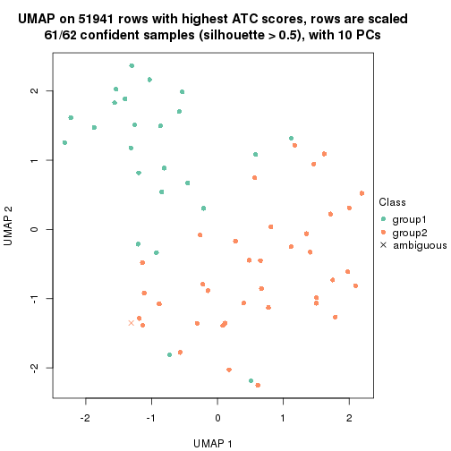</p>

</div>
<div id='tab-ATC-skmeans-dimension-reduction-2'>
<pre><code class="r">dimension_reduction(res, k = 3, method = &quot;UMAP&quot;)
</code></pre>

<p>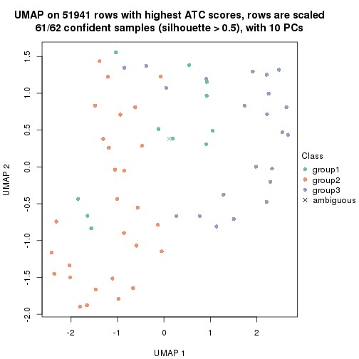</p>

</div>
<div id='tab-ATC-skmeans-dimension-reduction-3'>
<pre><code class="r">dimension_reduction(res, k = 4, method = &quot;UMAP&quot;)
</code></pre>

<p>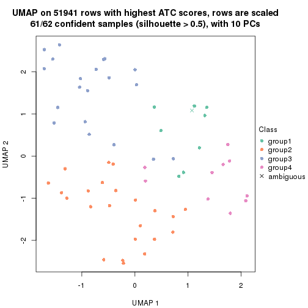</p>

</div>
<div id='tab-ATC-skmeans-dimension-reduction-4'>
<pre><code class="r">dimension_reduction(res, k = 5, method = &quot;UMAP&quot;)
</code></pre>

<p>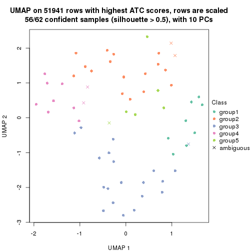</p>

</div>
<div id='tab-ATC-skmeans-dimension-reduction-5'>
<pre><code class="r">dimension_reduction(res, k = 6, method = &quot;UMAP&quot;)
</code></pre>

<p>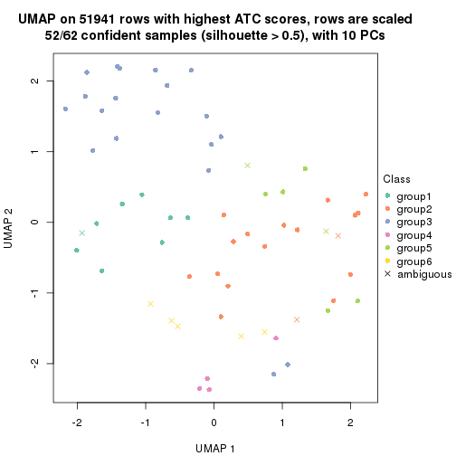</p>

</div>
</div>


Following heatmap shows how subgroups are split when increasing `k`:

```r
collect_classes(res)
```

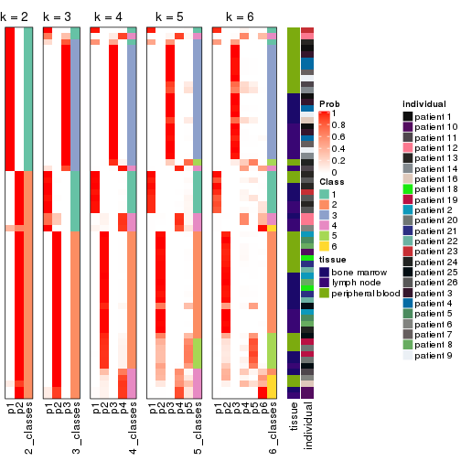


Test correlation between subgroups and known annotations. If the known
annotation is numeric, one-way ANOVA test is applied, and if the known
annotation is discrete, chi-squared contingency table test is applied.

```r
test_to_known_factors(res)
```

```
#>              n tissue(p) individual(p) k
#> ATC:skmeans 61     0.370      3.00e-03 2
#> ATC:skmeans 61     0.691      2.47e-06 3
#> ATC:skmeans 61     0.939      1.17e-09 4
#> ATC:skmeans 56     0.964      7.60e-11 5
#> ATC:skmeans 52     0.990      1.03e-10 6
```


If matrix rows can be associated to genes, consider to use `functional_enrichment(res,
...)` to perform function enrichment for the signature genes. See [this vignette](http://bioconductor.org/packages/devel/bioc/vignettes/cola/inst/doc/functional_enrichment.html) for more detailed explanations.


 

---------------------------------------------------


### ATC:pam*


The object with results only for a single top-value method and a single partition method 
can be extracted as:

```r
res = res_list["ATC", "pam"]
# you can also extract it by
# res = res_list["ATC:pam"]
```

A summary of `res` and all the functions that can be applied to it:

```r
res
```

```
#> A 'ConsensusPartition' object with k = 2, 3, 4, 5, 6.
#>   On a matrix with 51941 rows and 62 columns.
#>   Top rows (1000, 2000, 3000, 4000, 5000) are extracted by 'ATC' method.
#>   Subgroups are detected by 'pam' method.
#>   Performed in total 1250 partitions by row resampling.
#>   Best k for subgroups seems to be 4.
#> 
#> Following methods can be applied to this 'ConsensusPartition' object:
#>  [1] "cola_report"             "collect_classes"         "collect_plots"          
#>  [4] "collect_stats"           "colnames"                "compare_signatures"     
#>  [7] "consensus_heatmap"       "dimension_reduction"     "functional_enrichment"  
#> [10] "get_anno_col"            "get_anno"                "get_classes"            
#> [13] "get_consensus"           "get_matrix"              "get_membership"         
#> [16] "get_param"               "get_signatures"          "get_stats"              
#> [19] "is_best_k"               "is_stable_k"             "membership_heatmap"     
#> [22] "ncol"                    "nrow"                    "plot_ecdf"              
#> [25] "rownames"                "select_partition_number" "show"                   
#> [28] "suggest_best_k"          "test_to_known_factors"
```

`collect_plots()` function collects all the plots made from `res` for all `k` (number of partitions)
into one single page to provide an easy and fast comparison between different `k`.

```r
collect_plots(res)
```

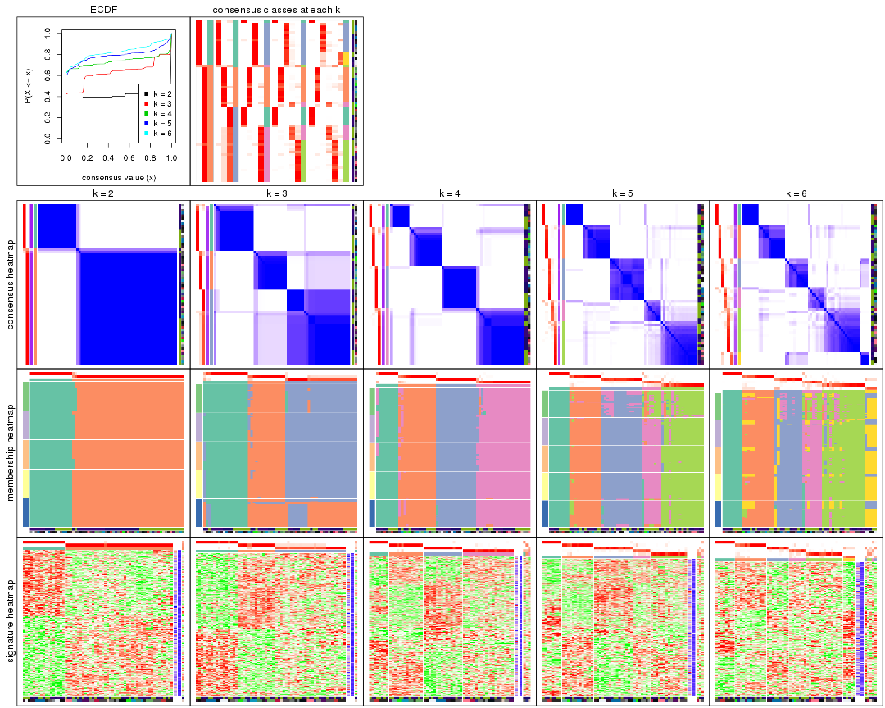

The plots are:

- The first row: a plot of the ECDF (empirical cumulative distribution
  function) curves of the consensus matrix for each `k` and the heatmap of
  predicted classes for each `k`.
- The second row: heatmaps of the consensus matrix for each `k`.
- The third row: heatmaps of the membership matrix for each `k`.
- The fouth row: heatmaps of the signatures for each `k`.

All the plots in panels can be made by individual functions and they are
plotted later in this section.

`select_partition_number()` produces several plots showing different
statistics for choosing "optimized" `k`. There are following statistics:

- ECDF curves of the consensus matrix for each `k`;
- 1-PAC. [The PAC
  score](https://en.wikipedia.org/wiki/Consensus_clustering#Over-interpretation_potential_of_consensus_clustering)
  measures the proportion of the ambiguous subgrouping.
- Mean silhouette score.
- Concordance. The mean probability of fiting the consensus class ids in all
  partitions.
- Area increased. Denote $A_k$ as the area under the ECDF curve for current
  `k`, the area increased is defined as $A_k - A_{k-1}$.
- Rand index. The percent of pairs of samples that are both in a same cluster
  or both are not in a same cluster in the partition of k and k-1.
- Jaccard index. The ratio of pairs of samples are both in a same cluster in
  the partition of k and k-1 and the pairs of samples are both in a same
  cluster in the partition k or k-1.

The detailed explanations of these statistics can be found in [the _cola_
vignette](http://bioconductor.org/packages/devel/bioc/vignettes/cola/inst/doc/cola.html#toc_13).

Generally speaking, lower PAC score, higher mean silhouette score or higher
concordance corresponds to better partition. Rand index and Jaccard index
measure how similar the current partition is compared to partition with `k-1`.
If they are too similar, we won't accept `k` is better than `k-1`.

```r
select_partition_number(res)
```

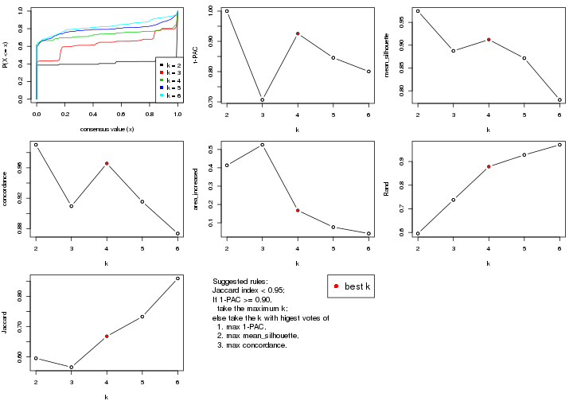

The numeric values for all these statistics can be obtained by `get_stats()`.

```r
get_stats(res)
```

```
#>   k 1-PAC mean_silhouette concordance area_increased  Rand Jaccard
#> 2 2 1.000           0.975       0.990         0.4136 0.595   0.595
#> 3 3 0.707           0.888       0.910         0.5256 0.738   0.566
#> 4 4 0.926           0.912       0.966         0.1675 0.878   0.668
#> 5 5 0.846           0.872       0.915         0.0764 0.928   0.733
#> 6 6 0.800           0.780       0.874         0.0416 0.971   0.859
```

`suggest_best_k()` suggests the best $k$ based on these statistics. The rules are as follows:

- All $k$ with Jaccard index larger than 0.95 are removed because increasing
  $k$ does not provide enough extra information. If all $k$ are removed, it is
  marked as no subgroup is detected.
- For all $k$ with 1-PAC score larger than 0.9, the maximal $k$ is taken as
  the best $k$, and other $k$ are marked as optional $k$.
- If it does not fit the second rule. The $k$ with the maximal vote of the
  highest 1-PAC score, highest mean silhouette, and highest concordance is
  taken as the best $k$.

```r
suggest_best_k(res)
```

```
#> [1] 4
#> attr(,"optional")
#> [1] 2
```

There is also optional best $k$ = 2 that is worth to check.

Following shows the table of the partitions (You need to click the **show/hide
code output** link to see it). The membership matrix (columns with name `p*`)
is inferred by
[`clue::cl_consensus()`](https://www.rdocumentation.org/link/cl_consensus?package=clue)
function with the `SE` method. Basically the value in the membership matrix
represents the probability to belong to a certain group. The finall class
label for an item is determined with the group with highest probability it
belongs to.

In `get_classes()` function, the entropy is calculated from the membership
matrix and the silhouette score is calculated from the consensus matrix.


<script>
$( function() {
	$( '#tabs-ATC-pam-get-classes' ).tabs();
} );
</script>
<div id='tabs-ATC-pam-get-classes'>
<ul>
<li><a href='#tab-ATC-pam-get-classes-1'>k = 2</a></li>
<li><a href='#tab-ATC-pam-get-classes-2'>k = 3</a></li>
<li><a href='#tab-ATC-pam-get-classes-3'>k = 4</a></li>
<li><a href='#tab-ATC-pam-get-classes-4'>k = 5</a></li>
<li><a href='#tab-ATC-pam-get-classes-5'>k = 6</a></li>
</ul>

<div id='tab-ATC-pam-get-classes-1'>
<p><a id='tab-ATC-pam-get-classes-1-a' style='color:#0366d6' href='#'>show/hide code output</a></p>
<pre><code class="r">cbind(get_classes(res, k = 2), get_membership(res, k = 2))
</code></pre>

<pre><code>#&gt;           class entropy silhouette    p1    p2
#&gt; GSM525314     1   0.000      1.000 1.000 0.000
#&gt; GSM525315     2   0.000      0.986 0.000 1.000
#&gt; GSM525316     1   0.000      1.000 1.000 0.000
#&gt; GSM525317     1   0.000      1.000 1.000 0.000
#&gt; GSM525318     1   0.000      1.000 1.000 0.000
#&gt; GSM525319     2   0.000      0.986 0.000 1.000
#&gt; GSM525320     2   0.000      0.986 0.000 1.000
#&gt; GSM525321     1   0.000      1.000 1.000 0.000
#&gt; GSM525322     2   0.000      0.986 0.000 1.000
#&gt; GSM525323     1   0.000      1.000 1.000 0.000
#&gt; GSM525324     2   0.000      0.986 0.000 1.000
#&gt; GSM525325     2   0.634      0.805 0.160 0.840
#&gt; GSM525326     2   0.000      0.986 0.000 1.000
#&gt; GSM525327     1   0.000      1.000 1.000 0.000
#&gt; GSM525328     2   0.000      0.986 0.000 1.000
#&gt; GSM525329     2   0.000      0.986 0.000 1.000
#&gt; GSM525330     2   0.000      0.986 0.000 1.000
#&gt; GSM525331     2   0.000      0.986 0.000 1.000
#&gt; GSM525332     2   0.000      0.986 0.000 1.000
#&gt; GSM525333     2   0.000      0.986 0.000 1.000
#&gt; GSM525334     2   0.000      0.986 0.000 1.000
#&gt; GSM525335     2   0.000      0.986 0.000 1.000
#&gt; GSM525336     2   0.000      0.986 0.000 1.000
#&gt; GSM525337     2   0.000      0.986 0.000 1.000
#&gt; GSM525338     2   0.000      0.986 0.000 1.000
#&gt; GSM525339     2   0.000      0.986 0.000 1.000
#&gt; GSM525340     1   0.000      1.000 1.000 0.000
#&gt; GSM525341     2   0.000      0.986 0.000 1.000
#&gt; GSM525342     1   0.000      1.000 1.000 0.000
#&gt; GSM525343     1   0.000      1.000 1.000 0.000
#&gt; GSM525344     2   0.000      0.986 0.000 1.000
#&gt; GSM525345     1   0.000      1.000 1.000 0.000
#&gt; GSM525346     2   0.000      0.986 0.000 1.000
#&gt; GSM525347     2   0.000      0.986 0.000 1.000
#&gt; GSM525348     2   0.000      0.986 0.000 1.000
#&gt; GSM525349     2   0.000      0.986 0.000 1.000
#&gt; GSM525350     2   0.991      0.214 0.444 0.556
#&gt; GSM525351     2   0.000      0.986 0.000 1.000
#&gt; GSM525352     2   0.000      0.986 0.000 1.000
#&gt; GSM525353     2   0.000      0.986 0.000 1.000
#&gt; GSM525354     2   0.000      0.986 0.000 1.000
#&gt; GSM525355     2   0.000      0.986 0.000 1.000
#&gt; GSM525356     2   0.000      0.986 0.000 1.000
#&gt; GSM525357     2   0.000      0.986 0.000 1.000
#&gt; GSM525358     2   0.000      0.986 0.000 1.000
#&gt; GSM525359     1   0.000      1.000 1.000 0.000
#&gt; GSM525360     2   0.000      0.986 0.000 1.000
#&gt; GSM525361     1   0.000      1.000 1.000 0.000
#&gt; GSM525362     1   0.000      1.000 1.000 0.000
#&gt; GSM525363     2   0.000      0.986 0.000 1.000
#&gt; GSM525364     2   0.000      0.986 0.000 1.000
#&gt; GSM525365     1   0.000      1.000 1.000 0.000
#&gt; GSM525366     2   0.000      0.986 0.000 1.000
#&gt; GSM525367     1   0.000      1.000 1.000 0.000
#&gt; GSM525368     2   0.000      0.986 0.000 1.000
#&gt; GSM525369     2   0.000      0.986 0.000 1.000
#&gt; GSM525370     2   0.000      0.986 0.000 1.000
#&gt; GSM525371     2   0.000      0.986 0.000 1.000
#&gt; GSM525372     1   0.000      1.000 1.000 0.000
#&gt; GSM525373     2   0.000      0.986 0.000 1.000
#&gt; GSM525374     2   0.000      0.986 0.000 1.000
#&gt; GSM525375     2   0.000      0.986 0.000 1.000
</code></pre>

<script>
$('#tab-ATC-pam-get-classes-1-a').parent().next().next().hide();
$('#tab-ATC-pam-get-classes-1-a').click(function(){
  $('#tab-ATC-pam-get-classes-1-a').parent().next().next().toggle();
  return(false);
});
</script>
</div>

<div id='tab-ATC-pam-get-classes-2'>
<p><a id='tab-ATC-pam-get-classes-2-a' style='color:#0366d6' href='#'>show/hide code output</a></p>
<pre><code class="r">cbind(get_classes(res, k = 3), get_membership(res, k = 3))
</code></pre>

<pre><code>#&gt;           class entropy silhouette    p1    p2    p3
#&gt; GSM525314     1  0.0000      0.947 1.000 0.000 0.000
#&gt; GSM525315     2  0.5178      0.587 0.000 0.744 0.256
#&gt; GSM525316     1  0.0000      0.947 1.000 0.000 0.000
#&gt; GSM525317     1  0.0000      0.947 1.000 0.000 0.000
#&gt; GSM525318     1  0.0000      0.947 1.000 0.000 0.000
#&gt; GSM525319     2  0.0000      0.953 0.000 1.000 0.000
#&gt; GSM525320     3  0.4062      0.924 0.000 0.164 0.836
#&gt; GSM525321     1  0.0000      0.947 1.000 0.000 0.000
#&gt; GSM525322     2  0.0000      0.953 0.000 1.000 0.000
#&gt; GSM525323     1  0.0000      0.947 1.000 0.000 0.000
#&gt; GSM525324     2  0.0000      0.953 0.000 1.000 0.000
#&gt; GSM525325     3  0.7777      0.749 0.160 0.164 0.676
#&gt; GSM525326     3  0.4062      0.924 0.000 0.164 0.836
#&gt; GSM525327     1  0.4062      0.823 0.836 0.000 0.164
#&gt; GSM525328     3  0.0000      0.838 0.000 0.000 1.000
#&gt; GSM525329     3  0.4062      0.924 0.000 0.164 0.836
#&gt; GSM525330     3  0.4062      0.924 0.000 0.164 0.836
#&gt; GSM525331     2  0.0424      0.948 0.000 0.992 0.008
#&gt; GSM525332     3  0.4062      0.924 0.000 0.164 0.836
#&gt; GSM525333     3  0.4235      0.915 0.000 0.176 0.824
#&gt; GSM525334     3  0.5363      0.796 0.000 0.276 0.724
#&gt; GSM525335     2  0.0000      0.953 0.000 1.000 0.000
#&gt; GSM525336     3  0.0000      0.838 0.000 0.000 1.000
#&gt; GSM525337     3  0.4062      0.924 0.000 0.164 0.836
#&gt; GSM525338     3  0.4235      0.915 0.000 0.176 0.824
#&gt; GSM525339     3  0.0000      0.838 0.000 0.000 1.000
#&gt; GSM525340     1  0.0000      0.947 1.000 0.000 0.000
#&gt; GSM525341     2  0.0000      0.953 0.000 1.000 0.000
#&gt; GSM525342     1  0.0000      0.947 1.000 0.000 0.000
#&gt; GSM525343     1  0.0000      0.947 1.000 0.000 0.000
#&gt; GSM525344     2  0.0000      0.953 0.000 1.000 0.000
#&gt; GSM525345     1  0.0000      0.947 1.000 0.000 0.000
#&gt; GSM525346     3  0.4062      0.924 0.000 0.164 0.836
#&gt; GSM525347     3  0.4062      0.924 0.000 0.164 0.836
#&gt; GSM525348     3  0.4062      0.924 0.000 0.164 0.836
#&gt; GSM525349     3  0.0000      0.838 0.000 0.000 1.000
#&gt; GSM525350     1  0.9322     -0.193 0.444 0.164 0.392
#&gt; GSM525351     2  0.0747      0.941 0.000 0.984 0.016
#&gt; GSM525352     3  0.4062      0.924 0.000 0.164 0.836
#&gt; GSM525353     3  0.4235      0.915 0.000 0.176 0.824
#&gt; GSM525354     2  0.5138      0.588 0.000 0.748 0.252
#&gt; GSM525355     2  0.0000      0.953 0.000 1.000 0.000
#&gt; GSM525356     3  0.0000      0.838 0.000 0.000 1.000
#&gt; GSM525357     3  0.4062      0.924 0.000 0.164 0.836
#&gt; GSM525358     3  0.0000      0.838 0.000 0.000 1.000
#&gt; GSM525359     1  0.3192      0.867 0.888 0.000 0.112
#&gt; GSM525360     2  0.0000      0.953 0.000 1.000 0.000
#&gt; GSM525361     1  0.0000      0.947 1.000 0.000 0.000
#&gt; GSM525362     1  0.0000      0.947 1.000 0.000 0.000
#&gt; GSM525363     2  0.0000      0.953 0.000 1.000 0.000
#&gt; GSM525364     3  0.4062      0.924 0.000 0.164 0.836
#&gt; GSM525365     1  0.0000      0.947 1.000 0.000 0.000
#&gt; GSM525366     2  0.0237      0.951 0.000 0.996 0.004
#&gt; GSM525367     1  0.0000      0.947 1.000 0.000 0.000
#&gt; GSM525368     3  0.4062      0.924 0.000 0.164 0.836
#&gt; GSM525369     3  0.4062      0.924 0.000 0.164 0.836
#&gt; GSM525370     3  0.4062      0.924 0.000 0.164 0.836
#&gt; GSM525371     3  0.0000      0.838 0.000 0.000 1.000
#&gt; GSM525372     1  0.0000      0.947 1.000 0.000 0.000
#&gt; GSM525373     2  0.0000      0.953 0.000 1.000 0.000
#&gt; GSM525374     3  0.4062      0.924 0.000 0.164 0.836
#&gt; GSM525375     3  0.0000      0.838 0.000 0.000 1.000
</code></pre>

<script>
$('#tab-ATC-pam-get-classes-2-a').parent().next().next().hide();
$('#tab-ATC-pam-get-classes-2-a').click(function(){
  $('#tab-ATC-pam-get-classes-2-a').parent().next().next().toggle();
  return(false);
});
</script>
</div>

<div id='tab-ATC-pam-get-classes-3'>
<p><a id='tab-ATC-pam-get-classes-3-a' style='color:#0366d6' href='#'>show/hide code output</a></p>
<pre><code class="r">cbind(get_classes(res, k = 4), get_membership(res, k = 4))
</code></pre>

<pre><code>#&gt;           class entropy silhouette    p1    p2    p3    p4
#&gt; GSM525314     3  0.0000      0.992 0.000 0.000 1.000 0.000
#&gt; GSM525315     2  0.4103      0.657 0.000 0.744 0.000 0.256
#&gt; GSM525316     3  0.0000      0.992 0.000 0.000 1.000 0.000
#&gt; GSM525317     3  0.0000      0.992 0.000 0.000 1.000 0.000
#&gt; GSM525318     3  0.0000      0.992 0.000 0.000 1.000 0.000
#&gt; GSM525319     2  0.0000      0.930 0.000 1.000 0.000 0.000
#&gt; GSM525320     4  0.0000      0.953 0.000 0.000 0.000 1.000
#&gt; GSM525321     3  0.0000      0.992 0.000 0.000 1.000 0.000
#&gt; GSM525322     2  0.0000      0.930 0.000 1.000 0.000 0.000
#&gt; GSM525323     3  0.0000      0.992 0.000 0.000 1.000 0.000
#&gt; GSM525324     2  0.0000      0.930 0.000 1.000 0.000 0.000
#&gt; GSM525325     4  0.3172      0.784 0.000 0.000 0.160 0.840
#&gt; GSM525326     4  0.0000      0.953 0.000 0.000 0.000 1.000
#&gt; GSM525327     1  0.0000      0.941 1.000 0.000 0.000 0.000
#&gt; GSM525328     1  0.0000      0.941 1.000 0.000 0.000 0.000
#&gt; GSM525329     4  0.0000      0.953 0.000 0.000 0.000 1.000
#&gt; GSM525330     4  0.0000      0.953 0.000 0.000 0.000 1.000
#&gt; GSM525331     2  0.0336      0.926 0.000 0.992 0.000 0.008
#&gt; GSM525332     4  0.0000      0.953 0.000 0.000 0.000 1.000
#&gt; GSM525333     4  0.0921      0.935 0.000 0.028 0.000 0.972
#&gt; GSM525334     4  0.2530      0.848 0.000 0.112 0.000 0.888
#&gt; GSM525335     2  0.0000      0.930 0.000 1.000 0.000 0.000
#&gt; GSM525336     1  0.0000      0.941 1.000 0.000 0.000 0.000
#&gt; GSM525337     4  0.0000      0.953 0.000 0.000 0.000 1.000
#&gt; GSM525338     4  0.0921      0.935 0.000 0.028 0.000 0.972
#&gt; GSM525339     1  0.0000      0.941 1.000 0.000 0.000 0.000
#&gt; GSM525340     3  0.0000      0.992 0.000 0.000 1.000 0.000
#&gt; GSM525341     2  0.0000      0.930 0.000 1.000 0.000 0.000
#&gt; GSM525342     3  0.0000      0.992 0.000 0.000 1.000 0.000
#&gt; GSM525343     3  0.0000      0.992 0.000 0.000 1.000 0.000
#&gt; GSM525344     2  0.0000      0.930 0.000 1.000 0.000 0.000
#&gt; GSM525345     3  0.0000      0.992 0.000 0.000 1.000 0.000
#&gt; GSM525346     4  0.0000      0.953 0.000 0.000 0.000 1.000
#&gt; GSM525347     4  0.0000      0.953 0.000 0.000 0.000 1.000
#&gt; GSM525348     4  0.0000      0.953 0.000 0.000 0.000 1.000
#&gt; GSM525349     1  0.0000      0.941 1.000 0.000 0.000 0.000
#&gt; GSM525350     4  0.4955      0.221 0.000 0.000 0.444 0.556
#&gt; GSM525351     2  0.2704      0.816 0.000 0.876 0.000 0.124
#&gt; GSM525352     4  0.0000      0.953 0.000 0.000 0.000 1.000
#&gt; GSM525353     4  0.0921      0.935 0.000 0.028 0.000 0.972
#&gt; GSM525354     2  0.4730      0.445 0.000 0.636 0.000 0.364
#&gt; GSM525355     2  0.0000      0.930 0.000 1.000 0.000 0.000
#&gt; GSM525356     1  0.0000      0.941 1.000 0.000 0.000 0.000
#&gt; GSM525357     4  0.0000      0.953 0.000 0.000 0.000 1.000
#&gt; GSM525358     1  0.4855      0.333 0.600 0.000 0.000 0.400
#&gt; GSM525359     3  0.2647      0.862 0.120 0.000 0.880 0.000
#&gt; GSM525360     2  0.0000      0.930 0.000 1.000 0.000 0.000
#&gt; GSM525361     3  0.0000      0.992 0.000 0.000 1.000 0.000
#&gt; GSM525362     3  0.0000      0.992 0.000 0.000 1.000 0.000
#&gt; GSM525363     2  0.0000      0.930 0.000 1.000 0.000 0.000
#&gt; GSM525364     4  0.1022      0.931 0.032 0.000 0.000 0.968
#&gt; GSM525365     3  0.0000      0.992 0.000 0.000 1.000 0.000
#&gt; GSM525366     2  0.0707      0.915 0.000 0.980 0.000 0.020
#&gt; GSM525367     3  0.0000      0.992 0.000 0.000 1.000 0.000
#&gt; GSM525368     4  0.0000      0.953 0.000 0.000 0.000 1.000
#&gt; GSM525369     4  0.0000      0.953 0.000 0.000 0.000 1.000
#&gt; GSM525370     4  0.0000      0.953 0.000 0.000 0.000 1.000
#&gt; GSM525371     1  0.0000      0.941 1.000 0.000 0.000 0.000
#&gt; GSM525372     3  0.0000      0.992 0.000 0.000 1.000 0.000
#&gt; GSM525373     2  0.0000      0.930 0.000 1.000 0.000 0.000
#&gt; GSM525374     4  0.0000      0.953 0.000 0.000 0.000 1.000
#&gt; GSM525375     1  0.0000      0.941 1.000 0.000 0.000 0.000
</code></pre>

<script>
$('#tab-ATC-pam-get-classes-3-a').parent().next().next().hide();
$('#tab-ATC-pam-get-classes-3-a').click(function(){
  $('#tab-ATC-pam-get-classes-3-a').parent().next().next().toggle();
  return(false);
});
</script>
</div>

<div id='tab-ATC-pam-get-classes-4'>
<p><a id='tab-ATC-pam-get-classes-4-a' style='color:#0366d6' href='#'>show/hide code output</a></p>
<pre><code class="r">cbind(get_classes(res, k = 5), get_membership(res, k = 5))
</code></pre>

<pre><code>#&gt;           class entropy silhouette    p1    p2    p3    p4    p5
#&gt; GSM525314     3  0.1671      0.933 0.000 0.000 0.924 0.076 0.000
#&gt; GSM525315     4  0.3814      0.822 0.000 0.068 0.000 0.808 0.124
#&gt; GSM525316     3  0.1197      0.938 0.000 0.000 0.952 0.048 0.000
#&gt; GSM525317     3  0.0510      0.943 0.000 0.000 0.984 0.016 0.000
#&gt; GSM525318     3  0.0000      0.944 0.000 0.000 1.000 0.000 0.000
#&gt; GSM525319     2  0.0000      0.951 0.000 1.000 0.000 0.000 0.000
#&gt; GSM525320     5  0.0290      0.887 0.000 0.000 0.000 0.008 0.992
#&gt; GSM525321     3  0.2230      0.892 0.000 0.000 0.884 0.116 0.000
#&gt; GSM525322     2  0.0000      0.951 0.000 1.000 0.000 0.000 0.000
#&gt; GSM525323     3  0.1671      0.933 0.000 0.000 0.924 0.076 0.000
#&gt; GSM525324     2  0.0162      0.950 0.000 0.996 0.000 0.004 0.000
#&gt; GSM525325     5  0.3657      0.755 0.000 0.000 0.064 0.116 0.820
#&gt; GSM525326     5  0.0703      0.884 0.000 0.000 0.000 0.024 0.976
#&gt; GSM525327     1  0.0000      1.000 1.000 0.000 0.000 0.000 0.000
#&gt; GSM525328     1  0.0000      1.000 1.000 0.000 0.000 0.000 0.000
#&gt; GSM525329     4  0.2561      0.812 0.000 0.000 0.000 0.856 0.144
#&gt; GSM525330     5  0.2280      0.822 0.000 0.000 0.000 0.120 0.880
#&gt; GSM525331     4  0.3661      0.565 0.000 0.276 0.000 0.724 0.000
#&gt; GSM525332     5  0.4161      0.178 0.000 0.000 0.000 0.392 0.608
#&gt; GSM525333     4  0.3795      0.829 0.000 0.028 0.000 0.780 0.192
#&gt; GSM525334     5  0.2951      0.771 0.000 0.112 0.000 0.028 0.860
#&gt; GSM525335     2  0.0794      0.942 0.000 0.972 0.000 0.028 0.000
#&gt; GSM525336     1  0.0000      1.000 1.000 0.000 0.000 0.000 0.000
#&gt; GSM525337     4  0.2074      0.795 0.000 0.000 0.000 0.896 0.104
#&gt; GSM525338     4  0.3795      0.820 0.000 0.028 0.000 0.780 0.192
#&gt; GSM525339     1  0.0000      1.000 1.000 0.000 0.000 0.000 0.000
#&gt; GSM525340     3  0.1671      0.933 0.000 0.000 0.924 0.076 0.000
#&gt; GSM525341     2  0.0880      0.940 0.000 0.968 0.000 0.032 0.000
#&gt; GSM525342     3  0.0000      0.944 0.000 0.000 1.000 0.000 0.000
#&gt; GSM525343     3  0.0510      0.943 0.000 0.000 0.984 0.016 0.000
#&gt; GSM525344     2  0.0000      0.951 0.000 1.000 0.000 0.000 0.000
#&gt; GSM525345     3  0.0880      0.942 0.000 0.000 0.968 0.032 0.000
#&gt; GSM525346     5  0.0000      0.889 0.000 0.000 0.000 0.000 1.000
#&gt; GSM525347     5  0.0290      0.887 0.000 0.000 0.000 0.008 0.992
#&gt; GSM525348     5  0.0162      0.888 0.000 0.000 0.000 0.004 0.996
#&gt; GSM525349     1  0.0000      1.000 1.000 0.000 0.000 0.000 0.000
#&gt; GSM525350     5  0.5839      0.384 0.000 0.000 0.324 0.116 0.560
#&gt; GSM525351     2  0.2951      0.830 0.000 0.860 0.000 0.028 0.112
#&gt; GSM525352     5  0.1341      0.856 0.000 0.000 0.000 0.056 0.944
#&gt; GSM525353     4  0.3795      0.829 0.000 0.028 0.000 0.780 0.192
#&gt; GSM525354     2  0.4134      0.661 0.000 0.744 0.000 0.032 0.224
#&gt; GSM525355     2  0.0794      0.942 0.000 0.972 0.000 0.028 0.000
#&gt; GSM525356     1  0.0000      1.000 1.000 0.000 0.000 0.000 0.000
#&gt; GSM525357     5  0.1211      0.872 0.000 0.016 0.000 0.024 0.960
#&gt; GSM525358     4  0.6281      0.345 0.388 0.000 0.000 0.460 0.152
#&gt; GSM525359     3  0.2900      0.862 0.108 0.000 0.864 0.028 0.000
#&gt; GSM525360     2  0.0000      0.951 0.000 1.000 0.000 0.000 0.000
#&gt; GSM525361     3  0.1410      0.928 0.000 0.000 0.940 0.060 0.000
#&gt; GSM525362     3  0.2677      0.886 0.000 0.000 0.872 0.112 0.016
#&gt; GSM525363     2  0.0000      0.951 0.000 1.000 0.000 0.000 0.000
#&gt; GSM525364     5  0.0880      0.874 0.032 0.000 0.000 0.000 0.968
#&gt; GSM525365     3  0.0000      0.944 0.000 0.000 1.000 0.000 0.000
#&gt; GSM525366     2  0.0609      0.935 0.000 0.980 0.000 0.000 0.020
#&gt; GSM525367     3  0.1671      0.933 0.000 0.000 0.924 0.076 0.000
#&gt; GSM525368     5  0.0000      0.889 0.000 0.000 0.000 0.000 1.000
#&gt; GSM525369     5  0.0000      0.889 0.000 0.000 0.000 0.000 1.000
#&gt; GSM525370     5  0.0000      0.889 0.000 0.000 0.000 0.000 1.000
#&gt; GSM525371     1  0.0000      1.000 1.000 0.000 0.000 0.000 0.000
#&gt; GSM525372     3  0.1732      0.917 0.000 0.000 0.920 0.080 0.000
#&gt; GSM525373     2  0.0000      0.951 0.000 1.000 0.000 0.000 0.000
#&gt; GSM525374     5  0.0404      0.887 0.000 0.000 0.000 0.012 0.988
#&gt; GSM525375     1  0.0000      1.000 1.000 0.000 0.000 0.000 0.000
</code></pre>

<script>
$('#tab-ATC-pam-get-classes-4-a').parent().next().next().hide();
$('#tab-ATC-pam-get-classes-4-a').click(function(){
  $('#tab-ATC-pam-get-classes-4-a').parent().next().next().toggle();
  return(false);
});
</script>
</div>

<div id='tab-ATC-pam-get-classes-5'>
<p><a id='tab-ATC-pam-get-classes-5-a' style='color:#0366d6' href='#'>show/hide code output</a></p>
<pre><code class="r">cbind(get_classes(res, k = 6), get_membership(res, k = 6))
</code></pre>

<pre><code>#&gt;           class entropy silhouette    p1    p2    p3    p4    p5    p6
#&gt; GSM525314     6  0.2697     0.9170 0.000 0.000 0.188 0.000 0.000 0.812
#&gt; GSM525315     4  0.3397     0.7860 0.000 0.036 0.000 0.836 0.092 0.036
#&gt; GSM525316     3  0.3804    -0.0111 0.000 0.000 0.576 0.000 0.000 0.424
#&gt; GSM525317     3  0.0000     0.8095 0.000 0.000 1.000 0.000 0.000 0.000
#&gt; GSM525318     3  0.0260     0.8065 0.000 0.000 0.992 0.000 0.000 0.008
#&gt; GSM525319     2  0.0000     0.8980 0.000 1.000 0.000 0.000 0.000 0.000
#&gt; GSM525320     5  0.0820     0.8462 0.000 0.000 0.000 0.012 0.972 0.016
#&gt; GSM525321     3  0.2632     0.7377 0.000 0.000 0.832 0.164 0.000 0.004
#&gt; GSM525322     2  0.0000     0.8980 0.000 1.000 0.000 0.000 0.000 0.000
#&gt; GSM525323     6  0.2697     0.9170 0.000 0.000 0.188 0.000 0.000 0.812
#&gt; GSM525324     2  0.0508     0.8944 0.000 0.984 0.000 0.004 0.000 0.012
#&gt; GSM525325     5  0.3239     0.7364 0.000 0.000 0.024 0.164 0.808 0.004
#&gt; GSM525326     5  0.0972     0.8468 0.000 0.000 0.000 0.028 0.964 0.008
#&gt; GSM525327     1  0.0000     0.9992 1.000 0.000 0.000 0.000 0.000 0.000
#&gt; GSM525328     1  0.0000     0.9992 1.000 0.000 0.000 0.000 0.000 0.000
#&gt; GSM525329     4  0.1701     0.7694 0.000 0.000 0.008 0.920 0.072 0.000
#&gt; GSM525330     5  0.2738     0.7668 0.000 0.000 0.004 0.176 0.820 0.000
#&gt; GSM525331     4  0.4503     0.5803 0.000 0.204 0.000 0.696 0.000 0.100
#&gt; GSM525332     5  0.5353     0.1294 0.000 0.000 0.000 0.352 0.528 0.120
#&gt; GSM525333     4  0.2631     0.7834 0.000 0.000 0.000 0.820 0.180 0.000
#&gt; GSM525334     5  0.4841     0.6260 0.000 0.108 0.000 0.016 0.696 0.180
#&gt; GSM525335     2  0.3071     0.8294 0.000 0.804 0.000 0.016 0.000 0.180
#&gt; GSM525336     1  0.0000     0.9992 1.000 0.000 0.000 0.000 0.000 0.000
#&gt; GSM525337     4  0.0520     0.7212 0.000 0.000 0.008 0.984 0.008 0.000
#&gt; GSM525338     4  0.4863     0.7041 0.000 0.000 0.000 0.664 0.168 0.168
#&gt; GSM525339     1  0.0000     0.9992 1.000 0.000 0.000 0.000 0.000 0.000
#&gt; GSM525340     6  0.2697     0.9170 0.000 0.000 0.188 0.000 0.000 0.812
#&gt; GSM525341     2  0.3134     0.8322 0.000 0.808 0.000 0.024 0.000 0.168
#&gt; GSM525342     3  0.0363     0.8047 0.000 0.000 0.988 0.000 0.000 0.012
#&gt; GSM525343     3  0.0000     0.8095 0.000 0.000 1.000 0.000 0.000 0.000
#&gt; GSM525344     2  0.0000     0.8980 0.000 1.000 0.000 0.000 0.000 0.000
#&gt; GSM525345     6  0.3797     0.5627 0.000 0.000 0.420 0.000 0.000 0.580
#&gt; GSM525346     5  0.0000     0.8513 0.000 0.000 0.000 0.000 1.000 0.000
#&gt; GSM525347     5  0.0363     0.8496 0.000 0.000 0.000 0.012 0.988 0.000
#&gt; GSM525348     5  0.0291     0.8510 0.000 0.000 0.000 0.004 0.992 0.004
#&gt; GSM525349     1  0.0000     0.9992 1.000 0.000 0.000 0.000 0.000 0.000
#&gt; GSM525350     5  0.5498     0.4237 0.000 0.000 0.256 0.164 0.576 0.004
#&gt; GSM525351     2  0.4424     0.7685 0.000 0.732 0.000 0.016 0.072 0.180
#&gt; GSM525352     5  0.1610     0.8115 0.000 0.000 0.000 0.084 0.916 0.000
#&gt; GSM525353     4  0.2631     0.7834 0.000 0.000 0.000 0.820 0.180 0.000
#&gt; GSM525354     2  0.5267     0.6755 0.000 0.660 0.000 0.024 0.136 0.180
#&gt; GSM525355     2  0.3071     0.8294 0.000 0.804 0.000 0.016 0.000 0.180
#&gt; GSM525356     1  0.0146     0.9947 0.996 0.000 0.000 0.004 0.000 0.000
#&gt; GSM525357     5  0.3482     0.7267 0.000 0.024 0.000 0.012 0.796 0.168
#&gt; GSM525358     4  0.5603     0.3598 0.376 0.000 0.000 0.476 0.148 0.000
#&gt; GSM525359     3  0.4500    -0.1421 0.036 0.000 0.572 0.000 0.000 0.392
#&gt; GSM525360     2  0.0000     0.8980 0.000 1.000 0.000 0.000 0.000 0.000
#&gt; GSM525361     3  0.1204     0.7994 0.000 0.000 0.944 0.056 0.000 0.000
#&gt; GSM525362     3  0.3240     0.7223 0.000 0.000 0.812 0.148 0.040 0.000
#&gt; GSM525363     2  0.0000     0.8980 0.000 1.000 0.000 0.000 0.000 0.000
#&gt; GSM525364     5  0.0790     0.8407 0.032 0.000 0.000 0.000 0.968 0.000
#&gt; GSM525365     3  0.0146     0.8082 0.000 0.000 0.996 0.000 0.000 0.004
#&gt; GSM525366     2  0.0000     0.8980 0.000 1.000 0.000 0.000 0.000 0.000
#&gt; GSM525367     6  0.2697     0.9170 0.000 0.000 0.188 0.000 0.000 0.812
#&gt; GSM525368     5  0.0000     0.8513 0.000 0.000 0.000 0.000 1.000 0.000
#&gt; GSM525369     5  0.0000     0.8513 0.000 0.000 0.000 0.000 1.000 0.000
#&gt; GSM525370     5  0.0146     0.8514 0.000 0.000 0.000 0.000 0.996 0.004
#&gt; GSM525371     1  0.0000     0.9992 1.000 0.000 0.000 0.000 0.000 0.000
#&gt; GSM525372     3  0.1957     0.7752 0.000 0.000 0.888 0.112 0.000 0.000
#&gt; GSM525373     2  0.0000     0.8980 0.000 1.000 0.000 0.000 0.000 0.000
#&gt; GSM525374     5  0.2581     0.7732 0.000 0.000 0.000 0.016 0.856 0.128
#&gt; GSM525375     1  0.0000     0.9992 1.000 0.000 0.000 0.000 0.000 0.000
</code></pre>

<script>
$('#tab-ATC-pam-get-classes-5-a').parent().next().next().hide();
$('#tab-ATC-pam-get-classes-5-a').click(function(){
  $('#tab-ATC-pam-get-classes-5-a').parent().next().next().toggle();
  return(false);
});
</script>
</div>
</div>

Heatmaps for the consensus matrix. It visualizes the probability of two
samples to be in a same group.


<script>
$( function() {
	$( '#tabs-ATC-pam-consensus-heatmap' ).tabs();
} );
</script>
<div id='tabs-ATC-pam-consensus-heatmap'>
<ul>
<li><a href='#tab-ATC-pam-consensus-heatmap-1'>k = 2</a></li>
<li><a href='#tab-ATC-pam-consensus-heatmap-2'>k = 3</a></li>
<li><a href='#tab-ATC-pam-consensus-heatmap-3'>k = 4</a></li>
<li><a href='#tab-ATC-pam-consensus-heatmap-4'>k = 5</a></li>
<li><a href='#tab-ATC-pam-consensus-heatmap-5'>k = 6</a></li>
</ul>
<div id='tab-ATC-pam-consensus-heatmap-1'>
<pre><code class="r">consensus_heatmap(res, k = 2)
</code></pre>

<p>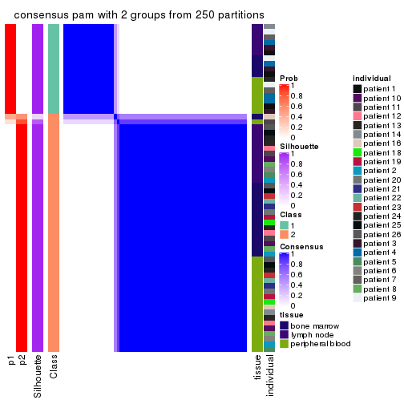</p>

</div>
<div id='tab-ATC-pam-consensus-heatmap-2'>
<pre><code class="r">consensus_heatmap(res, k = 3)
</code></pre>

<p>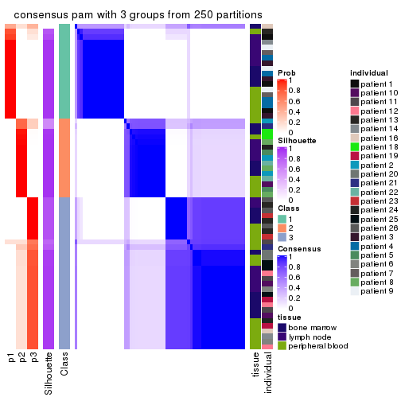</p>

</div>
<div id='tab-ATC-pam-consensus-heatmap-3'>
<pre><code class="r">consensus_heatmap(res, k = 4)
</code></pre>

<p>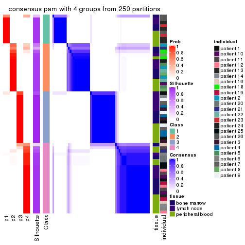</p>

</div>
<div id='tab-ATC-pam-consensus-heatmap-4'>
<pre><code class="r">consensus_heatmap(res, k = 5)
</code></pre>

<p>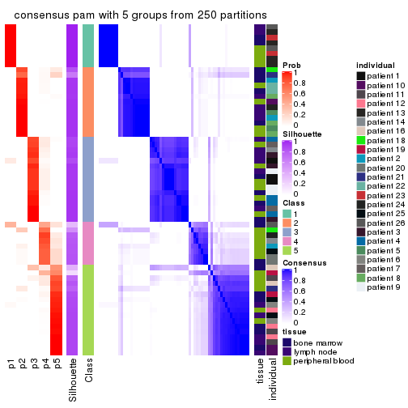</p>

</div>
<div id='tab-ATC-pam-consensus-heatmap-5'>
<pre><code class="r">consensus_heatmap(res, k = 6)
</code></pre>

<p>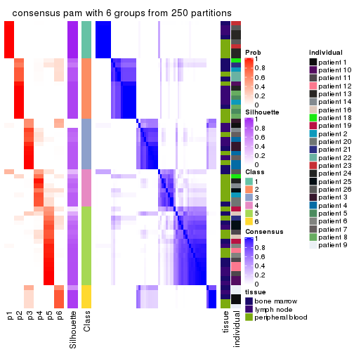</p>

</div>
</div>

Heatmaps for the membership of samples in all partitions to see how consistent they are:


<script>
$( function() {
	$( '#tabs-ATC-pam-membership-heatmap' ).tabs();
} );
</script>
<div id='tabs-ATC-pam-membership-heatmap'>
<ul>
<li><a href='#tab-ATC-pam-membership-heatmap-1'>k = 2</a></li>
<li><a href='#tab-ATC-pam-membership-heatmap-2'>k = 3</a></li>
<li><a href='#tab-ATC-pam-membership-heatmap-3'>k = 4</a></li>
<li><a href='#tab-ATC-pam-membership-heatmap-4'>k = 5</a></li>
<li><a href='#tab-ATC-pam-membership-heatmap-5'>k = 6</a></li>
</ul>
<div id='tab-ATC-pam-membership-heatmap-1'>
<pre><code class="r">membership_heatmap(res, k = 2)
</code></pre>

<p>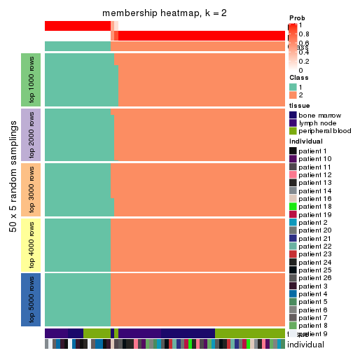</p>

</div>
<div id='tab-ATC-pam-membership-heatmap-2'>
<pre><code class="r">membership_heatmap(res, k = 3)
</code></pre>

<p>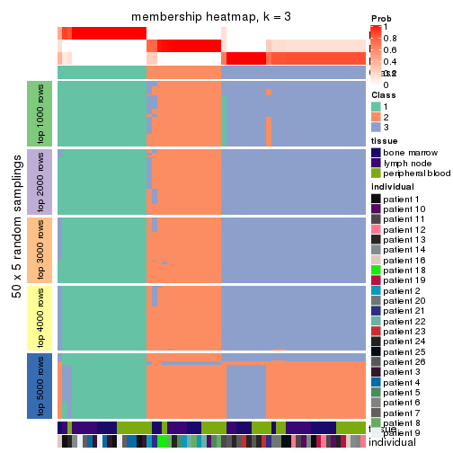</p>

</div>
<div id='tab-ATC-pam-membership-heatmap-3'>
<pre><code class="r">membership_heatmap(res, k = 4)
</code></pre>

<p>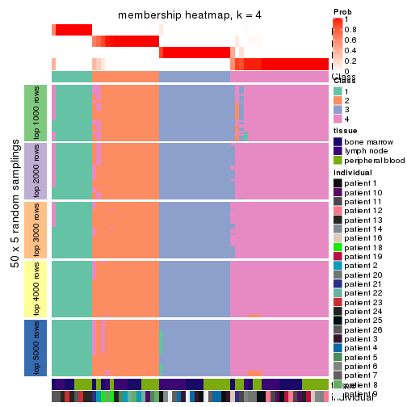</p>

</div>
<div id='tab-ATC-pam-membership-heatmap-4'>
<pre><code class="r">membership_heatmap(res, k = 5)
</code></pre>

<p>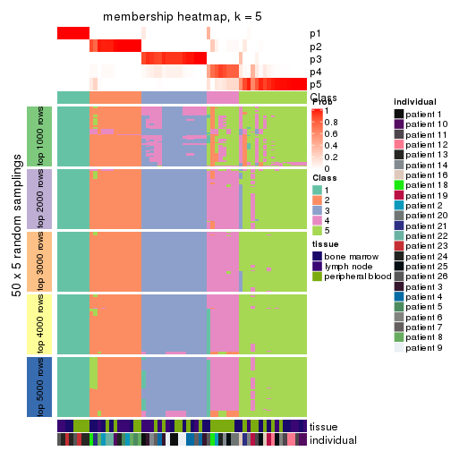</p>

</div>
<div id='tab-ATC-pam-membership-heatmap-5'>
<pre><code class="r">membership_heatmap(res, k = 6)
</code></pre>

<p>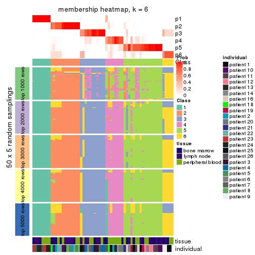</p>

</div>
</div>

As soon as we have had the classes for columns, we can look for signatures
which are significantly different between classes which can be candidate marks
for certain classes. Following are the heatmaps for signatures.


Signature heatmaps where rows are scaled:


<script>
$( function() {
	$( '#tabs-ATC-pam-get-signatures' ).tabs();
} );
</script>
<div id='tabs-ATC-pam-get-signatures'>
<ul>
<li><a href='#tab-ATC-pam-get-signatures-1'>k = 2</a></li>
<li><a href='#tab-ATC-pam-get-signatures-2'>k = 3</a></li>
<li><a href='#tab-ATC-pam-get-signatures-3'>k = 4</a></li>
<li><a href='#tab-ATC-pam-get-signatures-4'>k = 5</a></li>
<li><a href='#tab-ATC-pam-get-signatures-5'>k = 6</a></li>
</ul>
<div id='tab-ATC-pam-get-signatures-1'>
<pre><code class="r">get_signatures(res, k = 2)
</code></pre>

<p>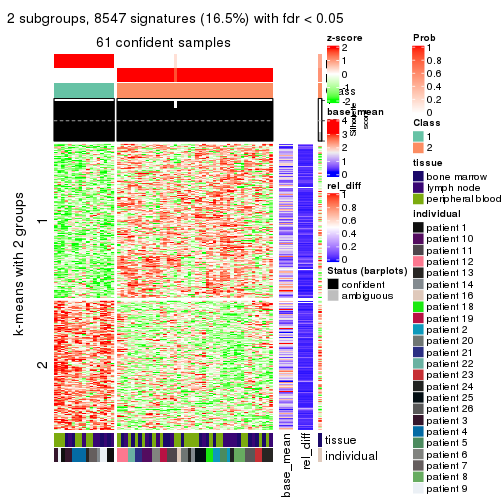</p>

</div>
<div id='tab-ATC-pam-get-signatures-2'>
<pre><code class="r">get_signatures(res, k = 3)
</code></pre>

<p>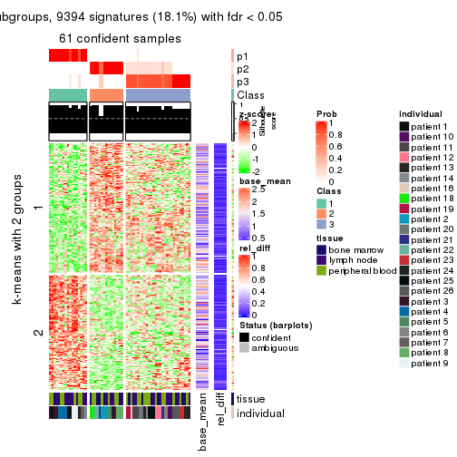</p>

</div>
<div id='tab-ATC-pam-get-signatures-3'>
<pre><code class="r">get_signatures(res, k = 4)
</code></pre>

<p>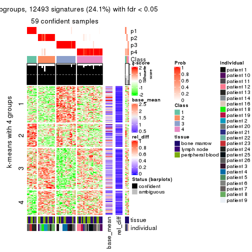</p>

</div>
<div id='tab-ATC-pam-get-signatures-4'>
<pre><code class="r">get_signatures(res, k = 5)
</code></pre>

<p>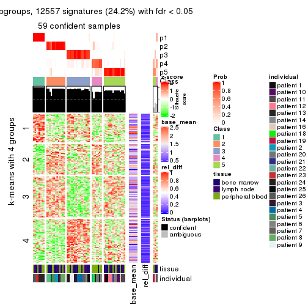</p>

</div>
<div id='tab-ATC-pam-get-signatures-5'>
<pre><code class="r">get_signatures(res, k = 6)
</code></pre>

<p>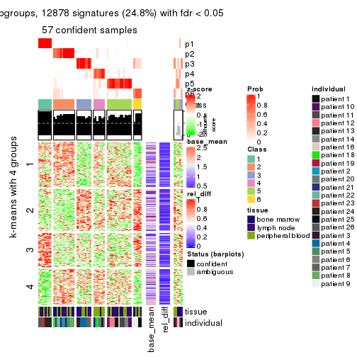</p>

</div>
</div>


Signature heatmaps where rows are not scaled:


<script>
$( function() {
	$( '#tabs-ATC-pam-get-signatures-no-scale' ).tabs();
} );
</script>
<div id='tabs-ATC-pam-get-signatures-no-scale'>
<ul>
<li><a href='#tab-ATC-pam-get-signatures-no-scale-1'>k = 2</a></li>
<li><a href='#tab-ATC-pam-get-signatures-no-scale-2'>k = 3</a></li>
<li><a href='#tab-ATC-pam-get-signatures-no-scale-3'>k = 4</a></li>
<li><a href='#tab-ATC-pam-get-signatures-no-scale-4'>k = 5</a></li>
<li><a href='#tab-ATC-pam-get-signatures-no-scale-5'>k = 6</a></li>
</ul>
<div id='tab-ATC-pam-get-signatures-no-scale-1'>
<pre><code class="r">get_signatures(res, k = 2, scale_rows = FALSE)
</code></pre>

<p>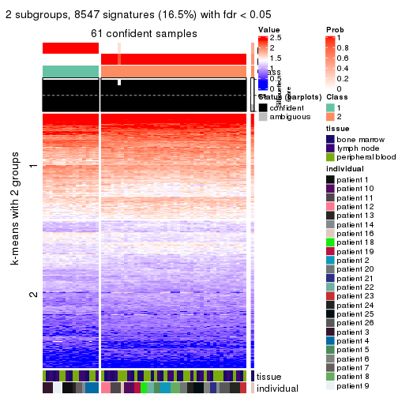</p>

</div>
<div id='tab-ATC-pam-get-signatures-no-scale-2'>
<pre><code class="r">get_signatures(res, k = 3, scale_rows = FALSE)
</code></pre>

<p>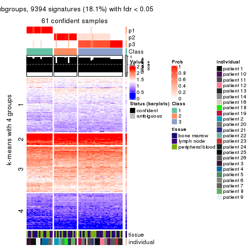</p>

</div>
<div id='tab-ATC-pam-get-signatures-no-scale-3'>
<pre><code class="r">get_signatures(res, k = 4, scale_rows = FALSE)
</code></pre>

<p>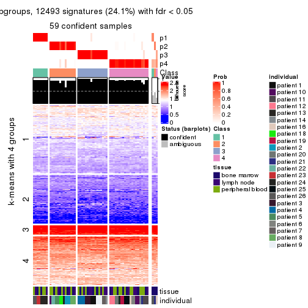</p>

</div>
<div id='tab-ATC-pam-get-signatures-no-scale-4'>
<pre><code class="r">get_signatures(res, k = 5, scale_rows = FALSE)
</code></pre>

<p>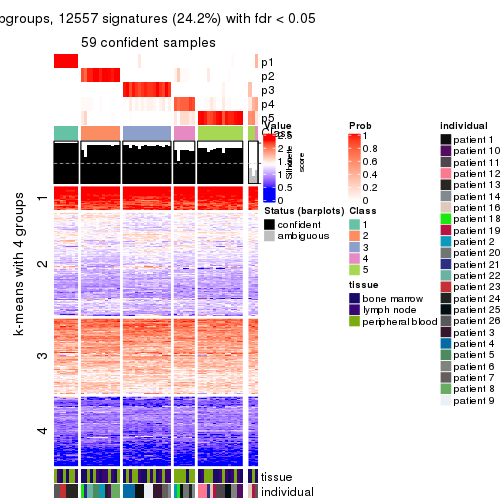</p>

</div>
<div id='tab-ATC-pam-get-signatures-no-scale-5'>
<pre><code class="r">get_signatures(res, k = 6, scale_rows = FALSE)
</code></pre>

<p>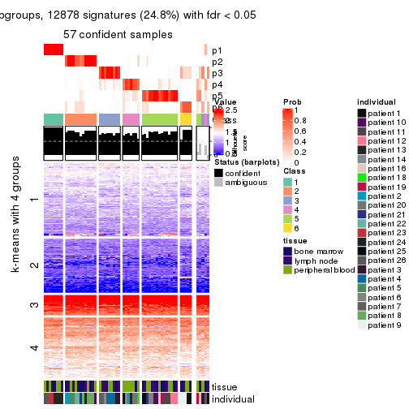</p>

</div>
</div>


Compare the overlap of signatures from different k:

```r
compare_signatures(res)
```

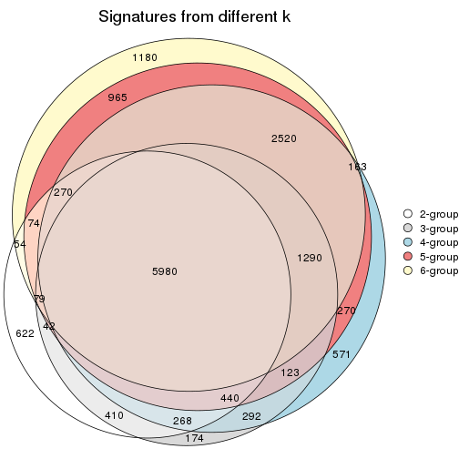

`get_signature()` returns a data frame invisibly. TO get the list of signatures, the function
call should be assigned to a variable explicitly. In following code, if `plot` argument is set
to `FALSE`, no heatmap is plotted while only the differential analysis is performed.

```r
# code only for demonstration
tb = get_signature(res, k = ..., plot = FALSE)
```

An example of the output of `tb` is:

```
#>   which_row         fdr    mean_1    mean_2 scaled_mean_1 scaled_mean_2 km
#> 1        38 0.042760348  8.373488  9.131774    -0.5533452     0.5164555  1
#> 2        40 0.018707592  7.106213  8.469186    -0.6173731     0.5762149  1
#> 3        55 0.019134737 10.221463 11.207825    -0.6159697     0.5749050  1
#> 4        59 0.006059896  5.921854  7.869574    -0.6899429     0.6439467  1
#> 5        60 0.018055526  8.928898 10.211722    -0.6204761     0.5791110  1
#> 6        98 0.009384629 15.714769 14.887706     0.6635654    -0.6193277  2
...
```

The columns in `tb` are:

1. `which_row`: row indices corresponding to the input matrix.
2. `fdr`: FDR for the differential test. 
3. `mean_x`: The mean value in group x.
4. `scaled_mean_x`: The mean value in group x after rows are scaled.
5. `km`: Row groups if k-means clustering is applied to rows.


UMAP plot which shows how samples are separated.


<script>
$( function() {
	$( '#tabs-ATC-pam-dimension-reduction' ).tabs();
} );
</script>
<div id='tabs-ATC-pam-dimension-reduction'>
<ul>
<li><a href='#tab-ATC-pam-dimension-reduction-1'>k = 2</a></li>
<li><a href='#tab-ATC-pam-dimension-reduction-2'>k = 3</a></li>
<li><a href='#tab-ATC-pam-dimension-reduction-3'>k = 4</a></li>
<li><a href='#tab-ATC-pam-dimension-reduction-4'>k = 5</a></li>
<li><a href='#tab-ATC-pam-dimension-reduction-5'>k = 6</a></li>
</ul>
<div id='tab-ATC-pam-dimension-reduction-1'>
<pre><code class="r">dimension_reduction(res, k = 2, method = &quot;UMAP&quot;)
</code></pre>

<p>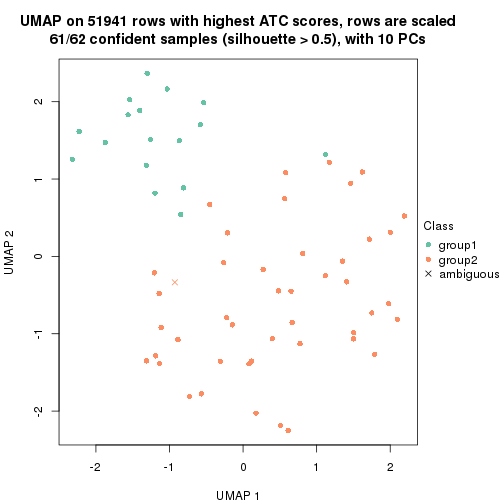</p>

</div>
<div id='tab-ATC-pam-dimension-reduction-2'>
<pre><code class="r">dimension_reduction(res, k = 3, method = &quot;UMAP&quot;)
</code></pre>

<p>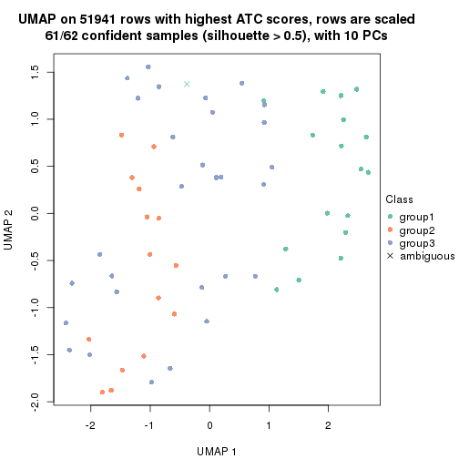</p>

</div>
<div id='tab-ATC-pam-dimension-reduction-3'>
<pre><code class="r">dimension_reduction(res, k = 4, method = &quot;UMAP&quot;)
</code></pre>

<p>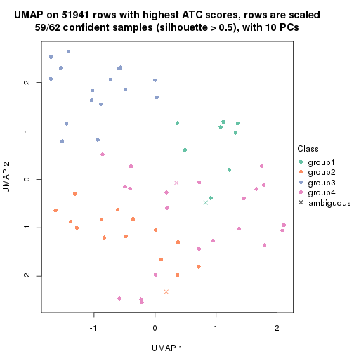</p>

</div>
<div id='tab-ATC-pam-dimension-reduction-4'>
<pre><code class="r">dimension_reduction(res, k = 5, method = &quot;UMAP&quot;)
</code></pre>

<p>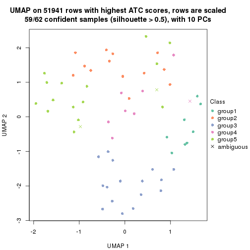</p>

</div>
<div id='tab-ATC-pam-dimension-reduction-5'>
<pre><code class="r">dimension_reduction(res, k = 6, method = &quot;UMAP&quot;)
</code></pre>

<p>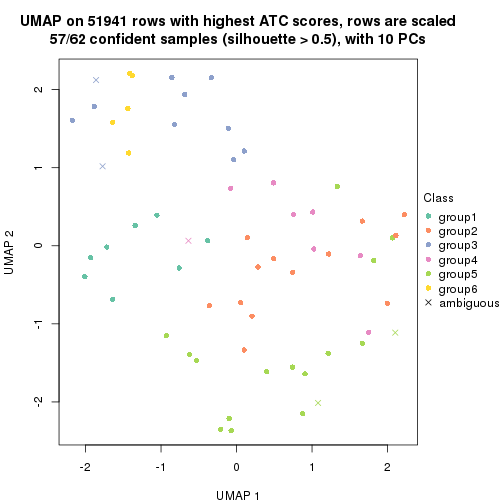</p>

</div>
</div>


Following heatmap shows how subgroups are split when increasing `k`:

```r
collect_classes(res)
```

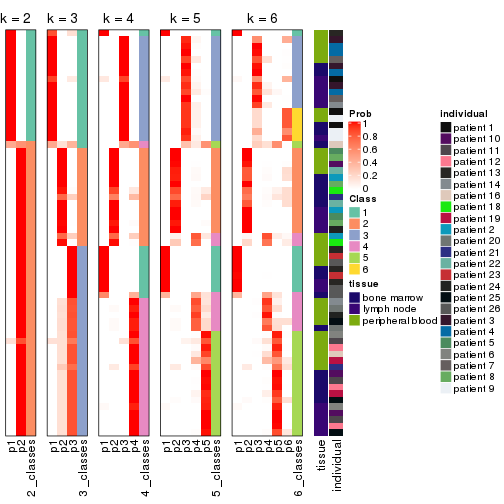


Test correlation between subgroups and known annotations. If the known
annotation is numeric, one-way ANOVA test is applied, and if the known
annotation is discrete, chi-squared contingency table test is applied.

```r
test_to_known_factors(res)
```

```
#>          n tissue(p) individual(p) k
#> ATC:pam 61     0.683      2.09e-04 2
#> ATC:pam 61     0.931      1.86e-06 3
#> ATC:pam 59     0.986      6.56e-10 4
#> ATC:pam 59     0.457      8.12e-09 5
#> ATC:pam 57     0.567      9.40e-11 6
```


If matrix rows can be associated to genes, consider to use `functional_enrichment(res,
...)` to perform function enrichment for the signature genes. See [this vignette](http://bioconductor.org/packages/devel/bioc/vignettes/cola/inst/doc/functional_enrichment.html) for more detailed explanations.


 

---------------------------------------------------


### ATC:mclust


The object with results only for a single top-value method and a single partition method 
can be extracted as:

```r
res = res_list["ATC", "mclust"]
# you can also extract it by
# res = res_list["ATC:mclust"]
```

A summary of `res` and all the functions that can be applied to it:

```r
res
```

```
#> A 'ConsensusPartition' object with k = 2, 3, 4, 5, 6.
#>   On a matrix with 51941 rows and 62 columns.
#>   Top rows (1000, 2000, 3000, 4000, 5000) are extracted by 'ATC' method.
#>   Subgroups are detected by 'mclust' method.
#>   Performed in total 1250 partitions by row resampling.
#>   Best k for subgroups seems to be 4.
#> 
#> Following methods can be applied to this 'ConsensusPartition' object:
#>  [1] "cola_report"             "collect_classes"         "collect_plots"          
#>  [4] "collect_stats"           "colnames"                "compare_signatures"     
#>  [7] "consensus_heatmap"       "dimension_reduction"     "functional_enrichment"  
#> [10] "get_anno_col"            "get_anno"                "get_classes"            
#> [13] "get_consensus"           "get_matrix"              "get_membership"         
#> [16] "get_param"               "get_signatures"          "get_stats"              
#> [19] "is_best_k"               "is_stable_k"             "membership_heatmap"     
#> [22] "ncol"                    "nrow"                    "plot_ecdf"              
#> [25] "rownames"                "select_partition_number" "show"                   
#> [28] "suggest_best_k"          "test_to_known_factors"
```

`collect_plots()` function collects all the plots made from `res` for all `k` (number of partitions)
into one single page to provide an easy and fast comparison between different `k`.

```r
collect_plots(res)
```

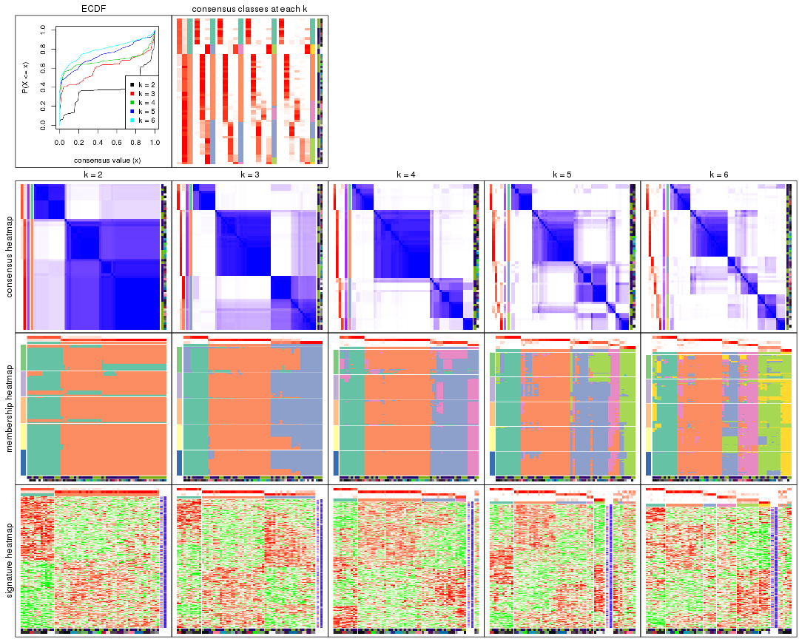

The plots are:

- The first row: a plot of the ECDF (empirical cumulative distribution
  function) curves of the consensus matrix for each `k` and the heatmap of
  predicted classes for each `k`.
- The second row: heatmaps of the consensus matrix for each `k`.
- The third row: heatmaps of the membership matrix for each `k`.
- The fouth row: heatmaps of the signatures for each `k`.

All the plots in panels can be made by individual functions and they are
plotted later in this section.

`select_partition_number()` produces several plots showing different
statistics for choosing "optimized" `k`. There are following statistics:

- ECDF curves of the consensus matrix for each `k`;
- 1-PAC. [The PAC
  score](https://en.wikipedia.org/wiki/Consensus_clustering#Over-interpretation_potential_of_consensus_clustering)
  measures the proportion of the ambiguous subgrouping.
- Mean silhouette score.
- Concordance. The mean probability of fiting the consensus class ids in all
  partitions.
- Area increased. Denote $A_k$ as the area under the ECDF curve for current
  `k`, the area increased is defined as $A_k - A_{k-1}$.
- Rand index. The percent of pairs of samples that are both in a same cluster
  or both are not in a same cluster in the partition of k and k-1.
- Jaccard index. The ratio of pairs of samples are both in a same cluster in
  the partition of k and k-1 and the pairs of samples are both in a same
  cluster in the partition k or k-1.

The detailed explanations of these statistics can be found in [the _cola_
vignette](http://bioconductor.org/packages/devel/bioc/vignettes/cola/inst/doc/cola.html#toc_13).

Generally speaking, lower PAC score, higher mean silhouette score or higher
concordance corresponds to better partition. Rand index and Jaccard index
measure how similar the current partition is compared to partition with `k-1`.
If they are too similar, we won't accept `k` is better than `k-1`.

```r
select_partition_number(res)
```

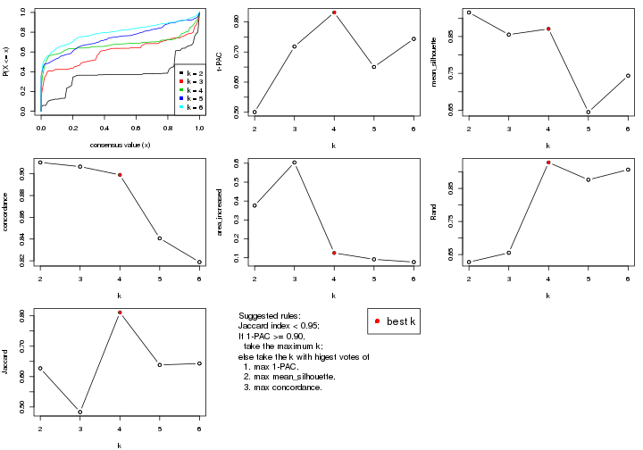

The numeric values for all these statistics can be obtained by `get_stats()`.

```r
get_stats(res)
```

```
#>   k 1-PAC mean_silhouette concordance area_increased  Rand Jaccard
#> 2 2 0.501           0.915       0.910         0.3761 0.627   0.627
#> 3 3 0.718           0.855       0.907         0.6041 0.655   0.483
#> 4 4 0.831           0.871       0.899         0.1252 0.929   0.811
#> 5 5 0.650           0.645       0.841         0.0915 0.876   0.638
#> 6 6 0.743           0.744       0.819         0.0770 0.907   0.643
```

`suggest_best_k()` suggests the best $k$ based on these statistics. The rules are as follows:

- All $k$ with Jaccard index larger than 0.95 are removed because increasing
  $k$ does not provide enough extra information. If all $k$ are removed, it is
  marked as no subgroup is detected.
- For all $k$ with 1-PAC score larger than 0.9, the maximal $k$ is taken as
  the best $k$, and other $k$ are marked as optional $k$.
- If it does not fit the second rule. The $k$ with the maximal vote of the
  highest 1-PAC score, highest mean silhouette, and highest concordance is
  taken as the best $k$.

```r
suggest_best_k(res)
```

```
#> [1] 4
```


Following shows the table of the partitions (You need to click the **show/hide
code output** link to see it). The membership matrix (columns with name `p*`)
is inferred by
[`clue::cl_consensus()`](https://www.rdocumentation.org/link/cl_consensus?package=clue)
function with the `SE` method. Basically the value in the membership matrix
represents the probability to belong to a certain group. The finall class
label for an item is determined with the group with highest probability it
belongs to.

In `get_classes()` function, the entropy is calculated from the membership
matrix and the silhouette score is calculated from the consensus matrix.


<script>
$( function() {
	$( '#tabs-ATC-mclust-get-classes' ).tabs();
} );
</script>
<div id='tabs-ATC-mclust-get-classes'>
<ul>
<li><a href='#tab-ATC-mclust-get-classes-1'>k = 2</a></li>
<li><a href='#tab-ATC-mclust-get-classes-2'>k = 3</a></li>
<li><a href='#tab-ATC-mclust-get-classes-3'>k = 4</a></li>
<li><a href='#tab-ATC-mclust-get-classes-4'>k = 5</a></li>
<li><a href='#tab-ATC-mclust-get-classes-5'>k = 6</a></li>
</ul>

<div id='tab-ATC-mclust-get-classes-1'>
<p><a id='tab-ATC-mclust-get-classes-1-a' style='color:#0366d6' href='#'>show/hide code output</a></p>
<pre><code class="r">cbind(get_classes(res, k = 2), get_membership(res, k = 2))
</code></pre>

<pre><code>#&gt;           class entropy silhouette    p1    p2
#&gt; GSM525314     1   0.722      0.969 0.800 0.200
#&gt; GSM525315     2   0.634      0.866 0.160 0.840
#&gt; GSM525316     2   0.000      0.924 0.000 1.000
#&gt; GSM525317     2   0.000      0.924 0.000 1.000
#&gt; GSM525318     2   0.000      0.924 0.000 1.000
#&gt; GSM525319     2   0.634      0.866 0.160 0.840
#&gt; GSM525320     2   0.000      0.924 0.000 1.000
#&gt; GSM525321     2   0.000      0.924 0.000 1.000
#&gt; GSM525322     2   0.634      0.866 0.160 0.840
#&gt; GSM525323     1   0.722      0.969 0.800 0.200
#&gt; GSM525324     2   0.615      0.871 0.152 0.848
#&gt; GSM525325     2   0.000      0.924 0.000 1.000
#&gt; GSM525326     2   0.000      0.924 0.000 1.000
#&gt; GSM525327     1   0.714      0.971 0.804 0.196
#&gt; GSM525328     1   0.634      0.976 0.840 0.160
#&gt; GSM525329     2   0.000      0.924 0.000 1.000
#&gt; GSM525330     2   0.000      0.924 0.000 1.000
#&gt; GSM525331     2   0.634      0.866 0.160 0.840
#&gt; GSM525332     2   0.000      0.924 0.000 1.000
#&gt; GSM525333     2   0.184      0.910 0.028 0.972
#&gt; GSM525334     2   0.000      0.924 0.000 1.000
#&gt; GSM525335     2   0.625      0.869 0.156 0.844
#&gt; GSM525336     1   0.634      0.976 0.840 0.160
#&gt; GSM525337     2   0.000      0.924 0.000 1.000
#&gt; GSM525338     2   0.625      0.869 0.156 0.844
#&gt; GSM525339     1   0.634      0.976 0.840 0.160
#&gt; GSM525340     1   0.714      0.971 0.804 0.196
#&gt; GSM525341     2   0.634      0.866 0.160 0.840
#&gt; GSM525342     2   0.000      0.924 0.000 1.000
#&gt; GSM525343     2   0.000      0.924 0.000 1.000
#&gt; GSM525344     2   0.634      0.866 0.160 0.840
#&gt; GSM525345     1   0.760      0.948 0.780 0.220
#&gt; GSM525346     2   0.224      0.904 0.036 0.964
#&gt; GSM525347     2   0.416      0.900 0.084 0.916
#&gt; GSM525348     2   0.000      0.924 0.000 1.000
#&gt; GSM525349     1   0.634      0.976 0.840 0.160
#&gt; GSM525350     2   0.000      0.924 0.000 1.000
#&gt; GSM525351     2   0.634      0.866 0.160 0.840
#&gt; GSM525352     2   0.224      0.904 0.036 0.964
#&gt; GSM525353     2   0.118      0.917 0.016 0.984
#&gt; GSM525354     2   0.634      0.866 0.160 0.840
#&gt; GSM525355     2   0.625      0.869 0.156 0.844
#&gt; GSM525356     1   0.634      0.976 0.840 0.160
#&gt; GSM525357     2   0.625      0.869 0.156 0.844
#&gt; GSM525358     1   0.634      0.976 0.840 0.160
#&gt; GSM525359     1   0.714      0.971 0.804 0.196
#&gt; GSM525360     2   0.634      0.866 0.160 0.840
#&gt; GSM525361     2   0.000      0.924 0.000 1.000
#&gt; GSM525362     2   0.000      0.924 0.000 1.000
#&gt; GSM525363     2   0.000      0.924 0.000 1.000
#&gt; GSM525364     2   0.224      0.904 0.036 0.964
#&gt; GSM525365     2   0.184      0.904 0.028 0.972
#&gt; GSM525366     2   0.000      0.924 0.000 1.000
#&gt; GSM525367     1   0.722      0.969 0.800 0.200
#&gt; GSM525368     2   0.224      0.904 0.036 0.964
#&gt; GSM525369     2   0.000      0.924 0.000 1.000
#&gt; GSM525370     2   0.000      0.924 0.000 1.000
#&gt; GSM525371     1   0.634      0.976 0.840 0.160
#&gt; GSM525372     2   0.722      0.650 0.200 0.800
#&gt; GSM525373     2   0.506      0.889 0.112 0.888
#&gt; GSM525374     2   0.278      0.913 0.048 0.952
#&gt; GSM525375     1   0.634      0.976 0.840 0.160
</code></pre>

<script>
$('#tab-ATC-mclust-get-classes-1-a').parent().next().next().hide();
$('#tab-ATC-mclust-get-classes-1-a').click(function(){
  $('#tab-ATC-mclust-get-classes-1-a').parent().next().next().toggle();
  return(false);
});
</script>
</div>

<div id='tab-ATC-mclust-get-classes-2'>
<p><a id='tab-ATC-mclust-get-classes-2-a' style='color:#0366d6' href='#'>show/hide code output</a></p>
<pre><code class="r">cbind(get_classes(res, k = 3), get_membership(res, k = 3))
</code></pre>

<pre><code>#&gt;           class entropy silhouette    p1    p2    p3
#&gt; GSM525314     3  0.0000      0.728 0.000 0.000 1.000
#&gt; GSM525315     2  0.0000      0.967 0.000 1.000 0.000
#&gt; GSM525316     3  0.0000      0.728 0.000 0.000 1.000
#&gt; GSM525317     3  0.0475      0.730 0.004 0.004 0.992
#&gt; GSM525318     3  0.0000      0.728 0.000 0.000 1.000
#&gt; GSM525319     2  0.0000      0.967 0.000 1.000 0.000
#&gt; GSM525320     3  0.7080      0.569 0.024 0.412 0.564
#&gt; GSM525321     3  0.5070      0.770 0.004 0.224 0.772
#&gt; GSM525322     2  0.0000      0.967 0.000 1.000 0.000
#&gt; GSM525323     3  0.0000      0.728 0.000 0.000 1.000
#&gt; GSM525324     2  0.0892      0.958 0.000 0.980 0.020
#&gt; GSM525325     3  0.5365      0.761 0.004 0.252 0.744
#&gt; GSM525326     2  0.5325      0.649 0.004 0.748 0.248
#&gt; GSM525327     1  0.4702      0.839 0.788 0.000 0.212
#&gt; GSM525328     1  0.0424      0.942 0.992 0.000 0.008
#&gt; GSM525329     3  0.6148      0.692 0.004 0.356 0.640
#&gt; GSM525330     3  0.6673      0.697 0.020 0.344 0.636
#&gt; GSM525331     2  0.0000      0.967 0.000 1.000 0.000
#&gt; GSM525332     2  0.1289      0.960 0.032 0.968 0.000
#&gt; GSM525333     2  0.1411      0.958 0.036 0.964 0.000
#&gt; GSM525334     2  0.0983      0.962 0.004 0.980 0.016
#&gt; GSM525335     2  0.0000      0.967 0.000 1.000 0.000
#&gt; GSM525336     1  0.1289      0.930 0.968 0.000 0.032
#&gt; GSM525337     2  0.1482      0.957 0.012 0.968 0.020
#&gt; GSM525338     2  0.0592      0.966 0.012 0.988 0.000
#&gt; GSM525339     1  0.0424      0.942 0.992 0.000 0.008
#&gt; GSM525340     1  0.4702      0.839 0.788 0.000 0.212
#&gt; GSM525341     2  0.0000      0.967 0.000 1.000 0.000
#&gt; GSM525342     3  0.0000      0.728 0.000 0.000 1.000
#&gt; GSM525343     3  0.4465      0.768 0.004 0.176 0.820
#&gt; GSM525344     2  0.0000      0.967 0.000 1.000 0.000
#&gt; GSM525345     3  0.0000      0.728 0.000 0.000 1.000
#&gt; GSM525346     3  0.6796      0.694 0.024 0.344 0.632
#&gt; GSM525347     2  0.1453      0.959 0.024 0.968 0.008
#&gt; GSM525348     2  0.1905      0.952 0.028 0.956 0.016
#&gt; GSM525349     1  0.0424      0.942 0.992 0.000 0.008
#&gt; GSM525350     3  0.5365      0.761 0.004 0.252 0.744
#&gt; GSM525351     2  0.0000      0.967 0.000 1.000 0.000
#&gt; GSM525352     2  0.1529      0.956 0.040 0.960 0.000
#&gt; GSM525353     2  0.1411      0.958 0.036 0.964 0.000
#&gt; GSM525354     2  0.0000      0.967 0.000 1.000 0.000
#&gt; GSM525355     2  0.0000      0.967 0.000 1.000 0.000
#&gt; GSM525356     1  0.0424      0.942 0.992 0.000 0.008
#&gt; GSM525357     2  0.0000      0.967 0.000 1.000 0.000
#&gt; GSM525358     1  0.0424      0.942 0.992 0.000 0.008
#&gt; GSM525359     1  0.4702      0.839 0.788 0.000 0.212
#&gt; GSM525360     2  0.0000      0.967 0.000 1.000 0.000
#&gt; GSM525361     3  0.6081      0.705 0.004 0.344 0.652
#&gt; GSM525362     3  0.6081      0.705 0.004 0.344 0.652
#&gt; GSM525363     2  0.0661      0.965 0.004 0.988 0.008
#&gt; GSM525364     3  0.7694      0.713 0.076 0.292 0.632
#&gt; GSM525365     3  0.0000      0.728 0.000 0.000 1.000
#&gt; GSM525366     2  0.2772      0.889 0.004 0.916 0.080
#&gt; GSM525367     3  0.0000      0.728 0.000 0.000 1.000
#&gt; GSM525368     3  0.6796      0.694 0.024 0.344 0.632
#&gt; GSM525369     3  0.6189      0.680 0.004 0.364 0.632
#&gt; GSM525370     2  0.3889      0.871 0.032 0.884 0.084
#&gt; GSM525371     1  0.0424      0.942 0.992 0.000 0.008
#&gt; GSM525372     3  0.0237      0.728 0.004 0.000 0.996
#&gt; GSM525373     2  0.0424      0.966 0.000 0.992 0.008
#&gt; GSM525374     2  0.1399      0.960 0.028 0.968 0.004
#&gt; GSM525375     1  0.0424      0.942 0.992 0.000 0.008
</code></pre>

<script>
$('#tab-ATC-mclust-get-classes-2-a').parent().next().next().hide();
$('#tab-ATC-mclust-get-classes-2-a').click(function(){
  $('#tab-ATC-mclust-get-classes-2-a').parent().next().next().toggle();
  return(false);
});
</script>
</div>

<div id='tab-ATC-mclust-get-classes-3'>
<p><a id='tab-ATC-mclust-get-classes-3-a' style='color:#0366d6' href='#'>show/hide code output</a></p>
<pre><code class="r">cbind(get_classes(res, k = 4), get_membership(res, k = 4))
</code></pre>

<pre><code>#&gt;           class entropy silhouette    p1    p2    p3    p4
#&gt; GSM525314     4  0.2412      0.993 0.008 0.000 0.084 0.908
#&gt; GSM525315     2  0.0000      0.968 0.000 1.000 0.000 0.000
#&gt; GSM525316     3  0.4720      0.540 0.004 0.000 0.672 0.324
#&gt; GSM525317     3  0.2011      0.799 0.000 0.000 0.920 0.080
#&gt; GSM525318     3  0.2011      0.799 0.000 0.000 0.920 0.080
#&gt; GSM525319     2  0.0000      0.968 0.000 1.000 0.000 0.000
#&gt; GSM525320     3  0.5206      0.490 0.024 0.308 0.668 0.000
#&gt; GSM525321     3  0.2011      0.799 0.000 0.000 0.920 0.080
#&gt; GSM525322     2  0.0000      0.968 0.000 1.000 0.000 0.000
#&gt; GSM525323     4  0.2412      0.993 0.008 0.000 0.084 0.908
#&gt; GSM525324     2  0.0336      0.967 0.000 0.992 0.008 0.000
#&gt; GSM525325     3  0.2197      0.800 0.004 0.000 0.916 0.080
#&gt; GSM525326     2  0.2596      0.926 0.024 0.908 0.068 0.000
#&gt; GSM525327     1  0.1706      0.907 0.948 0.000 0.016 0.036
#&gt; GSM525328     1  0.0000      0.921 1.000 0.000 0.000 0.000
#&gt; GSM525329     2  0.3606      0.844 0.024 0.844 0.132 0.000
#&gt; GSM525330     3  0.3711      0.701 0.024 0.140 0.836 0.000
#&gt; GSM525331     2  0.0000      0.968 0.000 1.000 0.000 0.000
#&gt; GSM525332     2  0.1674      0.959 0.012 0.952 0.004 0.032
#&gt; GSM525333     2  0.1824      0.951 0.000 0.936 0.004 0.060
#&gt; GSM525334     2  0.1174      0.963 0.012 0.968 0.020 0.000
#&gt; GSM525335     2  0.0000      0.968 0.000 1.000 0.000 0.000
#&gt; GSM525336     1  0.0000      0.921 1.000 0.000 0.000 0.000
#&gt; GSM525337     2  0.2115      0.953 0.024 0.936 0.004 0.036
#&gt; GSM525338     2  0.1042      0.964 0.020 0.972 0.000 0.008
#&gt; GSM525339     1  0.0188      0.919 0.996 0.004 0.000 0.000
#&gt; GSM525340     1  0.4799      0.729 0.744 0.000 0.032 0.224
#&gt; GSM525341     2  0.0000      0.968 0.000 1.000 0.000 0.000
#&gt; GSM525342     3  0.4585      0.533 0.000 0.000 0.668 0.332
#&gt; GSM525343     3  0.2011      0.799 0.000 0.000 0.920 0.080
#&gt; GSM525344     2  0.0000      0.968 0.000 1.000 0.000 0.000
#&gt; GSM525345     4  0.2412      0.993 0.008 0.000 0.084 0.908
#&gt; GSM525346     3  0.1305      0.775 0.036 0.004 0.960 0.000
#&gt; GSM525347     2  0.1284      0.960 0.024 0.964 0.012 0.000
#&gt; GSM525348     2  0.1520      0.956 0.024 0.956 0.020 0.000
#&gt; GSM525349     1  0.0000      0.921 1.000 0.000 0.000 0.000
#&gt; GSM525350     3  0.2706      0.798 0.020 0.000 0.900 0.080
#&gt; GSM525351     2  0.0000      0.968 0.000 1.000 0.000 0.000
#&gt; GSM525352     2  0.1824      0.951 0.000 0.936 0.004 0.060
#&gt; GSM525353     2  0.1824      0.951 0.000 0.936 0.004 0.060
#&gt; GSM525354     2  0.0000      0.968 0.000 1.000 0.000 0.000
#&gt; GSM525355     2  0.0336      0.967 0.000 0.992 0.008 0.000
#&gt; GSM525356     1  0.0000      0.921 1.000 0.000 0.000 0.000
#&gt; GSM525357     2  0.0000      0.968 0.000 1.000 0.000 0.000
#&gt; GSM525358     1  0.0592      0.911 0.984 0.016 0.000 0.000
#&gt; GSM525359     1  0.4538      0.750 0.760 0.000 0.024 0.216
#&gt; GSM525360     2  0.0000      0.968 0.000 1.000 0.000 0.000
#&gt; GSM525361     3  0.2011      0.799 0.000 0.000 0.920 0.080
#&gt; GSM525362     3  0.1305      0.775 0.036 0.004 0.960 0.000
#&gt; GSM525363     2  0.0927      0.965 0.016 0.976 0.008 0.000
#&gt; GSM525364     3  0.1305      0.775 0.036 0.004 0.960 0.000
#&gt; GSM525365     3  0.4720      0.543 0.004 0.000 0.672 0.324
#&gt; GSM525366     2  0.3143      0.891 0.024 0.876 0.100 0.000
#&gt; GSM525367     4  0.2412      0.993 0.008 0.000 0.084 0.908
#&gt; GSM525368     3  0.1305      0.775 0.036 0.004 0.960 0.000
#&gt; GSM525369     3  0.5901      0.248 0.036 0.432 0.532 0.000
#&gt; GSM525370     2  0.3308      0.897 0.036 0.872 0.092 0.000
#&gt; GSM525371     1  0.3370      0.878 0.872 0.000 0.080 0.048
#&gt; GSM525372     4  0.2773      0.970 0.028 0.000 0.072 0.900
#&gt; GSM525373     2  0.0524      0.967 0.004 0.988 0.008 0.000
#&gt; GSM525374     2  0.1004      0.963 0.024 0.972 0.004 0.000
#&gt; GSM525375     1  0.3370      0.878 0.872 0.000 0.080 0.048
</code></pre>

<script>
$('#tab-ATC-mclust-get-classes-3-a').parent().next().next().hide();
$('#tab-ATC-mclust-get-classes-3-a').click(function(){
  $('#tab-ATC-mclust-get-classes-3-a').parent().next().next().toggle();
  return(false);
});
</script>
</div>

<div id='tab-ATC-mclust-get-classes-4'>
<p><a id='tab-ATC-mclust-get-classes-4-a' style='color:#0366d6' href='#'>show/hide code output</a></p>
<pre><code class="r">cbind(get_classes(res, k = 5), get_membership(res, k = 5))
</code></pre>

<pre><code>#&gt;           class entropy silhouette    p1    p2    p3    p4    p5
#&gt; GSM525314     5  0.0000    0.76621 0.000 0.000 0.000 0.000 1.000
#&gt; GSM525315     2  0.0771    0.82903 0.004 0.976 0.000 0.020 0.000
#&gt; GSM525316     5  0.4235    0.16458 0.000 0.000 0.424 0.000 0.576
#&gt; GSM525317     3  0.3336    0.66365 0.000 0.000 0.772 0.000 0.228
#&gt; GSM525318     3  0.3366    0.65875 0.000 0.000 0.768 0.000 0.232
#&gt; GSM525319     2  0.0000    0.83414 0.000 1.000 0.000 0.000 0.000
#&gt; GSM525320     3  0.3391    0.56258 0.000 0.188 0.800 0.012 0.000
#&gt; GSM525321     3  0.3336    0.66365 0.000 0.000 0.772 0.000 0.228
#&gt; GSM525322     2  0.0000    0.83414 0.000 1.000 0.000 0.000 0.000
#&gt; GSM525323     5  0.0000    0.76621 0.000 0.000 0.000 0.000 1.000
#&gt; GSM525324     2  0.3080    0.73396 0.004 0.852 0.124 0.020 0.000
#&gt; GSM525325     3  0.3336    0.66365 0.000 0.000 0.772 0.000 0.228
#&gt; GSM525326     4  0.7269    0.06649 0.000 0.068 0.208 0.524 0.200
#&gt; GSM525327     1  0.0609    0.89148 0.980 0.000 0.000 0.000 0.020
#&gt; GSM525328     1  0.0162    0.89873 0.996 0.000 0.004 0.000 0.000
#&gt; GSM525329     3  0.7166    0.13501 0.000 0.352 0.444 0.040 0.164
#&gt; GSM525330     3  0.4264    0.61978 0.000 0.148 0.788 0.020 0.044
#&gt; GSM525331     2  0.0671    0.83049 0.004 0.980 0.000 0.016 0.000
#&gt; GSM525332     2  0.4276    0.18524 0.000 0.616 0.004 0.380 0.000
#&gt; GSM525333     4  0.4219    0.40728 0.000 0.416 0.000 0.584 0.000
#&gt; GSM525334     2  0.3837    0.51966 0.000 0.692 0.308 0.000 0.000
#&gt; GSM525335     2  0.0000    0.83414 0.000 1.000 0.000 0.000 0.000
#&gt; GSM525336     1  0.0162    0.89873 0.996 0.000 0.004 0.000 0.000
#&gt; GSM525337     4  0.5218    0.55489 0.000 0.336 0.060 0.604 0.000
#&gt; GSM525338     2  0.1205    0.82077 0.004 0.956 0.000 0.040 0.000
#&gt; GSM525339     1  0.0162    0.89873 0.996 0.000 0.004 0.000 0.000
#&gt; GSM525340     1  0.3424    0.67329 0.760 0.000 0.000 0.000 0.240
#&gt; GSM525341     2  0.0162    0.83368 0.004 0.996 0.000 0.000 0.000
#&gt; GSM525342     5  0.4227    0.17317 0.000 0.000 0.420 0.000 0.580
#&gt; GSM525343     3  0.3336    0.66365 0.000 0.000 0.772 0.000 0.228
#&gt; GSM525344     2  0.0000    0.83414 0.000 1.000 0.000 0.000 0.000
#&gt; GSM525345     5  0.0404    0.76736 0.000 0.000 0.012 0.000 0.988
#&gt; GSM525346     3  0.0162    0.63971 0.004 0.000 0.996 0.000 0.000
#&gt; GSM525347     2  0.3910    0.61875 0.000 0.772 0.196 0.032 0.000
#&gt; GSM525348     2  0.5707    0.36414 0.000 0.624 0.216 0.160 0.000
#&gt; GSM525349     1  0.0162    0.89873 0.996 0.000 0.004 0.000 0.000
#&gt; GSM525350     3  0.3305    0.66519 0.000 0.000 0.776 0.000 0.224
#&gt; GSM525351     2  0.0000    0.83414 0.000 1.000 0.000 0.000 0.000
#&gt; GSM525352     4  0.1608    0.52564 0.000 0.072 0.000 0.928 0.000
#&gt; GSM525353     4  0.3561    0.62745 0.000 0.260 0.000 0.740 0.000
#&gt; GSM525354     2  0.0162    0.83368 0.004 0.996 0.000 0.000 0.000
#&gt; GSM525355     2  0.0290    0.83319 0.000 0.992 0.008 0.000 0.000
#&gt; GSM525356     1  0.0162    0.89873 0.996 0.000 0.004 0.000 0.000
#&gt; GSM525357     2  0.1041    0.82445 0.004 0.964 0.000 0.032 0.000
#&gt; GSM525358     1  0.0162    0.89873 0.996 0.000 0.004 0.000 0.000
#&gt; GSM525359     1  0.3720    0.69086 0.760 0.000 0.012 0.000 0.228
#&gt; GSM525360     2  0.0000    0.83414 0.000 1.000 0.000 0.000 0.000
#&gt; GSM525361     3  0.3274    0.66666 0.000 0.000 0.780 0.000 0.220
#&gt; GSM525362     3  0.0162    0.64070 0.000 0.000 0.996 0.000 0.004
#&gt; GSM525363     2  0.4014    0.55772 0.016 0.728 0.256 0.000 0.000
#&gt; GSM525364     3  0.0162    0.63971 0.004 0.000 0.996 0.000 0.000
#&gt; GSM525365     3  0.4306    0.00313 0.000 0.000 0.508 0.000 0.492
#&gt; GSM525366     2  0.4726    0.31236 0.020 0.580 0.400 0.000 0.000
#&gt; GSM525367     5  0.0000    0.76621 0.000 0.000 0.000 0.000 1.000
#&gt; GSM525368     3  0.0162    0.63971 0.004 0.000 0.996 0.000 0.000
#&gt; GSM525369     3  0.5182    0.63476 0.004 0.112 0.740 0.024 0.120
#&gt; GSM525370     3  0.6606   -0.37200 0.000 0.364 0.420 0.216 0.000
#&gt; GSM525371     1  0.3427    0.78453 0.796 0.000 0.192 0.000 0.012
#&gt; GSM525372     5  0.2616    0.71573 0.020 0.000 0.100 0.000 0.880
#&gt; GSM525373     2  0.1117    0.82392 0.000 0.964 0.020 0.016 0.000
#&gt; GSM525374     2  0.3019    0.74916 0.000 0.864 0.088 0.048 0.000
#&gt; GSM525375     1  0.3427    0.78453 0.796 0.000 0.192 0.000 0.012
</code></pre>

<script>
$('#tab-ATC-mclust-get-classes-4-a').parent().next().next().hide();
$('#tab-ATC-mclust-get-classes-4-a').click(function(){
  $('#tab-ATC-mclust-get-classes-4-a').parent().next().next().toggle();
  return(false);
});
</script>
</div>

<div id='tab-ATC-mclust-get-classes-5'>
<p><a id='tab-ATC-mclust-get-classes-5-a' style='color:#0366d6' href='#'>show/hide code output</a></p>
<pre><code class="r">cbind(get_classes(res, k = 6), get_membership(res, k = 6))
</code></pre>

<pre><code>#&gt;           class entropy silhouette    p1    p2    p3    p4    p5    p6
#&gt; GSM525314     6  0.0000      0.950 0.000 0.000 0.000 0.000 0.000 1.000
#&gt; GSM525315     2  0.0653      0.877 0.000 0.980 0.004 0.004 0.012 0.000
#&gt; GSM525316     5  0.4797      0.698 0.000 0.000 0.064 0.000 0.580 0.356
#&gt; GSM525317     5  0.5481      0.819 0.000 0.000 0.232 0.000 0.568 0.200
#&gt; GSM525318     5  0.4783      0.770 0.000 0.000 0.088 0.000 0.636 0.276
#&gt; GSM525319     2  0.0146      0.879 0.000 0.996 0.000 0.000 0.004 0.000
#&gt; GSM525320     3  0.4837      0.652 0.004 0.176 0.716 0.032 0.072 0.000
#&gt; GSM525321     5  0.5372      0.831 0.000 0.004 0.172 0.000 0.604 0.220
#&gt; GSM525322     2  0.0363      0.879 0.000 0.988 0.000 0.000 0.012 0.000
#&gt; GSM525323     6  0.0000      0.950 0.000 0.000 0.000 0.000 0.000 1.000
#&gt; GSM525324     2  0.1765      0.857 0.000 0.924 0.024 0.000 0.052 0.000
#&gt; GSM525325     5  0.5552      0.829 0.000 0.004 0.200 0.000 0.576 0.220
#&gt; GSM525326     4  0.6066      0.649 0.024 0.088 0.032 0.688 0.084 0.084
#&gt; GSM525327     1  0.1141      0.828 0.948 0.000 0.000 0.000 0.052 0.000
#&gt; GSM525328     1  0.0000      0.842 1.000 0.000 0.000 0.000 0.000 0.000
#&gt; GSM525329     4  0.6762      0.576 0.008 0.212 0.072 0.556 0.140 0.012
#&gt; GSM525330     3  0.5670      0.647 0.004 0.152 0.672 0.056 0.108 0.008
#&gt; GSM525331     2  0.0291      0.879 0.000 0.992 0.004 0.000 0.004 0.000
#&gt; GSM525332     4  0.2146      0.760 0.004 0.116 0.000 0.880 0.000 0.000
#&gt; GSM525333     4  0.1387      0.764 0.000 0.068 0.000 0.932 0.000 0.000
#&gt; GSM525334     2  0.2821      0.804 0.004 0.860 0.096 0.000 0.040 0.000
#&gt; GSM525335     2  0.0000      0.879 0.000 1.000 0.000 0.000 0.000 0.000
#&gt; GSM525336     1  0.0146      0.842 0.996 0.000 0.000 0.004 0.000 0.000
#&gt; GSM525337     4  0.1925      0.765 0.008 0.060 0.004 0.920 0.008 0.000
#&gt; GSM525338     2  0.3844      0.446 0.000 0.676 0.004 0.312 0.008 0.000
#&gt; GSM525339     1  0.0713      0.838 0.972 0.000 0.000 0.028 0.000 0.000
#&gt; GSM525340     1  0.3961      0.306 0.556 0.000 0.000 0.000 0.004 0.440
#&gt; GSM525341     2  0.0291      0.879 0.000 0.992 0.004 0.000 0.004 0.000
#&gt; GSM525342     5  0.4684      0.675 0.000 0.000 0.052 0.000 0.576 0.372
#&gt; GSM525343     5  0.5419      0.831 0.000 0.000 0.200 0.000 0.580 0.220
#&gt; GSM525344     2  0.0146      0.879 0.000 0.996 0.000 0.000 0.004 0.000
#&gt; GSM525345     6  0.0547      0.939 0.000 0.000 0.000 0.000 0.020 0.980
#&gt; GSM525346     3  0.0436      0.760 0.004 0.000 0.988 0.004 0.000 0.004
#&gt; GSM525347     2  0.5406      0.346 0.004 0.620 0.028 0.272 0.076 0.000
#&gt; GSM525348     4  0.5800      0.551 0.004 0.312 0.040 0.564 0.080 0.000
#&gt; GSM525349     1  0.0000      0.842 1.000 0.000 0.000 0.000 0.000 0.000
#&gt; GSM525350     5  0.5576      0.827 0.000 0.004 0.204 0.000 0.572 0.220
#&gt; GSM525351     2  0.0146      0.879 0.000 0.996 0.000 0.000 0.004 0.000
#&gt; GSM525352     4  0.0260      0.722 0.000 0.008 0.000 0.992 0.000 0.000
#&gt; GSM525353     4  0.1010      0.750 0.000 0.036 0.000 0.960 0.004 0.000
#&gt; GSM525354     2  0.0291      0.879 0.000 0.992 0.004 0.000 0.004 0.000
#&gt; GSM525355     2  0.0547      0.874 0.000 0.980 0.000 0.000 0.020 0.000
#&gt; GSM525356     1  0.0363      0.842 0.988 0.000 0.000 0.012 0.000 0.000
#&gt; GSM525357     2  0.1555      0.847 0.000 0.932 0.004 0.060 0.004 0.000
#&gt; GSM525358     1  0.1204      0.825 0.944 0.000 0.000 0.056 0.000 0.000
#&gt; GSM525359     1  0.5535      0.182 0.472 0.000 0.016 0.000 0.084 0.428
#&gt; GSM525360     2  0.0146      0.879 0.000 0.996 0.000 0.000 0.004 0.000
#&gt; GSM525361     5  0.5412      0.713 0.004 0.000 0.324 0.000 0.552 0.120
#&gt; GSM525362     3  0.1340      0.738 0.008 0.000 0.948 0.000 0.040 0.004
#&gt; GSM525363     2  0.2776      0.803 0.004 0.860 0.104 0.000 0.032 0.000
#&gt; GSM525364     3  0.0551      0.756 0.008 0.000 0.984 0.000 0.004 0.004
#&gt; GSM525365     5  0.4842      0.734 0.000 0.000 0.076 0.000 0.600 0.324
#&gt; GSM525366     2  0.3384      0.755 0.004 0.808 0.156 0.004 0.028 0.000
#&gt; GSM525367     6  0.0000      0.950 0.000 0.000 0.000 0.000 0.000 1.000
#&gt; GSM525368     3  0.0436      0.760 0.004 0.000 0.988 0.004 0.000 0.004
#&gt; GSM525369     3  0.7140      0.328 0.004 0.184 0.496 0.216 0.088 0.012
#&gt; GSM525370     4  0.6301      0.545 0.004 0.208 0.200 0.548 0.040 0.000
#&gt; GSM525371     1  0.4270      0.735 0.740 0.000 0.100 0.000 0.156 0.004
#&gt; GSM525372     6  0.2581      0.810 0.016 0.000 0.000 0.000 0.128 0.856
#&gt; GSM525373     2  0.1812      0.842 0.004 0.924 0.008 0.060 0.004 0.000
#&gt; GSM525374     2  0.5673     -0.120 0.004 0.488 0.024 0.412 0.072 0.000
#&gt; GSM525375     1  0.4270      0.735 0.740 0.000 0.100 0.000 0.156 0.004
</code></pre>

<script>
$('#tab-ATC-mclust-get-classes-5-a').parent().next().next().hide();
$('#tab-ATC-mclust-get-classes-5-a').click(function(){
  $('#tab-ATC-mclust-get-classes-5-a').parent().next().next().toggle();
  return(false);
});
</script>
</div>
</div>

Heatmaps for the consensus matrix. It visualizes the probability of two
samples to be in a same group.


<script>
$( function() {
	$( '#tabs-ATC-mclust-consensus-heatmap' ).tabs();
} );
</script>
<div id='tabs-ATC-mclust-consensus-heatmap'>
<ul>
<li><a href='#tab-ATC-mclust-consensus-heatmap-1'>k = 2</a></li>
<li><a href='#tab-ATC-mclust-consensus-heatmap-2'>k = 3</a></li>
<li><a href='#tab-ATC-mclust-consensus-heatmap-3'>k = 4</a></li>
<li><a href='#tab-ATC-mclust-consensus-heatmap-4'>k = 5</a></li>
<li><a href='#tab-ATC-mclust-consensus-heatmap-5'>k = 6</a></li>
</ul>
<div id='tab-ATC-mclust-consensus-heatmap-1'>
<pre><code class="r">consensus_heatmap(res, k = 2)
</code></pre>

<p>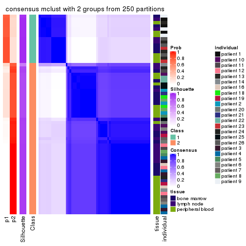</p>

</div>
<div id='tab-ATC-mclust-consensus-heatmap-2'>
<pre><code class="r">consensus_heatmap(res, k = 3)
</code></pre>

<p>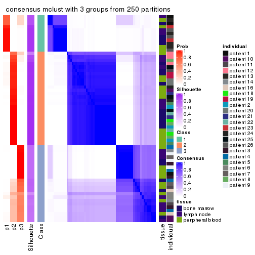</p>

</div>
<div id='tab-ATC-mclust-consensus-heatmap-3'>
<pre><code class="r">consensus_heatmap(res, k = 4)
</code></pre>

<p>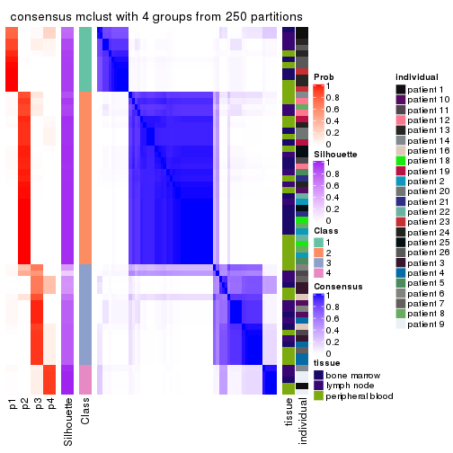</p>

</div>
<div id='tab-ATC-mclust-consensus-heatmap-4'>
<pre><code class="r">consensus_heatmap(res, k = 5)
</code></pre>

<p>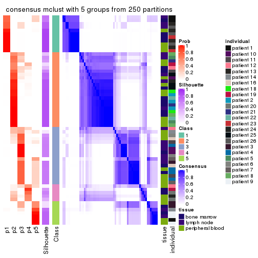</p>

</div>
<div id='tab-ATC-mclust-consensus-heatmap-5'>
<pre><code class="r">consensus_heatmap(res, k = 6)
</code></pre>

<p>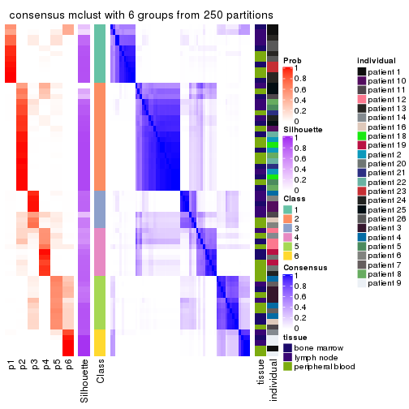</p>

</div>
</div>

Heatmaps for the membership of samples in all partitions to see how consistent they are:


<script>
$( function() {
	$( '#tabs-ATC-mclust-membership-heatmap' ).tabs();
} );
</script>
<div id='tabs-ATC-mclust-membership-heatmap'>
<ul>
<li><a href='#tab-ATC-mclust-membership-heatmap-1'>k = 2</a></li>
<li><a href='#tab-ATC-mclust-membership-heatmap-2'>k = 3</a></li>
<li><a href='#tab-ATC-mclust-membership-heatmap-3'>k = 4</a></li>
<li><a href='#tab-ATC-mclust-membership-heatmap-4'>k = 5</a></li>
<li><a href='#tab-ATC-mclust-membership-heatmap-5'>k = 6</a></li>
</ul>
<div id='tab-ATC-mclust-membership-heatmap-1'>
<pre><code class="r">membership_heatmap(res, k = 2)
</code></pre>

<p>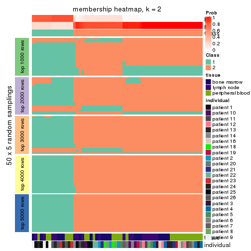</p>

</div>
<div id='tab-ATC-mclust-membership-heatmap-2'>
<pre><code class="r">membership_heatmap(res, k = 3)
</code></pre>

<p>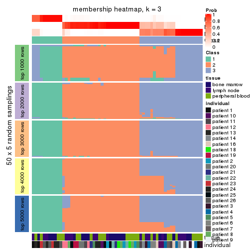</p>

</div>
<div id='tab-ATC-mclust-membership-heatmap-3'>
<pre><code class="r">membership_heatmap(res, k = 4)
</code></pre>

<p>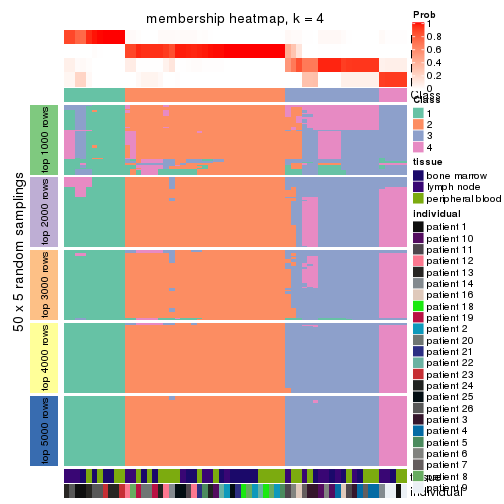</p>

</div>
<div id='tab-ATC-mclust-membership-heatmap-4'>
<pre><code class="r">membership_heatmap(res, k = 5)
</code></pre>

<p>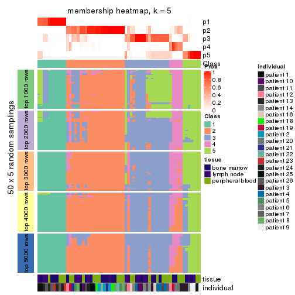</p>

</div>
<div id='tab-ATC-mclust-membership-heatmap-5'>
<pre><code class="r">membership_heatmap(res, k = 6)
</code></pre>

<p>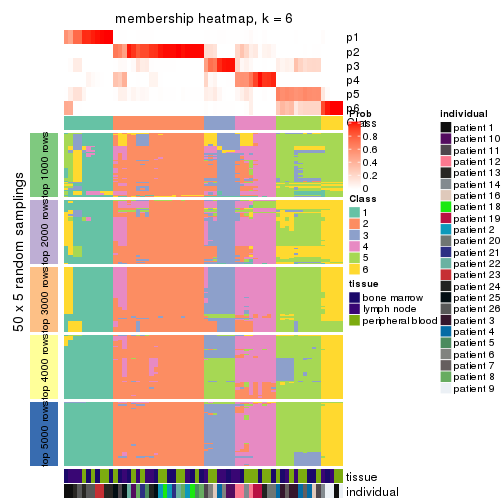</p>

</div>
</div>

As soon as we have had the classes for columns, we can look for signatures
which are significantly different between classes which can be candidate marks
for certain classes. Following are the heatmaps for signatures.


Signature heatmaps where rows are scaled:


<script>
$( function() {
	$( '#tabs-ATC-mclust-get-signatures' ).tabs();
} );
</script>
<div id='tabs-ATC-mclust-get-signatures'>
<ul>
<li><a href='#tab-ATC-mclust-get-signatures-1'>k = 2</a></li>
<li><a href='#tab-ATC-mclust-get-signatures-2'>k = 3</a></li>
<li><a href='#tab-ATC-mclust-get-signatures-3'>k = 4</a></li>
<li><a href='#tab-ATC-mclust-get-signatures-4'>k = 5</a></li>
<li><a href='#tab-ATC-mclust-get-signatures-5'>k = 6</a></li>
</ul>
<div id='tab-ATC-mclust-get-signatures-1'>
<pre><code class="r">get_signatures(res, k = 2)
</code></pre>

<p>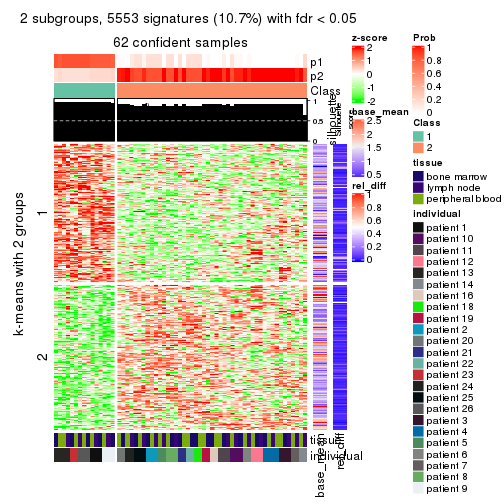</p>

</div>
<div id='tab-ATC-mclust-get-signatures-2'>
<pre><code class="r">get_signatures(res, k = 3)
</code></pre>

<p>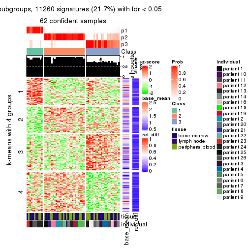</p>

</div>
<div id='tab-ATC-mclust-get-signatures-3'>
<pre><code class="r">get_signatures(res, k = 4)
</code></pre>

<p>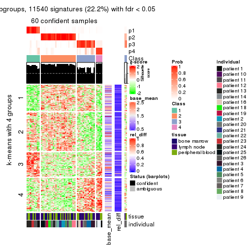</p>

</div>
<div id='tab-ATC-mclust-get-signatures-4'>
<pre><code class="r">get_signatures(res, k = 5)
</code></pre>

<p>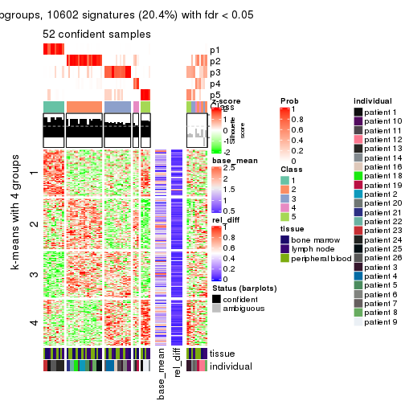</p>

</div>
<div id='tab-ATC-mclust-get-signatures-5'>
<pre><code class="r">get_signatures(res, k = 6)
</code></pre>

<p>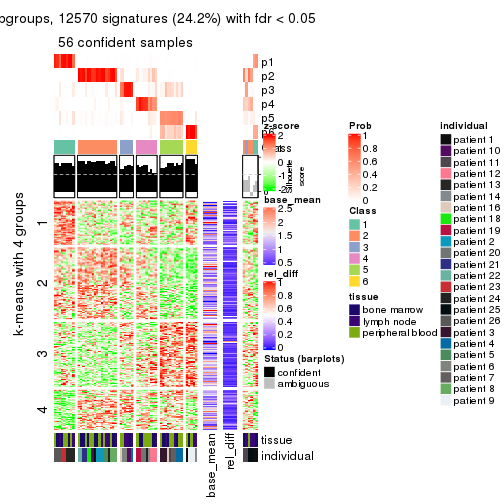</p>

</div>
</div>


Signature heatmaps where rows are not scaled:


<script>
$( function() {
	$( '#tabs-ATC-mclust-get-signatures-no-scale' ).tabs();
} );
</script>
<div id='tabs-ATC-mclust-get-signatures-no-scale'>
<ul>
<li><a href='#tab-ATC-mclust-get-signatures-no-scale-1'>k = 2</a></li>
<li><a href='#tab-ATC-mclust-get-signatures-no-scale-2'>k = 3</a></li>
<li><a href='#tab-ATC-mclust-get-signatures-no-scale-3'>k = 4</a></li>
<li><a href='#tab-ATC-mclust-get-signatures-no-scale-4'>k = 5</a></li>
<li><a href='#tab-ATC-mclust-get-signatures-no-scale-5'>k = 6</a></li>
</ul>
<div id='tab-ATC-mclust-get-signatures-no-scale-1'>
<pre><code class="r">get_signatures(res, k = 2, scale_rows = FALSE)
</code></pre>

<p>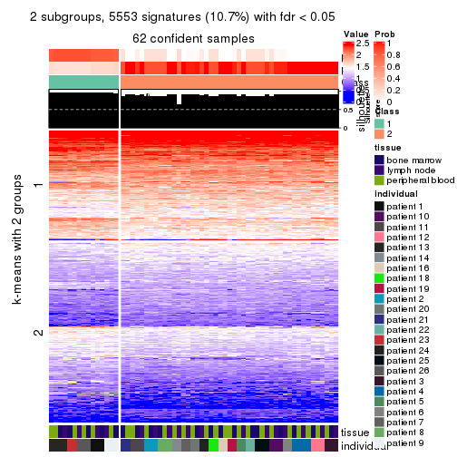</p>

</div>
<div id='tab-ATC-mclust-get-signatures-no-scale-2'>
<pre><code class="r">get_signatures(res, k = 3, scale_rows = FALSE)
</code></pre>

<p>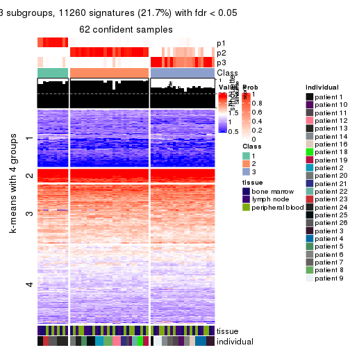</p>

</div>
<div id='tab-ATC-mclust-get-signatures-no-scale-3'>
<pre><code class="r">get_signatures(res, k = 4, scale_rows = FALSE)
</code></pre>

<p>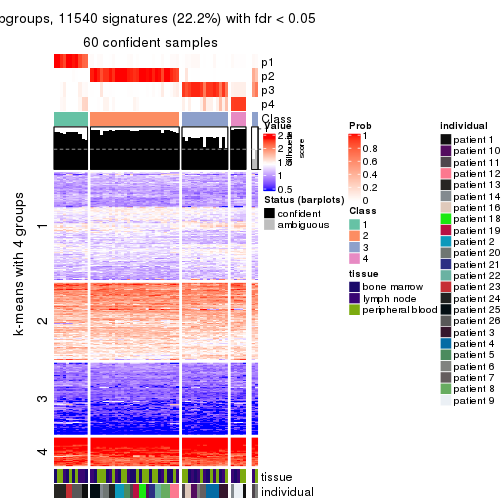</p>

</div>
<div id='tab-ATC-mclust-get-signatures-no-scale-4'>
<pre><code class="r">get_signatures(res, k = 5, scale_rows = FALSE)
</code></pre>

<p>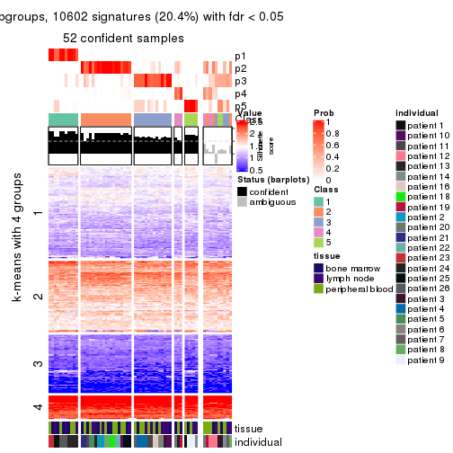</p>

</div>
<div id='tab-ATC-mclust-get-signatures-no-scale-5'>
<pre><code class="r">get_signatures(res, k = 6, scale_rows = FALSE)
</code></pre>

<p>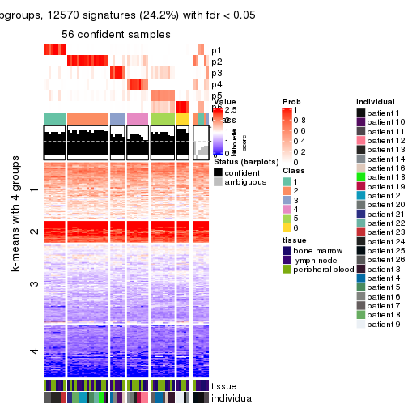</p>

</div>
</div>


Compare the overlap of signatures from different k:

```r
compare_signatures(res)
```

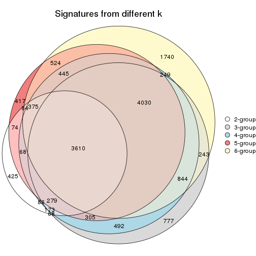

`get_signature()` returns a data frame invisibly. TO get the list of signatures, the function
call should be assigned to a variable explicitly. In following code, if `plot` argument is set
to `FALSE`, no heatmap is plotted while only the differential analysis is performed.

```r
# code only for demonstration
tb = get_signature(res, k = ..., plot = FALSE)
```

An example of the output of `tb` is:

```
#>   which_row         fdr    mean_1    mean_2 scaled_mean_1 scaled_mean_2 km
#> 1        38 0.042760348  8.373488  9.131774    -0.5533452     0.5164555  1
#> 2        40 0.018707592  7.106213  8.469186    -0.6173731     0.5762149  1
#> 3        55 0.019134737 10.221463 11.207825    -0.6159697     0.5749050  1
#> 4        59 0.006059896  5.921854  7.869574    -0.6899429     0.6439467  1
#> 5        60 0.018055526  8.928898 10.211722    -0.6204761     0.5791110  1
#> 6        98 0.009384629 15.714769 14.887706     0.6635654    -0.6193277  2
...
```

The columns in `tb` are:

1. `which_row`: row indices corresponding to the input matrix.
2. `fdr`: FDR for the differential test. 
3. `mean_x`: The mean value in group x.
4. `scaled_mean_x`: The mean value in group x after rows are scaled.
5. `km`: Row groups if k-means clustering is applied to rows.


UMAP plot which shows how samples are separated.


<script>
$( function() {
	$( '#tabs-ATC-mclust-dimension-reduction' ).tabs();
} );
</script>
<div id='tabs-ATC-mclust-dimension-reduction'>
<ul>
<li><a href='#tab-ATC-mclust-dimension-reduction-1'>k = 2</a></li>
<li><a href='#tab-ATC-mclust-dimension-reduction-2'>k = 3</a></li>
<li><a href='#tab-ATC-mclust-dimension-reduction-3'>k = 4</a></li>
<li><a href='#tab-ATC-mclust-dimension-reduction-4'>k = 5</a></li>
<li><a href='#tab-ATC-mclust-dimension-reduction-5'>k = 6</a></li>
</ul>
<div id='tab-ATC-mclust-dimension-reduction-1'>
<pre><code class="r">dimension_reduction(res, k = 2, method = &quot;UMAP&quot;)
</code></pre>

<p>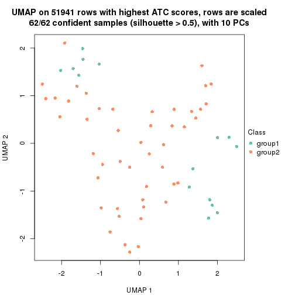</p>

</div>
<div id='tab-ATC-mclust-dimension-reduction-2'>
<pre><code class="r">dimension_reduction(res, k = 3, method = &quot;UMAP&quot;)
</code></pre>

<p>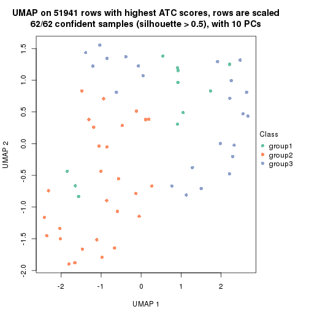</p>

</div>
<div id='tab-ATC-mclust-dimension-reduction-3'>
<pre><code class="r">dimension_reduction(res, k = 4, method = &quot;UMAP&quot;)
</code></pre>

<p>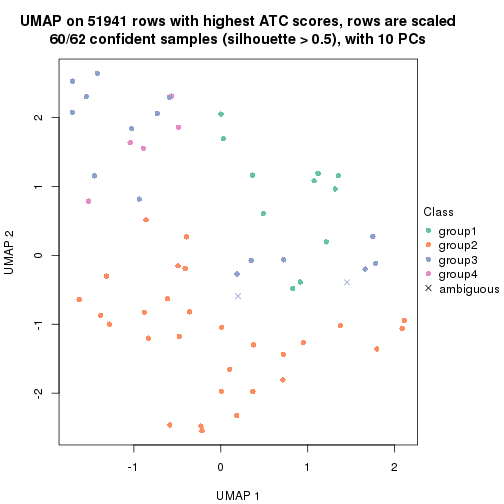</p>

</div>
<div id='tab-ATC-mclust-dimension-reduction-4'>
<pre><code class="r">dimension_reduction(res, k = 5, method = &quot;UMAP&quot;)
</code></pre>

<p>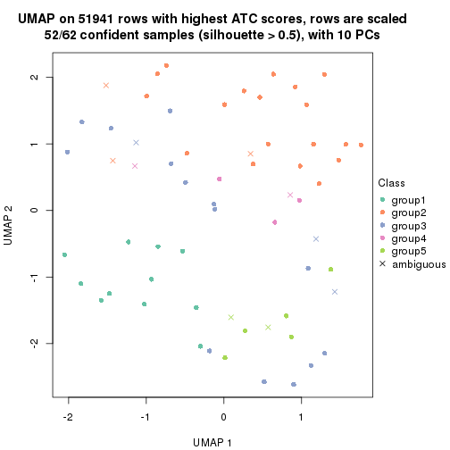</p>

</div>
<div id='tab-ATC-mclust-dimension-reduction-5'>
<pre><code class="r">dimension_reduction(res, k = 6, method = &quot;UMAP&quot;)
</code></pre>

<p>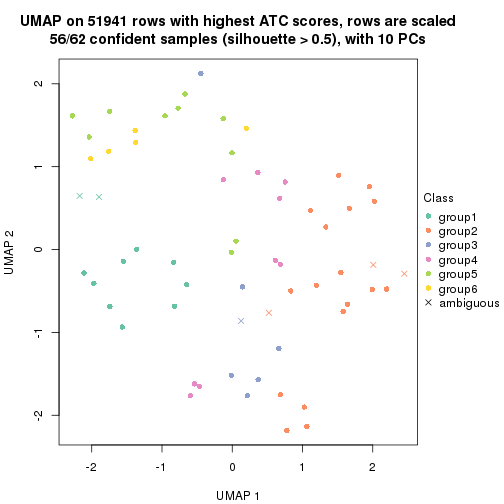</p>

</div>
</div>


Following heatmap shows how subgroups are split when increasing `k`:

```r
collect_classes(res)
```

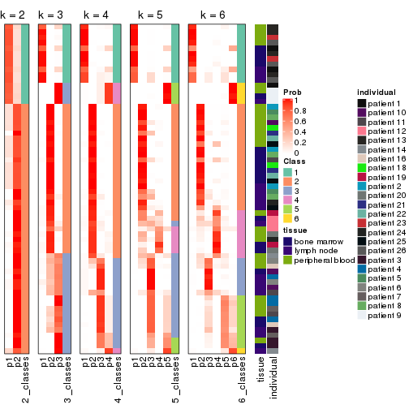


Test correlation between subgroups and known annotations. If the known
annotation is numeric, one-way ANOVA test is applied, and if the known
annotation is discrete, chi-squared contingency table test is applied.

```r
test_to_known_factors(res)
```

```
#>             n tissue(p) individual(p) k
#> ATC:mclust 62     0.966      1.95e-05 2
#> ATC:mclust 62     0.760      2.05e-07 3
#> ATC:mclust 60     0.952      1.84e-08 4
#> ATC:mclust 52     0.868      3.33e-08 5
#> ATC:mclust 56     0.944      9.22e-11 6
```


If matrix rows can be associated to genes, consider to use `functional_enrichment(res,
...)` to perform function enrichment for the signature genes. See [this vignette](http://bioconductor.org/packages/devel/bioc/vignettes/cola/inst/doc/functional_enrichment.html) for more detailed explanations.


 

---------------------------------------------------


### ATC:NMF**


The object with results only for a single top-value method and a single partition method 
can be extracted as:

```r
res = res_list["ATC", "NMF"]
# you can also extract it by
# res = res_list["ATC:NMF"]
```

A summary of `res` and all the functions that can be applied to it:

```r
res
```

```
#> A 'ConsensusPartition' object with k = 2, 3, 4, 5, 6.
#>   On a matrix with 51941 rows and 62 columns.
#>   Top rows (1000, 2000, 3000, 4000, 5000) are extracted by 'ATC' method.
#>   Subgroups are detected by 'NMF' method.
#>   Performed in total 1250 partitions by row resampling.
#>   Best k for subgroups seems to be 2.
#> 
#> Following methods can be applied to this 'ConsensusPartition' object:
#>  [1] "cola_report"             "collect_classes"         "collect_plots"          
#>  [4] "collect_stats"           "colnames"                "compare_signatures"     
#>  [7] "consensus_heatmap"       "dimension_reduction"     "functional_enrichment"  
#> [10] "get_anno_col"            "get_anno"                "get_classes"            
#> [13] "get_consensus"           "get_matrix"              "get_membership"         
#> [16] "get_param"               "get_signatures"          "get_stats"              
#> [19] "is_best_k"               "is_stable_k"             "membership_heatmap"     
#> [22] "ncol"                    "nrow"                    "plot_ecdf"              
#> [25] "rownames"                "select_partition_number" "show"                   
#> [28] "suggest_best_k"          "test_to_known_factors"
```

`collect_plots()` function collects all the plots made from `res` for all `k` (number of partitions)
into one single page to provide an easy and fast comparison between different `k`.

```r
collect_plots(res)
```

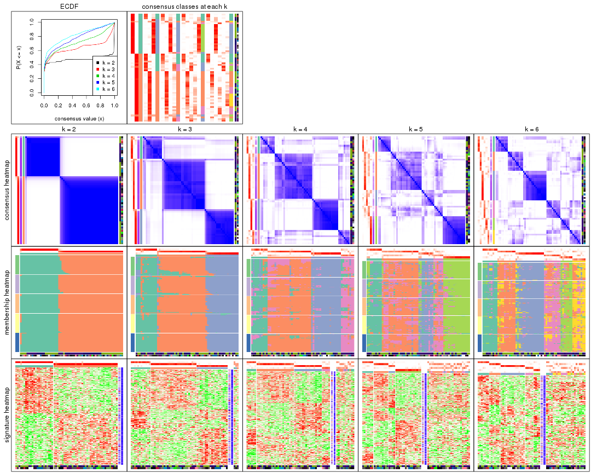

The plots are:

- The first row: a plot of the ECDF (empirical cumulative distribution
  function) curves of the consensus matrix for each `k` and the heatmap of
  predicted classes for each `k`.
- The second row: heatmaps of the consensus matrix for each `k`.
- The third row: heatmaps of the membership matrix for each `k`.
- The fouth row: heatmaps of the signatures for each `k`.

All the plots in panels can be made by individual functions and they are
plotted later in this section.

`select_partition_number()` produces several plots showing different
statistics for choosing "optimized" `k`. There are following statistics:

- ECDF curves of the consensus matrix for each `k`;
- 1-PAC. [The PAC
  score](https://en.wikipedia.org/wiki/Consensus_clustering#Over-interpretation_potential_of_consensus_clustering)
  measures the proportion of the ambiguous subgrouping.
- Mean silhouette score.
- Concordance. The mean probability of fiting the consensus class ids in all
  partitions.
- Area increased. Denote $A_k$ as the area under the ECDF curve for current
  `k`, the area increased is defined as $A_k - A_{k-1}$.
- Rand index. The percent of pairs of samples that are both in a same cluster
  or both are not in a same cluster in the partition of k and k-1.
- Jaccard index. The ratio of pairs of samples are both in a same cluster in
  the partition of k and k-1 and the pairs of samples are both in a same
  cluster in the partition k or k-1.

The detailed explanations of these statistics can be found in [the _cola_
vignette](http://bioconductor.org/packages/devel/bioc/vignettes/cola/inst/doc/cola.html#toc_13).

Generally speaking, lower PAC score, higher mean silhouette score or higher
concordance corresponds to better partition. Rand index and Jaccard index
measure how similar the current partition is compared to partition with `k-1`.
If they are too similar, we won't accept `k` is better than `k-1`.

```r
select_partition_number(res)
```

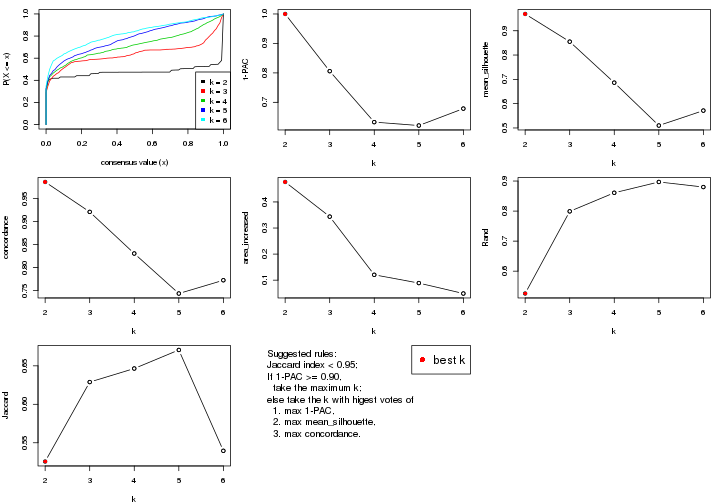

The numeric values for all these statistics can be obtained by `get_stats()`.

```r
get_stats(res)
```

```
#>   k 1-PAC mean_silhouette concordance area_increased  Rand Jaccard
#> 2 2 1.000           0.969       0.986         0.4766 0.526   0.526
#> 3 3 0.806           0.855       0.921         0.3437 0.799   0.629
#> 4 4 0.633           0.686       0.831         0.1206 0.861   0.647
#> 5 5 0.621           0.510       0.743         0.0889 0.897   0.671
#> 6 6 0.679           0.571       0.772         0.0488 0.880   0.540
```

`suggest_best_k()` suggests the best $k$ based on these statistics. The rules are as follows:

- All $k$ with Jaccard index larger than 0.95 are removed because increasing
  $k$ does not provide enough extra information. If all $k$ are removed, it is
  marked as no subgroup is detected.
- For all $k$ with 1-PAC score larger than 0.9, the maximal $k$ is taken as
  the best $k$, and other $k$ are marked as optional $k$.
- If it does not fit the second rule. The $k$ with the maximal vote of the
  highest 1-PAC score, highest mean silhouette, and highest concordance is
  taken as the best $k$.

```r
suggest_best_k(res)
```

```
#> [1] 2
```


Following shows the table of the partitions (You need to click the **show/hide
code output** link to see it). The membership matrix (columns with name `p*`)
is inferred by
[`clue::cl_consensus()`](https://www.rdocumentation.org/link/cl_consensus?package=clue)
function with the `SE` method. Basically the value in the membership matrix
represents the probability to belong to a certain group. The finall class
label for an item is determined with the group with highest probability it
belongs to.

In `get_classes()` function, the entropy is calculated from the membership
matrix and the silhouette score is calculated from the consensus matrix.


<script>
$( function() {
	$( '#tabs-ATC-NMF-get-classes' ).tabs();
} );
</script>
<div id='tabs-ATC-NMF-get-classes'>
<ul>
<li><a href='#tab-ATC-NMF-get-classes-1'>k = 2</a></li>
<li><a href='#tab-ATC-NMF-get-classes-2'>k = 3</a></li>
<li><a href='#tab-ATC-NMF-get-classes-3'>k = 4</a></li>
<li><a href='#tab-ATC-NMF-get-classes-4'>k = 5</a></li>
<li><a href='#tab-ATC-NMF-get-classes-5'>k = 6</a></li>
</ul>

<div id='tab-ATC-NMF-get-classes-1'>
<p><a id='tab-ATC-NMF-get-classes-1-a' style='color:#0366d6' href='#'>show/hide code output</a></p>
<pre><code class="r">cbind(get_classes(res, k = 2), get_membership(res, k = 2))
</code></pre>

<pre><code>#&gt;           class entropy silhouette    p1    p2
#&gt; GSM525314     1  0.0000      0.988 1.000 0.000
#&gt; GSM525315     2  0.0000      0.984 0.000 1.000
#&gt; GSM525316     1  0.0000      0.988 1.000 0.000
#&gt; GSM525317     1  0.0000      0.988 1.000 0.000
#&gt; GSM525318     1  0.0000      0.988 1.000 0.000
#&gt; GSM525319     2  0.0000      0.984 0.000 1.000
#&gt; GSM525320     2  0.0000      0.984 0.000 1.000
#&gt; GSM525321     1  0.0000      0.988 1.000 0.000
#&gt; GSM525322     2  0.0000      0.984 0.000 1.000
#&gt; GSM525323     1  0.0000      0.988 1.000 0.000
#&gt; GSM525324     2  0.0000      0.984 0.000 1.000
#&gt; GSM525325     1  0.0000      0.988 1.000 0.000
#&gt; GSM525326     1  0.0376      0.985 0.996 0.004
#&gt; GSM525327     1  0.0000      0.988 1.000 0.000
#&gt; GSM525328     2  0.0000      0.984 0.000 1.000
#&gt; GSM525329     1  0.0672      0.981 0.992 0.008
#&gt; GSM525330     2  0.1843      0.962 0.028 0.972
#&gt; GSM525331     2  0.0000      0.984 0.000 1.000
#&gt; GSM525332     2  0.0000      0.984 0.000 1.000
#&gt; GSM525333     2  0.0000      0.984 0.000 1.000
#&gt; GSM525334     2  0.0000      0.984 0.000 1.000
#&gt; GSM525335     2  0.0000      0.984 0.000 1.000
#&gt; GSM525336     1  0.0376      0.985 0.996 0.004
#&gt; GSM525337     1  0.8081      0.659 0.752 0.248
#&gt; GSM525338     2  0.0000      0.984 0.000 1.000
#&gt; GSM525339     2  0.0000      0.984 0.000 1.000
#&gt; GSM525340     1  0.0000      0.988 1.000 0.000
#&gt; GSM525341     2  0.0000      0.984 0.000 1.000
#&gt; GSM525342     1  0.0000      0.988 1.000 0.000
#&gt; GSM525343     1  0.0000      0.988 1.000 0.000
#&gt; GSM525344     2  0.0000      0.984 0.000 1.000
#&gt; GSM525345     1  0.0000      0.988 1.000 0.000
#&gt; GSM525346     2  0.0672      0.978 0.008 0.992
#&gt; GSM525347     2  0.0000      0.984 0.000 1.000
#&gt; GSM525348     2  0.0000      0.984 0.000 1.000
#&gt; GSM525349     2  0.0000      0.984 0.000 1.000
#&gt; GSM525350     1  0.0000      0.988 1.000 0.000
#&gt; GSM525351     2  0.0000      0.984 0.000 1.000
#&gt; GSM525352     2  0.0000      0.984 0.000 1.000
#&gt; GSM525353     2  0.0000      0.984 0.000 1.000
#&gt; GSM525354     2  0.0000      0.984 0.000 1.000
#&gt; GSM525355     2  0.0000      0.984 0.000 1.000
#&gt; GSM525356     2  0.1184      0.972 0.016 0.984
#&gt; GSM525357     2  0.0000      0.984 0.000 1.000
#&gt; GSM525358     2  0.0376      0.981 0.004 0.996
#&gt; GSM525359     1  0.0000      0.988 1.000 0.000
#&gt; GSM525360     2  0.0000      0.984 0.000 1.000
#&gt; GSM525361     1  0.0000      0.988 1.000 0.000
#&gt; GSM525362     1  0.0000      0.988 1.000 0.000
#&gt; GSM525363     2  0.0000      0.984 0.000 1.000
#&gt; GSM525364     2  0.6438      0.807 0.164 0.836
#&gt; GSM525365     1  0.0000      0.988 1.000 0.000
#&gt; GSM525366     2  0.0000      0.984 0.000 1.000
#&gt; GSM525367     1  0.0000      0.988 1.000 0.000
#&gt; GSM525368     2  0.0000      0.984 0.000 1.000
#&gt; GSM525369     2  0.8763      0.588 0.296 0.704
#&gt; GSM525370     2  0.0000      0.984 0.000 1.000
#&gt; GSM525371     2  0.0000      0.984 0.000 1.000
#&gt; GSM525372     1  0.0000      0.988 1.000 0.000
#&gt; GSM525373     2  0.0000      0.984 0.000 1.000
#&gt; GSM525374     2  0.0000      0.984 0.000 1.000
#&gt; GSM525375     2  0.3733      0.918 0.072 0.928
</code></pre>

<script>
$('#tab-ATC-NMF-get-classes-1-a').parent().next().next().hide();
$('#tab-ATC-NMF-get-classes-1-a').click(function(){
  $('#tab-ATC-NMF-get-classes-1-a').parent().next().next().toggle();
  return(false);
});
</script>
</div>

<div id='tab-ATC-NMF-get-classes-2'>
<p><a id='tab-ATC-NMF-get-classes-2-a' style='color:#0366d6' href='#'>show/hide code output</a></p>
<pre><code class="r">cbind(get_classes(res, k = 3), get_membership(res, k = 3))
</code></pre>

<pre><code>#&gt;           class entropy silhouette    p1    p2    p3
#&gt; GSM525314     3  0.0592     0.9366 0.012 0.000 0.988
#&gt; GSM525315     2  0.0892     0.9062 0.020 0.980 0.000
#&gt; GSM525316     3  0.0000     0.9387 0.000 0.000 1.000
#&gt; GSM525317     3  0.2031     0.9187 0.016 0.032 0.952
#&gt; GSM525318     3  0.0000     0.9387 0.000 0.000 1.000
#&gt; GSM525319     2  0.2625     0.9176 0.084 0.916 0.000
#&gt; GSM525320     2  0.2625     0.9172 0.084 0.916 0.000
#&gt; GSM525321     3  0.0829     0.9354 0.004 0.012 0.984
#&gt; GSM525322     2  0.2165     0.9215 0.064 0.936 0.000
#&gt; GSM525323     3  0.0237     0.9383 0.004 0.000 0.996
#&gt; GSM525324     2  0.0000     0.9144 0.000 1.000 0.000
#&gt; GSM525325     3  0.2902     0.8959 0.016 0.064 0.920
#&gt; GSM525326     3  0.0848     0.9380 0.008 0.008 0.984
#&gt; GSM525327     1  0.3412     0.8010 0.876 0.000 0.124
#&gt; GSM525328     1  0.0892     0.8715 0.980 0.020 0.000
#&gt; GSM525329     3  0.4345     0.8143 0.016 0.136 0.848
#&gt; GSM525330     2  0.1919     0.8893 0.020 0.956 0.024
#&gt; GSM525331     2  0.0237     0.9131 0.004 0.996 0.000
#&gt; GSM525332     2  0.0892     0.9062 0.020 0.980 0.000
#&gt; GSM525333     2  0.0892     0.9062 0.020 0.980 0.000
#&gt; GSM525334     2  0.2959     0.9104 0.100 0.900 0.000
#&gt; GSM525335     2  0.2625     0.9173 0.084 0.916 0.000
#&gt; GSM525336     1  0.3267     0.8082 0.884 0.000 0.116
#&gt; GSM525337     3  0.7072     0.1208 0.020 0.476 0.504
#&gt; GSM525338     2  0.0892     0.9062 0.020 0.980 0.000
#&gt; GSM525339     1  0.2537     0.8579 0.920 0.080 0.000
#&gt; GSM525340     3  0.0892     0.9331 0.020 0.000 0.980
#&gt; GSM525341     2  0.1031     0.9198 0.024 0.976 0.000
#&gt; GSM525342     3  0.0237     0.9384 0.004 0.000 0.996
#&gt; GSM525343     3  0.1182     0.9317 0.012 0.012 0.976
#&gt; GSM525344     2  0.2711     0.9156 0.088 0.912 0.000
#&gt; GSM525345     3  0.0000     0.9387 0.000 0.000 1.000
#&gt; GSM525346     2  0.3826     0.8819 0.124 0.868 0.008
#&gt; GSM525347     2  0.2066     0.9217 0.060 0.940 0.000
#&gt; GSM525348     2  0.2537     0.9187 0.080 0.920 0.000
#&gt; GSM525349     1  0.0983     0.8718 0.980 0.016 0.004
#&gt; GSM525350     3  0.3141     0.8893 0.020 0.068 0.912
#&gt; GSM525351     2  0.1529     0.9214 0.040 0.960 0.000
#&gt; GSM525352     2  0.0892     0.9062 0.020 0.980 0.000
#&gt; GSM525353     2  0.0892     0.9062 0.020 0.980 0.000
#&gt; GSM525354     2  0.1753     0.9218 0.048 0.952 0.000
#&gt; GSM525355     2  0.2625     0.9173 0.084 0.916 0.000
#&gt; GSM525356     1  0.2176     0.8696 0.948 0.032 0.020
#&gt; GSM525357     2  0.1411     0.9210 0.036 0.964 0.000
#&gt; GSM525358     1  0.6521     0.0825 0.500 0.496 0.004
#&gt; GSM525359     1  0.4931     0.6795 0.768 0.000 0.232
#&gt; GSM525360     2  0.2878     0.9122 0.096 0.904 0.000
#&gt; GSM525361     3  0.0000     0.9387 0.000 0.000 1.000
#&gt; GSM525362     3  0.0892     0.9330 0.020 0.000 0.980
#&gt; GSM525363     2  0.3340     0.8970 0.120 0.880 0.000
#&gt; GSM525364     1  0.1751     0.8684 0.960 0.012 0.028
#&gt; GSM525365     3  0.0424     0.9376 0.008 0.000 0.992
#&gt; GSM525366     1  0.5178     0.6139 0.744 0.256 0.000
#&gt; GSM525367     3  0.0892     0.9331 0.020 0.000 0.980
#&gt; GSM525368     2  0.5591     0.6359 0.304 0.696 0.000
#&gt; GSM525369     2  0.7159     0.1731 0.024 0.528 0.448
#&gt; GSM525370     1  0.2448     0.8465 0.924 0.076 0.000
#&gt; GSM525371     1  0.0892     0.8715 0.980 0.020 0.000
#&gt; GSM525372     3  0.0892     0.9331 0.020 0.000 0.980
#&gt; GSM525373     2  0.3038     0.9080 0.104 0.896 0.000
#&gt; GSM525374     2  0.1411     0.9178 0.036 0.964 0.000
#&gt; GSM525375     1  0.1129     0.8695 0.976 0.004 0.020
</code></pre>

<script>
$('#tab-ATC-NMF-get-classes-2-a').parent().next().next().hide();
$('#tab-ATC-NMF-get-classes-2-a').click(function(){
  $('#tab-ATC-NMF-get-classes-2-a').parent().next().next().toggle();
  return(false);
});
</script>
</div>

<div id='tab-ATC-NMF-get-classes-3'>
<p><a id='tab-ATC-NMF-get-classes-3-a' style='color:#0366d6' href='#'>show/hide code output</a></p>
<pre><code class="r">cbind(get_classes(res, k = 4), get_membership(res, k = 4))
</code></pre>

<pre><code>#&gt;           class entropy silhouette    p1    p2    p3    p4
#&gt; GSM525314     3  0.0469   0.910571 0.012 0.000 0.988 0.000
#&gt; GSM525315     2  0.0921   0.833681 0.000 0.972 0.000 0.028
#&gt; GSM525316     3  0.0000   0.911489 0.000 0.000 1.000 0.000
#&gt; GSM525317     3  0.2921   0.826026 0.000 0.000 0.860 0.140
#&gt; GSM525318     3  0.0469   0.910176 0.000 0.000 0.988 0.012
#&gt; GSM525319     2  0.1722   0.831220 0.008 0.944 0.000 0.048
#&gt; GSM525320     2  0.5288   0.291948 0.000 0.520 0.008 0.472
#&gt; GSM525321     3  0.0188   0.911316 0.000 0.000 0.996 0.004
#&gt; GSM525322     2  0.2654   0.819559 0.004 0.888 0.000 0.108
#&gt; GSM525323     3  0.0469   0.910571 0.012 0.000 0.988 0.000
#&gt; GSM525324     2  0.4134   0.713562 0.000 0.740 0.000 0.260
#&gt; GSM525325     3  0.1474   0.892880 0.000 0.000 0.948 0.052
#&gt; GSM525326     3  0.4170   0.753987 0.124 0.028 0.832 0.016
#&gt; GSM525327     1  0.3858   0.628409 0.844 0.000 0.100 0.056
#&gt; GSM525328     1  0.1743   0.593924 0.940 0.004 0.000 0.056
#&gt; GSM525329     3  0.1938   0.872639 0.000 0.052 0.936 0.012
#&gt; GSM525330     2  0.5757   0.643386 0.000 0.684 0.076 0.240
#&gt; GSM525331     2  0.2799   0.818659 0.008 0.884 0.000 0.108
#&gt; GSM525332     2  0.3601   0.763013 0.056 0.860 0.000 0.084
#&gt; GSM525333     2  0.2996   0.773313 0.044 0.892 0.000 0.064
#&gt; GSM525334     2  0.5427   0.413147 0.016 0.568 0.000 0.416
#&gt; GSM525335     2  0.2662   0.824030 0.016 0.900 0.000 0.084
#&gt; GSM525336     1  0.2480   0.639137 0.904 0.008 0.088 0.000
#&gt; GSM525337     2  0.7113   0.479854 0.072 0.640 0.224 0.064
#&gt; GSM525338     2  0.1890   0.803620 0.008 0.936 0.000 0.056
#&gt; GSM525339     1  0.4364   0.585083 0.808 0.136 0.000 0.056
#&gt; GSM525340     1  0.5163   0.134615 0.516 0.000 0.480 0.004
#&gt; GSM525341     2  0.1004   0.832624 0.004 0.972 0.000 0.024
#&gt; GSM525342     3  0.0188   0.911412 0.004 0.000 0.996 0.000
#&gt; GSM525343     3  0.0592   0.909107 0.000 0.000 0.984 0.016
#&gt; GSM525344     2  0.2799   0.817088 0.008 0.884 0.000 0.108
#&gt; GSM525345     3  0.0469   0.910571 0.012 0.000 0.988 0.000
#&gt; GSM525346     4  0.3444   0.577180 0.000 0.184 0.000 0.816
#&gt; GSM525347     2  0.2999   0.810268 0.004 0.864 0.000 0.132
#&gt; GSM525348     2  0.4606   0.699159 0.012 0.724 0.000 0.264
#&gt; GSM525349     1  0.3208   0.528449 0.848 0.004 0.000 0.148
#&gt; GSM525350     3  0.2530   0.852671 0.000 0.000 0.888 0.112
#&gt; GSM525351     2  0.1557   0.834680 0.000 0.944 0.000 0.056
#&gt; GSM525352     2  0.4937   0.638322 0.172 0.764 0.000 0.064
#&gt; GSM525353     2  0.2816   0.779618 0.036 0.900 0.000 0.064
#&gt; GSM525354     2  0.0895   0.830651 0.004 0.976 0.000 0.020
#&gt; GSM525355     2  0.3695   0.793201 0.016 0.828 0.000 0.156
#&gt; GSM525356     1  0.5012   0.593533 0.792 0.128 0.020 0.060
#&gt; GSM525357     2  0.0895   0.822538 0.004 0.976 0.000 0.020
#&gt; GSM525358     1  0.6104   0.443258 0.636 0.296 0.004 0.064
#&gt; GSM525359     1  0.6290   0.424499 0.568 0.000 0.364 0.068
#&gt; GSM525360     2  0.2198   0.826900 0.008 0.920 0.000 0.072
#&gt; GSM525361     3  0.2760   0.838279 0.000 0.000 0.872 0.128
#&gt; GSM525362     4  0.5648   0.320876 0.032 0.004 0.324 0.640
#&gt; GSM525363     4  0.6009   0.092609 0.040 0.468 0.000 0.492
#&gt; GSM525364     4  0.4422   0.538405 0.256 0.008 0.000 0.736
#&gt; GSM525365     3  0.0376   0.911418 0.004 0.000 0.992 0.004
#&gt; GSM525366     4  0.5800   0.607387 0.164 0.128 0.000 0.708
#&gt; GSM525367     3  0.0469   0.910571 0.012 0.000 0.988 0.000
#&gt; GSM525368     4  0.3948   0.615486 0.036 0.136 0.000 0.828
#&gt; GSM525369     3  0.7773  -0.034547 0.020 0.140 0.464 0.376
#&gt; GSM525370     4  0.4692   0.581142 0.212 0.032 0.000 0.756
#&gt; GSM525371     4  0.5060   0.284952 0.412 0.004 0.000 0.584
#&gt; GSM525372     3  0.0779   0.907837 0.016 0.000 0.980 0.004
#&gt; GSM525373     2  0.2342   0.827413 0.008 0.912 0.000 0.080
#&gt; GSM525374     2  0.0779   0.829523 0.004 0.980 0.000 0.016
#&gt; GSM525375     1  0.5080  -0.000967 0.576 0.004 0.000 0.420
</code></pre>

<script>
$('#tab-ATC-NMF-get-classes-3-a').parent().next().next().hide();
$('#tab-ATC-NMF-get-classes-3-a').click(function(){
  $('#tab-ATC-NMF-get-classes-3-a').parent().next().next().toggle();
  return(false);
});
</script>
</div>

<div id='tab-ATC-NMF-get-classes-4'>
<p><a id='tab-ATC-NMF-get-classes-4-a' style='color:#0366d6' href='#'>show/hide code output</a></p>
<pre><code class="r">cbind(get_classes(res, k = 5), get_membership(res, k = 5))
</code></pre>

<pre><code>#&gt;           class entropy silhouette    p1    p2    p3    p4    p5
#&gt; GSM525314     5  0.0794     0.9112 0.028 0.000 0.000 0.000 0.972
#&gt; GSM525315     2  0.1041     0.5535 0.000 0.964 0.004 0.032 0.000
#&gt; GSM525316     5  0.0609     0.9114 0.020 0.000 0.000 0.000 0.980
#&gt; GSM525317     5  0.2124     0.8709 0.000 0.000 0.004 0.096 0.900
#&gt; GSM525318     5  0.0451     0.9108 0.004 0.000 0.000 0.008 0.988
#&gt; GSM525319     2  0.1399     0.5588 0.000 0.952 0.020 0.028 0.000
#&gt; GSM525320     4  0.6414     0.3375 0.000 0.336 0.136 0.516 0.012
#&gt; GSM525321     5  0.0566     0.9061 0.004 0.000 0.000 0.012 0.984
#&gt; GSM525322     2  0.2685     0.5085 0.000 0.880 0.028 0.092 0.000
#&gt; GSM525323     5  0.0794     0.9112 0.028 0.000 0.000 0.000 0.972
#&gt; GSM525324     2  0.5102    -0.0534 0.000 0.580 0.044 0.376 0.000
#&gt; GSM525325     5  0.2304     0.8653 0.008 0.000 0.000 0.100 0.892
#&gt; GSM525326     4  0.7032     0.1431 0.244 0.012 0.008 0.488 0.248
#&gt; GSM525327     1  0.2928     0.7140 0.872 0.000 0.092 0.004 0.032
#&gt; GSM525328     1  0.2338     0.7011 0.884 0.000 0.112 0.004 0.000
#&gt; GSM525329     5  0.5207     0.6745 0.008 0.108 0.016 0.132 0.736
#&gt; GSM525330     2  0.6160    -0.2831 0.000 0.468 0.020 0.436 0.076
#&gt; GSM525331     2  0.4855    -0.1594 0.016 0.544 0.004 0.436 0.000
#&gt; GSM525332     4  0.6099     0.2065 0.124 0.336 0.004 0.536 0.000
#&gt; GSM525333     2  0.3423     0.5538 0.044 0.856 0.020 0.080 0.000
#&gt; GSM525334     4  0.5315     0.4835 0.004 0.160 0.148 0.688 0.000
#&gt; GSM525335     2  0.4404     0.4314 0.000 0.704 0.032 0.264 0.000
#&gt; GSM525336     1  0.1493     0.7291 0.948 0.000 0.024 0.000 0.028
#&gt; GSM525337     2  0.7681     0.1560 0.048 0.468 0.016 0.184 0.284
#&gt; GSM525338     2  0.4594     0.4282 0.008 0.624 0.008 0.360 0.000
#&gt; GSM525339     1  0.3727     0.6563 0.824 0.068 0.004 0.104 0.000
#&gt; GSM525340     1  0.4268     0.2374 0.556 0.000 0.000 0.000 0.444
#&gt; GSM525341     2  0.2068     0.5582 0.000 0.904 0.004 0.092 0.000
#&gt; GSM525342     5  0.0794     0.9112 0.028 0.000 0.000 0.000 0.972
#&gt; GSM525343     5  0.0566     0.9101 0.000 0.000 0.004 0.012 0.984
#&gt; GSM525344     2  0.2149     0.5351 0.000 0.916 0.036 0.048 0.000
#&gt; GSM525345     5  0.0880     0.9099 0.032 0.000 0.000 0.000 0.968
#&gt; GSM525346     3  0.5580     0.2704 0.000 0.088 0.576 0.336 0.000
#&gt; GSM525347     4  0.5604     0.0463 0.000 0.460 0.052 0.480 0.008
#&gt; GSM525348     4  0.5306     0.4887 0.028 0.236 0.036 0.692 0.008
#&gt; GSM525349     1  0.3242     0.6207 0.784 0.000 0.216 0.000 0.000
#&gt; GSM525350     5  0.2690     0.8154 0.000 0.000 0.000 0.156 0.844
#&gt; GSM525351     2  0.4438     0.2735 0.004 0.608 0.004 0.384 0.000
#&gt; GSM525352     2  0.6715     0.2015 0.188 0.488 0.012 0.312 0.000
#&gt; GSM525353     2  0.4240     0.5162 0.020 0.756 0.016 0.208 0.000
#&gt; GSM525354     2  0.4436     0.3428 0.000 0.596 0.008 0.396 0.000
#&gt; GSM525355     2  0.5396     0.1930 0.000 0.560 0.064 0.376 0.000
#&gt; GSM525356     1  0.1695     0.7199 0.940 0.044 0.008 0.000 0.008
#&gt; GSM525357     2  0.5477     0.3939 0.016 0.572 0.024 0.380 0.008
#&gt; GSM525358     1  0.3435     0.6782 0.852 0.068 0.004 0.072 0.004
#&gt; GSM525359     1  0.5844     0.3919 0.544 0.000 0.092 0.004 0.360
#&gt; GSM525360     2  0.1211     0.5537 0.000 0.960 0.024 0.016 0.000
#&gt; GSM525361     5  0.2012     0.8872 0.000 0.000 0.020 0.060 0.920
#&gt; GSM525362     3  0.6045     0.2024 0.012 0.004 0.516 0.072 0.396
#&gt; GSM525363     2  0.4047     0.2679 0.000 0.676 0.320 0.004 0.000
#&gt; GSM525364     3  0.1845     0.5782 0.056 0.000 0.928 0.016 0.000
#&gt; GSM525365     5  0.3010     0.8297 0.012 0.000 0.020 0.100 0.868
#&gt; GSM525366     3  0.3421     0.5093 0.016 0.164 0.816 0.004 0.000
#&gt; GSM525367     5  0.0963     0.9086 0.036 0.000 0.000 0.000 0.964
#&gt; GSM525368     3  0.3493     0.5426 0.000 0.060 0.832 0.108 0.000
#&gt; GSM525369     3  0.7559     0.1197 0.016 0.036 0.396 0.164 0.388
#&gt; GSM525370     3  0.6178     0.2188 0.076 0.024 0.516 0.384 0.000
#&gt; GSM525371     3  0.3093     0.5006 0.168 0.000 0.824 0.008 0.000
#&gt; GSM525372     5  0.4526     0.7263 0.016 0.004 0.040 0.176 0.764
#&gt; GSM525373     2  0.2616     0.5476 0.000 0.888 0.036 0.076 0.000
#&gt; GSM525374     2  0.6192     0.3946 0.020 0.584 0.056 0.320 0.020
#&gt; GSM525375     3  0.4088     0.1940 0.368 0.000 0.632 0.000 0.000
</code></pre>

<script>
$('#tab-ATC-NMF-get-classes-4-a').parent().next().next().hide();
$('#tab-ATC-NMF-get-classes-4-a').click(function(){
  $('#tab-ATC-NMF-get-classes-4-a').parent().next().next().toggle();
  return(false);
});
</script>
</div>

<div id='tab-ATC-NMF-get-classes-5'>
<p><a id='tab-ATC-NMF-get-classes-5-a' style='color:#0366d6' href='#'>show/hide code output</a></p>
<pre><code class="r">cbind(get_classes(res, k = 6), get_membership(res, k = 6))
</code></pre>

<pre><code>#&gt;           class entropy silhouette    p1    p2    p3    p4    p5    p6
#&gt; GSM525314     3  0.0405     0.8874 0.008 0.000 0.988 0.000 0.000 0.004
#&gt; GSM525315     2  0.2890     0.6318 0.004 0.852 0.000 0.016 0.008 0.120
#&gt; GSM525316     3  0.0291     0.8877 0.004 0.000 0.992 0.000 0.000 0.004
#&gt; GSM525317     3  0.1843     0.8687 0.004 0.012 0.932 0.040 0.008 0.004
#&gt; GSM525318     3  0.0000     0.8878 0.000 0.000 1.000 0.000 0.000 0.000
#&gt; GSM525319     2  0.4248     0.4020 0.004 0.672 0.000 0.024 0.004 0.296
#&gt; GSM525320     2  0.4697     0.4564 0.004 0.676 0.000 0.252 0.060 0.008
#&gt; GSM525321     3  0.0632     0.8851 0.000 0.000 0.976 0.000 0.000 0.024
#&gt; GSM525322     2  0.0632     0.6768 0.000 0.976 0.000 0.000 0.000 0.024
#&gt; GSM525323     3  0.0405     0.8874 0.008 0.000 0.988 0.000 0.000 0.004
#&gt; GSM525324     2  0.2520     0.6426 0.000 0.872 0.000 0.108 0.012 0.008
#&gt; GSM525325     3  0.2900     0.8146 0.000 0.016 0.856 0.112 0.004 0.012
#&gt; GSM525326     4  0.3273     0.5555 0.060 0.000 0.028 0.856 0.008 0.048
#&gt; GSM525327     1  0.2586     0.7430 0.868 0.000 0.032 0.000 0.100 0.000
#&gt; GSM525328     1  0.1700     0.7447 0.916 0.004 0.000 0.000 0.080 0.000
#&gt; GSM525329     3  0.3147     0.7854 0.000 0.016 0.816 0.000 0.008 0.160
#&gt; GSM525330     2  0.3647     0.6076 0.000 0.812 0.028 0.132 0.008 0.020
#&gt; GSM525331     2  0.3766     0.5826 0.020 0.776 0.000 0.184 0.004 0.016
#&gt; GSM525332     4  0.4498     0.5521 0.072 0.056 0.000 0.768 0.004 0.100
#&gt; GSM525333     2  0.5682     0.1491 0.072 0.540 0.000 0.024 0.008 0.356
#&gt; GSM525334     4  0.4087     0.5794 0.004 0.052 0.000 0.800 0.064 0.080
#&gt; GSM525335     4  0.5943     0.2590 0.004 0.364 0.000 0.464 0.004 0.164
#&gt; GSM525336     1  0.1508     0.7524 0.948 0.000 0.016 0.004 0.020 0.012
#&gt; GSM525337     6  0.5456     0.3589 0.012 0.096 0.232 0.008 0.008 0.644
#&gt; GSM525338     6  0.5502     0.1289 0.024 0.076 0.000 0.360 0.000 0.540
#&gt; GSM525339     1  0.4204     0.5818 0.732 0.012 0.000 0.220 0.008 0.028
#&gt; GSM525340     1  0.3672     0.4838 0.632 0.000 0.368 0.000 0.000 0.000
#&gt; GSM525341     6  0.4951     0.0182 0.004 0.472 0.000 0.036 0.008 0.480
#&gt; GSM525342     3  0.0146     0.8880 0.004 0.000 0.996 0.000 0.000 0.000
#&gt; GSM525343     3  0.1268     0.8770 0.000 0.000 0.952 0.036 0.004 0.008
#&gt; GSM525344     2  0.1268     0.6753 0.000 0.952 0.000 0.004 0.008 0.036
#&gt; GSM525345     3  0.0146     0.8880 0.004 0.000 0.996 0.000 0.000 0.000
#&gt; GSM525346     5  0.5487     0.4940 0.004 0.116 0.000 0.288 0.584 0.008
#&gt; GSM525347     4  0.3718     0.5715 0.004 0.116 0.000 0.808 0.012 0.060
#&gt; GSM525348     4  0.2934     0.5564 0.024 0.044 0.004 0.884 0.024 0.020
#&gt; GSM525349     1  0.2964     0.6762 0.792 0.000 0.000 0.004 0.204 0.000
#&gt; GSM525350     3  0.3392     0.7847 0.000 0.040 0.824 0.124 0.004 0.008
#&gt; GSM525351     4  0.5162     0.4385 0.004 0.328 0.000 0.576 0.000 0.092
#&gt; GSM525352     6  0.6405    -0.0348 0.104 0.056 0.000 0.404 0.004 0.432
#&gt; GSM525353     6  0.5122     0.4985 0.008 0.232 0.000 0.096 0.008 0.656
#&gt; GSM525354     4  0.5946     0.0728 0.008 0.172 0.000 0.464 0.000 0.356
#&gt; GSM525355     4  0.5682     0.4184 0.004 0.288 0.000 0.568 0.012 0.128
#&gt; GSM525356     1  0.1167     0.7452 0.960 0.012 0.000 0.008 0.000 0.020
#&gt; GSM525357     6  0.3909     0.4780 0.004 0.076 0.000 0.148 0.000 0.772
#&gt; GSM525358     1  0.2971     0.6982 0.848 0.012 0.000 0.116 0.000 0.024
#&gt; GSM525359     1  0.4846     0.4601 0.576 0.000 0.356 0.000 0.068 0.000
#&gt; GSM525360     2  0.3593     0.5521 0.004 0.756 0.000 0.012 0.004 0.224
#&gt; GSM525361     3  0.1180     0.8812 0.004 0.004 0.960 0.024 0.008 0.000
#&gt; GSM525362     3  0.6254     0.2094 0.000 0.020 0.504 0.024 0.344 0.108
#&gt; GSM525363     2  0.5171     0.4677 0.000 0.628 0.000 0.004 0.228 0.140
#&gt; GSM525364     5  0.1312     0.6891 0.020 0.012 0.000 0.008 0.956 0.004
#&gt; GSM525365     3  0.2312     0.8365 0.000 0.000 0.876 0.000 0.012 0.112
#&gt; GSM525366     5  0.4414     0.4674 0.008 0.280 0.000 0.000 0.672 0.040
#&gt; GSM525367     3  0.0146     0.8880 0.004 0.000 0.996 0.000 0.000 0.000
#&gt; GSM525368     5  0.3622     0.6706 0.000 0.068 0.000 0.088 0.820 0.024
#&gt; GSM525369     5  0.7320     0.2428 0.000 0.012 0.240 0.068 0.352 0.328
#&gt; GSM525370     4  0.4493     0.1636 0.016 0.020 0.000 0.656 0.304 0.004
#&gt; GSM525371     5  0.1858     0.6565 0.092 0.000 0.000 0.000 0.904 0.004
#&gt; GSM525372     3  0.4385     0.3950 0.000 0.000 0.532 0.000 0.024 0.444
#&gt; GSM525373     6  0.4138     0.2613 0.004 0.368 0.000 0.000 0.012 0.616
#&gt; GSM525374     6  0.2518     0.5074 0.000 0.068 0.004 0.020 0.016 0.892
#&gt; GSM525375     5  0.2902     0.5457 0.196 0.000 0.000 0.004 0.800 0.000
</code></pre>

<script>
$('#tab-ATC-NMF-get-classes-5-a').parent().next().next().hide();
$('#tab-ATC-NMF-get-classes-5-a').click(function(){
  $('#tab-ATC-NMF-get-classes-5-a').parent().next().next().toggle();
  return(false);
});
</script>
</div>
</div>

Heatmaps for the consensus matrix. It visualizes the probability of two
samples to be in a same group.


<script>
$( function() {
	$( '#tabs-ATC-NMF-consensus-heatmap' ).tabs();
} );
</script>
<div id='tabs-ATC-NMF-consensus-heatmap'>
<ul>
<li><a href='#tab-ATC-NMF-consensus-heatmap-1'>k = 2</a></li>
<li><a href='#tab-ATC-NMF-consensus-heatmap-2'>k = 3</a></li>
<li><a href='#tab-ATC-NMF-consensus-heatmap-3'>k = 4</a></li>
<li><a href='#tab-ATC-NMF-consensus-heatmap-4'>k = 5</a></li>
<li><a href='#tab-ATC-NMF-consensus-heatmap-5'>k = 6</a></li>
</ul>
<div id='tab-ATC-NMF-consensus-heatmap-1'>
<pre><code class="r">consensus_heatmap(res, k = 2)
</code></pre>

<p>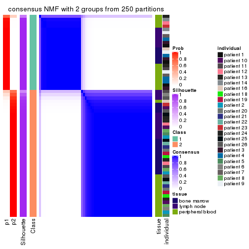</p>

</div>
<div id='tab-ATC-NMF-consensus-heatmap-2'>
<pre><code class="r">consensus_heatmap(res, k = 3)
</code></pre>

<p>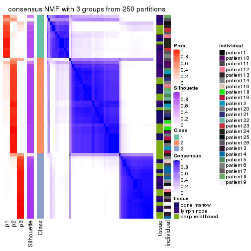</p>

</div>
<div id='tab-ATC-NMF-consensus-heatmap-3'>
<pre><code class="r">consensus_heatmap(res, k = 4)
</code></pre>

<p>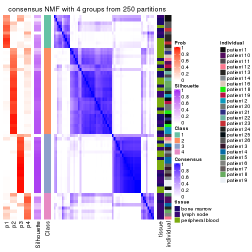</p>

</div>
<div id='tab-ATC-NMF-consensus-heatmap-4'>
<pre><code class="r">consensus_heatmap(res, k = 5)
</code></pre>

<p>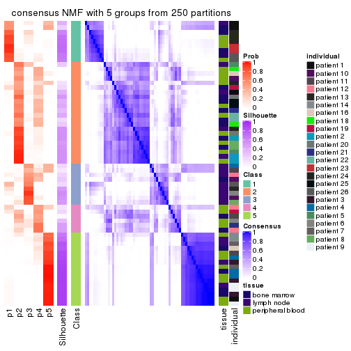</p>

</div>
<div id='tab-ATC-NMF-consensus-heatmap-5'>
<pre><code class="r">consensus_heatmap(res, k = 6)
</code></pre>

<p>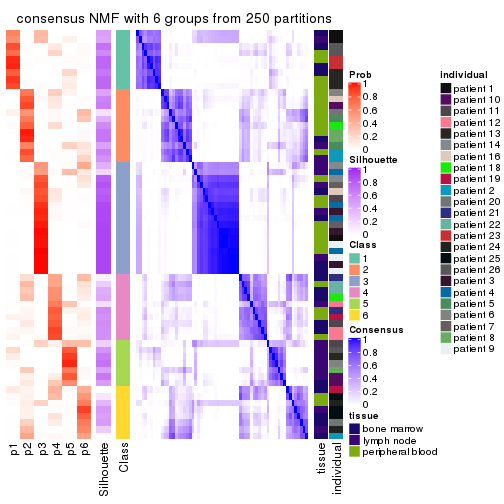</p>

</div>
</div>

Heatmaps for the membership of samples in all partitions to see how consistent they are:


<script>
$( function() {
	$( '#tabs-ATC-NMF-membership-heatmap' ).tabs();
} );
</script>
<div id='tabs-ATC-NMF-membership-heatmap'>
<ul>
<li><a href='#tab-ATC-NMF-membership-heatmap-1'>k = 2</a></li>
<li><a href='#tab-ATC-NMF-membership-heatmap-2'>k = 3</a></li>
<li><a href='#tab-ATC-NMF-membership-heatmap-3'>k = 4</a></li>
<li><a href='#tab-ATC-NMF-membership-heatmap-4'>k = 5</a></li>
<li><a href='#tab-ATC-NMF-membership-heatmap-5'>k = 6</a></li>
</ul>
<div id='tab-ATC-NMF-membership-heatmap-1'>
<pre><code class="r">membership_heatmap(res, k = 2)
</code></pre>

<p>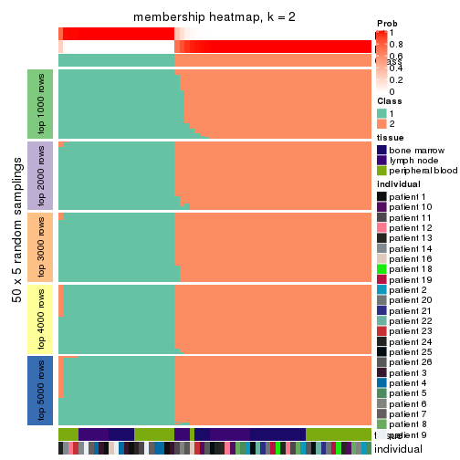</p>

</div>
<div id='tab-ATC-NMF-membership-heatmap-2'>
<pre><code class="r">membership_heatmap(res, k = 3)
</code></pre>

<p>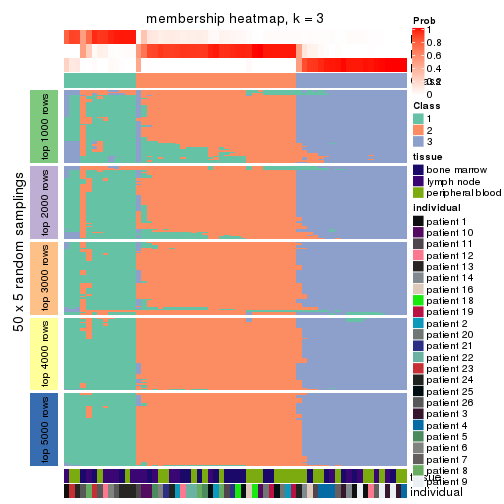</p>

</div>
<div id='tab-ATC-NMF-membership-heatmap-3'>
<pre><code class="r">membership_heatmap(res, k = 4)
</code></pre>

<p>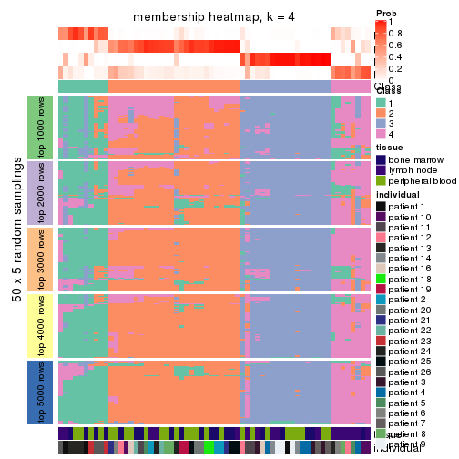</p>

</div>
<div id='tab-ATC-NMF-membership-heatmap-4'>
<pre><code class="r">membership_heatmap(res, k = 5)
</code></pre>

<p>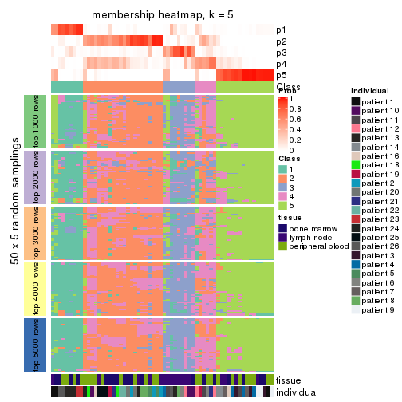</p>

</div>
<div id='tab-ATC-NMF-membership-heatmap-5'>
<pre><code class="r">membership_heatmap(res, k = 6)
</code></pre>

<p>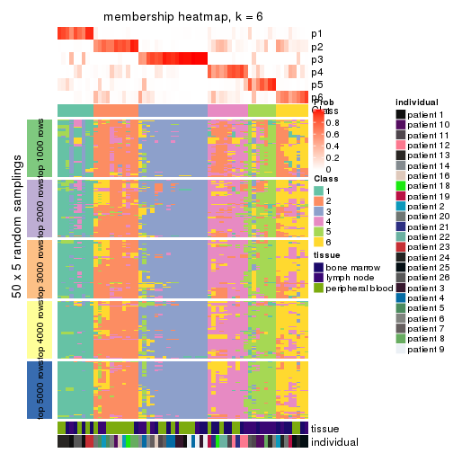</p>

</div>
</div>

As soon as we have had the classes for columns, we can look for signatures
which are significantly different between classes which can be candidate marks
for certain classes. Following are the heatmaps for signatures.


Signature heatmaps where rows are scaled:


<script>
$( function() {
	$( '#tabs-ATC-NMF-get-signatures' ).tabs();
} );
</script>
<div id='tabs-ATC-NMF-get-signatures'>
<ul>
<li><a href='#tab-ATC-NMF-get-signatures-1'>k = 2</a></li>
<li><a href='#tab-ATC-NMF-get-signatures-2'>k = 3</a></li>
<li><a href='#tab-ATC-NMF-get-signatures-3'>k = 4</a></li>
<li><a href='#tab-ATC-NMF-get-signatures-4'>k = 5</a></li>
<li><a href='#tab-ATC-NMF-get-signatures-5'>k = 6</a></li>
</ul>
<div id='tab-ATC-NMF-get-signatures-1'>
<pre><code class="r">get_signatures(res, k = 2)
</code></pre>

<p>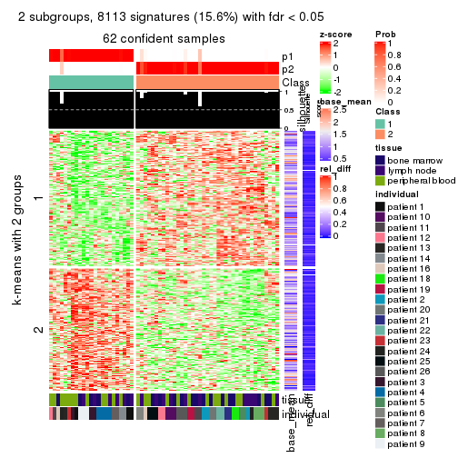</p>

</div>
<div id='tab-ATC-NMF-get-signatures-2'>
<pre><code class="r">get_signatures(res, k = 3)
</code></pre>

<p>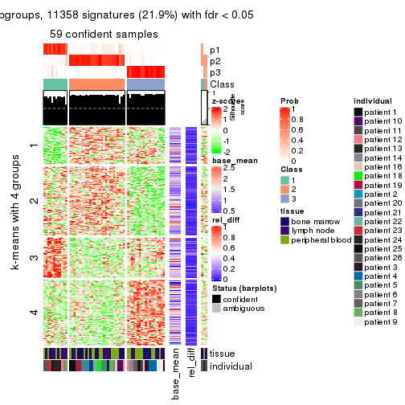</p>

</div>
<div id='tab-ATC-NMF-get-signatures-3'>
<pre><code class="r">get_signatures(res, k = 4)
</code></pre>

<p>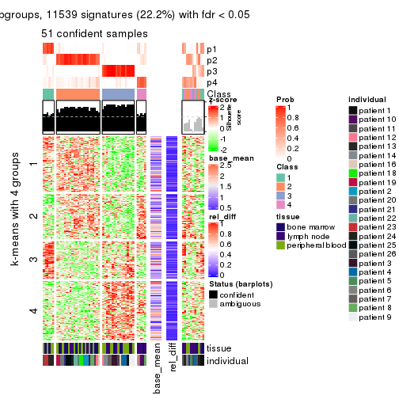</p>

</div>
<div id='tab-ATC-NMF-get-signatures-4'>
<pre><code class="r">get_signatures(res, k = 5)
</code></pre>

<p>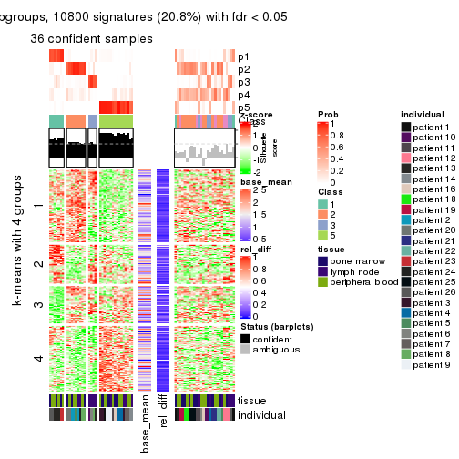</p>

</div>
<div id='tab-ATC-NMF-get-signatures-5'>
<pre><code class="r">get_signatures(res, k = 6)
</code></pre>

<p>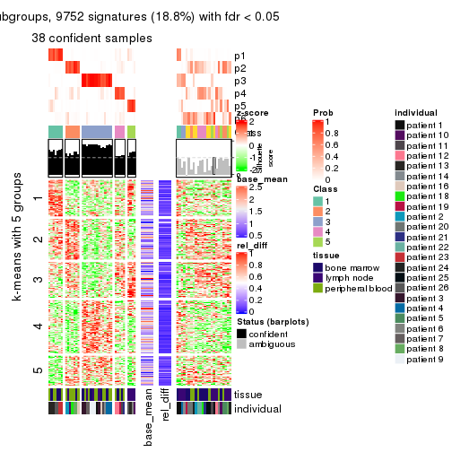</p>

</div>
</div>


Signature heatmaps where rows are not scaled:


<script>
$( function() {
	$( '#tabs-ATC-NMF-get-signatures-no-scale' ).tabs();
} );
</script>
<div id='tabs-ATC-NMF-get-signatures-no-scale'>
<ul>
<li><a href='#tab-ATC-NMF-get-signatures-no-scale-1'>k = 2</a></li>
<li><a href='#tab-ATC-NMF-get-signatures-no-scale-2'>k = 3</a></li>
<li><a href='#tab-ATC-NMF-get-signatures-no-scale-3'>k = 4</a></li>
<li><a href='#tab-ATC-NMF-get-signatures-no-scale-4'>k = 5</a></li>
<li><a href='#tab-ATC-NMF-get-signatures-no-scale-5'>k = 6</a></li>
</ul>
<div id='tab-ATC-NMF-get-signatures-no-scale-1'>
<pre><code class="r">get_signatures(res, k = 2, scale_rows = FALSE)
</code></pre>

<p>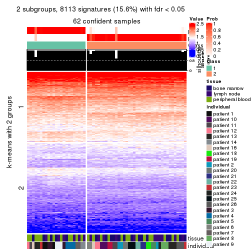</p>

</div>
<div id='tab-ATC-NMF-get-signatures-no-scale-2'>
<pre><code class="r">get_signatures(res, k = 3, scale_rows = FALSE)
</code></pre>

<p>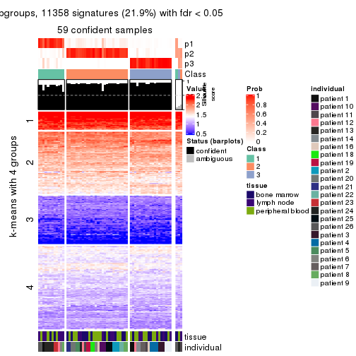</p>

</div>
<div id='tab-ATC-NMF-get-signatures-no-scale-3'>
<pre><code class="r">get_signatures(res, k = 4, scale_rows = FALSE)
</code></pre>

<p>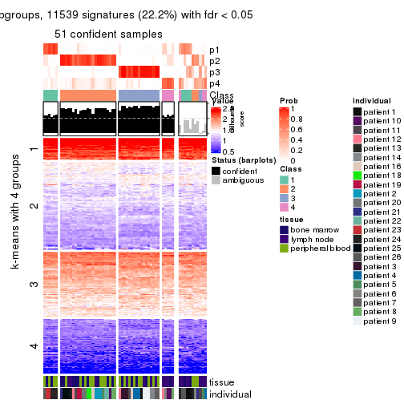</p>

</div>
<div id='tab-ATC-NMF-get-signatures-no-scale-4'>
<pre><code class="r">get_signatures(res, k = 5, scale_rows = FALSE)
</code></pre>

<p>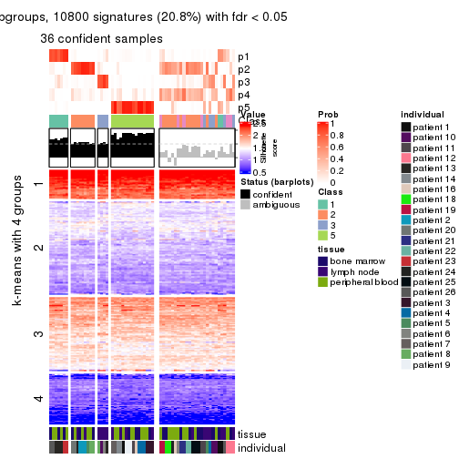</p>

</div>
<div id='tab-ATC-NMF-get-signatures-no-scale-5'>
<pre><code class="r">get_signatures(res, k = 6, scale_rows = FALSE)
</code></pre>

<p>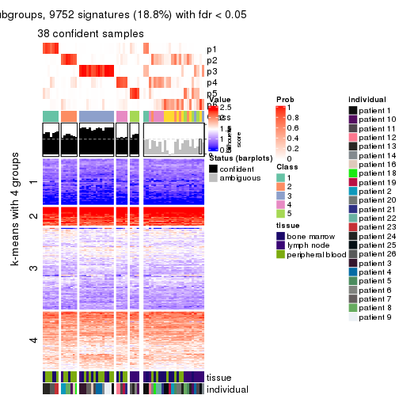</p>

</div>
</div>


Compare the overlap of signatures from different k:

```r
compare_signatures(res)
```

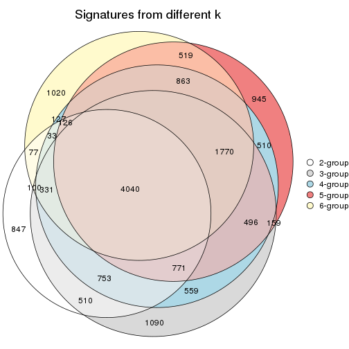

`get_signature()` returns a data frame invisibly. TO get the list of signatures, the function
call should be assigned to a variable explicitly. In following code, if `plot` argument is set
to `FALSE`, no heatmap is plotted while only the differential analysis is performed.

```r
# code only for demonstration
tb = get_signature(res, k = ..., plot = FALSE)
```

An example of the output of `tb` is:

```
#>   which_row         fdr    mean_1    mean_2 scaled_mean_1 scaled_mean_2 km
#> 1        38 0.042760348  8.373488  9.131774    -0.5533452     0.5164555  1
#> 2        40 0.018707592  7.106213  8.469186    -0.6173731     0.5762149  1
#> 3        55 0.019134737 10.221463 11.207825    -0.6159697     0.5749050  1
#> 4        59 0.006059896  5.921854  7.869574    -0.6899429     0.6439467  1
#> 5        60 0.018055526  8.928898 10.211722    -0.6204761     0.5791110  1
#> 6        98 0.009384629 15.714769 14.887706     0.6635654    -0.6193277  2
...
```

The columns in `tb` are:

1. `which_row`: row indices corresponding to the input matrix.
2. `fdr`: FDR for the differential test. 
3. `mean_x`: The mean value in group x.
4. `scaled_mean_x`: The mean value in group x after rows are scaled.
5. `km`: Row groups if k-means clustering is applied to rows.


UMAP plot which shows how samples are separated.


<script>
$( function() {
	$( '#tabs-ATC-NMF-dimension-reduction' ).tabs();
} );
</script>
<div id='tabs-ATC-NMF-dimension-reduction'>
<ul>
<li><a href='#tab-ATC-NMF-dimension-reduction-1'>k = 2</a></li>
<li><a href='#tab-ATC-NMF-dimension-reduction-2'>k = 3</a></li>
<li><a href='#tab-ATC-NMF-dimension-reduction-3'>k = 4</a></li>
<li><a href='#tab-ATC-NMF-dimension-reduction-4'>k = 5</a></li>
<li><a href='#tab-ATC-NMF-dimension-reduction-5'>k = 6</a></li>
</ul>
<div id='tab-ATC-NMF-dimension-reduction-1'>
<pre><code class="r">dimension_reduction(res, k = 2, method = &quot;UMAP&quot;)
</code></pre>

<p>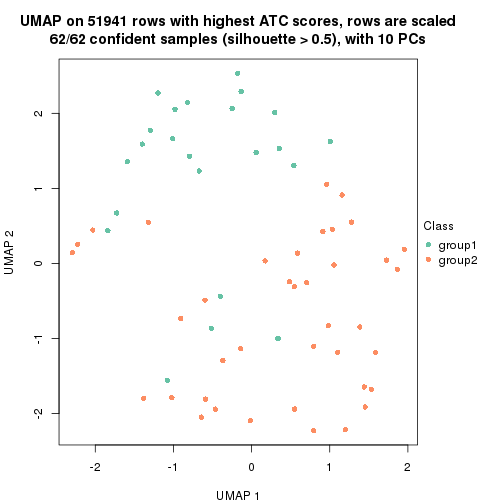</p>

</div>
<div id='tab-ATC-NMF-dimension-reduction-2'>
<pre><code class="r">dimension_reduction(res, k = 3, method = &quot;UMAP&quot;)
</code></pre>

<p>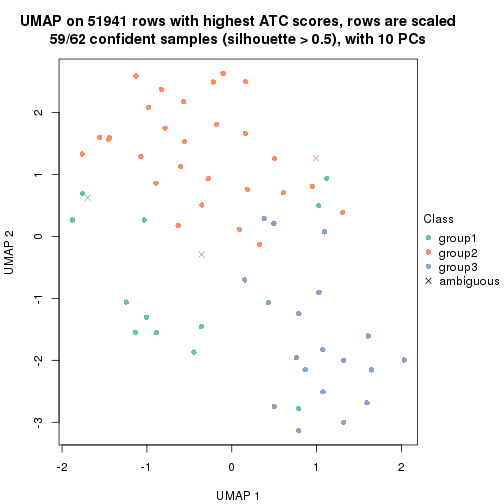</p>

</div>
<div id='tab-ATC-NMF-dimension-reduction-3'>
<pre><code class="r">dimension_reduction(res, k = 4, method = &quot;UMAP&quot;)
</code></pre>

<p>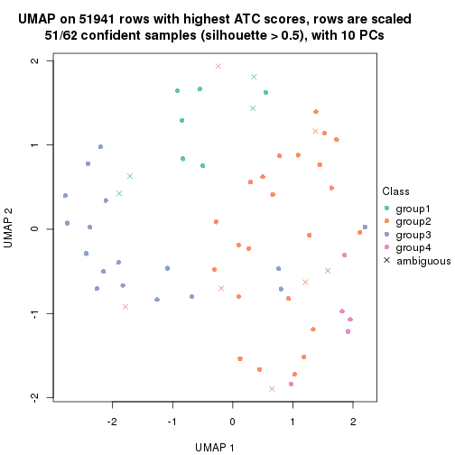</p>

</div>
<div id='tab-ATC-NMF-dimension-reduction-4'>
<pre><code class="r">dimension_reduction(res, k = 5, method = &quot;UMAP&quot;)
</code></pre>

<p>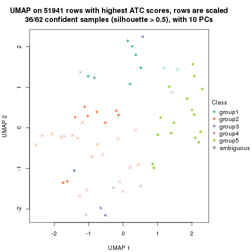</p>

</div>
<div id='tab-ATC-NMF-dimension-reduction-5'>
<pre><code class="r">dimension_reduction(res, k = 6, method = &quot;UMAP&quot;)
</code></pre>

<p>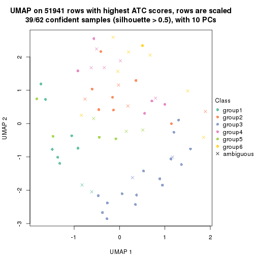</p>

</div>
</div>


Following heatmap shows how subgroups are split when increasing `k`:

```r
collect_classes(res)
```

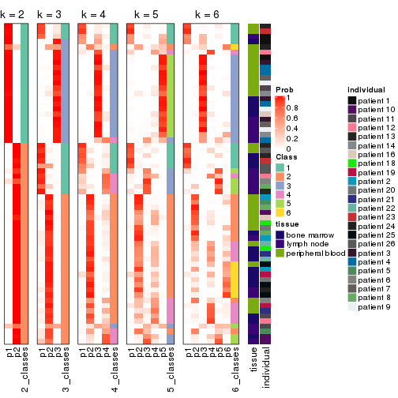


Test correlation between subgroups and known annotations. If the known
annotation is numeric, one-way ANOVA test is applied, and if the known
annotation is discrete, chi-squared contingency table test is applied.

```r
test_to_known_factors(res)
```

```
#>          n tissue(p) individual(p) k
#> ATC:NMF 62    0.3898      2.49e-03 2
#> ATC:NMF 59    0.2750      5.79e-05 3
#> ATC:NMF 51    0.0236      1.12e-04 4
#> ATC:NMF 36    0.0348      8.37e-04 5
#> ATC:NMF 39    0.0152      7.52e-05 6
```


If matrix rows can be associated to genes, consider to use `functional_enrichment(res,
...)` to perform function enrichment for the signature genes. See [this vignette](http://bioconductor.org/packages/devel/bioc/vignettes/cola/inst/doc/functional_enrichment.html) for more detailed explanations.


 

## Session info


```r
sessionInfo()
```

```
#> R version 3.6.0 (2019-04-26)
#> Platform: x86_64-pc-linux-gnu (64-bit)
#> Running under: CentOS Linux 7 (Core)
#> 
#> Matrix products: default
#> BLAS:   /usr/lib64/libblas.so.3.4.2
#> LAPACK: /usr/lib64/liblapack.so.3.4.2
#> 
#> locale:
#>  [1] LC_CTYPE=en_GB.UTF-8       LC_NUMERIC=C               LC_TIME=en_GB.UTF-8       
#>  [4] LC_COLLATE=en_GB.UTF-8     LC_MONETARY=en_GB.UTF-8    LC_MESSAGES=en_GB.UTF-8   
#>  [7] LC_PAPER=en_GB.UTF-8       LC_NAME=C                  LC_ADDRESS=C              
#> [10] LC_TELEPHONE=C             LC_MEASUREMENT=en_GB.UTF-8 LC_IDENTIFICATION=C       
#> 
#> attached base packages:
#> [1] grid      stats     graphics  grDevices utils     datasets  methods   base     
#> 
#> other attached packages:
#> [1] genefilter_1.66.0    ComplexHeatmap_2.3.1 markdown_1.1         knitr_1.26          
#> [5] GetoptLong_0.1.7     cola_1.3.2          
#> 
#> loaded via a namespace (and not attached):
#>  [1] circlize_0.4.8       shape_1.4.4          xfun_0.11            slam_0.1-46         
#>  [5] lattice_0.20-38      splines_3.6.0        colorspace_1.4-1     vctrs_0.2.0         
#>  [9] stats4_3.6.0         blob_1.2.0           XML_3.98-1.20        survival_2.44-1.1   
#> [13] rlang_0.4.2          pillar_1.4.2         DBI_1.0.0            BiocGenerics_0.30.0 
#> [17] bit64_0.9-7          RColorBrewer_1.1-2   matrixStats_0.55.0   stringr_1.4.0       
#> [21] GlobalOptions_0.1.1  evaluate_0.14        memoise_1.1.0        Biobase_2.44.0      
#> [25] IRanges_2.18.3       parallel_3.6.0       AnnotationDbi_1.46.1 highr_0.8           
#> [29] Rcpp_1.0.3           xtable_1.8-4         backports_1.1.5      S4Vectors_0.22.1    
#> [33] annotate_1.62.0      skmeans_0.2-11       bit_1.1-14           microbenchmark_1.4-7
#> [37] brew_1.0-6           impute_1.58.0        rjson_0.2.20         png_0.1-7           
#> [41] digest_0.6.23        stringi_1.4.3        polyclip_1.10-0      clue_0.3-57         
#> [45] tools_3.6.0          bitops_1.0-6         magrittr_1.5         eulerr_6.0.0        
#> [49] RCurl_1.95-4.12      RSQLite_2.1.4        tibble_2.1.3         cluster_2.1.0       
#> [53] crayon_1.3.4         pkgconfig_2.0.3      zeallot_0.1.0        Matrix_1.2-17       
#> [57] xml2_1.2.2           httr_1.4.1           R6_2.4.1             mclust_5.4.5        
#> [61] compiler_3.6.0
```


